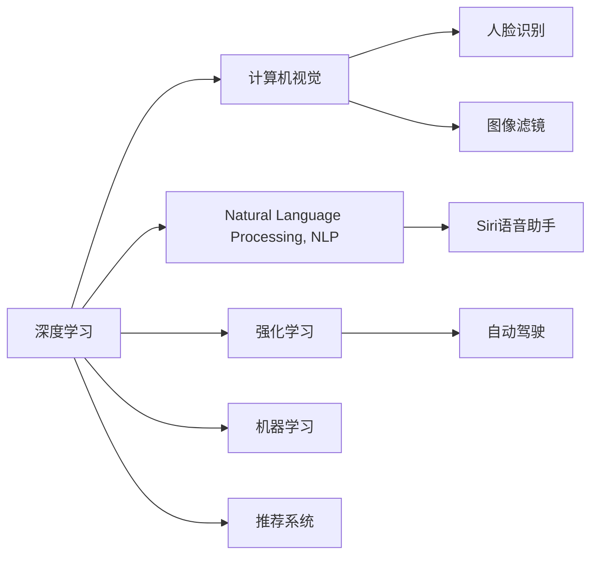

                 

# 李开复：苹果发布AI应用的科技价值

在当今科技飞速发展的时代，人工智能（AI）的应用已经成为推动创新和改变世界的重要力量。然而，AI的应用远不止于科技领域的突破，它已经深刻地融入到各行各业，从医疗、教育、到娱乐，再到我们日常生活中的一举一动，都在受益于AI的力量。本文将从AI在苹果公司应用中的价值和未来发展趋势进行探讨，通过具体案例和科技洞察，展现AI技术的潜力及其在商业和社会中的广泛应用。

## 1. 背景介绍

### 1.1 AI与苹果的相遇
苹果公司，作为全球领先的科技创新企业，一直以来都在寻找将AI技术融入产品和服务中的机会。从2017年引入人脸识别技术到iPhone X的发布，再到2020年发布全新M1芯片的MacBook，苹果不断将AI技术应用于其产品中，提升用户体验和产品竞争力。这些应用不仅增强了苹果产品的智能化水平，也为公司带来了显著的商业成功。

### 1.2 AI技术在苹果产品中的地位
苹果公司深知，AI技术的革新是推动其产品和服务的核心动力之一。AI技术的融入不仅能够提升产品的智能化和用户体验，还能助力苹果在激烈的科技市场竞争中保持领先地位。通过AI技术的应用，苹果得以在语音识别、图像处理、自然语言处理等领域不断突破，推出创新产品，如Siri语音助手、Face ID人脸识别、图像滤镜、文本编辑工具等，极大地增强了产品的差异化优势。

## 2. 核心概念与联系

### 2.1 核心概念概述

苹果公司应用AI技术的核心概念主要包括以下几点：

- **深度学习（Deep Learning）**：一种基于多层神经网络的机器学习技术，能够处理大规模数据集，实现复杂模式识别和预测。
- **计算机视觉（Computer Vision）**：让计算机能够理解和处理图像和视频内容的技术，广泛应用于人脸识别、图像滤镜、增强现实（AR）等领域。
- **自然语言处理（Natural Language Processing, NLP）**：使计算机能够理解、生成和处理人类语言的技术，广泛应用于Siri语音助手、文本编辑工具等。
- **强化学习（Reinforcement Learning）**：通过奖励机制指导计算机进行决策和学习的技术，应用于自动化驾驶、游戏AI等领域。
- **机器学习（Machine Learning）**：使计算机能够通过数据学习和优化算法，广泛应用于推荐系统、图像识别、语音识别等领域。

这些技术构成了苹果公司AI应用的基础，并通过相互融合和应用，提升了产品性能和用户体验。

### 2.2 核心概念原理和架构的 Mermaid 流程图



### 2.3 核心概念联系

深度学习、计算机视觉、自然语言处理、强化学习和机器学习构成了苹果公司AI应用的基本技术框架。深度学习提供强大的模式识别能力，计算机视觉使计算机能够理解和处理图像和视频，自然语言处理提升人与计算机的交互体验，强化学习优化决策过程，机器学习则在多个领域发挥作用。这些技术通过相互结合，形成了苹果公司AI应用的技术生态。

## 3. 核心算法原理 & 具体操作步骤

### 3.1 算法原理概述

苹果公司应用AI技术的核心算法原理主要基于以下几个方面：

- **深度神经网络**：苹果公司广泛应用深度神经网络，通过多层非线性变换，学习输入数据的高维特征，提升模型的预测和分类能力。
- **卷积神经网络（CNN）**：应用于计算机视觉领域，通过卷积操作提取图像中的特征，用于人脸识别、图像分类等任务。
- **循环神经网络（RNN）和Transformer模型**：应用于自然语言处理领域，通过循环或自注意力机制处理序列数据，用于语言理解、机器翻译、对话系统等任务。
- **强化学习算法**：应用于游戏AI、自动驾驶等领域，通过奖励机制和策略优化，实现自主决策和行为学习。

### 3.2 算法步骤详解

苹果公司应用AI技术的基本步骤如下：

1. **数据收集与预处理**：收集和整理用于训练和测试的数据，进行数据清洗和预处理，确保数据质量。
2. **模型选择与构建**：根据任务需求选择合适的模型架构，如卷积神经网络、循环神经网络等，并进行模型构建。
3. **模型训练与优化**：使用大量标注数据进行模型训练，通过反向传播算法优化模型参数，提升模型性能。
4. **模型评估与测试**：在测试集上评估模型性能，使用各种评估指标如准确率、召回率、F1分数等，确定模型是否达到预期效果。
5. **模型部署与应用**：将训练好的模型部署到实际应用中，如iPhone、MacBook、iPad等设备，提升用户体验和产品竞争力。

### 3.3 算法优缺点

苹果公司应用AI技术的优点主要体现在以下几个方面：

- **高性能与高效能**：通过深度神经网络、卷积神经网络和Transformer模型，苹果公司能够实现高性能的图像和语音处理，提升用户体验。
- **良好的用户体验**：通过自然语言处理技术，苹果公司开发出流畅的语音助手和文本编辑工具，提升人机交互体验。
- **跨平台集成**：苹果公司的AI技术能够跨多个平台集成，如iPhone、MacBook、iPad等，实现设备间的无缝连接和协作。

然而，苹果公司应用AI技术也面临一些挑战：

- **数据隐私和安全**：AI技术的应用需要大量的数据支持，但数据隐私和安全问题一直备受关注，苹果公司需要采取措施保护用户数据。
- **模型复杂度**：深度神经网络和Transformer模型虽然性能优越，但模型复杂度高，训练和部署需要大量计算资源。
- **技术壁垒**：AI技术的开发和应用需要高水平的技术支持，对团队的技术水平和研发能力提出了较高要求。

### 3.4 算法应用领域

苹果公司应用AI技术的领域主要包括：

- **智能手机**：如Siri语音助手、Face ID人脸识别、图像滤镜、文本编辑工具等。
- **平板电脑**：如iPad上的实时翻译、智能键盘、手写识别等。
- **计算机**：如MacBook上的Siri语音助手、推荐系统、图像处理等。
- **增强现实（AR）**：如ARKit开发平台，用于开发增强现实应用。
- **自动驾驶**：苹果公司通过AI技术推动自动驾驶技术的研发，提升车辆智能化水平。

## 4. 数学模型和公式 & 详细讲解 & 举例说明

### 4.1 数学模型构建

苹果公司应用AI技术的数学模型主要基于以下几种类型：

- **卷积神经网络**：用于图像处理和计算机视觉任务，构建模型时使用卷积层、池化层和全连接层。
- **循环神经网络**：用于自然语言处理任务，构建模型时使用RNN、LSTM或GRU等循环结构。
- **Transformer模型**：用于自然语言处理任务，通过自注意力机制处理序列数据。
- **强化学习算法**：如Q-learning、策略梯度等，用于自动化驾驶和游戏AI。

### 4.2 公式推导过程

以卷积神经网络为例，其基本公式为：

$$ y=f(Wx+b) $$

其中 $y$ 表示输出结果，$x$ 表示输入数据，$W$ 表示卷积核，$b$ 表示偏置，$f$ 表示激活函数。

### 4.3 案例分析与讲解

苹果公司利用卷积神经网络进行人脸识别的案例分析：

1. **数据准备**：收集包含人脸图像和标签的数据集，如FaceNet数据集。
2. **模型构建**：构建卷积神经网络，包含卷积层、池化层和全连接层。
3. **模型训练**：使用训练集进行模型训练，优化卷积核和偏置参数。
4. **模型测试**：在测试集上评估模型性能，如准确率和召回率。
5. **模型部署**：将训练好的模型部署到设备上，实现实时人脸识别功能。

## 5. 项目实践：代码实例和详细解释说明

### 5.1 开发环境搭建

在进行AI项目实践前，需要准备好开发环境。以下是使用Python进行TensorFlow开发的环境配置流程：

1. 安装Anaconda：从官网下载并安装Anaconda，用于创建独立的Python环境。
2. 创建并激活虚拟环境：
```bash
conda create -n tf-env python=3.8 
conda activate tf-env
```
3. 安装TensorFlow：根据CUDA版本，从官网获取对应的安装命令。例如：
```bash
conda install tensorflow=2.7 -c conda-forge
```
4. 安装各类工具包：
```bash
pip install numpy pandas scikit-learn matplotlib tqdm jupyter notebook ipython
```
完成上述步骤后，即可在`tf-env`环境中开始AI项目实践。

### 5.2 源代码详细实现

以下是苹果公司利用卷积神经网络进行人脸识别的Python代码实现：

```python
import tensorflow as tf
from tensorflow.keras.layers import Conv2D, MaxPooling2D, Flatten, Dense, Dropout
from tensorflow.keras.models import Sequential
from tensorflow.keras.preprocessing.image import ImageDataGenerator

# 构建卷积神经网络模型
model = Sequential([
    Conv2D(32, (3, 3), activation='relu', input_shape=(64, 64, 3)),
    MaxPooling2D((2, 2)),
    Conv2D(64, (3, 3), activation='relu'),
    MaxPooling2D((2, 2)),
    Flatten(),
    Dense(128, activation='relu'),
    Dropout(0.5),
    Dense(2, activation='softmax')
])

# 编译模型
model.compile(optimizer='adam', loss='categorical_crossentropy', metrics=['accuracy'])

# 数据增强
train_datagen = ImageDataGenerator(rescale=1./255, shear_range=0.2, zoom_range=0.2, horizontal_flip=True)
test_datagen = ImageDataGenerator(rescale=1./255)

# 数据加载
train_generator = train_datagen.flow_from_directory('train', target_size=(64, 64), batch_size=32, class_mode='categorical')
test_generator = test_datagen.flow_from_directory('test', target_size=(64, 64), batch_size=32, class_mode='categorical')

# 模型训练
model.fit(train_generator, epochs=10, validation_data=test_generator)
```

### 5.3 代码解读与分析

让我们再详细解读一下关键代码的实现细节：

- **模型构建**：使用Keras API构建卷积神经网络，包含卷积层、池化层、全连接层和Dropout层。
- **数据增强**：使用ImageDataGenerator进行数据增强，增加数据多样性，防止过拟合。
- **模型训练**：使用fit方法训练模型，设定优化器、损失函数和评估指标。
- **模型测试**：使用test_generator在测试集上评估模型性能。

## 6. 实际应用场景

### 6.1 智能手机

苹果公司的AI技术在智能手机上的应用已经非常广泛，如Siri语音助手、Face ID人脸识别、图像滤镜、文本编辑工具等。这些应用不仅提升了智能手机的智能化水平，还为用户带来了便捷和流畅的使用体验。

**案例分析**：
- **Siri语音助手**：利用自然语言处理技术，Siri能够理解用户的语音指令，并执行相应的操作，如打电话、发短信、播放音乐等。Siri的语音识别和自然语言处理技术，使其成为智能手机上的重要交互工具。
- **Face ID人脸识别**：通过计算机视觉技术，Face ID能够实现快速、安全的用户身份验证。Face ID的人脸识别技术，使得用户解锁设备变得更加便捷和可靠。

### 6.2 平板电脑

苹果公司的AI技术在平板电脑上的应用主要体现在iPad上。iPad上集成了苹果公司的多种AI技术，如实时翻译、智能键盘、手写识别等，提升了用户的使用体验。

**案例分析**：
- **实时翻译**：通过卷积神经网络和Transformer模型，iPad能够实时翻译输入的文本，支持多语言交流。
- **智能键盘**：利用自然语言处理技术，iPad的智能键盘能够根据用户的输入习惯，提供更加个性化的推荐，提升打字效率和准确率。
- **手写识别**：通过深度学习技术，iPad能够识别用户的手写输入，并将其转换为可编辑的文本。

### 6.3 计算机

苹果公司的AI技术在计算机上的应用主要体现在MacBook上。MacBook上集成了苹果公司的多种AI技术，如Siri语音助手、推荐系统、图像处理等，提升了计算机的智能化水平和用户体验。

**案例分析**：
- **Siri语音助手**：通过自然语言处理技术，MacBook的Siri语音助手能够理解用户的语音指令，并执行相应的操作。
- **推荐系统**：利用机器学习技术，MacBook能够根据用户的浏览和搜索历史，推荐感兴趣的内容和应用程序。
- **图像处理**：通过卷积神经网络和深度学习技术，MacBook能够处理和分析图像数据，实现高效的图像编辑和处理。

### 6.4 增强现实（AR）

苹果公司的AI技术在增强现实（AR）领域的应用主要体现在ARKit开发平台上。ARKit开发平台支持开发者利用苹果公司的AI技术，开发增强现实应用。

**案例分析**：
- **人脸识别**：通过计算机视觉技术，ARKit能够实现对人脸的三维建模和交互。
- **物体识别**：利用卷积神经网络，ARKit能够识别和跟踪环境中的物体，实现丰富的交互功能。
- **自然语言处理**：通过自然语言处理技术，ARKit能够理解用户的语音指令，提供更加自然的人机交互体验。

## 7. 工具和资源推荐

### 7.1 学习资源推荐

为了帮助开发者系统掌握AI技术的应用，这里推荐一些优质的学习资源：

1. **《深度学习》课程**：斯坦福大学的Andrew Ng教授开设的深度学习课程，系统介绍了深度学习的基本原理和应用。
2. **《TensorFlow官方文档》**：TensorFlow的官方文档，提供了详细的API和教程，是学习和实践TensorFlow的必备资源。
3. **《自然语言处理综论》**：斯坦福大学NLP课程，系统讲解了自然语言处理的基本概念和技术。
4. **《计算机视觉：算法与应用》**：Khan Academy提供的计算机视觉课程，介绍了计算机视觉的基本原理和应用。
5. **《强化学习》课程**：Coursera上的强化学习课程，系统讲解了强化学习的基本原理和应用。

### 7.2 开发工具推荐

高效的开发离不开优秀的工具支持。以下是几款用于AI项目开发的常用工具：

1. **TensorFlow**：由Google主导开发的开源深度学习框架，支持分布式计算和GPU加速，是学习和实践深度学习的重要工具。
2. **Keras**：一个高级神经网络API，提供了简单易用的API，适合快速原型开发。
3. **PyTorch**：由Facebook开发的深度学习框架，支持动态计算图和GPU加速，是研究和实践深度学习的重要工具。
4. **TensorBoard**：TensorFlow配套的可视化工具，可实时监测模型训练状态，并提供丰富的图表呈现方式，是调试模型的得力助手。
5. **Weights & Biases**：模型训练的实验跟踪工具，可以记录和可视化模型训练过程中的各项指标，方便对比和调优。

### 7.3 相关论文推荐

AI技术的发展离不开学界的持续研究。以下是几篇奠基性的相关论文，推荐阅读：

1. **《深度学习》**：Ian Goodfellow、Yoshua Bengio和Aaron Courville合著的深度学习经典书籍，系统介绍了深度学习的基本原理和应用。
2. **《计算机视觉：算法与应用》**：Richard Szeliski合著的计算机视觉经典书籍，系统讲解了计算机视觉的基本原理和应用。
3. **《自然语言处理综论》**：Daniel Jurafsky和James H. Martin合著的自然语言处理经典书籍，系统讲解了自然语言处理的基本概念和技术。
4. **《强化学习》**：Richard S. Sutton和Andrew G. Barto合著的强化学习经典书籍，系统讲解了强化学习的基本原理和应用。

## 8. 总结：未来发展趋势与挑战

### 8.1 总结

本文对苹果公司应用AI技术的价值和未来发展趋势进行了探讨。通过具体案例和科技洞察，展示了AI技术在智能手机、平板电脑、计算机和增强现实等领域的广泛应用，并分析了苹果公司AI应用的核心算法原理和操作步骤。

通过本文的系统梳理，可以看到，AI技术的融合和应用已经成为推动苹果公司技术创新的核心动力之一。未来，苹果公司将进一步探索AI技术在医疗、教育、娱乐等领域的应用，不断拓展其科技价值。

### 8.2 未来发展趋势

展望未来，苹果公司应用AI技术的发展趋势将主要体现在以下几个方面：

1. **更智能化的设备**：苹果公司将进一步提升其设备的智能化水平，通过AI技术实现更加自然的用户交互和个性化服务。
2. **更广泛的应用场景**：苹果公司将把AI技术应用于更多的领域，如医疗、教育、娱乐等，提升各个行业的智能化水平。
3. **更高的计算效率**：苹果公司将不断优化AI算法的计算效率，提升设备的响应速度和用户体验。
4. **更强大的数据处理能力**：苹果公司将进一步提升其设备的计算和存储能力，支持更加复杂和数据密集型的AI应用。
5. **更广泛的合作和生态系统**：苹果公司将加强与其他科技公司和生态系统的合作，推动AI技术的更广泛应用。

### 8.3 面临的挑战

苹果公司应用AI技术虽然取得了显著的成就，但在迈向更加智能化和普适化的过程中，仍面临一些挑战：

1. **数据隐私和安全**：AI技术的应用需要大量的数据支持，但数据隐私和安全问题一直备受关注，苹果公司需要采取措施保护用户数据。
2. **技术壁垒**：AI技术的开发和应用需要高水平的技术支持，对团队的技术水平和研发能力提出了较高要求。
3. **计算资源需求**：AI技术的计算需求高，需要大量的计算资源，苹果公司需要持续投入资源进行技术优化和研发。

### 8.4 研究展望

面对AI技术应用中的挑战，未来的研究需要在以下几个方面寻求新的突破：

1. **更高效的数据处理**：研究高效的数据处理技术，如分布式计算、边缘计算等，提升数据处理效率。
2. **更安全的数据保护**：研究数据隐私保护技术，如差分隐私、联邦学习等，确保用户数据的安全。
3. **更优化的算法和模型**：研究更高效的AI算法和模型，提升计算效率和模型性能。
4. **更广泛的应用场景**：探索AI技术在更多领域的应用，推动AI技术的普适化。
5. **更强大的跨平台集成**：研究跨平台集成技术，实现设备间的无缝连接和协作。

## 9. 附录：常见问题与解答

**Q1：苹果公司应用AI技术的优点有哪些？**

A: 苹果公司应用AI技术的优点主要体现在以下几个方面：

- **高性能与高效能**：通过深度神经网络、卷积神经网络和Transformer模型，苹果公司能够实现高性能的图像和语音处理，提升用户体验。
- **良好的用户体验**：通过自然语言处理技术，苹果公司开发出流畅的语音助手和文本编辑工具，提升人机交互体验。
- **跨平台集成**：苹果公司的AI技术能够跨多个平台集成，如iPhone、MacBook、iPad等，实现设备间的无缝连接和协作。

**Q2：苹果公司应用AI技术面临哪些挑战？**

A: 苹果公司应用AI技术面临的挑战主要体现在以下几个方面：

- **数据隐私和安全**：AI技术的应用需要大量的数据支持，但数据隐私和安全问题一直备受关注，苹果公司需要采取措施保护用户数据。
- **技术壁垒**：AI技术的开发和应用需要高水平的技术支持，对团队的技术水平和研发能力提出了较高要求。
- **计算资源需求**：AI技术的计算需求高，需要大量的计算资源，苹果公司需要持续投入资源进行技术优化和研发。

**Q3：苹果公司如何优化其AI技术的计算效率？**

A: 苹果公司通过以下几个方面优化其AI技术的计算效率：

- **分布式计算**：通过分布式计算，将计算任务分解为多个子任务，在不同的计算节点上并行处理，提升计算效率。
- **边缘计算**：通过将计算任务迁移到设备端进行，减少数据传输和计算延迟，提升计算效率。
- **模型压缩和优化**：通过模型压缩和优化技术，减少模型参数和计算量，提升计算效率。

**Q4：苹果公司如何确保其AI技术的计算资源需求？**

A: 苹果公司通过以下几个方面确保其AI技术的计算资源需求：

- **自研芯片**：苹果公司自研了高性能芯片，如M1芯片，提供强大的计算能力，满足AI技术的计算需求。
- **云计算支持**：苹果公司利用云计算平台，提供弹性计算资源，满足不同规模的AI应用需求。
- **合作与生态系统**：苹果公司与硬件厂商、云计算提供商等建立合作关系，提供更广泛的计算资源支持。

**Q5：苹果公司如何保护其AI技术的数据隐私和安全？**

A: 苹果公司通过以下几个方面保护其AI技术的数据隐私和安全：

- **差分隐私**：苹果公司利用差分隐私技术，对用户数据进行匿名化处理，保护用户隐私。
- **联邦学习**：苹果公司利用联邦学习技术，在设备端进行模型训练，避免将数据传输到云端，保护数据隐私。
- **加密技术**：苹果公司利用加密技术，对数据进行加密传输和存储，保护数据安全。

