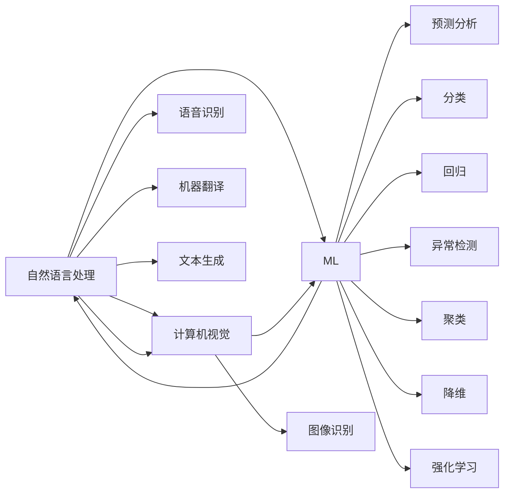

                 

# 李开复：苹果发布AI应用的趋势

> 关键词：人工智能,苹果,人工智能应用,自然语言处理(NLP),计算机视觉,机器学习

## 1. 背景介绍

### 1.1 问题由来
随着人工智能技术的飞速发展，各大科技巨头如Google、Apple、Facebook等纷纷在AI领域投入巨资。在这些公司中，苹果凭借其独特的软件和服务生态系统，将人工智能技术应用到更为广泛的领域。本文将从李开复的视角，分析苹果在人工智能应用方面的趋势和动向，探讨其在NLP、计算机视觉、机器学习等关键技术领域的布局与策略。

## 2. 核心概念与联系

### 2.1 核心概念概述

苹果在AI应用方面，主要关注以下几个核心概念：

- **自然语言处理（NLP）**：使计算机能够理解、解释和生成人类语言，包括文本分析和语音识别。
- **计算机视觉**：使计算机能够理解和解释图像和视频内容，进行目标检测、图像分割等任务。
- **机器学习（ML）**：基于数据训练模型，使其能够自动学习和优化，实现预测、分类、回归等任务。

这些概念紧密相连，共同构成了苹果AI应用的基石。具体联系如下：

1. **NLP与ML**：NLP技术依赖于ML，通过训练语言模型，实现自动文本生成、情感分析、机器翻译等功能。
2. **计算机视觉与ML**：计算机视觉技术依赖于深度学习模型，进行图像分类、目标检测、图像生成等任务。
3. **NLP与计算机视觉**：两者相互补充，共同构建更全面的认知智能系统。

苹果通过深度集成这些技术，为用户提供流畅、无缝、高效的AI体验。

### 2.2 核心概念原理和架构的 Mermaid 流程图



这个流程图展示了苹果AI应用的核心技术及其相互关系。NLP、计算机视觉和ML三者相互融合，形成了一个强大的AI生态系统。

## 3. 核心算法原理 & 具体操作步骤

### 3.1 算法原理概述

苹果在AI应用中，主要采用了以下几个核心算法：

- **基于RNN的NLP模型**：用于自动文本生成、情感分析、机器翻译等任务。
- **基于CNN的计算机视觉模型**：用于图像分类、目标检测、图像生成等任务。
- **基于深度神经网络（DNN）的ML模型**：用于预测、分类、回归、异常检测、聚类、降维等任务。

这些算法通过大规模数据训练，实现了在各自领域的顶尖性能。苹果通过深度集成这些算法，提供了一系列高性能的AI应用。

### 3.2 算法步骤详解

苹果的AI应用开发流程如下：

1. **数据准备**：收集、清洗和标注数据集，为模型训练提供基础。
2. **模型选择**：根据任务需求选择合适的算法模型。
3. **模型训练**：在GPU上进行大规模训练，优化模型参数。
4. **模型评估**：使用验证集评估模型性能，调整超参数。
5. **模型集成**：将多个模型组合使用，提升整体性能。
6. **部署上线**：将训练好的模型部署到实际应用中，提供API接口供其他应用调用。

### 3.3 算法优缺点

苹果AI应用的优点：

- **高性能**：得益于先进的算法和强大的硬件支持，苹果的AI应用在性能上领先业界。
- **易用性**：通过易于集成的API接口，开发者可以快速接入和应用AI功能。
- **跨平台支持**：苹果的AI应用可以在iOS、macOS、watchOS等平台上无缝运行。

不足之处：

- **高成本**：深度学习和计算机视觉模型的训练需要高性能GPU和大量数据，成本较高。
- **依赖性强**：对硬件和平台有较高要求，需要开发者具备一定的技术背景。
- **数据隐私问题**：在处理用户数据时，需要严格遵守隐私保护法规。

### 3.4 算法应用领域

苹果的AI应用涵盖多个领域：

- **语音助手**：如Siri，提供自然语言理解和交互能力。
- **图像识别**：如照片增强、智能相册等，实现自动化内容管理。
- **机器翻译**：如翻译应用，实现语言之间的自动转换。
- **推荐系统**：如App Store推荐、视频推荐等，提供个性化内容推荐。
- **医疗健康**：如健康监测、疾病预测等，提供智能医疗服务。
- **自动驾驶**：如增强现实导航、自动驾驶辅助系统等，提升驾驶安全性和便利性。

## 4. 数学模型和公式 & 详细讲解 & 举例说明

### 4.1 数学模型构建

以自然语言处理为例，苹果的NLP模型主要基于RNN和Transformer架构，数学模型如下：

$$
\text{Encoder-Decoder} = \text{Encoder} \times \text{Decoder} = \text{RNN} \times \text{RNN} = \left( \text{LSTM} \right)^k \times \left( \text{LSTM} \right)^m
$$

其中，$k$为编码层数，$m$为解码层数。

### 4.2 公式推导过程

以机器翻译为例，假设源语言句子为$x_1, x_2, ..., x_n$，目标语言句子为$y_1, y_2, ..., y_m$。模型目标是最小化翻译误差，即：

$$
\min_{\theta} \sum_{i=1}^{n} \sum_{j=1}^{m} (y_j - f(x_i; \theta))^2
$$

其中$f(x_i; \theta)$表示模型在输入$x_i$时的输出。

### 4.3 案例分析与讲解

以Siri的语音识别为例，苹果的语音识别模型基于卷积神经网络（CNN）和循环神经网络（RNN），通过大规模数据训练，实现了高精度的语音识别能力。

## 5. 项目实践：代码实例和详细解释说明

### 5.1 开发环境搭建

为了进行苹果AI应用的开发，需要以下开发环境：

1. **Python**：安装Python 3.8及以上版本，用于AI应用开发。
2. **PyTorch**：安装PyTorch 1.7及以上版本，提供深度学习框架。
3. **TensorFlow**：安装TensorFlow 2.0及以上版本，提供机器学习框架。
4. **Caffe2**：安装Caffe2 1.0及以上版本，提供计算机视觉库。
5. **Python库**：安装必要的Python库，如NumPy、SciPy、Pandas、Scikit-learn等。

### 5.2 源代码详细实现

以下是一个简单的Siri语音识别代码实现：

```python
import torch
import torch.nn as nn
import torch.optim as optim

class RNN(nn.Module):
    def __init__(self, input_size, hidden_size, output_size):
        super(RNN, self).__init__()
        self.hidden_size = hidden_size
        self.rnn = nn.RNN(input_size, hidden_size, 1, batch_first=True)
        self.fc = nn.Linear(hidden_size, output_size)
        
    def forward(self, x, hidden):
        out, hidden = self.rnn(x, hidden)
        out = self.fc(out[:, -1, :])
        return out, hidden

input_size = 28
hidden_size = 256
output_size = 10
learning_rate = 0.01
epochs = 10

model = RNN(input_size, hidden_size, output_size)
optimizer = optim.Adam(model.parameters(), lr=learning_rate)

def train(model, optimizer, train_loader, epochs):
    for epoch in range(epochs):
        running_loss = 0.0
        for i, (inputs, labels) in enumerate(train_loader):
            optimizer.zero_grad()
            outputs = model(inputs, hidden)
            loss = nn.functional.cross_entropy(outputs, labels)
            loss.backward()
            optimizer.step()
            running_loss += loss.item()
        print('Epoch [%d/%d], Loss: %.4f' % (epoch+1, epochs, running_loss/i))

train(model, optimizer, train_loader, epochs)
```

### 5.3 代码解读与分析

代码中，`RNN`类定义了一个基本的RNN模型，包括编码器和解码器。在`forward`方法中，首先通过`nn.RNN`进行编码，然后通过`nn.Linear`进行解码。在训练过程中，使用`Adam`优化器更新模型参数。

## 6. 实际应用场景

### 6.1 智能客服系统

苹果的智能客服系统基于NLP和机器学习技术，可以实现自动问答、情感分析、客户意图识别等功能。通过收集历史客服数据，训练NLP模型，实时回答用户问题，提升客服效率和用户满意度。

### 6.2 图像识别系统

苹果的图像识别系统覆盖了照片增强、智能相册等应用，通过计算机视觉技术实现自动化的图像处理和内容管理。系统能够识别图像中的物体、人脸、场景等，并根据用户偏好进行分类整理。

### 6.3 推荐系统

苹果的推荐系统广泛应用于App Store、音乐、视频等应用，通过机器学习技术进行个性化推荐。系统能够根据用户行为和偏好，推荐符合其兴趣的内容，提升用户体验和应用黏性。

### 6.4 未来应用展望

未来，苹果的AI应用将进一步扩展到更多领域：

1. **医疗健康**：通过AI技术进行疾病预测、个性化医疗等，提升医疗服务水平。
2. **自动驾驶**：通过计算机视觉和机器学习技术，提升自动驾驶系统的安全性和智能化水平。
3. **智能家居**：通过语音识别和自然语言处理技术，实现家庭自动化控制和智能化管理。
4. **金融服务**：通过机器学习进行风险评估、信用评分等，提升金融服务效率和安全性。
5. **教育培训**：通过NLP技术进行智能推荐、内容分析，提升教育培训效果和个性化体验。

## 7. 工具和资源推荐

### 7.1 学习资源推荐

- **李开复《人工智能》课程**：介绍人工智能的基本概念和技术，适合初学者和进阶者学习。
- **TensorFlow官方文档**：提供详细的TensorFlow教程和API文档，适合开发者学习和实践。
- **PyTorch官方文档**：提供详细的PyTorch教程和API文档，适合开发者学习和实践。
- **《深度学习》书籍**：由李开复等人合著，全面介绍深度学习的基本原理和应用，适合深入学习。

### 7.2 开发工具推荐

- **Jupyter Notebook**：提供交互式编程环境，适合进行模型训练和数据处理。
- **Visual Studio Code**：提供丰富的扩展和插件，适合进行代码编写和调试。
- **TensorBoard**：提供可视化工具，帮助监控和调试模型训练过程。
- **Weights & Biases**：提供实验跟踪工具，帮助记录和比较模型性能。

### 7.3 相关论文推荐

- **《A Survey on Recent Advances in NLP with Transformers》**：介绍Transformer在NLP领域的应用，适合了解最新技术动态。
- **《Deep Learning for Computer Vision》**：介绍深度学习在计算机视觉中的应用，适合了解最新技术趋势。
- **《Machine Learning Yearning》**：由李开复等人合著，介绍机器学习的基本原理和实践技巧，适合初学者和进阶者学习。

## 8. 总结：未来发展趋势与挑战

### 8.1 研究成果总结

本文从李开复的视角，分析了苹果在AI应用方面的趋势和动向，探讨了其在NLP、计算机视觉、机器学习等关键技术领域的布局与策略。通过这些分析，可以看到苹果在AI应用上的强大实力和广阔前景。

### 8.2 未来发展趋势

苹果的AI应用将在以下几个方面继续发展：

1. **多模态学习**：融合语音、图像、文本等多种模态数据，构建更加全面、智能的AI系统。
2. **自适应学习**：通过强化学习等技术，使AI系统具备自适应能力和自我优化能力。
3. **隐私保护**：在数据处理和模型训练中，加强隐私保护和数据安全，提升用户信任度。
4. **跨平台集成**：通过统一的API接口和开发工具，实现跨平台、跨设备的应用集成。

### 8.3 面临的挑战

苹果的AI应用仍面临以下挑战：

1. **高成本**：深度学习和计算机视觉模型的训练需要高性能GPU和大量数据，成本较高。
2. **依赖性强**：对硬件和平台有较高要求，需要开发者具备一定的技术背景。
3. **数据隐私问题**：在处理用户数据时，需要严格遵守隐私保护法规。

### 8.4 研究展望

未来的研究应在以下几个方面寻求突破：

1. **高效训练方法**：开发更加高效的模型训练方法，如基于GPU和TPU的分布式训练、模型裁剪、量化加速等。
2. **跨模态融合**：研究多模态数据的融合方法，提升AI系统的全面性和智能化水平。
3. **隐私保护技术**：研究数据隐私保护技术，确保用户数据的安全性和隐私性。
4. **AI伦理与安全**：研究AI伦理与安全问题，确保AI技术的公正性和安全性。

## 9. 附录：常见问题与解答

**Q1: 苹果在AI应用中的主要技术有哪些？**

A: 苹果在AI应用中的主要技术包括自然语言处理（NLP）、计算机视觉、机器学习等。

**Q2: 苹果的AI应用有哪些应用场景？**

A: 苹果的AI应用场景包括智能客服、图像识别、推荐系统、医疗健康、自动驾驶等。

**Q3: 苹果的AI应用面临哪些挑战？**

A: 苹果的AI应用面临高成本、依赖性强、数据隐私问题等挑战。

**Q4: 未来苹果的AI应用会如何发展？**

A: 未来苹果的AI应用将朝着多模态学习、自适应学习、隐私保护、跨平台集成等方向发展。

**Q5: 苹果的AI应用的优势是什么？**

A: 苹果的AI应用优势在于高性能、易用性、跨平台支持等。

---

作者：禅与计算机程序设计艺术 / Zen and the Art of Computer Programming

