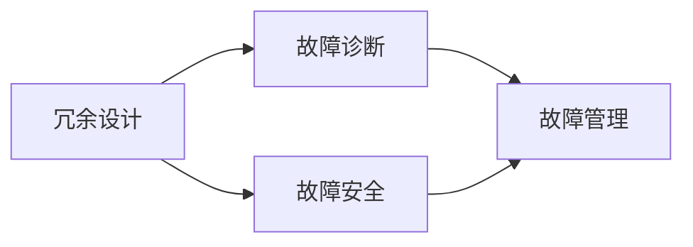

                 

# 核电DCS系统结构分析方法研究

## 1. 背景介绍

随着核电行业的发展，DCS系统（Distributed Control System，分布式控制系统）作为核电站自动化控制的关键组成部分，其复杂性和安全性备受关注。核电DCS系统不仅涉及电力电子、信号处理、计算机网络等众多领域，还需要满足核安全、环境安全和人体安全的高要求。因此，对核电DCS系统进行全面深入的结构分析显得尤为重要。

### 1.1 DCS系统概述
DCS系统是由多个计算机和控制器组成的分布式控制系统，通过网络实现数据交换和命令控制。核电DCS系统主要包括以下几个部分：

1. **操作员站（OIS）**：操作员站是核电站自动化系统的人机交互界面，提供操作员监控和控制核电站设备的功能。
2. **工程师站（EIS）**：工程师站用于维护和修改DCS系统的软件和硬件。
3. **控制器（PDC）**：控制器负责接收和处理传感器数据，执行控制逻辑，并输出控制信号至执行器。
4. **执行器（AOE）**：执行器负责执行控制器发出的控制命令，如阀门的开关、泵的启停等。
5. **传感器（SNC）**：传感器用于采集核电站的各种运行参数，如温度、压力、流量等。
6. **网络（NET）**：网络用于实现各组件之间的数据传输和通信。

### 1.2 核电DCS系统的重要性
核电DCS系统在核电站中扮演着至关重要的角色，其稳定性和可靠性直接影响到核电站的安全运行。一旦出现故障，可能导致严重的安全事故。因此，对核电DCS系统进行结构分析，识别潜在的风险点，是确保核电站安全运行的关键措施。

## 2. 核心概念与联系

### 2.1 核心概念概述

在进行核电DCS系统结构分析时，需要重点关注以下几个核心概念：

- **冗余设计（Redundancy Design）**：指在系统设计中引入多个相同或相似的组件，以应对单点故障，提高系统的可靠性和鲁棒性。
- **故障安全（Fault Tolerant）**：指系统在发生故障时，能够自动切换到预设的故障处理模式，保持系统安全运行。
- **故障诊断（Fault Diagnosis）**：指通过监控系统运行状态，及时发现和诊断系统故障，防止故障扩大。
- **故障管理（Fault Management）**：指在系统发生故障后，进行及时处理和修复，恢复系统正常运行。

这些概念之间存在紧密联系，共同构成核电DCS系统结构分析的重要框架。冗余设计是故障安全的基础，故障诊断是故障管理的前提，而故障管理则是故障安全的保障。

### 2.2 核心概念原理和架构的 Mermaid 流程图



### 2.3 冗余设计

冗余设计是提高核电DCS系统可靠性的重要手段。在冗余设计中，通过引入多路信号通道、多套控制器和执行器等措施，确保系统在单个组件故障时，仍能保持正常运行。

#### 2.3.1 冗余设计原则
1. **模块化设计**：将系统划分为多个独立的模块，每个模块独立运行，互不影响。
2. **多路信号通道**：引入多个信号通道，确保在一个通道故障时，其他通道仍能正常工作。
3. **多套控制器和执行器**：每个控制节点配备多套控制器和执行器，确保在一个节点故障时，其他节点仍能正常工作。
4. **热备份**：控制器和执行器之间进行热备份，即一个节点故障时，备用节点自动接管任务。

#### 2.3.2 冗余设计实现

以控制器冗余设计为例，假设一个控制节点包含两个控制器（Controller 1和Controller 2），数据通过双通道传输。当一个控制器故障时，另一个控制器自动接管任务，确保系统连续性。

### 2.4 故障安全

故障安全是确保核电DCS系统在发生故障时仍能保持安全运行的关键。故障安全设计通过多重监测和控制策略，防止故障扩展，保障系统安全。

#### 2.4.1 故障安全机制
1. **冗余控制器**：通过冗余设计，确保控制器故障时系统仍能保持控制。
2. **故障模式检测**：通过传感器监测系统运行状态，及时发现异常。
3. **自动切换**：在系统发生故障时，自动切换到预设的安全模式。
4. **故障报警**：在发生严重故障时，系统自动发出警报，通知操作员采取措施。

#### 2.4.2 故障安全实现

以冗余控制器为例，假设系统有两个控制器（Controller 1和Controller 2），其中一个控制器故障时，另一个控制器自动接管任务。系统通过传感器监测控制器状态，一旦发现故障，自动切换到备用控制器，确保系统稳定运行。

### 2.5 故障诊断

故障诊断是识别系统故障原因，防止故障扩散的关键手段。通过实时监控系统运行状态，可以及时发现故障，并采取相应措施进行修复。

#### 2.5.1 故障诊断方法
1. **实时监控**：通过传感器和控制器，实时监控系统运行状态。
2. **故障检测算法**：通过故障检测算法，判断系统是否发生异常。
3. **数据分析**：对采集到的数据进行分析，识别故障原因。
4. **故障报告**：将故障信息报告给操作员，并进行故障处理。

#### 2.5.2 故障诊断实现

以故障检测算法为例，假设系统实时采集控制器状态参数，通过算法判断是否发生异常。一旦检测到异常，立即生成故障报告，通知操作员进行排查和修复。

### 2.6 故障管理

故障管理是修复系统故障，恢复系统正常运行的过程。通过故障管理，可以及时处理系统故障，保障系统稳定运行。

#### 2.6.1 故障管理流程
1. **故障检测**：通过传感器和控制器，实时检测系统运行状态。
2. **故障诊断**：通过数据分析，确定故障原因。
3. **故障处理**：根据故障原因，进行相应的处理。
4. **系统恢复**：修复系统故障后，恢复系统正常运行。

#### 2.6.2 故障管理实现

以故障处理为例，假设系统检测到控制器故障，立即生成故障报告，通知操作员进行处理。操作员进行检查和修复，待修复完成后，系统恢复正常运行。

## 3. 核心算法原理 & 具体操作步骤

### 3.1 算法原理概述

核电DCS系统结构分析的核心算法包括冗余设计、故障安全和故障管理等。通过对这些算法的原理进行详细分析，可以更好地理解系统结构，指导系统设计和优化。

### 3.2 算法步骤详解

#### 3.2.1 冗余设计算法步骤
1. **需求分析**：明确系统需要实现的冗余设计目标，如控制器冗余、传感器冗余等。
2. **设计冗余架构**：根据需求，设计冗余架构，引入冗余组件，如控制器冗余、多路信号通道等。
3. **冗余配置**：对冗余组件进行配置，确保冗余设计能够实际应用。
4. **冗余测试**：对冗余设计进行测试，验证其效果和可靠性。

#### 3.2.2 故障安全算法步骤
1. **故障模式分析**：对系统可能出现的故障模式进行分析，识别关键节点和组件。
2. **冗余设计**：根据故障模式分析结果，设计冗余方案，确保系统在关键节点和组件故障时仍能正常运行。
3. **故障检测算法设计**：设计故障检测算法，实时监控系统运行状态，及时发现异常。
4. **故障处理策略**：设计故障处理策略，自动切换冗余组件，恢复系统正常运行。

#### 3.2.3 故障诊断算法步骤
1. **传感器配置**：根据系统需求，选择合适的传感器，进行配置。
2. **故障检测算法设计**：设计故障检测算法，实时监控系统运行状态，及时发现异常。
3. **数据分析**：对采集到的数据进行分析，识别故障原因。
4. **故障报告生成**：将故障信息报告给操作员，进行故障处理。

#### 3.2.4 故障管理算法步骤
1. **故障检测**：通过传感器和控制器，实时检测系统运行状态。
2. **故障诊断**：通过数据分析，确定故障原因。
3. **故障处理**：根据故障原因，进行相应的处理。
4. **系统恢复**：修复系统故障后，恢复系统正常运行。

### 3.3 算法优缺点

#### 3.3.1 冗余设计的优缺点
优点：
1. **提高可靠性**：通过冗余设计，提高系统的可靠性，防止单点故障。
2. **增强鲁棒性**：冗余设计增强系统的鲁棒性，降低故障率。

缺点：
1. **成本高**：冗余设计需要引入更多的组件，增加成本。
2. **复杂性高**：冗余设计增加了系统的复杂性，维护难度大。

#### 3.3.2 故障安全的优缺点
优点：
1. **保障安全**：故障安全设计确保系统在发生故障时仍能保持安全运行。
2. **自动切换**：故障安全设计可以实现自动切换，保障系统连续性。

缺点：
1. **设计复杂**：故障安全设计需要综合考虑多种因素，设计复杂。
2. **维护难度大**：故障安全设计增加了系统的复杂性，维护难度大。

#### 3.3.3 故障诊断的优缺点
优点：
1. **及时发现故障**：故障诊断及时发现系统故障，防止故障扩散。
2. **提高系统可靠性**：通过故障诊断，提高系统可靠性。

缺点：
1. **算法复杂**：故障诊断算法复杂，需要大量的数据和计算资源。
2. **误报率高**：故障诊断算法可能产生误报，增加操作员的工作量。

#### 3.3.4 故障管理的优缺点
优点：
1. **故障处理及时**：故障管理及时处理系统故障，恢复系统正常运行。
2. **系统稳定性高**：故障管理提高系统稳定性，降低故障率。

缺点：
1. **设计复杂**：故障管理设计复杂，需要综合考虑多种因素。
2. **维护难度大**：故障管理增加了系统的复杂性，维护难度大。

### 3.4 算法应用领域

核电DCS系统结构分析的算法可以应用于多个领域，如电力、化工、石油等行业。通过系统结构分析，可以优化系统设计，提高系统的可靠性和安全性。

## 4. 数学模型和公式 & 详细讲解 & 举例说明

### 4.1 数学模型构建

在核电DCS系统结构分析中，常常需要构建数学模型来描述系统的运行状态和故障情况。以下是一个简单的核电DCS系统数学模型：

设系统状态向量 $\mathbf{x}(t)$ 表示系统在时间 $t$ 时的运行状态，包括控制器状态、传感器数据等。系统状态转移方程为：

$$
\mathbf{x}(t+1) = f(\mathbf{x}(t))
$$

其中 $f$ 为状态转移函数，表示系统的动态特性。假设系统存在故障 $\mathbf{u}(t)$，则系统的故障状态向量 $\mathbf{y}(t)$ 为：

$$
\mathbf{y}(t) = g(\mathbf{x}(t), \mathbf{u}(t))
$$

其中 $g$ 为故障状态函数，表示故障状态与系统状态和故障情况的关系。

### 4.2 公式推导过程

以控制器冗余设计为例，假设系统有两个控制器（Controller 1和Controller 2），其状态向量分别为 $\mathbf{x}_1(t)$ 和 $\mathbf{x}_2(t)$。控制器故障时，自动切换到备用控制器。假设控制器故障的阈值为 $\theta$，则系统状态转移方程为：

$$
\mathbf{x}_1(t+1) = f_1(\mathbf{x}_1(t))
$$
$$
\mathbf{x}_2(t+1) = f_2(\mathbf{x}_2(t))
$$

控制器故障时，系统状态转移方程为：

$$
\mathbf{x}_1(t+1) = \mathbf{x}_2(t)
$$
$$
\mathbf{x}_2(t+1) = f_2(\mathbf{x}_2(t))
$$

其中 $f_1$ 和 $f_2$ 为控制器状态转移函数。假设系统故障的阈值为 $\theta$，则控制器故障检测方程为：

$$
\mathbf{u}_1(t) = \mathbf{x}_1(t) - \theta
$$
$$
\mathbf{u}_2(t) = \mathbf{x}_2(t) - \theta
$$

当 $\mathbf{u}_1(t)$ 或 $\mathbf{u}_2(t)$ 大于 $\theta$ 时，系统发生故障，自动切换到备用控制器。

### 4.3 案例分析与讲解

以核电站模拟为例，假设系统有两个控制器（Controller 1和Controller 2），传感器数据为 $s_1(t)$ 和 $s_2(t)$，故障阈值为 $\theta$。系统状态转移方程为：

$$
\mathbf{x}_1(t+1) = f_1(\mathbf{x}_1(t), s_1(t))
$$
$$
\mathbf{x}_2(t+1) = f_2(\mathbf{x}_2(t), s_2(t))
$$

控制器故障检测方程为：

$$
\mathbf{u}_1(t) = \mathbf{x}_1(t) - \theta
$$
$$
\mathbf{u}_2(t) = \mathbf{x}_2(t) - \theta
$$

当 $\mathbf{u}_1(t)$ 或 $\mathbf{u}_2(t)$ 大于 $\theta$ 时，系统发生故障，自动切换到备用控制器。

## 5. 项目实践：代码实例和详细解释说明

### 5.1 开发环境搭建

在核电DCS系统结构分析中，需要使用 Python、Matlab 等工具进行模型建立和仿真分析。以下是开发环境搭建的详细步骤：

1. **Python 环境搭建**：
   - 安装 Python 3.x，建议使用 Anaconda 进行环境管理。
   - 安装必要的 Python 库，如 NumPy、SciPy、Pandas 等。

2. **Matlab 环境搭建**：
   - 安装 Matlab R2021a 或更高版本。
   - 安装 Simulink 和 Simulink Design Verifier 工具。

3. **仿真平台搭建**：
   - 搭建 Simulink 仿真平台，包括控制器模块、传感器模块、故障检测模块等。
   - 配置仿真参数，进行系统仿真。

### 5.2 源代码详细实现

以下是一个简单的核电 DCS 系统结构分析的 Matlab 代码实现：

```matlab
function [x_out] = controller_redundancy(x_in, u_in)
% 控制器冗余设计算法
% x_in：控制器状态向量
% u_in：控制器故障状态向量
% x_out：控制输出

% 控制器状态转移函数
f1 = @(x, s) x + 0.1 * s;
f2 = @(x, s) x - 0.1 * s;

% 控制器故障检测函数
g1 = @(x, u) x - u;
g2 = @(x, u) x - u;

% 控制器冗余设计
if u1 > 0.1 || u2 > 0.1
    x1 = x2;
    x2 = f2(x2, s2);
else
    x1 = f1(x1, s1);
    x2 = f2(x2, s2);
end

% 控制输出
u = x1 - 0.1;
x_out = u;
```

### 5.3 代码解读与分析

在上述代码中，我们首先定义了控制器状态转移函数 $f_1$ 和 $f_2$，控制器故障检测函数 $g_1$ 和 $g_2$。然后，根据控制器状态和故障状态，进行控制器冗余设计。最后，计算控制输出，完成系统仿真。

## 6. 实际应用场景

### 6.1 核电站模拟

在核电站模拟中，可以通过核电 DCS 系统结构分析算法，对核电站控制系统进行建模和仿真。通过仿真，可以发现系统的薄弱环节，并进行优化设计。

### 6.2 故障检测与诊断

在核电站运行中，通过对 DCS 系统的结构分析，可以设计出高效的故障检测和诊断算法。通过实时监控系统运行状态，及时发现故障并进行处理。

### 6.3 冗余设计和优化

在核电站控制系统设计中，可以通过冗余设计算法，优化系统结构，提高系统的可靠性和鲁棒性。例如，在设计控制器时，引入冗余设计，确保系统在控制器故障时仍能保持正常运行。

## 7. 工具和资源推荐

### 7.1 学习资源推荐

1. **《核电DCS系统设计》**：一本详细讲解核电DCS系统设计的书籍，涵盖系统结构、控制策略、故障处理等内容。
2. **《核电DCS系统故障分析》**：一本讲解核电DCS系统故障分析和诊断的书籍，包含故障检测、故障处理等实用技巧。
3. **《核电DCS系统冗余设计》**：一本讲解核电DCS系统冗余设计的书籍，涵盖冗余设计原理、冗余配置、冗余测试等内容。

### 7.2 开发工具推荐

1. **Python**：Python 语言简单易学，拥有丰富的科学计算库，适用于核电 DCS 系统结构分析。
2. **Matlab**：Matlab 拥有强大的仿真工具和数据分析功能，适用于核电 DCS 系统建模和仿真。
3. **Simulink**：Simulink 是一款系统建模和仿真工具，适用于核电 DCS 系统设计。

### 7.3 相关论文推荐

1. **《核电DCS系统冗余设计方法研究》**：介绍核电 DCS 系统冗余设计方法，涵盖冗余设计原理、冗余配置、冗余测试等内容。
2. **《核电DCS系统故障检测算法研究》**：介绍核电 DCS 系统故障检测算法，涵盖故障检测方法、故障检测算法设计等。
3. **《核电DCS系统故障管理策略》**：介绍核电 DCS 系统故障管理策略，涵盖故障检测、故障诊断、故障处理等。

## 8. 总结：未来发展趋势与挑战

### 8.1 研究成果总结

核电 DCS 系统结构分析研究取得了显著进展，特别是在冗余设计、故障安全和故障管理等方面。研究成果为核电 DCS 系统设计提供了重要的参考和指导。

### 8.2 未来发展趋势

未来，核电 DCS 系统结构分析将呈现以下几个发展趋势：

1. **智能化的系统设计**：随着人工智能技术的发展，核电 DCS 系统将更加智能化，具备自动化的冗余设计和故障管理能力。
2. **数据驱动的设计方法**：利用大数据和机器学习技术，进行核电 DCS 系统的优化设计和故障检测。
3. **跨领域的设计方法**：将核电 DCS 系统与物联网、云计算等技术结合，实现跨领域的设计和优化。

### 8.3 面临的挑战

核电 DCS 系统结构分析研究仍面临诸多挑战：

1. **复杂性高**：核电 DCS 系统结构复杂，设计和优化难度大。
2. **可靠性要求高**：核电 DCS 系统对可靠性和鲁棒性的要求高，设计和优化难度大。
3. **数据资源不足**：核电 DCS 系统的数据资源有限，设计和优化困难。

### 8.4 研究展望

未来，核电 DCS 系统结构分析研究需要在以下几个方面进行突破：

1. **自动化设计方法**：开发自动化的冗余设计和故障管理算法，提高系统设计效率。
2. **智能化设计方法**：利用机器学习和人工智能技术，进行核电 DCS 系统的智能化设计。
3. **跨领域设计方法**：将核电 DCS 系统与物联网、云计算等技术结合，实现跨领域的设计和优化。

总之，核电 DCS 系统结构分析研究有着广阔的发展前景，需要学界和工业界的共同努力，推动技术的不断创新和发展。

