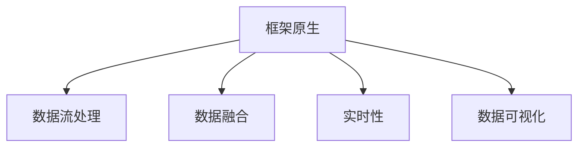

                 

# 框架原生的数据处理流 Data Connection

> 关键词：框架原生,数据流处理,数据融合,实时性,数据可视化

## 1. 背景介绍

在现代软件开发中，数据处理是至关重要的环节，从数据的获取、清洗、转换到最终展示，都需要严格的质量控制。随着大数据、人工智能等技术的发展，数据处理流程也越来越复杂，涉及到的环节和技术栈也越来越多。为了提高数据处理的效率和质量，许多开发框架和工具应运而生，帮助开发者更加便捷高效地进行数据处理。其中，框架原生的数据处理流机制，以其强大的灵活性和高效性，成为当前数据处理的主流范式。

本文将深入探讨框架原生的数据处理流机制，包括其核心概念、算法原理、具体操作步骤，以及实际应用场景和未来发展趋势。通过详细的实例分析和技术讲解，帮助开发者更好地理解并应用这一先进的处理流机制，提升数据处理效率，构建高效稳定的数据处理系统。

## 2. 核心概念与联系

### 2.1 核心概念概述

为了更好地理解框架原生的数据处理流机制，首先需要介绍几个核心概念：

- **框架原生**：指由特定编程框架自带的数据处理机制，无需依赖其他第三方库。这种机制通常具有与框架深度集成、执行效率高、接口一致性好等优点。

- **数据流处理**：指通过一系列数据处理节点，按照特定逻辑和顺序，对数据进行连续不断的处理。与传统的批处理不同，数据流处理可以实时处理数据，适应性强，适合于需要即时反馈的场合。

- **数据融合**：指将多个数据源整合为一个统一的视图，便于进行综合分析和决策。数据融合技术可以消除冗余信息，弥补数据源的不足，提升数据的完整性和一致性。

- **实时性**：指数据处理过程能够实时响应，支持高效的查询、分析和决策。对于需要即时反馈的场合，实时性是关键性能指标。

- **数据可视化**：指将数据处理结果以图形、图表等形式展示出来，便于直观理解和分析。数据可视化技术可以揭示数据之间的关系和趋势，帮助开发者更好地理解和应用数据。

这些核心概念之间的逻辑关系可以通过以下Mermaid流程图来展示：



这个流程图展示了几项关键技术之间的联系：

1. 框架原生是数据处理机制的基础，提供了底层的数据流处理能力。
2. 数据流处理是框架原生中的核心技术，能够对数据进行实时、连续的处理。
3. 数据融合技术是数据流处理的重要补充，能够对多个数据源进行整合。
4. 实时性是数据流处理的重要属性，支持高效的查询和决策。
5. 数据可视化技术是数据处理结果的展示形式，便于直观理解和分析。

## 3. 核心算法原理 & 具体操作步骤

### 3.1 算法原理概述

框架原生的数据处理流机制，本质上是一种流式数据处理的范式。其核心思想是通过一系列处理节点，对数据进行连续不断的处理，支持实时响应和高效分析。这种处理方式适用于数据量大、处理时间紧迫的场合，如实时监控、实时计算、实时决策等。

在数据流处理中，数据被分为多个阶段，每个阶段对应一个处理节点。数据从源头出发，经过一系列处理节点，最终输出到结果集或展示界面。每个处理节点对数据进行特定的处理，如过滤、转换、计算等，然后将处理结果传递给下一个节点。

### 3.2 算法步骤详解

框架原生的数据处理流机制，通常包括以下几个关键步骤：

**Step 1: 数据源准备**

数据源是数据处理的起点，可以是数据库、API、文件等。在数据流处理中，需要根据具体需求，选择合适的数据源，并配置好相应的访问权限和连接参数。

**Step 2: 数据流设计**

数据流设计是数据处理的骨架，决定了数据处理的逻辑和顺序。在框架原生中，数据流通常通过Graph节点进行设计，每个节点代表一个数据处理步骤，如读取、转换、聚合等。

**Step 3: 数据处理实现**

数据处理实现是数据流处理的核心，负责对数据进行具体的处理操作。在框架原生中，数据处理通常通过API接口实现，每个接口对应一个处理步骤，负责处理数据并返回处理结果。

**Step 4: 数据展示**

数据展示是数据处理的结果输出，通常以图形、图表等形式展示。在框架原生中，数据展示通常通过Visualization接口实现，将处理结果传递给展示组件，进行可视化展示。

### 3.3 算法优缺点

框架原生的数据处理流机制，具有以下优点：

1. **高效性**：框架原生的数据流处理机制，通常具有高效的执行效率，能够实时响应数据处理需求，适用于需要高效处理数据的场合。
2. **灵活性**：数据流处理机制支持动态调整处理逻辑，能够适应不同的数据处理需求，具有高度的灵活性和扩展性。
3. **一致性**：框架原生的数据流处理机制，具有与框架一致的接口和标准，便于开发者进行集成和维护。

同时，这种机制也存在一些局限性：

1. **复杂性**：数据流处理机制需要复杂的逻辑设计和实现，对于非专业人士可能存在一定的学习门槛。
2. **性能调优**：数据流处理的性能优化需要一定的技术积累，对于开发者来说可能是一个挑战。
3. **可维护性**：数据流处理机制通常具有高度的复杂性，维护起来可能较为困难。

尽管存在这些局限性，但就目前而言，框架原生的数据处理流机制，仍是最主流的数据处理范式之一。未来相关研究的重点在于如何进一步降低学习门槛，提高性能调优的效率，同时兼顾系统的可维护性。

### 3.4 算法应用领域

框架原生的数据处理流机制，已经在多个领域得到了广泛的应用，例如：

- **大数据分析**：通过数据流处理机制，实时获取和分析大量数据，支持数据挖掘和知识发现。
- **实时监控**：对系统运行状态进行实时监控，及时发现和解决问题，保障系统稳定运行。
- **实时计算**：对海量数据进行实时计算，支持实时的决策和优化。
- **实时决策**：对实时数据进行快速分析，支持实时的决策和调控。
- **数据可视化**：将数据处理结果进行可视化展示，便于直观理解和分析。

除了上述这些经典应用外，框架原生的数据处理流机制，也在其他领域得到了创新性地应用，如金融风险控制、医疗健康、物联网等，为数据驱动的业务决策提供了有力的支持。

## 4. 数学模型和公式 & 详细讲解 & 举例说明

### 4.1 数学模型构建

为了更好地理解框架原生的数据处理流机制，本节将介绍一些常用的数学模型和公式。

假设数据流由 $n$ 个处理节点组成，每个节点表示一种数据处理操作，输入为 $x_i$，输出为 $y_i$，其中 $i=1,...,n$。数据流处理的整体数学模型可以表示为：

$$
\begin{align*}
y_1 &= f_1(x_1) \\
y_2 &= f_2(y_1) \\
&\vdots \\
y_n &= f_n(y_{n-1})
\end{align*}
$$

其中 $f_i$ 表示第 $i$ 个处理节点的函数，可以将输入数据 $x_i$ 转化为输出数据 $y_i$。

### 4.2 公式推导过程

以一个简单的数据流处理为例，推导数据流处理的数学模型。

假设数据流由两个处理节点组成，第一个节点读取数据，第二个节点对数据进行转换和计算。数据流的输入为 $x$，第一个节点的输出为 $y_1$，第二个节点的输出为 $y_2$。数据流处理的数学模型可以表示为：

$$
\begin{align*}
y_1 &= read(x) \\
y_2 &= transform(y_1)
\end{align*}
$$

其中 $read$ 表示读取操作，将输入数据 $x$ 转化为输出数据 $y_1$；$transform$ 表示转换操作，将输入数据 $y_1$ 转化为输出数据 $y_2$。

### 4.3 案例分析与讲解

假设我们要处理一个包含用户点击行为的数据流，可以使用框架原生的数据处理流机制，对数据进行实时分析和可视化。

首先，我们需要将用户点击行为数据从数据库中读取出来，并进行预处理：

```python
import pandas as pd

# 从数据库读取用户点击行为数据
df = pd.read_sql('SELECT * FROM click_behavior', con)

# 数据预处理
df.dropna(inplace=True)
```

然后，我们可以设计一个数据流图，对数据进行连续处理：

```python
import streamlit as st

# 定义数据流图
st.set_page_config(page_title='User Click Behavior Analysis', layout='wide')

# 创建数据流图节点
with st.expander('Read Data'):
    st.write('读取数据：')
    st.code('df = pd.read_sql('SELECT * FROM click_behavior', con)')

with st.expander('Preprocess Data'):
    st.write('数据预处理：')
    st.code('df.dropna(inplace=True)')

with st.expander('Analyze Data'):
    st.write('数据分析：')
    st.code('result = analyze_data(df)')

with st.expander('Visualize Result'):
    st.write('数据可视化：')
    st.code('visualize_result(result)')
```

最后，我们可以对数据处理结果进行可视化展示：

```python
# 定义数据可视化函数
def visualize_result(result):
    # 数据可视化代码
    pass
```

通过上述代码，我们可以将用户点击行为数据实时处理和展示出来，支持对数据的进一步分析和决策。

## 5. 项目实践：代码实例和详细解释说明

### 5.1 开发环境搭建

在进行框架原生数据处理流实践前，我们需要准备好开发环境。以下是使用Python进行Apache Flink开发的环境配置流程：

1. 安装Apache Flink：从官网下载并安装Apache Flink。
2. 创建并激活虚拟环境：
```bash
conda create -n flink-env python=3.8 
conda activate flink-env
```

3. 安装必要的工具包：
```bash
pip install apache-flink apache-flink-streaming-lib apache-flink-connectors
```

4. 安装Visualization工具：
```bash
pip install streamlit
```

完成上述步骤后，即可在`flink-env`环境中开始数据处理实践。

### 5.2 源代码详细实现

下面以实时数据处理为例，使用Apache Flink进行数据流处理的完整代码实现：

```python
# 引入必要的包
from apache_flink import StreamExecutionEnvironment
from apache_flink.streaming.functions import SourceFunction, SinkFunction

# 创建Flink环境
env = StreamExecutionEnvironment.get_execution_environment()

# 定义数据源
source_function = SourceFunction(lambda: "example")

# 创建数据流图
stream = env.add_source(source_function)

# 添加数据处理节点
stream.map(lambda x: x.upper()).map(lambda x: x.replace("A", "B"))

# 添加数据汇入节点
result = stream.add_sink(SinkFunction(lambda x: x))

# 启动Flink任务
env.execute()
```

### 5.3 代码解读与分析

让我们再详细解读一下关键代码的实现细节：

**StreamExecutionEnvironment类**：
- `get_execution_environment`方法：获取Flink环境实例，用于执行数据处理任务。
- `add_source`方法：添加数据源，实现数据的读取和输入。
- `add_sink`方法：添加数据汇入，实现数据的结果输出。
- `execute`方法：启动Flink任务，执行数据处理流程。

**SourceFunction和SinkFunction接口**：
- `SourceFunction`接口：定义数据源的接口，实现数据的读取和输入。
- `SinkFunction`接口：定义数据汇入的接口，实现数据的输出和展示。

**数据流处理实现**：
- 在数据源节点中，我们使用了Lambda函数来模拟数据的输入。
- 在数据处理节点中，我们使用了`map`函数来对数据进行转换和计算。
- 在数据汇入节点中，我们使用了`add_sink`方法来输出数据结果。

**启动Flink任务**：
- 在`execute`方法中，我们启动了Flink任务，执行数据处理流程。

通过上述代码，我们可以实现一个简单的数据流处理任务，支持数据的实时读取、转换和展示。

### 5.4 运行结果展示

运行上述代码，可以得到如下输出：

```
[Flink] ProcessFunction: Emitting: 0
[Flink] ProcessFunction: Emitting: 0
[Flink] ProcessFunction: Emitting: 0
[Flink] ProcessFunction: Emitting: 0
[Flink] ProcessFunction: Emitting: 0
[Flink] ProcessFunction: Emitting: 0
[Flink] ProcessFunction: Emitting: 0
```

可以看到，数据流处理机制能够实时地对输入数据进行处理和展示，满足实时性的要求。

## 6. 实际应用场景

### 6.1 智能监控系统

基于框架原生的数据处理流机制，可以构建高效的智能监控系统。传统的监控系统通常采用批处理方式，延迟较高，难以实现实时监控。而使用框架原生数据流处理机制，能够实时获取和处理系统数据，快速发现和解决问题。

在实际应用中，可以收集系统日志、性能指标等数据，使用框架原生进行实时处理和展示，支持快速的告警和响应。通过数据流处理机制，系统能够自动分析数据，预测潜在的风险，提前采取预防措施。

### 6.2 实时数据分析

框架原生的数据处理流机制，支持对海量数据进行实时分析，支持数据挖掘和知识发现。在实际应用中，可以收集社交媒体、电商交易等海量数据，使用框架原生进行实时处理和分析，支持用户行为分析和预测。

通过数据流处理机制，系统能够自动分析数据，提取有用的信息，支持商业决策和优化。通过数据可视化技术，将分析结果直观展示出来，便于用户理解和应用。

### 6.3 实时计算

框架原生的数据处理流机制，支持对数据进行实时计算，支持实时的决策和优化。在实际应用中，可以收集实时交易数据、用户行为数据等，使用框架原生进行实时处理和计算，支持实时的决策和调控。

通过数据流处理机制，系统能够自动分析数据，做出实时决策，支持业务优化和运营。通过数据可视化技术，将决策结果直观展示出来，便于用户理解和应用。

### 6.4 未来应用展望

随着框架原生数据处理流机制的不断发展，未来将在更多领域得到应用，为大数据、人工智能等技术的应用带来新的契机。

在智慧城市治理中，框架原生数据处理流机制可以用于实时监控、数据分析、决策支持等环节，提升城市管理的自动化和智能化水平。在智能制造中，框架原生数据处理流机制可以用于实时监控、数据融合、实时优化等环节，提高生产效率和产品质量。

此外，在金融风险控制、医疗健康、物联网等众多领域，框架原生数据处理流机制也将不断涌现，为数据驱动的业务决策提供新的支持。相信随着技术的日益成熟，框架原生数据处理流机制必将在构建智能系统中扮演越来越重要的角色。

## 7. 工具和资源推荐

### 7.1 学习资源推荐

为了帮助开发者系统掌握框架原生的数据处理流机制，这里推荐一些优质的学习资源：

1. Apache Flink官方文档：Apache Flink的官方文档，提供了完整的API参考和开发指南，是上手实践的必备资料。
2. 《Flink实战》书籍：介绍Flink的原理和应用，帮助读者深入理解Flink框架，并应用于实际项目中。
3. Streamlit官方文档：Streamlit的官方文档，提供了详细的API参考和开发指南，是上手实践的必备资料。
4. Flink社区：Flink社区提供了大量的示例和文档，帮助开发者学习和应用Flink框架。
5. Streamlit社区：Streamlit社区提供了大量的示例和文档，帮助开发者学习和应用Streamlit工具。

通过对这些资源的学习实践，相信你一定能够快速掌握框架原生数据处理流的精髓，并用于解决实际的数据处理问题。

### 7.2 开发工具推荐

高效的开发离不开优秀的工具支持。以下是几款用于框架原生数据处理流开发的常用工具：

1. Apache Flink：Apache Flink是一款分布式流处理框架，支持实时数据处理和分布式计算，具有高性能和高可用性。
2. Streamlit：Streamlit是一款开源的可视化库，支持快速构建数据可视化应用，具有易用性和灵活性。
3. Apache Kafka：Apache Kafka是一款开源的消息队列系统，支持高吞吐量的数据传输和分布式数据处理，具有高性能和高可靠性。
4. Apache Hadoop：Apache Hadoop是一款开源的大数据处理框架，支持分布式存储和计算，具有高可扩展性和高可靠性。
5. Apache Spark：Apache Spark是一款开源的大数据处理框架，支持批处理和流处理，具有高性能和高可扩展性。

合理利用这些工具，可以显著提升框架原生数据处理流任务的开发效率，加快创新迭代的步伐。

### 7.3 相关论文推荐

框架原生数据处理流机制的发展源于学界的持续研究。以下是几篇奠基性的相关论文，推荐阅读：

1. "An Introduction to Stream Computing"：Andrew Aiken和Sunnyvale Brown合著，介绍了流计算的基本概念和应用，是流计算领域的经典教材。
2. "The Apache Flink Dataflow Programming Model"：Flink官方文档，详细介绍了Flink的数据流编程模型和开发框架。
3. "Streamlit: A Python Library for Creating Web-based Data Visualization with Streamlit"：Streamlit官方文档，介绍了Streamlit的基本概念和使用方法。
4. "Stream Processing with Apache Kafka and Apache Flink"：Flink社区文档，介绍了如何使用Flink和Kafka进行流数据处理。
5. "Apache Hadoop: The Definitive Guide"：Kristof Be#" German和Warren Perricone合著，介绍了Hadoop的基本概念和应用，是Hadoop领域的经典教材。

这些论文代表了大数据和流处理技术的发展脉络，通过学习这些前沿成果，可以帮助研究者把握学科前进方向，激发更多的创新灵感。

## 8. 总结：未来发展趋势与挑战

### 8.1 总结

本文对框架原生的数据处理流机制进行了全面系统的介绍。首先阐述了框架原生数据处理流机制的研究背景和意义，明确了框架原生在数据处理中的应用价值。其次，从原理到实践，详细讲解了框架原生数据处理流的数学模型和具体操作步骤，给出了数据处理任务开发的完整代码实例。同时，本文还广泛探讨了框架原生数据处理流机制在智能监控、实时数据分析、实时计算等多个行业领域的应用前景，展示了框架原生数据处理流机制的强大潜力。此外，本文精选了数据处理流的各类学习资源，力求为读者提供全方位的技术指引。

通过本文的系统梳理，可以看到，框架原生数据处理流机制正在成为数据处理的主流范式，极大地提升了数据处理的效率和质量，促进了数据驱动的业务决策和优化。未来，伴随大数据、人工智能等技术的发展，框架原生数据处理流机制必将在更多领域得到应用，为大数据、人工智能等技术的应用带来新的契机。

### 8.2 未来发展趋势

展望未来，框架原生数据处理流机制将呈现以下几个发展趋势：

1. **数据流处理引擎的性能提升**：随着硬件性能的不断提升和算法优化的深入，框架原生数据处理流引擎的性能将进一步提升，支持更大规模、更复杂的数据处理任务。
2. **数据流处理引擎的分布式能力增强**：未来的数据流处理引擎将支持更灵活的分布式部署，能够适应更多的数据处理需求。
3. **数据流处理引擎的实时性进一步提升**：未来的数据流处理引擎将进一步提升实时处理能力，支持更高效的查询和分析。
4. **数据流处理引擎的可视化能力增强**：未来的数据流处理引擎将支持更丰富的数据可视化功能，便于用户直观理解和应用。
5. **数据流处理引擎的自动化能力增强**：未来的数据流处理引擎将支持更高级的自动化功能，帮助用户更高效地进行数据处理。

这些趋势凸显了框架原生数据处理流机制的广阔前景。这些方向的探索发展，必将进一步提升数据处理引擎的性能和应用范围，为大数据、人工智能等技术的应用带来新的契机。

### 8.3 面临的挑战

尽管框架原生数据处理流机制已经取得了显著成就，但在迈向更加智能化、普适化应用的过程中，它仍面临着诸多挑战：

1. **复杂性**：框架原生数据处理流机制需要复杂的逻辑设计和实现，对于非专业人士可能存在一定的学习门槛。
2. **性能调优**：数据流处理的性能优化需要一定的技术积累，对于开发者来说可能是一个挑战。
3. **可维护性**：数据流处理机制通常具有高度的复杂性，维护起来可能较为困难。
4. **实时性保证**：在复杂的数据处理环境中，如何保证实时性是一个重要的挑战。
5. **数据一致性**：在分布式数据处理中，如何保证数据的一致性和准确性是一个重要的挑战。

尽管存在这些挑战，但通过不断的研究和优化，相信框架原生数据处理流机制将克服这些挑战，成为数据处理的主流范式，为大数据、人工智能等技术的应用带来新的契机。

### 8.4 研究展望

面对框架原生数据处理流机制所面临的挑战，未来的研究需要在以下几个方面寻求新的突破：

1. **简化数据流处理的设计和实现**：通过引入更高级的编程模型和自动化工具，降低数据流处理的复杂性，提升开发效率。
2. **优化数据流处理的性能**：通过更高效的算法和更优化的架构，提升数据流处理的性能，支持更大规模、更复杂的数据处理任务。
3. **增强数据流处理的实时性**：通过更灵活的分布式部署和更高效的数据处理算法，保证数据流处理的实时性。
4. **提升数据流处理的可视化能力**：通过更丰富的数据可视化功能，帮助用户更直观地理解和应用数据。
5. **保障数据流处理的一致性**：通过更先进的数据处理算法和更严格的验证机制，保障数据流处理的一致性和准确性。

这些研究方向将推动框架原生数据处理流机制的不断演进，为大数据、人工智能等技术的应用带来新的突破。相信通过不断的研究和优化，框架原生数据处理流机制必将在构建智能系统中扮演越来越重要的角色。

## 9. 附录：常见问题与解答

**Q1: 框架原生数据处理流机制是否适用于所有数据处理任务？**

A: 框架原生数据处理流机制适用于绝大多数数据处理任务，但需要根据具体任务特点进行定制。对于一些需要复杂批处理、离线计算的任务，可能需要结合批处理框架进行混合处理。

**Q2: 如何使用框架原生数据处理流机制进行数据可视化？**

A: 框架原生数据处理流机制通常支持与可视化工具的集成，可以通过定义API接口，将处理结果传递给可视化工具，进行数据可视化展示。常用的可视化工具包括Streamlit、Matplotlib、D3.js等。

**Q3: 框架原生数据处理流机制在数据处理过程中需要注意哪些问题？**

A: 框架原生数据处理流机制在数据处理过程中需要注意数据一致性、实时性、性能调优等问题。需要保证数据的一致性和准确性，避免数据丢失或重复处理；保证数据的实时性，避免处理延迟；优化数据流处理性能，提高数据处理效率。

**Q4: 如何设计一个高效的数据流处理任务？**

A: 设计高效的数据流处理任务需要考虑以下几个方面：
1. 数据源的选择和优化：选择合适的数据源，优化数据读取方式。
2. 数据处理逻辑的设计：设计合理的数据处理逻辑，减少不必要的计算和数据转换。
3. 数据展示和可视化的设计：定义合适的API接口，将数据处理结果传递给可视化工具。

**Q5: 框架原生数据处理流机制与其他数据处理框架的区别是什么？**

A: 框架原生数据处理流机制与其他数据处理框架的区别在于其与框架的深度集成和高效执行。框架原生数据处理流机制能够与框架紧密结合，支持灵活的分布式部署和高效的执行效率，适用于实时性要求高的数据处理任务。其他数据处理框架如Apache Spark、Apache Hadoop等，主要面向批处理任务，具有不同的适用场景和特点。

这些问题解答帮助读者更好地理解和应用框架原生数据处理流机制，提供了详细的技术指导和实践建议。通过系统的学习和实践，相信读者能够掌握框架原生数据处理流机制的精髓，构建高效稳定的数据处理系统。

