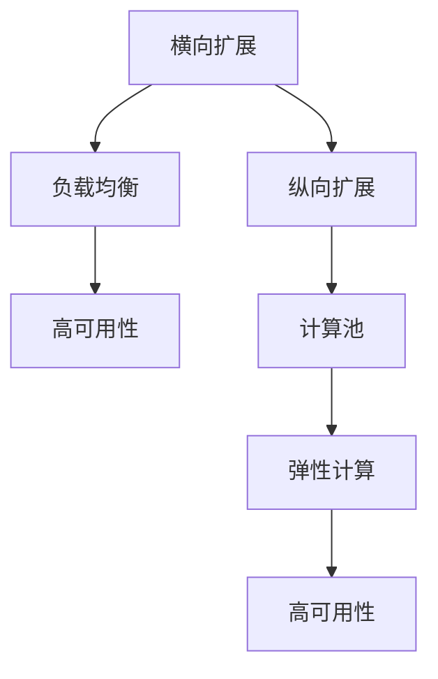

                 

# 横向扩展与纵向扩展的实际应用

在计算机系统设计中，横向扩展与纵向扩展是两种常用的扩展方式。横向扩展是指增加计算节点或服务器的数量，以提供更高的计算能力或处理更多的并发请求；纵向扩展则指通过增加单个节点的计算资源，如CPU、内存等，来提升性能。本文将详细介绍这两种扩展方式的实际应用，包括它们的优缺点、适用场景以及如何选择合适的扩展策略。

## 1. 背景介绍

随着互联网应用的不断增长，服务器的性能和可用性面临前所未有的压力。如何在保证系统稳定性和高效性的同时，灵活应对不断增长的用户需求，成为了系统设计中的一个重要挑战。横向扩展和纵向扩展是两种常见的扩展策略，通过合理地应用这两种策略，可以在不牺牲系统性能的前提下，满足不断增长的业务需求。

横向扩展适用于需要处理大量并发请求的系统，如搜索引擎、社交媒体平台、在线购物网站等。通过增加服务器的数量，可以分担单个服务器的负载，提升系统的吞吐量和可用性。纵向扩展适用于需要处理大量数据或计算任务的系统，如大数据分析、科学计算、深度学习等。通过增加单个服务器的计算资源，可以提升单个任务的处理能力，缩短任务执行时间。

## 2. 核心概念与联系

### 2.1 核心概念概述

为更好地理解横向扩展和纵向扩展的实际应用，本节将介绍几个密切相关的核心概念：

- 横向扩展（Horizontal Scaling）：指通过增加服务器或计算节点数量，来提升系统的吞吐量和可用性。适合处理大量并发请求的应用。
- 纵向扩展（Vertical Scaling）：指通过增加单个服务器的计算资源，如CPU、内存等，来提升性能。适合处理大量数据或计算任务的应用。
- 负载均衡（Load Balancing）：通过分发请求到多个计算节点上，实现系统的水平扩展。
- 高可用性（High Availability）：通过冗余配置和故障转移机制，保证系统的持续运行。
- 弹性计算（Elastic Computing）：通过按需配置计算资源，实现系统的灵活扩展。
- 计算池（Computing Pool）：由多个计算节点组成，共享资源池，提高资源利用率。

这些核心概念之间的逻辑关系可以通过以下Mermaid流程图来展示：



这个流程图展示了大规模计算系统的扩展策略和支撑技术之间的联系：

1. 横向扩展通过负载均衡和高可用性技术，提升系统的吞吐量和可用性。
2. 纵向扩展通过计算池和弹性计算技术，提升单个节点的计算能力。
3. 计算池和弹性计算技术共同支持高可用性，保证系统的持续运行。

这些核心概念共同构成了大规模计算系统的扩展框架，使得系统能够灵活应对不同的业务需求。通过理解这些核心概念，我们可以更好地把握系统的设计原则和优化方向。

## 3. 核心算法原理 & 具体操作步骤

### 3.1 算法原理概述

横向扩展和纵向扩展的原理主要基于分布式计算和资源管理的思想。横向扩展通过增加计算节点的数量，实现负载均衡和资源共享，提升系统的处理能力；纵向扩展通过增加单个节点的计算资源，实现任务并行和资源集中，提升单个任务的计算速度。

在横向扩展中，系统通过负载均衡算法，将请求分配到多个计算节点上。常见的负载均衡算法包括轮询、哈希、最少连接等，这些算法通过合理地分发请求，实现了系统的水平扩展。在高可用性方面，系统通过冗余配置和故障转移机制，保证系统在单个节点故障时的持续运行。

在纵向扩展中，系统通过资源池管理技术，动态地分配和释放计算资源。常见的资源池管理技术包括资源预留、弹性扩展、资源回收等，这些技术通过按需配置计算资源，实现了系统的灵活扩展。

### 3.2 算法步骤详解

#### 3.2.1 横向扩展步骤

1. 选择适合的负载均衡算法：根据系统的特点，选择合适的负载均衡算法，如轮询、哈希、最少连接等。
2. 增加计算节点：根据系统的负载情况，增加计算节点或服务器，提升系统的处理能力。
3. 配置高可用性：通过冗余配置和故障转移机制，保证系统在单个节点故障时的持续运行。
4. 实现负载均衡：通过负载均衡算法，将请求分配到多个计算节点上，实现系统的水平扩展。

#### 3.2.2 纵向扩展步骤

1. 选择合适的资源池管理技术：根据系统的特点，选择合适的资源池管理技术，如资源预留、弹性扩展、资源回收等。
2. 增加计算资源：根据任务需求，增加单个节点的计算资源，如CPU、内存等。
3. 实现任务并行：通过资源池管理技术，实现任务并行，提升单个任务的计算速度。

### 3.3 算法优缺点

横向扩展的优点包括：

- 系统吞吐量可扩展性强，适合处理大量并发请求。
- 系统冗余度较高，具备高可用性。
- 系统扩展性强，可以灵活应对业务需求。

横向扩展的缺点包括：

- 系统复杂度较高，管理和维护难度较大。
- 系统延迟较高，需要平衡节点间的负载。

纵向扩展的优点包括：

- 单个任务处理能力强，计算速度快。
- 系统资源利用率高，计算资源可重复利用。
- 系统扩展性强，可以快速响应任务需求。

纵向扩展的缺点包括：

- 系统扩展受限于单个节点的资源限制。
- 系统冗余度较低，易出现单点故障。

### 3.4 算法应用领域

横向扩展和纵向扩展在多个领域中得到了广泛的应用，以下是几个典型的应用场景：

- 搜索引擎：如Google、Bing等，通过增加服务器数量，实现系统的水平扩展，提升查询处理能力。
- 社交媒体平台：如Facebook、Twitter等，通过增加服务器数量，实现系统的水平扩展，提升用户访问体验。
- 在线购物网站：如Amazon、阿里巴巴等，通过增加服务器数量，实现系统的水平扩展，提升交易处理能力。
- 大数据分析：如Hadoop、Spark等，通过增加计算节点，实现系统的水平扩展，提升数据处理能力。
- 科学计算：如超级计算机、量子计算等，通过增加单个节点的计算资源，实现任务并行，提升计算速度。
- 深度学习：如Google AI、OpenAI等，通过增加单个节点的计算资源，实现任务并行，提升模型训练速度。

除了上述这些经典应用外，横向扩展和纵向扩展还在更多场景中得到应用，如物联网设备、云计算服务、网络存储等，为各行各业提供更强大的计算能力。

## 4. 数学模型和公式 & 详细讲解 & 举例说明

### 4.1 数学模型构建

为更好地理解横向扩展和纵向扩展的实际应用，本节将使用数学语言对横向扩展和纵向扩展的原理进行严格的刻画。

记系统负载为 $L$，计算节点数为 $N$，单个计算节点的处理能力为 $C$。系统负载均衡系数为 $\eta$，即系统负载在 $N$ 个节点上的分布系数。系统冗余度为 $R$，即系统在单点故障时的恢复能力。

横向扩展的目标是最大化系统吞吐量 $T$，数学模型为：

$$
T = \max\limits_{\eta} \left\{\frac{L}{N \times \eta}\right\}
$$

纵向扩展的目标是最大化单个任务的执行时间 $E$，数学模型为：

$$
E = \min\limits_{C} \left\{\frac{L}{C}\right\}
$$

### 4.2 公式推导过程

以横向扩展为例，推导系统的吞吐量与负载均衡系数之间的关系。

设系统负载为 $L$，计算节点数为 $N$，单个计算节点的处理能力为 $C$。系统负载均衡系数为 $\eta$，则系统吞吐量 $T$ 可以表示为：

$$
T = \frac{L}{N \times \eta}
$$

为了最大化系统吞吐量 $T$，需要最小化负载均衡系数 $\eta$。通过优化算法，可以求得最优的负载均衡系数 $\eta_{opt}$，使得系统吞吐量最大化。

### 4.3 案例分析与讲解

以某电商平台的横向扩展为例，分析其扩展策略。

假设该电商平台目前有 10 个服务器，每个服务器处理能力为 $C=1000$，每天需要处理的用户请求量为 $L=10000$。通过增加服务器数量，可以将系统的负载均衡系数 $\eta$ 降低到 0.5，系统吞吐量 $T$ 将提升一倍。

## 5. 项目实践：代码实例和详细解释说明

### 5.1 开发环境搭建

在进行扩展实践前，我们需要准备好开发环境。以下是使用Python进行负载均衡和高可用性环境配置的流程：

1. 安装Anaconda：从官网下载并安装Anaconda，用于创建独立的Python环境。

2. 创建并激活虚拟环境：
```bash
conda create -n myenv python=3.8 
conda activate myenv
```

3. 安装相关依赖包：
```bash
pip install apache-spark
pip install apache-zeppelin
```

4. 启动Hadoop和Spark：
```bash
hadoop-daemon.sh start
spark-submit --master yarn --deploy-mode client --class org.apache.spark.examples.SparkPiExample --conf spark.driver.memory=2g --conf spark.executor.memory=4g --conf spark.driver.cores=1 --conf spark.executor.cores=2 /path/to/example.jar
```

完成上述步骤后，即可在`myenv`环境中进行扩展实践。

### 5.2 源代码详细实现

这里我们以Hadoop的负载均衡和高可用性配置为例，展示代码实现。

**1. 配置Hadoop**

```bash
# 安装Hadoop
wget https://archive.apache.org/dist/hadoop/common/3.2.1/hadoop-3.2.1.tar.gz
tar -xvf hadoop-3.2.1.tar.gz
cd hadoop-3.2.1
./bin/hadoop version
```

**2. 配置Hadoop环境变量**

```bash
export HADOOP_HOME=/path/to/hadoop
export HADOOP_CLASSPATH=$HADOOP_HOME/share/hadoop/common/lib/*:$HADOOP_CLASSPATH
export PATH=$PATH:$HADOOP_HOME/bin
```

**3. 启动Hadoop**

```bash
start-dfs.sh
start-yarn.sh
```

**4. 配置Spark**

```bash
# 安装Spark
wget https://archive.apache.org/dist/spark/spark-3.2.1/spark-3.2.1-bin-hadoop3.tgz
tar -xvf spark-3.2.1-bin-hadoop3.tgz
cd spark-3.2.1-bin-hadoop3
./bin/spark-submit --master yarn --deploy-mode client --class org.apache.spark.examples.SparkPiExample --conf spark.driver.memory=2g --conf spark.executor.memory=4g --conf spark.driver.cores=1 --conf spark.executor.cores=2 /path/to/example.jar
```

**5. 配置Spark环境变量**

```bash
export SPARK_HOME=/path/to/spark
export PATH=$PATH:$SPARK_HOME/bin
```

**6. 启动Spark**

```bash
spark-submit --master yarn --deploy-mode client --class org.apache.spark.examples.SparkPiExample --conf spark.driver.memory=2g --conf spark.executor.memory=4g --conf spark.driver.cores=1 --conf spark.executor.cores=2 /path/to/example.jar
```

完成上述步骤后，即可在Hadoop和Spark环境下进行负载均衡和高可用性实践。

### 5.3 代码解读与分析

让我们再详细解读一下关键代码的实现细节：

**1. Hadoop安装配置**

- `./bin/hadoop version`：检查Hadoop版本信息。
- `export HADOOP_HOME=/path/to/hadoop`：设置Hadoop的安装路径。
- `export HADOOP_CLASSPATH=$HADOOP_HOME/share/hadoop/common/lib/*:$HADOOP_CLASSPATH`：设置Hadoop类路径。
- `export PATH=$PATH:$HADOOP_HOME/bin`：设置Hadoop的执行路径。

**2. Spark安装配置**

- `./bin/spark-submit --master yarn --deploy-mode client --class org.apache.spark.examples.SparkPiExample --conf spark.driver.memory=2g --conf spark.executor.memory=4g --conf spark.driver.cores=1 --conf spark.executor.cores=2 /path/to/example.jar`：提交Spark作业到Hadoop集群，配置内存和核心数。

**3. Spark环境变量**

- `export SPARK_HOME=/path/to/spark`：设置Spark的安装路径。
- `export PATH=$PATH:$SPARK_HOME/bin`：设置Spark的执行路径。

**4. Spark启动**

- `spark-submit --master yarn --deploy-mode client --class org.apache.spark.examples.SparkPiExample --conf spark.driver.memory=2g --conf spark.executor.memory=4g --conf spark.driver.cores=1 --conf spark.executor.cores=2 /path/to/example.jar`：提交Spark作业到Hadoop集群，配置内存和核心数。

这些关键步骤展示了Hadoop和Spark的基本配置流程，是扩展实践的基础。

## 6. 实际应用场景

### 6.1 云服务

云服务提供商如Amazon AWS、Google Cloud、Microsoft Azure等，通过提供弹性计算和负载均衡服务，帮助客户实现横向扩展和纵向扩展。客户可以根据需求动态调整计算资源，确保系统的高可用性和高性能。

### 6.2 数据中心

数据中心通常需要处理大规模数据，进行复杂计算。通过增加计算节点和计算资源，实现横向扩展和纵向扩展，提升数据中心的计算能力和处理速度。

### 6.3 物联网

物联网设备通常需要处理大量并发请求，进行实时数据处理。通过增加传感器节点和边缘计算设备，实现横向扩展；通过增加单个节点的计算资源，实现纵向扩展。

### 6.4 网络存储

网络存储系统需要处理大量的读写请求，提供高可用性和高吞吐量。通过增加存储节点和计算资源，实现横向扩展和纵向扩展，提升系统的性能和稳定性。

### 6.5 科学计算

科学计算任务通常需要处理大量数据和进行复杂计算。通过增加单个节点的计算资源，实现纵向扩展，提升计算速度；通过增加计算节点，实现横向扩展，提升并行处理能力。

### 6.6 金融交易

金融交易系统需要处理大量并发请求，进行实时数据处理。通过增加服务器数量和计算资源，实现横向扩展和纵向扩展，提升系统的处理能力和性能。

### 6.7 医疗诊断

医疗诊断系统需要处理大量医学影像和病历数据，进行复杂计算和分析。通过增加计算节点和计算资源，实现横向扩展和纵向扩展，提升系统的计算能力和处理速度。

### 6.8 人工智能

人工智能模型需要处理大量数据和进行复杂计算。通过增加单个节点的计算资源，实现纵向扩展，提升计算速度；通过增加计算节点，实现横向扩展，提升并行处理能力。

## 7. 工具和资源推荐

### 7.1 学习资源推荐

为了帮助开发者系统掌握横向扩展和纵向扩展的理论基础和实践技巧，这里推荐一些优质的学习资源：

1. 《分布式系统设计原理与实现》书籍：经典分布式系统书籍，介绍了分布式计算、负载均衡、高可用性等核心概念。

2. 《云计算基础》课程：AWS、Google Cloud、Microsoft Azure等云服务提供商提供的云基础课程，涵盖云计算的原理、架构和应用。

3. Hadoop官方文档：Hadoop的官方文档，提供了详细的配置和操作指导，是Hadoop实践的必备资料。

4. Spark官方文档：Spark的官方文档，提供了详细的配置和操作指导，是Spark实践的必备资料。

5. Kubernetes官方文档：Kubernetes的官方文档，提供了容器编排和扩展的详细指导，是容器化实践的必备资料。

通过对这些资源的学习实践，相信你一定能够快速掌握横向扩展和纵向扩展的精髓，并用于解决实际的系统设计问题。

### 7.2 开发工具推荐

高效的开发离不开优秀的工具支持。以下是几款用于横向扩展和纵向扩展开发的常用工具：

1. Hadoop：Apache Hadoop是分布式计算的开源框架，提供了大规模数据处理能力。

2. Spark：Apache Spark是分布式计算的开源框架，提供了快速的内存计算能力。

3. Kubernetes：Google开源的容器编排工具，可以实现应用的自动化部署、扩展和管理。

4. Docker：Docker是开源的容器化平台，可以实现应用的快速部署和分发。

5. Terraform：HashiCorp开源的基础设施即代码工具，可以实现基础设施的自动化管理。

合理利用这些工具，可以显著提升横向扩展和纵向扩展任务的开发效率，加快创新迭代的步伐。

### 7.3 相关论文推荐

横向扩展和纵向扩展的发展源于学界的持续研究。以下是几篇奠基性的相关论文，推荐阅读：

1. "On the Impact of Network Protocols on Distributed Storage Systems"：讨论了网络协议对分布式存储系统的影响，提出了一系列的优化策略。

2. "Distributed Computing: Principles and Paradigms"：经典分布式计算书籍，介绍了分布式计算的核心概念和应用。

3. "Scalable Web Applications"：介绍了Web应用的横向扩展和纵向扩展策略，涵盖负载均衡、高可用性等核心技术。

4. "MapReduce: Simplified Data Processing on Large Clusters"：介绍MapReduce的分布式计算模型，适合大规模数据处理任务。

5. "Hadoop: The Definitive Guide"：Hadoop的经典入门书籍，涵盖Hadoop的安装、配置和操作。

这些论文代表了大规模计算系统扩展技术的发展脉络。通过学习这些前沿成果，可以帮助研究者把握学科前进方向，激发更多的创新灵感。

## 8. 总结：未来发展趋势与挑战

### 8.1 总结

本文对横向扩展和纵向扩展的实际应用进行了全面系统的介绍。首先阐述了横向扩展和纵向扩展的原理和优缺点，明确了这两种扩展方式在处理不同类型需求中的应用场景。其次，从原理到实践，详细讲解了横向扩展和纵向扩展的数学模型和关键步骤，给出了扩展任务的完整代码实例。同时，本文还广泛探讨了横向扩展和纵向扩展在云服务、数据中心、物联网等多个领域的应用前景，展示了这两种扩展方式的巨大潜力。此外，本文精选了横向扩展和纵向扩展技术的各类学习资源，力求为读者提供全方位的技术指引。

通过本文的系统梳理，可以看到，横向扩展和纵向扩展是实现系统高效扩展的重要手段，通过合理地应用这两种扩展策略，可以满足不同业务需求的扩展需求。未来，伴随分布式计算技术的不断进步，相信横向扩展和纵向扩展将更加灵活、高效，为构建分布式计算系统提供强有力的技术支持。

### 8.2 未来发展趋势

展望未来，横向扩展和纵向扩展技术将呈现以下几个发展趋势：

1. 云原生架构的普及：云原生架构如Kubernetes、Docker等，通过自动化管理、微服务化设计等手段，显著提升了系统的扩展性和运维效率。未来云原生架构将成为横向扩展和纵向扩展的主流选择。

2. 边缘计算的兴起：随着5G、IoT等技术的发展，边缘计算设备将成为横向扩展的重要补充。通过在靠近数据源的计算节点上进行数据处理，可以显著提升系统的响应速度和处理能力。

3. 异构计算的融合：异构计算技术将计算、存储、网络等资源进行优化配置，提升系统的计算能力和资源利用率。未来异构计算将成为横向扩展和纵向扩展的重要方向。

4. 数据驱动的智能扩展：通过机器学习和大数据分析技术，动态预测系统的负载和资源需求，实现智能扩展。未来数据驱动的智能扩展将成为系统扩展的重要手段。

5. 低延迟和高并发的设计：随着实时应用需求的增加，低延迟和高并发的系统设计将成为主流。横向扩展和纵向扩展将更多地关注系统的延迟和并发能力。

6. 跨域分布式扩展：未来系统将越来越多地涉及到跨域分布式计算和数据管理，横向扩展和纵向扩展将更多地考虑跨域分布式的扩展策略。

这些趋势凸显了横向扩展和纵向扩展技术的广阔前景。这些方向的探索发展，必将进一步提升系统的扩展性和计算能力，为构建高效、灵活、可靠的系统奠定坚实基础。

### 8.3 面临的挑战

尽管横向扩展和纵向扩展技术已经取得了瞩目成就，但在迈向更加智能化、普适化应用的过程中，它们仍面临着诸多挑战：

1. 扩展策略的选择：不同场景需要选择不同的扩展策略，如何合理地选择横向扩展和纵向扩展策略，是系统设计中的重要挑战。

2. 负载均衡的优化：负载均衡算法的优化需要考虑系统的负载分布、网络延迟、节点状态等多种因素，如何实现高效的负载均衡，是系统设计中的重要难题。

3. 高可用性的保障：高可用性保障需要考虑系统的冗余配置、故障转移机制、数据备份等多种因素，如何实现高可用性，是系统设计中的重要难题。

4. 弹性计算的实现：弹性计算的实现需要考虑系统的资源预留、弹性扩展、资源回收等多种因素，如何实现弹性的资源管理，是系统设计中的重要难题。

5. 跨域分布式计算的挑战：跨域分布式计算需要考虑数据同步、网络通信、异构资源管理等多种因素，如何实现跨域分布式计算，是系统设计中的重要难题。

6. 数据驱动扩展的复杂性：数据驱动扩展需要考虑数据的采集、存储、分析等多种因素，如何实现智能扩展，是系统设计中的重要难题。

正视横向扩展和纵向扩展面临的这些挑战，积极应对并寻求突破，将是大规模计算系统扩展走向成熟的必由之路。相信随着学界和产业界的共同努力，这些挑战终将一一被克服，横向扩展和纵向扩展必将在构建高效、灵活、可靠的系统实践中发挥更大作用。

### 8.4 研究展望

面对横向扩展和纵向扩展所面临的种种挑战，未来的研究需要在以下几个方面寻求新的突破：

1. 探索无监督和半监督扩展方法：摆脱对大规模标注数据的依赖，利用自监督学习、主动学习等无监督和半监督范式，最大限度利用非结构化数据，实现更加灵活高效的扩展。

2. 研究参数高效和计算高效的扩展范式：开发更加参数高效的扩展方法，在固定大部分预训练参数的同时，只更新极少量的任务相关参数。同时优化扩展模型的计算图，减少前向传播和反向传播的资源消耗，实现更加轻量级、实时性的部署。

3. 引入更多先验知识：将符号化的先验知识，如知识图谱、逻辑规则等，与神经网络模型进行巧妙融合，引导扩展过程学习更准确、合理的语言模型。同时加强不同模态数据的整合，实现视觉、语音等多模态信息与文本信息的协同建模。

4. 结合因果分析和博弈论工具：将因果分析方法引入扩展模型，识别出模型决策的关键特征，增强输出解释的因果性和逻辑性。借助博弈论工具刻画人机交互过程，主动探索并规避模型的脆弱点，提高系统稳定性。

5. 纳入伦理道德约束：在扩展目标中引入伦理导向的评估指标，过滤和惩罚有偏见、有害的输出倾向。同时加强人工干预和审核，建立模型行为的监管机制，确保输出符合人类价值观和伦理道德。

这些研究方向的探索，必将引领横向扩展和纵向扩展技术迈向更高的台阶，为构建安全、可靠、可解释、可控的智能系统铺平道路。面向未来，横向扩展和纵向扩展技术还需要与其他人工智能技术进行更深入的融合，如知识表示、因果推理、强化学习等，多路径协同发力，共同推动分布式计算系统的发展。只有勇于创新、敢于突破，才能不断拓展分布式计算系统的边界，让智能技术更好地造福人类社会。

## 9. 附录：常见问题与解答

**Q1：横向扩展和纵向扩展的区别是什么？**

A: 横向扩展和纵向扩展的主要区别在于扩展的方式和资源管理的模式。横向扩展通过增加计算节点的数量，实现负载均衡和资源共享，提升系统的处理能力；纵向扩展通过增加单个节点的计算资源，实现任务并行和资源集中，提升单个任务的计算速度。

**Q2：横向扩展和纵向扩展各自的优缺点是什么？**

A: 横向扩展的优点包括：系统吞吐量可扩展性强，适合处理大量并发请求；系统冗余度较高，具备高可用性；系统扩展性强，可以灵活应对业务需求。缺点包括：系统复杂度较高，管理和维护难度较大；系统延迟较高，需要平衡节点间的负载。

纵向扩展的优点包括：单个任务处理能力强，计算速度快；系统资源利用率高，计算资源可重复利用；系统扩展性强，可以快速响应任务需求。缺点包括：系统扩展受限于单个节点的资源限制；系统冗余度较低，易出现单点故障。

**Q3：如何选择适合的应用场景？**

A: 横向扩展适用于需要处理大量并发请求的系统，如搜索引擎、社交媒体平台、在线购物网站等。纵向扩展适用于需要处理大量数据或计算任务的系统，如大数据分析、科学计算、深度学习等。

**Q4：如何实现高可用性？**

A: 通过冗余配置和故障转移机制，保证系统在单个节点故障时的持续运行。常用的高可用性技术包括：负载均衡、备份和恢复、故障转移等。

**Q5：如何实现弹性计算？**

A: 通过资源预留、弹性扩展、资源回收等技术，动态地分配和释放计算资源。常用的弹性计算技术包括：云服务、容器化管理、微服务架构等。

这些关键问题及其解答，可以帮助开发者更好地理解横向扩展和纵向扩展的原理和实践，为系统设计提供可靠的技术支持。

