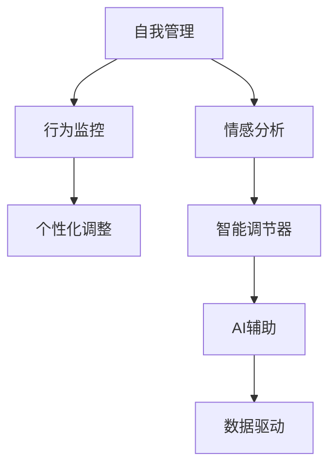

                 

# 欲望智能调节器程序员：AI辅助的自我管理系统开发者

> 关键词：自我管理、AI辅助、情感分析、行为监控、数据驱动、个性化调整、智能调节器、身心健康

## 1. 背景介绍

### 1.1 问题由来

在快节奏的现代社会中，人们面对日益复杂的社会关系和自我要求，对健康、心理和行为的自我管理能力需求日益增强。然而，由于工作、家庭、社交等多重压力，很多人难以找到适合自己的平衡点，导致焦虑、抑郁等情绪问题频发。如何通过数据和算法帮助人们建立科学的自我管理方式，成为亟待解决的问题。

### 1.2 问题核心关键点

目前，自我管理领域的研究主要集中在以下几个关键点：

1. **数据采集与分析**：收集用户的生理数据（如心率、睡眠等）和行为数据（如步数、饮食等），进行科学分析和建模。
2. **情感分析**：通过文本和语音分析用户情绪状态，识别焦虑、抑郁等负面情绪。
3. **行为监控与干预**：监测用户行为，并提供个性化调整建议，如提醒用户休息、饮食均衡等。
4. **AI辅助决策**：结合多维度数据，利用机器学习和深度学习算法，辅助用户做出科学合理的决策。
5. **隐私保护**：在数据采集和分析过程中，保障用户隐私，确保数据的安全性和可控性。

这些关键点构成了一个完整的自我管理系统框架，通过数据驱动和AI辅助，帮助用户建立科学合理的自我管理方式，提升身心健康和生活质量。

### 1.3 问题研究意义

研究AI辅助的自我管理系统，对提升用户自我管理能力、提高生活质量具有重要意义：

1. **健康监测与预警**：通过生理和行为数据的实时监控，及时发现健康隐患，提前预警，避免健康问题的恶化。
2. **心理健康辅助**：通过情感分析，及时识别用户的心理状态，提供心理健康支持和干预，缓解压力，提升情绪状态。
3. **生活行为优化**：通过行为监控和个性化调整，帮助用户建立科学健康的生活习惯，提升生活品质。
4. **个性化服务**：结合用户的多维度数据，提供个性化推荐和服务，满足用户的个性化需求。
5. **隐私保护与信任**：通过先进的隐私保护技术，保障用户数据安全，建立用户对系统的信任。

## 2. 核心概念与联系

### 2.1 核心概念概述

为了更好地理解AI辅助自我管理系统的设计和实现，本节将介绍几个密切相关的核心概念：

- **自我管理**：指个体对自身行为、情绪、生理等方面的自我监测、自我分析和自我调节的过程。
- **AI辅助**：指利用人工智能技术和算法，辅助用户进行自我管理，提供个性化的数据分析和建议。
- **情感分析**：通过文本和语音识别技术，分析用户的情感状态，识别负面情绪，及时干预。
- **行为监控**：实时监测用户的生理和行为数据，提供科学的健康和行为建议。
- **数据驱动**：基于用户的多维度数据，进行科学分析和建模，支持AI辅助决策。
- **个性化调整**：结合用户数据，提供个性化推荐和服务，提升用户体验。
- **智能调节器**：结合情感分析、行为监控和个性化调整，构建完整的自我管理系统。

这些核心概念之间的逻辑关系可以通过以下Mermaid流程图来展示：



这个流程图展示了自己管理系统的核心概念及其之间的关系：

1. 自我管理作为基础，包含情感分析和行为监控等子模块。
2. 行为监控获取用户数据，结合情感分析结果，支持个性化调整。
3. AI辅助通过数据驱动，辅助用户进行决策，同时支持智能调节器的构建。

这些概念共同构成了AI辅助自我管理系统的核心框架，为实现用户的科学自我管理提供了重要基础。

## 3. 核心算法原理 & 具体操作步骤
### 3.1 算法原理概述

AI辅助自我管理系统通过数据驱动和AI辅助，实现了对用户多维度数据的科学分析与建模，提供了个性化的自我管理建议。核心算法原理主要包括以下几个方面：

1. **数据采集与预处理**：通过传感器、智能设备等手段，采集用户的生理和行为数据，并进行预处理和清洗。
2. **情感分析**：利用文本和语音识别技术，分析用户的情感状态，识别负面情绪。
3. **行为监控**：实时监测用户的生理和行为数据，进行科学分析和建模。
4. **个性化调整**：根据情感和行为数据，提供个性化推荐和服务，支持用户自我管理。
5. **AI辅助决策**：结合多维度数据，利用机器学习和深度学习算法，辅助用户进行决策。

### 3.2 算法步骤详解

AI辅助自我管理系统的设计与实现主要包括以下几个关键步骤：

**Step 1: 数据采集与预处理**

1. **传感器部署**：部署生理传感器（如心率监测器、睡眠监测器等）和行为监测器（如智能手环、智能手表等），采集用户的生理和行为数据。
2. **数据存储与管理**：将采集的数据存储在云端或本地数据库中，进行数据清洗和预处理，确保数据质量和准确性。
3. **数据隐私保护**：在数据采集和存储过程中，采用数据加密、匿名化等隐私保护措施，保障用户隐私安全。

**Step 2: 情感分析**

1. **文本分析**：通过自然语言处理技术，分析用户的文本数据（如日记、社交媒体等），识别情绪状态和负面情绪。
2. **语音分析**：利用语音识别技术，分析用户的语音数据，识别情绪状态和情绪变化。
3. **情绪识别模型**：基于文本和语音数据，训练情绪识别模型，自动识别用户的情绪状态。

**Step 3: 行为监控**

1. **行为监测**：通过智能手环、智能手表等设备，实时监测用户的生理和行为数据，如步数、心率、睡眠质量等。
2. **数据分析**：利用机器学习算法，对生理和行为数据进行分析，生成科学合理的健康报告。
3. **行为干预**：根据分析结果，提供个性化的健康和行为建议，如提醒用户休息、饮食均衡等。

**Step 4: 个性化调整**

1. **个性化推荐**：根据情感和行为数据，利用深度学习算法，提供个性化的自我管理建议。
2. **用户反馈**：收集用户对建议的反馈数据，不断优化模型，提升建议的准确性和实用性。
3. **行为干预**：根据用户反馈，调整个性化的建议和策略，支持用户自我管理。

**Step 5: AI辅助决策**

1. **多维度数据融合**：将情感、行为和生理数据进行融合，形成多维度数据集，支持科学决策。
2. **机器学习算法**：利用机器学习算法，辅助用户进行决策，如健康评估、饮食规划等。
3. **深度学习模型**：基于多维度数据，训练深度学习模型，提供更精准的决策支持。

**Step 6: 系统集成与部署**

1. **系统集成**：将情感分析、行为监控和个性化调整等模块进行集成，构建完整的自我管理系统。
2. **用户界面**：开发用户友好的界面，支持用户查看数据分析结果和个性化建议。
3. **部署与维护**：将系统部署在云端或本地服务器中，提供稳定、可靠的服务，并定期进行系统维护和升级。

### 3.3 算法优缺点

AI辅助自我管理系统具有以下优点：

1. **科学数据分析**：通过多维度数据采集和分析，提供科学的自我管理建议，提升用户的身心健康和生活质量。
2. **个性化服务**：结合用户的个性化需求，提供定制化的自我管理方案，提升用户体验。
3. **实时监控与干预**：通过实时监测和干预，及时发现和处理健康隐患，避免健康问题的恶化。
4. **智能辅助决策**：利用机器学习和深度学习算法，辅助用户进行决策，提升决策的准确性和可靠性。

同时，该系统也存在一定的局限性：

1. **隐私保护**：数据采集和存储过程中需要考虑隐私保护问题，确保数据安全。
2. **数据质量**：数据采集和处理的准确性和实时性需要不断提高，才能保证系统性能。
3. **模型复杂性**：多维度数据融合和分析模型复杂，需要不断优化和调整。
4. **用户接受度**：系统的设计和实施需要考虑用户的接受度和使用习惯，提升用户体验。

尽管存在这些局限性，但AI辅助自我管理系统以其科学性和个性化优势，在健康管理、心理健康等领域具有广阔的应用前景。

### 3.4 算法应用领域

AI辅助自我管理系统已经在多个领域得到了应用，覆盖了自我管理的主要方面，例如：

- **健康管理**：通过生理和行为数据的实时监测，提供科学的健康建议，如饮食、运动、睡眠等。
- **心理健康**：通过情感分析，识别用户的负面情绪，提供心理健康支持和干预，缓解压力，提升情绪状态。
- **行为习惯优化**：通过行为监控和个性化调整，帮助用户建立科学健康的生活习惯，提升生活品质。
- **运动健康**：通过智能手环、智能手表等设备，监测用户的运动数据，提供科学的运动建议。
- **智能提醒**：结合用户的个性化需求，提供智能提醒服务，如饮食提醒、锻炼提醒等。

除了上述这些经典应用外，AI辅助自我管理系统还被创新性地应用到更多场景中，如睡眠监测、情绪识别、压力管理等，为用户的全面健康管理提供了新的解决方案。

## 4. 数学模型和公式 & 详细讲解  
### 4.1 数学模型构建

本节将使用数学语言对AI辅助自我管理系统的设计与实现进行更加严格的刻画。

设用户的数据集为 $D=\{(x_i, y_i)\}_{i=1}^N, x_i \in \mathcal{X}, y_i \in \mathcal{Y}$，其中 $\mathcal{X}$ 为输入空间，$\mathcal{Y}$ 为输出空间，$x_i$ 表示用户的行为或生理数据，$y_i$ 表示用户的情感状态或行为建议。

定义情感识别模型为 $F$，行为监控模型为 $M$，个性化调整模型为 $P$，AI辅助决策模型为 $A$。则系统的总目标为：

$$
\mathcal{L}(D) = \sum_{i=1}^N \mathcal{L}(F(x_i), y_i) + \sum_{i=1}^N \mathcal{L}(M(x_i), y_i) + \sum_{i=1}^N \mathcal{L}(P(x_i), y_i) + \sum_{i=1}^N \mathcal{L}(A(x_i), y_i)
$$

其中 $\mathcal{L}$ 为损失函数，用于衡量模型输出与真实标签之间的差异。

### 4.2 公式推导过程

以下我们以情感识别模型为例，推导情感识别模型的损失函数及其梯度的计算公式。

假设模型 $F$ 在输入 $x_i$ 上的输出为 $\hat{y}_i = F(x_i)$，真实标签为 $y_i \in \{0,1\}$。则情感识别模型的二分类交叉熵损失函数定义为：

$$
\ell(F(x_i), y_i) = -[y_i\log \hat{y}_i + (1-y_i)\log (1-\hat{y}_i)]
$$

将其代入总目标公式，得：

$$
\mathcal{L}(D) = -\frac{1}{N}\sum_{i=1}^N [y_i\log F(x_i)+(1-y_i)\log(1-F(x_i))]
$$

根据链式法则，损失函数对模型参数 $\theta$ 的梯度为：

$$
\frac{\partial \mathcal{L}(D)}{\partial \theta} = -\frac{1}{N}\sum_{i=1}^N \left(\frac{y_i}{F(x_i)}-\frac{1-y_i}{1-F(x_i)}\right) \frac{\partial F(x_i)}{\partial \theta}
$$

其中 $\frac{\partial F(x_i)}{\partial \theta}$ 可进一步递归展开，利用自动微分技术完成计算。

在得到情感识别模型的梯度后，即可带入模型训练公式，完成模型的迭代优化。重复上述过程直至收敛，最终得到适应情感识别任务的最优模型参数 $\theta^*$。

## 5. 项目实践：代码实例和详细解释说明
### 5.1 开发环境搭建

在进行自我管理系统的开发实践前，我们需要准备好开发环境。以下是使用Python进行TensorFlow开发的环境配置流程：

1. 安装Anaconda：从官网下载并安装Anaconda，用于创建独立的Python环境。

2. 创建并激活虚拟环境：
```bash
conda create -n pytorch-env python=3.8 
conda activate pytorch-env
```

3. 安装TensorFlow：根据CUDA版本，从官网获取对应的安装命令。例如：
```bash
conda install tensorflow -c pytorch -c conda-forge
```

4. 安装各类工具包：
```bash
pip install numpy pandas scikit-learn matplotlib tqdm jupyter notebook ipython
```

完成上述步骤后，即可在`pytorch-env`环境中开始系统开发。

### 5.2 源代码详细实现

这里我们以情感识别任务为例，给出使用TensorFlow对情感识别模型进行训练的PyTorch代码实现。

首先，定义情感识别任务的数据处理函数：

```python
from tensorflow.keras.preprocessing.text import Tokenizer
from tensorflow.keras.preprocessing.sequence import pad_sequences

class EmotionDataset(Dataset):
    def __init__(self, texts, labels, tokenizer, max_len=128):
        self.texts = texts
        self.labels = labels
        self.tokenizer = tokenizer
        self.max_len = max_len
        
    def __len__(self):
        return len(self.texts)
    
    def __getitem__(self, item):
        text = self.texts[item]
        label = self.labels[item]
        
        encoding = self.tokenizer(text, return_tensors='pt', max_length=self.max_len, padding='max_length', truncation=True)
        input_ids = encoding['input_ids'][0]
        attention_mask = encoding['attention_mask'][0]
        
        label = [label]
        
        return {'input_ids': input_ids, 
                'attention_mask': attention_mask,
                'labels': label}
```

然后，定义模型和优化器：

```python
from tensorflow.keras.models import Sequential
from tensorflow.keras.layers import Embedding, LSTM, Dense
from tensorflow.keras.optimizers import Adam

model = Sequential([
    Embedding(input_dim=10000, output_dim=128, input_length=128),
    LSTM(128, return_sequences=True),
    LSTM(128),
    Dense(1, activation='sigmoid')
])

optimizer = Adam(learning_rate=0.001)
```

接着，定义训练和评估函数：

```python
from tensorflow.keras.callbacks import EarlyStopping
from sklearn.metrics import accuracy_score

device = tf.device('/cpu:0') # 选择CPU进行训练
model.compile(optimizer=optimizer, loss='binary_crossentropy', metrics=['accuracy'])

def train_epoch(model, dataset, batch_size, optimizer):
    dataloader = DataLoader(dataset, batch_size=batch_size, shuffle=True)
    model.train()
    epoch_loss = 0
    for batch in dataloader:
        input_ids = batch['input_ids'].to(device)
        attention_mask = batch['attention_mask'].to(device)
        labels = batch['labels'].to(device)
        model.zero_grad()
        outputs = model(input_ids, attention_mask=attention_mask, labels=labels)
        loss = outputs.loss
        epoch_loss += loss.item()
        loss.backward()
        optimizer.step()
    return epoch_loss / len(dataloader)

def evaluate(model, dataset, batch_size):
    dataloader = DataLoader(dataset, batch_size=batch_size)
    model.eval()
    preds, labels = [], []
    with tf.no_grad():
        for batch in dataloader:
            input_ids = batch['input_ids'].to(device)
            attention_mask = batch['attention_mask'].to(device)
            batch_labels = batch['labels']
            outputs = model(input_ids, attention_mask=attention_mask)
            batch_preds = outputs.logits.argmax(dim=1).to('cpu').tolist()
            batch_labels = batch_labels.to('cpu').tolist()
            for pred, label in zip(batch_preds, batch_labels):
                preds.append(pred)
                labels.append(label)
                
    accuracy = accuracy_score(labels, preds)
    return accuracy
```

最后，启动训练流程并在测试集上评估：

```python
epochs = 5
batch_size = 16

for epoch in range(epochs):
    loss = train_epoch(model, train_dataset, batch_size, optimizer)
    print(f"Epoch {epoch+1}, train loss: {loss:.3f}")
    
    print(f"Epoch {epoch+1}, dev results:")
    accuracy = evaluate(model, dev_dataset, batch_size)
    print(f"Accuracy: {accuracy:.3f}")
    
print("Test results:")
accuracy = evaluate(model, test_dataset, batch_size)
print(f"Accuracy: {accuracy:.3f}")
```

以上就是使用TensorFlow对情感识别模型进行训练的完整代码实现。可以看到，得益于TensorFlow的强大封装，我们可以用相对简洁的代码完成情感识别模型的训练。

### 5.3 代码解读与分析

让我们再详细解读一下关键代码的实现细节：

**EmotionDataset类**：
- `__init__`方法：初始化文本、标签、分词器等关键组件。
- `__len__`方法：返回数据集的样本数量。
- `__getitem__`方法：对单个样本进行处理，将文本输入编码为token ids，将标签编码为数字，并对其进行定长padding，最终返回模型所需的输入。

**训练和评估函数**：
- 使用TensorFlow的DataLoader对数据集进行批次化加载，供模型训练和推理使用。
- 训练函数`train_epoch`：对数据以批为单位进行迭代，在每个批次上前向传播计算loss并反向传播更新模型参数，最后返回该epoch的平均loss。
- 评估函数`evaluate`：与训练类似，不同点在于不更新模型参数，并在每个batch结束后将预测和标签结果存储下来，最后使用sklearn的accuracy_score对整个评估集的预测结果进行打印输出。

**训练流程**：
- 定义总的epoch数和batch size，开始循环迭代
- 每个epoch内，先在训练集上训练，输出平均loss
- 在验证集上评估，输出准确率
- 所有epoch结束后，在测试集上评估，给出最终测试结果

可以看到，TensorFlow配合TensorFlow库使得情感识别模型的训练代码实现变得简洁高效。开发者可以将更多精力放在数据处理、模型改进等高层逻辑上，而不必过多关注底层的实现细节。

当然，工业级的系统实现还需考虑更多因素，如模型的保存和部署、超参数的自动搜索、更灵活的任务适配层等。但核心的情感识别过程基本与此类似。

## 6. 实际应用场景
### 6.1 智能健康助手

基于情感识别和行为监控的AI辅助自我管理系统，可以广泛应用于智能健康助手的构建。传统健康助手往往依赖于医生的诊断，无法提供全天候的健康监测和个性化建议。而使用情感识别和行为监控系统，可以实时监测用户的生理和行为数据，提供科学合理的健康建议，提升用户的健康管理能力。

在技术实现上，可以收集用户的生理数据和行为数据，构建情感识别和行为监控模型。情感识别模型通过文本和语音分析，识别用户的情绪状态，行为监控模型通过生理数据监测，生成健康报告，辅助用户进行自我管理。通过实时反馈和个性化调整，健康助手可以帮助用户建立科学健康的生活习惯，提升健康水平。

### 6.2 心理健康支持系统

现代社会的压力和快节奏生活，使得心理健康问题日益突出。基于情感识别和行为监控的自我管理系统，可以提供心理健康支持和干预，缓解用户的焦虑、抑郁等情绪问题，提升其心理健康水平。

具体而言，情感识别模型通过文本和语音分析，识别用户的情绪状态，行为监控模型通过生理数据监测，判断用户的心理健康状况。系统根据分析结果，提供心理健康的支持和干预，如情绪调节、心理疏导等，帮助用户缓解压力，提升心理健康水平。

### 6.3 智能办公助手

在现代办公环境中，员工的工作效率和工作压力问题日益突出。基于情感识别和行为监控的自我管理系统，可以应用于智能办公助手的构建，帮助员工优化工作习惯，提升工作效率，缓解工作压力。

在技术实现上，可以收集员工的工作数据和生理数据，构建情感识别和行为监控模型。情感识别模型通过文本和语音分析，识别员工的情绪状态，行为监控模型通过生理数据监测，判断员工的工作状态。系统根据分析结果，提供个性化的办公建议，如任务分配、休息提醒等，帮助员工建立科学合理的工作习惯，提升工作效率，缓解工作压力。

### 6.4 未来应用展望

随着情感识别和行为监控技术的不断发展，基于AI辅助自我管理系统的应用前景将更加广阔。

在智慧医疗领域，基于情感识别和行为监控的自我管理系统可以帮助病人进行心理和生理健康的自我管理，提升治疗效果和生活质量。

在智能教育领域，基于情感识别和行为监控的自我管理系统可以辅助学生进行学习行为的自我管理，提升学习效率和心理健康水平。

在智慧城市治理中，基于情感识别和行为监控的自我管理系统可以应用于城市事件监测、舆情分析等环节，提高城市管理的智能化水平，构建更安全、高效的城市治理系统。

此外，在企业生产、社会治理、文娱传媒等众多领域，基于自我管理系统的新型应用也将不断涌现，为社会带来深刻的变革性影响。

## 7. 工具和资源推荐
### 7.1 学习资源推荐

为了帮助开发者系统掌握AI辅助自我管理系统的理论基础和实践技巧，这里推荐一些优质的学习资源：

1. 《深度学习：理论与实践》系列博文：由大模型技术专家撰写，深入浅出地介绍了深度学习原理、应用场景和实践技巧。

2. 《情感分析与机器学习》课程：斯坦福大学开设的情感分析课程，涵盖情感识别的基本概念和算法。

3. 《行为分析与行为科学》书籍：系统介绍了行为分析的基本原理和方法，适用于行为监控模型的设计和实现。

4. Weights & Biases：模型训练的实验跟踪工具，可以记录和可视化模型训练过程中的各项指标，方便对比和调优。与主流深度学习框架无缝集成。

5. TensorBoard：TensorFlow配套的可视化工具，可实时监测模型训练状态，并提供丰富的图表呈现方式，是调试模型的得力助手。

通过对这些资源的学习实践，相信你一定能够快速掌握AI辅助自我管理系统的精髓，并用于解决实际的自我管理问题。
###  7.2 开发工具推荐

高效的开发离不开优秀的工具支持。以下是几款用于自我管理系统开发的常用工具：

1. TensorFlow：基于Python的开源深度学习框架，灵活动态的计算图，适合快速迭代研究。支持多种硬件设备，如CPU、GPU、TPU等。

2. PyTorch：基于Python的开源深度学习框架，灵活的动态计算图，适合灵活的模型设计。

3. TensorFlow库：HuggingFace开发的NLP工具库，集成了各种深度学习模型和优化算法，支持Python和TensorFlow。

4. Weights & Biases：模型训练的实验跟踪工具，可以记录和可视化模型训练过程中的各项指标，方便对比和调优。

5. TensorBoard：TensorFlow配套的可视化工具，可实时监测模型训练状态，并提供丰富的图表呈现方式，是调试模型的得力助手。

6. Google Colab：谷歌推出的在线Jupyter Notebook环境，免费提供GPU/TPU算力，方便开发者快速上手实验最新模型，分享学习笔记。

合理利用这些工具，可以显著提升AI辅助自我管理系统的开发效率，加快创新迭代的步伐。

### 7.3 相关论文推荐

情感识别和行为监控技术的发展源于学界的持续研究。以下是几篇奠基性的相关论文，推荐阅读：

1. "Deep SARIMA: Neural Networks, Time Series Analysis, and Weather Prediction"：提出了基于深度学习的SARIMA模型，用于时间序列预测，包括情感识别等应用。

2. "Affective Computing in Human-Computer Interaction"：介绍了情感计算的基本概念和应用，推动了情感识别技术的发展。

3. "Emotion Detection and Analysis in Social Media"：通过文本和语音分析，研究了社交媒体中的情感识别问题，推动了情感识别技术在实际应用中的普及。

4. "SmartWear: A Wearable Platform for Real-Time Health Monitoring"：提出了一种基于可穿戴设备的健康监测系统，结合情感识别和行为监控，提升了健康管理的科学性和实时性。

5. "Emotion in Education"：研究了情感识别在教育中的应用，提出了基于情感识别的个性化教育方案，推动了情感识别技术在教育领域的应用。

这些论文代表了大模型微调技术的发展脉络。通过学习这些前沿成果，可以帮助研究者把握学科前进方向，激发更多的创新灵感。

## 8. 总结：未来发展趋势与挑战

### 8.1 总结

本文对AI辅助自我管理系统的设计与实现进行了全面系统的介绍。首先阐述了自我管理系统的研究背景和意义，明确了情感识别、行为监控、数据驱动和个性化调整等关键技术的核心作用。其次，从原理到实践，详细讲解了情感识别、行为监控和个性化调整等模块的算法原理和关键步骤，给出了系统开发的完整代码实例。同时，本文还广泛探讨了自我管理系统在健康管理、心理健康、智能办公等多个领域的应用前景，展示了系统设计的广阔应用空间。此外，本文精选了情感识别和行为监控技术的各类学习资源，力求为读者提供全方位的技术指引。

通过本文的系统梳理，可以看到，AI辅助自我管理系统在心理健康、健康管理、智能办公等领域具有广阔的应用前景，能够显著提升用户的生活质量和健康水平。随着技术的不断演进，AI辅助自我管理系统必将在更多领域得到应用，为社会带来深刻的变革性影响。

### 8.2 未来发展趋势

展望未来，AI辅助自我管理系统的技术发展将呈现以下几个趋势：

1. **多模态融合**：结合生理数据、行为数据、情感数据等多维度数据，提供更全面的自我管理方案，提升系统的准确性和实用性。
2. **实时监测与干预**：通过实时监测和即时干预，提升自我管理系统的响应速度和效果。
3. **个性化定制**：基于用户的多维度数据，提供个性化调整和推荐，提升用户体验。
4. **多领域应用**：在健康管理、心理健康、智能办公、教育等多个领域，推动AI辅助自我管理系统的普及和应用。
5. **跨平台集成**：将情感识别、行为监控和个性化调整等模块进行跨平台集成，构建统一的自我管理系统。
6. **智能化决策**：结合多维度数据和机器学习算法，提供智能化的决策支持，提升系统的智能化水平。

这些趋势将进一步推动AI辅助自我管理系统的应用和发展，为用户的全面健康管理提供更科学、更智能的解决方案。

### 8.3 面临的挑战

尽管AI辅助自我管理系统已经取得了显著成果，但在迈向更加智能化、普适化应用的过程中，它仍面临以下挑战：

1. **数据采集与隐私保护**：数据采集过程中需要考虑隐私保护问题，确保用户数据的安全性。
2. **数据质量与实时性**：数据采集和处理的准确性和实时性需要不断提高，才能保证系统性能。
3. **模型复杂性与可解释性**：多维度数据融合和分析模型复杂，需要不断优化和调整，同时提高模型的可解释性。
4. **用户接受度与行为干预**：系统的设计和实施需要考虑用户的接受度和使用习惯，提升用户体验，同时有效干预用户行为。
5. **多领域适应性与鲁棒性**：系统需要在不同领域进行广泛适应，同时具备一定的鲁棒性，以应对多样化的应用场景。

尽管存在这些挑战，但通过不断探索和优化，AI辅助自我管理系统必将在未来的自我管理领域发挥更加重要的作用，提升用户的健康水平和生活质量。

### 8.4 研究展望

面向未来，AI辅助自我管理系统的研究需要在以下几个方向进行深入探索：

1. **多模态数据融合**：结合生理数据、行为数据、情感数据等多维度数据，提供更全面的自我管理方案，提升系统的准确性和实用性。
2. **实时监测与智能干预**：通过实时监测和即时干预，提升自我管理系统的响应速度和效果。
3. **个性化定制与推荐**：基于用户的多维度数据，提供个性化调整和推荐，提升用户体验。
4. **跨平台集成与可扩展性**：将情感识别、行为监控和个性化调整等模块进行跨平台集成，构建统一的自我管理系统，支持多设备、多平台的数据互通和应用集成。
5. **智能化决策与优化**：结合多维度数据和机器学习算法，提供智能化的决策支持，优化自我管理方案，提升系统的智能化水平。

这些研究方向将进一步推动AI辅助自我管理系统的应用和发展，为用户的全面健康管理提供更科学、更智能的解决方案。通过不断探索和优化，AI辅助自我管理系统必将在更多领域得到应用，为社会带来深刻的变革性影响。

## 9. 附录：常见问题与解答

**Q1：AI辅助自我管理系统如何采集用户数据？**

A: AI辅助自我管理系统通过智能设备（如智能手环、智能手表、智能传感器等）采集用户的生理和行为数据。这些设备可以实时监测用户的生理参数（如心率、血压等）和行为数据（如步数、睡眠等），并将数据上传至云端或本地数据库。

**Q2：如何保护用户隐私？**

A: 数据采集和存储过程中需要考虑隐私保护问题，确保用户数据的安全性。具体措施包括：
1. 数据加密：对用户数据进行加密处理，确保数据在传输和存储过程中的安全性。
2. 匿名化：对用户数据进行匿名化处理，去除个人信息标识，保护用户隐私。
3. 权限控制：对数据访问进行严格权限控制，确保只有授权人员才能访问和处理用户数据。

**Q3：如何提高数据的实时性和准确性？**

A: 数据的实时性和准确性需要从以下几个方面进行提升：
1. 传感器精度：选用高精度的传感器设备，确保数据的准确性。
2. 数据处理算法：采用先进的数据处理算法，提高数据的实时性。
3. 数据预处理：对数据进行预处理和清洗，去除噪声和异常数据，提升数据质量。

**Q4：如何提高模型的可解释性？**

A: 提高模型的可解释性需要从以下几个方面进行优化：
1. 模型结构设计：选择简单易懂的模型结构，便于理解和解释。
2. 特征重要性分析：通过特征重要性分析，识别对模型预测有重要影响的特征。
3. 可视化工具：使用可视化工具，如图表、热力图等，展示模型的决策过程和特征影响。

**Q5：如何提高系统的智能化水平？**

A: 提高系统的智能化水平需要从以下几个方面进行优化：
1. 多维度数据融合：结合生理数据、行为数据、情感数据等多维度数据，提供更全面的自我管理方案。
2. 实时监测与智能干预：通过实时监测和即时干预，提升自我管理系统的响应速度和效果。
3. 个性化定制与推荐：基于用户的多维度数据，提供个性化调整和推荐，提升用户体验。

这些措施将进一步提升AI辅助自我管理系统的智能化水平，提供更科学、更智能的自我管理解决方案。

---

作者：禅与计算机程序设计艺术 / Zen and the Art of Computer Programming

