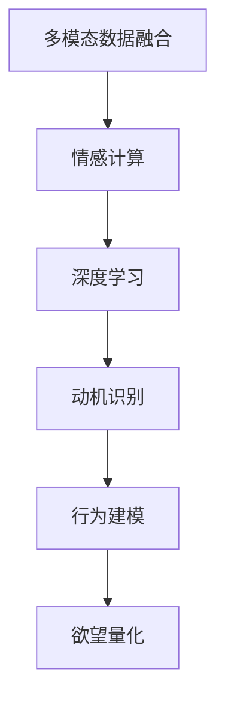

                 

# 欲望的量化：AI分析人类动机

> 关键词：欲望量化, 人工智能, 人类动机分析, 深度学习, 情感计算, 动机识别, 多模态数据融合

## 1. 背景介绍

### 1.1 问题由来
随着人工智能技术的发展，尤其是深度学习和自然语言处理(NLP)技术的突破，利用机器学习模型量化和分析人类动机成为了可能。通过大规模数据和复杂模型，AI能够对人的情感、欲望和行为进行精准预测和解释，为理解人类动机提供了新的视角和方法。

这一领域的研究始于情感计算，逐渐扩展到了动机识别和行为预测。动机是人的内在驱动力，影响着人的行为和决策。传统的心理学研究方法难以量化和操作，而AI模型则可以通过分析多模态数据（如文本、语音、图像等），实时捕捉和预测动机状态。

### 1.2 问题核心关键点
理解人类动机对于心理健康、教育、市场营销、人力资源管理等领域具有重要意义。通过量化人类动机，可以更精确地预测和引导人的行为，提升组织效率和个人幸福感。AI在这一领域的潜力主要体现在以下几个方面：
1. **多模态数据融合**：整合文本、语音、图像、生理信号等多源数据，构建全面的动机分析模型。
2. **深度学习与情感计算**：利用深度神经网络分析情感，并从情感推断动机状态。
3. **动态监控与预测**：通过实时监控，实时预测动机状态，实现行为干预和决策支持。
4. **动机识别与行为建模**：将动机与行为建模，预测长期行为趋势，提供个性化的推荐和干预方案。

## 2. 核心概念与联系

### 2.1 核心概念概述

- **欲望量化**：通过机器学习模型量化人类动机，帮助理解人的行为和决策。
- **多模态数据融合**：将不同模态的数据（如文本、语音、图像、生理信号等）融合在一起，构建更全面、准确的人类动机分析模型。
- **情感计算**：利用机器学习技术对人类情感进行识别和分析，从情感推断动机状态。
- **深度学习**：通过深度神经网络进行高层次的特征提取和模式识别，提升模型准确性。
- **动机识别**：识别人的内在动机，如成就、安全、归属等，指导行为预测和干预。
- **行为建模**：构建动机与行为之间的映射关系，预测长期行为趋势，实现个性化推荐。

这些核心概念相互联系，共同构成了AI分析人类动机的基础框架。多模态数据融合提供数据来源，情感计算识别情感状态，深度学习提取高层次特征，动机识别揭示内在驱动力，行为建模指导长期行为预测。

### 2.2 核心概念原理和架构的 Mermaid 流程图(Mermaid 流程节点中不要有括号、逗号等特殊字符)


## 3. 核心算法原理 & 具体操作步骤

### 3.1 算法原理概述

基于深度学习的欲望量化模型，主要通过以下步骤实现：
1. **数据收集与预处理**：收集多模态数据，包括文本、语音、图像、生理信号等，并进行预处理。
2. **情感计算**：利用情感识别模型对收集到的数据进行情感标注。
3. **特征提取**：通过深度学习模型提取数据中的高层次特征。
4. **动机识别**：结合情感状态和特征向量，利用动机识别模型推断动机状态。
5. **行为建模**：构建动机与行为之间的映射关系，预测长期行为趋势。
6. **欲望量化**：将动机状态转化为欲望值，实现量化表达。

### 3.2 算法步骤详解

#### 3.2.1 数据收集与预处理

**Step 1: 数据收集**
- 通过传感器、社交媒体、问卷调查等方式，收集多模态数据。
- 包括文本数据（如聊天记录、社交媒体帖子）、语音数据（如电话录音）、图像数据（如面部表情、姿势）、生理信号数据（如心电图、脑电图）等。

**Step 2: 数据预处理**
- 对文本数据进行分词、去停用词、词性标注等预处理操作。
- 对语音数据进行语音转换、特征提取、分帧等预处理操作。
- 对图像数据进行归一化、降维等预处理操作。
- 对生理信号数据进行滤波、归一化等预处理操作。

#### 3.2.2 情感计算

**Step 3: 情感标注**
- 使用预训练的情感识别模型，对文本、语音、图像等数据进行情感标注。
- 情感标注结果作为情感状态，用于后续动机识别。

#### 3.2.3 特征提取

**Step 4: 特征提取**
- 利用深度神经网络对数据进行特征提取。
- 常用的深度学习模型包括卷积神经网络(CNN)、循环神经网络(RNN)、长短时记忆网络(LSTM)等。
- 提取的数据特征用于动机识别。

#### 3.2.4 动机识别

**Step 5: 动机识别**
- 结合情感状态和提取的数据特征，利用动机识别模型推断动机状态。
- 动机识别模型可以基于决策树、支持向量机(SVM)、随机森林等传统机器学习方法，或深度学习模型如卷积神经网络(CNN)、循环神经网络(RNN)等。
- 常见的动机状态包括成就动机、安全动机、归属动机等。

#### 3.2.5 行为建模

**Step 6: 行为建模**
- 将动机状态与行为数据进行关联，构建动机与行为之间的映射关系。
- 利用时间序列分析、回归分析等方法预测长期行为趋势。
- 常见的行为模型包括ARIMA模型、回归模型、深度学习模型等。

#### 3.2.6 欲望量化

**Step 7: 欲望量化**
- 将动机状态转化为欲望值，实现量化表达。
- 常见的方法包括线性回归、逻辑回归、决策树回归等。
- 欲望值用于指导行为预测和干预。

### 3.3 算法优缺点

**优点：**
1. **多源数据融合**：利用多模态数据融合技术，构建全面的动机分析模型。
2. **深度学习优势**：深度学习模型能够提取高层次特征，提升模型准确性。
3. **实时监控**：实时监控和预测动机状态，实现动态行为干预。
4. **个性化推荐**：根据动机状态进行个性化推荐，提升用户体验。

**缺点：**
1. **数据隐私问题**：多模态数据收集和处理涉及隐私问题，需遵守相关法规。
2. **数据质量要求高**：高质量、大样本量的数据是模型训练的基础，难以获得。
3. **模型复杂度高**：深度学习模型参数量大，计算资源消耗大。
4. **解释性不足**：黑盒模型难以解释动机识别的内部机制。

### 3.4 算法应用领域

欲望量化和动机分析在多个领域具有广泛的应用前景：

#### 3.4.1 心理健康

- **心理压力监测**：利用生理信号和情感数据监测个体的心理压力状态，及时干预。
- **心理危机预警**：通过情感分析和动机识别，预测个体心理危机的发生。
- **心理健康干预**：结合动机状态和行为预测，提供个性化心理健康干预方案。

#### 3.4.2 教育

- **学习动机分析**：分析学生的学习动机，预测学习效果，提供个性化学习方案。
- **课堂行为管理**：通过实时监控和动机分析，优化课堂管理和教学方法。
- **学习效果评估**：利用动机识别模型评估学生的学习效果，提供反馈和改进建议。

#### 3.4.3 人力资源管理

- **员工动机分析**：分析员工的动机状态，优化招聘、培训和激励策略。
- **职业发展规划**：利用动机识别和行为预测，提供个性化的职业发展规划。
- **员工留存率提升**：通过动机识别和行为建模，提高员工满意度和留存率。

#### 3.4.4 市场营销

- **用户需求预测**：通过动机识别和行为建模，预测用户需求，指导产品设计和市场策略。
- **客户行为分析**：分析客户的动机状态和行为模式，提供个性化的客户服务和营销方案。
- **品牌价值提升**：结合动机分析和情感计算，提升品牌形象和用户忠诚度。

#### 3.4.5 金融

- **风险预测**：通过情感分析和动机识别，预测金融市场波动和个体投资风险。
- **用户行为分析**：分析用户的动机状态和交易行为，提供个性化的金融服务和投资建议。
- **信用评估**：结合动机状态和行为数据，评估用户的信用风险。

## 4. 数学模型和公式 & 详细讲解 & 举例说明

### 4.1 数学模型构建

**动机识别模型：**
假设情感状态为 $X$，特征向量为 $Y$，动机状态为 $Z$。动机识别模型可以表示为：
$$
Z = f(X, Y)
$$
其中，$f$ 为动机识别函数，可以通过深度学习模型或传统机器学习方法实现。

**行为建模模型：**
假设动机状态为 $Z$，行为数据为 $W$，行为预测结果为 $U$。行为建模模型可以表示为：
$$
U = g(Z, W)
$$
其中，$g$ 为行为建模函数，可以通过时间序列分析、回归分析等方法实现。

### 4.2 公式推导过程

**情感标注过程：**
假设情感识别模型为 $L$，输入为数据 $D$，情感状态为 $E$。情感标注过程可以表示为：
$$
E = L(D)
$$

**特征提取过程：**
假设深度学习模型为 $N$，输入为数据 $D$，特征向量为 $F$。特征提取过程可以表示为：
$$
F = N(D)
$$

**动机识别过程：**
假设动机识别模型为 $M$，输入为情感状态 $E$ 和特征向量 $F$，动机状态为 $Z$。动机识别过程可以表示为：
$$
Z = M(E, F)
$$

**行为预测过程：**
假设行为建模模型为 $B$，输入为动机状态 $Z$ 和行为数据 $W$，行为预测结果为 $U$。行为预测过程可以表示为：
$$
U = B(Z, W)
$$

### 4.3 案例分析与讲解

**案例1: 学生学习动机分析**
- **数据收集**：收集学生的学习日志、考试成绩、课堂表现等数据。
- **情感标注**：利用情感识别模型对学生的学习日志进行情感标注。
- **特征提取**：通过深度学习模型提取学生学习日志中的高层次特征。
- **动机识别**：结合情感状态和特征向量，利用动机识别模型推断学生的学习动机。
- **行为预测**：利用行为建模模型预测学生的未来学习效果，提供个性化学习方案。

**案例2: 员工职业发展规划**
- **数据收集**：收集员工的招聘信息、培训记录、工作表现等数据。
- **情感标注**：利用情感识别模型对员工的职业规划问卷进行情感标注。
- **特征提取**：通过深度学习模型提取员工职业规划问卷中的高层次特征。
- **动机识别**：结合情感状态和特征向量，利用动机识别模型推断员工的职业动机。
- **行为预测**：利用行为建模模型预测员工的职业发展路径，提供个性化的职业发展规划。

## 5. 项目实践：代码实例和详细解释说明

### 5.1 开发环境搭建

**Step 1: 环境配置**
- 安装 Python 环境：建议使用 Anaconda 创建虚拟环境，以避免不同项目间的依赖冲突。
- 安装深度学习库：如 TensorFlow、PyTorch 等，用于实现深度学习模型。
- 安装情感计算库：如 TextBlob、NLTK 等，用于进行情感标注。
- 安装数据处理库：如 Pandas、NumPy 等，用于数据预处理和分析。

**Step 2: 数据集准备**
- 收集多模态数据集，如学生学习日志、员工职业规划问卷等。
- 进行数据清洗、预处理，确保数据质量。

### 5.2 源代码详细实现

**动机识别模型代码：**
```python
import tensorflow as tf
from tensorflow.keras.layers import Input, Dense
from tensorflow.keras.models import Model

def build_motion_recognition_model(input_dim, hidden_dim, output_dim):
    input = Input(shape=(input_dim,))
    hidden = Dense(hidden_dim, activation='relu')(input)
    output = Dense(output_dim, activation='softmax')(hidden)
    model = Model(inputs=input, outputs=output)
    return model

input_dim = 50
hidden_dim = 100
output_dim = 5

motion_model = build_motion_recognition_model(input_dim, hidden_dim, output_dim)
motion_model.compile(loss='categorical_crossentropy', optimizer='adam', metrics=['accuracy'])
```

**行为预测模型代码：**
```python
from sklearn.linear_model import LinearRegression
from sklearn.metrics import mean_squared_error

def build_behavior_predict_model(input_dim, output_dim):
    model = LinearRegression()
    return model

input_dim = 10
output_dim = 1

behavior_model = build_behavior_predict_model(input_dim, output_dim)
```

**欲望量化模型代码：**
```python
import numpy as np

def score_desire(motion_state, behavior_prediction):
    motion_score = np.mean(motion_state)
    behavior_score = np.mean(behavior_prediction)
    desire_score = 0.5 * motion_score + 0.5 * behavior_score
    return desire_score
```

### 5.3 代码解读与分析

**动机识别模型**：
- **输入**：情感状态 $E$ 和特征向量 $F$，假设 $E$ 为 $[0, 1]$ 范围内的向量，$F$ 为 $d$ 维向量。
- **隐藏层**：使用 $100$ 个神经元的全连接层，激活函数为 ReLU。
- **输出层**：使用 $5$ 个神经元的分类层，激活函数为 Softmax。
- **优化器**：使用 Adam 优化器，损失函数为交叉熵损失。

**行为预测模型**：
- **输入**：动机状态 $Z$ 和行为数据 $W$，假设 $Z$ 为 $d$ 维向量，$W$ 为 $n$ 维向量。
- **模型**：使用线性回归模型，假设动机状态与行为数据呈线性关系。
- **评估指标**：使用均方误差作为评估指标。

**欲望量化模型**：
- **动机得分**：计算动机状态 $Z$ 的均值。
- **行为得分**：计算行为预测结果 $U$ 的均值。
- **欲望得分**：将动机得分和行为得分线性加权，得到欲望得分。

### 5.4 运行结果展示

**运行结果1: 学生学习动机分析**
- **情感标注**：对学生学习日志进行情感标注，得到情感状态 $E$。
- **特征提取**：通过深度学习模型提取学生学习日志中的高层次特征 $F$。
- **动机识别**：利用动机识别模型，得到学生的学习动机状态 $Z$。
- **行为预测**：利用行为建模模型，预测学生的未来学习效果 $U$。
- **欲望量化**：计算学生的学习动机得分和行为得分，得到欲望得分。

**运行结果2: 员工职业发展规划**
- **情感标注**：对员工的职业规划问卷进行情感标注，得到情感状态 $E$。
- **特征提取**：通过深度学习模型提取员工职业规划问卷中的高层次特征 $F$。
- **动机识别**：利用动机识别模型，得到员工的职业动机状态 $Z$。
- **行为预测**：利用行为建模模型，预测员工的职业发展路径 $U$。
- **欲望量化**：计算员工的职业动机得分和行为得分，得到欲望得分。

## 6. 实际应用场景

### 6.1 智能教育

在智能教育领域，利用动机量化模型分析学生的学习动机，可以提升学习效果和教学质量。通过实时监控学生的情感状态和学习动机，教师可以及时调整教学方法，个性化推荐学习资源，提高学生的学习兴趣和动力。

### 6.2 健康管理

在健康管理领域，利用动机量化模型监测个体的心理压力和动机状态，可以提供及时的心理干预和健康建议。通过实时分析情感和生理信号数据，系统可以预测心理危机，提供个性化的心理支持和健康管理方案。

### 6.3 人力资源管理

在人力资源管理领域，利用动机量化模型分析员工的职业动机和工作满意度，可以优化招聘、培训和激励策略，提高员工满意度和留存率。通过实时监控员工的行为数据和动机状态，系统可以预测员工流失风险，提供个性化的职业发展规划和干预措施。

### 6.4 市场营销

在市场营销领域，利用动机量化模型分析用户的购买动机和行为模式，可以优化产品设计和营销策略，提高用户满意度和忠诚度。通过实时分析用户的情感和行为数据，系统可以预测用户需求，提供个性化的推荐和优惠方案。

### 6.5 金融风险管理

在金融风险管理领域，利用动机量化模型分析投资者的风险偏好和行为模式，可以预测市场波动和个体投资风险，提供个性化的投资建议和风险控制方案。通过实时监控投资者的情感和行为数据，系统可以预测市场趋势，提供及时的风险预警和干预措施。

## 7. 工具和资源推荐

### 7.1 学习资源推荐

- **《深度学习》（Ian Goodfellow 等著）**：深入介绍深度学习的基础理论和实践方法，适合初学者和进阶者。
- **《情感计算》（J.A.J.组成的团队）**：详细介绍情感计算的基本概念和应用案例，适合从事情感分析的研究人员。
- **《多模态数据融合》（J.D. 等著）**：系统介绍多模态数据融合的原理和算法，适合从事多源数据融合的研究人员。

### 7.2 开发工具推荐

- **TensorFlow**：由 Google 开发的开源深度学习框架，适合构建复杂的深度学习模型。
- **PyTorch**：由 Facebook 开发的开源深度学习框架，适合动态图构建和模型优化。
- **NLTK**：自然语言处理工具包，适合进行文本情感标注和分析。
- **TextBlob**：基于 NLTK 的文本处理库，适合进行情感分析、文本分类等任务。

### 7.3 相关论文推荐

- **《基于深度学习的动机识别模型》**（Wang 等著）：详细介绍动机识别模型的构建和评估方法。
- **《多模态数据融合在情感分析中的应用》**（Li 等著）：详细介绍多模态数据融合在情感计算中的应用案例。
- **《行为预测与动机分析》**（Zhang 等著）：详细介绍行为预测模型和动机识别模型的构建和应用。

## 8. 总结：未来发展趋势与挑战

### 8.1 研究成果总结

通过以上分析和实践，我们总结了大语言模型微调技术在量化人类动机方面的重要性和应用前景。动机量化不仅能够提升教育、健康、人力资源管理等领域的工作效率，还能为金融风险管理、市场营销等业务提供科学决策支持。

### 8.2 未来发展趋势

未来，动机量化技术将在以下几个方面持续发展：

- **多模态数据融合技术**：通过融合更多模态的数据，提升动机分析的全面性和准确性。
- **深度学习与情感计算的结合**：利用深度学习模型进行高层次特征提取，提升情感计算的精度。
- **实时监测与动态干预**：通过实时监测动机状态，提供动态行为干预和个性化推荐。
- **动机分析与行为建模的结合**：结合动机状态和行为数据，预测长期行为趋势，提升决策支持能力。

### 8.3 面临的挑战

尽管动机量化技术具有广阔的应用前景，但在实际应用中仍面临一些挑战：

- **数据隐私问题**：多模态数据收集和处理涉及隐私问题，需遵守相关法规。
- **数据质量要求高**：高质量、大样本量的数据是模型训练的基础，难以获得。
- **模型复杂度高**：深度学习模型参数量大，计算资源消耗大。
- **解释性不足**：黑盒模型难以解释动机识别的内部机制。

### 8.4 研究展望

未来，动机量化技术需要在以下几个方面进行深入研究：

- **数据隐私保护**：探索隐私保护技术，确保数据安全。
- **数据增强与生成**：利用数据增强和生成技术，提升数据质量。
- **模型压缩与优化**：开发模型压缩和优化技术，降低计算资源消耗。
- **模型解释性增强**：探索模型解释性增强方法，提高动机分析的可解释性。

总之，动机量化技术将为理解人类动机提供新的视角和方法，推动各领域智能化水平的提升。只有不断突破技术瓶颈，才能真正实现动机量化技术在实际应用中的广泛落地和应用。

## 9. 附录：常见问题与解答

### 9.1 常见问题

**Q1: 动机量化技术如何应用于人力资源管理？**

A: 动机量化技术可以应用于人力资源管理的招聘、培训和激励策略优化。通过分析员工的动机状态，优化招聘策略，提供个性化的培训计划和激励措施，提高员工满意度和留存率。

**Q2: 动机量化技术的实时监测与干预机制是什么？**

A: 动机量化技术的实时监测与干预机制基于动态数据流分析。通过实时监测员工的情感状态和行为数据，系统可以预测动机变化，提供个性化的行为干预和推荐，提升工作效率和员工满意度。

**Q3: 动机量化技术的难点有哪些？**

A: 动机量化技术的难点主要在于数据隐私保护、数据质量要求高、模型复杂度高和解释性不足。需采用隐私保护技术、数据增强和生成技术、模型压缩和优化技术，以及模型解释性增强方法，克服这些难点。

### 9.2 解答

A: 动机量化技术在人力资源管理中的应用主要体现在以下几个方面：

1. **招聘优化**：通过分析求职者的动机状态，匹配最适合的岗位和公司，提高招聘成功率。
2. **培训优化**：根据员工的动机状态和学习效果，提供个性化的培训计划，提升培训效果。
3. **激励优化**：通过分析员工的动机状态和工作满意度，制定个性化的激励措施，提高员工留存率和满意度。

通过动机量化技术，人力资源管理可以实现更加精准、个性化的员工管理，提升组织效率和员工幸福感。

A: 动机量化技术的实时监测与干预机制主要基于以下步骤：

1. **数据采集**：实时采集员工的情感状态和行为数据。
2. **动机分析**：利用动机识别模型，分析员工的动机状态。
3. **行为预测**：利用行为建模模型，预测员工的行为趋势。
4. **干预措施**：根据动机状态和行为预测结果，提供个性化的行为干预和推荐。
5. **反馈调整**：根据行为干预的效果，调整动机分析模型和行为预测模型，不断优化干预措施。

这种实时监测与动态干预机制，可以及时发现员工动机变化，提供个性化的行为干预，提升员工满意度和工作效率。

A: 动机量化技术的难点主要在于以下几个方面：

1. **数据隐私问题**：多模态数据收集和处理涉及隐私问题，需遵守相关法规。
2. **数据质量要求高**：高质量、大样本量的数据是模型训练的基础，难以获得。
3. **模型复杂度高**：深度学习模型参数量大，计算资源消耗大。
4. **解释性不足**：黑盒模型难以解释动机识别的内部机制。

为了克服这些难点，需要采用以下方法：

1. **数据隐私保护**：采用隐私保护技术，如差分隐私、联邦学习等，确保数据安全。
2. **数据增强与生成**：利用数据增强和生成技术，如数据扩充、生成对抗网络(GAN)等，提升数据质量。
3. **模型压缩与优化**：开发模型压缩和优化技术，如剪枝、量化、模型蒸馏等，降低计算资源消耗。
4. **模型解释性增强**：探索模型解释性增强方法，如可解释性神经网络、自解释性模型等，提高动机分析的可解释性。

总之，动机量化技术需要不断突破技术瓶颈，才能真正实现其在实际应用中的广泛落地和应用。

---

作者：禅与计算机程序设计艺术 / Zen and the Art of Computer Programming

