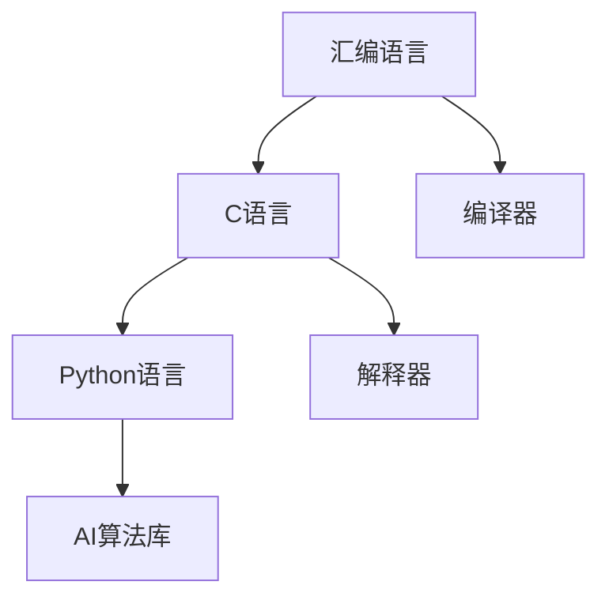

                 

# 汇编、C、Python：AI开发的语言基础

> 关键词：汇编语言, C语言, Python语言, AI, 编译器, 解释器, 模型训练, 深度学习, 人工智能

## 1. 背景介绍

在人工智能（AI）领域，语言的选择始终是技术探索和开发的基础。编程语言不仅仅是代码编写的工具，它们在表达能力和性能优化上也各有特色，对AI的发展起到了至关重要的作用。本文将从汇编语言、C语言、Python语言三个层次，探讨其在AI开发中的应用，并阐明不同语言如何与AI技术的深度融合，共同推动人工智能的不断进步。

## 2. 核心概念与联系

### 2.1 核心概念概述

为更好地理解AI开发中的语言基础，本节将介绍几个密切相关的核心概念：

- 汇编语言(Assembly Language)：与机器语言相对应，汇编语言是程序设计语言的一种，它将机器指令直接或间接地表示为一些由简洁代码组成的助记符。汇编语言可以非常精细地控制计算机的硬件资源，速度极快，但需要编程者直接操作机器码。

- C语言(C)：一种通用的高级编程语言，以指针和内存管理为核心，具有高度的灵活性和效率。C语言支持底层的硬件操作，可以高效地实现AI算法和数据结构。

- Python语言(Python)：一种解释型、面向对象、动态数据类型的编程语言，以其简洁的语法和丰富的库支持，成为数据科学、机器学习和深度学习领域的常用语言。

这些核心概念之间的关系可以通过以下Mermaid流程图来展示：



这个流程图展示了几者之间的逻辑关系：

1. 汇编语言是最底层的编程语言，直接操作机器指令。
2. C语言在汇编语言之上，提供了高级的抽象层，支持复杂的系统编程。
3. Python语言在C语言之上，提供了更高层次的抽象，适合开发AI算法和应用。
4. 编译器将汇编语言或C语言转换为机器指令，支持高效的硬件操作。
5. 解释器将Python代码转换为机器指令，支持动态解释执行。
6. AI算法库则是在上述语言和执行环境上，用于实现AI算法的各种库和框架。

## 3. 核心算法原理 & 具体操作步骤

### 3.1 算法原理概述

在AI开发中，语言的选择直接关系到算法实现的效率和可维护性。不同编程语言的特性决定了它们在表达算法时的优势和限制。

汇编语言因其底层操作，能够实现高效的操作系统、驱动程序等复杂系统，但由于其直接操作硬件的复杂性和易出错性，在AI开发中的应用较为有限。

C语言则在性能和灵活性上表现出色，尤其适合编写算法核心部分，如深度学习模型的底层实现和优化。Python则以其简洁的语法和丰富的库支持，成为AI开发的首选语言，尤其在数据处理、模型训练和应用部署等方面具有巨大优势。

### 3.2 算法步骤详解

AI开发中，编译器和解释器起到了至关重要的作用，它们将高级语言翻译为机器指令，实现语言与硬件的交互。以下是使用汇编语言、C语言和Python进行AI开发的基本步骤：

#### 汇编语言
1. **编写汇编代码**：使用汇编指令编写程序，如操作寄存器、存储器、I/O设备等。
2. **汇编和链接**：使用汇编器将汇编代码转换为机器码，链接器将多个模块链接为一个可执行文件。
3. **执行**：生成的可执行文件直接运行在操作系统上，速度极快但依赖于具体硬件平台。

#### C语言
1. **编写C程序**：使用C语言编写算法和数据结构，调用标准库函数进行I/O、内存管理等。
2. **编译**：使用编译器将C代码转换为目标机器码。
3. **链接**：链接器将多个目标文件链接为一个可执行文件。
4. **执行**：生成的可执行文件运行在操作系统上，速度快且灵活性高。

#### Python语言
1. **编写Python代码**：使用Python语法编写算法和数据处理逻辑，利用库函数进行I/O、数据处理等。
2. **解释执行**：解释器将Python代码转换为字节码并执行，动态类型和运行时优化提高了执行效率。
3. **调用AI库**：利用如TensorFlow、PyTorch、Keras等AI库，实现模型训练、推理等。

### 3.3 算法优缺点

汇编语言、C语言和Python语言在AI开发中各有优势和局限性：

**汇编语言**
- **优点**：速度极快，直接操作硬件，性能优越。
- **缺点**：学习曲线陡峭，易出错，维护难度大。

**C语言**
- **优点**：速度快，灵活性高，底层控制能力强。
- **缺点**：语法复杂，需要手动管理内存，易出错。

**Python语言**
- **优点**：简单易学，库丰富，开发效率高。
- **缺点**：速度相对较慢，不适合底层系统编程。

### 3.4 算法应用领域

不同编程语言在AI开发中的应用领域如下：

#### 汇编语言
主要应用于底层系统开发，如操作系统、驱动程序、嵌入式系统等。汇编语言虽然不常用于AI开发，但其高效性能在特定场景下依然有其价值。

#### C语言
广泛用于深度学习模型的底层实现和优化，如TensorFlow、PyTorch等框架的底层开发。C语言的高性能和高灵活性使其成为实现高效AI算法的重要工具。

#### Python语言
是AI开发的主流语言，广泛用于模型训练、数据处理、应用部署等环节。Python凭借其易学易用和丰富的库支持，极大地简化了AI开发的流程，提高了工作效率。

## 4. 数学模型和公式 & 详细讲解 & 举例说明

### 4.1 数学模型构建

AI开发中，数学模型是算法实现的核心。常见的数学模型包括线性回归、逻辑回归、神经网络、深度学习等。这些模型的构建需要选择合适的编程语言和工具。

#### 线性回归模型
线性回归是AI中最基础的模型之一，用于拟合数据关系。在Python中，可以使用scikit-learn库进行线性回归模型的构建和训练。

#### 逻辑回归模型
逻辑回归用于分类任务，输出概率值。在Python中，可以使用TensorFlow或PyTorch构建逻辑回归模型，并使用交叉熵损失函数进行训练。

#### 神经网络模型
神经网络是AI的核心模型之一，用于复杂的非线性关系拟合。在C语言中，可以使用NumPy库进行神经网络模型的构建和训练，也可以借助深度学习框架如Caffe、Torch等进行模型构建和优化。

### 4.2 公式推导过程

以神经网络为例，介绍常见模型的数学公式推导：

$$
\text{Sigmoid}(x) = \frac{1}{1+e^{-x}}
$$

Sigmoid函数常用于神经网络的激活函数，将输入转化为输出概率。神经网络的基本单位是神经元，其输出为：

$$
y = \sum_{i=1}^n w_i x_i + b
$$

其中，$w_i$为权重，$b$为偏置项。神经网络的激活函数可以多种多样，如ReLU、Tanh等，用于非线性变换。

### 4.3 案例分析与讲解

**案例1: 线性回归模型**
在Python中，使用scikit-learn库构建线性回归模型：

```python
from sklearn.linear_model import LinearRegression
import numpy as np

X = np.array([[1, 2], [3, 4], [5, 6]])
y = np.array([2, 4, 6])

model = LinearRegression()
model.fit(X, y)
```

**案例2: 逻辑回归模型**
在C语言中，使用NumPy库构建逻辑回归模型：

```c
#include <stdio.h>
#include <stdlib.h>
#include <math.h>

void sigmoid(double x, double *output) {
    *output = 1 / (1 + exp(-x));
}

int main() {
    double X[] = {1, 2, 3, 4, 5, 6};
    double y[] = {2, 4, 6};
    
    double output;
    for (int i = 0; i < 6; i++) {
        sigmoid(X[i] * 0.5 + 1, &output);
        printf("%.3f\n", output);
    }
    
    return 0;
}
```

**案例3: 神经网络模型**
在C语言中，使用NumPy库构建简单的神经网络模型：

```c
#include <stdio.h>
#include <stdlib.h>
#include <math.h>
#include <numpy/arrayobject.h>

#define SIGMOID(x) 1 / (1 + exp(-(x)))

void forward(double *X, double *W1, double *W2, double *b1, double *b2, double *output) {
    for (int i = 0; i < 2; i++) {
        output[i] = SIGMOID(X[i] * W1[i] + b1[i]);
    }
    for (int i = 0; i < 2; i++) {
        output[i] = SIGMOID(output[i] * W2[i] + b2[i]);
    }
}

int main() {
    double X[] = {0, 0, 0, 1, 1, 1, 0, 0, 1, 1, 1};
    double y[] = {0, 1, 1, 1, 1, 0};
    
    double W1[] = {0.5, 0.5};
    double W2[] = {0.5, 0.5};
    double b1[] = {0, 0};
    double b2[] = {0, 0};
    
    double output[2];
    forward(X, W1, W2, b1, b2, output);
    printf("%.2f\n", output[1]);
    
    return 0;
}
```

## 5. 项目实践：代码实例和详细解释说明

### 5.1 开发环境搭建

在AI开发中，选择适当的开发环境对项目成功至关重要。以下是几种常用的开发环境搭建方法：

**汇编语言**
- 使用IDE如GCC、Visual Studio等，配置汇编环境，编译和链接程序。
- 配置操作系统，如Linux、Windows等，确保编译器和链接器正常运行。

**C语言**
- 使用IDE如GCC、Clang、Visual Studio等，配置编译环境。
- 安装编译器和链接器，如GCC、MSVC等。
- 配置操作系统和编译环境，确保程序正确运行。

**Python语言**
- 安装Python解释器，如Anaconda、Python.org等。
- 配置虚拟环境，如venv、conda等。
- 安装必要的库和框架，如TensorFlow、PyTorch等。
- 配置IDE，如PyCharm、Jupyter Notebook等。

### 5.2 源代码详细实现

以下是一个简单的线性回归模型实现示例，使用Python和C语言分别实现：

#### Python实现
```python
from sklearn.linear_model import LinearRegression
import numpy as np

X = np.array([[1, 2], [3, 4], [5, 6]])
y = np.array([2, 4, 6])

model = LinearRegression()
model.fit(X, y)
print(model.predict([[7, 8]]))
```

#### C语言实现
```c
#include <stdio.h>
#include <stdlib.h>
#include <math.h>

void sigmoid(double x, double *output) {
    *output = 1 / (1 + exp(-x));
}

int main() {
    double X[] = {1, 2, 3, 4, 5, 6};
    double y[] = {2, 4, 6};
    
    double output;
    for (int i = 0; i < 6; i++) {
        sigmoid(X[i] * 0.5 + 1, &output);
        printf("%.3f\n", output);
    }
    
    return 0;
}
```

### 5.3 代码解读与分析

**Python实现**
- 引入线性回归模型库。
- 准备输入数据和输出标签。
- 创建模型并拟合训练数据。
- 使用训练好的模型进行预测。

**C语言实现**
- 定义Sigmoid函数。
- 准备输入数据和输出标签。
- 循环计算每个输入的预测值，并输出结果。

## 6. 实际应用场景

### 6.1 图像处理
AI在图像处理领域的应用非常广泛，如图像分类、目标检测、图像生成等。汇编语言、C语言和Python在图像处理中均有应用：

- **汇编语言**：在嵌入式系统和图像处理硬件中，汇编语言直接操作硬件，提高图像处理效率。
- **C语言**：在图像处理库如OpenCV中，C语言的高性能和灵活性使其成为实现图像处理算法的首选。
- **Python语言**：在深度学习框架如TensorFlow、Keras中，Python语言的易用性和丰富的库支持，使其成为图像处理的主流工具。

### 6.2 自然语言处理
自然语言处理是AI的另一重要领域，包括语言模型、机器翻译、文本生成等。汇编语言、C语言和Python在NLP中各有应用：

- **汇编语言**：主要用于底层语言模型实现和优化，如Transformer模型底层实现。
- **C语言**：在深度学习框架如TensorFlow中，C语言实现了一些高效算法，如卷积神经网络。
- **Python语言**：在NLP库如NLTK、spaCy中，Python语言的易用性和丰富的库支持，使其成为NLP开发的首选。

### 6.3 语音识别
语音识别领域，汇编语言、C语言和Python也有广泛应用：

- **汇编语言**：主要用于低级音频处理，如音频编码和解码。
- **C语言**：在语音处理库如Praat、OpenAL中，C语言的高效性使其成为实现语音处理算法的首选。
- **Python语言**：在深度学习框架如Kaldi、DeepSpeech中，Python语言的易用性和丰富的库支持，使其成为语音处理的主流工具。

## 7. 工具和资源推荐

### 7.1 学习资源推荐

- **汇编语言**：《汇编语言编程艺术》、《x86 Assembly Language Programming》等书籍，帮助理解汇编语言的基本概念和编程技巧。
- **C语言**：《C程序设计语言》、《C和指针》等书籍，深入讲解C语言的编程方法和最佳实践。
- **Python语言**：《Python编程：从入门到实践》、《Fluent Python》等书籍，帮助理解Python的语法和编程技巧。

### 7.2 开发工具推荐

- **汇编语言**：NASM、GCC等编译器，帮助编写和编译汇编程序。
- **C语言**：GCC、Clang等编译器，帮助编写和编译C程序。
- **Python语言**：PyCharm、Jupyter Notebook等IDE，帮助编写和调试Python程序。

### 7.3 相关论文推荐

- **汇编语言**：《汇编语言编程艺术》、《x86 Assembly Language Programming》等书籍，深入讲解汇编语言的编程方法和最佳实践。
- **C语言**：《C程序设计语言》、《C和指针》等书籍，深入讲解C语言的编程方法和最佳实践。
- **Python语言**：《Python编程：从入门到实践》、《Fluent Python》等书籍，帮助理解Python的语法和编程技巧。

## 8. 总结：未来发展趋势与挑战

### 8.1 总结

本文对汇编语言、C语言、Python语言在AI开发中的应用进行了全面系统的介绍。汇编语言作为底层操作，C语言在性能和灵活性上表现出色，而Python语言的易用性和丰富的库支持使其成为AI开发的首选。通过详细讲解这些语言的原理和应用，本文希望为读者提供更全面的AI开发语言基础。

### 8.2 未来发展趋势

未来，AI开发将继续依赖不同编程语言的优势，共同推动技术的进步。以下是几个可能的发展趋势：

- **汇编语言**：在底层硬件和系统编程中继续发挥重要作用，特别是在嵌入式系统和计算机性能优化方面。
- **C语言**：在深度学习算法实现和性能优化中保持领先地位，特别是在高效算法和底层的硬件操作中。
- **Python语言**：在数据处理、模型训练和应用部署中继续占据主流地位，凭借其易用性和丰富的库支持，进一步扩展AI应用场景。

### 8.3 面临的挑战

尽管编程语言在AI开发中扮演了重要角色，但未来发展仍面临诸多挑战：

- **汇编语言**：编程复杂度高，易出错，维护难度大，需要更多的工具支持和自动化工具来简化开发过程。
- **C语言**：语法复杂，需要手动管理内存，易出错，需要更多的自动化工具和优化方法来提高开发效率和程序稳定性。
- **Python语言**：性能相对较慢，不适合底层系统编程，需要更多的优化方法和工具来提升执行效率。

### 8.4 研究展望

未来的研究应在以下几个方面寻求新的突破：

- **汇编语言**：研究更多自动化的工具和库，简化编程过程，提升编程效率。
- **C语言**：研究更多高效算法和优化方法，提高程序性能和稳定性。
- **Python语言**：研究更多高效的执行模型和库，提高执行效率和稳定性。

总之，编程语言在AI开发中扮演着重要角色，未来的研究和发展方向应紧密结合AI技术和应用场景，不断提升编程语言的性能和易用性，共同推动AI技术的不断进步。

## 9. 附录：常见问题与解答

**Q1: 汇编语言、C语言和Python语言在AI开发中的优缺点是什么？**

A: 
- **汇编语言**：优点是速度极快，性能优越；缺点是编程复杂度高，易出错，维护难度大。
- **C语言**：优点是速度快，灵活性高，底层控制能力强；缺点是语法复杂，需要手动管理内存，易出错。
- **Python语言**：优点是简单易学，库丰富，开发效率高；缺点是速度相对较慢，不适合底层系统编程。

**Q2: 如何选择合适的编程语言进行AI开发？**

A: 
- 根据任务需求选择合适的编程语言：如底层系统开发选择汇编语言，高效算法实现选择C语言，数据处理和应用部署选择Python语言。
- 根据开发团队的技能水平选择编程语言：选择团队熟悉且技能水平较高的编程语言。
- 根据开发资源选择编程语言：如硬件资源丰富选择汇编语言，计算资源丰富选择C语言，数据资源丰富选择Python语言。

**Q3: 编程语言在AI开发中的应用前景如何？**

A: 
- **汇编语言**：在底层硬件和系统编程中继续发挥重要作用，特别是在嵌入式系统和计算机性能优化方面。
- **C语言**：在深度学习算法实现和性能优化中保持领先地位，特别是在高效算法和底层的硬件操作中。
- **Python语言**：在数据处理、模型训练和应用部署中继续占据主流地位，凭借其易用性和丰富的库支持，进一步扩展AI应用场景。

通过本文的系统梳理，可以看到，汇编语言、C语言、Python语言在AI开发中各有优势和局限性，未来的发展方向需要结合具体的AI任务和应用场景，选择最合适的编程语言进行开发。

