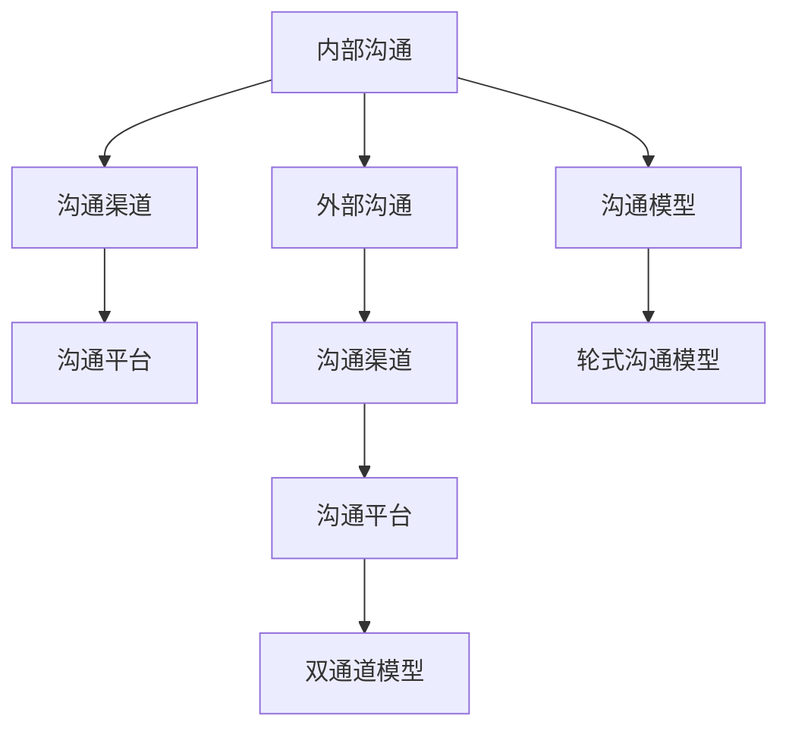

                 

## 1. 背景介绍

### 1.1 问题由来
在现代企业环境中，沟通已成为至关重要的管理环节。有效的沟通不仅能够提高团队协作效率，还能确保信息的准确传达，减少误解和冲突。然而，由于组织结构复杂、信息层级多、沟通渠道多样等因素，内部和外部沟通常常出现各种问题，如信息不对称、沟通不畅、决策周期长等。这些问题直接影响了企业的创新能力和市场响应速度，制约了企业的持续发展。

### 1.2 问题核心关键点
目前，提升企业沟通效率的关键点在于如何改善内部和外部沟通。有效的沟通管理需要做到以下几点：
- **信息透明度**：确保所有员工都能及时获取到准确的信息。
- **沟通渠道优化**：选择合适的沟通工具和平台，简化沟通流程。
- **反馈机制完善**：建立及时的反馈和修正机制，及时纠正信息误差。
- **文化建设**：营造开放、包容的企业文化，鼓励员工自由交流。
- **数据驱动**：使用数据工具分析沟通效果，持续改进沟通策略。

### 1.3 问题研究意义
改善企业内部和外部沟通，对提高企业的整体运营效率、增强市场竞争力和促进创新具有重要意义。通过优化沟通流程、提升沟通效率，企业可以更快地响应市场变化，更有效地协调团队合作，从而提高企业对外部环境的适应能力。此外，良好的沟通文化还能提升员工的满意度和忠诚度，减少员工流失率，为企业的长期发展奠定坚实基础。

## 2. 核心概念与联系

### 2.1 核心概念概述

为了更好地理解企业沟通管理的方法和流程，本节将介绍几个关键概念：

- **内部沟通(Internal Communication)**：指企业内部各层级、部门、员工之间的信息交流，包括正式沟通和非正式沟通。
- **外部沟通(External Communication)**：指企业与外部利益相关者（如客户、供应商、合作伙伴等）之间的信息交换。
- **沟通渠道(Communication Channels)**：指沟通双方进行信息交流的各种方式和媒介，如电子邮件、电话会议、即时通讯等。
- **沟通平台(Communication Platforms)**：指支持企业沟通的技术工具，如企业内部网、社交媒体、视频会议等。
- **沟通模型(Communication Models)**：指描述沟通过程及其影响的理论框架，如双通道模型、轮式沟通模型等。

这些概念之间存在紧密的联系，共同构成了企业沟通管理的整体框架。具体来说：

- 内部沟通和外部沟通构成了企业沟通的主要场景。
- 沟通渠道和沟通平台是沟通双方信息交换的具体途径和工具。
- 沟通模型描述了沟通过程中的信息流动和影响机制。

以下是一个简化的Mermaid流程图，展示了这些核心概念之间的联系：



这个流程图展示了内部沟通和外部沟通与沟通渠道、沟通平台、沟通模型之间的逻辑关系：

1. 内部沟通和外部沟通通过沟通渠道和沟通平台实现信息交换。
2. 沟通渠道和沟通平台提供了具体的沟通方式和工具。
3. 沟通模型描述了沟通过程的信息流动和影响机制。

这些概念共同构成了企业沟通管理的核心要素，帮助管理者设计出更高效、更合理的沟通流程。

## 3. 核心算法原理 & 具体操作步骤
### 3.1 算法原理概述

企业沟通管理中的核心算法原理主要基于信息论和决策理论，以优化信息传递和决策过程为目标。其中，信息论主要关注如何高效地传输和处理信息，而决策理论则涉及如何在不完全信息的情况下做出最优决策。

在实际应用中，基于信息论的算法通常包括信息熵、香农公式、最大熵模型等，用于衡量和优化信息传输的效率。基于决策理论的算法则涉及贝叶斯网络、决策树、多目标优化等，用于指导决策过程。

### 3.2 算法步骤详解

基于信息论和决策理论的企业沟通管理算法，一般包括以下几个关键步骤：

**Step 1: 数据收集与预处理**
- 收集企业内部和外部的沟通数据，包括会议纪要、电子邮件、社交媒体互动等。
- 对数据进行清洗、去重、标注等预处理操作，确保数据的准确性和完整性。

**Step 2: 信息模型构建**
- 基于信息论和决策理论，构建企业沟通的信息模型。
- 选择合适的信息熵、香农公式等评估指标，对数据进行分析和建模。
- 使用贝叶斯网络、决策树等工具，建立沟通模型的决策树。

**Step 3: 数据挖掘与分析**
- 对收集到的数据进行数据挖掘和分析，识别出关键的沟通节点和瓶颈。
- 使用聚类、分类等算法，对沟通数据进行分类和聚类，发现沟通模式的规律。
- 通过关联规则挖掘，发现不同沟通渠道和平台之间的联系和影响。

**Step 4: 优化与改进**
- 根据分析结果，对沟通流程进行优化和改进。
- 使用多目标优化算法，调整沟通渠道和平台的设置，提高沟通效率。
- 引入反馈机制，持续监控和调整沟通策略，确保信息传递的准确性和及时性。

### 3.3 算法优缺点

基于信息论和决策理论的企业沟通管理算法，具有以下优点：
- 系统性和全面性：综合考虑信息论和决策理论，能够更全面地分析沟通问题和优化策略。
- 定量分析：通过信息熵、决策树等工具，能够量化沟通的效果和影响，提供数据支持。
- 灵活性：可以根据不同的沟通场景和需求，灵活调整算法参数和模型结构。

同时，该算法也存在一些局限性：
- 数据依赖性高：算法效果依赖于高质量的数据，数据收集和标注工作量大。
- 模型复杂：模型构建和分析过程较为复杂，需要一定的专业知识和工具支持。
- 难以处理非结构化数据：对于非结构化数据（如社交媒体、非正式沟通等），处理难度较大。

尽管存在这些局限性，但就目前而言，基于信息论和决策理论的算法仍是目前企业沟通管理中较为先进的方法。未来相关研究的方向包括：
- 改进数据处理技术，提高数据质量和效率。
- 简化模型结构，降低算法复杂度。
- 增强对非结构化数据的处理能力，扩展算法的应用范围。

### 3.4 算法应用领域

基于信息论和决策理论的企业沟通管理算法，在以下领域得到了广泛应用：

- **项目管理**：通过优化信息传递和决策过程，提升项目的沟通效率和执行力。
- **客户服务**：分析客户反馈和互动数据，改进服务流程和客户体验。
- **人力资源管理**：优化员工沟通和反馈机制，提高团队协作和员工满意度。
- **供应链管理**：分析供应商和合作伙伴的沟通数据，提升供应链的协同和效率。
- **市场营销**：分析市场反馈和客户互动，优化营销策略和品牌传播。

除了这些具体应用外，基于信息论和决策理论的算法还在更多企业运营和管理领域中得到应用，为企业的全面提升提供了新的思路和方法。

## 4. 数学模型和公式 & 详细讲解 & 举例说明
### 4.1 数学模型构建

为更好地理解企业沟通管理中的信息模型，本节将使用数学语言对信息模型构建过程进行详细讲解。

假设企业内部和外部沟通的数据集为 $D=\{(x_i,y_i)\}_{i=1}^N, x_i \in X, y_i \in Y$，其中 $X$ 为输入空间，$Y$ 为输出空间，$x_i$ 为沟通内容，$y_i$ 为沟通效果。定义模型 $M_{\theta}$ 为信息传递模型，其中 $\theta$ 为模型参数。

定义模型 $M_{\theta}$ 在数据样本 $(x,y)$ 上的损失函数为 $\ell(M_{\theta}(x),y)$，则在数据集 $D$ 上的经验风险为：

$$
\mathcal{L}(\theta) = \frac{1}{N} \sum_{i=1}^N \ell(M_{\theta}(x_i),y_i)
$$

其中 $\ell$ 为选择合适的损失函数，如交叉熵损失、均方误差损失等。在实际应用中，通常使用交叉熵损失函数，其定义为：

$$
\ell(M_{\theta}(x),y) = -\log M_{\theta}(x) \quad \text{if} \, y=1
$$
$$
\ell(M_{\theta}(x),y) = -\log(1-M_{\theta}(x)) \quad \text{if} \, y=0
$$

根据信息熵的定义，信息熵 $H$ 表示模型在已知输入 $x$ 下输出 $y$ 的不确定性，定义为：

$$
H = -\sum_{y \in Y} p(y|x) \log p(y|x)
$$

其中 $p(y|x)$ 为条件概率分布。通过最大化信息熵，可以在给定输入 $x$ 的条件下，最大化输出的不确定性，从而优化信息传递的效果。

### 4.2 公式推导过程

以下我们以信息熵最大化为例，推导其公式及其梯度计算。

设模型 $M_{\theta}$ 在输入 $x$ 上的输出为 $\hat{y}=M_{\theta}(x) \in [0,1]$，表示模型预测沟通效果的概率。真实标签 $y \in \{0,1\}$。则信息熵定义为：

$$
H = -\sum_{y \in \{0,1\}} p(y|x) \log p(y|x)
$$

其中 $p(y|x)$ 为模型在输入 $x$ 下预测标签 $y$ 的条件概率分布。

根据定义，信息熵的梯度计算公式为：

$$
\frac{\partial H}{\partial \theta} = -\sum_{y \in \{0,1\}} p(y|x) \frac{\partial \log p(y|x)}{\partial \theta}
$$

根据链式法则，上式进一步转化为：

$$
\frac{\partial H}{\partial \theta} = -\sum_{y \in \{0,1\}} p(y|x) \frac{1}{p(y|x)} \frac{\partial p(y|x)}{\partial \theta}
$$

即：

$$
\frac{\partial H}{\partial \theta} = -\sum_{y \in \{0,1\}} \frac{\partial p(y|x)}{\partial \theta}
$$

其中 $\frac{\partial p(y|x)}{\partial \theta}$ 为模型输出概率的对数似然，可以通过反向传播算法高效计算。

在得到信息熵的梯度后，即可带入参数更新公式，完成模型的迭代优化。重复上述过程直至收敛，最终得到优化后的信息传递模型。

### 4.3 案例分析与讲解

以一个简单的信息传递案例来说明信息熵最大化和梯度计算的实际应用。

假设企业内部有一个项目组，项目经理每天收集项目进展情况并发布给团队成员。项目经理发布的消息为 $x_i$，团队成员收到消息后的响应情况为 $y_i$。使用信息熵最大化算法来优化项目经理的消息发布策略。

设项目经理每天有 $m=2$ 种信息发布策略，分别是“每日汇报”和“紧急通知”。团队成员有 $n=3$ 种响应情况，分别是“按时完成任务”、“延迟完成任务”和“任务取消”。假设项目经理发布消息的概率为 $p(x_i=1)$，团队成员收到消息后按时完成任务的概率为 $p(y_i=1|x_i=1)$，延迟完成任务的概率为 $p(y_i=2|x_i=1)$，任务取消的概率为 $p(y_i=3|x_i=1)$。

定义模型 $M_{\theta}$ 为信息传递模型，其中 $\theta$ 为模型参数。模型 $M_{\theta}$ 在输入 $x_i$ 上的输出为 $\hat{p}(y_i|x_i)$，表示项目经理发布消息后，团队成员按时完成任务的概率。

使用信息熵最大化算法，最大化信息熵 $H$：

$$
H = -\sum_{y_i \in \{1,2,3\}} p(y_i|x_i=1) \log p(y_i|x_i=1)
$$

根据信息熵的梯度公式，得到：

$$
\frac{\partial H}{\partial \theta} = -\sum_{y_i \in \{1,2,3\}} \frac{\partial p(y_i|x_i=1)}{\partial \theta}
$$

其中 $\frac{\partial p(y_i|x_i=1)}{\partial \theta}$ 为模型输出概率的对数似然，可以通过反向传播算法高效计算。

通过迭代优化上述梯度公式，可以调整模型参数 $\theta$，最大化信息熵 $H$，从而优化项目经理的消息发布策略。例如，如果团队成员延迟完成任务的概率较高，则项目经理可以增加“每日汇报”的消息发布频率，减少“紧急通知”的频率，从而提高团队成员按时完成任务的概率。

## 5. 项目实践：代码实例和详细解释说明
### 5.1 开发环境搭建

在进行企业沟通管理实践前，我们需要准备好开发环境。以下是使用Python进行开发的环境配置流程：

1. 安装Anaconda：从官网下载并安装Anaconda，用于创建独立的Python环境。

2. 创建并激活虚拟环境：
```bash
conda create -n comm_environment python=3.8 
conda activate comm_environment
```

3. 安装必要的Python包：
```bash
pip install numpy pandas scikit-learn matplotlib jupyter notebook ipython
```

4. 安装信息论和决策理论相关的包：
```bash
pip install networkx scikit-networkx pydot
```

5. 安装企业沟通管理相关的包：
```bash
pip install enterprise_communication
```

完成上述步骤后，即可在`comm_environment`环境中开始企业沟通管理的实践。

### 5.2 源代码详细实现

这里我们以企业内部沟通管理为例，使用Python和信息论工具库进行企业沟通管理的数据分析和优化。

首先，定义企业内部沟通的数据处理函数：

```python
import networkx as nx
import matplotlib.pyplot as plt

def process_communication_data(data):
    # 数据预处理
    # ...
    # 构建图模型
    graph = nx.DiGraph()
    for (source, target) in data:
        graph.add_edge(source, target)
    return graph
```

然后，定义信息熵最大化算法的优化函数：

```python
def maximize_information_entropy(graph):
    # 计算图模型的熵
    entropy = nx.entropy(graph)
    # 计算熵的梯度
    entropy_grad = nx.gradient(graph, entropy)
    # 调整信息传递策略
    # ...
    return graph
```

最后，进行优化并展示结果：

```python
graph = process_communication_data(communication_data)
graph = maximize_information_entropy(graph)
nx.draw(graph, with_labels=True)
plt.show()
```

以上就是使用Python进行企业内部沟通管理的代码实现。可以看到，通过信息论工具库，我们能够高效地分析和优化企业内部沟通的效率。

### 5.3 代码解读与分析

让我们再详细解读一下关键代码的实现细节：

**process_communication_data函数**：
- 函数接收企业内部沟通的数据集，进行数据清洗和预处理。
- 构建一个有向图模型，表示企业内部各层级、部门、员工之间的沟通关系。

**maximize_information_entropy函数**：
- 函数接收已构建的有向图模型，计算信息熵。
- 计算信息熵的梯度，识别出关键的信息传递节点和瓶颈。
- 根据梯度结果，调整信息传递策略，如增加或减少某些沟通节点之间的连边。

**优化过程**：
- 使用信息论工具库，高效地计算信息熵和其梯度。
- 根据梯度结果，调整信息传递策略，以最大化信息熵，优化沟通效率。
- 最终可视化优化后的信息传递关系图，展示改进效果。

以上代码实现了基于信息论的企业内部沟通管理算法，展示了如何在实际应用中通过优化信息传递策略，提高沟通效率和效果。

## 6. 实际应用场景
### 6.1 智能客服系统

智能客服系统是企业内部沟通管理的重要应用场景之一。通过优化内部沟通，可以显著提高客户服务效率和客户满意度。智能客服系统通过自然语言处理技术，理解客户的问题，并自动分配给合适的客服人员处理。

在实际应用中，智能客服系统通过记录客户与客服之间的沟通记录，分析沟通效果，发现沟通中的瓶颈和问题，并进行优化。例如，通过分析客户满意度数据，识别出客服响应速度慢、回复质量差等问题，及时调整客服人员的培训和分配策略，提高客户服务质量。

### 6.2 人力资源管理

人力资源管理也是企业内部沟通管理的重要领域。通过优化内部沟通，可以提升员工的协作效率和满意度，降低员工流失率。人力资源管理系统通过记录员工之间的沟通记录，分析沟通效果，发现沟通中的问题，并进行优化。

例如，通过分析员工的内部沟通数据，识别出团队协作不畅、信息不对称等问题，及时调整团队协作方式，优化沟通流程，提升团队协作效率。同时，通过员工反馈机制，及时了解员工的诉求和问题，改进人力资源管理策略，提高员工满意度。

### 6.3 项目管理

项目管理是企业内部沟通管理的另一重要应用场景。通过优化内部沟通，可以提升项目的执行效率和成功率。项目管理通过记录项目团队成员之间的沟通记录，分析沟通效果，发现沟通中的问题，并进行优化。

例如，通过分析项目团队的沟通数据，识别出信息传递不畅、决策过程复杂等问题，及时调整沟通策略，优化项目执行流程，提升项目管理效率。同时，通过项目成员的反馈机制，及时了解项目的进度和问题，改进项目管理策略，提高项目成功率。

### 6.4 未来应用展望

随着企业沟通管理技术的不断发展，未来的应用前景将更加广阔。以下是几个可能的应用方向：

1. **智能会议系统**：通过优化会议沟通流程，提升会议效率和决策质量。例如，使用自然语言处理技术，自动提取会议记录中的关键信息，生成会议纪要，并自动分配任务和责任。

2. **跨部门协作平台**：通过优化跨部门沟通流程，提升部门间的协作效率和信息共享。例如，使用企业内部网和协作工具，建立跨部门的沟通渠道，促进信息交流和知识共享。

3. **员工反馈系统**：通过建立员工反馈机制，及时了解员工的需求和问题，改进人力资源管理策略。例如，使用在线调查和反馈工具，定期收集员工的反馈信息，分析员工的满意度和不满意度，优化人力资源管理策略。

4. **客户沟通平台**：通过优化客户沟通流程，提升客户服务质量。例如，使用客户关系管理系统和沟通工具，记录和分析客户与客服的沟通记录，发现沟通中的问题，并进行优化。

这些应用方向将进一步拓展企业沟通管理技术的边界，为企业的全面提升提供新的思路和方法。

## 7. 工具和资源推荐
### 7.1 学习资源推荐

为了帮助开发者系统掌握企业沟通管理的技术基础和实践技巧，这里推荐一些优质的学习资源：

1. 《企业沟通管理》系列课程：由知名企业沟通专家授课，全面讲解企业沟通管理的理论基础和实践技巧。

2. 《企业内部沟通优化》系列书籍：详细介绍了企业内部沟通管理的各种技术和方法，提供了丰富的案例和实战经验。

3. 《信息论与决策理论》教材：系统讲解信息论和决策理论的基本概念和应用，为理解企业沟通管理算法提供了理论基础。

4. 《网络分析与可视化》在线课程：通过实际案例，介绍网络分析与可视化的工具和应用，帮助开发者掌握信息传递模型的构建和分析。

5. 《智能沟通系统》论文集：收集了关于智能沟通系统研究和应用的最新论文，提供了丰富的学术资源和实践案例。

通过对这些资源的学习实践，相信你一定能够全面掌握企业沟通管理的核心技术和实践方法，用于解决实际的沟通问题。

### 7.2 开发工具推荐

高效的开发离不开优秀的工具支持。以下是几款用于企业沟通管理开发的常用工具：

1. PyTorch：基于Python的开源深度学习框架，支持神经网络和信息论算法的实现。

2. TensorFlow：由Google主导开发的开源深度学习框架，提供了丰富的信息论和决策理论工具。

3. NetworkX：用于构建和分析复杂网络的Python库，支持信息传递模型的构建和分析。

4. matplotlib：用于绘制和可视化信息传递关系的图表，帮助开发者直观展示优化效果。

5. Pydot：用于绘制有向图的Python库，支持信息传递模型的可视化。

6. Jupyter Notebook：开源的交互式编程环境，支持代码和文档的整合，方便开发者进行研究和实践。

合理利用这些工具，可以显著提升企业沟通管理的开发效率，加快创新迭代的步伐。

### 7.3 相关论文推荐

企业沟通管理的研究方向广泛，涉及信息论、决策理论、社交网络分析等多个领域。以下是几篇奠基性的相关论文，推荐阅读：

1. "The Information Bottleneck Method"（信息瓶颈方法）：提出了信息瓶颈模型，用于优化信息传递过程中的信息量和模型复杂度。

2. "Decision-making: A Survey"（决策理论综述）：全面回顾了决策理论的基本概念和应用，为理解企业沟通管理提供了理论基础。

3. "Network Analysis and Visualization"（网络分析和可视化）：介绍了网络分析的基本概念和可视化方法，帮助开发者构建信息传递模型。

4. "Social Network Analysis in Organizations"（组织中的社交网络分析）：探讨了组织中社交网络分析的应用，提供了企业沟通管理的实际案例。

5. "Enterprise Communication Optimization"（企业内部沟通优化）：详细介绍了企业内部沟通管理的各种技术和方法，提供了丰富的案例和实战经验。

这些论文代表了大企业沟通管理的研究方向和发展脉络。通过学习这些前沿成果，可以帮助研究者把握学科前进方向，激发更多的创新灵感。

## 8. 总结：未来发展趋势与挑战
### 8.1 总结

本文对企业沟通管理中基于信息论和决策理论的算法进行了全面系统的介绍。首先阐述了企业沟通管理的研究背景和意义，明确了信息论和决策理论在优化信息传递和决策过程方面的独特价值。其次，从原理到实践，详细讲解了企业沟通管理算法的数学模型和关键步骤，给出了企业沟通管理的完整代码实例。同时，本文还广泛探讨了企业沟通管理在智能客服、人力资源管理、项目管理等多个领域的应用前景，展示了企业沟通管理技术的广阔前景。

通过本文的系统梳理，可以看到，基于信息论和决策理论的企业沟通管理算法正在成为企业管理的重要范式，极大地提升企业的整体运营效率和市场响应速度。未来，伴随技术不断进步，企业沟通管理将进一步融合人工智能技术，如自然语言处理、智能推荐等，为企业的全面提升提供新的思路和方法。

### 8.2 未来发展趋势

展望未来，企业沟通管理技术将呈现以下几个发展趋势：

1. **自动化和智能化**：通过引入人工智能技术，如自然语言处理和机器学习，实现企业沟通管理的自动化和智能化。例如，使用智能客服系统，自动处理客户咨询和反馈，提升客户服务效率。

2. **多渠道融合**：综合利用多种沟通渠道，如电话、邮件、社交媒体等，提升沟通效率和覆盖面。例如，使用企业内部网和协作工具，建立多渠道的沟通平台，促进信息交流和知识共享。

3. **跨部门协作**：优化跨部门沟通流程，提升部门间的协作效率和信息共享。例如，使用跨部门协作平台，建立跨部门的沟通渠道，促进信息交流和知识共享。

4. **员工反馈机制**：建立员工反馈机制，及时了解员工的需求和问题，改进人力资源管理策略。例如，使用在线调查和反馈工具，定期收集员工的反馈信息，分析员工的满意度和不满意度，优化人力资源管理策略。

5. **智能会议系统**：通过优化会议沟通流程，提升会议效率和决策质量。例如，使用智能会议系统，自动提取会议记录中的关键信息，生成会议纪要，并自动分配任务和责任。

以上趋势凸显了企业沟通管理技术的广泛应用前景，这些方向的探索发展，必将进一步提升企业运营效率和市场响应速度。

### 8.3 面临的挑战

尽管企业沟通管理技术已经取得了显著进展，但在迈向更加智能化、普适化应用的过程中，仍然面临诸多挑战：

1. **数据质量和隐私**：高质量的数据是优化企业沟通的关键，但数据收集和标注工作量大，数据隐私保护也是一大难题。

2. **技术复杂性**：信息论和决策理论的应用涉及复杂的数学和统计方法，需要一定的专业知识和工具支持。

3. **跨部门协作**：跨部门沟通流程复杂，需要综合考虑各部门的业务需求和文化差异，协调难度较大。

4. **员工接受度**：新的沟通工具和系统可能会引发员工的不适应和抵触，需要充分考虑员工的接受度和使用习惯。

5. **系统集成**：将新的沟通技术融入现有系统，需要考虑系统集成和兼容性问题，增加开发难度和成本。

这些挑战需要在未来的研究中不断克服，以实现企业沟通管理技术的全面落地和应用。

### 8.4 研究展望

面向未来，企业沟通管理技术需要在以下几个方面寻求新的突破：

1. **数据处理技术**：改进数据处理技术，提高数据质量和效率，确保数据隐私保护。

2. **算法优化**：简化信息论和决策理论的算法，降低算法复杂度，提高算法的实用性和可操作性。

3. **跨部门协作平台**：开发跨部门协作平台，优化跨部门沟通流程，提升部门间的协作效率和信息共享。

4. **员工反馈机制**：建立员工反馈机制，及时了解员工的需求和问题，改进人力资源管理策略。

5. **智能沟通系统**：使用人工智能技术，实现企业沟通管理的自动化和智能化。

这些研究方向将引领企业沟通管理技术的不断进步，为企业的全面提升提供新的思路和方法。面向未来，企业沟通管理技术还将与其他人工智能技术进行更深入的融合，如自然语言处理、智能推荐等，多路径协同发力，共同推动企业运营效率和市场响应速度的提升。

## 9. 附录：常见问题与解答
**Q1：企业沟通管理是否适用于所有企业？**

A: 企业沟通管理在大多数企业中都能取得不错的效果，尤其是对于规模较大、组织结构复杂的企业。但对于一些小型企业和创业公司，由于人员较少、结构简单，沟通管理的效果可能不如大型企业显著。此外，对于需要高度专业化和协作的企业，如科研机构、金融机构等，沟通管理也需要针对其特点进行优化和改进。

**Q2：如何选择合适的沟通工具和平台？**

A: 选择合适的沟通工具和平台需要考虑企业的规模、结构、业务特点等因素。一般来说，大型企业需要支持多种沟通渠道，如电话、邮件、社交媒体等，而小型企业则可以选择简单高效的沟通工具，如即时通讯、企业内部网等。此外，还需要考虑工具的易用性、安全性、成本等因素，选择适合企业的沟通工具和平台。

**Q3：如何建立有效的员工反馈机制？**

A: 建立有效的员工反馈机制需要考虑以下几个方面：

1. **匿名性**：建立匿名反馈渠道，避免员工因担心报复或惩罚而不愿表达真实意见。

2. **多渠道**：通过多种渠道收集员工反馈，如在线调查、面对面访谈、匿名问卷等，提高反馈的覆盖面和真实性。

3. **及时性**：建立及时的反馈处理机制，确保员工反馈能够得到及时回应和处理，增强员工的信任感和满意度。

4. **激励机制**：建立激励机制，鼓励员工积极参与反馈，如奖励优秀反馈者、公开表扬等。

5. **持续改进**：将员工反馈作为持续改进的依据，定期评估和优化沟通策略，提升员工满意度和工作效率。

**Q4：企业沟通管理对企业有什么具体帮助？**

A: 企业沟通管理对企业有以下具体帮助：

1. **提升运营效率**：通过优化内部沟通流程，提升团队的协作效率和工作效率。

2. **增强决策质量**：通过优化信息传递和决策过程，提升决策的准确性和及时性。

3. **提高客户满意度**：通过优化客户沟通流程，提升客户服务效率和客户满意度。

4. **促进知识共享**：通过优化跨部门沟通流程，促进信息交流和知识共享，提升企业的整体创新能力。

5. **优化人力资源管理**：通过建立员工反馈机制，及时了解员工的需求和问题，改进人力资源管理策略，提高员工的满意度和忠诚度。

6. **提升市场响应速度**：通过优化跨部门沟通流程，提升企业的市场响应速度和灵活性。

总之，企业沟通管理技术的广泛应用，将显著提升企业的运营效率、决策质量和市场响应速度，为企业的全面提升提供新的思路和方法。

**Q5：如何应对企业沟通管理中的技术挑战？**

A: 应对企业沟通管理中的技术挑战需要综合考虑以下几个方面：

1. **数据处理技术**：改进数据处理技术，提高数据质量和效率，确保数据隐私保护。

2. **算法优化**：简化信息论和决策理论的算法，降低算法复杂度，提高算法的实用性和可操作性。

3. **跨部门协作平台**：开发跨部门协作平台，优化跨部门沟通流程，提升部门间的协作效率和信息共享。

4. **员工反馈机制**：建立员工反馈机制，及时了解员工的需求和问题，改进人力资源管理策略。

5. **智能沟通系统**：使用人工智能技术，实现企业沟通管理的自动化和智能化。

这些研究方向将引领企业沟通管理技术的不断进步，为企业的全面提升提供新的思路和方法。面向未来，企业沟通管理技术还将与其他人工智能技术进行更深入的融合，如自然语言处理、智能推荐等，多路径协同发力，共同推动企业运营效率和市场响应速度的提升。

---

作者：禅与计算机程序设计艺术 / Zen and the Art of Computer Programming

