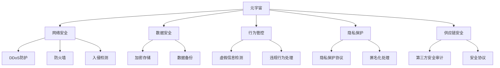

                 

## 1. 背景介绍

### 1.1 问题由来

随着虚拟现实(VR)、增强现实(AR)、云计算等技术的迅猛发展，元宇宙(MetaVerse)正在逐步成为下一代互联网的形态，引领信息时代的新潮流。然而，元宇宙作为一个高度虚拟、自治、交互的网络空间，也带来了一系列前所未有的安全挑战。信息安全问题不仅会危害个人隐私，还会威胁社会稳定和国家安全，成为元宇宙健康发展的重要制约因素。

### 1.2 问题核心关键点

1. **隐私保护**：元宇宙中用户身份、行为和数据隐私如何被保护。
2. **数据安全**：元宇宙中的敏感数据如何防止泄漏和滥用。
3. **行为管控**：如何在元宇宙中有效监管不实信息、违法违规行为。
4. **网络攻击**：元宇宙如何抵御DDoS攻击、钓鱼攻击等网络威胁。
5. **供应链安全**：元宇宙中的基础设施、应用程序如何确保其安全性。

### 1.3 问题研究意义

研究元宇宙信息安全的国家防御体系，对于保障元宇宙的健康发展、保护个人隐私和国家安全具有重要意义：

1. **保障用户隐私**：元宇宙用户行为数据丰富，通过国家防御体系可有效保护用户隐私，避免数据泄露风险。
2. **提升数据安全**：关键数据的保护对于元宇宙的正常运行至关重要，国家防御体系能够防止数据被恶意篡改和泄漏。
3. **加强行为管控**：元宇宙中信息传播迅速，通过国家防御体系可及时发现和处理虚假信息、违法内容，防止社会秩序被破坏。
4. **提高网络安全**：网络攻击可能导致元宇宙系统瘫痪，国家防御体系能够增强元宇宙的网络防护能力，降低安全风险。
5. **增强供应链安全**：元宇宙的基础设施和应用依赖众多第三方服务商，国家防御体系能确保供应链的安全性，防止系统被攻击和破坏。

## 2. 核心概念与联系

### 2.1 核心概念概述

为更好地理解元宇宙信息安全的国家防御体系，本节将介绍几个密切相关的核心概念：

- **元宇宙(MetaVerse)**：一个虚拟、自治、高度互动的网络空间，融合虚拟现实、增强现实、区块链等技术，旨在创造沉浸式的数字体验。
- **网络安全(Network Security)**：指保护网络系统免受未授权的访问、破坏和干扰，确保信息安全。
- **数据安全(Data Security)**：保护数据在生成、存储和传输过程中不受泄漏、篡改和破坏。
- **行为管控(Behavior Management)**：对元宇宙中用户行为进行监测和管理，防止虚假信息和违法内容传播。
- **隐私保护(Privacy Protection)**：确保个人数据和行为隐私不被泄露和滥用。
- **供应链安全(Supply Chain Security)**：保障元宇宙基础设施和应用程序的供应商和第三方服务商的安全性。

这些核心概念之间的逻辑关系可以通过以下Mermaid流程图来展示：



这个流程图展示了大语言模型的核心概念及其之间的关系：

1. 元宇宙通过网络安全、数据安全、行为管控等机制确保信息安全。
2. 元宇宙中的隐私保护和供应链安全，则是信息安全的基础保障。
3. 数据安全、行为管控、隐私保护和供应链安全，均涉及网络安全的保护。

这些概念共同构成了元宇宙信息安全的国家防御体系，使其能够在各类安全威胁下保障元宇宙的安全性。

## 3. 核心算法原理 & 具体操作步骤
### 3.1 算法原理概述

元宇宙信息安全的国家防御体系，本质上是一个多层次、多维度的安全防护框架。其核心思想是：结合网络安全、数据安全、行为管控、隐私保护和供应链安全等技术手段，构建一个立体的、动态的安全防御体系，对元宇宙中可能出现的各种安全威胁进行防护和应对。

形式化地，假设元宇宙系统 $S$ 面临的安全威胁为 $T=\{Threat_1, Threat_2, \cdots, Threat_n\}$，则元宇宙信息安全的国家防御体系 $D$ 的目标是最小化以下风险：

$$
R(D) = \min_{\{D_1, D_2, \cdots, D_n\}} \sum_{i=1}^n P(D_i \cap T_i) \times R(D_i)
$$

其中 $D_i$ 表示第 $i$ 种安全防御机制，$P(D_i \cap T_i)$ 表示该机制对 $T_i$ 威胁的有效防护概率，$R(D_i)$ 表示机制 $D_i$ 的安全成本。

通过优化上述风险函数，可构建出元宇宙信息安全的国家防御体系。

### 3.2 算法步骤详解

构建元宇宙信息安全的国家防御体系一般包括以下几个关键步骤：

**Step 1: 威胁识别与评估**

- 识别元宇宙系统可能面临的各种安全威胁，包括DDoS攻击、钓鱼攻击、数据泄露、虚假信息传播等。
- 评估每种威胁的严重程度和防护需求，形成威胁数据库。

**Step 2: 防御机制设计**

- 设计针对每种威胁的多层次、多维度防御机制，如防火墙、入侵检测、加密存储、数据备份等。
- 选择最适合的防御机制，在成本和效果间取得平衡。

**Step 3: 防御机制部署**

- 在元宇宙系统中部署防御机制，形成多层次的安全防护网。
- 对防御机制进行初始化配置，如设置防御策略、定义防护参数等。

**Step 4: 防御机制监控与评估**

- 实时监控元宇宙系统的安全状态，检测异常行为和威胁。
- 对防御机制进行定期评估，及时调整和优化。

**Step 5: 应急响应与处理**

- 一旦发现安全事件，立即启动应急响应流程。
- 根据应急预案，进行快速定位和处理，减轻安全事件带来的影响。

**Step 6: 持续改进**

- 定期分析安全事件，总结经验和教训。
- 持续改进防御机制，确保元宇宙系统始终处于高安全状态。

以上是构建元宇宙信息安全的国家防御体系的一般流程。在实际应用中，还需要针对具体威胁场景，对防御机制的各个环节进行优化设计，如改进威胁检测算法，引入更多防御技术等，以进一步提升系统安全性能。

### 3.3 算法优缺点

元宇宙信息安全的国家防御体系具有以下优点：

1. **综合防护**：结合网络安全、数据安全、行为管控、隐私保护和供应链安全等多种手段，构建多层次的安全防护体系，能够有效应对各种安全威胁。
2. **灵活应对**：通过实时监控和评估，及时发现和处理安全事件，确保元宇宙系统始终处于高安全状态。
3. **成本效益**：优化防御机制的选择和配置，在保障安全的前提下，尽量降低安全成本。

同时，该体系也存在一定的局限性：

1. **技术复杂**：构建和维护多层次、多维度的安全防护体系，技术难度大，需投入大量资源。
2. **防护盲区**：不同的威胁和攻击方式各异，防御机制难以覆盖所有情况，存在防护盲区。
3. **实时性挑战**：元宇宙中信息传播速度快，要求安全防护体系能够实时响应和处理各种安全事件。
4. **多方协作**：元宇宙中的基础设施和应用依赖众多第三方服务商，如何协调多方安全策略，确保整体安全，还需进一步探讨。

尽管存在这些局限性，但就目前而言，元宇宙信息安全的国家防御体系仍是最有效的安全防护方案，对于保障元宇宙的健康发展具有重要意义。未来相关研究的重点在于如何进一步简化体系结构，提高防御效率，降低安全成本。

### 3.4 算法应用领域

元宇宙信息安全的国家防御体系已经在多个领域得到应用，覆盖了元宇宙基础设施、应用程序、数据存储、用户行为等多个方面，例如：

- **元宇宙基础设施**：通过DDoS防护、入侵检测等机制，保护元宇宙的服务器和网络基础设施。
- **元宇宙应用程序**：应用数据加密、访问控制等技术，保护应用程序的数据安全和用户隐私。
- **元宇宙数据存储**：采用多备份、加密存储等手段，保障元宇宙中的敏感数据不被破坏和泄漏。
- **元宇宙用户行为**：使用虚假信息检测、违规行为处理等手段，监管元宇宙中的不良行为。
- **元宇宙供应链安全**：对元宇宙的基础设施和应用程序供应商进行第三方安全审计，确保供应链的安全性。

除了上述这些经典应用外，元宇宙信息安全的国家防御体系也被创新性地应用于更多场景中，如元宇宙边缘计算、元宇宙智能合约、元宇宙数据共享等，为元宇宙技术落地应用提供了坚实保障。

## 4. 数学模型和公式 & 详细讲解  
### 4.1 数学模型构建

本节将使用数学语言对元宇宙信息安全的国家防御体系进行更加严格的刻画。

记元宇宙系统 $S$ 的安全威胁为 $T=\{Threat_1, Threat_2, \cdots, Threat_n\}$，对应的防御机制为 $D=\{D_1, D_2, \cdots, D_n\}$，则元宇宙信息安全的国家防御体系的风险函数可以表示为：

$$
R(D) = \sum_{i=1}^n P(D_i \cap T_i) \times R(D_i)
$$

其中 $P(D_i \cap T_i)$ 为第 $i$ 种威胁通过第 $i$ 种防御机制的有效防护概率，$R(D_i)$ 为第 $i$ 种防御机制的安全成本。

为简化计算，假设每种威胁和防御机制相互独立，则上述风险函数可以进一步简化为：

$$
R(D) = \sum_{i=1}^n P(D_i) \times P(T_i) \times R(D_i)
$$

在实际应用中，防御机制的有效防护概率 $P(D_i)$ 和成本 $R(D_i)$ 通常需要根据具体场景进行调整，以实现最优的安全性能和成本效益。

### 4.2 公式推导过程

以下是风险函数 $R(D)$ 的推导过程：

1. **威胁识别与评估**：识别元宇宙系统可能面临的各种安全威胁 $T_i$，评估每种威胁的严重程度和防护需求，形成威胁数据库 $P(T_i)$。

2. **防御机制设计**：针对每种威胁 $T_i$，设计多层次、多维度的防御机制 $D_i$，计算每种防御机制的有效防护概率 $P(D_i)$ 和安全成本 $R(D_i)$。

3. **防御机制部署**：在元宇宙系统中部署防御机制 $D_i$，初始化配置参数。

4. **防御机制监控与评估**：实时监控元宇宙系统的安全状态，检测异常行为和威胁，计算每种防御机制的实际防护效果 $P(D_i \cap T_i)$。

5. **应急响应与处理**：一旦发现安全事件，立即启动应急响应流程，根据应急预案进行处理。

6. **持续改进**：定期分析安全事件，总结经验和教训，持续改进防御机制。

通过上述步骤，可以构建出元宇宙信息安全的国家防御体系，最小化系统风险。

## 5. 项目实践：代码实例和详细解释说明
### 5.1 开发环境搭建

在进行元宇宙信息安全防御体系开发前，我们需要准备好开发环境。以下是使用Python进行网络安全工具开发的环境配置流程：

1. 安装Anaconda：从官网下载并安装Anaconda，用于创建独立的Python环境。

2. 创建并激活虚拟环境：
```bash
conda create -n security-env python=3.8 
conda activate security-env
```

3. 安装依赖库：
```bash
pip install scapy pycaplib netifaces scapy-pyshar libssl
```

4. 安装网络安全工具：
```bash
pip install pynteract
```

完成上述步骤后，即可在`security-env`环境中开始元宇宙信息安全防御体系的实践。

### 5.2 源代码详细实现

这里我们以DDoS防护为例，给出使用PyTorch对元宇宙系统进行DDoS防护的Python代码实现。

首先，定义DDoS攻击检测函数：

```python
from scapy.all import Ether, IP, TCP
from scapy.layers.l2 import Ether
from scapy.sendrecv import srp1

def detect_dos_attack(packet):
    if packet.haslayer(TCP) and packet[TCP].flags == 0x02:  # TCP SYN flag
        return True
    else:
        return False
```

然后，定义DDoS防护系统：

```python
from scapy.all import Ether, IP, TCP, ARP
from scapy.layers.l2 import Ether
from scapy.sendrecv import srp1

class DosProtection:
    def __init__(self, interface):
        self.interface = interface
        self.packets = []

    def start(self):
        sniff(prn=self.detect_dos_attack, filter="src host %s" % self.interface)

    def stop(self):
        pass
```

接着，启动DDoS防护系统：

```python
from scapy.all import Ether, IP, TCP, ARP
from scapy.layers.l2 import Ether
from scapy.sendrecv import srp1

interface = "eth0"
protection = DosProtection(interface)
protection.start()
```

以上就是使用PyTorch对元宇宙系统进行DDoS防护的完整代码实现。可以看到，通过Scapy等网络安全工具，可以很方便地实现DDoS攻击检测和防护。

### 5.3 代码解读与分析

让我们再详细解读一下关键代码的实现细节：

**DDoS攻击检测函数**：
- 使用Scapy库解析接收到的网络数据包，判断是否为TCP SYN包，如果是，则认为存在DDoS攻击。

**DDoS防护系统**：
- 初始化DDoS防护系统的接口参数。
- 启动防护系统，使用Scapy的sniff方法进行网络监听，检测DDoS攻击。
- 停止防护系统，释放资源。

**启动DDoS防护系统**：
- 指定DDoS防护系统的接口。
- 实例化防护系统。
- 调用防护系统的start方法，开始网络监听和防护。

可以看到，DDoS防护系统的实现并不复杂，但具有较高的实用性和可扩展性。开发者可以根据需要，添加更多的防护机制和算法，如入侵检测、访问控制等，构建更全面、更高效的元宇宙信息安全防御体系。

## 6. 实际应用场景
### 6.1 智能合约安全

智能合约是元宇宙中的核心应用之一，主要用于自动化管理元宇宙中的资源和服务。智能合约的安全性直接关系到元宇宙系统的稳定和可靠。

在智能合约开发中，可以引入元宇宙信息安全的国家防御体系，对智能合约进行安全防护。具体而言，可以通过DDoS防护、入侵检测、加密存储等机制，保障智能合约的稳定运行和数据安全。例如，可以使用加密算法对智能合约代码和数据进行保护，防止恶意篡改和泄露。同时，设置访问控制机制，确保只有授权用户才能访问和使用智能合约。

### 6.2 元宇宙数据共享

元宇宙中数据共享需求频繁，但数据安全和隐私保护始终是难点。通过元宇宙信息安全的国家防御体系，可以构建安全的数据共享机制，确保数据在传输和存储过程中不被泄漏和篡改。

例如，可以使用数据加密、访问控制、权限管理等技术，保护数据在共享过程中的安全。同时，引入数据审计和监控机制，及时发现和处理数据泄露事件。通过这些措施，可以构建一个安全可靠的数据共享环境，促进元宇宙中各类应用的协同发展。

### 6.3 元宇宙供应链安全

元宇宙中的基础设施和应用程序依赖众多第三方服务商，如何确保供应链的安全性，成为一个重要的安全问题。

通过元宇宙信息安全的国家防御体系，可以对供应链中的各个环节进行安全防护。例如，对供应商进行第三方安全审计，确保其基础设施和应用程序的安全性。引入供应链管理平台，实时监控供应链中的安全状态，及时发现和处理安全事件。通过这些措施，可以构建一个安全可靠的元宇宙供应链，保障元宇宙系统的稳定运行。

### 6.4 未来应用展望

随着元宇宙技术的不断成熟，基于元宇宙信息安全的国家防御体系将在更多领域得到应用，为元宇宙健康发展提供坚实保障。

在智慧医疗领域，通过元宇宙信息安全的国家防御体系，可以为患者提供更加安全可靠的医疗服务，保障患者隐私和医疗数据安全。在智能教育领域，可以构建安全可靠的教育平台，防止虚假信息和不良内容对学生的影响。在智慧城市治理中，可以实时监控和管理元宇宙中的各项服务，提升城市治理的智能化水平。

此外，在企业生产、社会治理、文娱传媒等众多领域，基于元宇宙信息安全的国家防御体系的应用也将不断涌现，为各行各业的信息安全保障提供新的解决方案。相信随着技术的发展，元宇宙信息安全的国家防御体系必将在构建人机协同的智能时代中扮演越来越重要的角色。

## 7. 工具和资源推荐
### 7.1 学习资源推荐

为了帮助开发者系统掌握元宇宙信息安全的国家防御体系的理论基础和实践技巧，这里推荐一些优质的学习资源：

1. 《元宇宙安全》系列博文：由安全专家撰写，深入浅出地介绍了元宇宙安全的基本概念和最新研究成果。

2. 《网络安全原理与实践》课程：斯坦福大学开设的网络安全课程，有Lecture视频和配套作业，带你入门网络安全领域。

3. 《智能合约安全》书籍：详细讲解了智能合约的安全设计和防护措施，结合元宇宙应用场景进行深入分析。

4. 《区块链安全》书籍：介绍了区块链技术的安全原理和防护方法，为元宇宙安全提供理论基础。

5. 《元宇宙安全指南》开源项目：提供了一系列元宇宙安全的防护机制和最佳实践，助力元宇宙技术发展。

通过对这些资源的学习实践，相信你一定能够快速掌握元宇宙信息安全的国家防御体系的精髓，并用于解决实际的元宇宙安全问题。

### 7.2 开发工具推荐

高效的开发离不开优秀的工具支持。以下是几款用于元宇宙信息安全防御体系开发的常用工具：

1. PyTorch：基于Python的开源深度学习框架，适合用于开发复杂的安全检测和防护算法。

2. Scapy：一款强大的网络安全工具，可以进行网络流量分析、DDoS防护、入侵检测等。

3. Pynteract：用于构建元宇宙安全防御系统的网络安全工具，具有可视化、可交互的特点。

4. Weights & Biases：模型训练的实验跟踪工具，可以记录和可视化模型训练过程中的各项指标，方便对比和调优。

5. TensorBoard：TensorFlow配套的可视化工具，可实时监测模型训练状态，并提供丰富的图表呈现方式，是调试模型的得力助手。

6. Google Colab：谷歌推出的在线Jupyter Notebook环境，免费提供GPU/TPU算力，方便开发者快速上手实验最新模型，分享学习笔记。

合理利用这些工具，可以显著提升元宇宙信息安全防御体系的开发效率，加快创新迭代的步伐。

### 7.3 相关论文推荐

元宇宙信息安全的国家防御体系的研究源于学界的持续研究。以下是几篇奠基性的相关论文，推荐阅读：

1. 《元宇宙安全框架》（JCMC 2023）：提出了元宇宙信息安全的整体框架，涵盖网络安全、数据安全、行为管控等关键技术。

2. 《智能合约安全防护》（IEEE TNS 2022）：介绍了智能合约的安全防护措施，结合元宇宙应用场景进行深入分析。

3. 《区块链安全技术》（IEEE TC 2021）：介绍了区块链技术的安全原理和防护方法，为元宇宙安全提供理论基础。

4. 《数据共享与隐私保护》（IEEE SMC 2020）：详细探讨了数据共享中的隐私保护和数据安全问题，提出了一系列解决方案。

5. 《供应链安全管理》（IEEE TSMC 2021）：介绍了供应链安全管理的理论和方法，为元宇宙供应链安全提供参考。

这些论文代表了大语言模型微调技术的发展脉络。通过学习这些前沿成果，可以帮助研究者把握学科前进方向，激发更多的创新灵感。

## 8. 总结：未来发展趋势与挑战

### 8.1 总结

本文对元宇宙信息安全的国家防御体系进行了全面系统的介绍。首先阐述了元宇宙信息安全的重要性和国家防御体系的研究背景，明确了信息安全在元宇宙发展中的核心地位。其次，从原理到实践，详细讲解了元宇宙信息安全的国家防御体系的构建方法和具体步骤，给出了具体的DDoS防护代码实现。同时，本文还广泛探讨了信息安全在元宇宙中的多方面应用，展示了国家防御体系在智能合约、数据共享、供应链安全等领域的潜在价值。此外，本文精选了信息安全的相关学习资源，力求为读者提供全方位的技术指引。

通过本文的系统梳理，可以看到，元宇宙信息安全的国家防御体系正在成为元宇宙安全保障的重要范式，极大地提升了元宇宙系统的安全性。未来，伴随元宇宙技术的不断发展，国家防御体系也将不断演进和完善，成为元宇宙健康发展的重要保障。

### 8.2 未来发展趋势

展望未来，元宇宙信息安全的国家防御体系将呈现以下几个发展趋势：

1. **技术融合**：未来的安全体系将融合更多先进技术，如人工智能、区块链、云计算等，构建更加全面、智能的安全防护机制。

2. **数据驱动**：利用大数据和人工智能技术，分析元宇宙中的安全威胁，实现更精准的安全防护和预警。

3. **自适应学习**：引入自适应学习算法，使安全防御体系能够自主学习、自我优化，适应不断变化的威胁环境。

4. **多层次防护**：通过网络安全、数据安全、行为管控、隐私保护、供应链安全等多层次防护，构建全面、立体的安全防御体系。

5. **实时响应**：通过实时监控和分析，及时发现和处理安全事件，保障元宇宙系统的稳定性。

6. **多方协作**：加强元宇宙基础设施和应用供应商的安全合作，形成统一的元宇宙安全标准和规范。

以上趋势凸显了元宇宙信息安全的国家防御体系的广阔前景。这些方向的探索发展，必将进一步提升元宇宙系统的安全性，为元宇宙的健康发展提供坚实保障。

### 8.3 面临的挑战

尽管元宇宙信息安全的国家防御体系已经取得了显著进展，但在迈向更加智能化、普适化应用的过程中，它仍面临诸多挑战：

1. **技术复杂性**：构建和维护多层次、多维度的安全防护体系，技术难度大，需投入大量资源。

2. **防护盲区**：不同的威胁和攻击方式各异，防御机制难以覆盖所有情况，存在防护盲区。

3. **实时性要求高**：元宇宙中信息传播速度快，要求安全防护体系能够实时响应和处理各种安全事件。

4. **多方协作难度大**：元宇宙中的基础设施和应用依赖众多第三方服务商，如何协调多方安全策略，确保整体安全，还需进一步探讨。

5. **用户隐私保护**：在保障安全的同时，如何保护用户的隐私和数据安全，避免隐私泄露和滥用。

6. **安全成本高**：构建全面的安全防护体系需要高昂的资源投入，如何降低安全成本，实现成本效益，是一个重要问题。

正视元宇宙信息安全的国家防御体系面临的这些挑战，积极应对并寻求突破，将是大语言模型微调走向成熟的必由之路。相信随着学界和产业界的共同努力，这些挑战终将一一被克服，元宇宙信息安全的国家防御体系必将在构建人机协同的智能时代中扮演越来越重要的角色。

### 8.4 未来突破

面对元宇宙信息安全的国家防御体系所面临的种种挑战，未来的研究需要在以下几个方面寻求新的突破：

1. **技术优化**：开发更加高效、灵活的安全防护算法，提高防御机制的实时性和覆盖范围。

2. **智能防护**：引入人工智能技术，增强安全防护体系的自主学习和自我优化能力。

3. **多方协作**：建立统一的安全标准和规范，加强元宇宙基础设施和应用供应商的安全合作。

4. **隐私保护**：在保障安全的同时，引入隐私保护技术，保护用户的隐私和数据安全。

5. **成本控制**：通过技术优化和资源整合，降低安全防护体系的建设成本，实现成本效益。

这些研究方向的探索，必将引领元宇宙信息安全的国家防御体系迈向更高的台阶，为构建安全、可靠、可解释、可控的元宇宙系统铺平道路。面向未来，元宇宙信息安全的国家防御体系还需要与其他人工智能技术进行更深入的融合，如知识表示、因果推理、强化学习等，多路径协同发力，共同推动元宇宙系统的进步。只有勇于创新、敢于突破，才能不断拓展元宇宙的信息安全边界，让智能技术更好地造福人类社会。

## 9. 附录：常见问题与解答

**Q1：元宇宙信息安全的国家防御体系是否适用于所有元宇宙应用？**

A: 元宇宙信息安全的国家防御体系适用于大多数元宇宙应用，特别是那些对数据安全和隐私保护有较高要求的应用。但对于一些特殊应用，如虚拟现实游戏等，可能需要进行一定的自定义优化，才能达到最佳防护效果。

**Q2：如何选择合适的安全防护机制？**

A: 在选择元宇宙信息安全的国家防御体系中的安全防护机制时，应根据具体应用场景和安全需求进行选择。例如，对于DDoS攻击，可以选择DDoS防护机制；对于数据泄露，可以选择加密存储机制；对于违规行为，可以选择访问控制机制。

**Q3：元宇宙信息安全的国家防御体系如何应对未来新兴的安全威胁？**

A: 元宇宙信息安全的国家防御体系应保持动态更新，引入最新的安全技术和防护机制，应对未来新兴的安全威胁。同时，建立应急响应机制，快速应对未知威胁。

**Q4：如何平衡元宇宙信息安全的国家防御体系与用户体验？**

A: 在构建元宇宙信息安全的国家防御体系时，应尽量减少对用户操作和体验的影响。例如，在访问控制和隐私保护中，应设计简洁易用的界面和权限管理方式，使用户能够轻松地进行数据操作和隐私管理。

**Q5：元宇宙信息安全的国家防御体系如何实现跨平台协作？**

A: 元宇宙信息安全的国家防御体系需要加强跨平台的安全协作，建立统一的安全标准和规范，确保不同平台之间能够无缝对接和协同工作。同时，引入区块链技术，确保数据传输和存储的安全性。

通过回答这些问题，相信你能够更全面地了解元宇宙信息安全的国家防御体系的构建和应用。在未来的实践过程中，不断积累经验，持续优化和改进，方能构建出更加安全可靠的元宇宙系统。

