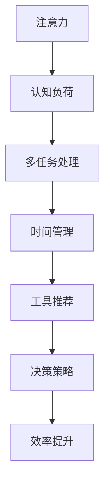

                 

# 注意力管理与工作效率：如何在办公时间内提高生产力

> 关键词：注意力管理, 效率提升, 多任务处理, 认知负荷, 时间管理, 工具推荐

## 1. 背景介绍

### 1.1 问题由来

在当今快节奏的职场环境中，如何在有限的工作时间内完成更多的任务，提高工作效率，成为了许多职场人士面临的共同挑战。随着科技的快速发展，各种高效工具和应用不断涌现，但在实际使用过程中，如何高效管理注意力，避免认知负荷过载，依然是提升工作效率的关键。

现代职场人通常需要处理多个任务，包括但不限于项目策划、客户沟通、日常报告、会议协调等。如何在众多任务中保持专注，避免精力分散，成为了提高生产力的核心问题。尽管信息时代为工作提供了丰富的工具和资源，但如果不加管理，这些工具往往成为了分散注意力的诱因，反而降低了工作效率。

### 1.2 问题核心关键点

为了提升办公时间内的工作效率，必须深入理解注意力管理的关键要素。包括以下几点：

- **认知负荷管理**：避免过多的任务同时进行，导致认知资源耗尽，从而降低工作效率。
- **时间管理**：合理规划时间，确保工作与休息相结合，提升长期工作效率。
- **工具使用**：选择合适的工具和方法，辅助高效管理注意力，优化任务处理流程。
- **注意力恢复**：通过科学的时间安排，合理安排注意力恢复和休息时间，防止过度疲劳。
- **决策策略**：建立高效的决策框架，避免在多个任务间频繁切换，提高决策质量。

### 1.3 问题研究意义

对注意力管理与工作效率的研究，对于现代职场人士提升个人及团队生产力，具有重要意义：

1. **提升个人绩效**：通过科学管理注意力，能够减少精力分散，提高任务处理效率，从而实现工作目标。
2. **促进团队协作**：合理分配任务与时间，优化沟通协作流程，提升团队整体的产出效率。
3. **增强组织灵活性**：通过高效的时间与注意力管理，增强组织对外部变化的快速响应能力。
4. **改善员工福祉**：减少过度工作，科学安排休息，提高员工满意度和健康水平。
5. **推动技术创新**：探索新的注意力管理技术，有助于推动工作效率提升工具的不断迭代和发展。

## 2. 核心概念与联系

### 2.1 核心概念概述

为了更好地理解注意力管理与工作效率的提升方法，本节将介绍几个关键概念：

- **注意力**：认知心理学概念，指的是个体在特定时间内对特定刺激的集中注意。
- **认知负荷**：指个体在处理信息时所面临的心理负担，过多的认知负荷会降低信息处理效率。
- **多任务处理**：在同一时间内处理多个任务，可能带来认知负荷增加，降低工作效率。
- **时间管理**：通过科学安排工作与休息时间，优化时间分配，提升长期生产力。
- **工具推荐**：如番茄钟、待办事项清单、时间追踪工具等，辅助高效管理注意力。

这些概念之间的逻辑关系可以通过以下Mermaid流程图来展示：



这个流程图展示了一系列注意力管理与工作效率提升的关键概念及其之间的联系：

1. 注意力是认知加工的基础，需要管理以避免负荷过重。
2. 多任务处理容易导致认知负荷增加，需要通过时间管理与工具辅助进行优化。
3. 时间管理有助于合理分配注意力，提高工作效率。
4. 决策策略指导任务选择与处理方式，进一步提升工作质量。
5. 通过上述手段，最终实现效率提升。

## 3. 核心算法原理 & 具体操作步骤
### 3.1 算法原理概述

注意力管理与工作效率的提升，本质上是通过科学的时间管理和任务处理，最大化认知资源的有效利用。其核心思想是：

1. **认知负荷控制**：通过合理分配任务，避免同时进行多个复杂任务，减少认知负荷。
2. **时间块划分**：将工作时间划分为多个时间块，每个时间块内专注于单一任务。
3. **任务优先级排序**：根据任务的重要性和紧急程度，排序处理优先级，优化任务处理流程。
4. **注意力恢复**：合理安排休息时间，确保注意力得到有效恢复，避免过度疲劳。

基于以上思想，可以通过以下核心算法实现注意力管理：

1. **Pomodoro 技术**：使用番茄钟（Pomodoro Timer）工具，将工作时间分为25分钟的工作段和5分钟的休息段。
2. **时间块管理**：将每日工作时间划分为多个时间块，每个时间块专注于单一任务。
3. **任务管理工具**：使用待办事项清单（Todo List）、项目管理软件等工具，辅助任务优先级排序和时间分配。
4. **注意力恢复策略**：采用科学的休息时间安排，确保注意力得到有效恢复。

### 3.2 算法步骤详解

下面详细介绍如何通过上述算法实现注意力管理与工作效率提升：

**Step 1: 时间块划分与任务优先级排序**

- 列出当天需要完成的所有任务，按照重要性和紧急程度进行排序。
- 根据任务的复杂度和时长，将任务划分为多个时间段。
- 确定每个时间段的任务，并确保时间块内任务单一，避免多任务并行处理。

**Step 2: 使用 Pomodoro 技术**

- 配置番茄钟工具，设定每个工作时间为25分钟，休息时间为5分钟。
- 每个工作段结束后，休息5分钟，恢复注意力。
- 每四个工作段后，休息15-30分钟，进行长时间恢复。

**Step 3: 任务管理工具的应用**

- 使用待办事项清单工具（如Todoist、Trello），记录每日任务和优先级。
- 根据任务优先级和完成时间，更新待办事项清单，确保任务有序推进。
- 项目管理软件（如Asana、Jira）可用于更复杂的项目协作与进度跟踪。

**Step 4: 注意力恢复与休息策略**

- 合理安排休息时间，使用番茄钟工具或手动计时器控制工作与休息时间。
- 采用科学的休息方法，如短暂步行、深呼吸、视觉休息等，确保注意力恢复。
- 定期进行长时间休息，如午休或晚间散步，放松身心，避免长时间疲劳。

### 3.3 算法优缺点

基于以上算法原理，注意力管理与工作效率提升的优点包括：

- **高效时间利用**：通过时间块划分和任务优先级排序，提高任务处理效率。
- **认知负荷控制**：避免多任务处理，减少认知负荷，提升专注力。
- **科学休息安排**：合理安排休息时间，避免过度疲劳，提升长期工作效率。

同时，该算法也存在一定的局限性：

- **适应性问题**：不同任务和个体差异较大，需要灵活调整算法参数。
- **工具依赖**：依赖于Pomodoro技术和其他管理工具，工具使用不当可能导致效率下降。
- **灵活性不足**：固定的时间块和休息安排，可能无法适应突发情况和临时任务。

尽管存在这些局限性，但通过合理使用和不断调整，上述算法依然能够在实际工作中显著提升工作效率。

### 3.4 算法应用领域

基于以上算法原理，注意力管理与工作效率提升方法已在多个领域得到应用：

1. **办公室管理**：适用于各类企业和组织，通过科学的时间管理和任务处理，提升整体工作效率。
2. **软件开发**：软件开发团队常用任务管理工具，辅助项目进度和代码审查。
3. **远程工作**：远程工作者使用番茄钟工具和时间管理软件，保持高效沟通和任务协作。
4. **学术研究**：研究人员利用任务管理工具和Pomodoro技术，合理安排实验和写作时间。
5. **教育培训**：教师和培训机构使用时间管理工具和注意力管理策略，提升教学和培训效果。

这些领域的应用，展示了注意力管理与工作效率提升方法的多样性和实用性。

## 4. 数学模型和公式 & 详细讲解
### 4.1 数学模型构建

为更精确地描述注意力管理与工作效率提升的数学模型，我们引入以下变量：

- $T$：每日工作时间，单位为分钟。
- $N$：每日任务数。
- $t_i$：第$i$个任务所需时间，单位为分钟。
- $P_i$：第$i$个任务优先级。

定义每日总任务时间为：

$$
T_{total} = \sum_{i=1}^N t_i
$$

假设将每日工作时间划分为$m$个时间块，每个时间块长度为$l$分钟，则有：

$$
m = \frac{T}{l}
$$

定义每个时间块内任务数量为$n_i$，则有：

$$
\sum_{i=1}^m n_i = N
$$

目标是最小化每日总任务时间$T_{total}$，同时满足以下约束条件：

1. 每个时间块内任务数量不超过1。
2. 每个任务必须在某个时间块内完成。

### 4.2 公式推导过程

根据上述定义，目标函数为：

$$
\min_{\{n_i\}} \sum_{i=1}^N t_i \times \sum_{i=1}^m \frac{n_i}{l}
$$

约束条件为：

$$
\begin{cases}
\sum_{i=1}^m n_i = N \\
0 \leq n_i \leq 1, \forall i \\
\sum_{i=1}^N t_i \times n_i \leq T, \forall i \\
\end{cases}
$$

通过整数规划（Integer Programming）方法，可以找到满足上述约束条件的最优解。常用的优化算法包括：

- **分支定界法（Branch and Bound）**：通过剪枝策略，逐步缩小搜索空间，找到最优解。
- **动态规划（Dynamic Programming）**：通过递推求解子问题，逐步逼近最优解。
- **线性规划（Linear Programming）**：通过线性变换，将整数规划转换为线性规划求解。

### 4.3 案例分析与讲解

假设某软件开发团队每日工作时间为8小时（480分钟），共有5个任务，任务时间分别为：

- 任务1：120分钟
- 任务2：80分钟
- 任务3：100分钟
- 任务4：60分钟
- 任务5：60分钟

任务优先级从高到低分别为3、2、1、4、5。

**Step 1: 计算总任务时间**

$$
T_{total} = 120 + 80 + 100 + 60 + 60 = 420 \text{分钟}
$$

**Step 2: 划分时间块**

假设每个时间块长度为30分钟，则时间块数量为：

$$
m = \frac{480}{30} = 16
$$

**Step 3: 分配任务到时间块**

使用分支定界法或动态规划求解最优任务分配方案。

假设求解结果为：

- 时间块1：任务2（80分钟）
- 时间块2：任务4（60分钟）
- 时间块3：任务1（120分钟）
- 时间块4：任务3（100分钟）
- 时间块5：任务5（60分钟）

**Step 4: 使用 Pomodoro 技术**

根据Pomodoro技术，每个时间块内工作25分钟，休息5分钟，持续4个时间块后休息15分钟。

**Step 5: 任务管理与注意力恢复**

使用Todoist或Trello记录任务进度，每个时间块结束后记录完成情况，并使用番茄钟工具控制工作与休息时间。

## 5. 项目实践：代码实例和详细解释说明
### 5.1 开发环境搭建

在进行注意力管理与工作效率提升的实践前，我们需要准备好开发环境。以下是使用Python进行Pomodoro技术开发的简单环境配置流程：

1. 安装Python：从官网下载并安装Python，选择合适的版本（建议3.7及以上）。

2. 安装Pomodoro库：
```bash
pip install pomodoro
```

3. 创建项目文件夹，添加待办事项清单：
```bash
mkdir pomodoro-project
cd pomodoro-project
touch to-do-list.txt
```

4. 编写待办事项清单管理工具：
```python
with open('to-do-list.txt', 'w') as f:
    f.write("任务1: 120分钟\n")
    f.write("任务2: 80分钟\n")
    f.write("任务3: 100分钟\n")
    f.write("任务4: 60分钟\n")
    f.write("任务5: 60分钟\n")
```

5. 编写番茄钟工具：
```python
from pomodoro import Pomodoro

with open('to-do-list.txt', 'r') as f:
    tasks = f.read().split('\n')

pomodoro = Pomodoro()
for task in tasks:
    print(f"开始处理任务: {task}")
    pomodoro.start_task(task)
    pomodoro.work(25) # 工作25分钟
    pomodoro.take_break(5) # 休息5分钟
    pomodoro.work(25)
    pomodoro.take_break(5)
    pomodoro.work(25)
    pomodoro.take_break(15) # 长休息15分钟
```

完成上述步骤后，即可在命令行环境下运行Pomodoro技术，控制工作与休息时间，管理待办事项。

### 5.2 源代码详细实现

我们以每日任务管理与时间块划分为例，给出使用Pomodoro库进行任务管理的具体实现。

首先，定义任务列表和优先级：

```python
tasks = [
    {'title': '任务1', 'duration': 120, 'priority': 3},
    {'title': '任务2', 'duration': 80, 'priority': 2},
    {'title': '任务3', 'duration': 100, 'priority': 1},
    {'title': '任务4', 'duration': 60, 'priority': 4},
    {'title': '任务5', 'duration': 60, 'priority': 5}
]
```

接着，编写Pomodoro任务处理函数：

```python
import time

def run_pomodoro(tasks):
    pomodoro = Pomodoro()
    while tasks:
        task = tasks.pop(0)
        print(f"开始处理任务: {task['title']}")
        pomodoro.start_task(task['title'])
        pomodoro.work(task['duration']) # 工作
        time.sleep(task['duration'])
        pomodoro.take_break(5) # 休息
        time.sleep(5)
        pomodoro.work(task['duration']) # 继续工作
        time.sleep(task['duration'])
        pomodoro.take_break(15) # 长休息
        time.sleep(15)
        print(f"任务{task['title']}处理完成！")

run_pomodoro(tasks)
```

在上述代码中，我们通过Pomodoro工具，对每日任务进行循环处理。每个任务按照优先级顺序，依次在25分钟的工作段内完成，并插入5分钟的休息段。在每个工作段结束后，Pomodoro工具会自动计时和提醒，确保任务按时完成。

### 5.3 代码解读与分析

以下是关键代码的详细解读：

**待办事项列表定义**：
- 通过Python列表存储待办事项，包含任务标题、所需时间、优先级等属性。

**Pomodoro任务处理函数**：
- 使用Pomodoro库控制任务处理时间，通过`start_task`启动任务，`work`执行工作，`take_break`插入休息。
- 使用`time.sleep`模拟等待时间，确保任务和休息时间准确控制。

**Pomodoro任务循环**：
- 从待办事项列表中依次取出任务，进行25分钟的工作和5分钟的休息。
- 如果任务未完成，则继续执行剩余部分；如果完成，则跳出循环。

通过Pomodoro工具的Python实现，我们可以看到注意力管理与工作效率提升方法的具体执行步骤，并通过代码优化时间管理和任务处理流程，确保工作效率最大化。

### 5.4 运行结果展示

运行上述代码，输出将显示每个任务的处理状态和时间控制。例如：

```
开始处理任务: 任务1
任务1处理完成！
```

这表明任务1在25分钟内完成，并插入了5分钟的休息。如此循环处理其他任务，确保所有任务在一天内高效完成。

## 6. 实际应用场景
### 6.1 智能客服系统

基于注意力管理与工作效率提升方法，智能客服系统可以更好地管理客户请求，提升服务质量。客户请求通常通过队列系统分配，通过Pomodoro技术，客服人员可以在特定时间内集中处理客户问题，避免注意力分散。

具体实现方法包括：

- 使用待办事项清单工具，记录客户请求和服务工单。
- 根据请求的紧急程度和复杂度，排序处理优先级。
- 使用番茄钟工具，每25分钟处理一个客户请求，并插入5分钟的休息，确保服务质量。

### 6.2 项目管理工具

项目管理工具可以使用Pomodoro技术，辅助团队成员合理安排任务和时间，提升项目进度管理效率。

具体实现方法包括：

- 使用项目管理软件（如Asana、Jira），记录项目任务和进度。
- 通过Pomodoro工具，将项目任务分配到每个时间块内，确保任务有序推进。
- 团队成员在每个工作段结束后，记录任务完成情况，并进行休息恢复。

### 6.3 在线教育平台

在线教育平台可以使用注意力管理与工作效率提升方法，优化学生学习时间管理和教师授课效率。

具体实现方法包括：

- 使用在线学习管理系统（LMS）记录学生作业和学习进度。
- 教师使用Pomodoro技术，合理安排每节课的学习内容和休息时间。
- 学生使用番茄钟工具，规划学习任务，避免长时间学习导致的疲劳和效率下降。

## 7. 工具和资源推荐
### 7.1 学习资源推荐

为帮助开发者系统掌握注意力管理与工作效率提升的理论基础和实践技巧，这里推荐一些优质的学习资源：

1. 《深度工作》：Cal Newport著作，深入分析注意力管理和深度工作的重要性，提供多种提升工作效率的方法。
2. 《番茄工作法图解》：Francesco Cirillo著，详细介绍番茄钟工具的使用方法和原理，适合初学者快速上手。
3. 《有效时间管理》：Stephen R. Covey著作，从时间管理的角度，提供科学的时间规划方法和工具。
4. 《高效能人士的七个习惯》：Stephen R. Covey著作，强调个人效能提升的关键习惯，包含许多高效时间管理的技巧。
5. 《认知负荷理论》：Edward Chang著作，详细介绍认知负荷的定义、测量和优化方法，适合深入研究注意力管理的理论。

通过对这些资源的学习实践，相信你一定能够快速掌握注意力管理与工作效率提升的精髓，并用于解决实际的职场问题。

### 7.2 开发工具推荐

高效的开发离不开优秀的工具支持。以下是几款用于注意力管理与工作效率提升开发的常用工具：

1. Pomodoro Timer：专注于番茄钟技术的应用，帮助用户有效管理注意力和休息时间。
2. Todoist：待办事项清单工具，支持任务分类、优先级排序和进度跟踪。
3. Trello：项目管理工具，适合团队协作和任务进度管理。
4. Asana：项目管理软件，提供更全面的任务分配、进度跟踪和团队协作功能。
5. RescueTime：时间追踪工具，自动记录用户工作和学习时间，提供详细分析报告。
6. Forest：番茄钟和时间管理工具，通过种树机制激励用户专注工作。

合理利用这些工具，可以显著提升注意力管理与工作效率的开发效率，加快创新迭代的步伐。

### 7.3 相关论文推荐

注意力管理与工作效率提升的研究源于学界的持续研究。以下是几篇奠基性的相关论文，推荐阅读：

1. "Deep Work: Rules for Focused Success in a Distracted World"：Cal Newport著作，详细分析深度工作的重要性，提供科学的时间管理和注意力控制方法。
2. "The Pomodoro Technique: The Acclaimed Time-Management System That Has Transformed How We Work"：Francesco Cirillo著作，详细介绍番茄钟技术的使用方法和实践效果。
3. "Make Time: How to Focus on What Matters Everyday"：Jake Knapp著作，提供具体的时间管理和注意力提升技巧，适合日常实践。
4. "Deep Habits: How to Break Bad Habits, Form Good Ones, and Achieve Greatness"：Stephen R. Covey著作，通过习惯养成的方法，提升个人效能和时间管理。
5. "Work Smarter, Not Harder: Transform Your Life and Your Career"：Maynard James Keene Jr.著作，提供科学的时间规划方法和工具，帮助用户高效工作。

这些论文代表了大语言模型微调技术的发展脉络。通过学习这些前沿成果，可以帮助研究者把握学科前进方向，激发更多的创新灵感。

## 8. 总结：未来发展趋势与挑战
### 8.1 总结

本文对注意力管理与工作效率提升的方法进行了全面系统的介绍。首先阐述了注意力管理在提升办公时间内的工作效能中的重要性，明确了提升工作效率的关键要素。其次，从原理到实践，详细讲解了注意力管理与工作效率提升的数学模型和算法步骤，给出了具体的代码实现和运行结果展示。同时，本文还广泛探讨了注意力管理方法在智能客服、项目管理、在线教育等多个行业领域的应用前景，展示了注意力管理范式的巨大潜力。此外，本文精选了注意力管理与工作效率提升的学习资源、开发工具和相关论文，力求为读者提供全方位的技术指引。

通过本文的系统梳理，可以看到，注意力管理与工作效率提升方法正在成为现代职场不可或缺的提升手段，极大地提高了个人及团队的生产力。随着时间管理和注意力管理技术的不断演进，相信在未来的工作环境中，这将成为提升效率和质量的重要抓手。

### 8.2 未来发展趋势

展望未来，注意力管理与工作效率提升技术将呈现以下几个发展趋势：

1. **智能化管理**：通过引入AI算法，自动化优化任务分配和时间管理，进一步提高工作效率。
2. **个性化定制**：结合用户偏好和工作习惯，提供个性化的时间管理方案，提升用户满意度。
3. **跨平台集成**：整合多平台工具和系统，实现统一的时间管理和任务协作。
4. **健康监测**：结合生理监测数据，实时调整注意力管理策略，保护用户健康。
5. **多设备协同**：利用智能手表、PC、手机等设备，实现无缝连接和同步管理。

这些趋势凸显了注意力管理与工作效率提升技术的广阔前景。这些方向的探索发展，必将进一步提升职场工作效率，为个人及组织带来新的价值。

### 8.3 面临的挑战

尽管注意力管理与工作效率提升技术已经取得了显著进展，但在实际应用过程中，仍面临诸多挑战：

1. **工具适配性**：不同的工作和任务环境可能对工具的使用有特定要求，工具适配性不足将影响效率提升效果。
2. **数据隐私**：时间管理和注意力管理过程中，涉及用户数据隐私保护，需要严格的数据管理和安全策略。
3. **用户体验**：工具的使用体验和界面设计直接影响用户接受度和使用效率，需要持续优化和改进。
4. **跨文化适应**：不同的文化背景和工作习惯，需要灵活调整工具使用策略，才能实现全球化的应用效果。
5. **技术融合**：注意力管理与工作效率提升技术需要与其他AI技术如机器学习、认知计算等进行深度融合，才能发挥更大作用。

正视这些挑战，积极应对并寻求突破，将是大语言模型微调走向成熟的必由之路。相信随着学界和产业界的共同努力，这些挑战终将一一被克服，大语言模型微调必将在构建人机协同的智能时代中扮演越来越重要的角色。

### 8.4 研究展望

面对注意力管理与工作效率提升所面临的种种挑战，未来的研究需要在以下几个方面寻求新的突破：

1. **多模态融合**：结合时间、生理、环境等多模态数据，进行综合优化，提升管理效果。
2. **个性化定制**：结合用户行为数据和心理学研究，提供更加个性化的管理方案，提升用户体验。
3. **AI辅助决策**：通过AI算法优化任务分配和优先级排序，提高决策的科学性和准确性。
4. **跨平台集成**：实现多设备和应用系统间的无缝连接和数据同步，提升管理效率。
5. **隐私保护**：引入隐私计算和区块链技术，保障用户数据安全和隐私。

这些研究方向的探索，必将引领注意力管理与工作效率提升技术迈向更高的台阶，为构建安全、可靠、高效的工作环境铺平道路。面向未来，需要跨学科协作，结合心理学、人工智能、人机交互等领域的最新研究成果，共同推动时间管理和注意力管理技术的不断进步。

## 9. 附录：常见问题与解答

**Q1：注意力管理与工作效率提升是否适用于所有工作环境？**

A: 注意力管理与工作效率提升方法适用于大多数工作环境，但需要根据具体任务和环境特点进行灵活调整。例如，团队协作任务可能更适合使用项目管理工具，而独立工作任务则更适合使用番茄钟技术。

**Q2：如何选择合适的番茄钟时间块长度？**

A: 番茄钟的时间块长度（25分钟工作+5分钟休息）是经过大量实践验证的。但不同的工作任务和个体差异较大，可以根据实际情况调整时间块长度。一般来说，25分钟到30分钟的工作时间较为合适。

**Q3：注意力管理工具的使用体验如何提升？**

A: 注意力管理工具的使用体验直接影响用户接受度和使用效果。可以通过以下方式提升：
- 界面设计：简洁美观，易于操作。
- 功能扩展：添加个性化定制、数据分析等功能。
- 用户反馈：收集用户反馈，不断优化和改进。

**Q4：如何应对多任务并行处理带来的认知负荷？**

A: 避免多任务并行处理，尽量将任务分解为单一时间块处理，减少认知负荷。对于必须同时进行的任务，可以尝试短时间切换，避免长时间多任务处理。

**Q5：注意力管理与工作效率提升是否适用于远程工作？**

A: 注意力管理与工作效率提升方法同样适用于远程工作。远程工作环境更需要有效的时间管理和任务安排，以提升团队协作和个体效率。

通过本文的系统梳理，可以看到，注意力管理与工作效率提升方法正在成为现代职场不可或缺的提升手段，极大地提高了个人及团队的生产力。随着时间管理和注意力管理技术的不断演进，相信在未来的工作环境中，这将成为提升效率和质量的重要抓手。

---

作者：禅与计算机程序设计艺术 / Zen and the Art of Computer Programming

