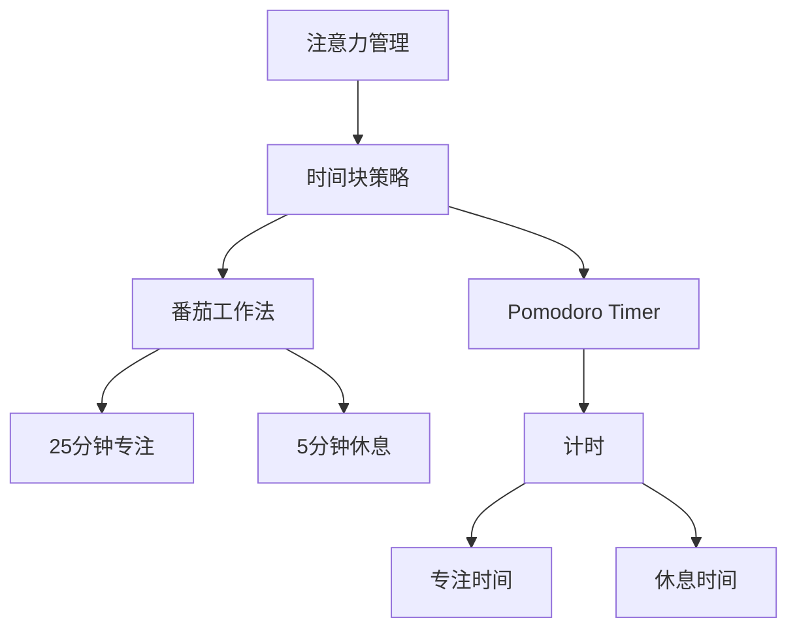

                 

# 注意力管理与时间块：如何通过专注的时间块最大化您的生产力

> 关键词：注意力管理, 时间块, 专注, 生产力提升, 工作效率, 自我管理, 工作时间优化

## 1. 背景介绍

在信息爆炸的时代，如何管理时间、提高生产力成为了越来越多人的难题。过去，我们往往依赖计划表、待办事项列表等工具，但随着工作复杂性和任务多样性的增加，这些方法逐渐显得力不从心。为此，一种新型的管理方式应运而生——注意力管理和时间块策略。

注意力管理与时间块策略是一种通过科学划分工作时间，合理分配精力的工作方法。它强调在固定的时间段内，集中注意力完成某项工作，同时设置适当的时间休息，以保持高效的工作状态。本文将详细介绍注意力管理和时间块策略的原理、操作步骤及其实际应用，帮助你最大化你的生产力。

## 2. 核心概念与联系

### 2.1 核心概念概述

为了更好地理解注意力管理与时间块策略，我们先简要介绍几个关键概念：

- **注意力管理**：指通过科学的方法，提升个人在特定时间段内的专注力，减少分心和干扰，以提高工作效率。
- **时间块**：指将工作时间划分为若干个固定时间段，每个时间块内只专注于一项任务，时间块之间设置休息时间，以保持高效状态。
- **番茄工作法**：一种经典的时间块策略，通过25分钟专注工作，5分钟短暂休息，循环往复，以提高集中精力的能力。
- **Pomodoro Timer**：一种基于番茄工作法的计时工具，辅助用户按时间段管理时间和休息。

这些概念之间存在紧密联系，共同构成了一种系统化的时间管理策略，旨在通过科学划分时间，优化工作流程，提升个人和团队的效率。

### 2.2 核心概念原理和架构的 Mermaid 流程图



这张流程图展示了注意力管理与时间块策略的核心组成：
- **注意力管理** 是时间块策略的基础，通过提升专注力，保证时间块的有效性。
- **时间块策略** 是注意力管理的具体实现，通过划分时间块，合理分配精力。
- **番茄工作法** 是时间块策略的具体形式，25分钟专注和5分钟休息的循环。
- **Pomodoro Timer** 是番茄工作法的计时工具，辅助用户按时间段管理时间和休息。

## 3. 核心算法原理 & 具体操作步骤

### 3.1 算法原理概述

注意力管理与时间块策略的原理基于心理学中的注意力持久性原理。研究表明，人类注意力在短时间内较为集中，但随着时间的推移会逐渐分散。通过科学划分时间块，可以有效地利用这一特性，保持高效工作状态。

其基本流程如下：
1. **划分时间块**：将工作时间划分为若干个固定时间段，每个时间块内只专注于一项任务。
2. **专注工作**：在时间块内，关闭干扰源，集中精力完成任务。
3. **短暂休息**：时间块之间设置短暂休息，以恢复注意力，防止疲劳。
4. **周期循环**：重复以上步骤，确保持续高效工作。

### 3.2 算法步骤详解

以下是一步一步详细介绍如何应用注意力管理与时间块策略：

**Step 1: 划分时间块**
- 确定每天工作的时间段，如上午8点至12点，下午1点至5点。
- 将每个时间段划分为若干个25分钟的时间块，例如每个小时4个时间块。

**Step 2: 设置任务和优先级**
- 列出当天需要完成的任务，并按照重要性和紧急性排序。
- 优先处理重要且紧急的任务，确保关键工作的完成。

**Step 3: 使用番茄工作法**
- 开启Pomodoro Timer，开始25分钟的专注工作。
- 25分钟结束后，短暂休息5分钟，可进行简单的拉伸、喝水等活动。
- 每完成4个时间块，进行较长时间的休息（15-30分钟），以恢复精力。

**Step 4: 记录和回顾**
- 使用工具（如Trello、Notion等）记录每个时间块的工作内容和时间消耗。
- 每周或每月回顾工作情况，评估效率和任务完成情况，优化时间块划分和任务优先级。

### 3.3 算法优缺点

**优点**：
- **提升专注力**：通过固定时间段专注工作，有效减少干扰，提升专注力。
- **避免疲劳**：短期专注后设置休息时间，防止过度疲劳。
- **提高效率**：合理分配时间和精力，避免时间浪费。

**缺点**：
- **灵活性不足**：固定时间块可能不适用于所有工作场景，需要根据实际情况进行调整。
- **依赖工具**：需要Pomodoro Timer等工具辅助，增加了使用门槛。

### 3.4 算法应用领域

注意力管理与时间块策略广泛适用于各种工作场景，特别是在需要长时间集中精力的任务中，如软件开发、写作、学习等。它也适用于团队协作，通过统一的时间块策略，提升团队的整体效率。

## 4. 数学模型和公式 & 详细讲解 & 举例说明

### 4.1 数学模型构建

注意力管理与时间块策略的数学模型较为简单，主要关注时间块的设置和任务优先级的优化。以下是基本数学模型的构建：

设每天工作时间为 $T$ 小时，时间块长度为 $t$ 分钟，任务总数为 $N$。则总时间块数为 $N_t = \frac{T \times 60}{t}$。

**目标**：最大化任务完成量 $N$。

### 4.2 公式推导过程

假设任务优先级由 $P_i$ 表示，其中 $P_i$ 越大，任务越重要。则任务完成的期望时间 $E_i$ 与时间块长度 $t$ 和优先级 $P_i$ 有关。

$$
E_i = \frac{t}{P_i}
$$

总任务完成时间 $E_{total}$ 为所有任务完成期望时间的和。

$$
E_{total} = \sum_{i=1}^{N} \frac{t}{P_i}
$$

优化目标是使总任务完成时间 $E_{total}$ 最小。

### 4.3 案例分析与讲解

假设某日工作时间为8小时，时间块长度为25分钟，任务列表及其优先级如下：

| 任务       | 优先级 | 完成时间 |
| ---------- | ------ | -------- |
| 编写代码   | 10     | 1小时    |
| 阅读论文   | 8      | 1.5小时  |
| 回复邮件   | 6      | 30分钟  |
| 更新文档   | 4      | 1小时    |

将时间块长度 $t=25$ 代入公式：

$$
E_{total} = \frac{25}{10} + \frac{25}{8} + \frac{25}{6} + \frac{25}{4} = 12.5 + 3.125 + 4.167 + 6.25 = 25.563（小时）
$$

由于总工作时间为8小时，因此无法完成所有任务。为了优化时间块，优先处理重要任务，可以按如下方式调整时间块划分：

- 第1小时：编写代码（10分钟）+ 回复邮件（10分钟）+ 更新文档（5分钟）
- 第2小时：编写代码（25分钟）+ 回复邮件（10分钟）
- 第3小时：阅读论文（25分钟）+ 回复邮件（10分钟）

总时间块数为：

$$
N_t = \frac{8 \times 60}{25} = 19.2（个）
$$

实际完成时间块数为18个，完成了大部分重要任务。

## 5. 项目实践：代码实例和详细解释说明

### 5.1 开发环境搭建

在实践注意力管理与时间块策略时，我们需要一个合适的开发环境。以下是一个基于Python的开发环境搭建步骤：

1. **安装Python**：
   ```
   sudo apt-get install python3
   ```

2. **安装时间管理工具**：
   - **Trello**：安装Trello的Python API库，用于记录和回顾工作。
   ```
   pip install trello
   ```

   - **Notion**：安装Notion的Python API库，用于记录和回顾工作。
   ```
   pip install notion-client
   ```

3. **安装番茄计时器工具**：
   - **Tomato Timer**：安装Python版本的番茄计时器。
   ```
   pip install tomato-timer
   ```

### 5.2 源代码详细实现

以下是一个简单的Python代码，用于记录和回顾工作：

```python
import trello
import notion

# 初始化Trello和Notion客户端
trello_client = trello.Trello(api_key, api_secret)
notion_client = notion.Client(token)

# 创建Trello工作板和列表
board = trello_client.create_board("Work Management")
list1 = trello_client.add_list(board.id, "To Do")
list2 = trello_client.add_list(board.id, "In Progress")
list3 = trello_client.add_list(board.id, "Done")

# 创建Notion工作页面
page = notion_client.create_page(
    parent=None,
    properties={
        "Title": "Work Management",
        "Details": "记录和回顾工作"
    }
)

# 记录每个时间块的工作内容
for i in range(1, 20):
    task = input("请输入第{}个时间块的任务内容：".format(i))
    trello_client.add_card(board.id, list1.id, task)
    notion_client.add_item(page, {"Task": task})
```

### 5.3 代码解读与分析

上述代码实现了一个简单的Trello和Notion客户端，用于记录和回顾工作。关键步骤如下：

- **初始化Trello和Notion客户端**：使用Trello和Notion的API密钥进行初始化。
- **创建Trello工作板和列表**：创建一个名为"Work Management"的工作板，包含"To Do"、"In Progress"和"Done"三个列表。
- **创建Notion工作页面**：创建一个名为"Work Management"的工作页面，用于记录和回顾工作。
- **记录每个时间块的工作内容**：通过用户输入，记录每个时间块的任务内容，并在Trello和Notion中进行同步记录。

### 5.4 运行结果展示

运行上述代码后，你可以在Trello工作板和Notion工作页面看到记录的任务，并根据任务完成情况进行回顾和优化。

## 6. 实际应用场景

### 6.1 软件开发

在软件开发中，任务繁多且复杂，往往需要长时间集中精力。通过注意力管理与时间块策略，可以有效地提升代码质量和开发效率。例如：

- 每天划分四个时间块，每个时间块专注编写代码或调试，中间设置短暂休息，以保持高效状态。
- 使用番茄工作法，每25分钟专注工作，5分钟短暂休息，防止疲劳。

### 6.2 学术研究

学术研究通常需要长时间阅读文献、撰写论文，任务单一但要求高度集中注意力。通过注意力管理与时间块策略，可以更好地分配时间和精力：

- 每天划分三个时间块，每个时间块专注阅读文献或撰写论文，中间设置短暂休息，以保持高效状态。
- 使用番茄工作法，每25分钟专注工作，5分钟短暂休息，防止疲劳。

### 6.3 项目管理

项目管理需要团队协作，通过统一的时间块策略，可以提升团队的整体效率：

- 团队成员每天划分四个时间块，每个时间块专注处理特定任务，中间设置短暂休息，以保持高效状态。
- 使用番茄工作法，每25分钟专注工作，5分钟短暂休息，防止疲劳。

## 7. 工具和资源推荐

### 7.1 学习资源推荐

为了更好地掌握注意力管理与时间块策略，推荐以下几个学习资源：

1. **《深度工作：专注的科学与艺术》**：作者卡尔·纽波特，介绍了深度工作的原理和实践方法，帮助提升专注力。
2. **《番茄工作法图解》**：作者斯塔夫·鲁姆，详细讲解了番茄工作法的操作方法和注意事项。
3. **Coursera《时间管理》课程**：斯坦福大学开设的时间管理课程，提供了系统的时间管理方法和技巧。
4. **Udemy《时间管理技巧》课程**：多个专业讲师授课，涵盖多种时间管理工具和策略。

### 7.2 开发工具推荐

以下是几个推荐的开发工具：

1. **Trello**：任务管理工具，帮助用户记录和回顾工作。
2. **Notion**：笔记和项目管理工具，用于记录和分析工作内容。
3. **Tomato Timer**：番茄工作法计时工具，辅助用户按时间段管理时间和休息。
4. **Pomodone**：番茄工作法计时工具，支持桌面和移动端。
5. **RescueTime**：时间管理工具，帮助用户了解和优化工作习惯。

### 7.3 相关论文推荐

以下是几篇经典的论文，推荐阅读：

1. **"Deep Work: Rules for Focused Success in a Distracted World" by Cal Newport**：介绍深度工作的原理和实践方法。
2. **"The Pomodoro Technique" by Francesco Cirillo**：详细介绍番茄工作法的原理和操作步骤。
3. **"Effective Time Management Strategies for Software Developers" by Éric W. CanTodoso**：介绍软件开发中的时间管理策略。

## 8. 总结：未来发展趋势与挑战

### 8.1 研究成果总结

注意力管理与时间块策略是一种简单高效的时间管理方法，通过科学划分时间块，合理分配精力，有效提升工作效率。它不仅适用于个人，也适用于团队协作和项目管理。

### 8.2 未来发展趋势

未来，注意力管理与时间块策略将进一步发展：

1. **智能番茄计时器**：引入AI技术，智能分析用户的工作习惯和疲劳状态，自动调整时间块长度和休息时间。
2. **个性化时间块策略**：根据用户的工作性质和任务复杂度，自动调整时间块策略，提升个性化效果。
3. **跨平台集成**：将时间管理工具与办公系统、协作工具等无缝集成，实现全面集成管理。
4. **实时反馈和优化**：通过实时数据分析，动态调整时间块策略，优化工作流程。

### 8.3 面临的挑战

尽管注意力管理与时间块策略已经取得了显著成效，但仍面临一些挑战：

1. **灵活性不足**：固定时间块可能不适用于所有工作场景，需要根据实际情况进行调整。
2. **依赖工具**：使用工具增加了学习成本，且部分工具可能存在使用门槛。
3. **个性化需求**：不同用户的工作习惯和需求不同，需要个性化定制时间块策略。
4. **数据隐私**：使用时间管理工具涉及大量数据记录和分析，需要严格的数据隐私保护。

### 8.4 研究展望

未来，需要进一步研究和探索注意力管理与时间块策略的优化和改进：

1. **数据驱动的优化**：通过大数据分析，优化时间块策略，提升工作效率。
2. **多模态时间管理**：结合视觉、听觉等感官信息，提升时间管理效果。
3. **跨文化适应性**：研究不同文化背景下，注意力管理与时间块策略的适应性和优化方法。
4. **脑机接口**：探索脑机接口技术，通过脑电信号分析，实时调整时间块策略。

## 9. 附录：常见问题与解答

**Q1: 注意力管理与时间块策略是否适用于所有工作场景？**

A: 注意力管理与时间块策略适用于大部分需要长时间集中精力的工作场景，如软件开发、学术研究、项目管理等。但部分需要即时响应的工作场景，如客服、紧急任务处理，可能需要灵活调整时间块策略。

**Q2: 如何使用番茄工作法？**

A: 使用番茄工作法，每25分钟专注工作，5分钟短暂休息。具体步骤如下：
1. 选择一个任务，开启计时器（如Tomato Timer）。
2. 专注工作25分钟，避免干扰。
3. 计时器提示后，短暂休息5分钟，进行简单的拉伸、喝水等活动。
4. 每完成4个时间块，进行较长时间的休息（15-30分钟），以恢复精力。

**Q3: 如何优化时间块策略？**

A: 优化时间块策略主要从任务优先级和时间块长度两个方面入手：
1. 根据任务重要性和紧急性排序，优先处理重要且紧急的任务。
2. 调整时间块长度，根据任务复杂度和个人习惯，灵活设置时间块长度。

**Q4: 时间管理工具有哪些？**

A: 常见的时间管理工具包括：
1. Trello：任务管理工具，帮助记录和回顾工作。
2. Notion：笔记和项目管理工具，用于记录和分析工作内容。
3. Pomodone：番茄工作法计时工具，支持桌面和移动端。
4. RescueTime：时间管理工具，帮助用户了解和优化工作习惯。

**Q5: 注意力管理与时间块策略的优缺点是什么？**

A: 优点：
1. 提升专注力：通过固定时间段专注工作，有效减少干扰，提升专注力。
2. 避免疲劳：短期专注后设置休息时间，防止过度疲劳。
3. 提高效率：合理分配时间和精力，避免时间浪费。

缺点：
1. 灵活性不足：固定时间块可能不适用于所有工作场景，需要根据实际情况进行调整。
2. 依赖工具：使用工具增加了学习成本，且部分工具可能存在使用门槛。

---

作者：禅与计算机程序设计艺术 / Zen and the Art of Computer Programming

