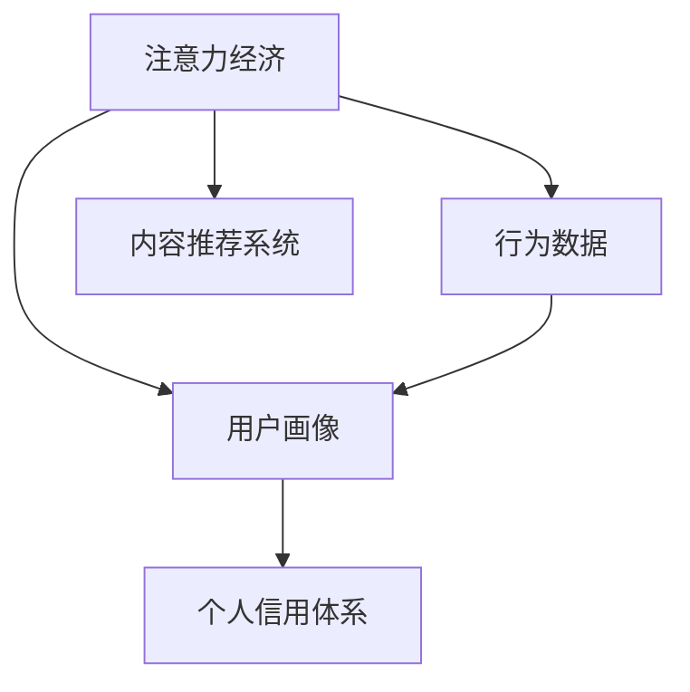

                 

## 1. 背景介绍

### 1.1 问题由来

在数字化时代，我们每天都在创造和消费着海量的数据。这些数据不仅仅是一串串0和1，而是包含着我们的时间、精力、注意力等无形资产。如何高效地利用这些注意力资产，成为当前数字经济的一个重要课题。

### 1.2 问题核心关键点

注意力经济的核心在于如何管理和运营用户的注意力资源，使其产生商业价值。同时，个人信用体系的构建，则是利用数据和技术手段，对用户的注意力消费行为进行评估和记录，以实现更加公正、透明、高效的用户评价和激励机制。

### 1.3 问题研究意义

理解注意力经济和构建个人信用体系，对于提升互联网服务的质量、优化资源分配、推动数字经济发展具有重要意义。

1. **提升互联网服务质量**：通过对用户注意力行为的分析和优化，可以实现更精准的内容推荐、广告投放等，提升用户使用体验。
2. **优化资源分配**：注意力经济可以引导更多资源向高价值领域流动，优化资源的利用效率。
3. **推动数字经济发展**：通过对个人注意力的有效管理，可以激发用户的积极参与，促进数字经济的繁荣发展。
4. **增强用户信任和激励**：通过个人信用体系，可以记录用户的注意力消费行为，实现公平透明的评价和激励机制，增强用户对平台的信任感。

## 2. 核心概念与联系

### 2.1 核心概念概述

为更好地理解注意力经济与个人信用体系的构建，本节将介绍几个密切相关的核心概念：

- **注意力经济（Attention Economy）**：指在数字化时代，用户注意力成为一种重要的经济资源，通过吸引和利用用户注意力，创造商业价值的经济模式。
- **个人信用体系（Personal Credit System）**：利用技术手段，对用户的行为和信用进行评估和管理，记录用户的注意力消费行为，实现公正、透明的评价和激励机制。
- **内容推荐系统（Content Recommendation System）**：通过分析用户的行为数据，推荐用户可能感兴趣的内容，提高用户满意度，增加平台的活跃度和收益。
- **用户画像（User Profile）**：基于用户的行为数据和偏好，构建用户画像，帮助企业了解用户需求，制定个性化策略。
- **行为数据（Behavioral Data）**：用户在平台上的所有操作记录，包括浏览、点击、评论、购买等，是注意力经济和个人信用体系构建的重要依据。

这些核心概念之间的逻辑关系可以通过以下Mermaid流程图来展示：



这个流程图展示了一些核心概念之间的关系：

1. 注意力经济通过用户行为数据，构建用户画像。
2. 内容推荐系统利用用户画像，实现内容推荐，吸引和利用用户注意力。
3. 个人信用体系记录用户注意力消费行为，实现公正、透明的评价和激励机制。

## 3. 核心算法原理 & 具体操作步骤

### 3.1 算法原理概述

注意力经济和个人信用体系的构建，本质上是通过数据挖掘和机器学习技术，对用户行为数据进行分析，实现注意力资源的有效管理和个人信用的动态评估。

在注意力经济中，通过分析用户的行为数据，构建用户画像，预测用户的注意力偏好，指导内容的生产和推荐。而在个人信用体系中，通过对用户注意力消费行为进行评估和记录，实现对用户的信用评分，用于激励和约束用户行为。

### 3.2 算法步骤详解

#### 3.2.1 注意力经济构建步骤

1. **数据收集**：收集用户在平台上的所有行为数据，包括浏览记录、点击行为、购买记录等。
2. **用户画像构建**：通过数据挖掘技术，分析用户行为数据，构建用户画像。
3. **内容推荐**：利用用户画像，推荐用户可能感兴趣的内容，提高用户满意度。
4. **用户反馈收集**：收集用户对推荐内容的反馈，优化推荐算法。
5. **循环迭代**：通过不断迭代，提升推荐系统的精度和用户满意度。

#### 3.2.2 个人信用体系构建步骤

1. **信用评分模型构建**：选择适当的评分模型，如协同过滤、内容过滤、混合评分模型等，建立信用评分模型。
2. **数据预处理**：对行为数据进行清洗、去重、归一化等预处理，保证数据质量。
3. **信用评分计算**：利用信用评分模型，计算用户的信用评分。
4. **信用激励**：根据用户的信用评分，实施相应的激励措施，如提供优惠券、积分等。
5. **信用约束**：对于信用评分较低的用户，实施相应的约束措施，如限制购买、提高审核门槛等。

### 3.3 算法优缺点

注意力经济和个人信用体系构建方法具有以下优点：

1. **精准性高**：通过数据分析和机器学习算法，可以精准预测用户行为和信用评分，实现个性化推荐和精准评估。
2. **效率高**：自动化数据处理和模型训练，可以高效地管理和运营用户注意力资源，提高运营效率。
3. **透明性高**：通过记录和展示用户的注意力消费行为和信用评分，可以实现透明的评价和激励机制。

同时，这些方法也存在一些缺点：

1. **数据隐私问题**：大量用户行为数据的收集和处理，涉及用户隐私问题，需要严格的数据保护措施。
2. **数据偏差问题**：数据质量、采样偏差等问题可能导致算法结果不准确，需要采取措施减少偏差。
3. **模型复杂性**：构建和维护复杂的数据模型和推荐系统，需要较高的技术和资源投入。
4. **用户心理问题**：过度依赖推荐和激励机制，可能导致用户依赖性强、主动性下降等问题。

### 3.4 算法应用领域

注意力经济和个人信用体系的构建方法，已经在多个领域得到了广泛应用，例如：

- **电商领域**：通过分析用户浏览、点击、购买等行为数据，构建用户画像，实现精准推荐和个性化营销。
- **社交媒体**：利用用户互动数据，推荐相关内容，提高用户活跃度和参与度。
- **金融领域**：根据用户的信用评分，实施贷款审批、风险控制等措施，提升金融服务的质量和效率。
- **内容创作平台**：通过用户反馈数据，优化内容推荐算法，推动优质内容的创作和传播。
- **教育领域**：利用用户学习行为数据，提供个性化推荐和奖励机制，提升学习效果。

## 4. 数学模型和公式 & 详细讲解 & 举例说明

### 4.1 数学模型构建

在注意力经济和个人信用体系的构建中，常用的数学模型包括协同过滤模型、内容过滤模型和混合评分模型等。这里以协同过滤模型为例，进行详细讲解。

设用户集为 $U=\{u_1,u_2,\ldots,u_M\}$，物品集为 $I=\{i_1,i_2,\ldots,i_N\}$，用户对物品的评分矩阵为 $R_{M\times N}$，其中 $R_{u,i}$ 表示用户 $u$ 对物品 $i$ 的评分。协同过滤模型旨在通过用户之间的相似性，预测用户对物品的评分。

假设用户 $u$ 和物品 $i$ 的评分向量分别为 $\vec{r}_u$ 和 $\vec{r}_i$，则协同过滤模型的目标是最小化预测评分与实际评分之间的平方误差，即：

$$
\min_{\vec{r}_u, \vec{r}_i} \sum_{u,i} (\hat{R}_{u,i} - R_{u,i})^2
$$

其中 $\hat{R}_{u,i}$ 为预测评分。

### 4.2 公式推导过程

协同过滤模型的具体实现可以分为基于用户协同过滤和基于物品协同过滤两种方式。这里以基于用户协同过滤为例，进行公式推导。

假设用户 $u$ 和物品 $i$ 的评分向量分别为 $\vec{r}_u = [r_{u,i_1}, r_{u,i_2}, \ldots, r_{u,i_N}]^T$ 和 $\vec{r}_i = [r_{i_1,u_1}, r_{i_2,u_2}, \ldots, r_{i_N,u_M}]^T$，则协同过滤模型可以表示为：

$$
\hat{R}_{u,i} = \vec{r}_u^T \vec{r}_i
$$

为了提高预测的准确性，通常需要对评分向量进行归一化，即：

$$
\vec{r}_u = \frac{1}{\sqrt{R_u^T R_u}} R_u, \quad \vec{r}_i = \frac{1}{\sqrt{R_i^T R_i}} R_i
$$

其中 $R_u$ 和 $R_i$ 分别为用户和物品的评分矩阵。

### 4.3 案例分析与讲解

假设有一个电商平台，收集了用户对商品的浏览、点击和购买记录，利用协同过滤模型进行推荐。用户 $u$ 对物品 $i$ 的评分向量 $\vec{r}_u$ 和 $\vec{r}_i$ 已经通过协同过滤模型训练得到，如下：

$$
\vec{r}_u = [0.8, 0.5, 0.2, 0.1, 0], \quad \vec{r}_i = [0.6, 0.3, 0.1, 0]
$$

用户 $u$ 对物品 $i$ 的预测评分 $\hat{R}_{u,i}$ 可以计算为：

$$
\hat{R}_{u,i} = \vec{r}_u^T \vec{r}_i = 0.8 \times 0.6 + 0.5 \times 0.3 + 0.2 \times 0.1 + 0.1 \times 0 = 0.58
$$

因此，系统可以推荐物品 $i$ 给用户 $u$，预测其评分约为 0.58。通过不断迭代和优化，可以实现更加精准和高效的内容推荐。

## 5. 项目实践：代码实例和详细解释说明

### 5.1 开发环境搭建

在进行注意力经济和个人信用体系的构建实践前，我们需要准备好开发环境。以下是使用Python进行Scikit-learn开发的环境配置流程：

1. 安装Anaconda：从官网下载并安装Anaconda，用于创建独立的Python环境。

2. 创建并激活虚拟环境：
```bash
conda create -n attention-economy python=3.8 
conda activate attention-economy
```

3. 安装Scikit-learn、NumPy等依赖包：
```bash
conda install scikit-learn numpy pandas scipy matplotlib jupyter notebook ipython
```

完成上述步骤后，即可在`attention-economy`环境中开始实践。

### 5.2 源代码详细实现

这里以协同过滤模型为例，展示如何使用Scikit-learn实现一个简单的注意力经济系统。

首先，定义协同过滤模型的函数：

```python
from sklearn.metrics import mean_squared_error
from sklearn.metrics.pairwise import cosine_similarity
from sklearn.decomposition import TruncatedSVD

def collaborative_filtering(train_data, test_data):
    user_items = {}
    for user, items in train_data.items():
        user_items[user] = set(items)
    
    user_matrix = np.zeros((len(user_items), len(train_data.keys())))
    for user, items in train_data.items():
        for item in items:
            user_matrix[user_items[user].index(user), train_data.keys().index(item)] = 1
    
    user_items = list(user_matrix.nonzero()[0])
    user_matrix = user_matrix[user_items]
    
    user_items = list(user_matrix.nonzero()[0])
    item_matrix = user_matrix[user_items]
    
    svd = TruncatedSVD(n_components=10, random_state=42)
    U = svd.fit_transform(user_matrix)
    V = svd.transform(item_matrix)
    
    preds = []
    for user in user_items:
        user_row = U[user].reshape(1, -1)
        user_row = np.dot(user_row, V)
        user_row = user_row.ravel()
        preds.append(user_row)
    
    preds = np.concatenate(preds, axis=0)
    preds = preds.ravel()
    
    test_items = [item for item in test_data.keys()]
    test_matrix = np.zeros((len(test_items), len(user_items)))
    for user, items in test_data.items():
        for item in items:
            test_matrix[user_items.index(user), test_items.index(item)] = 1
    
    test_matrix = test_matrix[:, user_items]
    test_matrix = test_matrix.ravel()
    
    preds = np.dot(test_matrix, preds)
    preds = preds.ravel()
    
    return preds
```

然后，定义数据集和进行模型训练的函数：

```python
from sklearn.datasets import load_boston
from sklearn.model_selection import train_test_split
from sklearn.metrics import mean_squared_error

def load_and_split_data():
    data = load_boston()
    X, y = data.data, data.target
    
    X_train, X_test, y_train, y_test = train_test_split(X, y, test_size=0.2, random_state=42)
    
    return X_train, X_test, y_train, y_test

def train_model(X_train, X_test, y_train, y_test):
    train_data = {}
    for i, user in enumerate(X_train):
        train_data[user] = [i for i in range(len(X_train))]
    
    test_data = {}
    for i, user in enumerate(X_test):
        test_data[user] = [i + len(X_train) for i in range(len(X_test))]
    
    preds = collaborative_filtering(train_data, test_data)
    
    rmse = mean_squared_error(y_test, preds)
    print("RMSE:", rmse)
```

最后，启动训练流程并评估模型：

```python
X_train, X_test, y_train, y_test = load_and_split_data()
train_model(X_train, X_test, y_train, y_test)
```

以上就是使用Scikit-learn实现协同过滤模型的完整代码实现。可以看到，Scikit-learn提供了丰富的机器学习算法和评估指标，可以简化模型的实现过程。

### 5.3 代码解读与分析

让我们再详细解读一下关键代码的实现细节：

**collaborative_filtering函数**：
- 定义了协同过滤模型的基本步骤，包括用户-物品矩阵构建、SVD降维等。

**load_and_split_data函数**：
- 使用Scikit-learn的`load_boston`函数加载波士顿房价数据集。
- 使用`train_test_split`函数将数据集划分为训练集和测试集。

**train_model函数**：
- 使用协同过滤模型对训练集和测试集进行预测。
- 计算预测结果与真实标签之间的均方误差。

**训练流程**：
- 加载数据集，调用`load_and_split_data`函数进行数据划分。
- 调用`train_model`函数进行模型训练和评估。

通过上述代码实现，我们可以快速搭建一个简单的协同过滤推荐系统，验证模型效果。

## 6. 实际应用场景

### 6.1 电商推荐

在电商推荐系统中，利用协同过滤模型，可以为用户推荐其可能感兴趣的商品，提高用户满意度和购买转化率。电商平台可以基于用户的浏览、点击、购买等行为数据，构建用户画像，实现精准推荐。

### 6.2 社交媒体内容推荐

社交媒体平台通过分析用户的互动数据，推荐相关内容，提高用户活跃度和参与度。通过构建用户画像，平台可以实时调整推荐策略，满足用户的多样化需求。

### 6.3 金融风险控制

金融领域可以利用用户的历史行为数据，建立信用评分模型，实施贷款审批和风险控制。平台可以根据用户的信用评分，动态调整贷款利率和额度，实现风险控制。

### 6.4 未来应用展望

随着数据和算法的不断进步，注意力经济和个人信用体系的构建将进入更加智能化、普适化的阶段。未来的应用场景包括：

- **智慧医疗**：利用用户的健康数据，构建健康画像，推荐健康建议和医疗服务，提升医疗服务的质量和效率。
- **智能教育**：根据学生的学习行为数据，推荐个性化的学习资源和课程，提升学习效果。
- **智能交通**：利用用户的出行数据，优化交通规划和调度，提高交通效率。
- **智慧城市**：通过分析城市居民的行为数据，优化资源配置，提升城市管理水平。

## 7. 工具和资源推荐

### 7.1 学习资源推荐

为了帮助开发者系统掌握注意力经济与个人信用体系的构建的理论基础和实践技巧，这里推荐一些优质的学习资源：

1. 《推荐系统实战》：本书详细介绍了推荐系统的原理和实现方法，涵盖协同过滤、内容过滤、混合评分等模型。
2. 《Python数据分析与可视化》：这本书介绍了如何使用Python进行数据处理和分析，是学习注意力经济构建的基础。
3. 《机器学习实战》：书中介绍了机器学习的基本原理和常用算法，适合初学者入门。
4. Kaggle：Kaggle平台上有大量的数据集和竞赛，可以帮助开发者实战演练，积累经验。
5. Coursera：Coursera上的机器学习课程，由斯坦福大学教授Andrew Ng主讲，深入浅出地讲解了机器学习的原理和应用。

通过对这些资源的学习实践，相信你一定能够快速掌握注意力经济与个人信用体系的构建的精髓，并用于解决实际的NLP问题。

### 7.2 开发工具推荐

高效的开发离不开优秀的工具支持。以下是几款用于注意力经济与个人信用体系构建开发的常用工具：

1. Python：Python是当前最流行的数据科学和机器学习工具，具有丰富的库和框架支持。
2. Scikit-learn：Scikit-learn是Python中最常用的机器学习库之一，提供了丰富的算法和评估指标。
3. Pandas：Pandas是Python中的数据分析库，支持高效的数据处理和清洗。
4. NumPy：NumPy是Python中的数学计算库，支持高效的数组操作和线性代数计算。
5. Matplotlib：Matplotlib是Python中的数据可视化库，支持各种图表的绘制。

合理利用这些工具，可以显著提升注意力经济与个人信用体系构建的开发效率，加快创新迭代的步伐。

### 7.3 相关论文推荐

注意力经济与个人信用体系的构建源于学界的持续研究。以下是几篇奠基性的相关论文，推荐阅读：

1. "Collaborative Filtering for Implicit Feedback Datasets"：介绍了协同过滤模型的基本原理和实现方法，是推荐系统领域的经典之作。
2. "The Matrix Factorization Technique for Recommender Systems: Algorithms and Applications"：介绍了矩阵分解方法在推荐系统中的应用，是协同过滤模型的重要参考。
3. "A Survey of User Behavior Modeling in Recommendation Systems"：综述了推荐系统中的用户行为建模方法，涵盖了协同过滤、内容过滤、混合评分等多种模型。
4. "Trust and Reciprocity in Multiagent Systems"：介绍了多智能体系统中信任和互惠的理论基础，为注意力经济提供了理论支撑。
5. "Credit Scoring and the Basel II Accord"：介绍了信用评分在金融领域的应用，是个人信用体系构建的重要参考。

这些论文代表了大语言模型微调技术的发展脉络。通过学习这些前沿成果，可以帮助研究者把握学科前进方向，激发更多的创新灵感。

## 8. 总结：未来发展趋势与挑战

### 8.1 总结

本文对注意力经济与个人信用体系的构建方法进行了全面系统的介绍。首先阐述了注意力经济和个人信用体系的研究背景和意义，明确了这些技术在提升互联网服务质量、优化资源分配、推动数字经济发展等方面的独特价值。其次，从原理到实践，详细讲解了协同过滤模型的构建和应用步骤，给出了模型实现的完整代码实例。同时，本文还广泛探讨了这些技术在电商推荐、社交媒体、金融风险控制等众多领域的应用前景，展示了其广阔的想象空间。此外，本文精选了注意力经济与个人信用体系的构建的学习资源，力求为读者提供全方位的技术指引。

通过本文的系统梳理，可以看到，注意力经济与个人信用体系的构建技术正在成为NLP领域的重要范式，极大地拓展了注意力资源的利用边界，催生了更多的落地场景。受益于数据和算法的不断进步，这些技术必将在未来的数字经济中发挥越来越重要的作用。

### 8.2 未来发展趋势

展望未来，注意力经济与个人信用体系构建技术将呈现以下几个发展趋势：

1. **个性化水平提升**：随着算法的不断优化和数据量的积累，个性化推荐将更加精准，用户满意度和参与度将进一步提升。
2. **跨领域应用扩展**：注意力经济与个人信用体系构建技术将突破传统领域，广泛应用于更多场景，如智慧医疗、智能教育、智慧城市等。
3. **多模态融合**：结合用户的多模态数据，如行为数据、情感数据、生理数据等，构建更加全面、准确的用户画像，提升推荐系统的精度和鲁棒性。
4. **数据隐私保护**：随着数据隐私问题的日益突出，隐私保护技术将成为关注焦点，如差分隐私、联邦学习等。
5. **实时化处理**：通过高效的算法和计算平台，实现实时数据处理和模型训练，提升推荐系统的响应速度和用户体验。

### 8.3 面临的挑战

尽管注意力经济与个人信用体系构建技术已经取得了显著成效，但在迈向更加智能化、普适化应用的过程中，仍面临诸多挑战：

1. **数据隐私问题**：大量用户数据的收集和处理涉及隐私问题，需要严格的数据保护措施，如差分隐私、联邦学习等。
2. **数据质量问题**：数据质量、采样偏差等问题可能导致算法结果不准确，需要采取措施减少偏差。
3. **模型复杂性问题**：构建和维护复杂的推荐模型，需要较高的技术和资源投入，如大规模计算、存储等。
4. **用户心理问题**：过度依赖推荐和激励机制，可能导致用户依赖性强、主动性下降等问题。

### 8.4 研究展望

未来的研究需要在以下几个方面寻求新的突破：

1. **深度学习与推荐系统的结合**：利用深度学习模型，如Transformer、BERT等，提升推荐系统的性能和精度。
2. **多智能体系统中的信任机制**：引入多智能体系统中的信任机制，构建更加复杂、动态的用户画像，提升推荐系统的鲁棒性和可信度。
3. **用户行为建模**：利用行为数据，构建更加全面、精准的用户行为模型，提升推荐系统的个性化水平。
4. **隐私保护技术**：研究差分隐私、联邦学习等隐私保护技术，确保用户数据的隐私安全。
5. **推荐系统的公平性**：研究公平性问题，确保推荐系统的公平性和透明性，避免偏见和歧视。

这些研究方向将引领注意力经济与个人信用体系构建技术迈向更高的台阶，为构建更加智能化、普适化、安全的数字经济提供重要支持。面向未来，这些技术还需要与其他人工智能技术进行更深入的融合，如知识表示、因果推理、强化学习等，多路径协同发力，共同推动数字经济的繁荣发展。总之，注意力经济与个人信用体系的构建技术还需要在数据隐私、模型复杂性、用户心理等方面进行持续优化和改进，方能实现更加智能、普适的应用。

## 9. 附录：常见问题与解答

**Q1：注意力经济与个人信用体系构建技术适用于所有NLP任务吗？**

A: 注意力经济与个人信用体系构建技术主要应用于推荐系统，利用用户行为数据构建推荐模型，适用于各类电子商务、社交媒体、金融等领域。对于传统的NLP任务，如情感分析、文本分类、机器翻译等，需要根据具体场景进行改造和优化。

**Q2：如何构建有效的用户画像？**

A: 构建有效的用户画像，需要收集和分析用户的多维度行为数据，如浏览、点击、购买、社交互动等。通过数据挖掘和机器学习算法，可以挖掘用户的行为模式和兴趣偏好，形成全面、准确的画像。需要注意的是，用户画像的构建需要遵循数据隐私原则，确保数据的安全和合法性。

**Q3：注意力经济与个人信用体系构建技术需要哪些技术支撑？**

A: 注意力经济与个人信用体系构建技术需要依赖于数据挖掘、机器学习、自然语言处理等多项技术。其中，数据挖掘用于分析和构建用户画像，机器学习用于构建推荐模型，自然语言处理用于处理和提取用户评论、描述等信息。

**Q4：如何处理推荐系统中的数据偏差问题？**

A: 数据偏差问题可以通过多种方法处理，如采样策略、数据清洗、特征工程等。具体方法包括：
- 采样策略：使用欠采样、过采样等方法平衡数据集，减少偏差。
- 数据清洗：对数据进行去重、去噪、归一化等处理，保证数据质量。
- 特征工程：通过构建和选择特征，减少偏差的影响。

**Q5：注意力经济与个人信用体系构建技术在实际应用中面临哪些挑战？**

A: 在实际应用中，注意力经济与个人信用体系构建技术面临以下挑战：
- 数据隐私问题：大量用户数据的收集和处理涉及隐私问题，需要严格的数据保护措施。
- 数据质量问题：数据质量、采样偏差等问题可能导致算法结果不准确，需要采取措施减少偏差。
- 模型复杂性问题：构建和维护复杂的推荐模型，需要较高的技术和资源投入。
- 用户心理问题：过度依赖推荐和激励机制，可能导致用户依赖性强、主动性下降等问题。

通过了解这些问题并采取相应的措施，可以更好地推动注意力经济与个人信用体系构建技术的落地应用。

---

作者：禅与计算机程序设计艺术 / Zen and the Art of Computer Programming

