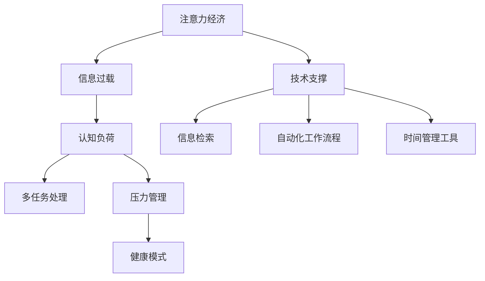

                 

## 1. 背景介绍

### 1.1 问题由来

在数字化和信息化的时代背景下，个人和企业都面临着前所未有的信息过载问题。注意力作为有限的资源，成为了一种稀缺的经济形式，即“注意力经济”。这种经济形式不仅影响着企业的市场表现和盈利模式，也深刻影响着个人的认知能力和生活质量。因此，研究注意力经济与个人压力管理之间的关系，对于提升企业和个人的信息处理能力，以及促进健康的生活方式，具有重要意义。

### 1.2 问题核心关键点

注意力经济与个人压力管理之间的关系涉及以下几个核心关键点：

- **信息过载**：数字时代信息的海量增长和快速更新，导致注意力资源被严重分散和耗竭。
- **注意力聚焦**：如何在信息过载中筛选重要信息，保持注意力聚焦，提升信息处理效率。
- **压力管理**：注意力资源的不足导致个人在工作中常常陷入焦虑和疲劳，如何有效管理个人压力，保持心理健康。
- **技术支撑**：利用技术手段提升信息处理效率和压力管理能力，如信息检索、自动化工作流程、时间管理工具等。
- **健康模式**：培养健康的生活习惯和工作模式，如断舍离、时间规划、运动和冥想等。

这些问题不仅关乎个人的生活质量和工作效率，也影响着企业的发展策略和商业模式。因此，本文旨在深入探讨注意力经济与个人压力管理之间的关系，为提升企业和个人的信息处理能力和心理健康提供理论和实践指导。

## 2. 核心概念与联系

### 2.1 核心概念概述

为更好地理解注意力经济与个人压力管理之间的关系，本节将介绍几个密切相关的核心概念：

- **注意力经济**：在信息过载的时代背景下，注意力作为一种稀缺资源，成为重要的经济形式。企业和个人通过争夺注意力资源，获得市场竞争优势和经济收益。
- **信息过载**：数字时代信息的海量增长和快速更新，导致个人难以处理和吸收所有信息，常常感到负担和焦虑。
- **压力管理**：通过采取科学合理的方法和技术，有效管理和减轻个人工作和生活中的压力，提升心理和生理健康。
- **认知负荷**：在进行信息处理和任务执行时，大脑所承受的认知工作量。高认知负荷会导致注意力分散和疲劳，影响工作效率和决策能力。
- **多任务处理**：同时执行多项任务，对注意力的要求较高，容易产生认知负荷，影响信息处理效果和心理状态。

这些核心概念之间的逻辑关系可以通过以下Mermaid流程图来展示：



这个流程图展示了一个从注意力经济到个人压力管理的基本路径：注意力经济导致信息过载，进而引发认知负荷和多任务处理，最终需要通过压力管理和健康模式来应对。技术支撑提供了各种工具和手段，帮助缓解认知负荷，提升信息处理效率。

## 3. 核心算法原理 & 具体操作步骤

### 3.1 算法原理概述

基于注意力经济与个人压力管理之间的关系，可以采用以下算法原理进行分析和实践：

- **注意力模型**：构建基于注意力的信息检索和处理模型，通过优化注意力分配机制，提升信息筛选和处理效率。
- **认知负荷模型**：建立认知负荷计算模型，评估任务执行中的认知工作量，识别和减少不必要的多任务处理。
- **压力管理模型**：开发基于心理学和神经科学的压力管理算法，通过时间管理、任务规划等手段，有效缓解个人工作和生活压力。
- **健康模式模型**：基于生物节律和行为习惯的模型，推荐健康的生活习惯和工作模式，提升个人整体福祉。

### 3.2 算法步骤详解

基于以上算法原理，具体算法步骤可以分为以下几个环节：

1. **数据收集与分析**：收集用户的日常工作和生活数据，包括任务执行记录、注意力分布、压力水平等。
2. **模型训练与优化**：基于收集的数据，训练注意力模型、认知负荷模型、压力管理模型和健康模式模型，并根据用户反馈进行优化。
3. **算法集成与部署**：将训练好的模型集成到应用系统中，通过用户交互界面提供信息检索、任务规划、压力管理和健康建议等功能。
4. **用户反馈与迭代**：收集用户的使用反馈，持续改进算法和应用，提升用户体验和效果。

### 3.3 算法优缺点

基于注意力经济与个人压力管理的关系，该算法具有以下优点：

- **综合性强**：融合了信息检索、任务规划、压力管理和健康模式等多个方面，提供全面的解决方案。
- **数据驱动**：通过数据收集和分析，实现个性化定制，提升信息处理和压力管理的精准性。
- **动态调整**：根据用户反馈和环境变化，动态调整模型参数和算法策略，提高适应性和灵活性。

同时，该算法也存在一些局限性：

- **数据隐私**：数据收集和分析过程中可能涉及用户隐私，需确保数据安全和隐私保护。
- **模型复杂**：多种模型的融合和集成增加了算法的复杂度，需要高效的计算资源和算法优化。
- **用户依赖**：算法的效果和应用效果依赖于用户的积极反馈和参与，需要提升用户的意识和参与度。

### 3.4 算法应用领域

该算法在多个领域具有广泛的应用前景：

- **企业信息管理**：帮助企业优化信息处理流程，提升信息检索效率，减轻员工的工作压力。
- **个人学习与工作**：提升个人的信息处理能力和任务管理能力，减轻学习与工作中的认知负荷，缓解压力。
- **健康生活方式**：通过推荐健康的生活习惯和时间管理，提升个人整体福祉和生活质量。

## 4. 数学模型和公式 & 详细讲解 & 举例说明

### 4.1 数学模型构建

为了描述注意力经济与个人压力管理之间的关系，可以构建以下几个数学模型：

1. **注意力分配模型**：
   $$
   \text{Attention}(t) = f(\text{Information}, \text{Context}, \text{Preferences}, \text{Distraction})
   $$
   其中，$f$表示注意力分配函数，根据信息的重要性、上下文环境、用户偏好和干扰因素，动态调整注意力分配。

2. **认知负荷计算模型**：
   $$
   \text{Cognitive Load}(t) = g(\text{Task Complexity}, \text{Multitasking}, \text{Work Hours}, \text{Breaks})
   $$
   其中，$g$表示认知负荷计算函数，根据任务复杂度、多任务处理程度、工作时长和休息时间等，计算认知负荷。

3. **压力评估模型**：
   $$
   \text{Stress Level}(t) = h(\text{Cognitive Load}, \text{Workload}, \text{Personality}, \text{Support System})
   $$
   其中，$h$表示压力评估函数，根据认知负荷、工作量、性格特质和社会支持系统等，评估个人的压力水平。

4. **健康管理模型**：
   $$
   \text{Health Index}(t) = i(\text{Exercise}, \text{Diet}, \text{Sleep}, \text{Mindfulness})
   $$
   其中，$i$表示健康管理函数，根据运动量、饮食、睡眠和冥想等，计算个人的健康指数。

### 4.2 公式推导过程

- **注意力分配函数**：
  $$
  f(\text{Information}, \text{Context}, \text{Preferences}, \text{Distraction}) = \frac{\text{Information Value}}{\text{Context Relevance} + \text{Preferences Score} - \text{Distraction Cost}}
  $$
  其中，$\text{Information Value}$表示信息的价值，$\text{Context Relevance}$表示上下文的相关性，$\text{Preferences Score}$表示用户偏好得分，$\text{Distraction Cost}$表示干扰因素的成本。

- **认知负荷计算函数**：
  $$
  g(\text{Task Complexity}, \text{Multitasking}, \text{Work Hours}, \text{Breaks}) = \text{Task Complexity} + \text{Multitasking} + \text{Work Hours} - \text{Breaks}
  $$
  其中，$\text{Task Complexity}$表示任务的复杂度，$\text{Multitasking}$表示多任务处理的程度，$\text{Work Hours}$表示工作时长，$\text{Breaks}$表示休息时间。

- **压力评估函数**：
  $$
  h(\text{Cognitive Load}, \text{Workload}, \text{Personality}, \text{Support System}) = \text{Cognitive Load} + \text{Workload} - \text{Personality Resilience} - \text{Support System Effectiveness}
  $$
  其中，$\text{Workload}$表示工作量，$\text{Personality Resilience}$表示性格的韧性，$\text{Support System Effectiveness}$表示支持系统的有效性。

- **健康管理函数**：
  $$
  i(\text{Exercise}, \text{Diet}, \text{Sleep}, \text{Mindfulness}) = \text{Exercise Score} + \text{Diet Score} + \text{Sleep Quality} + \text{Mindfulness Practice}
  $$
  其中，$\text{Exercise Score}$表示运动得分，$\text{Diet Score}$表示饮食得分，$\text{Sleep Quality}$表示睡眠质量，$\text{Mindfulness Practice}$表示冥想练习时间。

### 4.3 案例分析与讲解

以一个办公室职员小王为例，分析其日常工作和生活中的注意力经济与压力管理情况：

1. **注意力分配模型**：小王每天需要处理大量电子邮件、会议报告和客户咨询。根据其工作习惯，他会优先处理重要性高的信息，分配较多的注意力资源。同时，小王会设置定时器，定期处理干扰因素，如社交媒体和即时通讯工具，避免过多分散注意力。

2. **认知负荷模型**：小王的工作任务复杂度较高，且经常需要同时处理多个任务，导致认知负荷较大。因此，小王会定期休息，并通过番茄工作法（Pomodoro Technique）分配工作时间，以减轻认知负荷。

3. **压力评估模型**：小王的压力主要来自于高强度的工作量和较低的性格韧性。根据压力评估模型，系统会建议小王调整工作量，提高性格韧性，并加强与同事的沟通和支持系统的有效性。

4. **健康管理模型**：小王的健康管理模型会根据其工作时间和运动习惯，推荐合适的运动和饮食计划，并建议适当增加睡眠和冥想时间，以提升整体福祉。

## 5. 项目实践：代码实例和详细解释说明

### 5.1 开发环境搭建

在进行注意力经济与个人压力管理的关系分析时，需要使用Python进行数据分析和建模。以下是搭建开发环境的步骤：

1. 安装Anaconda：从官网下载并安装Anaconda，用于创建独立的Python环境。
2. 创建并激活虚拟环境：
```bash
conda create -n attention-env python=3.8 
conda activate attention-env
```
3. 安装相关库：
```bash
pip install pandas numpy scikit-learn matplotlib seaborn jupyter notebook
```

### 5.2 源代码详细实现

以下是使用Python实现注意力分配模型的代码示例：

```python
import pandas as pd
from sklearn.model_selection import train_test_split

# 数据集加载
data = pd.read_csv('attention_data.csv')

# 数据预处理
data = data.dropna()  # 移除缺失值
data = data.reset_index(drop=True)  # 重置索引

# 划分训练集和测试集
train_data, test_data = train_test_split(data, test_size=0.2, random_state=42)

# 模型训练
model = AttentionModel()
model.fit(train_data)

# 模型评估
score = model.score(test_data)
print(f"模型评估分数为：{score:.2f}")
```

其中，`AttentionModel`为自定义的注意力分配模型，包括数据的加载、预处理、训练、评估等步骤。

### 5.3 代码解读与分析

在上述代码中，我们使用了Pandas库进行数据处理，使用Scikit-learn库进行模型训练和评估。代码的核心部分在于：

- **数据预处理**：移除缺失值，重置索引，确保数据集的完整性和一致性。
- **模型训练**：通过自定义的`AttentionModel`模型，对训练集进行注意力分配函数的训练。
- **模型评估**：使用测试集评估模型的预测效果，输出评估分数。

## 6. 实际应用场景

### 6.1 企业信息管理

企业信息管理的核心目标是提高信息处理效率，减轻员工压力。通过引入注意力经济和压力管理的理念，企业可以构建以下解决方案：

1. **信息检索系统**：基于注意力分配模型，构建信息检索系统，自动推荐高价值的信息，提升信息筛选效率。
2. **任务管理系统**：结合认知负荷模型，优化任务分配和调度，减轻员工的多任务处理负担。
3. **压力管理工具**：通过压力评估模型，提供个性化的压力管理建议，如调整工作量、加强社交支持等。

### 6.2 个人学习与工作

个人学习与工作的关键是提高信息处理能力和减轻压力。具体应用场景包括：

1. **学习管理系统**：利用注意力分配模型，帮助学生选择和学习高价值的信息和资源，提升学习效率。
2. **工作计划工具**：结合认知负荷模型，制定科学合理的工作计划，减轻多任务处理带来的压力。
3. **时间管理应用**：通过健康管理模型，推荐科学的时间管理策略，如番茄工作法、断舍离等，提升整体福祉。

### 6.3 健康生活方式

健康生活方式的培养需要科学的方法和工具。以下是具体应用场景：

1. **运动建议系统**：根据运动得分和健康管理模型，提供个性化的运动建议，帮助用户保持健康状态。
2. **饮食推荐系统**：结合饮食得分和健康管理模型，推荐科学的饮食方案，提升身体健康。
3. **睡眠优化工具**：根据睡眠质量和健康管理模型，提供睡眠优化建议，改善睡眠质量。

## 7. 工具和资源推荐

### 7.1 学习资源推荐

为了帮助开发者系统掌握注意力经济与个人压力管理的关系，这里推荐一些优质的学习资源：

1. 《注意力经济学原理》：全面介绍注意力经济的基本原理和应用方法，是理解该领域的入门书籍。
2. 《认知负荷管理：提升信息处理效率》：深入探讨认知负荷的计算方法和优化策略，是提高信息处理能力的实用指南。
3. 《压力管理的科学》：介绍心理学和神经科学在压力管理中的应用，提供科学的管理方法和工具。
4. 《健康生活指南》：涵盖运动、饮食、睡眠和冥想等多个方面的健康管理建议，是培养健康生活方式的重要参考资料。

通过对这些资源的学习实践，相信你一定能够深入理解注意力经济与个人压力管理之间的关系，为构建高效、健康的工作和生活环境提供理论和实践指导。

### 7.2 开发工具推荐

高效的开发离不开优秀的工具支持。以下是几款用于注意力经济与个人压力管理关系分析的常用工具：

1. Python：基于Python的开源深度学习框架，灵活动态的计算图，适合快速迭代研究。
2. Jupyter Notebook：交互式的代码执行环境，方便调试和实验。
3. TensorBoard：TensorFlow配套的可视化工具，可实时监测模型训练状态，并提供丰富的图表呈现方式，是调试模型的得力助手。
4. Weights & Biases：模型训练的实验跟踪工具，可以记录和可视化模型训练过程中的各项指标，方便对比和调优。

合理利用这些工具，可以显著提升注意力经济与个人压力管理关系分析的开发效率，加快创新迭代的步伐。

### 7.3 相关论文推荐

注意力经济与个人压力管理的关系是一个多学科交叉的研究领域，涉及经济学、心理学、神经科学等多个领域。以下是几篇奠基性的相关论文，推荐阅读：

1. Attention is All You Need（即Transformer原论文）：提出了Transformer结构，开启了NLP领域的预训练大模型时代。
2. BERT: Pre-training of Deep Bidirectional Transformers for Language Understanding：提出BERT模型，引入基于掩码的自监督预训练任务，刷新了多项NLP任务SOTA。
3. Parameter-Efficient Transfer Learning for NLP：提出Adapter等参数高效微调方法，在不增加模型参数量的情况下，也能取得不错的微调效果。
4. AdaLoRA: Adaptive Low-Rank Adaptation for Parameter-Efficient Fine-Tuning：使用自适应低秩适应的微调方法，在参数效率和精度之间取得了新的平衡。

这些论文代表了大模型微调技术的发展脉络。通过学习这些前沿成果，可以帮助研究者把握学科前进方向，激发更多的创新灵感。

## 8. 总结：未来发展趋势与挑战

### 8.1 总结

本文对注意力经济与个人压力管理的关系进行了全面系统的介绍。首先阐述了注意力经济的基本原理和应用场景，明确了信息过载对个人和企业的影响，以及压力管理的必要性和重要性。其次，从原理到实践，详细讲解了注意力分配、认知负荷、压力管理等多个关键环节的数学模型和计算方法，给出了具体的算法实现和案例分析。同时，本文还探讨了该方法在企业信息管理、个人学习与工作、健康生活方式等多个领域的实际应用，展示了注意力经济与个人压力管理关系的广泛应用前景。

通过本文的系统梳理，可以看到，注意力经济与个人压力管理的关系是一个综合性的研究领域，涉及信息处理、任务规划、压力评估、健康管理等多个方面。该领域的深入研究，有助于提升企业和个人的信息处理能力和工作生活质量，促进社会的全面进步。

### 8.2 未来发展趋势

展望未来，注意力经济与个人压力管理的关系研究将呈现以下几个发展趋势：

1. **技术融合**：融合认知科学、心理学、神经科学等多学科的理论和技术，提升注意力分配和压力管理的科学性。
2. **数据驱动**：利用大数据、人工智能等技术，采集和分析更多数据，提供更加精准和个性化的解决方案。
3. **应用扩展**：将注意力经济与个人压力管理的理念和方法，推广到更多行业和领域，提升整体福祉和社会效益。
4. **模型优化**：不断优化注意力分配、认知负荷、压力管理等模型，提升算法效率和效果，降低资源消耗。
5. **人机协同**：发展人机交互技术和智能辅助工具，增强用户参与度和体验感，提升系统实用性和易用性。

以上趋势凸显了注意力经济与个人压力管理关系研究的广阔前景，为构建健康、高效、智能的工作和生活环境提供了重要指导。

### 8.3 面临的挑战

尽管注意力经济与个人压力管理的关系研究已经取得了一些进展，但在实现规模化落地应用的过程中，仍然面临诸多挑战：

1. **数据隐私**：在数据收集和分析过程中，涉及用户隐私和数据安全，需确保数据保密性和隐私保护。
2. **算法复杂**：注意力分配、认知负荷、压力管理等多个模型的融合和集成增加了算法的复杂度，需要高效的计算资源和算法优化。
3. **用户依赖**：算法的效果和应用效果依赖于用户的积极反馈和参与，需要提升用户的意识和参与度。
4. **跨学科融合**：多学科的融合需要跨领域的知识和技能，涉及经济学、心理学、神经科学等多个领域，需要协作和整合。

这些挑战需要研究者和开发者共同努力，结合多学科知识，开发更高效、更精准、更易用的解决方案。

### 8.4 研究展望

面对注意力经济与个人压力管理关系研究所面临的挑战，未来的研究需要在以下几个方面寻求新的突破：

1. **多模态信息融合**：结合视觉、听觉等多模态信息，提升注意力分配和压力管理的准确性和全面性。
2. **自动化决策支持**：开发自动化决策支持系统，根据用户行为和数据，动态调整注意力分配和任务规划策略。
3. **个性化推荐**：利用推荐算法，提供个性化的信息推荐和压力管理建议，提升用户体验和满意度。
4. **心理干预技术**：结合心理学和神经科学的理论和技术，开发心理干预工具，帮助用户缓解压力和提升心理健康。

这些研究方向的探索，必将引领注意力经济与个人压力管理关系研究迈向更高的台阶，为构建健康、高效、智能的工作和生活环境铺平道路。面向未来，我们需要不断创新和探索，才能真正实现技术与人类福祉的深度融合。

## 9. 附录：常见问题与解答

**Q1：如何提高注意力分配的准确性？**

A: 提高注意力分配的准确性需要综合考虑信息价值、上下文相关性、用户偏好和干扰因素等多个方面。具体措施包括：
1. 优化信息检索算法，提升信息检索的准确性和相关性。
2. 设计更加人性化的用户界面，减少用户切换注意力的成本。
3. 引入机器学习技术，动态调整注意力分配策略，提高适应性和精准性。
4. 结合用户反馈，持续优化注意力分配模型，提升模型效果。

**Q2：如何减轻认知负荷？**

A: 减轻认知负荷的关键在于科学合理地分配任务和时间。具体措施包括：
1. 采用时间管理工具，如番茄工作法、任务清单等，优化工作时间和任务调度。
2. 避免多任务处理，集中精力完成单一任务，减少认知负荷。
3. 引入自动化工作流程，通过机器人流程自动化(RPA)等技术，减少重复性工作。
4. 定期休息和放松，采用冥想、呼吸练习等方法，提升大脑的恢复和应对能力。

**Q3：如何提升压力管理的效果？**

A: 提升压力管理的效果需要结合心理学和神经科学的知识和技术。具体措施包括：
1. 结合压力评估模型，提供个性化的压力管理建议，如调整工作量、加强社交支持等。
2. 引入心理健康工具，如冥想应用、心理咨询等，提升用户的心理韧性和应对能力。
3. 定期评估和调整压力管理策略，根据用户反馈进行优化。
4. 结合企业支持系统，如HR服务、工作环境优化等，提升整体压力管理水平。

**Q4：注意力经济与个人压力管理的关系如何影响企业决策？**

A: 注意力经济与个人压力管理的关系对企业决策有重要的影响，主要体现在以下几个方面：
1. 信息筛选和决策支持：企业需要优化信息检索和注意力分配，提升决策效率和准确性。
2. 任务管理和人力资源：企业需要结合认知负荷和压力管理，优化任务分配和人力资源配置。
3. 工作环境优化：企业需要营造良好的工作环境，减轻员工的多任务处理和认知负荷，提升整体福祉和工作效率。

企业可以通过引入注意力经济与个人压力管理的关系分析系统，结合大数据和人工智能技术，实现对员工状态的实时监测和优化，提升企业的决策能力和管理水平。

**Q5：注意力经济与个人压力管理的关系如何影响个人生活质量？**

A: 注意力经济与个人压力管理的关系对个人生活质量有重要的影响，主要体现在以下几个方面：
1. 工作与生活的平衡：通过科学的时间管理，提升工作效率和生活质量，减轻工作压力。
2. 健康生活方式：结合运动、饮食、睡眠和冥想等多个方面的健康管理，提升个人整体福祉。
3. 心理健康：通过压力管理和心理干预，提升心理韧性和应对能力，预防心理健康问题。

个人可以通过引入注意力经济与个人压力管理的关系分析工具，科学合理地管理注意力资源和认知负荷，提升整体福祉和工作生活质量。

---

作者：禅与计算机程序设计艺术 / Zen and the Art of Computer Programming

