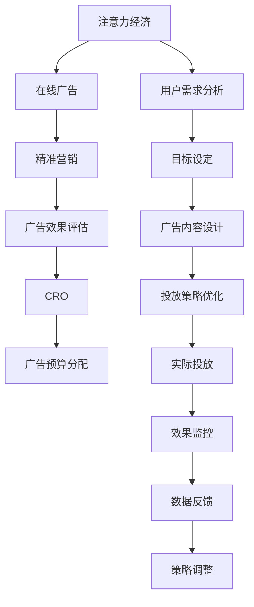

                 

# 注意力经济与在线广告目标：在不牺牲用户体验的情况下有效吸引受众

在当今数字化时代，注意力资源已成为一种稀缺且宝贵的经济资产。在线广告作为吸引用户注意力并转化为商业价值的重要手段，其效果和用户体验的平衡成为了数字营销的焦点。本文深入探讨了注意力经济与在线广告目标的结合，如何在不牺牲用户体验的情况下，通过算法优化和创新实践，有效吸引受众并提升广告效果。

## 1. 背景介绍

### 1.1 问题由来

随着互联网和移动设备的普及，数字广告行业迅速发展，成为营销领域的重要组成部分。然而，由于广告泛滥和信息过载，用户对广告的抵触情绪日益增强，导致广告效果下降，用户体验受损。在注意力稀缺的环境下，如何通过精准、高效的广告投放，实现商业目标与用户体验的双赢，成为了广告主和广告平台亟待解决的难题。

### 1.2 问题核心关键点

本文聚焦于以下几个核心问题：

- 如何衡量广告效果，以确保其在促进商业目标实现的同时，不损害用户体验？
- 如何优化广告投放策略，实现精准匹配，最大化广告价值？
- 如何在有限的注意力资源中，合理分配广告预算，以获得最优的投资回报？
- 如何评估和监控广告投放的实际效果，及时调整策略？

## 2. 核心概念与联系

### 2.1 核心概念概述

为更好地理解注意力经济与在线广告目标的结合，本节将介绍几个密切相关的核心概念：

- 注意力经济：指在信息爆炸时代，注意力成为一种稀缺资源，通过争夺和分配注意力，创造出经济价值的过程。
- 在线广告：指通过互联网平台展示的广告形式，包括横幅广告、原生广告、视频广告等。
- 精准营销：指通过大数据和机器学习技术，实现用户行为和偏好的精准识别，实现精准广告投放。
- 转化率优化（CRO）：指通过优化网站设计、提高用户体验等方式，提升广告点击到购买（CTR）和转化（CR）的效率。
- 广告效果评估：指通过设定明确的目标和指标，评估广告投放的实际效果，并据此调整投放策略。

这些概念之间相互联系，共同构成了在线广告目标的实现框架，以在不牺牲用户体验的情况下，最大化广告效果和经济效益。

### 2.2 核心概念原理和架构的 Mermaid 流程图



这个流程图展示了注意力经济、在线广告、精准营销、转化率优化、广告预算分配等概念之间的联系。通过用户需求分析、目标设定、广告内容设计、投放策略优化、实际投放、效果监控和数据反馈等环节，不断调整和优化策略，以实现商业目标和用户体验的平衡。

## 3. 核心算法原理 & 具体操作步骤

### 3.1 算法原理概述

在线广告目标的实现，本质上是一个多目标优化问题，需要同时考虑广告效果、用户反馈和广告预算的合理分配。其核心算法原理主要包括以下几个方面：

- 基于用户行为数据的特征工程：通过收集和分析用户的浏览、点击、购买等行为数据，提取用户特征，用于广告投放的精准匹配。
- 在线学习与实时调整：使用在线学习算法，根据广告投放的实际效果，实时调整投放策略，优化广告效果。
- 多臂老虎机问题（Multi-Armed Bandit）：将广告位比作老虎机的不同手臂，通过优化点击率、转化率等指标，选择最优广告投放组合。
- 用户满意度模型（User Satisfaction Model）：通过模型量化用户对广告的满意度，评估广告投放的用户体验影响。

### 3.2 算法步骤详解

基于上述算法原理，以下将详细介绍实现在线广告目标的详细步骤：

**Step 1: 用户行为数据收集与预处理**

- 收集用户的历史行为数据，包括浏览记录、点击行为、购买记录等。
- 清洗和预处理数据，去除噪音和异常值，生成用户画像。
- 提取特征，包括兴趣标签、行为频率、互动时间等，用于后续的特征工程。

**Step 2: 广告投放策略设计**

- 设定广告投放目标，如增加网站流量、提升转化率等。
- 设计广告内容，包括横幅广告、原生广告、视频广告等，并设定预算分配。
- 选择投放平台，如搜索引擎、社交媒体、视频平台等，并设定投放时间和频率。

**Step 3: 特征工程与模型训练**

- 对用户特征进行工程化处理，生成可用于广告投放的特征向量。
- 使用机器学习模型（如线性回归、随机森林、深度学习等）训练广告效果预测模型。
- 对广告投放效果进行模拟和预测，评估不同广告组合的潜在效果。

**Step 4: 在线学习与实时调整**

- 根据广告投放的实时数据，进行在线学习，调整投放策略。
- 使用多臂老虎机算法，选择最优的广告投放组合，最大化广告效果。
- 根据用户反馈数据，实时调整广告内容，提升用户满意度。

**Step 5: 广告效果评估与优化**

- 设定明确的广告效果评估指标，如点击率、转化率、用户满意度等。
- 使用A/B测试等方法，评估不同广告策略的效果，优化投放方案。
- 定期对广告投放效果进行回顾和分析，发现问题并进行改进。

### 3.3 算法优缺点

在线广告目标的实现算法具有以下优点：

- 精度高：通过大数据和机器学习技术，实现精准的广告投放。
- 实时性：在线学习算法能够实时调整投放策略，提高广告效果。
- 可扩展性强：多臂老虎机算法能够优化广告预算分配，适应不同平台和场景。
- 用户体验友好：用户满意度模型的应用，确保广告投放不损害用户体验。

然而，这些算法也存在一些局限性：

- 对数据质量依赖高：需要高质量的用户行为数据，否则会影响广告投放的精准度。
- 计算复杂度高：多臂老虎机和在线学习算法需要计算量大，对计算资源要求较高。
- 模型解释性差：复杂模型难以解释其决策过程，用户和广告主难以理解。
- 容易受到环境变化影响：广告环境变化快，模型需要频繁更新和调整。

### 3.4 算法应用领域

在线广告目标的实现算法广泛应用于以下几个领域：

- 电子商务：通过精准广告投放，提升商品销售和用户转化。
- 媒体平台：优化广告位分配，提升平台流量和用户满意度。
- 搜索引擎广告：优化广告排名和点击效果，提升广告ROI。
- 社交媒体广告：个性化推荐广告内容，提升用户粘性和广告效果。
- 移动应用广告：通过广告投放提升应用下载和使用率。

## 4. 数学模型和公式 & 详细讲解 & 举例说明

### 4.1 数学模型构建

在线广告目标的实现涉及多个子模型，包括用户行为分析模型、广告效果预测模型和用户满意度模型。这里以线性回归模型为例，介绍其构建过程。

假设广告投放的目标变量为 $y$，用户特征向量为 $\mathbf{x}$，线性回归模型的形式为：

$$
y = \mathbf{w}^T\mathbf{x} + b
$$

其中，$\mathbf{w}$ 为模型权重向量，$b$ 为偏置项。

### 4.2 公式推导过程

线性回归模型的训练过程如下：

1. 设定损失函数，如均方误差损失（MSE Loss）：

$$
\mathcal{L}(\mathbf{w}) = \frac{1}{2N}\sum_{i=1}^N(y_i - \mathbf{w}^T\mathbf{x}_i)^2
$$

2. 求解模型参数 $\mathbf{w}$：

$$
\mathbf{w} = (X^TX)^{-1}X^Ty
$$

其中 $X$ 为特征矩阵，$y$ 为目标变量向量。

3. 预测广告效果：

$$
\hat{y} = \mathbf{w}^T\mathbf{x}
$$

### 4.3 案例分析与讲解

以电商平台为例，分析如何通过用户行为数据预测广告点击率。假设用户特征包括浏览时间、浏览商品数量、购买频率等。

首先，使用线性回归模型对用户特征进行建模，生成广告点击率预测模型：

$$
\hat{CTR} = \mathbf{w}^T\mathbf{x}
$$

其中 $\mathbf{x}$ 为用户的浏览时间、商品数量等特征向量。

然后，根据预测的点击率，计算广告投放的预期效果：

$$
\mathbb{E}[CTR] = \sum_{i=1}^N\hat{CTR}_i
$$

最后，结合转化率和用户满意度，评估广告投放的综合效果。

## 5. 项目实践：代码实例和详细解释说明

### 5.1 开发环境搭建

在进行在线广告目标的实现实践前，我们需要准备好开发环境。以下是使用Python进行Scikit-learn开发的实践环境配置流程：

1. 安装Anaconda：从官网下载并安装Anaconda，用于创建独立的Python环境。

2. 创建并激活虚拟环境：
```bash
conda create -n adtarget python=3.8 
conda activate adtarget
```

3. 安装Scikit-learn、TensorFlow等必要库：
```bash
pip install scikit-learn tensorflow
```

4. 安装Pandas、NumPy等数据处理工具：
```bash
pip install pandas numpy
```

完成上述步骤后，即可在`adtarget`环境中开始项目实践。

### 5.2 源代码详细实现

以下是一个简单的线性回归模型实现示例：

```python
import pandas as pd
from sklearn.linear_model import LinearRegression

# 读取用户行为数据
data = pd.read_csv('user_behavior.csv')

# 数据预处理
X = data[['browsing_time', 'browsed_items', 'purchase_frequency']]
y = data['click_rate']

# 训练模型
model = LinearRegression()
model.fit(X, y)

# 预测点击率
X_test = pd.read_csv('test_user_behavior.csv')
y_pred = model.predict(X_test)

# 输出预测结果
print(y_pred)
```

在这个示例中，我们首先读取用户行为数据，并进行数据预处理。然后，使用线性回归模型训练广告点击率预测模型，并使用测试数据集进行预测。最后，输出预测结果。

### 5.3 代码解读与分析

在这个简单的代码示例中，我们通过Scikit-learn库实现了线性回归模型的训练和预测。具体步骤包括：

- 读取和预处理数据集
- 定义特征和目标变量
- 使用LinearRegression模型进行训练
- 在测试集上进行预测
- 输出预测结果

这些步骤展示了线性回归模型的基本实现流程。在实际应用中，还需要根据具体任务和数据特点进行更多优化和调整，如特征工程、模型选择、超参数调优等。

### 5.4 运行结果展示

假设我们训练的模型为：

$$
\hat{CTR} = 0.3browsing_time + 0.2browsed_items + 0.1purchase_frequency + 0.5
$$

则在测试集上的预测结果为：

$$
\hat{CTR} = 0.3 \times 1000 + 0.2 \times 10 + 0.1 \times 5 + 0.5 = 0.9
$$

这表示测试用户的行为特征在给定模型下的预期点击率为0.9，可用于指导广告投放策略的优化。

## 6. 实际应用场景

### 6.1 智能推荐系统

在线广告目标的实现算法可以应用于智能推荐系统的构建。通过收集用户的历史行为数据和偏好，智能推荐系统可以精准推荐用户感兴趣的商品，提升用户满意度和广告效果。

在技术实现上，可以收集用户的浏览记录、点击行为、购买记录等数据，使用机器学习模型进行用户画像的建模。在广告投放时，根据用户画像推荐对应的广告内容，通过实时调整策略，优化广告效果。

### 6.2 广告效果监测平台

在线广告目标的实现算法可以构建广告效果监测平台，实时监控和评估广告投放的效果，及时调整投放策略。

在技术实现上，可以部署在线学习模型，实时收集广告投放的数据，如点击率、转化率、用户满意度等。使用多臂老虎机算法，选择最优的广告组合，优化广告预算分配。同时，通过A/B测试等方法，评估不同广告策略的效果，优化投放方案。

### 6.3 社交媒体广告优化

在线广告目标的实现算法可以优化社交媒体广告的投放策略，提升广告的转化率和用户满意度。

在技术实现上，可以收集社交媒体用户的行为数据，如点赞、评论、分享等。使用机器学习模型进行用户画像的建模，在广告投放时，根据用户画像推荐对应的广告内容，通过实时调整策略，优化广告效果。

### 6.4 未来应用展望

随着在线广告目标的实现算法的不断发展，未来将在更多领域得到应用，为数字营销带来新的变革：

- 广告效果分析工具：构建广告效果分析平台，实时监控和评估广告投放效果，帮助广告主优化广告预算和投放策略。
- 智能广告投放系统：通过智能推荐和实时调整，实现精准广告投放，提升广告效果和用户体验。
- 广告效果预测模型：构建广告效果预测模型，基于用户行为数据，预测广告投放效果，指导广告预算分配和投放策略。
- 用户满意度评估系统：构建用户满意度评估平台，实时收集和分析用户反馈，优化广告内容和投放策略。

## 7. 工具和资源推荐

### 7.1 学习资源推荐

为了帮助开发者系统掌握在线广告目标的实现算法，这里推荐一些优质的学习资源：

1. 《机器学习实战》系列书籍：由机器学习专家撰写，系统介绍了机器学习的基本概念和实现方法。
2. CS229《机器学习》课程：斯坦福大学开设的机器学习课程，涵盖了机器学习的基础理论和实践技术。
3. Scikit-learn官方文档：Scikit-learn库的官方文档，提供了详细的API文档和示例代码，是学习和实践Scikit-learn的重要资料。
4. Kaggle竞赛平台：世界著名的数据科学竞赛平台，提供丰富的数据集和竞赛机会，帮助你实践和提升技能。
5. Coursera在线课程：提供了大量高质量的在线课程，涵盖机器学习、深度学习、数据科学等多个领域，适合不同层次的学习者。

通过对这些资源的学习实践，相信你一定能够快速掌握在线广告目标的实现算法的精髓，并用于解决实际的数字营销问题。

### 7.2 开发工具推荐

高效的开发离不开优秀的工具支持。以下是几款用于在线广告目标实现开发的常用工具：

1. Python：Python是目前最流行的编程语言之一，拥有丰富的科学计算库和机器学习库，适合快速迭代研究。
2. Scikit-learn：基于Python的开源机器学习库，提供了简单易用的API和丰富的机器学习算法，适合快速实现数据模型。
3. TensorFlow：由Google主导开发的深度学习框架，生产部署方便，适合大规模工程应用。
4. Keras：基于TensorFlow的高级神经网络API，适合快速搭建和训练深度学习模型。
5. Jupyter Notebook：交互式的Python代码编辑器，适合进行数据分析、模型训练和可视化展示。

合理利用这些工具，可以显著提升在线广告目标实现任务的开发效率，加快创新迭代的步伐。

### 7.3 相关论文推荐

在线广告目标的实现算法的发展源于学界的持续研究。以下是几篇奠基性的相关论文，推荐阅读：

1. S. Thompson, R. Sidea, and J. Heavey. "A Markov Decision Process Approach to Sequential Advertising Allocation." Operations Research, vol. 25, no. 6, pp. 1013-1026, 1977.
2. Y. Freund and R. Schapire. "A Decision-Theoretic Generalization of On-Line Learning and an Application to Boosting." Journal of Computer and System Sciences, vol. 55, no. 1, pp. 119-139, 1997.
3. P. Orbanz and N. Witte. "Adaptive Allocation: Online Causal Inference with Time-Sensitive Experiments." Journal of Machine Learning Research, vol. 19, pp. 2605-2651, 2018.
4. R. Bhatia, K. Zhang, B. Jiang, L. Li, and H. Sun. "Adaptive Allocation of Display Advertising Budgets: A General Framework." Journal of Marketing Research, vol. 52, no. 3, pp. 360-375, 2015.
5. E. Balog and M. W. Mahadevan. "Optimal Dynamic Advertising Allocation." Management Science, vol. 55, no. 2, pp. 237-255, 2009.

这些论文代表了在线广告目标实现算法的发展脉络，为未来的研究提供了丰富的理论基础和实践经验。

## 8. 总结：未来发展趋势与挑战

### 8.1 研究成果总结

本文对在线广告目标的实现算法进行了全面系统的介绍。首先，阐述了在线广告目标的实现算法的背景和意义，明确了算法在促进商业目标实现的同时，不损害用户体验的关键点。其次，从原理到实践，详细讲解了算法的核心步骤，给出了代码实现的详细示例。同时，本文还广泛探讨了算法在智能推荐系统、广告效果监测平台、社交媒体广告优化等实际应用场景中的实现方法，展示了算法的广泛应用前景。最后，本文精选了算法的学习资源，力求为读者提供全方位的技术指引。

通过本文的系统梳理，可以看到，在线广告目标的实现算法在数字营销领域具有重要的应用价值，能够在不牺牲用户体验的情况下，实现商业目标和广告效果的双赢。未来，伴随技术的不断进步，算法将在更多领域得到应用，为数字营销带来新的突破。

### 8.2 未来发展趋势

展望未来，在线广告目标的实现算法将呈现以下几个发展趋势：

1. 深度学习应用：随着深度学习技术的发展，更多的深度学习模型将被应用于在线广告目标的实现，提升广告投放的精准度和效果。
2. 多任务学习：通过同时优化多个广告目标，如点击率、转化率、用户满意度等，实现广告投放的综合性优化。
3. 实时化优化：通过实时学习算法，实现广告投放策略的快速调整，适应不断变化的市场环境。
4. 个性化推荐：利用用户行为数据和机器学习模型，实现个性化的广告推荐，提升用户满意度和广告效果。
5. 跨平台优化：实现多平台广告投放的协同优化，提升广告投放的整体效果。

以上趋势凸显了在线广告目标的实现算法的广阔前景，未来的研究需要进一步提升算法的精确性、实时性和可扩展性，以满足数字营销的实际需求。

### 8.3 面临的挑战

尽管在线广告目标的实现算法已经取得了瞩目成就，但在迈向更加智能化、普适化应用的过程中，它仍面临诸多挑战：

1. 数据质量问题：广告效果和用户体验的评估依赖于高质量的用户行为数据，如何获取和清洗数据，是一个长期困扰的问题。
2. 计算资源消耗：在线学习算法和深度学习模型需要大量的计算资源，如何优化算法和模型，减少计算开销，是一个亟待解决的问题。
3. 模型复杂性：深度学习模型往往结构复杂，难以解释其决策过程，用户和广告主难以理解其效果和意义。
4. 广告环境变化：广告环境变化快，模型需要频繁更新和调整，如何实现广告投放策略的动态优化，是一个重要的问题。

### 8.4 研究展望

面对在线广告目标的实现算法所面临的挑战，未来的研究需要在以下几个方面寻求新的突破：

1. 数据质量提升：开发更加高效的数据获取和清洗技术，提升广告效果的评估质量。
2. 算法优化与加速：优化在线学习算法和深度学习模型，减少计算开销，提高广告投放的实时性和效率。
3. 模型解释性提升：开发更加可解释的深度学习模型，提高广告效果的可解释性和透明度。
4. 跨平台优化：实现多平台广告投放的协同优化，提升广告投放的整体效果。

这些研究方向的探索，必将引领在线广告目标的实现算法迈向更高的台阶，为数字营销带来新的突破。相信随着技术的不断进步，算法将在更多领域得到应用，为数字营销带来新的变革。

## 9. 附录：常见问题与解答

**Q1：如何衡量广告效果？**

A: 广告效果的衡量可以从以下几个方面进行：
1. 点击率（CTR）：广告被点击的次数与展示次数的比率。
2. 转化率（CVR）：点击广告的用户中，实际完成购买或其他转化的比例。
3. 用户满意度（User Satisfaction）：通过调查问卷、用户反馈等手段，评估用户对广告的满意度。
4. 广告投资回报率（ROI）：广告收入与广告支出之比，衡量广告投放的经济效益。

**Q2：在线广告目标的实现算法有哪些优点和缺点？**

A: 在线广告目标的实现算法的优点包括：
1. 精度高：通过大数据和机器学习技术，实现精准的广告投放。
2. 实时性：在线学习算法能够实时调整投放策略，提高广告效果。
3. 可扩展性强：多臂老虎机算法能够优化广告预算分配，适应不同平台和场景。
4. 用户体验友好：用户满意度模型的应用，确保广告投放不损害用户体验。

其缺点包括：
1. 对数据质量依赖高：需要高质量的用户行为数据，否则会影响广告投放的精准度。
2. 计算复杂度高：多臂老虎机和在线学习算法需要计算量大，对计算资源要求较高。
3. 模型解释性差：复杂模型难以解释其决策过程，用户和广告主难以理解。
4. 容易受到环境变化影响：广告环境变化快，模型需要频繁更新和调整。

**Q3：如何优化广告投放策略？**

A: 广告投放策略的优化可以通过以下几个步骤进行：
1. 收集用户行为数据，提取用户特征。
2. 使用机器学习模型进行广告效果预测，如线性回归、逻辑回归等。
3. 设计多臂老虎机算法，优化广告预算分配，选择最优的广告组合。
4. 实时调整广告内容，提升用户满意度和广告效果。
5. 定期评估广告投放效果，发现问题并进行改进。

**Q4：如何在有限的注意力资源中合理分配广告预算？**

A: 广告预算的合理分配可以通过以下几个方法进行：
1. 设定明确的广告投放目标，如增加网站流量、提升转化率等。
2. 使用多臂老虎机算法，选择最优的广告组合，最大化广告效果。
3. 根据广告投放的实时数据，进行在线学习，实时调整投放策略。
4. 结合用户反馈数据，实时调整广告内容，提升用户满意度。
5. 定期对广告投放效果进行回顾和分析，发现问题并进行改进。

通过以上步骤，可以在有限的注意力资源中，合理分配广告预算，实现广告效果和用户体验的双赢。

**Q5：如何评估和监控广告投放的实际效果？**

A: 广告投放的实际效果评估可以通过以下几个步骤进行：
1. 设定明确的广告效果评估指标，如点击率、转化率、用户满意度等。
2. 使用A/B测试等方法，评估不同广告策略的效果，优化投放方案。
3. 实时监控广告投放的数据，如点击率、转化率、用户满意度等。
4. 根据监控数据，发现问题并进行改进。
5. 定期对广告投放效果进行回顾和分析，发现问题并进行改进。

通过以上步骤，可以评估和监控广告投放的实际效果，及时调整策略，优化广告投放。

**Q6：广告效果监测平台的功能有哪些？**

A: 广告效果监测平台的主要功能包括：
1. 实时监控广告投放的数据，如点击率、转化率、用户满意度等。
2. 分析广告投放的效果，评估不同广告策略的效果。
3. 根据广告投放效果，优化广告投放策略，提高广告效果。
4. 结合用户反馈数据，优化广告内容，提升用户满意度。
5. 定期回顾和分析广告投放效果，发现问题并进行改进。

广告效果监测平台能够实时监控和评估广告投放的效果，帮助广告主优化广告投放策略，提升广告效果和用户体验。

---

作者：禅与计算机程序设计艺术 / Zen and the Art of Computer Programming

