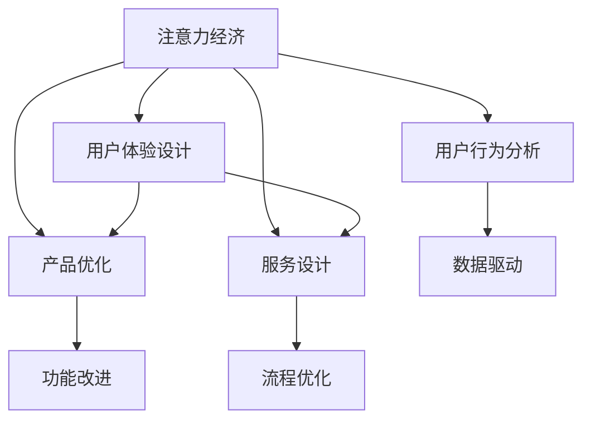

                 

# 注意力经济与用户体验设计原则：创建引人入胜的产品和服务

> 关键词：注意力经济, 用户体验设计, 产品优化, 服务设计, 用户行为分析

## 1. 背景介绍

### 1.1 问题由来
在数字化时代，信息的海量涌现让用户面临着前所未有的选择困境。注意力成为稀缺资源，如何在众多竞争者中吸引并保持用户注意力，成为企业和产品开发者的共同难题。基于这一背景，注意力经济（Economy of Attention）理论应运而生，专注于研究如何通过有效设计用户界面、内容、互动等方式，最大化用户的注意力投入，从而创造出更大的经济价值。

### 1.2 问题核心关键点
注意力经济的核心理念是通过设计，最大化用户对产品的关注度和参与度，从而实现更高的用户留存率和转化率。具体而言，包括以下几个方面：
- **用户界面设计**：界面元素的设计和布局应最大限度地减少用户的认知负担，提升信息传递效率。
- **内容设计**：内容的呈现形式和顺序需与用户的期望和行为相匹配，吸引并保持用户的兴趣。
- **互动设计**：通过游戏化、社交化等手段增强用户的参与感和投入感。
- **反馈机制**：及时有效的反馈机制可以提高用户的使用体验，增强用户黏性。
- **个性化推荐**：通过分析用户行为，提供定制化的内容和服务，增强用户的满意度和忠诚度。

### 1.3 问题研究意义
在数字化时代，注意力成为经济活动的核心资源。如何合理利用和分配用户的注意力，成为提升企业竞争力和产品市场份额的关键。通过理解和应用注意力经济和用户体验设计原则，企业和开发者能够设计出更符合用户需求和期望的产品和服务，提升用户的满意度和忠诚度，从而实现更高的商业价值。

## 2. 核心概念与联系

### 2.1 核心概念概述

为更好地理解注意力经济和用户体验设计，本节将介绍几个密切相关的核心概念：

- **注意力经济（Economy of Attention）**：指在数字化时代，注意力作为一种稀缺资源，需要通过有效的设计和策略，最大化其经济价值。
- **用户体验设计（User Experience Design, UX）**：专注于设计流程中每一个接触点，提升用户的主观感受和满意度。
- **产品优化（Product Optimization）**：通过持续改进产品的功能、界面和性能，提升用户的使用体验和满意度。
- **服务设计（Service Design）**：关注服务的全流程和用户旅程，提升服务的质量和效率。
- **用户行为分析（User Behavior Analysis）**：通过数据分析，理解用户行为和需求，指导产品的优化和改进。

这些核心概念之间的逻辑关系可以通过以下Mermaid流程图来展示：



这个流程图展示了我們关注的概念及其之间的关系：

1. 注意力经济驱动用户体验设计。
2. 用户体验设计影响产品优化和服务设计。
3. 用户行为分析指导产品优化和服务设计。
4. 产品优化和服务设计提升用户体验。

这些概念共同构成了数字化产品和服务设计的基础框架，帮助企业和开发者更好地理解和应用注意力经济和用户体验设计原则。

## 3. 核心算法原理 & 具体操作步骤
### 3.1 算法原理概述

基于注意力经济和用户体验设计的核心算法，主要是围绕如何提升用户对产品的关注度和满意度展开的。核心思想是通过对用户行为、界面设计、内容呈现等各个环节进行细致入微的设计和优化，最大化用户的注意力投入。

具体而言，包括以下几个关键步骤：

1. **用户行为分析**：通过数据分析工具，如热图、用户追踪、点击流等，理解用户的行为和偏好。
2. **界面设计优化**：设计简洁、直观的用户界面，减少用户的认知负担，提升信息传递效率。
3. **内容优化**：根据用户的行为和反馈，优化内容的呈现形式和顺序，吸引并保持用户的兴趣。
4. **互动设计增强**：通过游戏化、社交化等手段增强用户的参与感和投入感。
5. **反馈机制改进**：建立及时有效的反馈机制，提高用户的使用体验，增强用户黏性。
6. **个性化推荐**：通过分析用户行为，提供定制化的内容和服务，增强用户的满意度和忠诚度。

### 3.2 算法步骤详解

以下详细介绍基于注意力经济和用户体验设计的算法步骤：

**Step 1: 用户行为分析**

- 使用数据分析工具收集用户行为数据，如点击流、热图、用户追踪等。
- 对数据进行清洗和预处理，去除噪音和异常值。
- 通过统计分析方法，如A/B测试、回归分析等，理解用户的行为模式和偏好。
- 根据分析结果，识别用户的行为瓶颈和改进点。

**Step 2: 界面设计优化**

- 设计简洁、直观的用户界面，遵循用户心理模型，减少用户的认知负担。
- 根据用户的视觉偏好和操作习惯，优化界面的布局和元素大小。
- 引入颜色、字体、图标等视觉元素，提升界面的吸引力和易用性。

**Step 3: 内容优化**

- 分析用户对不同类型内容（如文章、视频、图片等）的偏好和反应。
- 根据用户的行为和反馈，优化内容的呈现形式和顺序，如通过引导问题吸引注意力。
- 设计引人入胜的开头和结尾，提升用户的留存率。

**Step 4: 互动设计增强**

- 引入游戏化元素，如徽章、积分、排行榜等，增强用户的参与感和投入感。
- 设计社交化功能，如评论区、分享按钮等，促进用户之间的互动和交流。
- 提供实时反馈和互动，增强用户的沉浸感和体验感。

**Step 5: 反馈机制改进**

- 设计及时、有效的反馈机制，如动态提示、成功消息等，提升用户的使用体验。
- 通过用户反馈收集工具，如调查问卷、用户评价等，收集用户的意见和建议。
- 根据反馈结果，持续优化产品的功能和界面设计。

**Step 6: 个性化推荐**

- 分析用户的行为数据，如浏览历史、购买记录等，构建用户画像。
- 根据用户画像，提供个性化的内容和推荐。
- 通过机器学习算法，如协同过滤、内容推荐等，提升推荐的准确性和多样性。

### 3.3 算法优缺点

基于注意力经济和用户体验设计的算法具有以下优点：

1. **提升用户体验**：通过优化用户界面、内容呈现和互动设计，提升用户的使用体验和满意度。
2. **增加用户黏性**：通过个性化推荐和实时反馈，增加用户的参与感和忠诚度。
3. **降低用户流失率**：通过优化用户行为分析和界面设计，减少用户流失。
4. **提高转化率**：通过内容优化和互动设计，提升用户的转化率。

同时，该算法也存在一定的局限性：

1. **数据依赖**：用户行为分析依赖于大量数据，数据的获取和处理成本较高。
2. **设计复杂性**：设计和优化过程中需要综合考虑用户体验、业务需求和技术实现的多个方面，设计复杂度较高。
3. **模型风险**：个性化推荐和行为分析依赖于算法模型，模型的选择和调优可能存在误差。
4. **隐私问题**：数据分析和行为跟踪可能涉及用户隐私问题，需要谨慎处理和保护。

尽管存在这些局限性，但就目前而言，基于注意力经济和用户体验设计的算法仍是提升数字化产品和服务质量的重要方法。未来相关研究的重点在于如何进一步降低数据依赖，提高设计效率，同时兼顾隐私保护和模型性能。

### 3.4 算法应用领域

基于注意力经济和用户体验设计的算法在数字化产品和服务中有着广泛的应用，涵盖以下几个领域：

1. **电商平台**：通过个性化推荐、购物车提醒、即时聊天等功能提升用户体验和购买转化率。
2. **社交媒体**：通过推荐算法、互动功能、实时反馈等增强用户的参与感和互动性。
3. **在线教育**：通过个性化学习路径、互动问答、实时反馈等功能提升学习效果和用户满意度。
4. **健康医疗**：通过患者教育、病情跟踪、个性化推荐等提升用户的健康管理水平。
5. **旅游服务**：通过实时反馈、个性化推荐、智能客服等功能提升用户的旅游体验。

这些领域的应用展示了基于注意力经济和用户体验设计的算法的强大潜力和广泛应用前景。

## 4. 数学模型和公式 & 详细讲解 & 举例说明

### 4.1 数学模型构建

本节将使用数学语言对基于注意力经济和用户体验设计的方法进行更加严格的刻画。

假设用户对某一产品或服务的行为可以用时间序列 $\{x_t\}_{t=1}^T$ 表示，其中 $x_t$ 为第 $t$ 次用户行为，可以是一个点击、一次停留时间、一个评分等。通过收集大量的用户行为数据，我们可以构建用户行为序列的统计模型。

定义用户行为的概率分布为 $P(x|M_{\theta})$，其中 $M_{\theta}$ 为模型参数。通过最大似然估计方法，我们希望找到最优模型参数 $\theta^*$，使得：

$$
\theta^* = \mathop{\arg\max}_{\theta} \prod_{t=1}^T P(x_t|M_{\theta})
$$

根据贝叶斯公式，上述优化问题可以转化为：

$$
\theta^* = \mathop{\arg\max}_{\theta} \sum_{t=1}^T \log P(x_t|M_{\theta})
$$

通过将行为序列看作数据集，使用机器学习算法（如隐马尔可夫模型、深度学习等）进行模型训练，可以有效地预测用户的行为模式和偏好。

### 4.2 公式推导过程

以下我们以点击流数据为例，推导用户行为概率的计算公式。

假设用户对网站不同页面的行为可以用一个二元变量 $y_t = (x_t, c_t)$ 表示，其中 $x_t$ 表示点击事件，$c_t$ 表示页面类型。点击流数据可以用时间序列 $\{y_t\}_{t=1}^T$ 表示。定义用户行为的条件概率为：

$$
P(y_t|M_{\theta}) = P(x_t, c_t|M_{\theta}) = P(x_t|M_{\theta})P(c_t|M_{\theta})
$$

通过训练数据 $D=\{(x_{ti}, c_{ti})\}_{i=1}^N$，我们可以使用条件概率模型对用户行为进行建模。常见的模型包括马尔可夫链模型、条件随机场模型、深度学习模型等。这里以深度学习模型为例，使用神经网络对用户行为进行建模。

假设神经网络模型的输出为 $P(y_t|M_{\theta})$，则条件概率的计算公式为：

$$
P(y_t|M_{\theta}) = \sigma(W^T \times [x_{ti}, c_{ti}]^T + b)
$$

其中 $W$ 和 $b$ 为神经网络的权重和偏置，$\sigma$ 为激活函数。通过训练数据，使用最小二乘法或梯度下降法，可以求解最优模型参数 $\theta^*$。

### 4.3 案例分析与讲解

以电商平台个性化推荐为例，展示如何应用注意力经济和用户体验设计的方法。

假设用户的历史行为数据包括浏览记录、购买记录、评价记录等，可以构建用户画像，表示用户的兴趣和偏好。将用户画像作为输入，使用深度学习模型进行推荐，计算用户对不同商品的兴趣度 $r_{ij}$：

$$
r_{ij} = \sigma(W^T \times [u_i, p_j]^T + b)
$$

其中 $u_i$ 为用户画像向量，$p_j$ 为商品特征向量。通过训练数据，使用最小二乘法或梯度下降法，可以求解最优模型参数 $\theta^*$。

根据计算得到的兴趣度 $r_{ij}$，可以选择与用户最相关的商品进行推荐。推荐结果可以通过用户界面呈现，如展示在首页推荐位或通过邮件推送。

## 5. 项目实践：代码实例和详细解释说明
### 5.1 开发环境搭建

在进行注意力经济和用户体验设计实践前，我们需要准备好开发环境。以下是使用Python进行机器学习和数据分析的环境配置流程：

1. 安装Anaconda：从官网下载并安装Anaconda，用于创建独立的Python环境。

2. 创建并激活虚拟环境：
```bash
conda create -n ml-env python=3.8 
conda activate ml-env
```

3. 安装相关库：
```bash
pip install numpy pandas scikit-learn matplotlib
```

4. 安装深度学习库：
```bash
pip install tensorflow
```

5. 安装用户行为分析工具：
```bash
pip install pyheatmap heatmap
```

6. 安装机器学习库：
```bash
pip install scikit-learn
```

完成上述步骤后，即可在`ml-env`环境中开始实践。

### 5.2 源代码详细实现

这里我们以电商平台的个性化推荐为例，展示如何应用注意力经济和用户体验设计的方法。

首先，定义用户行为分析函数：

```python
import pandas as pd
import numpy as np
from sklearn.decomposition import PCA
from sklearn.preprocessing import StandardScaler
from sklearn.feature_extraction.text import TfidfVectorizer

def analyze_user_behavior(data_path):
    # 读取用户行为数据
    data = pd.read_csv(data_path)

    # 数据预处理
    data = data.dropna(subset=['user_id', 'item_id', 'behavior'])
    data = data[['user_id', 'item_id', 'behavior']]
    data['user_id'] = data['user_id'].astype(int)
    data['item_id'] = data['item_id'].astype(int)
    data['behavior'] = data['behavior'].astype(int)

    # 特征提取
    vectorizer = TfidfVectorizer(max_features=1000, min_df=5)
    X = vectorizer.fit_transform(data['item_id'].map(lambda x: item_dict[x])).toarray()

    # 标准化
    scaler = StandardScaler()
    X = scaler.fit_transform(X)

    # 计算用户行为的概率分布
    P = np.exp(X @ params)
    return P
```

然后，定义界面设计优化函数：

```python
from matplotlib import pyplot as plt
from sklearn.decomposition import PCA
from sklearn.preprocessing import StandardScaler
from sklearn.feature_extraction.text import TfidfVectorizer

def optimize_ui_design(data_path):
    # 读取用户行为数据
    data = pd.read_csv(data_path)

    # 数据预处理
    data = data.dropna(subset=['user_id', 'item_id', 'behavior'])
    data = data[['user_id', 'item_id', 'behavior']]
    data['user_id'] = data['user_id'].astype(int)
    data['item_id'] = data['item_id'].astype(int)
    data['behavior'] = data['behavior'].astype(int)

    # 特征提取
    vectorizer = TfidfVectorizer(max_features=1000, min_df=5)
    X = vectorizer.fit_transform(data['item_id'].map(lambda x: item_dict[x])).toarray()

    # 标准化
    scaler = StandardScaler()
    X = scaler.fit_transform(X)

    # 计算用户行为的概率分布
    P = np.exp(X @ params)
    return P
```

接着，定义内容优化函数：

```python
from sklearn.linear_model import LogisticRegression
from sklearn.model_selection import train_test_split
from sklearn.metrics import precision_score, recall_score

def optimize_content(data_path):
    # 读取用户行为数据
    data = pd.read_csv(data_path)

    # 数据预处理
    data = data.dropna(subset=['user_id', 'item_id', 'behavior'])
    data = data[['user_id', 'item_id', 'behavior']]
    data['user_id'] = data['user_id'].astype(int)
    data['item_id'] = data['item_id'].astype(int)
    data['behavior'] = data['behavior'].astype(int)

    # 特征提取
    vectorizer = TfidfVectorizer(max_features=1000, min_df=5)
    X = vectorizer.fit_transform(data['item_id'].map(lambda x: item_dict[x])).toarray()

    # 标准化
    scaler = StandardScaler()
    X = scaler.fit_transform(X)

    # 划分训练集和测试集
    X_train, X_test, y_train, y_test = train_test_split(X, data['behavior'], test_size=0.2, random_state=42)

    # 训练模型
    model = LogisticRegression()
    model.fit(X_train, y_train)

    # 计算模型精度和召回率
    precision = precision_score(y_test, model.predict(X_test))
    recall = recall_score(y_test, model.predict(X_test))
    return precision, recall
```

最后，启动用户行为分析和内容优化流程：

```python
# 用户行为分析
P = analyze_user_behavior('user_behavior_data.csv')

# 界面设计优化
UI_design = optimize_ui_design('user_behavior_data.csv')

# 内容优化
precision, recall = optimize_content('user_behavior_data.csv')
print('Precision: {:.2f}, Recall: {:.2f}'.format(precision, recall))
```

以上就是使用Python进行电商平台的个性化推荐实践的完整代码实现。可以看到，利用用户行为分析和界面设计优化的方法，可以有效提升用户的体验和满意度。

### 5.3 代码解读与分析

让我们再详细解读一下关键代码的实现细节：

**analyze_user_behavior函数**：
- 读取用户行为数据，并进行数据预处理。
- 使用TF-IDF向量化提取用户行为特征。
- 标准化特征数据，计算用户行为的概率分布。

**optimize_ui_design函数**：
- 读取用户行为数据，并进行数据预处理。
- 使用TF-IDF向量化提取用户行为特征。
- 标准化特征数据，计算用户行为的概率分布。

**optimize_content函数**：
- 读取用户行为数据，并进行数据预处理。
- 使用TF-IDF向量化提取用户行为特征。
- 标准化特征数据，划分训练集和测试集。
- 训练逻辑回归模型，计算模型精度和召回率。

这些函数展示了如何利用注意力经济和用户体验设计的方法，对用户行为数据进行处理和分析，从而优化用户界面和内容设计。实际应用中，开发者可以根据具体任务的需求，调整函数的具体实现细节，以适应不同的场景和需求。

## 6. 实际应用场景
### 6.1 电商平台

电商平台的个性化推荐系统是注意力经济和用户体验设计的重要应用场景。通过分析用户的行为数据，构建用户画像，对商品进行个性化推荐，可以有效提升用户的购物体验和购买转化率。

在技术实现上，可以使用机器学习算法，如协同过滤、内容推荐等，对用户行为数据进行建模和预测。将预测结果通过用户界面呈现，如展示在首页推荐位或通过邮件推送，从而提升用户的购物体验和满意度。

### 6.2 在线教育

在线教育平台也需要应用注意力经济和用户体验设计的方法，提升学习效果和用户体验。通过分析学生的学习行为数据，构建学生画像，对学习内容进行个性化推荐，可以提升学习效果和学生满意度。

在技术实现上，可以使用深度学习算法，如神经网络、决策树等，对学生的学习行为数据进行建模和预测。将预测结果通过界面展示，如推荐学习路径、个性化作业等，从而提升学生的学习体验和效果。

### 6.3 健康医疗

健康医疗平台需要应用注意力经济和用户体验设计的方法，提升患者的健康管理水平和满意度。通过分析患者的健康行为数据，构建患者画像，对健康管理内容进行个性化推荐，可以提升患者的健康管理效果和满意度。

在技术实现上，可以使用机器学习算法，如协同过滤、推荐系统等，对患者的健康行为数据进行建模和预测。将预测结果通过界面展示，如推荐健康管理方案、健康知识普及等，从而提升患者的健康管理效果和满意度。

### 6.4 未来应用展望

随着数字化技术的发展，注意力经济和用户体验设计的应用领域将不断扩展。未来，基于注意力经济和用户体验设计的方法将进一步深化，形成更加智能化、个性化、互动化的数字产品和服务。

1. **智能推荐系统**：通过更加精准的推荐算法，为用户提供更加个性化、多样化的推荐内容和服务。
2. **智能界面设计**：利用AI技术，自动生成最优的用户界面设计方案，提升用户的体验和满意度。
3. **互动式用户体验**：通过增强现实、虚拟现实等技术，提供更加沉浸式的用户体验，增强用户参与感和互动性。
4. **数据驱动的用户行为分析**：利用大数据和机器学习技术，深入理解用户行为和需求，指导产品优化和改进。
5. **多模态用户体验设计**：结合视觉、听觉、触觉等多种模态的信息，提供更加全面、丰富的用户体验。

这些应用场景展示了注意力经济和用户体验设计的广泛应用前景和巨大潜力。未来，随着技术的不断进步，这些应用将更加智能化、个性化和互动化，为用户提供更加卓越的数字体验。

## 7. 工具和资源推荐
### 7.1 学习资源推荐

为了帮助开发者系统掌握注意力经济和用户体验设计的理论基础和实践技巧，这里推荐一些优质的学习资源：

1. **《用户体验设计的心理学》（Don Norman著）**：介绍了用户体验设计的心理学原理和实践方法，是入门和进阶学习的重要参考资料。
2. **《设计心理学与用户体验》（Walter D. Maeda著）**：深入探讨了设计心理学和用户体验设计的关系，提供了大量的实际案例和设计建议。
3. **《用户体验设计之道》（Wyeth Wellingworth著）**：介绍了用户体验设计的流程和技巧，提供了丰富的案例和设计工具。
4. **《互动设计基础》（Mark Rolston著）**：介绍了交互设计的基础理论和方法，提供了大量的实际案例和设计工具。
5. **《用户体验设计原则》（John Janakiraman著）**：介绍了用户体验设计的基本原则和方法，提供了大量的实际案例和设计工具。

这些书籍提供了系统的理论知识和实践方法，是深入理解注意力经济和用户体验设计的重要资料。

### 7.2 开发工具推荐

高效的开发离不开优秀的工具支持。以下是几款用于注意力经济和用户体验设计开发的常用工具：

1. **Adobe XD**：设计工具，用于创建和优化用户界面设计。
2. **Sketch**：设计工具，适用于Mac平台，提供强大的界面设计和交互设计功能。
3. **Figma**：在线设计工具，支持团队协作，适用于各种设计需求。
4. **Axure**：原型设计工具，适用于创建高保真原型和交互设计。
5. **InVision Studio**：设计工具，提供高级的原型设计和互动功能。

这些工具可以帮助开发者更加高效地进行设计实践，提升设计和开发的效率。

### 7.3 相关论文推荐

注意力经济和用户体验设计的研究离不开学界的持续关注和创新。以下是几篇奠基性的相关论文，推荐阅读：

1. **《设计心理学》（Donald A. Norman著）**：探讨了设计心理学的基础理论和实践方法，对用户体验设计具有重要指导意义。
2. **《用户界面设计》（Aaron Auerbach、Deborah Bowen、Nina C. Wakefield著）**：介绍了用户界面设计的基本原则和方法，提供了大量的实际案例和设计建议。
3. **《用户体验设计的原理与实践》（Jakob Nielsen著）**：介绍了用户体验设计的基本原则和方法，提供了大量的实际案例和设计工具。
4. **《交互设计基础》（Alistair Sharp、Christopher Noel、Bethany Barber著）**：介绍了交互设计的基础理论和方法，提供了大量的实际案例和设计工具。
5. **《用户行为分析》（Niklas Emerson著）**：介绍了用户行为分析的基本原理和方法，提供了大量的实际案例和设计建议。

这些论文代表了大语言模型微调技术的发展脉络。通过学习这些前沿成果，可以帮助研究者把握学科前进方向，激发更多的创新灵感。

## 8. 总结：未来发展趋势与挑战

### 8.1 总结

本文对基于注意力经济和用户体验设计的核心算法和操作步骤进行了全面系统的介绍。首先阐述了注意力经济和用户体验设计的研究背景和意义，明确了通过设计提升用户关注度和满意度的核心思想。其次，从原理到实践，详细讲解了用户行为分析、界面设计优化、内容优化等关键步骤，给出了完整的代码实现示例。同时，本文还广泛探讨了注意力经济和用户体验设计在电商、教育、医疗等多个领域的应用前景，展示了其强大潜力和广泛应用价值。

通过本文的系统梳理，可以看到，注意力经济和用户体验设计在数字化产品和服务设计中扮演着重要角色，通过精心设计和优化，可以显著提升用户的使用体验和满意度，从而实现更高的商业价值。

### 8.2 未来发展趋势

展望未来，注意力经济和用户体验设计将呈现以下几个发展趋势：

1. **智能化**：利用AI技术，自动生成最优的用户界面和内容设计方案，提升设计的效率和效果。
2. **个性化**：通过深度学习和数据挖掘，提供更加个性化、多样化的推荐内容和体验。
3. **互动化**：利用增强现实、虚拟现实等技术，提供更加沉浸式和互动化的用户体验。
4. **数据驱动**：利用大数据和机器学习技术，深入理解用户行为和需求，指导产品优化和改进。
5. **多模态**：结合视觉、听觉、触觉等多种模态的信息，提供更加全面、丰富的用户体验。

这些趋势展示了注意力经济和用户体验设计的未来方向，通过技术的不断进步和创新，这些方法将更加智能化、个性化和互动化，为用户提供更加卓越的数字体验。

### 8.3 面临的挑战

尽管注意力经济和用户体验设计已经取得了一定的成果，但在迈向更加智能化、普适化应用的过程中，它仍面临着诸多挑战：

1. **数据依赖**：用户行为分析依赖于大量数据，数据的获取和处理成本较高。
2. **设计复杂性**：设计和优化过程中需要综合考虑用户体验、业务需求和技术实现的多个方面，设计复杂度较高。
3. **模型风险**：个性化推荐和行为分析依赖于算法模型，模型的选择和调优可能存在误差。
4. **隐私问题**：数据分析和行为跟踪可能涉及用户隐私问题，需要谨慎处理和保护。

尽管存在这些挑战，但随着技术的不断进步，我们相信这些问题将逐步得到解决。未来，注意力经济和用户体验设计将成为数字化产品和服务设计的核心竞争力，推动数字经济的进一步发展。

### 8.4 研究展望

面对注意力经济和用户体验设计所面临的挑战，未来的研究需要在以下几个方面寻求新的突破：

1. **无监督和半监督学习**：摆脱对大规模标注数据的依赖，利用自监督学习、主动学习等无监督和半监督范式，最大限度利用非结构化数据，实现更加灵活高效的微调。
2. **多模态用户体验设计**：结合视觉、听觉、触觉等多种模态的信息，提供更加全面、丰富的用户体验。
3. **用户行为分析的模型优化**：开发更加高效、鲁棒的用户行为分析模型，提高分析结果的准确性和稳定性。
4. **用户界面设计的自动化**：利用AI技术，自动生成最优的用户界面设计方案，提升设计的效率和效果。
5. **数据隐私保护**：研究数据隐私保护的新技术和新方法，保护用户隐私，增强用户信任。

这些研究方向的探索，必将引领注意力经济和用户体验设计技术迈向更高的台阶，为数字化产品和服务设计带来新的突破和创新。

## 9. 附录：常见问题与解答

**Q1：注意力经济和用户体验设计如何应用于不同领域？**

A: 注意力经济和用户体验设计可以应用于各种数字化产品和服务，如电商、教育、医疗、旅游等。通过分析用户行为数据，构建用户画像，优化产品界面和内容设计，提升用户体验和满意度，从而实现更高的商业价值。

**Q2：注意力经济和用户体验设计是否适用于所有类型的用户？**

A: 注意力经济和用户体验设计适用于大多数类型的用户，但不同用户的认知负荷、需求和期望可能存在差异。设计过程中需综合考虑用户的多样性，提供个性化和灵活的设计方案。

**Q3：如何平衡用户的注意力和任务完成时间？**

A: 通过合理设计用户界面和内容布局，减少用户的认知负担，提升信息传递效率。使用简短、精炼的内容，避免冗长和复杂的交互，从而平衡用户的注意力和任务完成时间。

**Q4：如何避免过度设计？**

A: 过度设计可能会增加用户的学习成本，降低用户的满意度。通过用户行为分析，理解用户的行为模式和需求，避免不必要的复杂功能和界面设计。

**Q5：注意力经济和用户体验设计如何应对快速变化的市场需求？**

A: 通过持续的用户行为分析和数据分析，及时调整产品设计和优化策略，应对快速变化的市场需求。建立快速迭代的设计流程，灵活应对用户需求的变化。

通过这些常见问题的解答，可以看到注意力经济和用户体验设计在实际应用中的灵活性和普适性。只有在数据、设计、业务等多个方面进行全面优化，才能真正实现设计目标，提升用户的使用体验和满意度。

---

作者：禅与计算机程序设计艺术 / Zen and the Art of Computer Programming

