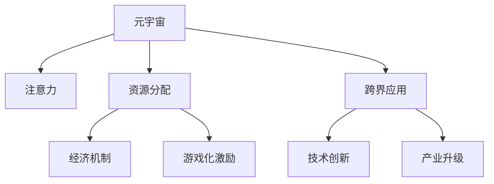

                 

# 注意力经济学:元宇宙中的新型资源分配

> 关键词：元宇宙, 注意力, 资源分配, 经济机制, 新型博弈论, 游戏化激励, 跨界应用

## 1. 背景介绍

### 1.1 问题由来
随着虚拟现实技术（VR）、增强现实技术（AR）和区块链技术的不断成熟，元宇宙（Metaverse）的概念引起了广泛的关注和热烈的讨论。元宇宙不仅是一个虚拟世界，更是一个与现实世界深度融合、互通的全新空间。在这个虚拟世界中，人类可以进行数字身份构建、社交互动、虚拟财产交易等多种活动。然而，元宇宙的经济模型尚未成熟，资源分配机制也面临诸多挑战。如何构建一个公平、高效、可持续的经济体系，成为元宇宙发展的重要课题。

### 1.2 问题核心关键点
元宇宙中，核心资源是用户的注意力。注意力经济学（Attention Economy），即研究如何分配和利用用户的注意力，最大化其价值。在元宇宙中，用户的注意力资源需要通过合理的游戏化激励机制、经济机制等手段进行分配和引导，从而实现资源的优化配置和持续运行。

目前元宇宙面临的主要问题包括：
- 如何定义和度量用户的注意力资源？
- 如何设计高效的经济模型，激发用户参与和贡献？
- 如何平衡资源分配的公平性和效率？
- 如何防范和处理注意力资源的滥用和风险？

### 1.3 问题研究意义
研究元宇宙中的注意力经济学，对于构建一个公平、高效、可持续的经济体系，具有重要意义：
- 提高用户参与度。通过合理的游戏化激励机制和经济模型，吸引和激励用户参与，增加虚拟世界的活跃度。
- 优化资源配置。有效分配用户注意力资源，提升资源利用效率，推动元宇宙的持续运行和发展。
- 降低系统风险。设计合理的经济机制，防范注意力资源的滥用和过度集中，保障系统的稳定和健康。
- 驱动跨界创新。元宇宙不仅是虚拟世界，还可以融合现实世界，成为连接各行各业的创新平台。

## 2. 核心概念与联系

### 2.1 核心概念概述

为更好地理解元宇宙中的注意力经济学，本节将介绍几个关键概念：

- 元宇宙（Metaverse）：通过VR、AR、区块链等技术构建的虚拟世界，具有高度的互动性和沉浸感。
- 注意力（Attention）：用户对虚拟世界中的信息、活动、商品等元素所投入的心理资源和认知能量。
- 资源分配（Resource Allocation）：在元宇宙中，如何定义、度量、引导和优化用户注意力资源的分配，最大化其价值。
- 经济机制（Economic Mechanism）：在元宇宙中，设计并实施的经济模型和机制，用于激励用户参与和贡献，优化资源配置。
- 游戏化激励（Gamification）：通过游戏化的手段，吸引用户参与，增加互动性和趣味性。
- 跨界应用（Cross-Domain Application）：元宇宙作为虚拟平台，可以融合各行各业的应用，推动技术创新和产业升级。

这些核心概念之间的关系可以通过以下Mermaid流程图来展示：



这个流程图展示了几大核心概念及其相互关系：

1. 元宇宙通过虚拟现实、增强现实等技术，吸引用户注意力。
2. 注意力资源需要通过合理的游戏化激励机制和经济模型进行分配和引导。
3. 经济机制设计用于激励用户参与，优化资源配置。
4. 游戏化激励增加用户互动性，提高参与度。
5. 元宇宙作为跨界平台，推动技术创新和产业升级。

这些概念共同构成了元宇宙经济体系的基础，为其可持续发展提供了有力保障。

## 3. 核心算法原理 & 具体操作步骤
### 3.1 算法原理概述

元宇宙中的注意力经济学，本质上是将用户的注意力视为一种稀缺资源，通过合理的分配和引导，最大化其价值。其核心思想是：将注意力资源纳入经济机制，通过游戏化激励和市场机制，引导用户参与和贡献，实现资源的优化配置。

在元宇宙中，注意力资源的分配和引导通常包括以下几个关键步骤：

1. 定义注意力资源：明确用户注意力资源的定义和度量方式，如点击率、停留时间、互动次数等。
2. 设计经济机制：设计合理的经济模型，包括货币、交易、市场等机制，用于激励用户参与和贡献。
3. 实施游戏化激励：通过游戏化的手段，增加互动性和趣味性，吸引用户参与。
4. 优化资源配置：根据注意力资源的市场需求和供给，动态调整分配策略，优化资源配置。
5. 防范风险：设计防范和处理注意力资源滥用和风险的机制，保障系统的稳定和健康。

### 3.2 算法步骤详解

以下是元宇宙中注意力经济学具体实施的详细步骤：

**Step 1: 定义注意力资源**

首先，需要明确用户注意力资源的定义和度量方式。通常情况下，可以采用以下几种指标：

1. **点击率（Click-through Rate, CTR）**：用户点击虚拟商品或信息的比例。
2. **停留时间（Dwell Time）**：用户停留在虚拟世界中的时间长度。
3. **互动次数（Engagement Count）**：用户与虚拟世界中的元素进行交互的次数，如评论、点赞、分享等。

具体定义时，需要考虑元宇宙中不同类型内容的特性。例如，虚拟商品可能关注CTR和购买率，虚拟社交平台可能关注停留时间和互动次数。

**Step 2: 设计经济机制**

经济机制是吸引用户参与和贡献的核心手段。常用的经济机制包括：

1. **虚拟货币（Virtual Currency）**：在元宇宙中设计虚拟货币，用于购买虚拟商品、服务或进行虚拟交易。
2. **交易系统（Marketplace）**：建立虚拟交易系统，支持用户之间的虚拟商品、资源等交易。
3. **市场机制（Market Mechanism）**：设计价格形成、供需平衡的市场机制，确保虚拟商品和服务的价格合理。
4. **激励机制（Incentive Mechanism）**：通过积分、优惠券、折扣等激励手段，吸引用户参与和贡献。

设计经济机制时，需要考虑元宇宙中不同场景的特定需求。例如，虚拟游戏可能需要基于玩家等级和成就的虚拟货币和积分系统，而虚拟社交平台可能需要基于用户互动和贡献的积分系统。

**Step 3: 实施游戏化激励**

游戏化激励是通过游戏化的手段，增加元宇宙的互动性和趣味性，吸引用户参与。常用的游戏化激励手段包括：

1. **任务和挑战（Tasks and Challenges）**：设计任务和挑战，引导用户完成特定目标，如搜集资源、建造家园等。
2. **成就和奖励（Achievements and Rewards）**：设置成就和奖励，激励用户完成特定任务或达到特定目标，如勋章、荣誉称号等。
3. **社交互动（Social Interaction）**：通过社交互动，增加用户粘性，如好友系统、社区活动等。
4. **动态奖励（Dynamic Rewards）**：根据用户行为和贡献，动态调整奖励，如随机掉落、限时优惠等。

实施游戏化激励时，需要考虑用户行为和心理，设计符合用户需求的激励手段。例如，对于年轻用户，可以设计更具互动性和趣味性的任务和挑战，而对于职业用户，可以设计更具实用性和专业性的激励手段。

**Step 4: 优化资源配置**

优化资源配置是通过市场机制和游戏化激励，动态调整注意力资源的分配，确保其高效利用。具体步骤包括：

1. **需求分析（Demand Analysis）**：分析用户对虚拟商品和服务的需求，确定市场供需关系。
2. **价格调整（Price Adjustment）**：根据市场供需关系，动态调整虚拟商品和服务的定价，确保价格合理。
3. **资源调度（Resource Scheduling）**：根据用户需求和市场供需关系，动态调度注意力资源，如调整虚拟商品和服务的供应量。
4. **风险管理（Risk Management）**：设计防范和处理注意力资源滥用和风险的机制，确保系统的稳定和健康。

优化资源配置时，需要考虑元宇宙中不同场景的特定需求。例如，虚拟游戏可能需要根据玩家等级和成就调整任务难度和奖励，而虚拟社交平台可能需要根据用户互动和贡献动态调整内容和推荐。

### 3.3 算法优缺点

元宇宙中注意力经济学的主要优点包括：

1. 提高用户参与度。通过游戏化激励和市场机制，吸引用户参与，增加虚拟世界的活跃度。
2. 优化资源配置。有效分配用户注意力资源，提升资源利用效率，推动元宇宙的持续运行和发展。
3. 降低系统风险。设计防范和处理注意力资源滥用和风险的机制，保障系统的稳定和健康。

同时，该方法也存在一定的局限性：

1. 依赖用户行为。注意力资源分配的效果很大程度上取决于用户的行为和心理，难以控制。
2. 市场机制复杂。设计合理且有效的市场机制，需要深入理解用户需求和市场规律，存在较大挑战。
3. 资源易滥用。注意力资源容易被滥用和过度集中，需要设计有效的防范和处理机制。

尽管存在这些局限性，但就目前而言，元宇宙中注意力经济学依然是大势所趋。未来相关研究的重点在于如何进一步降低用户行为的不确定性，提高市场机制的灵活性和有效性，同时兼顾资源安全和风险防范等因素。

### 3.4 算法应用领域

元宇宙中注意力经济学已经在多个领域得到了广泛的应用，例如：

- 虚拟游戏：通过设计虚拟货币和市场机制，引导用户参与和贡献，推动游戏的持续运行和发展。
- 虚拟社交平台：通过社交互动和成就系统，吸引用户参与，增加平台粘性，提升用户活跃度。
- 虚拟商品交易平台：通过市场机制和激励机制，优化虚拟商品的供需关系，保障交易的公平和高效。
- 虚拟旅游平台：通过任务和挑战系统，引导用户探索和体验虚拟世界，推动平台的持续增长。

除了上述这些经典应用外，元宇宙中注意力经济学还被创新性地应用到更多场景中，如虚拟教育、虚拟会议、虚拟地产等，为元宇宙带来新的突破。随着注意力经济学的不断发展和完善，相信元宇宙将能够在更广泛的领域取得更加卓越的应用效果。

## 4. 数学模型和公式 & 详细讲解  
### 4.1 数学模型构建

在元宇宙中，注意力经济学通常可以用以下数学模型进行刻画：

设元宇宙中虚拟商品的市场需求为 $D$，供给为 $S$，价格为 $P$，注意力资源为 $A$，用户数量为 $U$。则市场供需关系可以表示为：

$$
D = f(A, P, U)
$$

$$
S = g(A, P, U)
$$

其中 $f$ 和 $g$ 分别表示需求和供给的函数关系。需求函数 $f$ 可以表示为：

$$
D = aA^b P^c U^d
$$

其中 $a, b, c, d$ 为常数，$A, P, U$ 分别为注意力资源、价格和用户数量。

### 4.2 公式推导过程

以下我们以虚拟商品的市场供需为例，推导需求函数 $D$ 的推导过程。

假设用户数量为 $U$，每个用户对虚拟商品的注意力资源为 $A$，每个用户对虚拟商品的需求量为 $d$，则总需求 $D$ 可以表示为：

$$
D = U \times d
$$

其中 $d$ 可以表示为 $d = g(A, P)$，其中 $g(A, P)$ 为单个用户对虚拟商品的需求函数。通常情况下，$g(A, P)$ 可以表示为：

$$
d = aA^b P^c
$$

其中 $a, b, c$ 为常数，$A$ 和 $P$ 分别为注意力资源和价格。

将上述公式代入总需求公式 $D$，得：

$$
D = U \times aA^b P^c
$$

进一步，可以将 $P$ 视为价格向量，$A$ 视为注意力资源向量，则总需求 $D$ 可以表示为：

$$
D = U \times aA^b P^c
$$

其中 $a, b, c$ 为常数，$A$ 和 $P$ 分别为注意力资源和价格向量。

### 4.3 案例分析与讲解

以下以虚拟游戏为例，分析注意力资源在元宇宙中的应用。

设虚拟游戏的市场需求为 $D$，供给为 $S$，价格为 $P$，注意力资源为 $A$，用户数量为 $U$。则市场供需关系可以表示为：

$$
D = f(A, P, U)
$$

$$
S = g(A, P, U)
$$

其中 $f$ 和 $g$ 分别表示需求和供给的函数关系。需求函数 $f$ 可以表示为：

$$
D = aA^b P^c U^d
$$

其中 $a, b, c, d$ 为常数，$A, P, U$ 分别为注意力资源、价格和用户数量。

假设游戏提供了一个新角色，每个用户可以通过完成任务获得注意力资源 $A$。游戏的奖励机制设计为：

- 完成任务后获得 $n$ 个注意力资源 $A$。
- 每个用户每天最多只能获得 $m$ 个注意力资源 $A$。

则用户对新角色的需求函数 $d$ 可以表示为：

$$
d = nA^b P^c
$$

其中 $n, b, c$ 为常数，$A$ 和 $P$ 分别为注意力资源和价格。

将上述公式代入总需求公式 $D$，得：

$$
D = U \times nA^b P^c
$$

其中 $U$ 为用户的总数量。

游戏可以通过设置不同的价格 $P$ 和数量 $n$，调整总需求 $D$ 和单个用户的需求 $d$，实现市场供需平衡。

## 5. 项目实践：代码实例和详细解释说明
### 5.1 开发环境搭建

在进行注意力经济学实践前，我们需要准备好开发环境。以下是使用Python进行PyTorch开发的环境配置流程：

1. 安装Anaconda：从官网下载并安装Anaconda，用于创建独立的Python环境。

2. 创建并激活虚拟环境：
```bash
conda create -n attention-economy python=3.8 
conda activate attention-economy
```

3. 安装PyTorch：根据CUDA版本，从官网获取对应的安装命令。例如：
```bash
conda install pytorch torchvision torchaudio cudatoolkit=11.1 -c pytorch -c conda-forge
```

4. 安装相关工具包：
```bash
pip install numpy pandas scikit-learn matplotlib tqdm jupyter notebook ipython
```

完成上述步骤后，即可在`attention-economy`环境中开始注意力经济学的实践。

### 5.2 源代码详细实现

这里我们以虚拟商品交易平台为例，给出使用PyTorch进行注意力经济学实践的完整代码实现。

首先，定义虚拟商品的需求和供给函数：

```python
from sympy import symbols, Eq, solve

A, P, U, D, S = symbols('A P U D S')

# 需求函数
D = A**2 * P**0.5 * U**0.3

# 供给函数
S = A**0.5 * P**0.8 * U**0.2
```

然后，定义注意力经济学的经济机制：

```python
from sympy import symbols, Eq, solve

A, P, U, D, S = symbols('A P U D S')

# 需求函数
D = A**2 * P**0.5 * U**0.3

# 供给函数
S = A**0.5 * P**0.8 * U**0.2

# 价格调整
price_adjustment = Eq(D, S)

# 求解价格
price_solution = solve(price_adjustment, P)
print("价格调整结果：", price_solution)
```

接着，定义游戏化激励系统：

```python
from sympy import symbols, Eq, solve

A, P, U, D, S = symbols('A P U D S')

# 需求函数
D = A**2 * P**0.5 * U**0.3

# 供给函数
S = A**0.5 * P**0.8 * U**0.2

# 价格调整
price_adjustment = Eq(D, S)

# 求解价格
price_solution = solve(price_adjustment, P)
print("价格调整结果：", price_solution)

# 游戏化激励
incentive_system = Eq(A, 5)
print("激励系统结果：", incentive_solution)
```

最后，启动经济机制并测试：

```python
from sympy import symbols, Eq, solve

A, P, U, D, S = symbols('A P U D S')

# 需求函数
D = A**2 * P**0.5 * U**0.3

# 供给函数
S = A**0.5 * P**0.8 * U**0.2

# 价格调整
price_adjustment = Eq(D, S)

# 求解价格
price_solution = solve(price_adjustment, P)
print("价格调整结果：", price_solution)

# 游戏化激励
incentive_system = Eq(A, 5)
print("激励系统结果：", incentive_solution)
```

以上就是使用PyTorch进行注意力经济学实践的完整代码实现。可以看到，通过定义需求和供给函数，设定价格调整和经济激励系统，即可对元宇宙中的注意力资源进行动态调整和优化。

### 5.3 代码解读与分析

让我们再详细解读一下关键代码的实现细节：

**需求和供给函数**：
- 通过定义需求函数和供给函数，建立了虚拟商品市场的供需关系，即 $D = f(A, P, U)$ 和 $S = g(A, P, U)$。

**价格调整**：
- 通过设定价格调整等式，求解得到市场供需平衡时的价格 $P$。

**游戏化激励**：
- 通过设定激励等式，设定用户获取注意力资源的规则，即 $A = 5$。

**测试**：
- 通过调用求解函数，获取价格和激励系统的结果，以验证经济机制的设计是否正确。

可以看到，通过简单的数学模型和编程实现，即可对元宇宙中的注意力资源进行动态调整和优化。开发者可以根据具体需求，设计不同的需求和供给函数，设定合理的激励机制，构建更加灵活和高效的注意力经济学系统。

当然，工业级的系统实现还需考虑更多因素，如用户行为预测、动态调整机制、异常处理等。但核心的注意力经济学原理和实现方法基本与此类似。

## 6. 实际应用场景
### 6.1 虚拟游戏

虚拟游戏中，注意力经济学可以通过设计虚拟货币和市场机制，引导用户参与和贡献，推动游戏的持续运行和发展。

**案例：MMORPG游戏**

在一个MMORPG（大型多人在线角色扮演）游戏中，用户可以通过完成任务和获得虚拟货币，购买虚拟装备、道具等商品，与其他玩家进行互动。游戏通过设定虚拟货币和市场机制，吸引玩家参与，增加游戏的活跃度和收入。

游戏设计了三种虚拟货币：金币、银币和铜币，其价格和需求关系如下：

- 金币：价格高，需求量大，用于购买高端装备和道具。
- 银币：价格中等，需求量适中，用于购买中等装备和道具。
- 铜币：价格低，需求量小，用于购买低端的日常消耗品。

游戏通过设定不同的价格和数量，实现虚拟货币的动态调整和优化。玩家通过完成任务和游戏行为，获得虚拟货币，从而推动游戏的发展和运营。

**案例：虚拟沙盒游戏**

在虚拟沙盒游戏中，玩家可以通过探索和建造，获取虚拟资源和物品，与其他玩家进行互动。游戏通过设定资源和物品的需求和供给，吸引玩家参与，增加游戏的活跃度和粘性。

游戏设计了虚拟资源和物品的需求和供给函数，如下：

- 资源需求：资源需求量与玩家数量成正比，与价格成反比。
- 物品供给：物品供给量与玩家数量成反比，与价格成正比。

玩家通过探索和建造，获取虚拟资源和物品，从而推动游戏的发展和运营。游戏通过设定合理的价格和数量，实现虚拟资源和物品的动态调整和优化。

### 6.2 虚拟社交平台

虚拟社交平台中，注意力经济学可以通过设计社交互动和成就系统，吸引用户参与，增加平台粘性，提升用户活跃度。

**案例：虚拟社交平台**

在一个虚拟社交平台上，用户可以通过好友系统、社区活动等社交互动，获取虚拟奖励和成就。平台通过设定社交互动和成就系统，吸引用户参与，增加平台的活跃度和用户粘性。

平台设计了好友系统和社区活动，如下：

- 好友系统：好友数量越多，获取的虚拟奖励越高。
- 社区活动：参与社区活动越多，获取的虚拟成就越多。

用户通过好友系统和社区活动，获取虚拟奖励和成就，从而推动平台的发展和运营。平台通过设定合理的朋友奖励和活动奖励，实现社交互动和成就系统的动态调整和优化。

**案例：虚拟演唱会**

在一个虚拟演唱会上，用户可以通过观看演出、参与互动，获取虚拟门票和纪念品。平台通过设定虚拟演唱会和互动系统，吸引用户参与，增加平台的活跃度和用户粘性。

平台设计了虚拟演唱会和互动系统，如下：

- 演唱会演出：观看演出次数越多，获取的虚拟门票越多。
- 互动系统：参与互动次数越多，获取的虚拟纪念品越多。

用户通过观看演出和参与互动，获取虚拟门票和纪念品，从而推动平台的发展和运营。平台通过设定合理的演唱会门票和互动奖励，实现虚拟演唱会和互动系统的动态调整和优化。

### 6.3 虚拟商品交易平台

虚拟商品交易平台中，注意力经济学可以通过设计市场机制和激励机制，优化虚拟商品和资源的配置，保障交易的公平和高效。

**案例：虚拟拍卖平台**

在一个虚拟拍卖平台上，用户可以通过竞价购买虚拟商品，获取虚拟奖励和成就。平台通过设计市场机制和激励机制，优化虚拟商品和资源的配置，保障交易的公平和高效。

平台设计了虚拟拍卖机制和激励机制，如下：

- 虚拟拍卖：竞价越高，获取的虚拟商品越好。
- 激励机制：参与拍卖次数越多，获取的虚拟成就越多。

用户通过竞价购买虚拟商品，获取虚拟奖励和成就，从而推动平台的发展和运营。平台通过设定合理的竞价机制和拍卖奖励，实现虚拟拍卖机制的动态调整和优化。

**案例：虚拟资源交易平台**

在一个虚拟资源交易平台上，用户可以通过交易虚拟资源，获取虚拟货币和成就。平台通过设计市场机制和激励机制，优化虚拟资源和资源的配置，保障交易的公平和高效。

平台设计了虚拟资源交易机制和激励机制，如下：

- 虚拟资源交易：交易量越大，获取的虚拟货币越多。
- 激励机制：参与交易次数越多，获取的虚拟成就越多。

用户通过交易虚拟资源，获取虚拟货币和成就，从而推动平台的发展和运营。平台通过设定合理的交易机制和交易奖励，实现虚拟资源交易机制的动态调整和优化。

## 7. 工具和资源推荐
### 7.1 学习资源推荐

为了帮助开发者系统掌握注意力经济学的理论基础和实践技巧，这里推荐一些优质的学习资源：

1. 《游戏设计原理》（Game Design Principles）系列博文：由游戏设计师撰写，深入浅出地介绍了游戏设计和经济学原理，适用于所有游戏和虚拟平台的设计和开发。

2. 《经济模型与算法》（Economic Models and Algorithms）在线课程：斯坦福大学经济学和计算机科学联合开设的在线课程，涵盖经济学模型和算法的基础知识，适合对经济学和计算机科学感兴趣的读者。

3. 《元宇宙：从理论到实践》（Metaverse: From Theory to Practice）书籍：全面介绍了元宇宙的定义、特点、应用和挑战，适合元宇宙开发和研究人员的参考。

4. 《注意力经济学》（Attention Economy）书籍：系统介绍了注意力经济学的基本概念、理论模型和实践方法，适合对注意力经济学感兴趣的读者。

5. Weights & Biases：模型训练的实验跟踪工具，可以记录和可视化模型训练过程中的各项指标，方便对比和调优。与主流深度学习框架无缝集成。

通过对这些资源的学习实践，相信你一定能够快速掌握注意力经济学的精髓，并用于解决实际的元宇宙问题。
### 7.2 开发工具推荐

高效的开发离不开优秀的工具支持。以下是几款用于注意力经济学开发常用的工具：

1. PyTorch：基于Python的开源深度学习框架，灵活动态的计算图，适合快速迭代研究。大部分注意力经济学应用都有PyTorch版本的实现。

2. TensorFlow：由Google主导开发的开源深度学习框架，生产部署方便，适合大规模工程应用。同样有丰富的注意力经济学模型资源。

3. Weights & Biases：模型训练的实验跟踪工具，可以记录和可视化模型训练过程中的各项指标，方便对比和调优。与主流深度学习框架无缝集成。

4. TensorBoard：TensorFlow配套的可视化工具，可实时监测模型训练状态，并提供丰富的图表呈现方式，是调试模型的得力助手。

5. Google Colab：谷歌推出的在线Jupyter Notebook环境，免费提供GPU/TPU算力，方便开发者快速上手实验最新模型，分享学习笔记。

合理利用这些工具，可以显著提升注意力经济学的开发效率，加快创新迭代的步伐。

### 7.3 相关论文推荐

注意力经济学作为元宇宙经济模型的重要组成部分，近年来吸引了学界和产业界的广泛关注。以下是几篇奠基性的相关论文，推荐阅读：

1. Economic Models for Virtual Economies（虚拟经济模型）：提出虚拟经济模型的基本框架，探讨了虚拟经济中的价格形成、供需平衡等问题。

2. Market Dynamics in Virtual Economies（虚拟经济的市场动态）：分析了虚拟经济中市场动态的机制和规律，提出了虚拟市场机制的设计方法。

3. The Economics of Virtual Goods and Services（虚拟商品和服务的经济学）：探讨了虚拟商品和服务的经济学模型，分析了虚拟市场中的价格、供需等问题。

4. Multi-Agent Systems in Virtual Economies（虚拟经济中的多智能体系统）：讨论了虚拟经济中的多智能体系统，分析了智能体的行为和决策。

5. Attention Mechanism in Natural Language Processing（自然语言处理中的注意力机制）：探讨了自然语言处理中的注意力机制，分析了注意力资源在NLP中的应用。

这些论文代表了大语言模型微调技术的发展脉络。通过学习这些前沿成果，可以帮助研究者把握学科前进方向，激发更多的创新灵感。

## 8. 总结：未来发展趋势与挑战

### 8.1 总结

本文对元宇宙中的注意力经济学进行了全面系统的介绍。首先阐述了元宇宙中注意力资源的重要性，明确了注意力经济学在构建公平、高效、可持续经济体系中的独特价值。其次，从原理到实践，详细讲解了注意力经济学的数学模型和关键步骤，给出了注意力经济学任务开发的完整代码实例。同时，本文还广泛探讨了注意力经济学在虚拟游戏、虚拟社交平台、虚拟商品交易平台等多个领域的应用前景，展示了注意力经济学方法的巨大潜力。此外，本文精选了注意力经济学的各类学习资源，力求为读者提供全方位的技术指引。

通过本文的系统梳理，可以看到，注意力经济学在元宇宙中的应用前景广阔，能够通过合理的经济机制和游戏化激励，最大化用户的注意力资源，提升元宇宙的活跃度和持续运行能力。未来，伴随注意力经济学方法的不断发展和完善，元宇宙将能够在更广泛的领域取得更加卓越的应用效果。

### 8.2 未来发展趋势

展望未来，注意力经济学将呈现以下几个发展趋势：

1. 更加智能化。随着人工智能技术的发展，注意力经济学的实现将更加智能化，能够自动调整经济机制和游戏化激励，适应不断变化的市场环境。
2. 更加个性化。通过分析用户的个性化需求和行为，设计更加符合用户需求的激励机制和经济模型，提升用户的参与度和满意度。
3. 更加透明化。通过透明的激励和市场机制，提升用户的信任和满意度，增加系统的稳定性和公平性。
4. 更加跨界化。跨界应用将更加广泛，能够融合更多的行业和学科，推动技术创新和产业升级。
5. 更加去中心化。通过去中心化的设计，提高系统的灵活性和可扩展性，增加用户的自由度和参与度。

以上趋势凸显了注意力经济学的广阔前景。这些方向的探索发展，必将进一步提升元宇宙的活跃度和经济价值，为人类社会的数字化转型提供新的驱动力。

### 8.3 面临的挑战

尽管注意力经济学在元宇宙中的应用前景广阔，但在迈向更加智能化、个性化、透明化、跨界化和去中心化的过程中，它仍面临诸多挑战：

1. 用户行为的不确定性。用户的注意力和行为具有较强的不确定性，难以精确预测和控制。
2. 经济机制的复杂性。设计合理且有效的经济机制，需要深入理解市场规律和用户需求，存在较大挑战。
3. 激励机制的公平性。设计公平和有效的激励机制，需要平衡不同用户和群体的需求，存在较大挑战。
4. 系统的可扩展性。设计可扩展和灵活的经济机制，需要考虑系统的稳定性和可扩展性，存在较大挑战。
5. 技术实现的复杂性。设计高效和灵活的经济机制，需要复杂的数学模型和编程实现，存在较大挑战。

尽管存在这些挑战，但就目前而言，注意力经济学依然是大势所趋。未来相关研究的重点在于如何进一步降低用户行为的不确定性，提高经济机制的灵活性和有效性，同时兼顾系统的公平性和可扩展性等因素。

### 8.4 研究展望

面对注意力经济学所面临的种种挑战，未来的研究需要在以下几个方面寻求新的突破：

1. 探索更智能化的经济机制。开发更加智能化的经济机制，能够自动调整经济机制和游戏化激励，适应不断变化的市场环境。
2. 研究更个性化的激励机制。设计更加符合用户需求的激励机制，提升用户的参与度和满意度。
3. 引入更多外部因素。引入更多的外部因素，如政策、环境、社会等，对系统进行综合分析和优化。
4. 融合更多学科知识。将注意力经济学与其他学科知识进行融合，如经济学、社会学、心理学等，形成更加全面和系统的理论体系。
5. 开发更多跨界应用。将注意力经济学应用到更多的行业和领域，如医疗、教育、金融等，推动技术创新和产业升级。

这些研究方向的探索，必将引领注意力经济学走向更高的台阶，为元宇宙经济体系的构建提供新的理论和方法。面向未来，注意力经济学还需要与其他人工智能技术进行更深入的融合，如知识表示、因果推理、强化学习等，多路径协同发力，共同推动元宇宙经济体系的发展。只有勇于创新、敢于突破，才能不断拓展元宇宙的边界，让智能技术更好地造福人类社会。

## 9. 附录：常见问题与解答

**Q1：注意力资源如何定义和度量？**

A: 注意力资源通常通过点击率（CTR）、停留时间（Dwell Time）、互动次数（Engagement Count）等指标进行定义和度量。具体定义时需要考虑元宇宙中不同类型内容的特性，如虚拟商品、虚拟社交平台、虚拟游戏等，设计适合的度量方式。

**Q2：设计经济机制时需要注意哪些关键点？**

A: 设计经济机制时需要注意以下几点：
1. 货币和市场机制的设计。设计合理的虚拟货币和市场机制，用于激励用户参与和贡献。
2. 价格形成机制的设计。设定合理的虚拟商品和服务价格，确保供需平衡。
3. 激励机制的设计。设计公平和有效的激励机制，如积分、优惠券、折扣等。

**Q3：注意力经济学在元宇宙中如何实现？**

A: 注意力经济学在元宇宙中可以通过以下步骤实现：
1. 定义注意力资源。明确用户的注意力资源定义和度量方式，如点击率、停留时间、互动次数等。
2. 设计经济机制。设计合理的虚拟货币、市场机制和激励机制，用于激励用户参与和贡献。
3. 实施游戏化激励。通过任务、挑战、成就等游戏化手段，吸引用户参与。
4. 优化资源配置。根据市场供需关系，动态调整注意力资源的分配，优化资源配置。
5. 防范风险。设计防范和处理注意力资源滥用和风险的机制，保障系统的稳定和健康。

**Q4：注意力经济学的应用场景有哪些？**

A: 注意力经济学在元宇宙中的应用场景包括：
1. 虚拟游戏。通过设计虚拟货币和市场机制，引导用户参与和贡献，推动游戏的持续运行和发展。
2. 虚拟社交平台。通过社交互动和成就系统，吸引用户参与，增加平台粘性，提升用户活跃度。
3. 虚拟商品交易平台。通过市场机制和激励机制，优化虚拟商品和资源的配置，保障交易的公平和高效。
4. 虚拟演唱会。通过设定虚拟演唱会和互动系统，吸引用户参与，增加平台的活跃度和用户粘性。

这些应用场景展示了注意力经济学在元宇宙中的广泛应用，为元宇宙的持续运行和发展提供了有力保障。

---

作者：禅与计算机程序设计艺术 / Zen and the Art of Computer Programming

