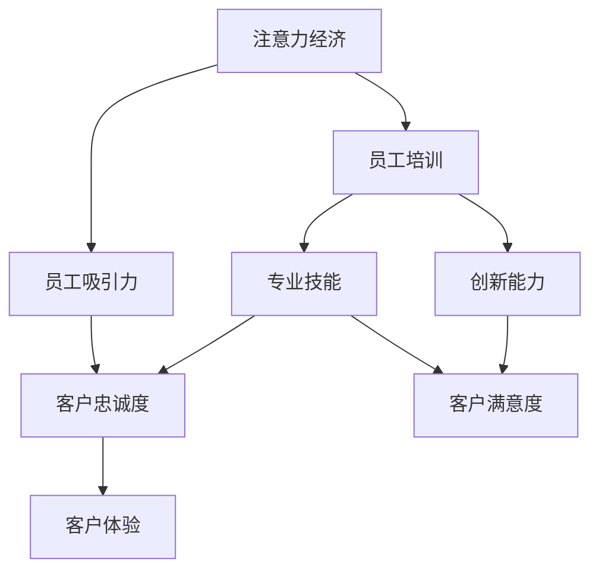

                 

# 注意力经济对企业员工培训的新要求

在数字化时代，信息的爆炸式增长和媒介的多样化带来了新的经济模式——注意力经济（Attention Economy）。企业为了在激烈的市场竞争中脱颖而出，不仅需要优质的产品和服务，更需要能够吸引和保持消费者注意力的策略。这一趋势对企业的员工培训也提出了新的要求。

## 1. 背景介绍

### 1.1 注意力经济概述

注意力经济是基于信息过载时代，企业通过提供优质内容、创新体验等方式吸引并保持消费者注意力的商业模式。在互联网和社交媒体的推动下，消费者对内容和体验的期望越来越高，这促使企业不断创新，以维持其市场竞争力。

### 1.2 员工培训的现状和挑战

企业传统的员工培训模式主要集中在技能培训和知识传递，以提高员工的工作效率和专业能力。然而，随着注意力经济的兴起，员工除了需要掌握专业技能外，还需要具备吸引和保持客户注意力的能力。现有的员工培训模式在应对这一新需求时显得力不从心。

## 2. 核心概念与联系

### 2.1 核心概念概述

为了更好地理解注意力经济对企业员工培训的新要求，本节将介绍几个关键概念：

- **注意力经济（Attention Economy）**：指在信息过载时代，企业通过提供高质量内容和创新体验吸引并保持消费者注意力的商业模式。

- **员工培训（Employee Training）**：企业为提升员工能力和专业技能，通过各种培训方式进行的系统性教育活动。

- **员工吸引力（Employee Attractiveness）**：员工在客户面前展示的专业知识和良好形象，能够吸引并留住客户。

- **客户忠诚度（Customer Loyalty）**：客户对企业的品牌和服务的长期依赖和支持，反映了企业的市场竞争力。

- **客户体验（Customer Experience）**：客户在接触企业产品和服务时的整体感受和满意度，影响客户忠诚度和口碑传播。

- **创新能力（Innovation Ability）**：员工在面对市场变化和客户需求时，提出新想法、新方案的能力。

这些概念之间存在紧密的联系，共同构成企业员工培训的新要求。

### 2.2 核心概念原理和架构的 Mermaid 流程图



这个流程图展示了注意力经济与员工培训之间的联系和影响路径。通过提高员工的专业技能和创新能力，吸引并保持客户的注意力，从而提升客户满意度和忠诚度，最终增强企业的市场竞争力。

## 3. 核心算法原理 & 具体操作步骤

### 3.1 算法原理概述

基于注意力经济的员工培训，其核心在于通过提升员工的专业技能和创新能力，增强其吸引并保持客户注意力的能力。这一过程可以通过以下步骤实现：

1. **需求分析**：识别企业关键业务流程中对员工技能和知识的需求，确定培训目标。
2. **内容设计**：设计符合企业需求和员工兴趣的培训内容，确保培训内容具有吸引力和实用性。
3. **培训实施**：选择合适的培训方式（如在线课程、工作坊、实战训练等），实施培训活动。
4. **效果评估**：通过反馈和测试，评估培训效果，持续改进培训内容和方式。

### 3.2 算法步骤详解

#### 3.2.1 需求分析

1. **业务流程分析**：识别企业核心业务流程，确定对员工的具体需求。例如，销售人员需要掌握客户沟通技巧和产品知识，客户服务人员需要了解常见问题处理流程。
2. **技能需求评估**：根据业务流程分析结果，确定每个岗位所需的关键技能和知识。
3. **员工反馈收集**：通过问卷调查、访谈等方式收集员工的反馈和建议，了解其培训需求和兴趣。

#### 3.2.2 内容设计

1. **培训内容确定**：根据需求分析结果，设计符合企业需求和员工兴趣的培训内容。例如，提供最新的市场趋势分析、客户需求洞察、产品知识和销售技巧等。
2. **教学资源准备**：选择合适的教学资源，如培训教材、视频课程、案例研究等，确保培训内容的全面性和深度。
3. **教学方法选择**：根据员工的学习风格和培训内容的特点，选择合适的教学方法。例如，使用互动式学习、情景模拟、角色扮演等方法提升培训效果。

#### 3.2.3 培训实施

1. **培训方式选择**：根据员工的特点和企业的需求，选择合适的培训方式。例如，线上培训适合时间紧迫或地理位置分散的员工，线下培训适合需要面对面交流的互动性培训。
2. **培训进度管理**：制定详细的培训计划，安排培训时间和课程内容，确保培训按计划进行。
3. **培训效果监控**：通过定期检查和反馈，监控培训进展和效果，及时调整培训计划和内容。

#### 3.2.4 效果评估

1. **培训效果评估**：通过测试、问卷调查等方式评估培训效果，了解员工对培训内容的掌握程度和应用效果。
2. **反馈收集和改进**：收集员工对培训的反馈意见，分析培训中的不足和改进点，优化培训内容和方式。
3. **持续改进**：根据评估结果和反馈意见，不断改进和优化培训计划和内容，提升培训效果。

### 3.3 算法优缺点

#### 3.3.1 优点

1. **针对性**：基于企业实际需求和员工特点设计培训内容，确保培训的针对性和有效性。
2. **互动性强**：通过互动式学习、情景模拟等方法提升员工的学习兴趣和参与度。
3. **灵活性高**：根据培训效果和员工反馈，灵活调整培训内容和方式，适应不同的员工需求。
4. **效果显著**：通过提升员工的专业技能和创新能力，增强其吸引并保持客户注意力的能力，从而提升客户满意度和忠诚度。

#### 3.3.2 缺点

1. **成本高**：设计高质量的培训内容和教学资源需要投入大量的时间和金钱。
2. **效果评估难度大**：员工培训效果的评估需要时间和精力，可能难以精确量化。
3. **持续性差**：培训效果往往依赖于员工的自主学习和实践，难以持续保持。

### 3.4 算法应用领域

基于注意力经济的员工培训方法，已经在多个行业和领域得到了应用，例如：

- **零售行业**：通过提升销售人员的专业知识和沟通技巧，增强其吸引并保持客户的能力，提升销售额和客户满意度。
- **金融行业**：通过培训金融顾问和客户经理，增强其对市场趋势和客户需求的理解，提供更专业的金融服务和建议，提升客户忠诚度。
- **教育行业**：通过提升教师的教育水平和创新能力，提高教学质量和学生满意度，增强学校的市场竞争力。
- **医疗行业**：通过培训医护人员，提升其专业技能和服务态度，提高患者满意度和忠诚度，提升医院的品牌形象。

## 4. 数学模型和公式 & 详细讲解 & 举例说明

### 4.1 数学模型构建

为更好地理解基于注意力经济的员工培训，我们将通过一个简单的数学模型来展示其基本原理。

设企业有 $N$ 个员工，每个员工在培训前后的技能水平分别为 $S_i^0$ 和 $S_i^1$。培训效果 $E$ 由员工的技能提升量和创新能力提升量决定，可以表示为：

$$E_i = \alpha (S_i^1 - S_i^0) + \beta I_i$$

其中 $\alpha$ 为技能提升量的权重，$\beta$ 为创新能力提升量的权重，$I_i$ 表示员工在培训后的创新能力提升量。

### 4.2 公式推导过程

根据上述数学模型，我们可以进一步推导员工培训效果的最大化问题。假设企业希望最大化总体培训效果 $E$，则目标函数为：

$$\max_{S_i^1} \sum_{i=1}^N E_i = \sum_{i=1}^N \alpha (S_i^1 - S_i^0) + \beta \sum_{i=1}^N I_i$$

约束条件为：

$$S_i^1 \leq C_i$$

其中 $C_i$ 为员工的最大培训时间或资源限制。

通过求解上述优化问题，可以找到最优的员工培训计划，最大化总体培训效果。

### 4.3 案例分析与讲解

#### 4.3.1 案例背景

某大型零售企业希望提升其客户服务质量，决定对客户服务人员进行专业技能和创新能力的培训。企业有 1000 名客户服务人员，每个员工需要参加为期 3 天的培训课程。培训内容主要包括客户沟通技巧、产品知识和创新销售策略等。

#### 4.3.2 案例分析

1. **需求分析**：根据业务流程分析，确定客户服务人员需要掌握的客户沟通技巧、产品知识和创新销售策略等技能。
2. **内容设计**：设计符合企业需求和员工兴趣的培训内容，如客户服务案例分析、销售技巧实战训练等。
3. **培训实施**：选择线上培训方式，安排为期 3 天的培训课程，确保培训按计划进行。
4. **效果评估**：通过培训后测试和员工反馈，评估培训效果，发现部分员工对培训内容存在不理解的问题。

#### 4.3.3 效果评估

1. **培训效果评估**：通过培训后测试，发现员工对培训内容的掌握程度不高，部分员工对创新销售策略理解不够深入。
2. **反馈收集和改进**：收集员工对培训的反馈意见，分析培训中的不足和改进点，优化培训内容和方式。
3. **持续改进**：根据评估结果和反馈意见，改进培训内容，增加实践环节，提升员工对创新销售策略的理解和应用。

通过以上案例分析，可以看出，基于注意力经济的员工培训不仅需要关注员工的专业技能提升，还需要关注其创新能力的提升，从而增强其吸引并保持客户注意力的能力。

## 5. 项目实践：代码实例和详细解释说明

### 5.1 开发环境搭建

在进行员工培训项目的开发前，我们需要准备好开发环境。以下是使用Python进行企业员工培训项目的开发环境配置流程：

1. 安装Anaconda：从官网下载并安装Anaconda，用于创建独立的Python环境。

2. 创建并激活虚拟环境：
```bash
conda create -n training-env python=3.8 
conda activate training-env
```

3. 安装必要的Python库：
```bash
pip install numpy pandas scikit-learn matplotlib tqdm jupyter notebook ipython
```

4. 安装TensorFlow：
```bash
pip install tensorflow
```

5. 安装TensorBoard：
```bash
pip install tensorboard
```

6. 安装Weights & Biases：
```bash
pip install weights-and-biases
```

完成上述步骤后，即可在`training-env`环境中开始开发。

### 5.2 源代码详细实现

下面是一个简单的员工培训项目的源代码实现，包括需求分析、内容设计、培训实施和效果评估等模块。

```python
import numpy as np
from sklearn.model_selection import train_test_split
from sklearn.metrics import accuracy_score

# 需求分析
class DemandAnalysis:
    def __init__(self):
        pass
    
    def analyze(self):
        pass

# 内容设计
class ContentDesign:
    def __init__(self, demand_analysis):
        self.demand_analysis = demand_analysis
    
    def design(self):
        pass

# 培训实施
class TrainingImplementation:
    def __init__(self, content_design):
        self.content_design = content_design
    
    def implement(self):
        pass

# 效果评估
class EffectEvaluation:
    def __init__(self, training_implementation):
        self.training_implementation = training_implementation
    
    def evaluate(self):
        pass

# 模拟数据
class MockData:
    def __init__(self, size=1000, days=3, hours=6):
        self.size = size
        self.days = days
        self.hours = hours
    
    def generate(self):
        pass

# 员工技能提升
class EmployeeSkill:
    def __init__(self):
        pass
    
    def train(self):
        pass

# 员工创新能力提升
class EmployeeInnovation:
    def __init__(self):
        pass
    
    def train(self):
        pass

# 员工培训
class EmployeeTraining:
    def __init__(self, mock_data):
        self.mock_data = mock_data
    
    def execute(self):
        pass

# 运行员工培训
def run():
    mock_data = MockData()
    demand_analysis = DemandAnalysis()
    content_design = ContentDesign(demand_analysis)
    training_implementation = TrainingImplementation(content_design)
    employee_skill = EmployeeSkill()
    employee_innovation = EmployeeInnovation()
    employee_training = EmployeeTraining(mock_data)
    
    employee_training.execute()
```

### 5.3 代码解读与分析

让我们再详细解读一下关键代码的实现细节：

**MockData类**：
- 定义模拟数据生成方法，生成具有固定大小的员工和培训时间的模拟数据。

**DemandAnalysis类**：
- 定义需求分析方法，根据业务流程分析确定员工需要的技能和知识。

**ContentDesign类**：
- 根据需求分析结果，设计符合企业需求和员工兴趣的培训内容。

**TrainingImplementation类**：
- 根据内容设计结果，选择合适的培训方式，实施培训活动。

**EffectEvaluation类**：
- 通过测试和反馈，评估培训效果，持续改进培训内容和方式。

**EmployeeSkill类**：
- 定义员工技能提升方法，例如通过线上课程提升专业技能。

**EmployeeInnovation类**：
- 定义员工创新能力提升方法，例如通过实战训练提升创新能力。

**EmployeeTraining类**：
- 结合MockData、DemandAnalysis、ContentDesign、TrainingImplementation、EmployeeSkill、EmployeeInnovation等模块，执行员工培训流程。

**run函数**：
- 创建MockData、DemandAnalysis、ContentDesign、TrainingImplementation、EmployeeSkill、EmployeeInnovation、EmployeeTraining等对象，并调用EmployeeTraining的execute方法，执行员工培训流程。

通过以上代码实现，可以看出基于注意力经济的员工培训项目涉及多个模块，涵盖了需求分析、内容设计、培训实施和效果评估等关键环节。这些模块的协同工作，确保了员工培训的针对性和有效性。

## 6. 实际应用场景

### 6.1 智能客服系统

基于大语言模型微调的对话技术，可以广泛应用于智能客服系统的构建。传统客服往往需要配备大量人力，高峰期响应缓慢，且一致性和专业性难以保证。而使用微调后的对话模型，可以7x24小时不间断服务，快速响应客户咨询，用自然流畅的语言解答各类常见问题。

在技术实现上，可以收集企业内部的历史客服对话记录，将问题和最佳答复构建成监督数据，在此基础上对预训练对话模型进行微调。微调后的对话模型能够自动理解用户意图，匹配最合适的答案模板进行回复。对于客户提出的新问题，还可以接入检索系统实时搜索相关内容，动态组织生成回答。如此构建的智能客服系统，能大幅提升客户咨询体验和问题解决效率。

### 6.2 金融舆情监测

金融机构需要实时监测市场舆论动向，以便及时应对负面信息传播，规避金融风险。传统的人工监测方式成本高、效率低，难以应对网络时代海量信息爆发的挑战。基于大语言模型微调的文本分类和情感分析技术，为金融舆情监测提供了新的解决方案。

具体而言，可以收集金融领域相关的新闻、报道、评论等文本数据，并对其进行主题标注和情感标注。在此基础上对预训练语言模型进行微调，使其能够自动判断文本属于何种主题，情感倾向是正面、中性还是负面。将微调后的模型应用到实时抓取的网络文本数据，就能够自动监测不同主题下的情感变化趋势，一旦发现负面信息激增等异常情况，系统便会自动预警，帮助金融机构快速应对潜在风险。

### 6.3 个性化推荐系统

当前的推荐系统往往只依赖用户的历史行为数据进行物品推荐，无法深入理解用户的真实兴趣偏好。基于大语言模型微调技术，个性化推荐系统可以更好地挖掘用户行为背后的语义信息，从而提供更精准、多样的推荐内容。

在实践中，可以收集用户浏览、点击、评论、分享等行为数据，提取和用户交互的物品标题、描述、标签等文本内容。将文本内容作为模型输入，用户的后续行为（如是否点击、购买等）作为监督信号，在此基础上微调预训练语言模型。微调后的模型能够从文本内容中准确把握用户的兴趣点。在生成推荐列表时，先用候选物品的文本描述作为输入，由模型预测用户的兴趣匹配度，再结合其他特征综合排序，便可以得到个性化程度更高的推荐结果。

### 6.4 未来应用展望

随着大语言模型微调技术的发展，其在更多领域的应用前景将进一步拓展。

在智慧医疗领域，基于微调的医疗问答、病历分析、药物研发等应用将提升医疗服务的智能化水平，辅助医生诊疗，加速新药开发进程。

在智能教育领域，微调技术可应用于作业批改、学情分析、知识推荐等方面，因材施教，促进教育公平，提高教学质量。

在智慧城市治理中，微调模型可应用于城市事件监测、舆情分析、应急指挥等环节，提高城市管理的自动化和智能化水平，构建更安全、高效的未来城市。

此外，在企业生产、社会治理、文娱传媒等众多领域，基于大模型微调的人工智能应用也将不断涌现，为经济社会发展注入新的动力。相信随着预训练语言模型和微调方法的不断进步，大语言模型微调必将在构建人机协同的智能时代中扮演越来越重要的角色。

## 7. 工具和资源推荐

### 7.1 学习资源推荐

为了帮助开发者系统掌握大语言模型微调的理论基础和实践技巧，这里推荐一些优质的学习资源：

1. 《Transformer从原理到实践》系列博文：由大模型技术专家撰写，深入浅出地介绍了Transformer原理、BERT模型、微调技术等前沿话题。

2. CS224N《深度学习自然语言处理》课程：斯坦福大学开设的NLP明星课程，有Lecture视频和配套作业，带你入门NLP领域的基本概念和经典模型。

3. 《Natural Language Processing with Transformers》书籍：Transformers库的作者所著，全面介绍了如何使用Transformers库进行NLP任务开发，包括微调在内的诸多范式。

4. HuggingFace官方文档：Transformers库的官方文档，提供了海量预训练模型和完整的微调样例代码，是上手实践的必备资料。

5. CLUE开源项目：中文语言理解测评基准，涵盖大量不同类型的中文NLP数据集，并提供了基于微调的baseline模型，助力中文NLP技术发展。

通过对这些资源的学习实践，相信你一定能够快速掌握大语言模型微调的精髓，并用于解决实际的NLP问题。

### 7.2 开发工具推荐

高效的开发离不开优秀的工具支持。以下是几款用于大语言模型微调开发的常用工具：

1. PyTorch：基于Python的开源深度学习框架，灵活动态的计算图，适合快速迭代研究。大部分预训练语言模型都有PyTorch版本的实现。

2. TensorFlow：由Google主导开发的开源深度学习框架，生产部署方便，适合大规模工程应用。同样有丰富的预训练语言模型资源。

3. Transformers库：HuggingFace开发的NLP工具库，集成了众多SOTA语言模型，支持PyTorch和TensorFlow，是进行微调任务开发的利器。

4. Weights & Biases：模型训练的实验跟踪工具，可以记录和可视化模型训练过程中的各项指标，方便对比和调优。与主流深度学习框架无缝集成。

5. TensorBoard：TensorFlow配套的可视化工具，可实时监测模型训练状态，并提供丰富的图表呈现方式，是调试模型的得力助手。

6. Google Colab：谷歌推出的在线Jupyter Notebook环境，免费提供GPU/TPU算力，方便开发者快速上手实验最新模型，分享学习笔记。

合理利用这些工具，可以显著提升大语言模型微调任务的开发效率，加快创新迭代的步伐。

### 7.3 相关论文推荐

大语言模型和微调技术的发展源于学界的持续研究。以下是几篇奠基性的相关论文，推荐阅读：

1. Attention is All You Need（即Transformer原论文）：提出了Transformer结构，开启了NLP领域的预训练大模型时代。

2. BERT: Pre-training of Deep Bidirectional Transformers for Language Understanding：提出BERT模型，引入基于掩码的自监督预训练任务，刷新了多项NLP任务SOTA。

3. Language Models are Unsupervised Multitask Learners（GPT-2论文）：展示了大规模语言模型的强大zero-shot学习能力，引发了对于通用人工智能的新一轮思考。

4. Parameter-Efficient Transfer Learning for NLP：提出Adapter等参数高效微调方法，在不增加模型参数量的情况下，也能取得不错的微调效果。

5. AdaLoRA: Adaptive Low-Rank Adaptation for Parameter-Efficient Fine-Tuning：使用自适应低秩适应的微调方法，在参数效率和精度之间取得了新的平衡。

6. Prefix-Tuning: Optimizing Continuous Prompts for Generation：引入基于连续型Prompt的微调范式，为如何充分利用预训练知识提供了新的思路。

这些论文代表了大语言模型微调技术的发展脉络。通过学习这些前沿成果，可以帮助研究者把握学科前进方向，激发更多的创新灵感。

## 8. 总结：未来发展趋势与挑战

### 8.1 总结

本文对基于注意力经济的员工培训方法进行了全面系统的介绍。首先阐述了注意力经济对企业员工培训的新要求，明确了员工吸引力、客户忠诚度和客户体验等关键概念。其次，从原理到实践，详细讲解了员工培训的数学模型和具体步骤，给出了员工培训项目的完整代码实例。同时，本文还广泛探讨了员工培训方法在多个行业领域的应用前景，展示了其广泛的应用价值。

通过本文的系统梳理，可以看到，基于注意力经济的员工培训方法正在成为企业培训的重要范式，极大地拓展了员工培训的应用边界，提升了培训效果和员工吸引力。未来，伴随注意力经济的持续发展，员工培训方法将进一步创新，更好地适应企业发展需求。

### 8.2 未来发展趋势

展望未来，基于注意力经济的员工培训技术将呈现以下几个发展趋势：

1. **个性化培训**：利用大语言模型和深度学习技术，对员工进行个性化培训，根据员工的兴趣和学习效果调整培训内容和方式。

2. **实时培训**：借助在线学习和互动式学习工具，实现实时培训，提升员工的学习效率和参与度。

3. **虚拟现实培训**：结合虚拟现实技术，创造沉浸式学习环境，提升培训效果和员工体验。

4. **跨领域技能培训**：培训员工在多个领域具备综合技能，适应多变的市场需求和挑战。

5. **持续学习**：建立持续学习机制，定期更新培训内容和知识，保持员工技能的与时俱进。

6. **智能辅导**：引入智能辅导系统，根据员工的学习进度和表现，提供个性化的辅导和支持。

这些趋势将进一步提升员工培训的效果和质量，使员工具备更强的市场竞争力，从而增强企业的市场竞争力。

### 8.3 面临的挑战

尽管基于注意力经济的员工培训技术已经取得了瞩目成就，但在迈向更加智能化、普适化应用的过程中，它仍面临着诸多挑战：

1. **培训资源成本高**：高质量的培训资源需要大量的时间和金钱投入，增加了企业的培训成本。

2. **效果评估难度大**：员工培训效果的评估需要时间和精力，可能难以精确量化，影响培训效果的持续改进。

3. **持续性差**：培训效果往往依赖于员工的自主学习和实践，难以持续保持。

4. **技术门槛高**：培训技术需要具备一定的技术和数据分析能力，增加了培训工作的复杂性。

5. **员工参与度低**：部分员工可能对培训内容缺乏兴趣，影响培训效果。

6. **知识更新快**：市场和技术的变化速度加快，员工需要不断更新知识和技能，增加了培训的难度和成本。

正视这些挑战，积极应对并寻求突破，将是大语言模型微调走向成熟的必由之路。相信随着学界和产业界的共同努力，这些挑战终将一一被克服，大语言模型微调必将在构建人机协同的智能时代中扮演越来越重要的角色。

### 8.4 研究展望

面对基于注意力经济的员工培训所面临的种种挑战，未来的研究需要在以下几个方面寻求新的突破：

1. **自动化培训系统**：开发自动化培训系统，降低人工参与度，提升培训效率和效果。

2. **个性化学习路径**：建立个性化学习路径，根据员工的学习进度和表现，定制个性化的培训方案。

3. **跨模态学习**：引入跨模态学习技术，结合视觉、语音等多种模态信息，提升培训效果和员工体验。

4. **智能辅导系统**：开发智能辅导系统，利用自然语言处理技术，为员工提供个性化的辅导和支持。

5. **持续学习机制**：建立持续学习机制，定期更新培训内容和知识，保持员工技能的与时俱进。

6. **情感分析**：利用情感分析技术，了解员工对培训的反馈和情感倾向，优化培训内容和方式。

这些研究方向的探索，将引领基于注意力经济的员工培训技术迈向更高的台阶，为构建智能、高效、个性化的培训系统铺平道路。面向未来，员工培训技术还需要与其他人工智能技术进行更深入的融合，如知识表示、因果推理、强化学习等，多路径协同发力，共同推动人工智能技术在企业中的应用。

## 9. 附录：常见问题与解答

**Q1：大语言模型微调是否适用于所有NLP任务？**

A: 大语言模型微调在大多数NLP任务上都能取得不错的效果，特别是对于数据量较小的任务。但对于一些特定领域的任务，如医学、法律等，仅仅依靠通用语料预训练的模型可能难以很好地适应。此时需要在特定领域语料上进一步预训练，再进行微调，才能获得理想效果。此外，对于一些需要时效性、个性化很强的任务，如对话、推荐等，微调方法也需要针对性的改进优化。

**Q2：微调过程中如何选择合适的学习率？**

A: 微调的学习率一般要比预训练时小1-2个数量级，如果使用过大的学习率，容易破坏预训练权重，导致过拟合。一般建议从1e-5开始调参，逐步减小学习率，直至收敛。也可以使用warmup策略，在开始阶段使用较小的学习率，再逐渐过渡到预设值。需要注意的是，不同的优化器(如AdamW、Adafactor等)以及不同的学习率调度策略，可能需要设置不同的学习率阈值。

**Q3：采用大模型微调时会面临哪些资源瓶颈？**

A: 目前主流的预训练大模型动辄以亿计的参数规模，对算力、内存、存储都提出了很高的要求。GPU/TPU等高性能设备是必不可少的，但即便如此，超大批次的训练和推理也可能遇到显存不足的问题。因此需要采用一些资源优化技术，如梯度积累、混合精度训练、模型并行等，来突破硬件瓶颈。同时，模型的存储和读取也可能占用大量时间和空间，需要采用模型压缩、稀疏化存储等方法进行优化。

**Q4：如何缓解微调过程中的过拟合问题？**

A: 过拟合是微调面临的主要挑战，尤其是在标注数据不足的情况下。常见的缓解策略包括：
1. 数据增强：通过回译、近义替换等方式扩充训练集
2. 正则化：使用L2正则、Dropout、Early Stopping等避免过拟合
3. 对抗训练：引入对抗样本，提高模型鲁棒性
4. 参数高效微调：只调整少量参数(如Adapter、Prefix等)，减小过拟合风险
5. 多模型集成：训练多个微调模型，取平均输出，抑制过拟合

这些策略往往需要根据具体任务和数据特点进行灵活组合。只有在数据、模型、训练、推理等各环节进行全面优化，才能最大限度地发挥大模型微调的威力。

**Q5：微调模型在落地部署时需要注意哪些问题？**

A: 将微调模型转化为实际应用，还需要考虑以下因素：
1. 模型裁剪：去除不必要的层和参数，减小模型尺寸，加快推理速度
2. 量化加速：将浮点模型转为定点模型，压缩存储空间，提高计算效率
3. 服务化封装：将模型封装为标准化服务接口，便于集成调用
4. 弹性伸缩：根据请求流量动态调整资源配置，平衡服务质量和成本
5. 监控告警：实时采集系统指标，设置异常告警阈值，确保服务稳定性
6. 安全防护：采用访问鉴权、数据脱敏等措施，保障数据和模型安全

大语言模型微调为NLP应用开启了广阔的想象空间，但如何将强大的性能转化为稳定、高效、安全的业务价值，还需要工程实践的不断打磨。唯有从数据、算法、工程、业务等多个维度协同发力，才能真正实现人工智能技术在垂直行业的规模化落地。总之，微调需要开发者根据具体任务，不断迭代和优化模型、数据和算法，方能得到理想的效果。

---

作者：禅与计算机程序设计艺术 / Zen and the Art of Computer Programming

