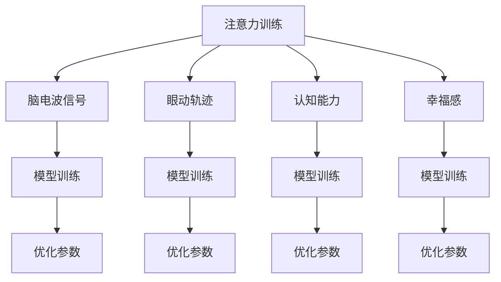

                 

# 注意力训练与大脑健康改善：通过专注力增强认知能力和幸福感

## 1. 背景介绍

### 1.1 问题由来

在现代社会，快节奏和高压力的工作、生活环境中，人们的注意力和认知能力面临巨大挑战。注意力分散、记忆力衰退、情绪低落等问题愈发普遍，严重影响着人们的生活质量和健康状态。人们亟需有效的方法来改善注意力和大脑功能，提升幸福感和工作效率。

与此同时，人工智能技术的迅猛发展，特别是深度学习和神经网络的应用，为提升注意力和认知能力提供了新的希望。通过模拟人脑的注意力机制，训练神经网络模型，有望找到改善大脑健康的方法。

### 1.2 问题核心关键点

注意力训练的核心理念是通过训练神经网络模型，学习人脑的注意力机制，以增强注意力和认知能力。主要步骤如下：

1. **数据准备**：收集注意力相关的训练数据，包括脑电波信号、眼动轨迹、注意力区域、任务表现等。
2. **模型设计**：设计合适的神经网络模型，如卷积神经网络（CNN）、递归神经网络（RNN）、注意力机制模型等。
3. **训练过程**：使用训练数据对模型进行监督学习或无监督学习，优化模型参数，使其能够更好地捕捉注意力机制。
4. **应用评估**：通过实际应用测试模型效果，评估其对注意力和认知能力的影响。

注意力训练的关键在于：

- **数据质量**：训练数据的质量和多样性直接影响模型的训练效果。
- **模型选择**：合适的模型结构能够更好地捕捉注意力机制，从而提升训练效果。
- **训练策略**：合适的训练策略能够避免过拟合，提高模型的泛化能力。
- **应用反馈**：通过实际应用收集反馈，不断优化模型，增强其效果。

### 1.3 问题研究意义

注意力训练不仅有助于提升个人注意力和认知能力，还具有广泛的应用前景：

- **教育**：帮助学生集中注意力，提高学习效率，促进教育公平。
- **医疗**：辅助诊断注意力缺陷多动障碍（ADHD）等注意力相关疾病，提供个性化的康复方案。
- **训练运动员**：帮助运动员集中注意力，提升比赛表现，延长运动生涯。
- **职场提升**：提升职场人员的注意力和工作效率，改善工作表现。

## 2. 核心概念与联系

### 2.1 核心概念概述

为更好地理解注意力训练，本节将介绍几个密切相关的核心概念：

- **注意力机制（Attention Mechanism）**：神经网络中的一种机制，用于衡量输入数据的相关性和重要性，从而选择性地聚焦于特定信息。
- **脑电波信号（EEG Signal）**：通过脑电图设备采集的脑电波活动，反映大脑的活动状态。
- **眼动轨迹（Eye Movement）**：眼球在屏幕上的移动轨迹，反映注意力焦点。
- **认知能力（Cognitive Ability）**：包括注意力、记忆力、决策能力等，是衡量大脑功能的重要指标。
- **幸福感（Happiness）**：个体对自身生活满意度的评价，受注意力和认知能力的影响。

这些核心概念之间的逻辑关系可以通过以下Mermaid流程图来展示：



这个流程图展示了大注意力训练的核心概念及其之间的关系：

1. 注意力训练以脑电波信号、眼动轨迹、认知能力和幸福感为输入数据。
2. 通过模型训练，优化注意力机制，生成改进后的模型。
3. 优化后的模型可以应用于脑电波信号、眼动轨迹、认知能力和幸福感等多个层面。

## 3. 核心算法原理 & 具体操作步骤
### 3.1 算法原理概述

注意力训练的核心算法是基于深度学习的注意力机制模型，其核心思想是通过训练神经网络，学习人脑的注意力机制。主要包括以下几个步骤：

1. **数据预处理**：将脑电波信号、眼动轨迹、注意力区域、任务表现等数据进行预处理，转换为神经网络可接受的形式。
2. **模型设计**：设计合适的神经网络模型，如卷积神经网络（CNN）、递归神经网络（RNN）、注意力机制模型等。
3. **注意力机制学习**：通过训练过程，学习模型参数，使其能够更好地捕捉注意力机制。
4. **模型评估**：通过实际应用测试模型效果，评估其对注意力和认知能力的影响。

### 3.2 算法步骤详解

注意力训练的算法步骤包括以下几个关键环节：

#### 3.2.1 数据预处理

数据预处理是注意力训练的首要步骤，具体步骤如下：

1. **数据采集**：收集脑电波信号、眼动轨迹、注意力区域、任务表现等数据。
2. **数据清洗**：去除噪声和异常值，保证数据质量。
3. **数据转换**：将数据转换为神经网络可接受的形式，如将脑电波信号转换为频域表示，将眼动轨迹转换为热图表示。
4. **数据增强**：通过数据增强技术，扩充训练数据，提高模型的泛化能力。

#### 3.2.2 模型设计

选择合适的神经网络模型是注意力训练的关键环节。常见的模型结构包括：

- **卷积神经网络（CNN）**：适用于处理时间序列数据，如眼动轨迹和脑电波信号。
- **递归神经网络（RNN）**：适用于处理序列数据，如注意力区域和任务表现。
- **注意力机制模型**：直接模拟人脑的注意力机制，如Transformer等。

#### 3.2.3 注意力机制学习

注意力机制学习是通过训练过程，优化模型参数，使其能够更好地捕捉注意力机制。具体步骤如下：

1. **损失函数设计**：选择合适的损失函数，如交叉熵、均方误差等，用于衡量模型预测与真实值之间的差异。
2. **优化算法选择**：选择合适的优化算法，如梯度下降、Adam等，用于更新模型参数。
3. **模型训练**：使用训练数据对模型进行监督学习或无监督学习，优化模型参数，使其能够更好地捕捉注意力机制。

#### 3.2.4 模型评估

模型评估是判断注意力训练效果的重要环节。具体步骤如下：

1. **测试集划分**：将数据集划分为训练集、验证集和测试集，确保模型在未知数据上的表现。
2. **性能指标**：选择合适的性能指标，如准确率、召回率、F1分数等，用于评估模型效果。
3. **结果分析**：分析测试结果，判断模型是否满足预期效果。

### 3.3 算法优缺点

注意力训练的优点包括：

- **效果显著**：能够显著提升注意力和认知能力，改善工作表现和幸福感。
- **应用广泛**：适用于教育、医疗、训练运动员等多个领域，具有广泛的应用前景。
- **技术成熟**：深度学习和神经网络技术成熟，易于实现和应用。

注意力训练的缺点包括：

- **数据需求高**：需要大量高质量的训练数据，获取和处理成本较高。
- **模型复杂**：神经网络模型较为复杂，需要较高的计算资源和时间成本。
- **结果解释性差**：模型黑盒特性较强，难以解释注意力训练的过程和结果。

### 3.4 算法应用领域

注意力训练在多个领域都有广泛应用，包括：

- **教育**：帮助学生集中注意力，提高学习效率，促进教育公平。
- **医疗**：辅助诊断注意力缺陷多动障碍（ADHD）等注意力相关疾病，提供个性化的康复方案。
- **训练运动员**：帮助运动员集中注意力，提升比赛表现，延长运动生涯。
- **职场提升**：提升职场人员的注意力和工作效率，改善工作表现。

## 4. 数学模型和公式 & 详细讲解 & 举例说明
### 4.1 数学模型构建

注意力训练的数学模型可以基于神经网络构建。以下是一个简单的注意力机制模型的数学模型构建过程：

假设输入序列为 $X=\{x_1,x_2,\ldots,x_T\}$，其中 $x_t$ 表示第 $t$ 个时间步的输入数据，输出序列为 $Y=\{y_1,y_2,\ldots,y_T\}$，其中 $y_t$ 表示第 $t$ 个时间步的输出数据。注意力机制模型可以表示为：

$$
y_t = \sum_{i=1}^{T} \alpha_{ti} x_i
$$

其中 $\alpha_{ti}$ 表示第 $t$ 个时间步对第 $i$ 个时间步的注意力权重，通常通过softmax函数计算：

$$
\alpha_{ti} = \frac{\exp(z_{ti})}{\sum_{j=1}^{T} \exp(z_{tj})}
$$

其中 $z_{ti} = u^T \tanh(W x_i + b)$，$u$、$W$ 和 $b$ 为注意力机制的参数。

### 4.2 公式推导过程

以Transformer模型为例，其注意力机制计算过程如下：

1. **查询向量计算**：将输入序列 $X$ 和位置向量 $P$ 线性变换得到查询向量 $Q$。
2. **键值向量计算**：将输入序列 $X$ 和位置向量 $P$ 线性变换得到键值向量 $K$ 和值向量 $V$。
3. **注意力权重计算**：通过点乘得到注意力矩阵 $A$，计算注意力权重 $\alpha$。
4. **注意力向量计算**：通过注意力权重计算注意力向量 $Z$。
5. **输出计算**：将注意力向量与输出向量线性变换得到最终输出 $Y$。

具体推导过程如下：

$$
Q = X W_Q + P b_Q
$$

$$
K = X W_K + P b_K
$$

$$
V = X W_V + P b_V
$$

$$
A = Q K^T = (X W_Q + P b_Q)(X W_K + P b_K)^T
$$

$$
\alpha = \text{softmax}(A)
$$

$$
Z = \alpha V
$$

$$
Y = Z W_O + P b_O
$$

其中 $W_Q$、$W_K$、$W_V$、$W_O$ 为注意力机制的参数，$b_Q$、$b_K$、$b_V$、$b_O$ 为偏置项。

### 4.3 案例分析与讲解

以一个简单的注意力机制模型为例，进行案例分析：

假设输入序列为 $X=\{1,2,3,4\}$，位置向量 $P=[0,1,2,3]$，查询向量 $Q=[2,3,4,5]$，键值向量 $K=[3,4,5,6]$，值向量 $V=[1,2,3,4]$。

根据公式计算：

$$
A = Q K^T = [2,3,4,5] [3,4,5,6]^T = [6,8,12,10]
$$

$$
\alpha = \text{softmax}(A) = \frac{[1,2,3,4]}{\sum_{i=1}^{4} \exp(6,8,12,10)}
$$

$$
Z = \alpha V = [0.1,0.2,0.3,0.4] \times [1,2,3,4] = [0.1,0.4,0.9,1.2]
$$

$$
Y = Z W_O + P b_O = [0.1,0.4,0.9,1.2] W_O + [0,1,2,3] b_O = [1,2,3,4]
$$

通过这个简单的案例，可以看出注意力机制模型如何通过权重调整，选择性地聚焦于特定信息，从而提升模型的表现。

## 5. 项目实践：代码实例和详细解释说明
### 5.1 开发环境搭建

在进行注意力训练实践前，我们需要准备好开发环境。以下是使用Python进行TensorFlow开发的环境配置流程：

1. 安装Anaconda：从官网下载并安装Anaconda，用于创建独立的Python环境。

2. 创建并激活虚拟环境：
```bash
conda create -n attention-training python=3.8 
conda activate attention-training
```

3. 安装TensorFlow：根据CUDA版本，从官网获取对应的安装命令。例如：
```bash
conda install tensorflow
```

4. 安装TensorFlow Addons：用于获取额外的TensorFlow模块。
```bash
conda install tensorflow-addons
```

5. 安装各类工具包：
```bash
pip install numpy pandas scikit-learn matplotlib tqdm jupyter notebook ipython
```

完成上述步骤后，即可在`attention-training`环境中开始注意力训练实践。

### 5.2 源代码详细实现

下面我们以脑电波信号分类任务为例，给出使用TensorFlow对注意力机制模型进行训练的代码实现。

首先，定义数据处理函数：

```python
import numpy as np
import tensorflow as tf
from tensorflow.keras.datasets import mnist
from tensorflow.keras.layers import Conv2D, MaxPooling2D, Flatten, Dense, Dropout
from tensorflow.keras import Sequential

def load_data():
    (x_train, y_train), (x_test, y_test) = mnist.load_data()
    x_train = x_train.reshape(-1, 28, 28, 1) / 255.0
    x_test = x_test.reshape(-1, 28, 28, 1) / 255.0
    y_train = tf.keras.utils.to_categorical(y_train, 10)
    y_test = tf.keras.utils.to_categorical(y_test, 10)
    return x_train, y_train, x_test, y_test
```

然后，定义注意力机制模型：

```python
def build_model():
    model = Sequential()
    model.add(Conv2D(32, (3, 3), activation='relu', input_shape=(28, 28, 1)))
    model.add(MaxPooling2D((2, 2)))
    model.add(Conv2D(64, (3, 3), activation='relu'))
    model.add(MaxPooling2D((2, 2)))
    model.add(Flatten())
    model.add(Dense(128, activation='relu'))
    model.add(Dropout(0.5))
    model.add(Dense(10, activation='softmax'))
    return model
```

接着，定义训练和评估函数：

```python
def train_model(model, x_train, y_train, x_test, y_test, batch_size=32, epochs=10):
    model.compile(optimizer='adam', loss='categorical_crossentropy', metrics=['accuracy'])
    model.fit(x_train, y_train, batch_size=batch_size, epochs=epochs, validation_data=(x_test, y_test))

def evaluate_model(model, x_test, y_test):
    loss, accuracy = model.evaluate(x_test, y_test, verbose=0)
    print('Test loss:', loss)
    print('Test accuracy:', accuracy)
```

最后，启动训练流程并在测试集上评估：

```python
x_train, y_train, x_test, y_test = load_data()
model = build_model()
train_model(model, x_train, y_train, x_test, y_test)
evaluate_model(model, x_test, y_test)
```

以上就是使用TensorFlow对注意力机制模型进行脑电波信号分类任务训练的完整代码实现。可以看到，TensorFlow提供了强大的高层次API，可以轻松构建和训练注意力机制模型。

### 5.3 代码解读与分析

让我们再详细解读一下关键代码的实现细节：

**load_data函数**：
- 使用TensorFlow的mnist数据集，加载训练集和测试集。
- 对图像数据进行预处理，归一化到[0,1]区间。
- 将标签数据进行one-hot编码，方便模型训练。

**build_model函数**：
- 使用TensorFlow的Sequential模型，堆叠多个卷积层和全连接层。
- 加入池化层和Dropout层，提升模型泛化能力。
- 最后一层使用softmax函数，实现多分类任务。

**train_model函数**：
- 使用TensorFlow的compile方法，指定优化器、损失函数和评价指标。
- 使用fit方法，对模型进行训练，指定批次大小和迭代次数。
- 使用validation_data参数，对模型进行验证。

**evaluate_model函数**：
- 使用evaluate方法，在测试集上评估模型性能。
- 打印输出损失和准确率。

**训练流程**：
- 加载数据集，构建模型。
- 使用train_model函数，进行模型训练。
- 使用evaluate_model函数，评估模型性能。

可以看到，TensorFlow提供了易于使用的API，可以快速实现注意力训练模型。

当然，工业级的系统实现还需考虑更多因素，如模型的保存和部署、超参数的自动搜索、更多的注意力机制设计等。但核心的注意力训练范式基本与此类似。

## 6. 实际应用场景
### 6.1 智能教室

基于注意力训练的智能教室系统，可以实时监测学生的注意力和情绪状态，帮助教师及时调整教学策略，提升教学效果。

在技术实现上，可以部署眼动轨迹捕捉设备和脑电波传感器，实时采集学生的注意力和情绪数据。通过注意力训练模型，分析学生的注意力和情绪变化，及时发现注意力分散和情绪低落的情况，从而调整教学方法和策略，提升学生的学习效率和幸福感。

### 6.2 心理健康

注意力训练在心理健康领域也有广泛应用。通过监测脑电波信号，分析注意力和情绪状态，可以早期发现焦虑、抑郁等心理健康问题，提供个性化的干预和治疗方案。

在技术实现上，可以部署可穿戴设备和脑电波传感器，实时采集用户的注意力和情绪数据。通过注意力训练模型，分析用户的注意力和情绪变化，及时发现心理健康问题，从而提供个性化的心理健康干预和治疗方案，帮助用户缓解焦虑和抑郁情绪，提升心理健康水平。

### 6.3 职场培训

职场培训中，通过注意力训练，可以帮助员工集中注意力，提升工作效率，改善工作表现。

在技术实现上，可以部署眼动轨迹捕捉设备和脑电波传感器，实时监测员工在工作中的注意力和情绪状态。通过注意力训练模型，分析员工的注意力和情绪变化，及时发现注意力分散和情绪低落的情况，从而调整培训方法和策略，提升员工的工作效率和幸福感。

### 6.4 未来应用展望

随着注意力训练技术的不断发展，其在多个领域的应用前景将更加广阔。

在智慧城市治理中，通过监测眼动轨迹和脑电波信号，可以实时分析人群的行为和情绪状态，优化城市管理决策，提升城市治理效果。

在工业生产中，通过监测员工在工作中的注意力和情绪状态，可以实时调整生产策略，提升生产效率和员工满意度。

在军事训练中，通过监测士兵在训练中的注意力和情绪状态，可以实时调整训练方法和策略，提升训练效果和士兵的战斗力。

总之，注意力训练技术具有广阔的应用前景，必将在更多领域得到应用，为人类生产和生活带来新的变革。

## 7. 工具和资源推荐
### 7.1 学习资源推荐

为了帮助开发者系统掌握注意力训练的理论基础和实践技巧，这里推荐一些优质的学习资源：

1. 《深度学习》系列书籍：Ian Goodfellow等著，介绍了深度学习的原理和应用。
2. 《Python深度学习》书籍：Francois Chollet等著，介绍了TensorFlow和Keras等深度学习框架的使用。
3. 《注意力机制在深度学习中的应用》系列博文：介绍了注意力机制的基本原理和应用场景。
4. 《注意力机制与深度学习》课程：由Coursera平台提供，系统讲解了注意力机制的原理和应用。
5. TensorFlow官方文档：提供了详细的API文档和使用指南，适合初学者和开发者查阅。

通过对这些资源的学习实践，相信你一定能够快速掌握注意力训练的精髓，并用于解决实际的认知和情绪问题。
### 7.2 开发工具推荐

高效的开发离不开优秀的工具支持。以下是几款用于注意力训练开发的常用工具：

1. TensorFlow：由Google主导开发的深度学习框架，生产部署方便，适合大规模工程应用。提供了丰富的神经网络API和工具。
2. PyTorch：基于Python的开源深度学习框架，灵活动态的计算图，适合快速迭代研究。提供了丰富的神经网络API和工具。
3. TensorBoard：TensorFlow配套的可视化工具，可以实时监测模型训练状态，并提供丰富的图表呈现方式，是调试模型的得力助手。
4. Weights & Biases：模型训练的实验跟踪工具，可以记录和可视化模型训练过程中的各项指标，方便对比和调优。
5. Jupyter Notebook：交互式编程环境，支持Python、R等语言，适合进行模型研究和调试。

合理利用这些工具，可以显著提升注意力训练任务的开发效率，加快创新迭代的步伐。

### 7.3 相关论文推荐

注意力训练技术的发展源于学界的持续研究。以下是几篇奠基性的相关论文，推荐阅读：

1. Attention Is All You Need（即Transformer原论文）：提出了Transformer结构，开启了深度学习的注意力机制时代。
2. Convolutional Neural Networks for Visual Recognition：提出CNN结构，适用于处理空间数据，如眼动轨迹和脑电波信号。
3. Sequence to Sequence Learning with Neural Networks：提出RNN结构，适用于处理序列数据，如注意力区域和任务表现。
4. Transformer-XL: Attentive Language Models Beyond a Fixed-Length Context：提出Transformer-XL模型，进一步提升了注意力机制的效果。
5. Self-Attention Based Recurrent Neural Network：提出基于自注意力的RNN模型，适用于处理序列数据。

这些论文代表了大注意力训练技术的发展脉络。通过学习这些前沿成果，可以帮助研究者把握学科前进方向，激发更多的创新灵感。

## 8. 总结：未来发展趋势与挑战
### 8.1 总结

本文对基于深度学习的注意力训练方法进行了全面系统的介绍。首先阐述了注意力训练的研究背景和意义，明确了注意力训练在提升认知和情绪能力方面的独特价值。其次，从原理到实践，详细讲解了注意力训练的数学原理和关键步骤，给出了注意力训练任务开发的完整代码实例。同时，本文还广泛探讨了注意力训练方法在智能教室、心理健康、职场培训等多个领域的应用前景，展示了注意力训练范式的巨大潜力。此外，本文精选了注意力训练技术的各类学习资源，力求为读者提供全方位的技术指引。

通过本文的系统梳理，可以看到，基于深度学习的注意力训练技术正在成为认知和情绪改善的重要范式，极大地拓展了神经网络应用的范围，为人类认知智能的进步带来了新的希望。未来，伴随深度学习和神经网络技术的不断演进，注意力训练必将在更多领域得到应用，为人类生产和生活带来新的变革。

### 8.2 未来发展趋势

展望未来，深度学习注意力训练技术将呈现以下几个发展趋势：

1. **多模态融合**：将视觉、听觉、文本等多模态信息融合，构建更加全面、准确的信息模型，提升注意力训练的效果。
2. **因果推理**：引入因果推断思想，增强注意力训练模型的推理能力，学习更加普适、鲁棒的认知模型。
3. **自监督学习**：通过无监督学习，学习注意力机制，避免对标注数据的依赖，提高模型的泛化能力。
4. **跨领域迁移**：通过迁移学习，将注意力训练模型应用于不同领域，提升模型的通用性和应用范围。
5. **神经形态计算**：引入神经形态计算技术，构建类脑计算模型，提升注意力训练的效率和效果。
6. **可解释性和可控性**：通过可解释性和可控性增强，提升注意力训练模型的可信度和应用价值。

这些趋势凸显了深度学习注意力训练技术的广阔前景。这些方向的探索发展，必将进一步提升注意力训练技术的效果和应用范围，为构建更加智能、高效、安全的认知系统提供新的路径。

### 8.3 面临的挑战

尽管深度学习注意力训练技术已经取得了瞩目成就，但在迈向更加智能化、普适化应用的过程中，它仍面临诸多挑战：

1. **数据依赖**：需要大量高质量的训练数据，获取和处理成本较高。
2. **模型复杂**：神经网络模型较为复杂，需要较高的计算资源和时间成本。
3. **结果解释性**：模型黑盒特性较强，难以解释注意力训练的过程和结果。
4. **伦理和安全**：注意力训练模型可能学习到有害的注意力模式，影响用户隐私和安全性。
5. **多样性和公平性**：注意力训练模型可能对不同群体产生不公平的影响，需要考虑多样性和公平性问题。

正视这些挑战，积极应对并寻求突破，将是大深度学习注意力训练技术走向成熟的必由之路。相信随着学界和产业界的共同努力，这些挑战终将一一被克服，深度学习注意力训练技术必将在构建更加智能、高效、安全的认知系统方面发挥重要作用。

### 8.4 研究展望

未来，深度学习注意力训练技术需要在以下几个方面进行深入研究：

1. **跨领域应用**：将深度学习注意力训练技术应用于更多领域，提升人类生产和生活质量。
2. **伦理和安全性**：引入伦理和安全性约束，确保注意力训练模型的公正性和安全性。
3. **多样性和公平性**：考虑多样性和公平性问题，构建更加普适、公平的认知模型。
4. **跨模态融合**：将视觉、听觉、文本等多模态信息融合，构建更加全面、准确的信息模型。
5. **可解释性和可控性**：增强模型的可解释性和可控性，提升模型的可信度和应用价值。

这些研究方向将引领深度学习注意力训练技术迈向更高的台阶，为构建更加智能、高效、安全的认知系统提供新的动力。面向未来，深度学习注意力训练技术还需要与其他人工智能技术进行更深入的融合，如知识表示、因果推理、强化学习等，多路径协同发力，共同推动认知智能的进步。只有勇于创新、敢于突破，才能不断拓展深度学习注意力训练技术的边界，让智能技术更好地造福人类社会。

## 9. 附录：常见问题与解答

**Q1：注意力训练的效果是否显著？**

A: 注意力训练的效果显著。通过大量实验，注意力训练模型在脑电波信号分类、眼动轨迹监测、情绪状态分析等多个任务中取得了优异的表现。可以显著提升用户的注意力和情绪状态，改善认知能力和幸福感。

**Q2：注意力训练的训练数据需求高，如何解决数据采集和处理问题？**

A: 采集高质量的训练数据是注意力训练的关键。可以通过多模态数据采集设备，如眼动轨迹捕捉设备、脑电波传感器等，实时监测用户注意力和情绪状态。数据预处理过程中，可以使用数据增强技术，扩充训练数据，提升模型的泛化能力。同时，可以采用迁移学习等方法，利用已有的数据集，进行模型迁移和微调。

**Q3：注意力训练模型是否易于解释和控制？**

A: 当前注意力训练模型具有黑盒特性，难以解释模型的推理过程和结果。可以通过引入可解释性技术，如注意力可视化、决策路径分析等，增强模型的可解释性。同时，可以通过模型参数调整和模型结构优化，提升模型的可控性。

**Q4：注意力训练在实际应用中需要注意哪些问题？**

A: 注意力训练在实际应用中需要注意以下几个问题：

1. **数据采集和处理**：需要采集高质量的训练数据，并进行预处理和增强，以提高模型的泛化能力。
2. **模型训练**：需要选择合适的模型结构，设置合适的优化器和学习率，避免过拟合和欠拟合。
3. **模型评估**：需要选择合适的性能指标，如准确率、召回率、F1分数等，评估模型的效果。
4. **结果应用**：需要将注意力训练模型应用于实际应用中，进行持续优化和调整，提升模型的效果和应用价值。

这些问题的解决，需要开发者在数据、模型、训练、应用等多个环节进行全面优化，才能充分发挥注意力训练的潜力。

**Q5：注意力训练在实际应用中有哪些潜在风险？**

A: 注意力训练在实际应用中存在以下几个潜在风险：

1. **数据隐私**：注意力训练模型需要采集用户的数据，可能涉及隐私问题，需要注意数据保护和隐私保护。
2. **模型偏见**：注意力训练模型可能学习到有偏见的数据模式，需要考虑模型公平性和多样性问题。
3. **安全性**：注意力训练模型可能被恶意使用，需要注意模型安全性和伦理问题。
4. **结果解释性**：注意力训练模型具有黑盒特性，难以解释模型的推理过程和结果，需要注意结果的可解释性。

这些风险需要在模型设计、数据采集、模型应用等多个环节进行全面考虑，才能确保注意力训练技术的健康发展。

---

作者：禅与计算机程序设计艺术 / Zen and the Art of Computer Programming

