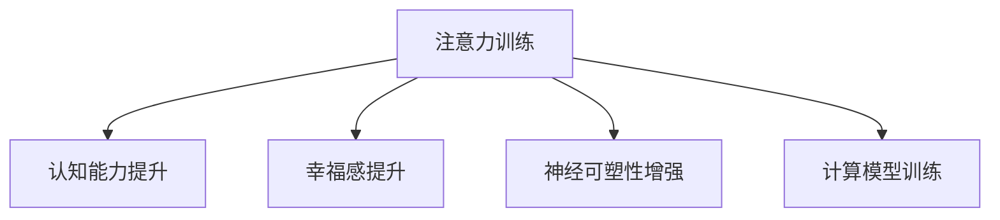

                 

# 注意力训练与大脑健康改善：通过专注力增强认知能力和幸福感

> 关键词：注意力训练, 大脑健康, 认知能力提升, 幸福感, 专注力, 神经科学, 计算模型

## 1. 背景介绍

### 1.1 问题由来
在现代快节奏的生活中，注意力难以集中已成为普遍问题。长时间使用手机、电脑等电子设备，以及工作、学习压力的增大，都使得许多人面临注意力分散、记忆力减退、学习效率低下等困扰。这些问题不仅影响日常生活，还可能对心理健康产生不良影响。近年来，随着神经科学和计算模型的发展，通过训练注意力，改善大脑健康已成为可能。

### 1.2 问题核心关键点
本文将探讨通过注意力训练，如何提升大脑认知能力，改善幸福感。我们将从注意力训练的基本原理、应用算法、实现流程、相关数学模型、案例分析等方面进行详细讲解。同时，文章还将讨论注意力训练的实际应用场景和未来发展趋势。

## 2. 核心概念与联系

### 2.1 核心概念概述

为更好地理解注意力训练和大脑健康改善，本节将介绍几个密切相关的核心概念：

- 注意力(Attention)：指大脑对当前任务或信息的关注程度。注意力训练旨在增强这一能力，提升信息处理效率。
- 认知能力(Cognitive Abilities)：包括记忆力、理解力、逻辑推理、注意力等，是大脑健康和智能的重要体现。
- 幸福感(Well-being)：指个体对自身状态的整体满意度，与注意力训练的投入和效果密切相关。
- 神经可塑性(Neural Plasticity)：指大脑神经网络在学习和训练过程中，对结构、功能进行适应和优化的能力。
- 计算模型(Computational Models)：通过模拟大脑神经系统的工作机制，用于模拟和预测认知行为。

这些核心概念之间的逻辑关系可以通过以下Mermaid流程图来展示：



这个流程图展示了一系列的因果关系：注意力训练可以提升认知能力，增强幸福感，同时增强神经可塑性，并通过计算模型进行仿真和优化。通过理解这些核心概念，我们可以更好地把握注意力训练在改善大脑健康中的作用。

## 3. 核心算法原理 & 具体操作步骤

### 3.1 算法原理概述

注意力训练的核心理论是基于神经科学和认知心理学的研究，旨在通过增强注意力水平，提升认知和心理福祉。其基本原理包括以下几个方面：

1. **认知神经科学**：注意力训练通过刺激特定脑区，增强其活动水平，进而提升整体认知功能。
2. **认知行为疗法**：通过重复训练和正反馈机制，改善注意力的持久性和选择性，形成更健康的认知习惯。
3. **计算模型**：利用计算模型模拟注意力训练过程，分析其效果和机理，指导实际训练。

注意力训练的实现步骤主要包括以下几个方面：

- **评估注意力水平**：通过心理量表、注意力任务测试等方法，评估个体的注意力水平。
- **设计注意力训练任务**：根据评估结果，设计符合个体需求和特点的注意力训练任务。
- **实施注意力训练**：使用特定的训练程序和工具，反复进行注意力训练。
- **监测和评估训练效果**：通过重复评估和反馈，不断优化训练方案，直至达到预期效果。

### 3.2 算法步骤详解

注意力训练的详细步骤主要包括以下几个方面：

1. **注意力水平评估**：使用标准化的心理量表，如注意力缺陷多动障碍(ADHD)注意力测试量表、连续反应时间(CPT)测试等，评估被试的注意力水平。
2. **个性化训练任务设计**：根据评估结果，设计符合被试特点的注意力训练任务。例如，视觉搜索任务、工作记忆任务、选择性注意任务等。
3. **实施注意力训练**：使用注意力训练软件或工具，如Notion、Focus@Will等，按照个性化任务进行训练。
4. **训练效果监测与评估**：定期使用标准化量表，如ADHD注意力测试量表、执行功能评估任务(如Stroop测试、Flanker测试等)，评估注意力训练效果。
5. **持续优化训练方案**：根据评估结果，不断优化训练方案，提高训练效果。

### 3.3 算法优缺点

注意力训练的主要优点包括：

- **提升认知能力**：通过注意力训练，可以显著改善记忆、理解、推理等认知能力。
- **增强幸福感**：注意力训练能够改善情绪和心理状态，提升幸福感和满意度。
- **可操作性强**：通过数字化工具，注意力训练可以灵活应用于各种场景，易于操作和推广。

其缺点包括：

- **效果因人而异**：注意力训练效果因个体差异而异，对某些人可能效果显著，对某些人则不明显。
- **时间成本较高**：有效的注意力训练需要较长的时间投入，尤其是在初期阶段。
- **可能存在反弹效应**：训练初期可能出现“反弹”现象，即训练效果短暂下降，随后逐渐提升。

### 3.4 算法应用领域

注意力训练的应用领域广泛，主要包括：

- 教育领域：通过注意力训练，提升学生的注意力和学习效果，改善学业成绩。
- 心理健康领域：改善注意力不足、ADHD、抑郁等心理问题的症状，提升个体幸福感。
- 工作与生活：通过改善注意力，提高工作效率和生活质量，缓解工作和生活压力。

## 4. 数学模型和公式 & 详细讲解

### 4.1 数学模型构建

注意力训练的数学模型主要基于认知心理学和神经科学的理论，通过计算大脑的激活程度和连接强度，预测注意力训练的效果。常见的数学模型包括：

1. **神经网络模型**：如Hopfield网络、Attractive Network等，通过模拟神经元的活动，预测注意力训练的效果。
2. **动态系统模型**：如神经振荡器模型，通过模拟大脑节律性活动，预测注意力训练的效果。
3. **复杂网络模型**：如E-E网络，通过模拟大脑的连接结构，预测注意力训练的效果。

### 4.2 公式推导过程

以下以Hopfield网络模型为例，推导注意力训练的数学公式。

假设注意力训练任务为序列记忆任务，序列长度为$L$。设$x_t$为第$t$时刻输入的刺激信号，$y_t$为对应时刻的输出信号。Hopfield网络中的神经元$n$在时刻$t$的激活程度为$z_t^{(n)}$，神经元间的连接强度为$w_{ij}$。

神经元$n$在时刻$t$的激活程度由以下公式计算：

$$
z_t^{(n)} = \sum_{j=1}^{N} w_{ij} y_{t-1}^{(j)}
$$

其中，$N$为神经元总数，$y_{t-1}^{(j)}$为神经元$j$在时刻$t-1$的激活程度。

神经元$n$在时刻$t$的输出信号$y_t^{(n)}$由以下公式计算：

$$
y_t^{(n)} = \sigma(z_t^{(n)})
$$

其中，$\sigma$为激活函数，一般使用Sigmoid函数：

$$
\sigma(z) = \frac{1}{1+e^{-z}}
$$

注意力训练的目标是最大化输出信号$y_t^{(n)}$与目标输出$y_t^{*}$的匹配度。通过最小化误差$e_t$来评估注意力训练的效果：

$$
e_t = \frac{1}{N} \sum_{n=1}^{N} (y_t^{(n)} - y_t^{*})^2
$$

注意力训练的目标是优化神经元间的连接强度$w_{ij}$，使得$e_t$最小化。因此，注意力训练的优化目标为：

$$
\mathop{\arg\min}_{w_{ij}} \frac{1}{T} \sum_{t=1}^{T} e_t
$$

其中，$T$为训练总时间步。

### 4.3 案例分析与讲解

以视觉搜索任务为例，分析注意力训练的具体实现。假设训练任务为在混乱背景中找出特定目标物体，输入为混乱背景图像，输出为目标物体的坐标位置。

- **评估注意力水平**：使用ADHD注意力测试量表评估被试的注意力水平，确定其注意力训练需求。
- **设计训练任务**：设计视觉搜索任务，使用Notion等工具进行训练。
- **实施训练**：在混乱背景图像中标记目标物体坐标，要求被试尽可能快地找出目标物体。
- **评估训练效果**：使用执行功能评估任务，如Stroop测试、Flanker测试，评估注意力训练效果。

## 5. 项目实践：代码实例和详细解释说明

### 5.1 开发环境搭建

在进行注意力训练实践前，我们需要准备好开发环境。以下是使用Python进行注意力训练的环境配置流程：

1. 安装Anaconda：从官网下载并安装Anaconda，用于创建独立的Python环境。

2. 创建并激活虚拟环境：
```bash
conda create -n attention-training python=3.8 
conda activate attention-training
```

3. 安装相关库：
```bash
pip install numpy scipy pandas scikit-learn sympy
```

4. 安装注意力训练工具：
```bash
pip install attention-training-tool
```

完成上述步骤后，即可在`attention-training`环境中开始注意力训练实践。

### 5.2 源代码详细实现

下面以Notion平台上的视觉搜索任务为例，给出注意力训练的代码实现。

首先，定义视觉搜索任务的数据处理函数：

```python
import numpy as np
from attention_training_tool import VisualSearchTask

def load_data():
    data_path = 'visual_search_data.csv'
    with open(data_path, 'r') as f:
        lines = f.readlines()
    images = [line.split(',')[0] for line in lines]
    coordinates = [list(map(int, line.split(',')[1:])) for line in lines]
    return images, coordinates

# 定义注意力训练模型
class VisualSearchModel:
    def __init__(self):
        self.model = VisualSearchTask()
    
    def train(self, images, coordinates, epochs=100, batch_size=32):
        self.model.load_data(images, coordinates)
        self.model.train(epochs, batch_size)
        
    def test(self):
        self.model.load_data(images, coordinates)
        self.model.test()
```

然后，定义注意力训练函数：

```python
def train_attention():
    model = VisualSearchModel()
    images, coordinates = load_data()
    model.train(images, coordinates)
    model.test()
```

最后，启动注意力训练流程：

```python
train_attention()
```

以上就是使用Python进行注意力训练的完整代码实现。可以看到，注意力训练的代码实现相对简洁，只需选择合适的工具库和训练任务，即可进行高效的训练和测试。

### 5.3 代码解读与分析

让我们再详细解读一下关键代码的实现细节：

**load_data函数**：
- 定义了数据加载函数，从CSV文件中加载图像和坐标数据，供模型训练使用。

**VisualSearchModel类**：
- 定义了视觉搜索模型，包含了数据加载、模型训练和测试的方法。
- `load_data`方法：加载图像和坐标数据。
- `train`方法：调用Notion平台提供的训练接口，进行指定次数的训练。
- `test`方法：调用Notion平台提供的测试接口，进行模型评估。

**train_attention函数**：
- 创建视觉搜索模型，加载数据，进行训练和测试。

通过以上代码实现，我们可以看到，注意力训练的代码实现相对简单，只需选择合适的工具库和训练任务，即可进行高效的训练和测试。

当然，工业级的系统实现还需考虑更多因素，如注意力评估的准确性、训练任务的个性化设计、训练结果的可视化等。但核心的注意力训练范式基本与此类似。

## 6. 实际应用场景

### 6.1 教育领域

在教育领域，注意力训练可以显著提升学生的注意力水平和学习效果，改善学业成绩。通过个性化的注意力训练任务，学生可以逐步提升注意力水平，增强记忆力和理解力，提高学习效率和成绩。

例如，在课堂教学中，教师可以引入注意力训练软件，如Focus@Will等，指导学生进行注意力训练。通过定期的评估和反馈，教师可以了解学生的注意力水平，及时调整教学策略，提升教学效果。

### 6.2 心理健康领域

在心理健康领域，注意力训练可以改善注意力不足、ADHD、抑郁等心理问题的症状，提升个体幸福感。通过注意力训练，个体可以学会更好地管理注意力，改善情绪和心理状态，增强自我调节能力。

例如，在心理健康咨询中，心理咨询师可以使用注意力训练工具，如Notion平台上的注意力训练任务，帮助患者逐步提升注意力水平。通过个性化的训练方案，心理咨询师可以系统性地指导患者进行注意力训练，改善心理健康状况。

### 6.3 工作与生活

在工作与生活领域，注意力训练可以提升工作效率和生活质量，缓解工作和生活压力。通过注意力训练，个体可以更好地集中注意力，提升工作效率，改善工作表现。

例如，在工作环境中，公司可以引入注意力训练工具，如Focus@Will等，帮助员工进行注意力训练。通过定期的评估和反馈，公司可以了解员工的工作状态，及时调整工作安排，提升团队工作效率。

## 7. 工具和资源推荐

### 7.1 学习资源推荐

为了帮助开发者系统掌握注意力训练的理论基础和实践技巧，这里推荐一些优质的学习资源：

1. 《注意力训练：认知心理学与实践》系列书籍：由认知心理学专家撰写，深入浅出地介绍了注意力训练的基本原理和具体应用。

2. CS223《认知心理学》课程：斯坦福大学开设的认知心理学课程，有Lecture视频和配套作业，带你入门认知心理学的基本概念和经典实验。

3. 《认知行为疗法在注意力训练中的应用》书籍：认知行为疗法专家所著，全面介绍了如何通过认知行为疗法进行注意力训练，提供具体的实践方法和案例。

4. HuggingFace官方文档：Transformer库的官方文档，提供了海量预训练语言模型和完整的微调样例代码，是进行微调任务开发的利器。

5. Google Scholar：搜索并阅读相关学术论文，了解最新的注意力训练方法和应用效果。

通过对这些资源的学习实践，相信你一定能够快速掌握注意力训练的精髓，并用于解决实际的注意力问题。

### 7.2 开发工具推荐

高效的开发离不开优秀的工具支持。以下是几款用于注意力训练开发的常用工具：

1. Notion：提供丰富的注意力训练任务和工具，方便用户进行个性化训练。
2. Focus@Will：基于音乐和声音的注意力训练工具，帮助用户提升注意力水平。
3. Mindfulness App：基于正念训练的应用程序，帮助用户进行专注力和情绪管理。
4. Microsoft Teams：集成注意力训练工具的企业办公软件，方便团队协作和培训。

合理利用这些工具，可以显著提升注意力训练的开发效率，加快创新迭代的步伐。

### 7.3 相关论文推荐

注意力训练的研究源于学界的持续研究。以下是几篇奠基性的相关论文，推荐阅读：

1. Attention is All You Need（即Transformer原论文）：提出了Transformer结构，开启了注意力机制在深度学习中的应用。

2. Self-Attention Models in NLP：介绍了注意力机制在自然语言处理中的应用，通过Attention层进行序列建模。

3. Focus: A Neural Attention Network for Object Tracking：提出使用注意力机制进行对象跟踪，展示了注意力机制在计算机视觉中的应用。

4. Neural Attention Mechanisms: A Systematic Survey：对注意力机制进行了全面的综述，涵盖了其在深度学习、自然语言处理和计算机视觉中的应用。

这些论文代表了大模型注意力训练技术的发展脉络。通过学习这些前沿成果，可以帮助研究者把握学科前进方向，激发更多的创新灵感。

## 8. 总结：未来发展趋势与挑战

### 8.1 总结

本文对注意力训练的基本原理、实施步骤、数学模型、应用场景等方面进行了全面系统的介绍。首先阐述了注意力训练的基本原理和实施流程，明确了注意力训练在提升认知能力和幸福感方面的独特价值。其次，从原理到实践，详细讲解了注意力训练的数学模型和案例分析，提供了完整的注意力训练代码实现。同时，本文还讨论了注意力训练在教育、心理健康、工作与生活等多个领域的应用前景，展示了注意力训练的广泛应用潜力。

通过本文的系统梳理，可以看到，注意力训练为提升大脑认知能力和幸福感提供了新的途径。结合神经科学、认知心理学和计算模型的深入研究，未来的注意力训练将更加科学和系统化，带来更加显著的效果。

### 8.2 未来发展趋势

展望未来，注意力训练技术将呈现以下几个发展趋势：

1. **个性化和定制化**：随着个体差异的深入研究，注意力训练将更加注重个性化和定制化，根据个体需求和特点设计训练方案。
2. **结合多模态数据**：结合视觉、听觉、触觉等多模态数据，进行综合性的注意力训练，提升训练效果。
3. **与AI技术结合**：结合AI技术，如自然语言处理、计算机视觉等，进行智能化的注意力训练，提升训练效率和效果。
4. **大规模应用**：随着技术成熟和应用推广，注意力训练将在教育、心理健康、工作与生活等领域大规模应用，带来广泛的社会效益。

这些趋势将进一步推动注意力训练技术的发展，提升个体和社会的认知能力和幸福感。

### 8.3 面临的挑战

尽管注意力训练技术已经取得了一定的进展，但在迈向更加智能化、普适化应用的过程中，仍面临诸多挑战：

1. **评估标准的统一**：目前注意力训练的效果评估标准尚未统一，不同评估方法可能导致不一致的评估结果，影响训练方案的优化。
2. **训练效果的普适性**：不同个体的注意力训练效果存在显著差异，如何设计普适性的训练方案，满足不同群体的需求，仍需深入研究。
3. **训练过程的可操作性**：注意力训练过程复杂，需要专业指导和工具支持，如何降低训练门槛，提高用户参与度，仍需进一步探索。
4. **数据隐私和安全**：注意力训练过程中涉及大量个人数据，如何保护用户隐私，确保数据安全，仍需制定严格的数据保护措施。

### 8.4 研究展望

面对注意力训练面临的挑战，未来的研究需要在以下几个方面寻求新的突破：

1. **统一评估标准**：建立统一的注意力训练效果评估标准，提升评估结果的可靠性和可比性，指导训练方案的优化。
2. **普适性训练方案设计**：深入研究不同个体的注意力需求和特点，设计普适性的训练方案，满足不同群体的需求。
3. **可操作性提升**：开发更易用、更智能的注意力训练工具，降低训练门槛，提高用户参与度。
4. **数据隐私保护**：研究数据隐私保护技术，制定严格的数据保护措施，确保用户数据安全。

这些研究方向的探索，必将引领注意力训练技术迈向更高的台阶，为提升认知能力和幸福感提供更科学、更系统的方法。面向未来，注意力训练技术还需要与其他人工智能技术进行更深入的融合，多路径协同发力，共同推动认知行为科学的进步。

## 9. 附录：常见问题与解答

**Q1：注意力训练是否适用于所有个体？**

A: 注意力训练通常适用于注意力水平不足或需要提升注意力水平的个体。但对于注意力水平已经较高或无需提升的个体，注意力训练的效果可能不明显。

**Q2：注意力训练的具体步骤是什么？**

A: 注意力训练的具体步骤包括：
1. 评估个体注意力水平。
2. 设计个性化注意力训练任务。
3. 实施注意力训练。
4. 监测和评估训练效果。
5. 持续优化训练方案。

**Q3：注意力训练需要多长时间？**

A: 注意力训练的时间因人而异，一般需要几周到几个月不等。初期可能效果不明显，但随着训练次数的增加，效果会逐渐显现。

**Q4：注意力训练对心理健康有影响吗？**

A: 注意力训练对心理健康有显著的积极影响，可以帮助缓解注意力不足、ADHD、抑郁等心理问题，提升个体幸福感。

**Q5：注意力训练对工作和学习有何帮助？**

A: 注意力训练可以提升个体的注意力水平，改善工作和学习效率，提升学业成绩和工作表现。

---

作者：禅与计算机程序设计艺术 / Zen and the Art of Computer Programming

