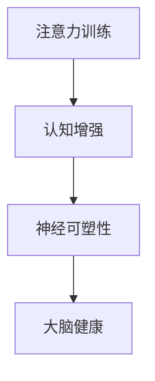

                 

# 注意力训练与大脑增强：通过专注力增强认知能力和神经可塑性

> 关键词：注意力训练,认知增强,神经可塑性,大脑健康,神经科学

## 1. 背景介绍

### 1.1 问题由来
在现代社会，信息爆炸和压力增大使得人们的注意力和认知能力面临严峻考验。许多人在面对工作、学习、生活中的复杂任务时，往往难以集中注意力，导致效率低下、疲劳累积，甚至出现认知下降。这一现象逐渐成为全球范围内的健康问题。

与此同时，随着人工智能技术的发展，特别是深度学习模型的崛起，人们对注意力机制的兴趣日益浓厚。注意力机制不仅在机器学习中扮演关键角色，还被认为是认知科学中理解人类大脑信息处理过程的重要线索。如何在实践中利用注意力训练提高认知能力，增强神经可塑性，成为了一个亟待解决的重要问题。

### 1.2 问题核心关键点
1. **注意力机制**：深度学习模型中的一种关键机制，负责动态地调整信息的权重，使得模型能专注于重要的输入信息。
2. **认知能力**：包括记忆力、注意力、处理速度等多方面的心理能力，是大脑健康的重要指标。
3. **神经可塑性**：大脑通过神经网络调整结构，以适应新环境和新任务的能力。
4. **大脑健康**：与注意力训练相关的不仅是认知能力的提升，还涉及神经可塑性在大脑中的作用机制。
5. **认知训练**：通过特定任务或训练方案，有目的地提升注意力和认知能力。
6. **脑-机接口**：结合神经科学、计算机科学等多领域技术，探索通过电信号控制大脑的信息处理过程。

### 1.3 问题研究意义
研究注意力训练与大脑增强，对于提升个人认知能力、改善大脑健康、促进人工智能技术的智能化发展具有重要意义：

1. **提升个人认知能力**：通过注意力训练，可以帮助个体提升记忆力、注意力、决策能力等，进而提高工作和学习效率，延缓认知衰退。
2. **改善大脑健康**：注意力训练可促进神经可塑性，增强大脑适应新环境的能力，预防和治疗认知障碍，提高生活质量。
3. **推动人工智能发展**：注意力机制在深度学习中的作用凸显，通过理解和优化注意力训练，可以提高AI模型的性能，推动AI技术在更多领域的应用。
4. **增强人机交互**：结合脑-机接口技术，可以实现通过注意力训练强化人机交互体验，提升AI系统的响应速度和准确性。

## 2. 核心概念与联系

### 2.1 核心概念概述

为更好地理解注意力训练与大脑增强的方法，本节将介绍几个关键概念：

- **注意力训练**：通过特定的训练方案，有目的性地提升个体的注意力水平，增强认知能力。
- **认知增强**：通过训练提升记忆力、注意力、处理速度等多方面的心理能力，提高认知功能和智力水平。
- **神经可塑性**：大脑通过神经网络调整结构，以适应新环境和新任务的能力。
- **大脑健康**：与注意力训练相关的不仅是认知能力的提升，还涉及神经可塑性在大脑中的作用机制。

这些概念之间有着密切的联系，注意力训练通过增强认知能力，促进神经可塑性，进而改善大脑健康。这些概念的关系可以通过以下Mermaid流程图来展示：



这个流程图展示了注意力训练如何通过增强认知能力，促进神经可塑性，进而改善大脑健康。注意力训练的核心在于提高个体在特定任务上的专注度和信息处理效率，通过认知增强和神经可塑性的提升，最终实现大脑健康的改善。

## 3. 核心算法原理 & 具体操作步骤
### 3.1 算法原理概述

注意力训练与大脑增强的核心在于通过有目的的训练方案，提升个体的注意力水平，增强认知能力，促进神经可塑性。这一过程可以通过以下步骤实现：

1. **认知任务设计**：设计特定的认知任务，如记忆任务、注意力任务、处理速度任务等，通过这些任务训练提升个体的认知能力。
2. **注意力机制应用**：在认知任务中引入注意力机制，帮助个体更好地集中注意力，提高任务完成效率。
3. **神经网络模型训练**：构建神经网络模型，使用注意力机制优化信息处理过程，训练提升认知能力。
4. **神经可塑性促进**：通过训练后的神经网络模型，促进神经可塑性，增强大脑适应新环境的能力。

### 3.2 算法步骤详解

基于上述原理，注意力训练与大脑增强的步骤可以细化为以下几个关键环节：

**Step 1: 认知任务设计**

- **选择合适的认知任务**：根据训练目标，选择适当的认知任务，如记忆任务、注意力任务、处理速度任务等。
- **任务难度分级**：将任务难度分级，根据个体的能力逐步提升难度，确保训练效果。
- **任务序列设计**：设计任务序列，确保训练过程中认知能力逐渐提升。

**Step 2: 注意力机制应用**

- **引入注意力机制**：在认知任务中引入注意力机制，帮助个体更好地集中注意力。
- **注意力训练算法**：选择合适的注意力训练算法，如随机梯度下降、贝叶斯优化等，优化注意力分配。

**Step 3: 神经网络模型训练**

- **构建神经网络模型**：选择合适的神经网络模型，如卷积神经网络、递归神经网络、Transformer等。
- **模型参数初始化**：对神经网络模型进行参数初始化，确保模型能从零开始训练。
- **模型训练**：使用注意力机制优化信息处理过程，训练提升认知能力。

**Step 4: 神经可塑性促进**

- **神经可塑性评估**：使用神经科学工具，如功能性磁共振成像(fMRI)、脑电图(EEG)等，评估神经可塑性的提升情况。
- **可塑性促进策略**：选择适合的策略，如神经反馈、神经调控等，进一步促进神经可塑性。

### 3.3 算法优缺点

注意力训练与大脑增强具有以下优点：

1. **效果显著**：通过有目的的训练方案，可以显著提升个体的注意力水平和认知能力，改善大脑健康。
2. **普适性强**：适合各个年龄段的人群，特别是有注意力缺陷和多动障碍(ADHD)等认知障碍的患者。
3. **易于实施**：可以通过在线平台、手机应用等方式进行，方便用户随时进行训练。

同时，该方法也存在一些局限性：

1. **需要长时间训练**：注意力训练和认知增强通常需要较长时间的持续训练，才能见效。
2. **个体差异较大**：不同个体的认知能力和注意力水平差异较大，训练效果可能存在显著差异。
3. **个性化设计困难**：设计个性化的训练方案需要深入了解个体的认知特点和注意力需求，实际操作中可能难以实现。

### 3.4 算法应用领域

注意力训练与大脑增强的应用领域广泛，涵盖各个年龄段和多个学科：

- **教育**：通过注意力训练提高学生的学习效率和记忆力，改善学习能力。
- **医疗**：帮助ADHD等认知障碍患者提升注意力水平，改善生活质量。
- **老年人认知**：通过认知增强和注意力训练，延缓老年人的认知衰退，改善生活质量。
- **运动员训练**：通过认知训练提高运动员的专注力和反应速度，提升比赛表现。
- **企业员工培训**：通过认知增强和注意力训练，提高员工的专注力和工作效率。

## 4. 数学模型和公式 & 详细讲解 & 举例说明

### 4.1 数学模型构建

注意力训练与大脑增强的数学模型主要基于神经科学和认知心理学的研究成果，涉及记忆、注意力和神经可塑性等多个方面的建模。以下我们将以神经网络模型为例，介绍其基本结构：

- **输入层**：接收认知任务的输入，如数字序列、图像等。
- **注意力层**：引入注意力机制，动态调整信息权重，提高信息处理效率。
- **输出层**：输出任务结果，如记忆的准确率、注意力分配情况等。

### 4.2 公式推导过程

以一个简单的记忆任务为例，其数学模型可以表示为：

$$
y_i = \sigma(Wx_i + b)
$$

其中，$x_i$ 表示输入的第 $i$ 个样本，$y_i$ 表示输出，$W$ 和 $b$ 是神经网络的权重和偏置，$\sigma$ 是激活函数，通常使用sigmoid函数或ReLU函数。

注意力层通过引入注意力权重 $\alpha$，动态调整信息权重，可以表示为：

$$
\alpha_i = \frac{\exp(\frac{W^\text{att}x_i + b^\text{att}}{T})}{\sum_{j=1}^N \exp(\frac{W^\text{att}x_j + b^\text{att}}{T})}
$$

其中，$W^\text{att}$ 和 $b^\text{att}$ 是注意力层的权重和偏置，$T$ 是归一化因子，用于规范化注意力权重。

### 4.3 案例分析与讲解

假设我们设计一个记忆任务，要求用户记住一系列数字序列，并判断序列中的缺失数字。我们可以使用以下神经网络模型进行训练：

- **输入层**：接收数字序列的编码，如将数字序列转换为向量形式。
- **注意力层**：根据序列长度动态调整信息权重，帮助用户关注序列中的关键数字。
- **输出层**：输出缺失数字，并计算记忆准确率。

使用随机梯度下降算法，我们可以优化模型的权重和偏置，提升记忆准确率。具体的训练过程包括：

1. **前向传播**：输入数字序列，通过神经网络模型计算输出。
2. **损失函数计算**：计算输出与实际结果之间的误差，使用交叉熵损失函数。
3. **反向传播**：通过误差反向传播，更新模型权重和偏置。
4. **重复训练**：多次重复上述过程，直至模型收敛。

## 5. 项目实践：代码实例和详细解释说明

### 5.1 开发环境搭建

在进行注意力训练与大脑增强的实践前，我们需要准备好开发环境。以下是使用Python进行TensorFlow开发的环境配置流程：

1. 安装Anaconda：从官网下载并安装Anaconda，用于创建独立的Python环境。
2. 创建并激活虚拟环境：
```bash
conda create -n attention-env python=3.8 
conda activate attention-env
```

3. 安装TensorFlow：根据CUDA版本，从官网获取对应的安装命令。例如：
```bash
conda install tensorflow -c tf -c conda-forge
```

4. 安装各类工具包：
```bash
pip install numpy pandas scikit-learn matplotlib tqdm jupyter notebook ipython
```

完成上述步骤后，即可在`attention-env`环境中开始训练。

### 5.2 源代码详细实现

下面我们以一个简单的注意力训练示例，给出使用TensorFlow进行记忆任务训练的代码实现。

```python
import tensorflow as tf
import numpy as np

# 定义输入层和输出层的形状
input_shape = (None, 10)  # 输入序列长度为10，批大小为None
output_shape = (None, 1)  # 输出为二分类任务，批大小为None

# 定义注意力层
attention_size = 10
attention_weights = tf.Variable(tf.random.normal([attention_size, input_shape[-1]]))

# 定义全连接层
fc1_size = 20
fc1 = tf.keras.layers.Dense(fc1_size, activation='relu')

# 定义输出层
output_size = 1
output = tf.keras.layers.Dense(output_size, activation='sigmoid')

# 构建神经网络模型
model = tf.keras.Sequential([
    tf.keras.layers.Lambda(lambda x: tf.expand_dims(x, 1)),
    tf.keras.layers.Dense(attention_size, activation='tanh'),
    tf.keras.layers.Dot(axes=(1, 1), normalize=True),
    tf.keras.layers.Reshape([attention_size, 1]),
    tf.keras.layers.Lambda(lambda x: tf.reduce_sum(x, axis=1)),
    fc1,
    output
])

# 定义损失函数和优化器
loss_fn = tf.keras.losses.BinaryCrossentropy()
optimizer = tf.keras.optimizers.Adam()

# 定义训练函数
def train_step(inputs, targets):
    with tf.GradientTape() as tape:
        predictions = model(inputs)
        loss = loss_fn(targets, predictions)
    gradients = tape.gradient(loss, model.trainable_variables)
    optimizer.apply_gradients(zip(gradients, model.trainable_variables))
    return loss

# 训练模型
epochs = 100
batch_size = 32

for epoch in range(epochs):
    epoch_loss = 0
    for batch in tf.data.Dataset.from_tensor_slices((train_inputs, train_targets)).batch(batch_size):
        batch_loss = train_step(batch[0], batch[1])
        epoch_loss += batch_loss
    print(f'Epoch {epoch+1}, loss: {epoch_loss / len(train_dataset)}')
```

### 5.3 代码解读与分析

让我们再详细解读一下关键代码的实现细节：

**神经网络模型定义**：
- `input_shape`和`output_shape`：定义输入和输出的形状，这里使用固定长度的数字序列作为输入，输出为二分类任务。
- `attention_weights`：定义注意力层的权重，用于动态调整信息权重。
- `fc1_size`和`output_size`：定义全连接层的输出大小和输出层的输出大小。

**模型训练函数**：
- `train_step`函数：定义训练步骤，包括前向传播、损失函数计算、反向传播和参数更新。
- `tf.GradientTape`：使用梯度带记录训练过程中的参数梯度，用于计算损失函数对参数的偏导数。
- `optimizer.apply_gradients`：使用优化器更新模型参数。

**训练过程**：
- `epochs`和`batch_size`：定义训练轮数和批大小。
- `tf.data.Dataset`：使用TensorFlow的Dataset API生成批数据，供模型训练使用。
- `print`语句：在每个epoch结束后打印平均损失值。

可以看到，TensorFlow提供了丰富的API和工具，使得注意力训练的代码实现变得简洁高效。开发者可以将更多精力放在模型设计、参数调优等高层逻辑上，而不必过多关注底层的实现细节。

## 6. 实际应用场景

### 6.1 记忆训练

注意力训练在记忆训练中的应用广泛。通过训练提高记忆力和注意力水平，有助于改善学习效果，延缓认知衰退。

- **学生记忆训练**：学生可以通过注意力训练提升记忆力，提高学习效率，增强学习成绩。
- **老年人记忆训练**：老年人可以通过注意力训练延缓认知衰退，改善记忆力和思维能力，提升生活质量。

### 6.2 注意力训练游戏

注意力训练游戏通过互动方式训练注意力水平，适合各个年龄段的用户。

- **注意力集中训练**：用户通过游戏任务集中注意力，提升专注力和信息处理能力。
- **多任务注意力训练**：游戏设计多个任务，训练用户在不同任务间切换注意力，提高多任务处理能力。

### 6.3 运动员注意力训练

注意力训练在运动员中的应用可以帮助提升运动表现和反应速度。

- **赛前注意力训练**：运动员通过注意力训练提升专注力，集中注意力在比赛中的关键环节。
- **心理调适训练**：运动员通过注意力训练调整心理状态，增强比赛中的抗压能力和决策能力。

### 6.4 企业员工注意力训练

企业可以通过注意力训练提升员工的工作效率和专注力。

- **工作任务训练**：员工通过注意力训练提升任务执行效率，减少错误率。
- **压力管理训练**：员工通过注意力训练缓解工作压力，提高心理韧性。

## 7. 工具和资源推荐

### 7.1 学习资源推荐

为了帮助开发者系统掌握注意力训练与大脑增强的理论基础和实践技巧，这里推荐一些优质的学习资源：

1. **《深度学习入门：基于Python的理论与实现》**：深入浅出地介绍了深度学习的基本概念和实践方法，适合初学者。
2. **《认知神经科学》**：介绍了认知神经科学的基本原理和应用，帮助理解注意力训练的神经机制。
3. **Coursera上的“Neural Networks and Deep Learning”课程**：由深度学习领域权威Michael Nielsen开设，详细讲解深度学习模型和注意力机制。
4. **HuggingFace官方文档**：提供了丰富的深度学习模型和注意力训练算法，适合动手实践。
5. **Google Colab**：谷歌提供的免费Jupyter Notebook环境，支持GPU计算，方便进行模型训练和测试。

通过对这些资源的学习实践，相信你一定能够快速掌握注意力训练与大脑增强的精髓，并用于解决实际的认知问题。

### 7.2 开发工具推荐

高效的开发离不开优秀的工具支持。以下是几款用于注意力训练与大脑增强开发的常用工具：

1. **TensorFlow**：谷歌开源的深度学习框架，支持GPU计算，适合大规模模型训练。
2. **PyTorch**：Facebook开源的深度学习框架，灵活易用，支持GPU计算。
3. **Jupyter Notebook**：支持Python的交互式编程环境，方便进行模型训练和调试。
4. **Google Colab**：谷歌提供的免费Jupyter Notebook环境，支持GPU计算，方便进行模型训练和测试。
5. **MATLAB**：支持神经网络和注意力训练的仿真模拟，适合科学研究。

合理利用这些工具，可以显著提升注意力训练与大脑增强任务的开发效率，加快创新迭代的步伐。

### 7.3 相关论文推荐

注意力训练与大脑增强的研究源于学界的持续研究。以下是几篇奠基性的相关论文，推荐阅读：

1. **《注意力机制在深度学习中的应用》**：介绍了注意力机制的基本原理和应用，适合理解注意力训练的神经机制。
2. **《基于注意力机制的记忆增强模型》**：提出了一种结合注意力机制的记忆增强模型，提升了记忆任务的表现。
3. **《注意力训练对认知能力的影响》**：研究了注意力训练对认知能力的影响，展示了注意力训练的实际效果。
4. **《神经可塑性与认知训练》**：介绍了神经可塑性的基本原理，研究了神经可塑性在认知训练中的作用。
5. **《脑-机接口技术在注意力训练中的应用》**：探讨了脑-机接口技术在注意力训练中的应用，展示了脑-机接口技术的最新进展。

这些论文代表了大注意力训练与大脑增强的发展脉络。通过学习这些前沿成果，可以帮助研究者把握学科前进方向，激发更多的创新灵感。

## 8. 总结：未来发展趋势与挑战

### 8.1 总结

本文对注意力训练与大脑增强的方法进行了全面系统的介绍。首先阐述了注意力训练与大脑增强的研究背景和意义，明确了注意力训练在提升认知能力、改善大脑健康方面的独特价值。其次，从原理到实践，详细讲解了注意力训练的数学原理和关键步骤，给出了注意力训练任务开发的完整代码实例。同时，本文还广泛探讨了注意力训练在记忆训练、注意力训练游戏、运动员注意力训练等多个领域的应用前景，展示了注意力训练范式的巨大潜力。此外，本文精选了注意力训练与大脑增强的相关学习资源，力求为读者提供全方位的技术指引。

通过本文的系统梳理，可以看到，注意力训练与大脑增强方法正在成为认知科学和人工智能技术的重要范式，极大地拓展了认知能力的边界，为认知科学的发展和人工智能技术的智能化应用提供了新的途径。未来，伴随注意力训练与大脑增强技术的持续演进，相信认知科学和人工智能技术将更加紧密地结合，共同推动人类认知智能的进步。

### 8.2 未来发展趋势

展望未来，注意力训练与大脑增强技术将呈现以下几个发展趋势：

1. **深度学习与神经科学的结合**：深度学习模型和神经科学研究的结合将越来越紧密，共同推动认知科学的进步。
2. **多模态注意力训练**：结合视觉、听觉、触觉等多模态信息，实现更全面、更准确的注意力训练。
3. **可解释的注意力训练**：开发可解释的注意力训练模型，增强认知训练的可解释性和可信度。
4. **个性化认知训练**：利用个性化训练方案，根据用户的具体需求和认知特点，定制化注意力训练计划。
5. **脑-机接口技术的应用**：结合脑-机接口技术，实现对大脑信息的精准控制和认知训练的实时反馈。

这些趋势凸显了注意力训练与大脑增强技术的广阔前景。这些方向的探索发展，必将进一步提升认知训练的效果，推动人工智能技术的智能化发展。

### 8.3 面临的挑战

尽管注意力训练与大脑增强技术已经取得了显著成果，但在迈向更加智能化、普适化应用的过程中，仍面临诸多挑战：

1. **个体差异较大**：不同个体的认知能力和注意力水平差异较大，训练效果可能存在显著差异。
2. **个性化设计困难**：设计个性化的训练方案需要深入了解个体的认知特点和注意力需求，实际操作中可能难以实现。
3. **脑-机接口技术成熟度不足**：脑-机接口技术仍处于早期阶段，技术成熟度不足，应用场景受限。
4. **训练效果验证困难**：注意力训练的评价标准和效果验证方法尚不完善，难以客观评价训练效果。
5. **伦理和安全问题**：注意力训练涉及脑部信息处理，伦理和安全问题需加以重视，避免潜在的风险。

### 8.4 研究展望

面对注意力训练与大脑增强所面临的挑战，未来的研究需要在以下几个方面寻求新的突破：

1. **个性化训练方法**：开发更加个性化、多样化的认知训练方法，根据个体特点定制训练方案。
2. **多模态融合技术**：结合多模态信息，实现更全面、更精准的认知训练。
3. **脑-机接口技术**：进一步提高脑-机接口技术的精度和安全性，推动其在认知训练中的应用。
4. **效果评价标准**：制定客观、可行的认知训练效果评价标准，确保训练效果的可验证性。
5. **伦理和安全保障**：建立伦理和安全保障机制，确保认知训练的安全性和合规性。

这些研究方向的探索，必将引领注意力训练与大脑增强技术迈向更高的台阶，为认知科学的进步和人工智能技术的发展提供新的动力。

## 9. 附录：常见问题与解答

**Q1：注意力训练的训练效果如何评估？**

A: 注意力训练的训练效果可以通过多种方式进行评估，包括：

- **记忆任务测试**：通过记忆测试任务评估用户的记忆力和注意力水平，如数字记忆任务、图像记忆任务等。
- **认知能力测试**：通过认知能力测试评估用户的认知能力提升情况，如注意力测试、处理速度测试等。
- **功能性磁共振成像(fMRI)和脑电图(EEG)**：使用神经科学工具评估注意力训练对大脑可塑性的影响。

这些评估方法可以综合使用，全面衡量注意力训练的效果。

**Q2：注意力训练需要多长时间？**

A: 注意力训练的效果通常需要较长时间的持续训练才能显现。训练时间取决于个体的认知能力和注意力水平，以及训练方案的设计。一般来说，每天进行30分钟到1小时的中等强度训练，效果会更显著。

**Q3：注意力训练适合所有年龄段的用户吗？**

A: 注意力训练适合各个年龄段的用户，但不同年龄段的用户可能面临的认知问题和注意力需求不同，训练方案需要根据具体情况进行调整。

**Q4：注意力训练的安全性如何保障？**

A: 注意力训练的安全性主要依赖于训练方法和工具的选择。合理设计训练方案，避免过度训练和疲劳训练，使用科学有效的训练工具，可以最大程度保障训练的安全性。

**Q5：注意力训练对大脑有什么影响？**

A: 注意力训练可以提高个体的认知能力和注意力水平，促进神经可塑性，改善大脑健康。具体影响包括：

- **记忆力提升**：通过注意力训练，用户的记忆力会有所提升，尤其是在记忆任务中表现明显。
- **注意力集中**：注意力训练可以提升用户的注意力集中能力，帮助其在复杂任务中更加专注。
- **情绪管理**：注意力训练可以帮助用户更好地管理情绪，减轻压力和焦虑，提升心理健康水平。

这些影响对于个体的健康和生活质量具有积极意义。

---

作者：禅与计算机程序设计艺术 / Zen and the Art of Computer Programming

