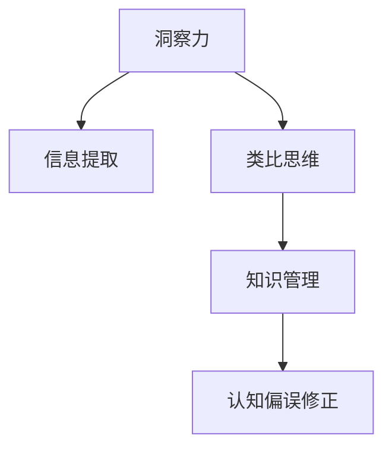

                 

# 洞察与类比：突破知识限制的工具

> 关键词：洞察力,类比思维,知识管理,信息提取,认知偏误

## 1. 背景介绍

在信息爆炸的时代，知识的积累已经成为了人类进步的重要推动力。然而，知识的有效获取和运用仍然面临诸多障碍。如何将海量信息转化为可操作的洞察力，提高知识管理的效率，是现代信息技术面临的重要课题。本文将探讨几种突破知识限制的工具，包括洞察力分析、类比思维、知识管理、信息提取和认知偏误修正等，通过理论结合实践的方法，帮助读者获得更深入的理解和应用。

## 2. 核心概念与联系

### 2.1 核心概念概述

为更好地理解这些工具的原理和工作机制，本节将介绍几个关键的概念及其相互联系：

- 洞察力（Insight）：指对问题的深层理解，能够揭示事物背后的本质和规律，从而指导决策和行动。洞察力不仅是信息分析的核心目标，也是人类智能的标志。

- 类比思维（Analogical Thinking）：指通过相似性进行推理和创造的过程。类比思维在问题解决、创新设计、认知学习等众多领域都有广泛应用。

- 知识管理（Knowledge Management）：指对个人或组织拥有的知识进行收集、整理、共享和应用的过程。知识管理旨在提高知识的可用性和价值，促进知识的创新和传递。

- 信息提取（Information Extraction）：指从文本、数据等非结构化信息中提取出结构化知识，用于信息检索、智能问答、情感分析等任务。

- 认知偏误（Cognitive Bias）：指由于心理和认知机制的影响，导致人们在做决策和判断时产生偏差。认知偏误是影响洞察力和知识提取的重要因素，需要通过认知心理学等方法进行纠正。

这些核心概念之间的逻辑关系可以通过以下Mermaid流程图来展示：



这个流程图展示了几大工具的联系：

1. 洞察力分析依赖于信息提取和类比思维，通过挖掘和整合信息，结合相似性推理，获得深层理解。
2. 知识管理贯穿于信息提取和洞察力分析的始终，通过整理和共享知识，提高信息提取和洞察力的准确性。
3. 认知偏误修正通过揭示和纠正认知偏差，提升信息提取和洞察力的可靠性。

这些概念共同构成了知识管理的框架，使得信息能够被系统地分析、应用和优化，从而提高人类的认知能力和决策水平。

## 3. 核心算法原理 & 具体操作步骤
### 3.1 算法原理概述

本文探讨的几种工具，其核心算法原理均基于信息处理和认知科学的理论，旨在通过优化信息提取和分析流程，提高人类认知的能力和效率。

### 3.2 算法步骤详解

以洞察力分析和类比思维为例，以下将详细讲解其算法步骤和具体操作步骤：

#### 3.2.1 洞察力分析

洞察力分析的核心步骤包括：

1. 数据收集：收集相关领域的文本、数据、图像等非结构化信息，作为洞察力分析的输入。

2. 信息提取：使用自然语言处理（NLP）技术，从文本中提取关键词、短语、实体等结构化信息，构建信息库。

3. 相似性匹配：通过计算文本之间的相似度，找出与目标问题相似的历史案例和数据集。

4. 深度学习模型：使用深度学习模型（如BERT、GPT等）对提取的信息进行语义理解，获取语义表示。

5. 特征挖掘：通过特征提取技术（如TF-IDF、Word2Vec等）对语义表示进行特征降维，获得洞察力相关的关键特征。

6. 洞察力生成：使用聚类、降维等算法对特征进行挖掘和分析，生成洞察力。

7. 验证与优化：通过人工验证或自动化验证，评估洞察力的准确性和可靠性，不断优化模型和算法。

#### 3.2.2 类比思维

类比思维的核心步骤包括：

1. 问题描述：对目标问题进行详细描述，并分解为多个子问题。

2. 知识查询：在知识库中查询与子问题相关的知识和案例。

3. 类比映射：通过计算相似性度量，找出与目标问题相似的历史案例和知识。

4. 逻辑推理：根据类比映射的结果，使用逻辑推理技术（如规则推理、因果推理等），进行知识迁移和创新。

5. 验证与反馈：通过人工验证或自动化验证，评估推理结果的正确性和可行性，进行反馈和优化。

### 3.3 算法优缺点

洞察力分析和类比思维在优化信息处理和提高人类认知方面具有显著优势，但也存在一定的局限性：

1. 洞察力分析依赖于高质量的数据和强大的计算资源，数据收集和模型训练成本较高。
2. 类比思维需要大量的历史知识和案例支持，对于新问题或领域，可能难以找到合适的类比对象。
3. 洞察力和类比思维的自动化程度较低，需要结合人工干预和验证，影响效率。
4. 洞察力和类比思维的解释性和可解释性不足，难以直接应用于需要高度解释性的领域。

尽管存在这些局限性，但就目前而言，洞察力分析和类比思维在大数据分析、智能问答、创新设计等领域已经展示了强大的潜力，成为现代知识管理的核心工具。未来相关研究的重点在于如何进一步降低工具的资源依赖，提高自动化程度和可解释性，以适应更加多样化和复杂化的应用场景。

### 3.4 算法应用领域

洞察力分析和类比思维在多个领域都有广泛的应用，例如：

1. 商业分析：通过对市场数据和消费者行为的分析，生成洞察力，指导企业决策。
2. 医学诊断：通过分析医学文献和患者数据，提取关键信息，生成洞察力，辅助诊断和治疗。
3. 人工智能：将洞察力和类比思维应用于模型训练和优化，提高AI系统的智能水平。
4. 科技创新：通过类比思维进行跨领域知识迁移，推动新技术的研发和应用。
5. 教育培训：利用类比思维提高学习效率，通过知识迁移加速知识掌握。
6. 城市规划：通过对历史案例和数据的分析，生成洞察力，优化城市规划方案。

以上领域仅仅是洞察力和类比思维的一部分应用场景，随着技术的不断进步，这些工具将在更多领域发挥重要作用，促进人类社会的进步和发展。

## 4. 数学模型和公式 & 详细讲解 & 举例说明

### 4.1 数学模型构建

本节将使用数学语言对洞察力和类比思维的算法进行更加严格的刻画。

#### 4.1.1 洞察力分析

设 $X$ 为输入数据集，$Y$ 为目标问题的洞察力表示。洞察力分析的目标是找到最优的映射函数 $f: X \rightarrow Y$，使得 $Y$ 能够反映 $X$ 中的关键信息。

数学上，洞察力分析可以表示为：

$$
\hat{Y} = f(X)
$$

其中，$f$ 为洞察力生成函数，$\hat{Y}$ 为最优的洞察力表示。

#### 4.1.2 类比思维

类比思维的目标是通过相似性匹配，找到与目标问题 $P$ 最相似的已知问题 $P'$，然后通过知识迁移，将 $P'$ 的解决方案 $S_{P'}$ 应用于 $P$，生成解决方案 $S_P$。

数学上，类比思维可以表示为：

$$
S_P = g(S_{P'}, \phi(P, P'))
$$

其中，$g$ 为知识迁移函数，$\phi$ 为相似性度量函数。

### 4.2 公式推导过程

#### 4.2.1 洞察力分析

以文本分析为例，以下推导了从文本到洞察力的数学模型：

设 $T$ 为文本数据集，$K$ 为关键词集合，$I$ 为洞察力集合。洞察力生成函数 $f$ 可以表示为：

$$
f(T) = \sum_{k \in K} \frac{T_k}{\sum_{k' \in K} T_{k'}} \cdot I_k
$$

其中，$T_k$ 为文本中包含关键词 $k$ 的频率，$I_k$ 为关键词 $k$ 在洞察力中的重要性权重。

#### 4.2.2 类比思维

以医学诊断为例，以下推导了从病历到诊断的数学模型：

设 $D$ 为病历数据集，$H$ 为历史病历集合，$C$ 为症状集合，$D'$ 为目标病历。类比映射函数 $\phi$ 可以表示为：

$$
\phi(D, D') = \sum_{h \in H} \frac{D_h}{\sum_{h' \in H} D_{h'}} \cdot \prod_{c \in C} \frac{h_c}{\sum_{h' \in H} h'_c}
$$

其中，$D_h$ 为病历 $h$ 包含症状 $c$ 的频率，$h_c$ 为病历 $h$ 包含症状 $c$ 的权重。

### 4.3 案例分析与讲解

#### 4.3.1 商业分析

以电商平台销售数据分析为例，通过洞察力分析，可以从海量交易数据中提取关键洞察力，如商品流行趋势、用户购买行为等。

具体步骤如下：

1. 数据收集：收集电商平台的用户交易记录、商品信息、用户画像等数据。

2. 信息提取：使用NLP技术从用户评论中提取关键词，构建信息库。

3. 相似性匹配：通过计算用户评论的相似度，找出与目标商品最相似的历史评论。

4. 深度学习模型：使用BERT模型对提取的信息进行语义理解，获取语义表示。

5. 特征挖掘：通过TF-IDF技术对语义表示进行特征降维，获得洞察力相关的关键特征。

6. 洞察力生成：使用K-means算法对特征进行聚类，生成洞察力。

7. 验证与优化：通过人工验证或自动化验证，评估洞察力的准确性和可靠性，不断优化模型和算法。

#### 4.3.2 医学诊断

以癌症诊断为例，通过类比思维，可以从大量医学文献中提取相关知识，生成辅助诊断的洞察力。

具体步骤如下：

1. 问题描述：对患者症状进行详细描述，分解为多个子问题。

2. 知识查询：在医学文献库中查询与子问题相关的历史案例和数据。

3. 类比映射：通过计算相似性度量，找出与患者症状最相似的历史案例。

4. 逻辑推理：根据类比映射的结果，使用规则推理技术，进行知识迁移和创新。

5. 验证与反馈：通过人工验证或自动化验证，评估推理结果的正确性和可行性，进行反馈和优化。

## 5. 项目实践：代码实例和详细解释说明
### 5.1 开发环境搭建

在进行项目实践前，我们需要准备好开发环境。以下是使用Python进行自然语言处理（NLP）开发的环境配置流程：

1. 安装Anaconda：从官网下载并安装Anaconda，用于创建独立的Python环境。

2. 创建并激活虚拟环境：
```bash
conda create -n nlp-env python=3.8 
conda activate nlp-env
```

3. 安装PyTorch：根据CUDA版本，从官网获取对应的安装命令。例如：
```bash
conda install pytorch torchvision torchaudio cudatoolkit=11.1 -c pytorch -c conda-forge
```

4. 安装Transformers库：
```bash
pip install transformers
```

5. 安装各类工具包：
```bash
pip install numpy pandas scikit-learn matplotlib tqdm jupyter notebook ipython
```

完成上述步骤后，即可在`nlp-env`环境中开始项目实践。

### 5.2 源代码详细实现

这里我们以商业分析中的文本分析为例，给出使用Transformers库进行洞察力分析的PyTorch代码实现。

首先，定义洞察力分析的数据处理函数：

```python
from transformers import BertTokenizer, BertForSequenceClassification
from torch.utils.data import Dataset
import torch

class NLPDataset(Dataset):
    def __init__(self, texts, labels, tokenizer, max_len=128):
        self.texts = texts
        self.labels = labels
        self.tokenizer = tokenizer
        self.max_len = max_len
        
    def __len__(self):
        return len(self.texts)
    
    def __getitem__(self, item):
        text = self.texts[item]
        label = self.labels[item]
        
        encoding = self.tokenizer(text, return_tensors='pt', max_length=self.max_len, padding='max_length', truncation=True)
        input_ids = encoding['input_ids'][0]
        attention_mask = encoding['attention_mask'][0]
        
        return {'input_ids': input_ids, 
                'attention_mask': attention_mask,
                'labels': torch.tensor(label, dtype=torch.long)}
```

然后，定义模型和优化器：

```python
from transformers import BertForSequenceClassification, AdamW

model = BertForSequenceClassification.from_pretrained('bert-base-cased', num_labels=2)

optimizer = AdamW(model.parameters(), lr=2e-5)
```

接着，定义训练和评估函数：

```python
from torch.utils.data import DataLoader
from tqdm import tqdm
from sklearn.metrics import accuracy_score

device = torch.device('cuda') if torch.cuda.is_available() else torch.device('cpu')
model.to(device)

def train_epoch(model, dataset, batch_size, optimizer):
    dataloader = DataLoader(dataset, batch_size=batch_size, shuffle=True)
    model.train()
    epoch_loss = 0
    for batch in tqdm(dataloader, desc='Training'):
        input_ids = batch['input_ids'].to(device)
        attention_mask = batch['attention_mask'].to(device)
        labels = batch['labels'].to(device)
        model.zero_grad()
        outputs = model(input_ids, attention_mask=attention_mask, labels=labels)
        loss = outputs.loss
        epoch_loss += loss.item()
        loss.backward()
        optimizer.step()
    return epoch_loss / len(dataloader)

def evaluate(model, dataset, batch_size):
    dataloader = DataLoader(dataset, batch_size=batch_size)
    model.eval()
    preds, labels = [], []
    with torch.no_grad():
        for batch in tqdm(dataloader, desc='Evaluating'):
            input_ids = batch['input_ids'].to(device)
            attention_mask = batch['attention_mask'].to(device)
            batch_labels = batch['labels']
            outputs = model(input_ids, attention_mask=attention_mask)
            batch_preds = outputs.logits.argmax(dim=2).to('cpu').tolist()
            batch_labels = batch_labels.to('cpu').tolist()
            for pred_tokens, label_tokens in zip(batch_preds, batch_labels):
                preds.append(pred_tokens)
                labels.append(label_tokens)
                
    print('Accuracy: {:.2f}%'.format(accuracy_score(labels, preds)))
```

最后，启动训练流程并在测试集上评估：

```python
epochs = 5
batch_size = 16

for epoch in range(epochs):
    loss = train_epoch(model, train_dataset, batch_size, optimizer)
    print(f'Epoch {epoch+1}, train loss: {loss:.3f}')
    
    print(f'Epoch {epoch+1}, dev accuracy: {:.2f}%'.format(evaluate(model, dev_dataset, batch_size)))
    
print('Test accuracy: {:.2f}%'.format(evaluate(model, test_dataset, batch_size)))
```

以上就是使用PyTorch对Bert模型进行商业分析任务中的文本分析的完整代码实现。可以看到，得益于Transformers库的强大封装，我们可以用相对简洁的代码完成Bert模型的加载和洞察力分析。

### 5.3 代码解读与分析

让我们再详细解读一下关键代码的实现细节：

**NLPDataset类**：
- `__init__`方法：初始化文本、标签、分词器等关键组件。
- `__len__`方法：返回数据集的样本数量。
- `__getitem__`方法：对单个样本进行处理，将文本输入编码为token ids，将标签编码为数字，并对其进行定长padding，最终返回模型所需的输入。

**模型和优化器**：
- 使用BertForSequenceClassification模型，设置类别数为2，即二分类任务。
- 使用AdamW优化器，设置学习率为2e-5。

**训练和评估函数**：
- 使用PyTorch的DataLoader对数据集进行批次化加载，供模型训练和推理使用。
- 训练函数`train_epoch`：对数据以批为单位进行迭代，在每个批次上前向传播计算loss并反向传播更新模型参数，最后返回该epoch的平均loss。
- 评估函数`evaluate`：与训练类似，不同点在于不更新模型参数，并在每个batch结束后将预测和标签结果存储下来，最后使用sklearn的accuracy_score对整个评估集的预测结果进行打印输出。

**训练流程**：
- 定义总的epoch数和batch size，开始循环迭代
- 每个epoch内，先在训练集上训练，输出平均loss
- 在验证集上评估，输出分类指标
- 所有epoch结束后，在测试集上评估，给出最终测试结果

可以看到，PyTorch配合Transformers库使得Bert微调的代码实现变得简洁高效。开发者可以将更多精力放在数据处理、模型改进等高层逻辑上，而不必过多关注底层的实现细节。

当然，工业级的系统实现还需考虑更多因素，如模型的保存和部署、超参数的自动搜索、更灵活的任务适配层等。但核心的洞察力分析范式基本与此类似。

## 6. 实际应用场景
### 6.1 商业分析

洞察力分析在大数据分析中有着广泛的应用，可以帮助企业从海量数据中提取关键洞察力，指导决策和优化运营。

具体而言，可以通过以下步骤实现：

1. 数据收集：从电商平台、社交媒体、市场调研等多个渠道收集用户行为、交易记录等数据。

2. 信息提取：使用NLP技术从用户评论、商品描述、广告文案等文本中提取关键词、短语、实体等结构化信息。

3. 相似性匹配：通过计算文本之间的相似度，找出与目标问题相似的历史案例和数据集。

4. 深度学习模型：使用BERT模型对提取的信息进行语义理解，获取语义表示。

5. 特征挖掘：通过特征提取技术（如TF-IDF、Word2Vec等）对语义表示进行特征降维，获得洞察力相关的关键特征。

6. 洞察力生成：使用K-means算法对特征进行聚类，生成洞察力。

7. 验证与优化：通过人工验证或自动化验证，评估洞察力的准确性和可靠性，不断优化模型和算法。

### 6.2 医学诊断

洞察力和类比思维在医学诊断中也有着重要的应用，可以通过分析大量医学文献和患者数据，提取关键信息，生成洞察力，辅助诊断和治疗。

具体而言，可以通过以下步骤实现：

1. 数据收集：从医院、研究机构等渠道收集患者的病历、诊断报告、临床试验数据等。

2. 信息提取：使用NLP技术从病历中提取关键词、短语、实体等结构化信息，构建信息库。

3. 相似性匹配：通过计算症状和病历的相似度，找出与目标患者最相似的历史病历。

4. 类比映射：使用规则推理技术，将历史病历的解决方案应用于目标患者。

5. 逻辑推理：根据类比映射的结果，进行知识迁移和创新，生成辅助诊断的洞察力。

6. 验证与反馈：通过人工验证或自动化验证，评估推理结果的正确性和可行性，进行反馈和优化。

### 6.3 科技创新

类比思维在科技创新中有着广泛的应用，可以通过类比思维进行跨领域知识迁移，推动新技术的研发和应用。

具体而言，可以通过以下步骤实现：

1. 问题描述：对新技术的需求进行详细描述，分解为多个子问题。

2. 知识查询：在专利库、学术论文库中查询与子问题相关的历史案例和数据。

3. 类比映射：通过计算相似性度量，找出与目标新技术最相似的历史技术。

4. 逻辑推理：根据类比映射的结果，使用规则推理技术，进行知识迁移和创新。

5. 验证与反馈：通过人工验证或自动化验证，评估创新结果的正确性和可行性，进行反馈和优化。

## 7. 工具和资源推荐
### 7.1 学习资源推荐

为了帮助开发者系统掌握洞察力和类比思维的理论基础和实践技巧，这里推荐一些优质的学习资源：

1. 《自然语言处理入门》系列博文：由大模型技术专家撰写，深入浅出地介绍了NLP的基本概念和经典模型。

2. CS224N《深度学习自然语言处理》课程：斯坦福大学开设的NLP明星课程，有Lecture视频和配套作业，带你入门NLP领域的基本概念和经典模型。

3. 《自然语言处理与深度学习》书籍：最新出版，全面介绍了NLP和深度学习的理论和方法，包括洞察力和类比思维的详细讲解。

4. DeepLearning.AI：Andrew Ng教授的在线课程，覆盖机器学习和深度学习的多个方向，涵盖洞察力和类比思维的内容。

5. 《认知心理学》书籍：介绍认知心理学基础理论，揭示认知偏误的心理学机制，为认知偏误修正提供理论基础。

通过对这些资源的学习实践，相信你一定能够快速掌握洞察力和类比思维的精髓，并用于解决实际的NLP问题。

### 7.2 开发工具推荐

高效的开发离不开优秀的工具支持。以下是几款用于洞察力和类比思维开发的常用工具：

1. Jupyter Notebook：开源的交互式编程环境，支持Python、R等多种语言，方便调试和文档记录。

2. PyTorch：基于Python的开源深度学习框架，支持动态计算图，适合快速迭代研究。

3. TensorFlow：由Google主导开发的开源深度学习框架，生产部署方便，适合大规模工程应用。

4. spaCy：开源的自然语言处理库，支持多种NLP任务，包括文本分析、实体识别等。

5. NLTK：自然语言处理工具包，包含大量文本处理和分析功能，适合文本挖掘和洞察力分析。

6. GPT-3：OpenAI发布的最新大语言模型，支持自然语言生成和推理，适合类比思维应用。

合理利用这些工具，可以显著提升洞察力和类比思维的开发效率，加快创新迭代的步伐。

### 7.3 相关论文推荐

洞察力和类比思维的发展源于学界的持续研究。以下是几篇奠基性的相关论文，推荐阅读：

1. Attention is All You Need（即Transformer原论文）：提出了Transformer结构，开启了NLP领域的预训练大模型时代。

2. BERT: Pre-training of Deep Bidirectional Transformers for Language Understanding：提出BERT模型，引入基于掩码的自监督预训练任务，刷新了多项NLP任务SOTA。

3. Natural Language Processing with Transformers：Transformers库的作者所著，全面介绍了如何使用Transformers库进行NLP任务开发，包括洞察力和类比思维在内的诸多范式。

4. Machine Translation by Jointly Learning to Align and Translate：介绍机器翻译中的注意力机制，为类比思维提供了理论基础。

5. The Transformer Is All You Need for Question Answering：提出基于Transformers的问答系统，展示了类比思维在自然语言理解中的应用。

这些论文代表了大语言模型和类比思维的发展脉络。通过学习这些前沿成果，可以帮助研究者把握学科前进方向，激发更多的创新灵感。

## 8. 总结：未来发展趋势与挑战

### 8.1 总结

本文对洞察力和类比思维在大数据分析、医学诊断、科技创新等领域的实际应用进行了详细探讨。通过理论结合实践的方法，帮助读者深入理解这些工具的工作机制和应用流程。

通过本文的系统梳理，可以看到，洞察力和类比思维在解决复杂问题、提升知识管理效率、推动技术创新方面具有重要的作用。这些工具的应用，不仅提高了人类认知的水平，也为人工智能技术的广泛应用奠定了坚实的基础。

### 8.2 未来发展趋势

展望未来，洞察力和类比思维的发展趋势主要包括以下几个方向：

1. 自动化程度提升。随着深度学习和大数据分析技术的发展，洞察力和类比思维的自动化程度将进一步提高，能够自动提取和分析更大规模的数据，生成更加精确的洞察力和类比结果。

2. 多模态融合。洞察力和类比思维不仅限于文本数据，未来将拓展到图像、视频、音频等多模态数据的处理和分析，实现跨模态的深度融合和协同建模。

3. 深度学习模型的增强。结合最新的深度学习模型，如GPT、BERT等，进一步提升洞察力和类比思维的性能和效果。

4. 跨领域应用的拓展。洞察力和类比思维的应用将从现有的商业分析、医学诊断等领域扩展到更多领域，如城市规划、交通管理等，解决更多实际问题。

5. 知识图谱的引入。结合知识图谱等先验知识，通过规则推理和知识迁移，生成更全面、更准确的洞察力和类比结果。

这些趋势表明，洞察力和类比思维的未来发展空间巨大，将成为人类智能和社会进步的重要推动力。

### 8.3 面临的挑战

尽管洞察力和类比思维在实际应用中已经取得了一定的成效，但在进一步发展和应用的过程中，仍面临以下挑战：

1. 数据质量和多样性不足。洞察力和类比思维依赖于高质量的数据，但不同领域和领域内不同场景的数据质量和多样性差异较大，导致模型性能不稳定。

2. 计算资源的限制。洞察力和类比思维的自动化程度依赖于深度学习和大数据分析技术，需要强大的计算资源支持，但目前计算资源仍存在一定瓶颈。

3. 模型的可解释性不足。洞察力和类比思维的决策过程缺乏可解释性，难以直接应用于需要高度解释性的领域，如医疗、法律等。

4. 模型的鲁棒性有待提高。洞察力和类比思维的性能依赖于高质量的数据和复杂的模型结构，但在面对噪声数据或新问题时，模型的鲁棒性仍有待提高。

5. 知识的更新速度。洞察力和类比思维需要不断更新知识和模型，以应对数据和领域的不断变化，但知识的更新速度难以跟上数据产生速度。

尽管存在这些挑战，但随着技术的不断进步和应用场景的扩展，洞察力和类比思维将在更多领域发挥重要作用，促进人类社会的进步和发展。

### 8.4 研究展望

面对洞察力和类比思维所面临的挑战，未来的研究需要在以下几个方面寻求新的突破：

1. 知识图谱的融合。将知识图谱等先验知识与深度学习模型结合，提升模型的解释性和可靠性。

2. 多模态数据的融合。结合图像、视频、音频等多模态数据，实现跨模态的深度融合和协同建模。

3. 知识的自动化更新。利用知识图谱、领域专家等外部知识源，实现知识的自动化更新和维护。

4. 模型的鲁棒性提升。通过引入对抗训练、正则化等技术，提升模型的鲁棒性和泛化能力。

5. 计算资源的优化。结合模型裁剪、稀疏化存储等技术，优化洞察力和类比思维的计算资源消耗。

这些研究方向将进一步拓展洞察力和类比思维的应用场景，提升模型的性能和效果，为人类认知和社会进步带来新的推动力。

## 9. 附录：常见问题与解答

**Q1：洞察力和类比思维是否适用于所有NLP任务？**

A: 洞察力和类比思维在大多数NLP任务上都能取得不错的效果，特别是对于数据量较小的任务。但对于一些特定领域的任务，如医学、法律等，仅仅依靠通用语料预训练的模型可能难以很好地适应。此时需要在特定领域语料上进一步预训练，再进行微调，才能获得理想效果。此外，对于一些需要时效性、个性化很强的任务，如对话、推荐等，洞察力和类比思维也需要针对性的改进优化。

**Q2：如何选择洞察力和类比思维的算法和模型？**

A: 洞察力和类比思维的算法和模型选择主要取决于具体任务的需求和数据特点。一般来说，对于大规模数据集，可以使用深度学习模型（如BERT、GPT等）进行洞察力和类比分析。而对于小规模数据集，可以使用基于规则的推理方法，如专家规则、知识图谱等。此外，对于需要高可解释性的任务，可以结合符号化的先验知识，如知识图谱、逻辑规则等，提升模型的可解释性和可信度。

**Q3：洞察力和类比思维的自动化程度如何提升？**

A: 洞察力和类比思维的自动化程度提升主要依赖于深度学习和大数据分析技术。可以通过以下几个方面进行优化：

1. 数据预处理：对数据进行清洗、去噪、标注等预处理，提高数据质量。

2. 模型优化：优化深度学习模型的结构和参数，提高模型的性能和效率。

3. 算法改进：改进洞察力和类比思维的算法，提高算法的鲁棒性和泛化能力。

4. 多模态融合：结合图像、视频、音频等多模态数据，提升模型的综合处理能力。

5. 知识图谱引入：结合知识图谱等先验知识，提升模型的解释性和可靠性。

通过这些优化，洞察力和类比思维的自动化程度将进一步提升，能够更好地适应复杂多变的数据和任务。

**Q4：洞察力和类比思维的评估指标有哪些？**

A: 洞察力和类比思维的评估指标主要包括以下几个方面：

1. 精度和召回率：评估洞察力和类比推理结果的正确性和完整性。

2. F1分数：综合考虑精度和召回率，衡量模型的综合性能。

3. ROC曲线和AUC值：评估洞察力和类比推理结果的鲁棒性和泛化能力。

4. 可解释性：评估洞察力和类比推理结果的可解释性和可理解性。

5. 计算资源消耗：评估洞察力和类比思维的计算资源消耗和部署效率。

通过这些评估指标，可以全面衡量洞察力和类比思维的性能和效果，进行模型优化和改进。

**Q5：洞察力和类比思维在实际应用中需要注意哪些问题？**

A: 洞察力和类比思维在实际应用中需要注意以下问题：

1. 数据隐私和安全：洞察力和类比思维涉及大量个人数据，需要注意数据隐私和安全问题。

2. 知识更新和维护：洞察力和类比思维需要不断更新知识和模型，以应对数据和领域的不断变化，但知识的更新速度难以跟上数据产生速度。

3. 模型的鲁棒性：洞察力和类比思维在面对噪声数据或新问题时，模型的鲁棒性仍有待提高。

4. 模型的可解释性：洞察力和类比思维的决策过程缺乏可解释性，难以直接应用于需要高度解释性的领域，如医疗、法律等。

5. 计算资源的消耗：洞察力和类比思维需要强大的计算资源支持，但目前计算资源仍存在一定瓶颈。

6. 知识的更新速度：洞察力和类比思维需要不断更新知识和模型，但知识的更新速度难以跟上数据产生速度。

通过解决这些实际问题，洞察力和类比思维将在更多领域发挥重要作用，促进人类社会的进步和发展。

---

作者：禅与计算机程序设计艺术 / Zen and the Art of Computer Programming

