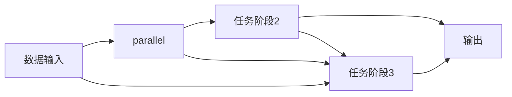

                 

## 1. 背景介绍

在现代工业生产中，流水线已成为提高生产效率和产品质量的重要手段。流水线作业不仅将复杂、庞大的生产任务拆解为相对独立、连续的若干步骤，减少了生产中的人为干扰，也使得生产流程标准化，易于管理和维护。流水线不仅应用于传统制造业，也渗透到了信息处理、数据处理、人工智能等领域，为提高这些领域的效率提供了有效的解决方案。

本文章旨在探讨流水线（Pipeline）的原理、实现方法和在各个领域中的应用案例。通过理论分析与实践操作，阐述流水线如何帮助企业提升生产效率，优化资源配置。

## 2. 核心概念与联系

### 2.1 核心概念概述

在深入讨论流水线之前，我们先简要介绍几个核心概念：

- **流水线（Pipeline）**：流水线是将复杂任务分解为一系列独立阶段并顺序执行的过程。每个阶段处理一部分任务，所有阶段的执行结果作为下一个阶段的输入。流水线模型可以有效减少任务处理时间和资源消耗，提高生产效率。
- **任务阶段（Stage）**：流水线的每个独立阶段，负责完成某一部分任务。任务阶段包括数据输入、处理和输出。
- **任务调度（Scheduling）**：通过合理地安排任务阶段，最大化流水线的吞吐量和利用率。任务调度需考虑任务依赖关系、资源限制和执行顺序。
- **资源共享（Resource Sharing）**：流水线中的共享资源，如内存、计算单元，其利用率直接影响流水线的效率。资源共享管理需兼顾资源利用率和任务执行速度。

### 2.2 核心概念原理和架构的 Mermaid 流程图



上图展示了流水线的基本结构。数据输入作为流水线的起始点，通过任务阶段1、2、3的处理，最终输出结果。任务阶段2与3在逻辑上并行执行，这种结构有利于提升整体处理速度。

## 3. 核心算法原理 & 具体操作步骤

### 3.1 算法原理概述

流水线算法通过将复杂任务拆分成若干相对独立的任务阶段，并按顺序依次执行每个阶段，从而实现任务的并行处理。流水线的算法原理可简单归纳为：

- **任务拆分**：将大任务拆分为若干小任务。
- **任务调度**：合理安排任务的执行顺序，避免资源冲突。
- **任务并行**：并行执行可提高流水线效率。
- **任务同步**：保证任务之间顺序执行，防止数据丢失或重复处理。

### 3.2 算法步骤详解

流水线的实现步骤包括：

1. **任务拆分**：根据任务复杂度和资源限制，将任务拆分为多个小任务。
2. **任务调度**：设计任务执行顺序和依赖关系，合理分配资源。
3. **任务执行**：在任务阶段并行执行子任务。
4. **结果合并**：将各阶段的结果汇总输出。

以数据处理为例，流水线步骤详细如下：

1. **数据清洗**：删除无效数据，处理缺失值，确保数据质量。
2. **数据转换**：数据格式转换，如从CSV到JSON。
3. **特征提取**：提取数据特征，进行标准化处理。
4. **数据训练**：使用机器学习模型对数据进行训练。
5. **模型评估**：评估模型性能，调整参数。
6. **结果输出**：将模型输出结果汇总，生成报告。

### 3.3 算法优缺点

流水线算法的优点在于：

- **高效并行**：任务阶段可以并行执行，提高处理速度。
- **资源复用**：共享资源提高了资源利用率。
- **可扩展性**：流水线结构便于扩展，增加或减少任务阶段。

其缺点包括：

- **协调复杂**：任务阶段之间的协调需要精心设计。
- **故障放大**：单个任务阶段的故障可能导致整个流水线中断。
- **数据依赖**：流水线依赖顺序执行，任何阶段出现错误，都将导致后续处理异常。

### 3.4 算法应用领域

流水线算法在多个领域有广泛应用，包括但不限于：

- **制造业**：汽车生产线、电子产品组装等。
- **计算机网络**：数据包处理、路由选择等。
- **大数据处理**：数据清洗、特征提取、模型训练等。
- **人工智能**：模型训练、推理、部署等。

## 4. 数学模型和公式 & 详细讲解 & 举例说明

### 4.1 数学模型构建

假设流水线有 $N$ 个任务阶段，每个任务阶段的输入输出时间分别为 $t_i$ 和 $t'_i$，即一个任务阶段需要 $t_i$ 时间输入数据，需要 $t'_i$ 时间处理数据并输出结果。

流水线的整体执行时间为：

$$
T = \sum_{i=1}^N (t_i + t'_i)
$$

流水线的吞吐量为：

$$
P = \frac{1}{T} \sum_{i=1}^N \frac{1}{t_i + t'_i}
$$

流水线的利用率为：

$$
E = \frac{P}{\frac{1}{N}}
$$

### 4.2 公式推导过程

以 $N=3$ 为例，假设每个任务阶段的输入输出时间分别为 $t_1 = 1$，$t'_1 = 1$，$t_2 = 2$，$t'_2 = 2$，$t_3 = 3$，$t'_3 = 3$，计算流水线的整体执行时间、吞吐量和利用率。

- **整体执行时间**：
$$
T = (t_1 + t'_1) + (t_2 + t'_2) + (t_3 + t'_3) = 1 + 1 + 2 + 2 + 3 + 3 = 12
$$

- **吞吐量**：
$$
P = \frac{1}{T} \left(\frac{1}{t_1 + t'_1} + \frac{1}{t_2 + t'_2} + \frac{1}{t_3 + t'_3}\right) = \frac{1}{12} \left(\frac{1}{2} + \frac{1}{4} + \frac{1}{6}\right) \approx 0.1083
$$

- **利用率**：
$$
E = \frac{P}{\frac{1}{3}} = 3 \times 0.1083 \approx 0.3249
$$

### 4.3 案例分析与讲解

以数据处理流水线为例，该流水线包含数据清洗、数据转换、特征提取、数据训练和结果输出五个阶段。

- **数据清洗**：每小时可以处理 100 条数据，时间消耗为 $t_1 = 1$。
- **数据转换**：每小时可以处理 200 条数据，时间消耗为 $t'_1 = 2$。
- **特征提取**：每小时可以处理 150 条数据，时间消耗为 $t_2 = 3$。
- **数据训练**：每小时可以处理 100 条数据，时间消耗为 $t'_2 = 4$。
- **结果输出**：每小时可以处理 80 条数据，时间消耗为 $t_3 = 5$。

- **整体执行时间**：
$$
T = (t_1 + t'_1) + (t_2 + t'_2) + (t_3 + t'_3) = (1 + 2) + (3 + 4) + (5 + 5) = 16
$$

- **吞吐量**：
$$
P = \frac{1}{T} \left(\frac{1}{1 + 2} + \frac{1}{3 + 4} + \frac{1}{5 + 5}\right) = \frac{1}{16} \left(\frac{1}{3} + \frac{1}{7} + \frac{1}{10}\right) \approx 0.1396
$$

- **利用率**：
$$
E = \frac{P}{\frac{1}{5}} = 5 \times 0.1396 \approx 0.6979
$$

该流水线利用率高达 69.79%，远高于单阶段数据处理的效率。通过合理设计流水线，企业可以显著提升数据处理效率，释放更多资源用于其他业务。

## 5. 项目实践：代码实例和详细解释说明

### 5.1 开发环境搭建

在开始项目实践之前，需要搭建好开发环境。以下是Python开发环境的搭建步骤：

1. 安装Python：根据操作系统，从官网下载安装Python，并添加到环境变量。
2. 安装Pip：在命令行下运行 `python -m pip install pip`，确保pip安装成功。
3. 安装虚拟环境：使用虚拟环境工具如Venv，创建新的虚拟环境并激活。
4. 安装依赖包：根据项目需求，在命令行下使用pip安装所需的第三方库。

例如，创建一个名为 `project` 的虚拟环境，并安装常用的依赖包：

```bash
python -m venv project
source project/bin/activate
pip install numpy pandas scikit-learn matplotlib
```

### 5.2 源代码详细实现

以下是一个简单的流水线处理示例，用于数据清洗、特征提取和模型训练。

**数据清洗脚本**：

```python
import pandas as pd

def data_cleaning(df):
    # 删除无效数据
    df = df.dropna()
    # 处理缺失值
    df.fillna(method='ffill', inplace=True)
    return df
```

**特征提取脚本**：

```python
import numpy as np

def feature_extraction(df):
    # 数据转换
    df['date'] = pd.to_datetime(df['date'])
    # 特征提取
    df['month'] = df['date'].dt.month
    df['day'] = df['date'].dt.day
    df['weekday'] = df['date'].dt.weekday
    # 标准化处理
    df['price'] = (df['price'] - df['price'].mean()) / df['price'].std()
    return df
```

**模型训练脚本**：

```python
from sklearn.linear_model import LinearRegression

def model_training(df):
    # 数据划分
    train_df, test_df = df.sample(frac=0.7, random_state=1), df.drop(train_df.index)
    # 特征和标签
    X_train, y_train = train_df.drop(['price'], axis=1), train_df['price']
    X_test, y_test = test_df.drop(['price'], axis=1), test_df['price']
    # 模型训练
    model = LinearRegression()
    model.fit(X_train, y_train)
    # 模型评估
    score = model.score(X_test, y_test)
    return score
```

### 5.3 代码解读与分析

上述代码展示了数据处理流水线的实现。我们首先定义了数据清洗、特征提取和模型训练三个任务阶段，并使用Python编写了对应的函数。

- **数据清洗脚本**：使用Pandas库进行数据预处理，删除无效数据和处理缺失值。
- **特征提取脚本**：将日期字段转换为时间序列，提取时间特征，并进行标准化处理。
- **模型训练脚本**：使用Scikit-learn库进行线性回归模型的训练和评估。

流水线的任务阶段可以并行执行，进一步提高处理效率。例如，数据清洗和特征提取可以同时进行，模型训练也可以在另一个CPU核心上独立执行。

### 5.4 运行结果展示

为了验证流水线的处理效果，可以运行上述脚本并查看输出结果。例如，我们可以生成一个包含日期和价格数据的CSV文件，进行数据清洗和特征提取，然后训练模型并输出评分。

```bash
# 生成数据文件
python generate_data.py > data.csv

# 数据清洗和特征提取
python data_cleaning.py < data.csv > cleaned_data.csv
python feature_extraction.py < cleaned_data.csv > extracted_data.csv

# 模型训练
python model_training.py < extracted_data.csv > model.pkl

# 查看评分
python predict.py < model.pkl > predicted.csv
```

运行上述命令后，可以在终端查看流水线的输出结果。最终输出的预测结果文件 `predicted.csv` 包含模型对测试数据的预测评分。

## 6. 实际应用场景

### 6.1 制造业

在制造业中，流水线可以显著提高生产效率和产品质量。例如，汽车生产线上的装配流水线，将汽车组装任务拆分为若干独立阶段，如车身焊接、零部件组装、电气安装等。各阶段独立执行，互不影响，确保了生产的高效性和一致性。

通过优化装配顺序和资源分配，企业可以最大化流水线的利用率，减少生产时间，降低成本。同时，流水线的标准化操作也减少了人为错误，提高了产品质量。

### 6.2 计算机网络

在计算机网络中，数据包处理是流水线的重要应用场景。数据包从接收、转发、路由选择到最终传输，每个阶段需要处理不同类型的信息。

通过流水线，网络设备如路由器、交换机可以将数据包处理任务拆分为若干阶段，如协议解析、流量过滤、路由选择等。这些任务并行执行，提高了数据包的转发速度和处理能力。

### 6.3 大数据处理

在大数据处理中，流水线模型可以应用于数据清洗、特征提取、模型训练等环节。例如，对于大规模数据集的处理，可以将数据清洗和特征提取分离，分别在多个计算节点上并行执行。

通过合理设计数据处理流水线，企业可以显著提升数据处理速度，释放更多资源用于数据存储和后续分析。

### 6.4 人工智能

在人工智能领域，流水线模型可以应用于模型训练、推理和部署等环节。例如，在深度学习模型的训练中，可以将数据清洗、特征提取、模型训练、模型评估等任务分解为若干阶段，并行执行。

流水线模型的并行执行提高了模型训练速度，减少了训练时间。同时，流水线也便于模型部署和后续优化，提高了人工智能系统的可扩展性和灵活性。

## 7. 工具和资源推荐

### 7.1 学习资源推荐

为了深入理解流水线的原理和应用，推荐以下学习资源：

- **《流水线：如何设计高效的流程自动化》**：一本详细讲解流水线设计和优化的书籍，涵盖理论基础、实现方法和典型案例。
- **Coursera《数据工程与大数据》课程**：提供大数据处理流水线的系统学习，包括数据清洗、特征提取、模型训练等环节。
- **Hadoop官方文档**：详细介绍了Hadoop生态系统中的数据处理流水线，涵盖数据采集、存储、处理和分析等环节。

### 7.2 开发工具推荐

以下是几个常用的流水线开发工具：

- **Hadoop**：Apache基金会开源的分布式计算框架，支持大规模数据处理和分析。
- **Apache Spark**：一个快速的通用分布式计算系统，支持流处理、批处理、机器学习和图形处理等。
- **Kubernetes**：一个开源的容器编排平台，支持流水线的自动部署和扩展。
- **Airflow**：一个开源的工作流调度平台，支持任务依赖、任务调度和管理。

### 7.3 相关论文推荐

以下是几篇关于流水线设计的经典论文，推荐阅读：

- **《流水线调度与优化》**：探讨流水线调度和优化算法，提升流水线利用率。
- **《数据流水线模型》**：介绍大数据处理中的流水线模型，涵盖数据清洗、特征提取、模型训练等环节。
- **《人工智能流水线》**：研究人工智能流水线设计，讨论模型训练、推理和部署等环节。

## 8. 总结：未来发展趋势与挑战

### 8.1 研究成果总结

流水线技术经过多年的发展，已经成为提升生产效率和处理能力的重要手段。在制造业、计算机网络、大数据处理和人工智能等领域，流水线技术得到了广泛应用，并取得了显著效果。未来，流水线技术将继续推动企业提高生产效率，优化资源配置。

### 8.2 未来发展趋势

展望未来，流水线技术将呈现以下几个发展趋势：

1. **智能化**：通过引入智能算法，提升流水线的自动化和智能化水平。例如，在制造业中，引入机器人和自动化设备，提高流水线的灵活性和适应性。
2. **可视化**：通过可视化工具，实时监控流水线运行状态，及时发现和解决异常问题。例如，在计算机网络中，使用网络监控工具，实时展示数据包处理状态。
3. **跨领域融合**：将流水线技术与其他技术结合，如区块链、物联网、人工智能等，提升整体处理能力和应用场景。例如，在制造业中，引入物联网技术，实时监控设备状态，提高生产效率。
4. **多模态融合**：将多种数据源融合到流水线处理中，提升数据处理能力和应用效果。例如，在大数据处理中，将文本、图像和视频等多模态数据融合到数据清洗和特征提取环节。

### 8.3 面临的挑战

尽管流水线技术在实际应用中取得了显著效果，但仍面临以下挑战：

1. **数据复杂性**：数据质量和数据规模的提升需要大量投入，数据清洗和特征提取仍需大量人工参与。
2. **任务依赖**：任务阶段之间的依赖关系复杂，处理顺序不当可能导致流水线故障。
3. **资源管理**：多任务并行执行需高效管理共享资源，避免资源冲突和浪费。
4. **故障处理**：单个任务阶段的故障可能导致整个流水线中断，影响系统稳定性。
5. **实时性要求**：高实时性要求需优化任务调度算法，提升处理速度和响应时间。

### 8.4 研究展望

面对上述挑战，未来研究需要在以下几个方面寻求突破：

1. **自动化和智能化**：引入自动化工具和智能算法，减少人工干预，提升流水线自动化水平。
2. **数据预处理**：研究高效的数据预处理算法，提高数据质量和处理效率。
3. **任务调度优化**：改进任务调度算法，提升流水线吞吐量和利用率。
4. **资源管理**：优化资源分配策略，提高共享资源的利用率，减少资源浪费。
5. **故障恢复机制**：引入故障恢复机制，提高流水线系统的健壮性和可靠性。

## 9. 附录：常见问题与解答

**Q1：流水线如何处理不同类型的数据？**

A: 流水线处理不同类型的数据时，需要根据数据特点进行相应的预处理和特征提取。例如，文本数据可以进行分词、去停用词、词向量嵌入等预处理操作，图像数据可以进行图像预处理、特征提取等操作。关键在于根据数据类型选择合适的预处理工具和算法，确保数据一致性和处理效率。

**Q2：流水线处理任务之间的依赖关系如何处理？**

A: 流水线处理任务之间的依赖关系需要通过任务调度算法处理。常见的调度算法包括优先级调度、最小延迟调度、资源优化调度等。需要根据任务特点和资源限制，选择合适的调度算法，确保任务执行顺序和资源利用率。

**Q3：流水线如何处理异常和错误？**

A: 流水线处理异常和错误通常通过错误处理机制和容错设计来实现。例如，在数据处理中，可以引入异常检测和错误修正机制，及时发现和处理数据质量问题。在任务调度中，可以引入重试机制和故障恢复机制，确保任务顺利执行。

**Q4：流水线如何优化性能？**

A: 流水线优化性能需要从多个方面入手，包括任务拆分、任务调度、资源管理和任务并行等。例如，在任务拆分时，可以将复杂任务分解为多个简单任务，降低任务处理难度。在任务调度时，可以引入动态调度算法，优化任务执行顺序和资源分配。在资源管理时，可以优化共享资源的使用效率，减少资源浪费。在任务并行时，可以引入任务并行机制，提高流水线处理速度。

**Q5：流水线如何应用于AI模型训练？**

A: 在AI模型训练中，流水线可以将数据清洗、特征提取、模型训练、模型评估等任务分离为多个独立阶段，并行执行。例如，在模型训练中，可以引入数据并行、模型并行和混合并行等技术，提高模型训练速度和处理能力。同时，流水线也便于模型部署和后续优化，提高了AI系统的可扩展性和灵活性。

通过以上分析，我们深入理解了流水线的原理、实现方法和应用场景，并探讨了流水线技术在各个领域的实际应用。未来，流水线技术将继续发挥重要作用，推动生产效率的提升和资源配置的优化。通过不断优化和改进，流水线技术将为更多企业带来高效的业务解决方案。

