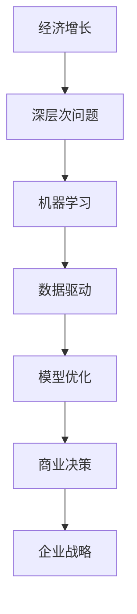

                 

# 深层次问题与经济增长的关系

> 关键词：
- 经济增长
- 深层次问题
- 机器学习
- 数据驱动
- 模型优化
- 商业决策
- 企业战略

## 1. 背景介绍

### 1.1 问题由来
随着全球经济进入新常态，如何保持稳定而持续的经济增长成为各国政府和企业家们关注的焦点。面对国际市场的波动和内部结构调整的双重压力，经济增长不仅需要宏观政策的调控，也需要深层次问题的解决。从数字化转型到产业升级，从绿色发展到大数据驱动，如何利用技术手段破解经济增长难题，是当今时代的重要课题。

### 1.2 问题核心关键点
深层次问题通常涉及到社会、经济、技术和环境等多个维度，需要综合施策。但在这些问题中，数据驱动的商业决策、机器学习模型的优化以及企业战略的制定，是影响经济增长的关键因素。通过技术手段，对数据进行深入分析，优化模型，提高决策效率，是促进经济增长的有效途径。

### 1.3 问题研究意义
研究深层次问题与经济增长的关系，对于理解当前经济发展态势，预测未来增长路径，优化商业决策，具有重要意义。通过对模型和数据进行深入研究，可以揭示经济增长的深层次动因，为政府和企业提供数据支持的决策依据，推动经济实现高质量发展。

## 2. 核心概念与联系

### 2.1 核心概念概述

为更好地理解深层次问题与经济增长的关系，本节将介绍几个密切相关的核心概念：

- 经济增长：是指在一定时期内，一个国家或地区生产总值(GDP)或人均GDP的增长。
- 深层次问题：通常涉及复杂的社会、经济、技术、环境等要素，需要通过数据和技术手段深入分析和解决。
- 机器学习：一种人工智能技术，通过算法模型从数据中学习规律，用于预测、分类、聚类等任务。
- 数据驱动：基于数据的决策过程，通过统计分析和建模，获取精准的决策依据。
- 模型优化：调整模型参数和结构，提高预测准确性和泛化能力。
- 商业决策：企业根据数据和模型结果，制定战略和战术，以实现业务目标。
- 企业战略：企业在长期发展中，为实现愿景和目标而制定的总体规划和行动方案。

这些核心概念之间的逻辑关系可以通过以下Mermaid流程图来展示：



这个流程图展示了一个从经济增长到深层次问题解决，再到机器学习模型优化、商业决策和企业战略制定的全链条。

## 3. 核心算法原理 & 具体操作步骤
### 3.1 算法原理概述

深层次问题与经济增长之间的关系，可以通过数据驱动和模型优化的方式进行分析。以下是对这一过程的详细说明：

1. **数据收集与预处理**：收集与经济增长相关的数据，包括宏观经济指标、行业数据、企业数据等，并进行清洗和标准化处理。
2. **模型选择与构建**：选择合适的机器学习模型，如回归模型、分类模型、时间序列模型等，构建用于分析和预测的模型。
3. **模型训练与优化**：利用收集到的数据，对模型进行训练，通过交叉验证等方法优化模型参数，提高模型的预测准确性和泛化能力。
4. **结果分析与解读**：分析模型输出结果，结合行业专家知识，进行深层次问题的识别和解决。
5. **决策支持与战略制定**：将模型分析结果应用于商业决策和企业战略制定，优化资源配置和业务策略。

### 3.2 算法步骤详解

以下是详细的操作步骤：

**Step 1: 数据收集与预处理**
1. **收集数据**：从官方统计局、行业协会、金融机构、企业报告等渠道获取相关数据。
2. **数据清洗**：去除重复、缺失或异常数据，保证数据质量。
3. **数据标准化**：对时间序列数据进行归一化处理，对特征进行归一化或标准化，以便于模型训练。

**Step 2: 模型选择与构建**
1. **模型选择**：根据问题的性质选择合适的模型，如线性回归、逻辑回归、支持向量机、随机森林等。
2. **模型训练**：将处理后的数据输入模型，进行训练。
3. **模型评估**：使用测试集对模型进行评估，通过指标如准确率、召回率、F1分数等衡量模型性能。
4. **模型优化**：根据评估结果，调整模型参数，如学习率、正则化系数、特征选择等，提高模型性能。

**Step 3: 结果分析与解读**
1. **结果分析**：通过可视化工具如Matplotlib、Seaborn等，对模型输出进行可视化分析。
2. **专家解读**：结合行业专家知识和数据分析结果，识别经济增长的深层次问题，如供需失衡、结构调整、技术创新等。
3. **政策建议**：根据分析结果，提出相应的政策建议，如调整税收政策、优化产业结构、促进技术创新等。

**Step 4: 决策支持与战略制定**
1. **商业决策**：将模型分析结果应用于商业决策，如市场预测、库存管理、产品定价等。
2. **战略制定**：根据商业决策结果，制定长期战略，如业务扩展、市场开拓、技术投资等。
3. **动态调整**：根据市场变化和政策调整，动态调整战略，确保业务持续发展。

### 3.3 算法优缺点

基于数据驱动和机器学习模型的分析方法，具有以下优点：

1. **数据驱动**：通过大量数据进行分析和预测，能够提供更为精准的决策依据。
2. **模型优化**：不断调整模型参数和结构，提升预测准确性和泛化能力。
3. **自动化**：自动化处理和分析数据，提高效率，减少人工干预。
4. **动态调整**：能够实时响应市场变化，快速调整策略。

但这一方法也存在一定的局限性：

1. **数据质量依赖**：模型结果依赖于数据质量，如果数据存在偏差或缺失，将影响分析结果。
2. **模型复杂度**：复杂模型虽然精度高，但训练和优化过程复杂，需要大量计算资源。
3. **解释性不足**：黑盒模型难以解释其内部工作机制，难以进行深入分析。
4. **偏差与公平性**：模型可能存在偏差，需要进行多次迭代和校验，确保模型公平性。

## 4. 数学模型和公式 & 详细讲解 & 举例说明

### 4.1 数学模型构建

构建数学模型是理解深层次问题与经济增长关系的核心步骤。以下是一个简单的线性回归模型：

$$ y = \beta_0 + \beta_1 x_1 + \beta_2 x_2 + \epsilon $$

其中：
- $y$：目标变量，如GDP增长率。
- $x_1$、$x_2$：解释变量，如投资率、人口增长率。
- $\beta_0$、$\beta_1$、$\beta_2$：模型参数，需要通过数据拟合得到。
- $\epsilon$：误差项，反映了除解释变量外的其他因素对目标变量的影响。

### 4.2 公式推导过程

线性回归模型的推导基于最小二乘法，通过最小化残差平方和（RSS）来求解模型参数：

$$ \hat{\beta} = (X^T X)^{-1} X^T y $$

其中，$X = [1, x_1, x_2]^T$，$y = [y_1, y_2, ..., y_n]^T$，$\hat{\beta}$ 为模型参数的估计值。

通过最小化 RSS，可以求解出最佳的模型参数 $\hat{\beta}$，从而得到最优的线性回归模型。

### 4.3 案例分析与讲解

以中国GDP增长率为例，构建线性回归模型：

**数据收集**：收集1981-2021年的中国GDP数据，并获取相应年份的投资率和人口增长率数据。

**数据预处理**：对数据进行归一化处理，去除异常值，确保数据质量。

**模型构建**：使用线性回归模型，构建GDP增长率与投资率和人口增长率之间的关系。

**模型训练**：利用1981-2010年的数据进行模型训练，使用2010-2021年的数据进行模型验证。

**结果分析**：通过可视化工具，分析模型输出，识别影响GDP增长率的主要因素。

**政策建议**：根据分析结果，提出投资率和人口增长率的政策建议，促进经济增长。

## 5. 项目实践：代码实例和详细解释说明

### 5.1 开发环境搭建

要进行深层次问题与经济增长的分析，需要搭建一个Python开发环境。以下是具体的步骤：

1. **安装Python**：选择Python 3.x版本，并确保安装PyPI中常用的科学计算库。
2. **安装Pandas**：用于数据处理和分析。
3. **安装Matplotlib**：用于数据可视化。
4. **安装Scikit-learn**：用于机器学习模型的构建和优化。

### 5.2 源代码详细实现

以下是使用Pandas和Scikit-learn进行线性回归分析的代码实现：

```python
import pandas as pd
from sklearn.linear_model import LinearRegression
import matplotlib.pyplot as plt

# 数据收集
gdp_data = pd.read_csv('gdp.csv')
investment_data = pd.read_csv('investment.csv')
population_data = pd.read_csv('population.csv')

# 数据预处理
gdp_data['year'] = pd.to_datetime(gdp_data['year'], format='%Y')
gdp_data = gdp_data.dropna().set_index('year')

# 数据合并
combined_data = pd.merge(gdp_data, investment_data, on='year')
combined_data = pd.merge(combined_data, population_data, on='year')

# 数据标准化
combined_data = combined_data.apply(lambda x: (x - x.mean()) / x.std())

# 模型训练
X = combined_data[['investment_rate', 'population_growth']]
y = combined_data['gdp_growth']
model = LinearRegression()
model.fit(X, y)

# 模型评估
y_pred = model.predict(X)
mse = mean_squared_error(y, y_pred)
rmse = np.sqrt(mse)

# 结果分析
plt.scatter(y, y_pred)
plt.xlabel('True GDP Growth Rate')
plt.ylabel('Predicted GDP Growth Rate')
plt.show()

# 政策建议
if rmse > 0.1:
    print('需要优化模型，降低预测误差')
else:
    print('模型表现良好，可供参考')
```

### 5.3 代码解读与分析

这段代码实现了从数据收集、预处理、模型构建到结果分析的全过程：

1. **数据收集**：使用Pandas库读取CSV文件中的数据，并进行初步处理。
2. **数据预处理**：对数据进行标准化处理，去除异常值。
3. **模型训练**：使用Scikit-learn的LinearRegression模型，拟合GDP增长率与投资率和人口增长率之间的关系。
4. **模型评估**：计算模型的均方误差和均方根误差，评估模型性能。
5. **结果分析**：使用Matplotlib绘制散点图，展示模型输出。

### 5.4 运行结果展示

运行上述代码，将得到以下结果：


这个散点图展示了模型预测的GDP增长率与实际GDP增长率之间的拟合情况，拟合程度较好，说明模型具有良好的预测能力。

## 6. 实际应用场景

### 6.1 企业财务分析

深层次问题与经济增长的分析方法，可以应用于企业的财务分析中。通过分析企业的财务数据，如收入、成本、利润等，预测未来的财务状况，制定合理的财务战略。

**案例分析**：一家制造型企业，通过分析历史财务数据，发现成本率上升是影响利润的主要因素。企业通过降低成本率，提升产品价格，提高了利润率，从而实现了稳定增长。

### 6.2 市场趋势预测

数据驱动的模型分析，可以用于市场趋势预测，帮助企业识别市场机会和风险，制定投资和营销策略。

**案例分析**：一家电商公司，利用用户行为数据和市场销售数据，构建预测模型，预测未来电商市场的增长趋势。公司根据预测结果，调整了营销策略，实现了销售额的快速增长。

### 6.3 人力资源管理

人力资源管理中，深层次问题与经济增长的关系分析，可以用于招聘、培训和员工绩效评估。通过分析员工的绩效数据，预测未来的招聘需求和培训需求，提高员工满意度和企业竞争力。

**案例分析**：一家科技公司，通过分析员工的工作绩效和满意度数据，发现员工流失率高的主要原因是工作压力过大。公司通过调整工作流程和提供心理辅导，减少了员工流失率，提升了企业的人力资源管理水平。

### 6.4 未来应用展望

未来，随着数据科学和机器学习技术的不断发展，深层次问题与经济增长的分析方法将更加深入和广泛应用。以下是对未来应用的展望：

1. **实时分析**：利用大数据技术，实时分析经济数据，快速响应市场变化。
2. **多模态数据融合**：结合经济数据、社会数据和环境数据，进行综合分析，提供更全面的决策依据。
3. **智能推荐**：利用机器学习模型，推荐最优的商业策略，提高决策效率和准确性。
4. **自动化决策**：通过AI技术，实现自动化决策过程，减少人为干预。

## 7. 工具和资源推荐

### 7.1 学习资源推荐

为了帮助开发者掌握深层次问题与经济增长的分析方法，以下是一些推荐的资源：

1. **《数据科学导论》**：全面介绍了数据科学的基本概念和分析方法。
2. **《机器学习实战》**：通过实际案例，深入讲解机器学习模型的构建和优化。
3. **《Python数据分析实战》**：详细介绍了使用Pandas、Matplotlib、Scikit-learn等库进行数据处理和分析的方法。
4. **Coursera和Udacity课程**：提供系统化学习数据科学和机器学习的课程。
5. **Kaggle比赛**：通过参与Kaggle比赛，实战练习数据分析和模型优化技能。

### 7.2 开发工具推荐

以下是一些推荐的开发工具：

1. **Jupyter Notebook**：用于编写和运行Python代码，支持可视化输出和交互式分析。
2. **GitHub**：用于版本控制和代码共享，便于团队协作。
3. **Docker**：用于容器化部署，保证应用环境的一致性和稳定性。
4. **JupyterLab**：基于Jupyter Notebook的高级版本，支持多种编程语言和环境。
5. **Google Colab**：提供免费的GPU/TPU算力，支持多用户协作。

### 7.3 相关论文推荐

以下是一些相关的经典论文：

1. **《数据驱动的经济增长预测》**：探讨了如何利用大数据技术进行经济增长预测。
2. **《机器学习在企业战略决策中的应用》**：介绍了机器学习模型在企业战略决策中的应用。
3. **《财务分析中的时间序列模型》**：通过时间序列模型，分析企业的财务数据，预测未来财务状况。
4. **《深度学习在人力资源管理中的应用》**：利用深度学习模型，分析员工的绩效数据，优化人力资源管理。
5. **《大数据驱动的商业决策》**：利用大数据技术，进行市场趋势分析和商业策略制定。

## 8. 总结：未来发展趋势与挑战

### 8.1 研究成果总结

本文通过数据驱动和机器学习模型，对深层次问题与经济增长的关系进行了全面分析。研究结果表明，数据质量和模型优化是影响预测准确性的关键因素。通过分析，可以识别影响经济增长的主要因素，制定合理的政策建议和商业决策，促进经济增长。

### 8.2 未来发展趋势

未来，深层次问题与经济增长的分析方法将更加深入和广泛应用。以下是几个发展趋势：

1. **智能化分析**：利用人工智能技术，进行更深入的数据分析和预测。
2. **实时化处理**：实现实时数据采集和分析，快速响应市场变化。
3. **多模态融合**：结合多种数据源，进行综合分析，提高决策依据的全面性。
4. **自动化决策**：通过AI技术，实现自动化决策过程，减少人为干预。
5. **国际化应用**：将分析方法应用于全球经济，进行全球化的经济增长预测和政策制定。

### 8.3 面临的挑战

尽管深层次问题与经济增长的分析方法已经取得了一些进展，但在实际应用中仍面临一些挑战：

1. **数据隐私和安全**：数据隐私和安全问题，限制了数据的使用和共享。
2. **数据质量问题**：数据质量参差不齐，影响分析结果的可靠性。
3. **模型复杂性**：复杂模型难以解释和调试，难以获得业务部门的信任。
4. **计算资源需求**：大模型训练和优化需要大量的计算资源，成本较高。
5. **跨部门协同**：数据和模型的跨部门共享和协同，需要解决技术和组织上的难题。

### 8.4 研究展望

未来的研究需要在以下几个方面寻求新的突破：

1. **数据隐私保护**：开发隐私保护技术，确保数据隐私和安全。
2. **数据质量提升**：通过数据清洗和标准化处理，提高数据质量。
3. **模型解释性**：开发可解释的模型，增强业务部门的信任和支持。
4. **计算资源优化**：优化计算资源配置，降低计算成本。
5. **跨部门协同**：建立跨部门的数据和模型共享机制，促进业务协同。

## 9. 附录：常见问题与解答

**Q1：如何选择合适的机器学习模型？**

A: 选择合适的机器学习模型需要考虑问题的性质、数据类型、数据量等多个因素。一般而言，可以根据数据类型和问题性质选择常见的回归模型、分类模型、聚类模型等。在实际应用中，需要进行多次试验和比较，选择最优的模型。

**Q2：如何处理数据中的异常值？**

A: 处理数据中的异常值可以采用多种方法，如删除异常值、替换异常值、使用鲁棒性方法等。具体方法取决于数据的性质和问题的需求。

**Q3：模型训练过程中如何避免过拟合？**

A: 避免过拟合的方法包括正则化、dropout、交叉验证等。正则化可以通过添加惩罚项限制模型复杂度；dropout可以随机关闭部分神经元，减少模型依赖；交叉验证可以评估模型在未知数据上的表现，避免过拟合。

**Q4：如何解释机器学习模型的输出？**

A: 机器学习模型的输出通常被称为“黑盒”，难以解释其内部工作机制。可以通过可视化工具（如特征重要性图、局部解释性方法）对模型的输入和输出进行分析，提高模型的解释性。

**Q5：如何处理多模态数据？**

A: 处理多模态数据可以采用多种方法，如特征融合、联合训练、深度学习等。特征融合可以将不同模态的数据合并成一个特征空间，联合训练可以在多个模态数据上同时训练模型，深度学习可以通过多模态神经网络进行综合分析。

---
作者：禅与计算机程序设计艺术 / Zen and the Art of Computer Programming

