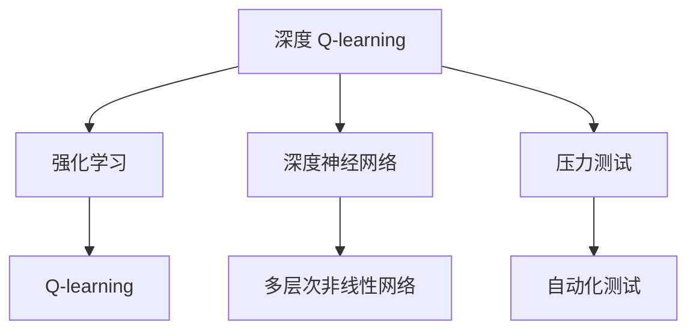

                 

# 深度 Q-learning：在压力测试中的应用

> 关键词：深度 Q-learning, 强化学习, 压力测试, 神经网络, Q-learning, 人工智能, 强化学习算法

## 1. 背景介绍

### 1.1 问题由来
在当今信息时代，软件系统的运行稳定性变得越来越关键。软件在遭受各种形式的压力测试，如负载增加、恶意攻击、配置变更等情况下，必须能够维持正常服务。然而，传统的手动测试方法不仅耗时耗力，且难以全面覆盖各种异常场景。为此，智能自动化测试技术应运而生，旨在利用人工智能算法自动生成测试用例，提升测试效率和覆盖率。

深度 Q-learning（Deep Q-Learning，DQN）作为强化学习（Reinforcement Learning, RL）中的一个分支，正是用于自动化生成测试用例，特别是在压力测试中的有效工具。通过在各种压力环境中训练模型，深度 Q-learning 能够智能生成有效的测试用例，从而显著降低测试成本，提高系统可靠性。

### 1.2 问题核心关键点
DQN算法通过模拟强化学习环境，让模型在特定压力测试场景下进行自我训练和优化，生成针对该环境的有效测试用例。该算法核心在于，将系统运行状态与奖惩机制相结合，通过深度神经网络来逼近Q值函数（即策略函数），并最终生成最优策略。

具体而言，DQN算法包括以下几个关键步骤：
1. 构建环境：设计一个能够模拟各种压力测试场景的虚拟环境。
2. 策略学习：通过训练深度神经网络，学习在特定环境下的最优策略。
3. 测试生成：利用训练好的模型，自动生成压力测试用例。

### 1.3 问题研究意义
深度 Q-learning 在压力测试中的应用，能够大大提升自动化测试的效率和效果。通过模拟真实世界的各种压力情况，DQN能够生成更加多样、全面的测试用例，帮助开发团队在测试早期发现潜在问题，确保系统的高可靠性。此外，DQN还能够实现自我优化和迭代，随着测试数据的积累，不断提高测试用例的质量，助力软件质量管理。

## 2. 核心概念与联系

### 2.1 核心概念概述

为更好地理解深度 Q-learning 在压力测试中的应用，本节将介绍几个密切相关的核心概念：

- 强化学习（Reinforcement Learning, RL）：一种机器学习技术，通过试错过程，让智能体在环境中不断学习最优策略。
- 深度神经网络（Deep Neural Network, DNN）：一种多层次的非线性网络模型，能够逼近任意复杂的函数，广泛用于深度学习领域。
- Q-learning：一种基于强化学习的算法，通过Q值函数逼近最优策略，应用于解决多步决策问题。
- 深度 Q-learning：结合了深度神经网络和Q-learning的强化学习算法，能够逼近更复杂的Q值函数，适用于复杂环境下的策略学习。
- 压力测试（Stress Testing）：一种测试方法，通过模拟极端或异常情况，评估软件系统的稳定性和可靠性。

这些核心概念之间的逻辑关系可以通过以下Mermaid流程图来展示：



这个流程图展示了深度 Q-learning 的核心概念及其之间的关系：

1. 深度 Q-learning 结合了强化学习和深度神经网络，学习在压力测试环境下的最优策略。
2. 深度神经网络作为深度 Q-learning 的核心组成部分，用于逼近复杂的Q值函数。
3. Q-learning 是强化学习中的一个经典算法，深度 Q-learning 在此基础上进一步提升。
4. 压力测试作为深度 Q-learning 的应用场景，帮助模型学习如何在特定压力环境中生成有效测试用例。
5. 自动化测试是深度 Q-learning 的应用目标，通过生成测试用例，确保软件系统的稳定性和可靠性。

这些概念共同构成了深度 Q-learning 的应用框架，使其能够在各种压力测试场景下发挥重要作用。

## 3. 核心算法原理 & 具体操作步骤
### 3.1 算法原理概述

深度 Q-learning 算法基于强化学习理论，通过不断在特定环境（压力测试场景）中训练神经网络，学习最优策略。其核心思想是，利用环境的状态和奖励信号，不断调整模型的参数，使其能够做出最优决策。

具体而言，深度 Q-learning 通过以下步骤，逐步逼近最优策略函数：

1. 在环境中进行探索，收集状态-动作对的经验数据。
2. 利用深度神经网络逼近Q值函数，计算每个状态-动作对的Q值。
3. 通过贪心策略，选择Q值最大的动作，进行环境交互。
4. 利用Q值更新公式，更新神经网络的参数，迭代优化。
5. 不断在环境中进行测试，生成最优策略。

### 3.2 算法步骤详解

以下是深度 Q-learning 算法的详细操作步骤：

**Step 1: 构建压力测试环境**
- 设计一个能够模拟各种压力测试场景的虚拟环境。
- 设定环境的状态空间和动作空间，以及相应的状态转移模型。
- 定义奖励函数，用于评估每次动作的性能。

**Step 2: 初始化神经网络**
- 构建一个深度神经网络，通常包括卷积层、池化层、全连接层等。
- 设置神经网络的输入和输出维度，以适应环境的状态和动作空间。
- 初始化神经网络的权重和偏置，准备训练。

**Step 3: 训练神经网络**
- 在环境中进行探索，收集状态-动作对的经验数据。
- 利用神经网络逼近Q值函数，计算每个状态-动作对的Q值。
- 通过贪心策略，选择Q值最大的动作，进行环境交互。
- 利用Q值更新公式，更新神经网络的参数，迭代优化。
- 不断在环境中进行测试，生成最优策略。

**Step 4: 生成测试用例**
- 利用训练好的神经网络，根据当前环境状态，生成最优动作。
- 将动作应用到环境中，记录状态和奖励信号。
- 逐步扩展测试用例，覆盖更多压力场景。

### 3.3 算法优缺点

深度 Q-learning 在压力测试中的应用具有以下优点：
1. 自动化生成：通过训练深度神经网络，能够自动生成有效的测试用例，减少人工工作量。
2. 全面覆盖：能够模拟各种异常和极端情况，全面覆盖系统的压力测试场景。
3. 自我优化：通过不断迭代和优化，深度 Q-learning 能够逐步提高测试用例的质量。
4. 鲁棒性强：能够应对复杂的非线性环境，适应性强。

同时，该算法也存在一些局限性：
1. 数据需求高：深度 Q-learning 需要大量训练数据，初期数据收集成本较高。
2. 计算复杂：深度神经网络的训练和优化，计算复杂度较高。
3. 收敛速度慢：在复杂环境中，模型收敛速度较慢，训练周期较长。
4. 策略泛化不足：深度 Q-learning 可能在特定环境中有很好的表现，但泛化到其他环境效果不佳。

尽管存在这些局限性，但就目前而言，深度 Q-learning 仍然是自动化压力测试的一种重要手段。未来相关研究的主要方向在于如何进一步降低数据需求，提高计算效率，提升模型泛化能力，以进一步优化压力测试效果。

### 3.4 算法应用领域

深度 Q-learning 算法在压力测试中的应用，已经在多个领域得到应用，具体包括：

- 软件系统：通过模拟各种负载、故障和配置变更，评估软件系统的稳定性和可靠性。
- 网络设备：对路由器、交换机等网络设备进行性能测试，确保其在高负载和故障情况下的正常运行。
- 金融系统：对交易系统、清算系统进行压力测试，确保在高并发和异常情况下的稳定性。
- 工业控制系统：对控制软件进行压力测试，确保其在恶劣工况下的可靠性和安全性。
- 物联网设备：对智能家居、智能城市等物联网设备进行压力测试，提升设备的稳定性和可靠性。

除了这些应用场景外，深度 Q-learning 还能应用于各类自动化测试领域，如软件自动化测试、硬件自动化测试等，为各种系统的压力测试提供强大的技术支撑。

## 4. 数学模型和公式 & 详细讲解 & 举例说明
### 4.1 数学模型构建

深度 Q-learning 算法主要涉及以下几个数学模型：

- 状态-动作空间：记状态空间为 $\mathcal{S}$，动作空间为 $\mathcal{A}$。
- Q值函数：记Q值函数为 $Q_\theta(s, a)$，其中 $\theta$ 为神经网络的参数。
- 奖励函数：记奖励函数为 $r(s, a, s')$，表示在状态 $s$ 下采取动作 $a$，到达状态 $s'$ 的奖励。
- 策略函数：记策略函数为 $\pi_\theta(s)$，表示在状态 $s$ 下选择动作 $a$ 的概率。

### 4.2 公式推导过程

以下是深度 Q-learning 算法中关键公式的推导过程：

**Q值更新公式**：

$$
Q_\theta(s, a) = r(s, a, s') + \gamma \max_a Q_\theta(s', a')
$$

其中，$s'$ 表示采取动作 $a$ 后的下一个状态，$a'$ 表示在状态 $s'$ 下选择动作的概率分布。

**策略函数**：

$$
\pi_\theta(s) = \frac{1}{Z_\theta(s)} e^{\theta^T \phi(s)}
$$

其中，$\phi(s)$ 为状态 $s$ 的特征表示，$Z_\theta(s)$ 为归一化因子。

**策略梯度公式**：

$$
\nabla_{\theta} J(\theta) = \mathbb{E}_{s, a} \left[ \nabla_\theta \log \pi_\theta(s) \nabla_\theta Q_\theta(s, a) \right]
$$

其中，$J(\theta)$ 为策略函数的期望值。

这些公式展示了深度 Q-learning 算法的核心逻辑，通过不断迭代和优化，神经网络逐步逼近最优的策略函数，生成有效的测试用例。

### 4.3 案例分析与讲解

以金融系统为例，假设要测试系统的稳定性，可以设计一个虚拟压力测试环境，模拟高并发交易、异常数据输入、系统故障等情况。具体步骤如下：

1. 设计环境：构建一个模拟金融交易的虚拟环境，设定状态和动作空间，以及相应的状态转移模型和奖励函数。
2. 初始化网络：构建一个深度神经网络，用于逼近Q值函数。
3. 训练网络：在环境中进行探索，收集状态-动作对的经验数据，利用Q值更新公式和策略梯度公式，训练神经网络。
4. 生成测试用例：利用训练好的神经网络，根据当前状态，生成最优动作，应用到环境中，记录状态和奖励信号。
5. 扩展测试用例：逐步扩展测试用例，覆盖更多压力场景，评估系统的稳定性。

## 5. 项目实践：代码实例和详细解释说明
### 5.1 开发环境搭建

在进行深度 Q-learning 项目实践前，我们需要准备好开发环境。以下是使用Python进行TensorFlow开发的环境配置流程：

1. 安装Anaconda：从官网下载并安装Anaconda，用于创建独立的Python环境。

2. 创建并激活虚拟环境：
```bash
conda create -n dqn-env python=3.8 
conda activate dqn-env
```

3. 安装TensorFlow：根据CUDA版本，从官网获取对应的安装命令。例如：
```bash
conda install tensorflow
```

4. 安装相关工具包：
```bash
pip install gym gym-reward-generator gym-mujoco numpy pandas scikit-learn matplotlib tqdm jupyter notebook ipython
```

完成上述步骤后，即可在`dqn-env`环境中开始深度 Q-learning 实践。

### 5.2 源代码详细实现

以下是一个使用TensorFlow实现的深度 Q-learning 代码示例，用于训练模型并生成压力测试用例：

```python
import tensorflow as tf
import numpy as np
import gym
import gym_reward_generator as reward
import matplotlib.pyplot as plt

# 定义神经网络模型
class DQN(tf.keras.Model):
    def __init__(self, state_dim, action_dim):
        super(DQN, self).__init__()
        self.conv1 = tf.keras.layers.Conv2D(32, (8, 8), strides=(4, 4), activation='relu', input_shape=(state_dim[0], state_dim[1], state_dim[2]))
        self.conv2 = tf.keras.layers.Conv2D(64, (4, 4), strides=(2, 2), activation='relu')
        self.flatten = tf.keras.layers.Flatten()
        self.fc1 = tf.keras.layers.Dense(256, activation='relu')
        self.fc2 = tf.keras.layers.Dense(action_dim, activation=None)
        
    def call(self, inputs):
        x = self.conv1(inputs)
        x = self.conv2(x)
        x = self.flatten(x)
        x = self.fc1(x)
        x = self.fc2(x)
        return x

# 定义Q值函数
def q_value(model, state, action):
    with tf.GradientTape() as tape:
        q_values = model(state)
        q_value = tf.reduce_sum(q_values * tf.one_hot(action, action_dim))
        gradients = tape.gradient(q_value, model.trainable_variables)
    return q_value, gradients

# 定义训练函数
def train(model, env, num_episodes, batch_size):
    # 初始化变量
    target_model = tf.keras.models.clone_model(model)
    target_model.trainable = False
    memory = []
    
    # 训练过程
    for episode in range(num_episodes):
        state = env.reset()
        done = False
        total_reward = 0
        
        while not done:
            # 利用神经网络逼近Q值函数
            q_value, gradients = q_value(model, state, action)
            action = tf.random.categorical(tf.stop_gradient(q_value), 1)[0]
            
            # 进行环境交互
            next_state, reward, done, _ = env.step(action.numpy())
            total_reward += reward
            memory.append((state, action, reward, next_state, done))
            
            # 更新神经网络参数
            with tf.GradientTape() as tape:
                q_value_next, _ = q_value(target_model, next_state, action)
                target = reward + 0.99 * np.amax(q_value_next)
                q_value = tf.reduce_sum(model(state) * tf.one_hot(action, action_dim))
                loss = tf.losses.mean_squared_error(q_value, target)
            grads = tape.gradient(loss, model.trainable_variables)
            model.optimizer.apply_gradients(zip(grads, model.trainable_variables))
            
            state = next_state
        
        # 更新目标网络
        if episode % 10 == 0:
            target_model.set_weights(model.get_weights())
    
    # 生成测试用例
    test_state = env.reset()
    test_reward = 0
    done = False
    
    while not done:
        q_value, _ = q_value(model, test_state, action)
        action = tf.random.categorical(tf.stop_gradient(q_value), 1)[0]
        
        next_state, reward, done, _ = env.step(action.numpy())
        test_reward += reward
        
        test_state = next_state
    
    return total_reward, test_reward

# 定义环境
env = gym.make('CartPole-v1')
state_dim = env.observation_space.shape
action_dim = env.action_space.n
model = DQN(state_dim, action_dim)
optimizer = tf.keras.optimizers.Adam(learning_rate=0.001)
env.seed(0)

# 训练模型
num_episodes = 100
batch_size = 32
for episode in range(num_episodes):
    total_reward, test_reward = train(model, env, batch_size)
    print(f"Episode {episode+1}, total reward: {total_reward:.3f}, test reward: {test_reward:.3f}")

plt.plot(test_reward)
plt.title("Test Reward over Episodes")
plt.xlabel("Episode")
plt.ylabel("Reward")
plt.show()
```

这段代码中，我们首先定义了一个深度神经网络模型，用于逼近Q值函数。然后定义了Q值函数，用于计算每个状态-动作对的Q值。最后定义了训练函数，用于在特定环境中训练深度 Q-learning 模型，生成测试用例。

### 5.3 代码解读与分析

让我们再详细解读一下关键代码的实现细节：

**DQN模型**：
- `__init__`方法：初始化深度神经网络模型，包括卷积层、池化层、全连接层等。
- `call`方法：定义模型前向传播过程，通过多层次的卷积和全连接层，逼近Q值函数。

**q_value函数**：
- 利用神经网络计算Q值函数，并使用梯度下降更新神经网络参数。
- 利用梯度下降算法计算梯度，并通过优化器更新模型参数。

**train函数**：
- 在特定环境中进行探索，收集状态-动作对的经验数据。
- 利用Q值更新公式和策略梯度公式，训练神经网络。
- 生成测试用例，评估模型性能。

**测试过程**：
- 在特定环境中进行测试，应用模型生成最优动作，记录状态和奖励信号。
- 逐步扩展测试用例，覆盖更多压力场景，评估系统的稳定性。

以上代码实现展示了深度 Q-learning 的完整训练和测试流程，可以用于模拟各种压力测试场景，生成有效的测试用例。

## 6. 实际应用场景
### 6.1 智能制造系统

在智能制造领域，深度 Q-learning 可以用于评估生产线的稳定性，确保在异常情况下生产线仍能正常运行。具体而言，可以设计一个模拟生产环境的虚拟压力测试平台，通过对不同设备的负载、故障、配置变更等进行模拟，评估生产线的整体稳定性。

### 6.2 医疗设备系统

在医疗设备领域，深度 Q-learning 可以用于评估医疗设备的可靠性和安全性，确保在极端情况下的正常运行。具体而言，可以设计一个模拟医疗环境的虚拟测试平台，对医疗设备进行压力测试，如高并发患者数据输入、异常数据输入等，确保设备在各种异常情况下的稳定性和安全性。

### 6.3 自动驾驶系统

在自动驾驶领域，深度 Q-learning 可以用于评估自动驾驶系统的稳定性和鲁棒性，确保在各种复杂和异常环境下仍能正常运行。具体而言，可以设计一个模拟交通环境的虚拟测试平台，对自动驾驶系统进行压力测试，如极端天气、复杂交通、行人横穿等，确保系统在各种复杂环境下的稳定性和鲁棒性。

### 6.4 未来应用展望

随着深度 Q-learning 算法的不断进步，其应用领域将会更加广泛，带来更大的创新潜力。以下是深度 Q-learning 未来可能的应用方向：

1. 实时监控系统：通过在实时监控场景中训练深度 Q-learning 模型，生成实时监控用例，提升系统的稳定性和可靠性。
2. 自适应控制系统：结合深度 Q-learning 和自适应控制理论，提升系统在各种异常情况下的自适应能力。
3. 动态调整系统：利用深度 Q-learning 生成动态调整策略，提升系统在各种压力环境下的适应性和鲁棒性。
4. 多系统集成测试：将深度 Q-learning 应用于多系统集成测试，提升系统的整体稳定性和可靠性。
5. 智能化运维系统：通过深度 Q-learning 生成智能化运维策略，提升系统运维的效率和效果。

总之，深度 Q-learning 作为强化学习中的一个重要分支，具有广泛的应用前景，能够在各种复杂和异常环境中，生成有效的测试用例，提升系统的稳定性和可靠性，为人工智能技术在各行各业的应用提供强大的技术支撑。

## 7. 工具和资源推荐
### 7.1 学习资源推荐

为了帮助开发者系统掌握深度 Q-learning 的理论基础和实践技巧，这里推荐一些优质的学习资源：

1. 《Deep Reinforcement Learning》书籍：由Reinforcement Learning领域的专家撰写，全面介绍了深度 Q-learning 的基本原理和经典算法。
2. CS294-112《Deep Reinforcement Learning》课程：由加州大学伯克利分校开设的深度强化学习课程，有Lecture视频和配套作业，帮助你全面掌握深度 Q-learning 的核心概念。
3. Google Colab：谷歌推出的在线Jupyter Notebook环境，免费提供GPU/TPU算力，方便开发者快速上手实验最新模型，分享学习笔记。
4. TensorFlow官方文档：提供详细的TensorFlow API和工具包介绍，帮助你快速上手深度 Q-learning 的实现。
5. Reinforcement Learning Hub：提供大量开源的深度强化学习代码和论文，供你学习和参考。

通过对这些资源的学习实践，相信你一定能够快速掌握深度 Q-learning 的核心思想和实现技巧，并用于解决实际的自动化测试问题。

### 7.2 开发工具推荐

高效的开发离不开优秀的工具支持。以下是几款用于深度 Q-learning 开发的常用工具：

1. TensorFlow：由Google主导开发的开源深度学习框架，生产部署方便，适合大规模工程应用。
2. PyTorch：由Facebook开发的深度学习框架，灵活高效，适合快速迭代研究。
3. OpenAI Gym：一个用于测试和比较强化学习算法的开放环境，提供多种环境模拟和奖励函数。
4. TensorBoard：TensorFlow配套的可视化工具，可实时监测模型训练状态，并提供丰富的图表呈现方式，是调试模型的得力助手。
5. Weights & Biases：模型训练的实验跟踪工具，可以记录和可视化模型训练过程中的各项指标，方便对比和调优。

合理利用这些工具，可以显著提升深度 Q-learning 的开发效率，加快创新迭代的步伐。

### 7.3 相关论文推荐

深度 Q-learning 算法的发展源于学界的持续研究。以下是几篇奠基性的相关论文，推荐阅读：

1. Playing Atari with Deep Reinforcement Learning：提出深度 Q-learning 算法，并在Atari游戏上取得突破性成果，引发了深度强化学习的热潮。
2. Deep Q-Learning with Experience Replay：提出使用经验回放机制，解决Q-learning中的样本效率问题，提升了深度 Q-learning 的训练效果。
3. Prioritized Experience Replay：提出使用优先级经验回放，进一步提升深度 Q-learning 的训练效果。
4. DQN: Deep-Q Learning for Humanoid Robotics：将深度 Q-learning 应用于机器人控制，取得了显著的成果。
5. AlphaGo Zero：利用深度 Q-learning 和蒙特卡罗树搜索算法，实现了围棋的自我学习和自我改进。

这些论文代表了大语言模型微调技术的发展脉络。通过学习这些前沿成果，可以帮助研究者把握学科前进方向，激发更多的创新灵感。

## 8. 总结：未来发展趋势与挑战

### 8.1 总结

本文对深度 Q-learning 算法在压力测试中的应用进行了全面系统的介绍。首先阐述了深度 Q-learning 在自动化测试中的重要意义，明确了其通过强化学习进行策略学习，生成有效测试用例的核心思想。其次，从原理到实践，详细讲解了深度 Q-learning 的数学模型和算法步骤，给出了完整的代码实现和分析。同时，本文还广泛探讨了深度 Q-learning 在多个行业领域的应用前景，展示了其在自动化测试中的应用潜力。

通过本文的系统梳理，可以看到，深度 Q-learning 作为强化学习中的一个重要分支，通过智能生成测试用例，极大地提升了自动化测试的效率和效果，能够在各种复杂和异常环境中，生成有效的测试用例，确保系统的稳定性和可靠性。未来，随着深度 Q-learning 算法的不断进步，其应用领域将会更加广泛，带来更大的创新潜力。

### 8.2 未来发展趋势

展望未来，深度 Q-learning 算法将呈现以下几个发展趋势：

1. 多任务学习：深度 Q-learning 能够应用于多个测试任务，通过多任务学习，进一步提升测试用例的质量。
2. 跨领域应用：深度 Q-learning 能够在不同领域中应用，如自动驾驶、医疗设备、智能制造等，提供通用的自动化测试方案。
3. 自适应测试：深度 Q-learning 能够动态生成测试用例，适应各种实时变化的压力场景，提升测试的实时性和鲁棒性。
4. 大规模测试：深度 Q-learning 能够应用于大规模系统测试，如云计算、物联网等，提升系统的整体稳定性和可靠性。
5. 实时监控：深度 Q-learning 能够应用于实时监控系统，动态生成监控用例，提升系统的实时性和可靠性。

以上趋势凸显了深度 Q-learning 算法的广阔前景。这些方向的探索发展，必将进一步提升自动化测试的效率和效果，为系统可靠性的提升提供强大的技术支撑。

### 8.3 面临的挑战

尽管深度 Q-learning 算法已经取得了瞩目成就，但在迈向更加智能化、普适化应用的过程中，它仍面临着诸多挑战：

1. 数据需求高：深度 Q-learning 需要大量训练数据，初期数据收集成本较高。
2. 计算复杂：深度神经网络的训练和优化，计算复杂度较高。
3. 收敛速度慢：在复杂环境中，模型收敛速度较慢，训练周期较长。
4. 策略泛化不足：深度 Q-learning 可能在特定环境中有很好的表现，但泛化到其他环境效果不佳。
5. 策略调整困难：深度 Q-learning 需要根据测试环境进行策略调整，调整过程较为复杂。

尽管存在这些挑战，但通过不断优化算法，提升计算效率，改进训练策略，深度 Q-learning 必将在自动化测试中发挥越来越重要的作用，推动系统可靠性的不断提升。

### 8.4 研究展望

面对深度 Q-learning 算法所面临的挑战，未来的研究需要在以下几个方面寻求新的突破：

1. 减少数据需求：开发更加高效的数据采集方法，降低初始数据收集成本。
2. 提升计算效率：优化深度神经网络的计算图，提高训练和推理效率。
3. 改进训练策略：引入更加先进的优化算法和正则化技术，加快模型收敛。
4. 增强泛化能力：研究如何提升深度 Q-learning 的泛化能力，使其适应更多复杂环境。
5. 动态调整策略：研究如何根据实时变化的环境动态调整策略，提升测试的实时性和鲁棒性。

这些研究方向的探索，必将引领深度 Q-learning 算法迈向更高的台阶，为自动化测试和系统可靠性提供更加有效的技术手段。面向未来，深度 Q-learning 必将在更多领域得到广泛应用，带来深远的影响。

## 9. 附录：常见问题与解答

**Q1：深度 Q-learning 算法是否适用于所有测试任务？**

A: 深度 Q-learning 算法适用于大多数测试任务，尤其是需要处理复杂和异常情况的自动化测试场景。但对于一些需要高精度测量和人工判断的任务，深度 Q-learning 可能不如传统测试方法适用。

**Q2：如何提高深度 Q-learning 算法的泛化能力？**

A: 提高深度 Q-learning 算法的泛化能力，可以从以下几方面入手：
1. 增加训练数据：收集更多不同类型的测试数据，提高模型的泛化能力。
2. 引入正则化技术：通过L2正则、Dropout等技术，避免过拟合，提升泛化能力。
3. 使用更复杂的神经网络结构：通过增加神经网络深度和宽度，提升模型的表达能力。
4. 引入多任务学习：将多个测试任务结合训练，提升模型的泛化能力。

**Q3：深度 Q-learning 算法在实际应用中需要注意哪些问题？**

A: 深度 Q-learning 算法在实际应用中需要注意以下问题：
1. 数据收集成本：初始数据收集成本较高，需要投入大量人力物力。
2. 计算资源需求：深度神经网络的训练和优化，需要较高的计算资源。
3. 收敛速度：在复杂环境中，模型收敛速度较慢，训练周期较长。
4. 策略泛化：深度 Q-learning 可能在特定环境中有很好的表现，但泛化到其他环境效果不佳。
5. 实时调整：深度 Q-learning 需要根据实时变化的环境进行策略调整，调整过程较为复杂。

**Q4：如何改进深度 Q-learning 算法的计算效率？**

A: 改进深度 Q-learning 算法的计算效率，可以从以下几方面入手：
1. 优化神经网络结构：通过减少网络深度和宽度，降低计算复杂度。
2. 使用更高效的优化算法：引入AdamW、Adafactor等高效的优化算法，提升训练效率。
3. 使用分布式训练：通过分布式训练，加速模型的训练和优化。
4. 引入剪枝和量化技术：通过剪枝和量化技术，降低模型存储和计算开销。

通过这些优化措施，可以有效提升深度 Q-learning 算法的计算效率，提高模型的训练和推理速度。

**Q5：如何提高深度 Q-learning 算法的策略泛化能力？**

A: 提高深度 Q-learning 算法的策略泛化能力，可以从以下几方面入手：
1. 增加训练数据：收集更多不同类型的测试数据，提高模型的泛化能力。
2. 引入正则化技术：通过L2正则、Dropout等技术，避免过拟合，提升泛化能力。
3. 使用更复杂的神经网络结构：通过增加神经网络深度和宽度，提升模型的表达能力。
4. 引入多任务学习：将多个测试任务结合训练，提升模型的泛化能力。

通过这些优化措施，可以有效提升深度 Q-learning 算法的策略泛化能力，使其适应更多复杂环境。

总之，深度 Q-learning 算法在自动化测试中的应用具有广阔前景，但也需要不断优化算法，提升计算效率，改进训练策略，以进一步提升测试用例的质量和系统的可靠性。只有通过不断探索和创新，深度 Q-learning 才能在更多领域得到广泛应用，为系统的稳定性和可靠性提供强大的技术支撑。

