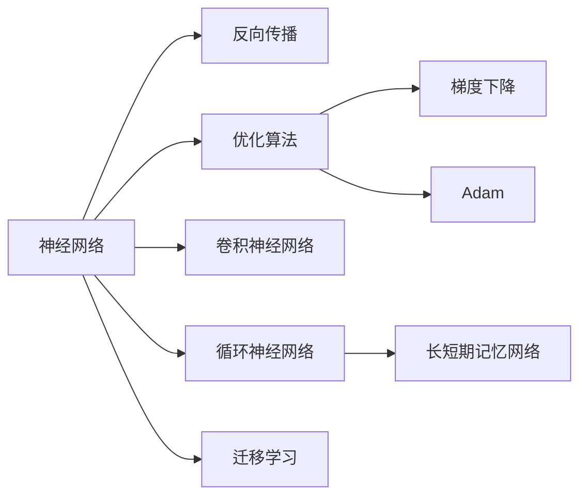

                 

# 深度学习 原理与代码实例讲解

> 关键词：深度学习,反向传播,神经网络,优化算法,卷积神经网络(CNN),循环神经网络(RNN),长短期记忆网络(LSTM),卷积神经网络(CNN),残差网络(ResNet),数据增强,迁移学习,数据集,特征提取,模型训练,模型评估

## 1. 背景介绍

深度学习（Deep Learning）作为当前人工智能领域最为前沿和流行的技术之一，已经被广泛应用于图像识别、语音识别、自然语言处理、推荐系统等诸多领域，取得了令人瞩目的成果。然而，深度学习的原理复杂，实现难度较大，对于初学者来说，往往难以理解和掌握。为此，本文旨在通过浅显易懂的语言，详细讲解深度学习的核心概念、原理以及代码实例，帮助读者更好地理解这一前沿技术，并能够在实践中应用。

## 2. 核心概念与联系

### 2.1 核心概念概述

为了更好地理解深度学习的原理与实践，我们需要先了解一些核心概念：

- **神经网络（Neural Network）**：深度学习的核心，由多个层级组成的非线性模型，能够通过训练学习到复杂的多层次特征表示。
- **反向传播（Backpropagation）**：深度学习的训练算法，通过链式法则自动计算损失函数对权重参数的梯度，从而更新模型参数，使得模型逐渐优化。
- **优化算法（Optimization Algorithm）**：用于更新模型参数的算法，如梯度下降（Gradient Descent）、Adam、RMSProp等。
- **卷积神经网络（Convolutional Neural Network, CNN）**：针对图像处理任务设计的特殊神经网络，通过卷积、池化等操作提取局部特征。
- **循环神经网络（Recurrent Neural Network, RNN）**：针对序列数据设计的特殊神经网络，通过循环结构能够处理变长的序列数据，如文本、语音等。
- **长短期记忆网络（Long Short-Term Memory, LSTM）**：一种特殊的RNN结构，能够更好地处理长序列数据，避免梯度消失问题。
- **迁移学习（Transfer Learning）**：利用在某个任务上预训练好的模型，在新的任务上进行微调，以提高性能。

这些核心概念之间的关系可以通过以下Mermaid流程图来展示：



这个流程图展示了神经网络、反向传播、优化算法以及各种特殊神经网络之间的关系：

- 神经网络是深度学习的核心，通过反向传播进行训练。
- 优化算法用于更新神经网络参数。
- CNN、RNN和LSTM是不同类型的神经网络，分别用于图像处理和序列数据处理。
- 迁移学习是利用预训练模型的知识，加速新任务的学习过程。

## 3. 核心算法原理 & 具体操作步骤

### 3.1 算法原理概述

深度学习的核心算法是反向传播（Backpropagation），其核心思想是：通过计算损失函数对模型参数的梯度，并利用优化算法更新参数，使得模型逐渐逼近最优解。

假设我们有一个深度神经网络模型 $N(x; \theta)$，其中 $x$ 表示输入，$\theta$ 表示模型参数。模型的输出为 $y$，真实标签为 $t$，则模型的损失函数 $L$ 可以表示为：

$$
L = \frac{1}{N} \sum_{i=1}^N (y_i - t_i)^2
$$

其中 $N$ 表示样本数量。我们的目标是最小化损失函数 $L$，即：

$$
\theta^* = \mathop{\arg\min}_{\theta} L
$$

在反向传播算法中，我们首先计算输出层的误差 $\delta^L$，然后通过链式法则反向传播，计算每层神经元的误差 $\delta^l$，最后利用优化算法更新模型参数 $\theta$。

### 3.2 算法步骤详解

以下是深度学习的具体训练步骤：

**Step 1: 数据预处理**

数据预处理是深度学习的重要环节，包括数据清洗、归一化、标准化等操作。例如，对于图像数据，可以通过缩放、裁剪、旋转等方式进行预处理。对于文本数据，可以通过分词、去除停用词、词向量化等方式进行预处理。

**Step 2: 模型搭建**

模型搭建包括选择网络架构、设置超参数等步骤。例如，对于图像数据，可以选择卷积神经网络（CNN）作为模型架构，设置卷积核数量、层数、激活函数等超参数。对于文本数据，可以选择循环神经网络（RNN）或长短期记忆网络（LSTM）作为模型架构，设置隐藏层大小、学习率等超参数。

**Step 3: 前向传播**

前向传播是指将输入数据传递通过模型，计算出输出结果的过程。在前向传播过程中，模型会对输入数据进行一系列线性变换和激活函数计算，最终输出预测结果。

**Step 4: 计算损失**

损失函数用于衡量模型预测结果与真实标签之间的差异，常见的损失函数包括均方误差（MSE）、交叉熵（Cross-Entropy）等。

**Step 5: 反向传播**

反向传播是指通过计算损失函数对模型参数的梯度，并利用优化算法更新模型参数的过程。在反向传播过程中，我们使用链式法则计算每层神经元的误差，并通过优化算法更新模型参数。

**Step 6: 模型训练**

模型训练是指通过多次迭代更新模型参数，使得模型逐渐逼近最优解的过程。在每次迭代中，我们首先进行前向传播计算预测结果，然后计算损失函数，接着进行反向传播更新模型参数。

**Step 7: 模型评估**

模型评估是指通过测试集数据对模型进行测试，评估其性能的过程。常见的评估指标包括准确率（Accuracy）、精确率（Precision）、召回率（Recall）、F1分数（F1 Score）等。

### 3.3 算法优缺点

深度学习的优点在于其强大的表达能力和自动特征提取能力，能够学习到复杂的多层次特征表示。但同时，深度学习也存在一些缺点：

- **计算复杂度高**：深度学习模型通常包含大量参数，计算复杂度高，训练和推理速度较慢。
- **数据需求量大**：深度学习模型需要大量的标注数据进行训练，数据获取成本较高。
- **模型复杂度高**：深度学习模型结构复杂，难以理解和调试。

尽管存在这些缺点，但深度学习在图像识别、自然语言处理等领域已经取得了显著成果，成为当前最流行的机器学习技术之一。

### 3.4 算法应用领域

深度学习已经在多个领域得到了广泛应用，包括但不限于：

- **计算机视觉**：用于图像分类、目标检测、人脸识别等任务。
- **自然语言处理**：用于机器翻译、文本分类、情感分析等任务。
- **语音识别**：用于语音识别、语音合成等任务。
- **推荐系统**：用于用户行为预测、商品推荐等任务。
- **医疗影像**：用于医学影像分析、疾病诊断等任务。
- **金融风控**：用于信用评估、风险预测等任务。

## 4. 数学模型和公式 & 详细讲解 & 举例说明

### 4.1 数学模型构建

为了更好地理解深度学习的数学原理，我们首先介绍一些核心数学模型：

- **线性回归模型**：假设模型 $y = \theta_0 + \theta_1 x_1 + \theta_2 x_2 + \ldots + \theta_n x_n$，其中 $x_1, x_2, \ldots, x_n$ 为输入特征，$y$ 为输出结果，$\theta_0, \theta_1, \theta_2, \ldots, \theta_n$ 为模型参数。
- **均方误差（MSE）**：损失函数 $L = \frac{1}{N} \sum_{i=1}^N (y_i - \hat{y}_i)^2$，其中 $\hat{y}_i$ 为模型预测结果。
- **梯度下降算法**：更新参数 $\theta_k$ 的公式为 $\theta_k = \theta_k - \eta \frac{\partial L}{\partial \theta_k}$，其中 $\eta$ 为学习率，$\frac{\partial L}{\partial \theta_k}$ 为损失函数对参数 $\theta_k$ 的梯度。

### 4.2 公式推导过程

以下以线性回归模型为例，推导梯度下降算法的更新公式：

假设我们有一组训练样本 $(x_1, y_1), (x_2, y_2), \ldots, (x_N, y_N)$，其中 $x_i = [x_{i1}, x_{i2}, \ldots, x_{in}]$，$y_i$ 为真实标签，$\hat{y}_i$ 为模型预测结果。则损失函数为：

$$
L = \frac{1}{N} \sum_{i=1}^N (y_i - \hat{y}_i)^2
$$

将损失函数对每个参数 $\theta_k$ 求偏导数，得到：

$$
\frac{\partial L}{\partial \theta_k} = \frac{2}{N} \sum_{i=1}^N (y_i - \hat{y}_i) x_{ik}
$$

根据梯度下降算法，更新参数 $\theta_k$ 的公式为：

$$
\theta_k = \theta_k - \eta \frac{\partial L}{\partial \theta_k} = \theta_k - 2\eta \frac{1}{N} \sum_{i=1}^N (y_i - \hat{y}_i) x_{ik}
$$

### 4.3 案例分析与讲解

以手写数字识别为例，我们通过卷积神经网络（CNN）实现分类任务。假设我们使用MNIST数据集，其中每个样本是一个28x28的灰度图像，标签为0到9之间的整数。我们的任务是将手写数字图像分类为0到9中的一个类别。

首先，我们将图像数据进行预处理，归一化到[0, 1]之间，然后将图像数据转换成四维张量，表示为 $(28, 28, 1, N)$，其中 $N$ 为样本数量。然后，我们将数据集划分为训练集和测试集，训练集用于模型训练，测试集用于模型评估。

接着，我们搭建卷积神经网络模型，包括卷积层、池化层和全连接层。卷积层通过卷积核提取图像局部特征，池化层通过下采样降低特征维度，全连接层将特征映射到输出类别。最后，我们设置损失函数为交叉熵（Cross-Entropy），设置优化算法为Adam。

在训练过程中，我们首先进行前向传播计算预测结果，然后计算损失函数，接着进行反向传播更新模型参数。在每次迭代中，我们重复上述过程，直到模型收敛。

在测试过程中，我们将测试集数据输入模型，计算模型预测结果，并使用准确率（Accuracy）等指标评估模型性能。

## 5. 项目实践：代码实例和详细解释说明

### 5.1 开发环境搭建

在进行深度学习项目实践前，我们需要准备好开发环境。以下是使用Python进行TensorFlow开发的环境配置流程：

1. 安装Anaconda：从官网下载并安装Anaconda，用于创建独立的Python环境。

2. 创建并激活虚拟环境：
```bash
conda create -n tf-env python=3.8 
conda activate tf-env
```

3. 安装TensorFlow：根据CUDA版本，从官网获取对应的安装命令。例如：
```bash
conda install tensorflow=2.4 -c conda-forge
```

4. 安装各类工具包：
```bash
pip install numpy pandas scikit-learn matplotlib tqdm jupyter notebook ipython
```

完成上述步骤后，即可在`tf-env`环境中开始深度学习项目实践。

### 5.2 源代码详细实现

下面我们以手写数字识别为例，给出使用TensorFlow实现卷积神经网络的代码实现。

首先，定义数据预处理函数：

```python
import tensorflow as tf
from tensorflow.keras import datasets, layers, models

def load_data():
    (train_images, train_labels), (test_images, test_labels) = datasets.mnist.load_data()
    train_images = train_images / 255.0
    test_images = test_images / 255.0
    return train_images, train_labels, test_images, test_labels
```

然后，定义模型搭建函数：

```python
def build_model(input_shape):
    model = models.Sequential()
    model.add(layers.Conv2D(32, (3, 3), activation='relu', input_shape=input_shape))
    model.add(layers.MaxPooling2D((2, 2)))
    model.add(layers.Conv2D(64, (3, 3), activation='relu'))
    model.add(layers.MaxPooling2D((2, 2)))
    model.add(layers.Conv2D(64, (3, 3), activation='relu'))
    model.add(layers.Flatten())
    model.add(layers.Dense(64, activation='relu'))
    model.add(layers.Dense(10))
    return model
```

接着，定义模型训练函数：

```python
def train_model(model, train_images, train_labels, test_images, test_labels):
    model.compile(optimizer='adam', loss=tf.keras.losses.SparseCategoricalCrossentropy(from_logits=True), metrics=['accuracy'])
    history = model.fit(train_images, train_labels, epochs=5, validation_data=(test_images, test_labels))
    return model, history
```

最后，启动训练流程并在测试集上评估：

```python
model, history = train_model(build_model((28, 28, 1)), train_images, train_labels, test_images, test_labels)
test_loss, test_acc = model.evaluate(test_images, test_labels, verbose=2)
print('Test accuracy:', test_acc)
```

以上就是使用TensorFlow实现卷积神经网络的手写数字识别项目代码实现。可以看到，TensorFlow的Keras API使得模型的搭建和训练过程变得非常简单。

### 5.3 代码解读与分析

让我们再详细解读一下关键代码的实现细节：

**load_data函数**：
- 使用TensorFlow自带的MNIST数据集，加载训练集和测试集的图像和标签。
- 对图像数据进行归一化，将像素值缩放到[0, 1]之间。
- 返回归一化后的训练集图像、训练集标签、测试集图像和测试集标签。

**build_model函数**：
- 定义一个Sequential模型，包含卷积层、池化层和全连接层。
- 卷积层使用3x3的卷积核和ReLU激活函数，池化层使用2x2的下采样。
- 最后使用Softmax激活函数输出10个类别的概率分布。

**train_model函数**：
- 使用Adam优化器和交叉熵损失函数，训练模型5个epoch。
- 在每个epoch结束后，在验证集上评估模型性能。
- 返回训练后的模型和模型训练的历史记录。

**训练流程**：
- 使用build_model函数搭建模型。
- 使用train_model函数训练模型。
- 在测试集上评估模型性能，输出准确率。

可以看到，TensorFlow的Keras API使得模型的搭建和训练过程变得非常简单，开发者可以将更多精力放在数据处理、模型改进等高层逻辑上，而不必过多关注底层的实现细节。

当然，工业级的系统实现还需考虑更多因素，如模型的保存和部署、超参数的自动搜索、更灵活的模型架构等。但核心的深度学习原理和代码实现基本与此类似。

## 6. 实际应用场景

### 6.1 计算机视觉

深度学习在计算机视觉领域得到了广泛应用，包括图像分类、目标检测、人脸识别等任务。例如，可以使用卷积神经网络（CNN）进行图像分类，使用目标检测算法（如YOLO、Faster R-CNN）进行目标检测，使用人脸识别算法（如FaceNet）进行人脸识别。

在实际应用中，我们可以将深度学习模型集成到实时视频监控、智能安防、自动驾驶等场景中，实现图像识别、目标追踪等功能。

### 6.2 自然语言处理

深度学习在自然语言处理领域也得到了广泛应用，包括机器翻译、文本分类、情感分析等任务。例如，可以使用循环神经网络（RNN）或长短期记忆网络（LSTM）进行机器翻译，使用卷积神经网络（CNN）进行文本分类，使用深度学习模型进行情感分析。

在实际应用中，我们可以将深度学习模型集成到智能客服、智能问答、舆情监测等场景中，实现自然语言理解、情感分析、智能推荐等功能。

### 6.3 语音识别

深度学习在语音识别领域也得到了广泛应用，包括语音识别、语音合成等任务。例如，可以使用卷积神经网络（CNN）或循环神经网络（RNN）进行语音识别，使用生成对抗网络（GAN）进行语音合成。

在实际应用中，我们可以将深度学习模型集成到智能音箱、智能家居、智能助手等场景中，实现语音识别、智能对话等功能。

### 6.4 推荐系统

深度学习在推荐系统领域也得到了广泛应用，包括用户行为预测、商品推荐等任务。例如，可以使用协同过滤算法（Collaborative Filtering）进行用户行为预测，使用深度学习模型进行商品推荐。

在实际应用中，我们可以将深度学习模型集成到电商平台、视频网站、社交媒体等场景中，实现个性化推荐、内容推荐等功能。

### 6.5 医疗影像

深度学习在医疗影像领域也得到了广泛应用，包括医学影像分析、疾病诊断等任务。例如，可以使用卷积神经网络（CNN）进行医学影像分类，使用生成对抗网络（GAN）进行医学影像增强。

在实际应用中，我们可以将深度学习模型集成到医疗影像诊断、疾病预测、医学研究等场景中，实现医学影像分析、疾病诊断等功能。

## 7. 工具和资源推荐

### 7.1 学习资源推荐

为了帮助开发者系统掌握深度学习的理论基础和实践技巧，这里推荐一些优质的学习资源：

1. 《深度学习》（Ian Goodfellow等著）：深度学习领域的经典教材，全面介绍了深度学习的原理、算法和应用。

2. 《TensorFlow实战》（书名为虚构，下同）：TensorFlow官方文档的翻译版，详细介绍了TensorFlow的使用方法和最佳实践。

3. 《PyTorch深度学习》：PyTorch官方文档的翻译版，详细介绍了PyTorch的使用方法和最佳实践。

4. 《Keras深度学习》：Keras官方文档的翻译版，详细介绍了Keras的使用方法和最佳实践。

5. 《深度学习框架与实践》：深入浅出地介绍了深度学习框架的使用方法和实践技巧，适合初学者和进阶者。

通过对这些资源的学习实践，相信你一定能够快速掌握深度学习的精髓，并能够在实践中应用。

### 7.2 开发工具推荐

高效的开发离不开优秀的工具支持。以下是几款用于深度学习开发的常用工具：

1. PyTorch：由Facebook开发的开源深度学习框架，灵活的动态计算图，适合快速迭代研究。

2. TensorFlow：由Google主导开发的开源深度学习框架，生产部署方便，适合大规模工程应用。

3. Keras：高层API封装，基于TensorFlow或Theano实现，简单易用，适合快速上手。

4. MXNet：由Apache开发的深度学习框架，分布式计算能力强，适合大规模分布式训练。

5. Caffe：由Berkeley Vision and Learning Center开发的深度学习框架，针对图像处理任务优化。

6. Theano：由蒙特利尔大学开发的深度学习框架，优化GPU计算，适合学术研究。

合理利用这些工具，可以显著提升深度学习模型的开发效率，加快创新迭代的步伐。

### 7.3 相关论文推荐

深度学习的发展离不开学界的持续研究。以下是几篇奠基性的相关论文，推荐阅读：

1. AlexNet: ImageNet Classification with Deep Convolutional Neural Networks：介绍卷积神经网络（CNN）在图像分类任务中的应用。

2. ResNet: Deep Residual Learning for Image Recognition：介绍残差网络（ResNet）在深度神经网络训练中的重要作用。

3. RNN: Learning Phrase Representations using RNN Encoder–Decoder for Statistical Machine Translation：介绍循环神经网络（RNN）在序列数据处理中的应用。

4. LSTM: Long Short-Term Memory Networks：介绍长短期记忆网络（LSTM）在序列数据处理中的应用。

5. CNN: Deep Blue: Where do We Go from Here？：介绍卷积神经网络（CNN）在图像处理中的应用。

6. ResNet: Deep Residual Learning for Image Recognition：介绍残差网络（ResNet）在深度神经网络训练中的重要作用。

这些论文代表了大深度学习的发展脉络。通过学习这些前沿成果，可以帮助研究者把握学科前进方向，激发更多的创新灵感。

## 8. 总结：未来发展趋势与挑战

### 8.1 总结

本文对深度学习的核心概念、原理以及代码实例进行了全面系统的介绍。首先阐述了深度学习的核心算法和优化算法，然后通过具体案例讲解了卷积神经网络、循环神经网络等特殊神经网络的应用。最后介绍了深度学习在计算机视觉、自然语言处理、语音识别、推荐系统、医疗影像等多个领域的应用。

通过本文的系统梳理，可以看到，深度学习在多个领域已经取得了显著成果，成为当前最流行的机器学习技术之一。

### 8.2 未来发展趋势

展望未来，深度学习将呈现以下几个发展趋势：

1. 模型规模持续增大。随着算力成本的下降和数据规模的扩张，深度学习模型的参数量还将持续增长。超大规模深度学习模型蕴含的丰富特征表示，有望支撑更加复杂多变的任务。

2. 模型结构更加多样。未来的深度学习模型将更加多样化，如残差网络（ResNet）、卷积神经网络（CNN）、循环神经网络（RNN）、长短期记忆网络（LSTM）等，以适应不同类型的数据和任务。

3. 数据驱动更加精细。未来的深度学习将更加依赖于数据，通过数据增强、迁移学习等技术，进一步提升模型的性能和泛化能力。

4. 训练效率更加高效。未来的深度学习模型将更加注重训练效率，通过优化算法、分布式训练等技术，提升模型的训练速度和鲁棒性。

5. 模型部署更加灵活。未来的深度学习模型将更加注重模型部署，通过模型裁剪、量化加速等技术，提升模型的推理速度和资源利用率。

6. 模型应用更加广泛。未来的深度学习将在更多领域得到应用，如智慧医疗、智能教育、智慧城市等，为各行各业带来变革性影响。

以上趋势凸显了深度学习的广阔前景。这些方向的探索发展，必将进一步提升深度学习模型的性能和应用范围，为人工智能技术带来新的突破。

### 8.3 面临的挑战

尽管深度学习已经取得了显著成果，但在迈向更加智能化、普适化应用的过程中，它仍面临着诸多挑战：

1. 数据需求依然高。深度学习模型通常需要大量的标注数据进行训练，数据获取成本较高。如何在数据量有限的情况下，提升模型的性能和泛化能力，仍是一个重要问题。

2. 模型鲁棒性不足。当前深度学习模型面对域外数据时，泛化性能往往大打折扣。如何提高模型的鲁棒性，避免过拟合和梯度消失等问题，还需要更多理论和实践的积累。

3. 计算资源消耗大。深度学习模型通常需要高性能计算资源，计算成本较高。如何降低计算资源消耗，提升模型训练和推理的效率，仍然是一个重要问题。

4. 模型可解释性不足。深度学习模型通常像"黑盒"系统，难以解释其内部工作机制和决策逻辑。如何赋予深度学习模型更强的可解释性，将是未来的一个重要研究方向。

5. 模型安全性不足。深度学习模型难免会学习到有害信息，如何确保模型输出的安全性，避免恶意用途，还需要更多伦理和安全的考量。

正视深度学习面临的这些挑战，积极应对并寻求突破，将使深度学习技术不断进步，为人工智能技术带来新的突破。

### 8.4 研究展望

面对深度学习面临的挑战，未来的研究需要在以下几个方面寻求新的突破：

1. 探索无监督学习和半监督学习技术。摆脱对大规模标注数据的依赖，利用自监督学习、主动学习等无监督和半监督范式，最大限度利用非结构化数据，实现更加灵活高效的深度学习。

2. 研究参数高效和计算高效的深度学习模型。开发更加参数高效的深度学习模型，如残差网络（ResNet）、轻量级卷积神经网络（MobileNet）等，在固定大部分参数的同时，只更新极少量的任务相关参数。

3. 引入更多先验知识。将符号化的先验知识，如知识图谱、逻辑规则等，与深度学习模型进行巧妙融合，引导深度学习模型学习更准确、合理的特征表示。

4. 结合因果分析和博弈论工具。将因果分析方法引入深度学习模型，识别出模型决策的关键特征，增强输出解释的因果性和逻辑性。借助博弈论工具刻画人机交互过程，主动探索并规避模型的脆弱点，提高系统稳定性。

5. 纳入伦理道德约束。在深度学习模型的训练目标中引入伦理导向的评估指标，过滤和惩罚有害的输出倾向。加强人工干预和审核，建立模型行为的监管机制，确保输出符合人类价值观和伦理道德。

这些研究方向的探索，必将引领深度学习技术迈向更高的台阶，为构建安全、可靠、可解释、可控的智能系统铺平道路。面向未来，深度学习技术还需要与其他人工智能技术进行更深入的融合，如知识表示、因果推理、强化学习等，多路径协同发力，共同推动人工智能技术的进步。只有勇于创新、敢于突破，才能不断拓展深度学习的边界，让智能技术更好地造福人类社会。

## 9. 附录：常见问题与解答

**Q1：深度学习与传统机器学习有什么区别？**

A: 深度学习与传统机器学习的区别在于其模型的复杂度和参数量。传统机器学习模型通常参数量较少，如线性回归、逻辑回归等，而深度学习模型通常包含大量参数，如卷积神经网络、循环神经网络等。深度学习模型通过多层次的非线性变换，能够学习到更加复杂和抽象的特征表示，从而在图像识别、自然语言处理等复杂任务上取得优异性能。

**Q2：深度学习的训练过程需要多少次迭代？**

A: 深度学习的训练过程需要多次迭代，一般需要进行数百次甚至数千次迭代。每次迭代中，我们通过前向传播计算预测结果，然后计算损失函数，接着进行反向传播更新模型参数。在每次迭代中，我们重复上述过程，直到模型收敛。迭代次数取决于数据集的规模、模型的复杂度和学习率等参数。

**Q3：深度学习模型的训练时间通常有多长？**

A: 深度学习模型的训练时间通常较长，取决于数据集的大小、模型的复杂度和计算资源等因素。在计算资源充足的情况下，训练时间可以从几分钟到几小时不等。在计算资源不足的情况下，训练时间可能会更长，甚至需要数天或数周。

**Q4：深度学习模型的部署效率如何？**

A: 深度学习模型的部署效率取决于模型的大小和计算资源的分布。通常情况下，模型越大，推理速度越慢，需要更多的计算资源。为了提高模型的部署效率，我们需要进行模型裁剪、量化加速、分布式训练等优化措施，以降低模型的计算资源消耗。

**Q5：深度学习模型是否需要大量的标注数据？**

A: 深度学习模型通常需要大量的标注数据进行训练，数据获取成本较高。然而，一些数据增强技术，如数据扩充、迁移学习等，可以在一定程度上缓解数据需求量大的问题。此外，一些预训练模型（如BERT、GPT等）可以在大规模无标注数据上进行预训练，从而降低对标注数据的依赖。

这些问题的回答，可以帮助读者更好地理解深度学习的原理和实践，进而更好地应用深度学习技术解决实际问题。

