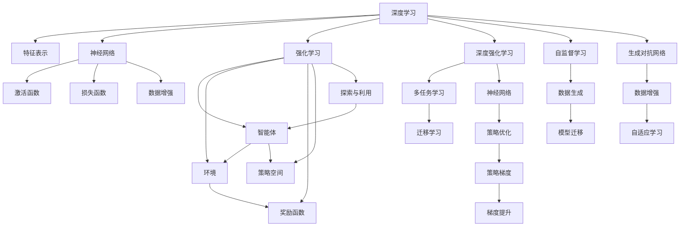

                 

# 深度学习与强化学习的崛起

> 关键词：深度学习,强化学习,机器学习,人工智能,神经网络,强化策略,深度强化学习

## 1. 背景介绍

### 1.1 问题由来
深度学习与强化学习作为当前机器学习和人工智能领域的两大重要分支，在过去几年里取得了显著的进展，并在诸多领域展现了强大的应用潜力。深度学习通过构建复杂的人工神经网络，自动学习特征表示，在图像、语音、自然语言处理等方面取得了优异表现。而强化学习则通过智能体与环境的互动，探索最优策略，在机器人控制、游戏AI、自动驾驶等任务上取得了突破性进展。两者互相融合，引领了机器学习领域的新一轮革命。

深度学习与强化学习的崛起，打破了传统机器学习的桎梏，为解决复杂问题提供了新的工具和方法。其核心思想是通过构建高层次、非线性映射的神经网络，利用大量标注数据进行学习，从而实现数据的高度抽象和表示。而强化学习则是通过智能体与环境的交互，不断调整策略，最大化累积奖励，从而解决优化问题。

深度学习与强化学习的成功，归功于算力的大幅提升和深度学习架构的不断创新，如卷积神经网络(CNN)、循环神经网络(RNN)、长短时记忆网络(LSTM)、自注意力机制(Attention)等。这些技术的进步，使得模型能够自动发现并利用数据中的隐式模式，极大地提升了预测和决策的准确性。

### 1.2 问题核心关键点
深度学习与强化学习的崛起，主要体现在以下几个方面：

- 强大的特征表示能力：深度学习能够通过自动编码数据特征，构建复杂的关系网络，从而在复杂数据处理任务上取得卓越性能。

- 自适应策略学习：强化学习通过智能体与环境的互动，不断优化决策策略，实现自适应学习和优化。

- 高泛化性能：深度学习模型能够通过大规模数据学习，具备强泛化能力，在未曾见过的数据上也能保持较高的性能。

- 解决复杂优化问题：强化学习能够通过智能体的探索与利用，有效解决各种复杂优化问题，如路径规划、资源配置等。

- 跨领域应用广泛：深度学习和强化学习技术不仅在传统计算机视觉、语音识别、自然语言处理等任务上展现了优异表现，还在智能机器人、游戏AI、自动驾驶等新兴领域大放异彩。

## 2. 核心概念与联系

### 2.1 核心概念概述

为了更好地理解深度学习与强化学习的崛起，本节将介绍几个关键概念：

- 深度学习(Deep Learning)：利用多层神经网络对数据进行建模，学习数据中的高层次特征表示。常用模型包括卷积神经网络(CNN)、循环神经网络(RNN)、长短时记忆网络(LSTM)、自注意力机制(Attention)等。

- 强化学习(Reinforcement Learning)：智能体与环境互动，通过调整策略最大化累积奖励的过程。主要算法包括Q-learning、SARSA、策略梯度等。

- 深度强化学习(Deep Reinforcement Learning)：将深度学习与强化学习相结合，利用神经网络构建复杂模型，提升智能体的策略优化能力。

- 深度学习中的激活函数：如ReLU、Sigmoid、Tanh等，通过非线性变换增强神经网络的表达能力。

- 深度学习中的损失函数：如均方误差、交叉熵等，用于衡量预测结果与真实标签之间的差异。

- 强化学习中的奖励函数：定义智能体的行动策略对环境的贡献，如Q-learning中的Q值表示策略的价值，SARSA中的$Q(s,a)$表示状态-行动的预期奖励。

- 强化学习中的策略空间：策略是通过智能体的行动序列定义的，如策略梯度方法中的参数向量$\theta$，表示智能体的行动概率分布。

- 强化学习中的探索与利用：在智能体的行动策略中，既要探索未知领域，又要利用已有的经验，通过平衡两者提升智能体的学习效率。

这些核心概念共同构成了深度学习与强化学习的理论基础，它们之间的联系可以通过以下Mermaid流程图来展示：



这个流程图展示了深度学习与强化学习之间的相互作用和影响，包括特征表示、神经网络、激活函数、损失函数、数据增强等。同时，也介绍了深度强化学习中的多任务学习、迁移学习、生成对抗网络等前沿技术。

## 3. 核心算法原理 & 具体操作步骤
### 3.1 算法原理概述

深度学习与强化学习的崛起，本质上是通过神经网络模型进行自适应学习与优化。其核心思想是：通过构建复杂神经网络模型，利用大量标注数据或环境反馈，自动学习特征表示和优化策略。

在深度学习中，通常通过反向传播算法对模型参数进行优化，最小化损失函数，使得模型能够对输入数据进行准确的预测。具体而言，假设深度学习模型为 $M_{\theta}$，其中 $\theta$ 为模型参数，训练数据为 $D=\{(x_i,y_i)\}_{i=1}^N$，则优化目标为：

$$
\theta^* = \mathop{\arg\min}_{\theta} \mathcal{L}(M_{\theta},D)
$$

其中 $\mathcal{L}$ 为损失函数，用于衡量模型预测结果与真实标签之间的差异。

在强化学习中，智能体通过与环境的互动，学习策略 $\pi$，最大化累积奖励 $J(\pi)$。具体而言，假设智能体的策略为 $\pi: \mathcal{S} \rightarrow \mathcal{A}$，其中 $\mathcal{S}$ 为状态空间，$\mathcal{A}$ 为行动空间，则强化学习的优化目标为：

$$
\pi^* = \mathop{\arg\max}_{\pi} J(\pi) = \mathop{\arg\max}_{\pi} \mathbb{E}_{s \sim p}[R(s,\pi)]
$$

其中 $R$ 为奖励函数，$p$ 为状态分布。

深度强化学习则是将深度学习与强化学习相结合，利用神经网络模型构建复杂策略函数 $\pi_{\theta}(s)$，其中 $s$ 为状态，$\theta$ 为模型参数。优化目标为：

$$
\theta^* = \mathop{\arg\max}_{\theta} \mathbb{E}_{s \sim p}[R(s,\pi_{\theta})]
$$

通过优化上述目标函数，可以实现深度强化学习的自适应学习和策略优化。

### 3.2 算法步骤详解

深度学习与强化学习的具体操作步骤如下：

**Step 1: 准备数据集**
- 深度学习：收集大量的标注数据，分为训练集、验证集和测试集，进行数据增强和预处理。
- 强化学习：设计合适的环境，定义状态、行动和奖励函数，生成模拟数据或采集真实数据。

**Step 2: 构建神经网络模型**
- 深度学习：选择合适的神经网络结构，如CNN、RNN、LSTM、Attention等，并进行网络构建和参数初始化。
- 强化学习：构建智能体的策略函数，如Q-learning中的Q值网络、策略梯度中的策略网络。

**Step 3: 设定优化器和损失函数**
- 深度学习：选择合适的优化器，如SGD、Adam等，设定合适的学习率、批大小、迭代轮数等。
- 强化学习：选择合适的优化器，如Q-learning中的$\epsilon$-greedy策略、SARSA、策略梯度方法等，设定合适的探索率。

**Step 4: 训练和优化模型**
- 深度学习：使用训练集进行前向传播和反向传播，优化模型参数，最小化损失函数。
- 强化学习：智能体通过与环境的互动，收集状态、行动和奖励，更新策略参数，最大化累积奖励。

**Step 5: 评估和验证模型**
- 深度学习：使用验证集评估模型性能，对比训练前后的损失函数变化。
- 强化学习：使用测试集评估模型性能，对比训练前后的累积奖励变化。

**Step 6: 部署和应用**
- 深度学习：将训练好的模型部署到生产环境，进行预测和推理。
- 强化学习：将训练好的智能体部署到实际环境，进行实时决策和控制。

### 3.3 算法优缺点

深度学习与强化学习各具优势，但也存在一些局限性：

深度学习的优点：
- 强大的特征表示能力：能够自动学习复杂特征，适用于处理高维、非线性的数据。
- 数据驱动：依靠大量标注数据，无需人工干预。
- 可解释性差：深度学习模型通常被视为"黑盒"，难以解释其内部决策逻辑。

深度学习的缺点：
- 依赖高质量数据：需要大量的标注数据，数据质量越高，效果越好。
- 模型复杂度高：模型参数量庞大，计算和存储空间需求大。
- 泛化能力不足：模型易受数据分布影响，泛化能力有限。

强化学习的优点：
- 自适应学习能力：通过与环境的互动，智能体能够自适应学习和优化。
- 鲁棒性强：能够适应环境变化，鲁棒性强。
- 实时决策：适用于实时决策和控制任务。

强化学习的缺点：
- 探索与利用平衡难：在探索未知领域与利用已有经验之间找到平衡点难度较大。
- 状态空间复杂：状态空间复杂，难以进行全局优化。
- 样本效率低：样本数量不足，智能体难以快速收敛。

### 3.4 算法应用领域

深度学习与强化学习的应用领域非常广泛，主要体现在以下几个方面：

**计算机视觉：** 图像分类、目标检测、图像生成、图像分割等。深度学习中的卷积神经网络在计算机视觉任务上表现优异。

**自然语言处理：** 语言模型、机器翻译、情感分析、文本摘要、对话系统等。深度学习中的循环神经网络、长短时记忆网络等在自然语言处理任务上取得了突破性进展。

**语音识别：** 语音转文本、说话人识别、语音合成等。深度学习中的卷积神经网络、循环神经网络在语音识别任务上展现了强大的性能。

**机器人控制：** 机器人路径规划、机器人抓取等。强化学习中的Q-learning、策略梯度等方法在机器人控制任务上取得了成功。

**自动驾驶：** 交通场景理解、路径规划、自动驾驶等。深度学习中的卷积神经网络、自注意力机制在自动驾驶任务上展现了巨大潜力。

**游戏AI：** 围棋、象棋、星际争霸等复杂游戏的AI对战。强化学习中的深度强化学习在复杂游戏AI对战中取得了突破。

**金融风控：** 信用评分、风险管理、投资策略等。深度学习中的生成对抗网络在金融风控中展现了良好的应用前景。

**推荐系统：** 个性化推荐、广告投放等。深度学习中的自注意力机制、生成对抗网络在推荐系统上取得了优异表现。

未来，深度学习与强化学习将在更多领域得到广泛应用，带来颠覆性的变革。

## 4. 数学模型和公式 & 详细讲解  
### 4.1 数学模型构建

深度学习与强化学习的数学模型构建如下：

**深度学习：**
假设输入数据为 $x$，标签为 $y$，模型为 $M_{\theta}$，其中 $\theta$ 为模型参数。损失函数为 $L(y,\hat{y})$，其中 $\hat{y}=M_{\theta}(x)$ 为模型预测结果。

深度学习模型优化目标为：

$$
\theta^* = \mathop{\arg\min}_{\theta} \mathcal{L}(M_{\theta},D)
$$

其中 $D$ 为训练数据集。

**强化学习：**
假设状态空间为 $S$，行动空间为 $A$，智能体的策略为 $\pi$，环境奖励函数为 $R$。智能体的策略定义为 $s \rightarrow a$，其中 $s$ 为状态，$a$ 为行动。

强化学习的优化目标为：

$$
\pi^* = \mathop{\arg\max}_{\pi} J(\pi) = \mathop{\arg\max}_{\pi} \mathbb{E}_{s \sim p}[R(s,\pi)]
$$

其中 $p$ 为状态分布，$J(\pi)$ 为智能体的累积奖励。

### 4.2 公式推导过程

以下对深度学习和强化学习的优化公式进行推导：

**深度学习：**
假设深度学习模型为 $M_{\theta}$，输入数据为 $x$，标签为 $y$，损失函数为 $L(y,\hat{y})$。前向传播输出为 $\hat{y}=M_{\theta}(x)$。

$$
\mathcal{L}(M_{\theta},D) = \frac{1}{N}\sum_{i=1}^N L(y_i,\hat{y}_i)
$$

使用梯度下降算法更新模型参数 $\theta$，计算梯度 $\frac{\partial \mathcal{L}(M_{\theta},D)}{\partial \theta}$。

$$
\theta \leftarrow \theta - \eta \nabla_{\theta}\mathcal{L}(M_{\theta},D)
$$

其中 $\eta$ 为学习率。

**强化学习：**
假设智能体的策略为 $\pi$，状态空间为 $S$，行动空间为 $A$，奖励函数为 $R$。

$$
J(\pi) = \mathbb{E}_{s \sim p}[R(s,\pi)]
$$

假设智能体的策略函数为 $\pi(s)=\pi_{\theta}(s)$，其中 $\theta$ 为模型参数。

$$
J(\pi_{\theta}) = \mathbb{E}_{s \sim p}[R(s,\pi_{\theta})]
$$

智能体的策略参数优化目标为：

$$
\theta^* = \mathop{\arg\max}_{\theta} J(\pi_{\theta})
$$

假设使用策略梯度方法，策略梯度为：

$$
\nabla_{\theta}J(\pi_{\theta}) = \mathbb{E}_{s \sim p}[\nabla_{\theta}\log \pi_{\theta}(a|s) \cdot R(s,a)]
$$

其中 $\nabla_{\theta}\log \pi_{\theta}(a|s)$ 为策略函数的梯度。

使用梯度上升算法更新策略参数 $\theta$，计算梯度 $\nabla_{\theta}J(\pi_{\theta})$。

$$
\theta \leftarrow \theta + \eta \nabla_{\theta}J(\pi_{\theta})
$$

其中 $\eta$ 为学习率。

### 4.3 案例分析与讲解

**深度学习案例：**
假设输入数据为一张手写数字图片，标签为 $y$。使用卷积神经网络 $M_{\theta}$ 进行分类。

- 输入数据预处理：将图片转换为张量形式，归一化处理。
- 构建卷积神经网络：使用多层卷积、池化、全连接层进行特征提取和分类。
- 定义损失函数：交叉熵损失函数。
- 优化模型：使用SGD优化器，设定合适的学习率。
- 训练模型：使用训练集进行前向传播和反向传播，最小化损失函数。
- 评估模型：使用验证集评估模型性能，对比训练前后的损失函数变化。
- 测试模型：使用测试集测试模型性能，评估分类准确率。

**强化学习案例：**
假设智能体控制一个机器人臂，从起点到达终点。状态空间为机器人的位置，行动空间为机器人臂的移动方向。

- 定义状态和行动：机器人臂的位置和移动方向。
- 定义奖励函数：到达终点奖励 $1$，未到达奖励 $0$。
- 构建智能体策略：使用Q-learning算法，定义Q值网络 $Q_{\theta}$。
- 训练智能体：智能体通过与环境互动，不断调整Q值，更新策略函数。
- 评估智能体：使用测试集评估智能体性能，对比训练前后的累积奖励变化。
- 测试智能体：将智能体部署到实际环境中，进行实时决策和控制。

## 5. 项目实践：代码实例和详细解释说明
### 5.1 开发环境搭建

在进行深度学习和强化学习项目实践前，我们需要准备好开发环境。以下是使用Python进行PyTorch和TensorFlow开发的环境配置流程：

1. 安装Anaconda：从官网下载并安装Anaconda，用于创建独立的Python环境。

2. 创建并激活虚拟环境：
```bash
conda create -n pytorch-env python=3.8 
conda activate pytorch-env
```

3. 安装PyTorch：根据CUDA版本，从官网获取对应的安装命令。例如：
```bash
conda install pytorch torchvision torchaudio cudatoolkit=11.1 -c pytorch -c conda-forge
```

4. 安装TensorFlow：从官网下载并安装TensorFlow，选择合适的安装方式。

5. 安装各类工具包：
```bash
pip install numpy pandas scikit-learn matplotlib tqdm jupyter notebook ipython
```

完成上述步骤后，即可在`pytorch-env`环境中开始深度学习和强化学习项目实践。

### 5.2 源代码详细实现

这里我们以卷积神经网络分类手写数字为例，给出使用PyTorch进行深度学习的PyTorch代码实现。

首先，定义数据处理函数：

```python
import torch
import torch.nn as nn
import torch.optim as optim
import torchvision
import torchvision.transforms as transforms
import matplotlib.pyplot as plt

# 定义数据处理函数
transform = transforms.Compose([
    transforms.ToTensor(),
    transforms.Normalize((0.5,), (0.5,))
])
trainset = torchvision.datasets.MNIST(root='./data', train=True, download=True, transform=transform)
trainloader = torch.utils.data.DataLoader(trainset, batch_size=64, shuffle=True)
testset = torchvision.datasets.MNIST(root='./data', train=False, download=True, transform=transform)
testloader = torch.utils.data.DataLoader(testset, batch_size=64, shuffle=False)
```

然后，定义神经网络模型：

```python
# 定义卷积神经网络模型
class Net(nn.Module):
    def __init__(self):
        super(Net, self).__init__()
        self.conv1 = nn.Conv2d(1, 32, 3, 1)
        self.conv2 = nn.Conv2d(32, 64, 3, 1)
        self.dropout1 = nn.Dropout2d(0.25)
        self.dropout2 = nn.Dropout2d(0.5)
        self.fc1 = nn.Linear(9216, 128)
        self.fc2 = nn.Linear(128, 10)

    def forward(self, x):
        x = self.conv1(x)
        x = nn.functional.relu(x)
        x = self.conv2(x)
        x = nn.functional.max_pool2d(x, 2)
        x = self.dropout1(x)
        x = torch.flatten(x, 1)
        x = self.fc1(x)
        x = nn.functional.relu(x)
        x = self.dropout2(x)
        x = self.fc2(x)
        output = nn.functional.log_softmax(x, dim=1)
        return output

# 创建模型实例
model = Net()
```

接着，定义训练和评估函数：

```python
# 定义训练函数
def train(model, device, trainloader, optimizer, criterion, epochs):
    for epoch in range(epochs):
        running_loss = 0.0
        for i, data in enumerate(trainloader, 0):
            inputs, labels = data[0].to(device), data[1].to(device)
            optimizer.zero_grad()
            outputs = model(inputs)
            loss = criterion(outputs, labels)
            loss.backward()
            optimizer.step()
            running_loss += loss.item()
            if i % 100 == 99:    
                print('[%d, %5d] loss: %.3f' %
                      (epoch + 1, i + 1, running_loss / 100))
                running_loss = 0.0

# 定义评估函数
def evaluate(model, device, testloader, criterion):
    correct = 0
    total = 0
    with torch.no_grad():
        for data in testloader:
            images, labels = data[0].to(device), data[1].to(device)
            outputs = model(images)
            _, predicted = torch.max(outputs.data, 1)
            total += labels.size(0)
            correct += (predicted == labels).sum().item()

    print('Accuracy of the network on the 10000 test images: %d %%' % (
        100 * correct / total))
```

最后，启动训练流程并在测试集上评估：

```python
device = torch.device("cuda" if torch.cuda.is_available() else "cpu")

optimizer = optim.SGD(model.parameters(), lr=0.01, momentum=0.5)
criterion = nn.CrossEntropyLoss()

train(model, device, trainloader, optimizer, criterion, epochs=5)

evaluate(model, device, testloader, criterion)
```

以上就是使用PyTorch对卷积神经网络进行手写数字分类的完整代码实现。可以看到，得益于PyTorch的强大封装，我们可以用相对简洁的代码完成深度学习模型的构建和训练。

### 5.3 代码解读与分析

让我们再详细解读一下关键代码的实现细节：

**数据处理函数**：
- `transform`函数：定义了图片数据增强和归一化处理。
- `trainset`和`testset`函数：加载MNIST数据集，并进行数据增强。
- `trainloader`和`testloader`函数：创建数据加载器，设定批大小和随机化。

**神经网络模型**：
- `Net`类：定义卷积神经网络的结构，包括卷积层、池化层、全连接层、Dropout等。
- `forward`函数：实现模型前向传播，进行特征提取和分类。

**训练函数**：
- `train`函数：使用训练集进行前向传播和反向传播，最小化损失函数，并输出训练过程中的损失。

**评估函数**：
- `evaluate`函数：使用测试集评估模型性能，输出测试准确率。

**训练流程**：
- `device`变量：判断是否使用GPU，若支持则使用GPU进行训练，否则使用CPU。
- `optimizer`和`criterion`：定义优化器和损失函数。
- `train`函数：启动模型训练，迭代5个epoch。
- `evaluate`函数：在测试集上评估模型性能，输出测试准确率。

可以看到，PyTorch使得深度学习模型的构建和训练变得非常简单高效，开发者可以将更多精力放在模型设计和优化上，而不必过多关注底层的实现细节。

当然，工业级的系统实现还需考虑更多因素，如模型的保存和部署、超参数的自动搜索、更灵活的任务适配层等。但核心的深度学习范式基本与此类似。

## 6. 实际应用场景
### 6.1 智能推荐系统

深度学习和强化学习在大规模推荐系统中的广泛应用，极大地提升了推荐精度和用户体验。通过深度学习模型提取用户和物品的隐式特征，构建用户-物品关系图，进行特征嵌入和推荐推理。同时，利用强化学习算法对推荐策略进行优化，动态调整推荐内容，提升用户体验。

推荐系统中的深度学习模型通常包括用户嵌入、物品嵌入和交互矩阵三个部分，通过联合训练和低秩分解等方法，将用户-物品交互转化为隐式语义空间，进行推荐结果的预测。而强化学习算法，如上下文推荐、序列推荐等，通过在线学习、带奖励的推荐机制，实时优化推荐策略，提升推荐效果。

### 6.2 自动驾驶

自动驾驶是深度学习与强化学习应用的典型场景之一。通过高精地图、传感器数据等，构建虚拟驾驶环境，利用深度学习模型进行视觉感知、路径规划和决策。同时，利用强化学习算法，如Q-learning、策略梯度等，对驾驶策略进行优化，提升车辆在复杂交通场景下的决策能力。

自动驾驶中的深度学习模型通常包括感知模块和决策模块。感知模块利用卷积神经网络、循环神经网络等对传感器数据进行处理，提取特征。决策模块则利用深度强化学习算法，如Q-learning、策略梯度等，对驾驶策略进行优化，实现目标跟踪、路径规划和避障等功能。

### 6.3 游戏AI

游戏AI是深度学习和强化学习应用的另一个重要领域。通过构建虚拟游戏环境，利用深度学习模型对游戏规则和状态进行理解，构建游戏场景和角色。同时，利用强化学习算法，如Q-learning、策略梯度等，对游戏策略进行优化，提升AI角色的决策能力和游戏水平。

游戏AI中的深度学习模型通常包括状态编码、策略网络、值网络等。状态编码模块利用卷积神经网络、循环神经网络等对游戏状态进行处理，提取特征。策略网络模块利用深度强化学习算法，如Q-learning、策略梯度等，对游戏策略进行优化，提升AI角色的决策能力。值网络模块利用深度强化学习算法，如Q-learning、策略梯度等，对游戏策略进行优化，提升AI角色的决策能力。

### 6.4 金融风控

金融风控是深度学习和强化学习应用的另一个重要领域。通过构建虚拟交易环境，利用深度学习模型对金融数据进行处理，提取特征。同时，利用强化学习算法，如深度强化学习、策略梯度等，对风控策略进行优化，提升金融系统的风险管理和决策能力。

金融风控中的深度学习模型通常包括数据预处理、特征提取、风险评估等。数据预处理模块利用深度学习模型对金融数据进行处理，提取特征。特征提取模块利用深度学习模型对金融数据进行处理，提取特征。风险评估模块利用深度强化学习算法，如深度强化学习、策略梯度等，对风控策略进行优化，提升金融系统的风险管理和决策能力。

## 7. 工具和资源推荐
### 7.1 学习资源推荐

为了帮助开发者系统掌握深度学习和强化学习的理论基础和实践技巧，这里推荐一些优质的学习资源：

1. 《深度学习》（Ian Goodfellow等）：深度学习领域的经典教材，全面介绍了深度学习的理论基础、模型架构和应用实例。

2. 《强化学习》（Richard S. Sutton等）：强化学习领域的经典教材，深入浅出地介绍了强化学习的理论基础、算法原理和应用实例。

3. 《Python深度学习》（Francois Chollet）：深度学习领域的实战指南，通过实际案例讲解深度学习的构建和优化。

4. 《动手学深度学习》（李沐等）：深度学习领域的实战指南，通过交互式学习平台讲解深度学习的构建和优化。

5. 《TensorFlow官方文档》：TensorFlow的官方文档，提供了全面的API和教程，方便开发者进行深度学习和强化学习项目开发。

6. 《PyTorch官方文档》：PyTorch的官方文档，提供了全面的API和教程，方便开发者进行深度学习和强化学习项目开发。

通过对这些资源的学习实践，相信你一定能够快速掌握深度学习和强化学习的精髓，并用于解决实际的推荐系统、自动驾驶、游戏AI、金融风控等技术问题。

### 7.2 开发工具推荐

高效的开发离不开优秀的工具支持。以下是几款用于深度学习和强化学习开发常用的工具：

1. PyTorch：基于Python的开源深度学习框架，灵活动态的计算图，适合快速迭代研究。

2. TensorFlow：由Google主导开发的开源深度学习框架，生产部署方便，适合大规模工程应用。

3. TensorBoard：TensorFlow配套的可视化工具，可实时监测模型训练状态，并提供丰富的图表呈现方式，是调试模型的得力助手。

4. Weights & Biases：模型训练的实验跟踪工具，可以记录和可视化模型训练过程中的各项指标，方便对比和调优。

5. Jupyter Notebook：交互式开发环境，方便开发者进行深度学习和强化学习模型的构建和调试。

6. Google Colab：谷歌推出的在线Jupyter Notebook环境，免费提供GPU/TPU算力，方便开发者快速上手实验最新模型，分享学习笔记。

合理利用这些工具，可以显著提升深度学习和强化学习项目的开发效率，加快创新迭代的步伐。

### 7.3 相关论文推荐

深度学习和强化学习的研究源于学界的持续研究。以下是几篇奠基性的相关论文，推荐阅读：

1. AlexNet：深度学习领域的经典论文，提出了卷积神经网络，开创了深度学习时代。

2. RNN：循环神经网络，利用递归结构对序列数据进行处理，在语音识别、自然语言处理等领域取得了优异表现。

3. LSTM：长短时记忆网络，利用门控结构对序列数据进行处理，解决了传统RNN的梯度消失问题。

4. ResNet：残差网络，提出了残差连接结构，解决了深度神经网络中的梯度消失问题，提升了模型的训练效果。

5. Attention：自注意力机制，利用自注意力结构对输入序列进行加权处理，提升了模型的表达能力和泛化能力。

6. Q-learning：Q-learning算法，通过价值函数对智能体的行动策略进行优化，是强化学习领域的经典算法。

7. 深度强化学习：利用深度学习模型进行策略优化，提升了强化学习算法在复杂任务中的表现。

这些论文代表了大深度学习和强化学习的经典进展。通过学习这些前沿成果，可以帮助研究者把握学科前进方向，激发更多的创新灵感。

## 8. 总结：未来发展趋势与挑战

### 8.1 总结

本文对深度学习与强化学习的崛起进行了全面系统的介绍。首先阐述了深度学习和强化学习的崛起背景和意义，明确了它们在复杂任务处理和优化问题解决中的独特价值。其次，从原理到实践，详细讲解了深度学习和强化学习的数学原理和关键步骤，给出了深度学习和强化学习项目开发的完整代码实例。同时，本文还广泛探讨了深度学习和强化学习在推荐系统、自动驾驶、游戏AI、金融风控等诸多领域的实际应用前景，展示了它们在现实场景中的巨大潜力。此外，本文精选了深度学习和强化学习的学习资源、开发工具和相关论文，力求为开发者提供全方位的技术指引。

通过本文的系统梳理，可以看到，深度学习和强化学习正在成为现代机器学习和人工智能的重要范式，极大地拓展了机器学习的应用边界，催生了更多的落地场景。受益于大规模数据的预处理和深度学习架构的不断创新，深度学习和强化学习模型在处理复杂数据和优化问题上展现了强大的能力，引领了人工智能技术的新一轮革命。未来，随着深度学习和强化学习的持续演进，相信其将在更多领域得到应用，为人工智能技术的产业化进程带来深远影响。

### 8.2 未来发展趋势

展望未来，深度学习和强化学习将呈现以下几个发展趋势：

1. 模型的深度和广度将持续提升。随着算力的大幅提升和数据量的不断增加，深度学习和强化学习模型的深度和广度将不断扩大，从而提升模型的表达能力和泛化能力。

2. 跨领域融合将更加深入。深度学习和强化学习技术与自然语言处理、计算机视觉、机器人控制等领域的深度融合，将产生更多前沿应用。

3. 算法创新将带来更多突破。深度学习和强化学习算法的多样化和创新，将带来更多高效、灵活的模型和优化方法，提升模型的性能和可解释性。

4. 硬件加速将助力高效计算。深度学习和强化学习技术的进一步提升，需要高性能计算硬件的支持。GPU、TPU、FPGA等硬件加速技术的不断创新，将助力深度学习和强化学习技术的高效计算和应用。

5. 数据利用将更加广泛。大数据、大标注、大算力将助力深度学习和强化学习技术的更广泛应用，带来更多创新突破。

6. 智能协同将提升应用价值。深度学习和强化学习技术与其他AI技术（如知识图谱、因果推理、强化学习等）的协同应用，将提升系统智能性和应用价值。

以上趋势凸显了深度学习和强化学习技术的广阔前景。这些方向的探索发展，必将进一步提升深度学习和强化学习模型的性能和应用范围，为人工智能技术的产业化进程注入新的动力。

### 8.3 面临的挑战

尽管深度学习和强化学习技术已经取得了瞩目成就，但在迈向更加智能化、普适化应用的过程中，它们仍面临着诸多挑战：

1. 数据质量瓶颈。深度学习和强化学习模型依赖大量标注数据，标注成本高、数据质量不稳定等问题，成为制约模型性能提升的瓶颈。

2. 模型复杂度不足。深度学习和强化学习模型通常较复杂，训练和推理过程中可能出现梯度消失、过拟合等问题，影响模型的泛化能力。

3. 资源消耗大。深度学习和强化学习模型的计算和存储需求高，训练和推理过程消耗大量算力和内存，限制了模型在实际场景中的应用。

4. 可解释性差。深度学习和强化学习模型通常被视为"黑盒"，难以解释其内部决策逻辑，影响模型的可信度和应用价值。

5. 稳定性不足。深度学习和强化学习模型在实际应用中可能出现鲁棒性差、泛化能力弱等问题，影响模型的稳定性和可靠性。

6. 伦理安全风险。深度学习和强化学习模型可能存在偏见、歧视等问题，影响模型的公平性和安全性。

7. 技术壁垒高。深度学习和强化学习技术的门槛高，需要大量理论和实践的积累，难以快速掌握和应用。

以上挑战亟需解决，才能真正发挥深度学习和强化学习技术的潜力，推动人工智能技术的全面落地。相信随着学界和产业界的共同努力，这些挑战终将一一被克服，深度学习和强化学习技术必将迎来更加广阔的应用前景。

### 8.4 研究展望

面向未来，深度学习和强化学习技术需要在以下几个方面进行更多研究：

1. 数据高效利用。探索数据高效利用技术，如自监督学习、主动学习、生成对抗网络等，降低深度学习和强化学习对标注数据的依赖。

2. 模型简化优化。研究模型简化优化方法，如知识蒸馏、压缩神经网络等，减小深度学习和强化学习模型的计算和存储需求。

3. 可解释性增强。研究可解释性增强方法，如基于符号推理、因果推理等，提升深度学习和强化学习模型的可解释性和可信度。

4. 系统稳定性提升。研究系统稳定性提升方法，如对抗训练、鲁棒性强化学习等，提高深度学习和强化学习模型的稳定性和鲁棒性。

5. 伦理安全性保障。研究伦理安全性保障方法，如公平性优化、隐私保护等，提升深度学习和强化学习模型的公平性和安全性。

6. 跨领域技术融合。研究跨领域技术融合方法，如与知识图谱、因果推理、强化学习等领域的深度融合，提升深度学习和强化学习模型的综合应用能力。

这些研究方向的探索，必将引领深度学习和强化学习技术迈向更高的台阶，为人工智能技术的发展注入新的动力。面向未来，深度学习和强化学习技术需要在理论和实践两个方面不断突破，才能真正实现人工智能技术在垂直行业的规模化落地。总之，深度学习和强化学习技术的探索发展，需要学界和产业界的共同努力，才能推动人工智能技术的全面落地，实现其广阔的应用前景。

## 9. 附录：常见问题与解答

**Q1：深度学习和强化学习各具优势，是否存在互补性？**

A: 深度学习和强化学习各具优势，确实存在互补性。深度学习擅长处理高维、非线性的数据，能够自动学习复杂特征。而强化学习擅长解决优化问题，通过智能体与环境的互动，学习最优策略。两者可以结合，构建深度强化学习模型，发挥各自优势，提升模型的性能和应用价值。例如，深度强化学习在自动驾驶、游戏AI等领域取得了突破性进展。

**Q2：深度学习和强化学习的超参数如何调优？**

A: 深度学习和强化学习的超参数调优是模型构建和优化的关键。通常需要根据具体任务和数据特点，通过试验和对比，找到最优的超参数组合。例如，深度学习中的学习率、批大小、迭代轮数等，需要根据模型复杂度和数据量进行调整。而强化学习中的探索率、更新频率等，需要根据智能体的学习速度和稳定性进行调节。

**Q3：深度学习和强化学习在应用中需要注意哪些问题？**

A: 深度学习和强化学习在应用中需要注意以下问题：

1. 数据质量：深度学习和强化学习模型依赖大量高质量数据，数据质量不高会导致模型性能下降。

2. 计算资源：深度学习和强化学习模型计算和存储需求高，需要高性能计算硬件的支持。

3. 模型泛化：深度学习和强化学习模型易受数据分布影响，泛化能力有限，需要进行充分的模型评估和调优。

4. 模型解释性：深度学习和强化学习模型通常被视为"黑盒"，难以解释其内部决策逻辑，需要进行模型可解释性研究。

5. 鲁棒性和稳定性：深度学习和强化学习模型在实际应用中可能出现鲁棒性差、泛化能力弱等问题，需要进行模型鲁棒性提升和稳定性优化。

**Q4：深度学习和强化学习在应用中如何提高性能？**

A: 深度学习和强化学习在应用中提高性能的方法包括：

1. 数据增强：利用数据增强技术，扩充训练集，提升模型的泛化能力。

2. 模型简化：研究模型简化方法，如知识蒸馏、压缩神经网络等，减小深度学习和强化学习模型的计算和存储需求。

3. 自监督学习：利用自监督学习技术，减少深度学习和强化学习模型对标注数据的依赖。

4. 对抗训练：利用对抗训练技术，提升深度学习和强化学习模型的鲁棒性和泛化能力。

5. 混合学习：结合深度学习和强化学习，构建混合学习模型，提升模型的性能和应用价值。

**Q5：深度学习和强化学习在未来发展中有哪些新的方向？**

A: 深度学习和强化学习在未来发展中有以下几个新的方向：

1. 跨领域融合：深度学习和强化学习技术与自然语言处理、计算机视觉、机器人控制等领域的深度融合，将产生更多前沿应用。

2. 模型可解释性：研究模型可解释性增强方法，提升深度学习和强化学习模型的可解释性和可信度。

3. 系统稳定性：研究系统稳定性提升方法，提高深度学习和强化学习模型的稳定性和鲁棒性。

4. 跨领域应用：深度学习和强化学习技术在金融风控、智能推荐、自动驾驶等领域的深度融合，将带来更多创新突破。

5. 伦理安全性：研究伦理安全性保障方法，提升深度学习和强化学习模型的公平性和安全性。

这些研究方向将推动深度学习和强化学习技术的不断演进，拓展其在人工智能领域的应用范围。未来，深度学习和强化学习技术将在更多的领域得到应用，为人工智能技术的产业化进程注入新的动力。

---

作者：禅与计算机程序设计艺术 / Zen and the Art of Computer Programming

