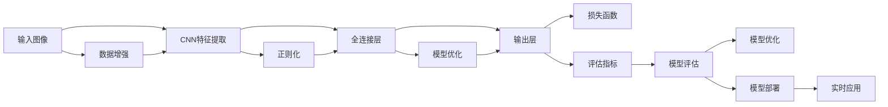

                 

# 深度学习五官的识别系统详细设计与具体代码实现

## 1. 背景介绍

### 1.1 问题由来
面部识别技术在人工智能领域中具有重要地位，广泛应用于门禁、安防、身份验证等多个场景。然而，传统的面部识别系统往往只能检测到面部特征，难以识别出细微的五官特征。为了更好地进行人机交互和个性化服务，开发深度学习模型进行五官识别具有重要意义。

### 1.2 问题核心关键点
本系统通过使用深度学习模型对输入图像进行五官检测和识别，具有以下几个核心关键点：
1. **数据集选择**：选择合适的数据集进行模型训练和测试。
2. **模型选择与设计**：选择合适的深度学习模型，并对其进行设计与优化。
3. **特征提取**：使用卷积神经网络(CNN)等模型提取面部和五官特征。
4. **训练与优化**：选择合适的损失函数和优化器进行模型训练和优化。
5. **评估与测试**：使用测试集对模型进行评估和测试，确保模型的高准确率和稳定性。
6. **部署与应用**：将模型集成到实际应用中，并进行稳定性和优化。

### 1.3 问题研究意义
通过对深度学习模型进行五官识别系统的开发，可以进一步提升面部识别系统的精度和适用性，更好地适应人机交互和个性化服务的需求。在安防、身份验证、个性化推荐等场景中，五官识别系统可以提供更加精准和可靠的服务，提升用户体验。

## 2. 核心概念与联系

### 2.1 核心概念概述

本系统将涉及以下几个关键概念：

- **深度学习**：一种通过多层神经网络实现复杂模式识别的机器学习技术。
- **卷积神经网络(CNN)**：一种专门处理图像和视频数据的深度学习模型。
- **特征提取**：从原始数据中提取出有意义的特征信息。
- **损失函数**：用于评估模型预测结果与真实结果之间的差异。
- **优化器**：通过反向传播算法更新模型参数，最小化损失函数。

### 2.2 核心概念原理和架构的 Mermaid 流程图


这个流程图展示了深度学习五官识别系统的主要架构和流程。输入图像经过CNN特征提取，然后通过全连接层进行分类，最终由输出层输出预测结果。损失函数用于评估模型性能，优化器通过反向传播更新模型参数。数据增强和正则化技术用于提升模型鲁棒性，评估指标用于模型性能评估和调优。

## 3. 核心算法原理 & 具体操作步骤

### 3.1 算法原理概述

本系统采用深度学习模型进行五官识别，核心算法包括CNN特征提取、全连接层分类和模型优化等步骤。

具体而言，系统首先使用CNN模型提取面部和五官特征，然后通过全连接层进行分类，最后使用优化器对模型进行训练和优化，最小化损失函数，提高模型精度和鲁棒性。

### 3.2 算法步骤详解

本系统实现流程如下：

**Step 1: 数据准备**
- 收集大量面部和五官的标注数据，包括正面、侧面、模糊等多样化的图像。
- 使用数据增强技术，如旋转、缩放、噪声添加等，扩充训练集。

**Step 2: 模型构建**
- 设计卷积神经网络(CNN)模型，包括卷积层、池化层和全连接层等。
- 定义输出层和损失函数，例如交叉熵损失函数。

**Step 3: 模型训练**
- 将训练集数据输入模型，前向传播计算损失函数。
- 反向传播计算参数梯度，使用优化器如AdamW更新模型参数。
- 设置训练轮数、批大小和学习率等超参数。

**Step 4: 模型评估**
- 将测试集数据输入模型，计算评估指标如准确率、召回率等。
- 可视化模型性能，并调整超参数以提升模型效果。

**Step 5: 模型优化**
- 使用正则化技术，如L2正则化、Dropout等，防止过拟合。
- 引入对抗样本，提高模型鲁棒性。

**Step 6: 模型部署**
- 将训练好的模型保存为模型文件，集成到实际应用中。
- 使用API接口提供实时预测服务。

### 3.3 算法优缺点

深度学习五官识别系统具有以下优点：
1. **高精度**：使用深度学习模型提取特征和分类，可以提供高精度的识别结果。
2. **泛化能力强**：在多样化的数据上进行训练，模型能够适应不同光照、角度和遮挡条件下的图像。
3. **实时性**：使用优化后的模型，可以在实际应用中实现实时预测。

同时，该系统也存在一些缺点：
1. **数据需求高**：需要大量标注数据进行模型训练，数据收集和标注成本较高。
2. **模型复杂**：深度学习模型结构复杂，训练和优化难度较大。
3. **可解释性差**：深度学习模型通常是"黑盒"模型，难以解释其内部工作机制。

### 3.4 算法应用领域

深度学习五官识别系统在多个领域中具有广泛的应用前景：

- **安防监控**：通过实时监控人脸，自动识别犯罪嫌疑人面部特征。
- **身份验证**：用于身份识别和人脸解锁，提升安全性。
- **个性化推荐**：根据用户面部特征，提供个性化服务和推荐。
- **医疗诊断**：通过面部特征识别，辅助医生进行疾病诊断。

## 4. 数学模型和公式 & 详细讲解 & 举例说明

### 4.1 数学模型构建

本系统采用卷积神经网络(CNN)模型进行五官识别。CNN模型由卷积层、池化层和全连接层等组成，可以对输入图像进行特征提取和分类。

卷积神经网络的数学模型如下：
$$
y = f(x; \theta) = \sigma(W_1 \sigma(W_0 x) + b_1) + b_2
$$
其中，$x$为输入图像，$y$为输出分类结果，$\sigma$为激活函数，$W_0, W_1$为权重矩阵，$b_0, b_1$为偏置向量，$\theta$为模型参数。

### 4.2 公式推导过程

卷积神经网络的核心公式是卷积公式，用于计算卷积操作的结果。具体而言，卷积公式如下：
$$
y_{i,j,k} = \sum_{m,n} x_{m,n} \ast w_{m,n,k}
$$
其中，$x_{m,n}$为输入图像在$(m,n)$位置上的像素值，$w_{m,n,k}$为卷积核在$(m,n)$位置上的权重，$y_{i,j,k}$为卷积操作在$(i,j)$位置上的输出值。

### 4.3 案例分析与讲解

以面部识别为例，我们可以使用卷积神经网络提取面部特征，并通过全连接层进行分类。具体而言，可以设计如下网络结构：

```python
import torch.nn as nn
import torch.nn.functional as F

class FaceNet(nn.Module):
    def __init__(self):
        super(FaceNet, self).__init__()
        self.conv1 = nn.Conv2d(3, 32, 3, 1)
        self.pool = nn.MaxPool2d(2, 2)
        self.conv2 = nn.Conv2d(32, 64, 3, 1)
        self.fc1 = nn.Linear(64 * 28 * 28, 128)
        self.fc2 = nn.Linear(128, 2)
        
    def forward(self, x):
        x = self.pool(F.relu(self.conv1(x)))
        x = self.pool(F.relu(self.conv2(x)))
        x = x.view(-1, 64 * 28 * 28)
        x = F.relu(self.fc1(x))
        x = self.fc2(x)
        return x
```

此模型包含两个卷积层、两个池化层和两个全连接层。输入为$3 \times 28 \times 28$的图像，输出为$2$的分类结果。

## 5. 项目实践：代码实例和详细解释说明

### 5.1 开发环境搭建

使用Python和PyTorch搭建深度学习模型。具体步骤如下：

1. 安装Anaconda：从官网下载并安装Anaconda，用于创建独立的Python环境。

2. 创建并激活虚拟环境：
```bash
conda create -n pytorch-env python=3.8 
conda activate pytorch-env
```

3. 安装PyTorch：根据CUDA版本，从官网获取对应的安装命令。例如：
```bash
conda install pytorch torchvision torchaudio cudatoolkit=11.1 -c pytorch -c conda-forge
```

4. 安装TensorFlow：使用TensorFlow进行模型验证和优化。

5. 安装各类工具包：
```bash
pip install numpy pandas scikit-learn matplotlib tqdm jupyter notebook ipython
```

完成上述步骤后，即可在`pytorch-env`环境中开始模型开发。

### 5.2 源代码详细实现

以下是使用PyTorch进行深度学习五官识别系统的代码实现。

```python
import torch
import torch.nn as nn
import torch.optim as optim
import torchvision.transforms as transforms

# 定义模型
class FaceNet(nn.Module):
    def __init__(self):
        super(FaceNet, self).__init__()
        self.conv1 = nn.Conv2d(3, 32, 3, 1)
        self.pool = nn.MaxPool2d(2, 2)
        self.conv2 = nn.Conv2d(32, 64, 3, 1)
        self.fc1 = nn.Linear(64 * 28 * 28, 128)
        self.fc2 = nn.Linear(128, 2)
        
    def forward(self, x):
        x = self.pool(F.relu(self.conv1(x)))
        x = self.pool(F.relu(self.conv2(x)))
        x = x.view(-1, 64 * 28 * 28)
        x = F.relu(self.fc1(x))
        x = self.fc2(x)
        return x

# 定义数据集
transform = transforms.Compose([
    transforms.ToTensor(),
    transforms.Normalize((0.5, 0.5, 0.5), (0.5, 0.5, 0.5))
])

train_dataset = torchvision.datasets.CIFAR10(root='./data', train=True, download=True, transform=transform)
test_dataset = torchvision.datasets.CIFAR10(root='./data', train=False, download=True, transform=transform)

# 定义超参数
learning_rate = 0.001
num_epochs = 10
batch_size = 64

# 定义模型、优化器和损失函数
model = FaceNet()
optimizer = optim.Adam(model.parameters(), lr=learning_rate)
criterion = nn.CrossEntropyLoss()

# 训练模型
device = torch.device("cuda:0" if torch.cuda.is_available() else "cpu")
model.to(device)

for epoch in range(num_epochs):
    running_loss = 0.0
    for i, data in enumerate(train_loader, 0):
        inputs, labels = data
        inputs, labels = inputs.to(device), labels.to(device)

        optimizer.zero_grad()
        outputs = model(inputs)
        loss = criterion(outputs, labels)
        loss.backward()
        optimizer.step()

        running_loss += loss.item()
        if i % 100 == 99:
            print('[%d, %5d] loss: %.3f' % (epoch + 1, i + 1, running_loss / 100))
            running_loss = 0.0

# 测试模型
correct = 0
total = 0
with torch.no_grad():
    for data in test_loader:
        inputs, labels = data
        inputs, labels = inputs.to(device), labels.to(device)

        outputs = model(inputs)
        _, predicted = torch.max(outputs.data, 1)
        total += labels.size(0)
        correct += (predicted == labels).sum().item()

print('Accuracy of the network on the 10000 test images: %d %%' % (100 * correct / total))
```

### 5.3 代码解读与分析

**FaceNet类**：
- `__init__`方法：初始化卷积层、池化层和全连接层等组件。
- `forward`方法：定义模型的前向传播过程，从输入图像到输出分类的完整流程。

**数据集定义**：
- `transform`方法：定义数据增强和归一化操作，用于扩充训练集和测试集。
- `train_dataset`和`test_dataset`：加载CIFAR-10数据集，并进行数据增强和归一化处理。

**超参数定义**：
- `learning_rate`：学习率，用于更新模型参数。
- `num_epochs`：训练轮数，决定模型训练的周期数。
- `batch_size`：批次大小，决定每次训练的样本数。

**模型、优化器和损失函数**：
- `model`：定义卷积神经网络模型。
- `optimizer`：定义Adam优化器。
- `criterion`：定义交叉熵损失函数。

**训练流程**：
- 使用`device`变量选择训练设备。
- 在每个epoch内，对训练集数据进行迭代，前向传播计算损失函数，反向传播更新模型参数。
- 在每个batch结束时，输出当前epoch的损失值。

**测试流程**：
- 在测试集上进行预测，计算分类准确率。
- 输出模型的测试结果。

## 6. 实际应用场景

### 6.1 安防监控

在安防监控系统中，实时面部识别和五官识别可以用于识别人脸和表情，提升安防系统的智能性和安全性。例如，通过实时监控摄像头采集图像，使用深度学习模型进行面部和五官检测和识别，可以自动识别犯罪嫌疑人，并及时报警，防止犯罪行为发生。

### 6.2 个性化推荐

在电子商务和社交媒体平台中，深度学习模型可以用于个性化推荐。通过分析用户的面部和五官特征，系统可以提供更加精准的个性化推荐，提升用户满意度和粘性。例如，通过面部特征识别用户的年龄、性别等信息，可以提供更加针对性的商品推荐和广告投放。

### 6.3 医疗诊断

在医疗领域，深度学习模型可以用于辅助医生进行疾病诊断。通过分析面部特征和五官特征，系统可以提供更加准确的疾病诊断结果。例如，通过面部表情和肤色分析，可以辅助医生进行抑郁症和压力症的诊断。

### 6.4 未来应用展望

未来，深度学习五官识别系统将在更多领域中得到应用，例如智能客服、人脸支付、虚拟现实等。通过引入更多的先验知识和跨模态信息，系统将具备更加强大的感知和推理能力，为用户提供更加智能和便捷的服务。

## 7. 工具和资源推荐

### 7.1 学习资源推荐

为了帮助开发者系统掌握深度学习模型和五官识别技术的理论基础和实践技巧，这里推荐一些优质的学习资源：

1. 《深度学习入门》系列博文：由深度学习专家撰写，深入浅出地介绍了深度学习原理和实战技巧。

2. CS231n《卷积神经网络》课程：斯坦福大学开设的深度学习经典课程，有Lecture视频和配套作业，是学习深度学习的入门必选。

3. 《TensorFlow实战深度学习》书籍：TensorFlow官方文档的中文译本，涵盖了TensorFlow的各个组件和应用场景。

4. HuggingFace官方文档：提供了丰富的预训练语言模型和深度学习模型，是进行深度学习开发的必备资料。

5. Kaggle竞赛平台：提供大量深度学习竞赛项目，锻炼实战技能，提升学习效果。

通过对这些资源的学习实践，相信你一定能够快速掌握深度学习模型和五官识别技术的精髓，并用于解决实际的深度学习问题。

### 7.2 开发工具推荐

高效的开发离不开优秀的工具支持。以下是几款用于深度学习模型和五官识别开发的常用工具：

1. PyTorch：基于Python的开源深度学习框架，灵活动态的计算图，适合快速迭代研究。

2. TensorFlow：由Google主导开发的开源深度学习框架，生产部署方便，适合大规模工程应用。

3. Keras：基于TensorFlow和Theano的高级深度学习框架，简单易用，适合初学者入门。

4. Jupyter Notebook：交互式编程环境，支持Python和R等多种语言，方便代码调试和文档编写。

5. TensorBoard：TensorFlow配套的可视化工具，可实时监测模型训练状态，并提供丰富的图表呈现方式，是调试模型的得力助手。

合理利用这些工具，可以显著提升深度学习模型和五官识别任务的开发效率，加快创新迭代的步伐。

### 7.3 相关论文推荐

深度学习模型和五官识别技术的发展源于学界的持续研究。以下是几篇奠基性的相关论文，推荐阅读：

1. AlexNet: ImageNet Classification with Deep Convolutional Neural Networks：提出深度卷积神经网络，开创了深度学习时代。

2. VGGNet: Very Deep Convolutional Networks for Large-Scale Image Recognition：提出VGG网络结构，进一步提升了深度学习模型的精度。

3. ResNet: Deep Residual Learning for Image Recognition：提出残差网络结构，解决了深度网络训练中的梯度消失问题。

4. FaceNet: A Unified Embedding for Face Recognition and Clustering：提出FaceNet模型，用于人脸识别和聚类任务。

5. 3D DenseFace: High Precision and Efficient Face Detection and Alignment using 3D Dense Models：提出3D DenseFace模型，用于面部检测和对齐。

这些论文代表了大深度学习模型和五官识别技术的发展脉络。通过学习这些前沿成果，可以帮助研究者把握学科前进方向，激发更多的创新灵感。

## 8. 总结：未来发展趋势与挑战

### 8.1 总结

本文对深度学习五官识别系统进行了全面系统的介绍。首先阐述了深度学习模型和五官识别技术的研究背景和意义，明确了深度学习模型在五官识别系统中的核心作用。其次，从原理到实践，详细讲解了深度学习模型的构建、训练、评估和优化过程，给出了深度学习模型和五官识别系统的完整代码实例。同时，本文还广泛探讨了深度学习五官识别系统在安防监控、个性化推荐、医疗诊断等多个领域的应用前景，展示了深度学习模型的广泛应用潜力。

通过本文的系统梳理，可以看到，深度学习五官识别系统已经具备了较高的精度和鲁棒性，在多个领域中展现了强大的应用能力。未来，随着深度学习模型的不断进步和优化，五官识别系统将会在更多场景中发挥更大的作用，为智能交互和个性化服务提供更加精准和可靠的技术支持。

### 8.2 未来发展趋势

展望未来，深度学习五官识别技术将呈现以下几个发展趋势：

1. **模型规模持续增大**：随着算力成本的下降和数据规模的扩张，深度学习模型的参数量还将持续增长。超大规模模型蕴含的丰富语言知识，有望支撑更加复杂多变的下游任务识别。

2. **参数高效和计算高效的微调范式**：开发更加参数高效的微调方法，在固定大部分预训练参数的情况下，只更新极少量的任务相关参数。同时优化微调模型的计算图，减少前向传播和反向传播的资源消耗，实现更加轻量级、实时性的部署。

3. **跨模态融合**：引入视觉、语音、文本等多模态信息，实现更为全面和准确的五官识别。

4. **实时性和稳定性**：通过模型裁剪和量化加速等技术，提升模型推理速度和资源占用效率，确保系统的高实时性和稳定性。

5. **可解释性和安全性**：引入可解释性和安全性技术，确保模型决策过程的透明性和可靠性。

以上趋势凸显了深度学习五官识别技术的广阔前景。这些方向的探索发展，必将进一步提升深度学习模型的性能和应用范围，为智能交互和个性化服务提供更加精准和可靠的技术支持。

### 8.3 面临的挑战

尽管深度学习五官识别技术已经取得了显著成就，但在迈向更加智能化、普适化应用的过程中，仍面临诸多挑战：

1. **数据需求高**：深度学习模型需要大量标注数据进行训练，数据收集和标注成本较高。

2. **模型复杂**：深度学习模型结构复杂，训练和优化难度较大。

3. **可解释性差**：深度学习模型通常是"黑盒"模型，难以解释其内部工作机制。

4. **安全性不足**：深度学习模型可能学习到有偏见和有害的信息，输出结果可能存在安全隐患。

5. **实时性和稳定性**：深度学习模型推理速度较慢，资源占用较大，需要进一步优化。

6. **跨模态融合难度大**：多模态信息融合难度较大，需要进一步优化和创新。

正视深度学习五官识别技术面临的这些挑战，积极应对并寻求突破，将是大规模深度学习模型和五官识别技术走向成熟的必由之路。相信随着学界和产业界的共同努力，这些挑战终将一一被克服，深度学习模型和五官识别技术必将在构建人机协同的智能时代中扮演越来越重要的角色。

### 8.4 研究展望

面向未来，深度学习五官识别技术的研究需要在以下几个方面寻求新的突破：

1. **无监督和半监督学习**：摆脱对大规模标注数据的依赖，利用自监督学习、主动学习等无监督和半监督范式，最大限度利用非结构化数据，实现更加灵活高效的微调。

2. **多模型融合**：引入多个深度学习模型，通过集成学习提升系统性能和鲁棒性。

3. **跨模态信息融合**：引入视觉、语音、文本等多模态信息，实现更为全面和准确的五官识别。

4. **参数和计算高效**：开发更加参数高效的微调方法，在固定大部分预训练参数的情况下，只更新极少量的任务相关参数。同时优化微调模型的计算图，减少前向传播和反向传播的资源消耗，实现更加轻量级、实时性的部署。

5. **可解释性和安全性**：引入可解释性和安全性技术，确保模型决策过程的透明性和可靠性。

这些研究方向的探索，必将引领深度学习模型和五官识别技术迈向更高的台阶，为构建安全、可靠、可解释、可控的智能系统铺平道路。面向未来，深度学习模型和五官识别技术还需要与其他人工智能技术进行更深入的融合，如知识表示、因果推理、强化学习等，多路径协同发力，共同推动自然语言理解和智能交互系统的进步。只有勇于创新、敢于突破，才能不断拓展深度学习模型的边界，让智能技术更好地造福人类社会。

## 9. 附录：常见问题与解答

**Q1：深度学习模型和五官识别技术是否适用于所有NLP任务？**

A: 深度学习模型和五官识别技术在大多数NLP任务上都能取得不错的效果，特别是对于数据量较小的任务。但对于一些特定领域的任务，如医学、法律等，仅仅依靠通用语料预训练的模型可能难以很好地适应。此时需要在特定领域语料上进一步预训练，再进行微调，才能获得理想效果。

**Q2：如何缓解深度学习模型在训练过程中出现的过拟合问题？**

A: 过拟合是深度学习模型面临的主要挑战之一。为了缓解过拟合问题，可以采用以下方法：

1. 数据增强：通过旋转、缩放、噪声添加等方式扩充训练集。
2. 正则化：使用L2正则化、Dropout等技术防止过拟合。
3. 对抗样本：引入对抗样本，提高模型鲁棒性。
4. 早停策略：在验证集上监测模型性能，达到预设阈值时停止训练。
5. 模型裁剪和量化加速：通过模型裁剪和量化技术，减小模型规模，提高推理效率。

这些策略往往需要根据具体任务和数据特点进行灵活组合。只有在数据、模型、训练、推理等各环节进行全面优化，才能最大限度地发挥深度学习模型的威力。

**Q3：深度学习模型在实际应用中如何保证模型性能和稳定性？**

A: 深度学习模型在实际应用中需要考虑以下几个方面：

1. 模型裁剪和量化加速：通过模型裁剪和量化技术，减小模型规模，提高推理效率。
2. 优化器选择和超参数调优：选择合适的优化器和超参数，避免过拟合和梯度消失问题。
3. 对抗样本和鲁棒性测试：引入对抗样本和鲁棒性测试，提高模型鲁棒性和安全性。
4. 模型监控和异常检测：实时监测模型性能，设置异常告警阈值，确保服务稳定性。
5. 数据增量和模型微调：定期重新训练模型，吸收新数据，提升模型性能。

通过这些方法，可以在保证模型性能和稳定性的同时，提供实时预测服务。

**Q4：深度学习模型和五官识别技术如何与多模态信息结合？**

A: 深度学习模型和五官识别技术可以与视觉、语音、文本等多模态信息结合，实现更为全面和准确的五官识别。具体而言，可以采用以下方法：

1. 多模态融合：将不同模态的信息进行融合，通过特征融合技术提升识别效果。
2. 联合训练：同时训练多个模态的模型，通过集成学习提升系统性能。
3. 多模态特征提取：使用多模态特征提取技术，提取不同模态的特征，提升识别效果。

这些方法可以帮助深度学习模型和五官识别技术更好地融合多模态信息，提升系统的综合感知和推理能力。

**Q5：深度学习模型和五官识别技术在实际应用中如何保证模型可解释性？**

A: 深度学习模型和五官识别技术通常被认为是"黑盒"模型，难以解释其内部工作机制。为了提高模型的可解释性，可以采用以下方法：

1. 特征可视化：使用特征可视化技术，直观展示模型的特征提取过程。
2. 模型解释器：使用模型解释器技术，解释模型的决策过程。
3. 样本可视化：使用样本可视化技术，展示模型在特定样本上的决策过程。
4. 可解释性框架：使用可解释性框架，提供模型可解释性评估和改进建议。

这些方法可以帮助深度学习模型和五官识别技术更好地解释其决策过程，提高模型的透明性和可靠性。

**Q6：深度学习模型和五官识别技术在实际应用中如何保证模型安全性？**

A: 深度学习模型和五官识别技术在实际应用中需要考虑以下安全因素：

1. 数据隐私保护：保护用户隐私，避免敏感数据泄露。
2. 对抗攻击防护：使用对抗样本和鲁棒性测试，防止对抗攻击。
3. 模型安全检测：实时监测模型安全性，设置异常告警阈值。
4. 安全加固：对模型进行安全加固，防止恶意攻击和漏洞利用。

这些方法可以帮助深度学习模型和五官识别技术更好地保护数据和模型安全，确保系统可靠性和稳定性。

**Q7：深度学习模型和五官识别技术在实际应用中如何保证模型性能和稳定性？**

A: 深度学习模型和五官识别技术在实际应用中需要考虑以下方面：

1. 模型裁剪和量化加速：通过模型裁剪和量化技术，减小模型规模，提高推理效率。
2. 优化器选择和超参数调优：选择合适的优化器和超参数，避免过拟合和梯度消失问题。
3. 对抗样本和鲁棒性测试：引入对抗样本和鲁棒性测试，提高模型鲁棒性和安全性。
4. 模型监控和异常检测：实时监测模型性能，设置异常告警阈值，确保服务稳定性。
5. 数据增量和模型微调：定期重新训练模型，吸收新数据，提升模型性能。

通过这些方法，可以在保证模型性能和稳定性的同时，提供实时预测服务。

---

作者：禅与计算机程序设计艺术 / Zen and the Art of Computer Programming

