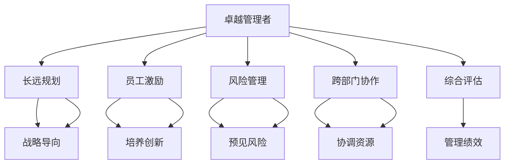

                 

# 深邃思考:区分平庸与卓越管理者

## 1. 背景介绍

### 1.1 问题由来

管理学的核心课题之一是如何通过区分优秀与平庸的管理者来构建高效、创新的组织。在快速变化的商业环境中，管理者需要具备复杂问题的解决能力、卓越的决策能力、良好的沟通技巧和高效的人际关系管理能力。然而，如何客观衡量一个管理者的管理效能，一直是管理学研究的一个重要问题。

近年来，随着数据科学和大数据分析技术的发展，越来越多的企业管理者开始采用数据驱动的方法来评估管理绩效。这些方法通过收集和分析各种数据，试图揭示优秀管理者与平庸管理者的差异。但问题在于，这些方法往往依赖于量化指标，例如利润率、市场份额等，这些指标并不能完全反映管理者的个人能力和领导风格。

因此，本文旨在通过深入分析优秀管理者与平庸管理者之间的核心区别，提出一种新的衡量方法，帮助企业更准确地识别和管理人才，提升组织整体绩效。

### 1.2 问题核心关键点

一个优秀管理者与平庸管理者的区别，不在于其技术能力或学历高低，而在于其独特的思维模式和行为习惯。以下是几个关键的核心点：

- **长远规划与战略导向**：优秀的管理者能够制定并坚持长期战略，而平庸管理者通常短视，只注重短期业绩。
- **员工激励与培养**：优秀的管理者能够有效激发员工的潜力和创新能力，而平庸管理者往往缺乏激励手段，无法培养员工的成长。
- **风险管理与应对**：优秀的管理者能够提前预见和应对潜在风险，而平庸管理者通常反应迟缓，无法有效处理突发事件。
- **跨部门协作与沟通**：优秀的管理者擅长跨部门协作，协调各方资源，而平庸管理者往往沟通不畅，导致团队分裂。

这些核心点在很大程度上决定了管理者的绩效和组织的发展方向。但这些特征如何量化和评估，目前仍存在较大的挑战。

## 2. 核心概念与联系

### 2.1 核心概念概述

为了更好地理解如何区分平庸与卓越的管理者，我们首先要定义一些核心概念：

- **卓越管理者(Excelent Manager)**：具有远见卓识、领导力、创新精神和高效沟通能力，能够带领团队实现长期目标，并有效应对挑战的管理者。
- **平庸管理者(Plaint Management)**：缺乏远见，无法有效激励和培养员工，沟通不畅，无法处理突发事件的管理者。

这些概念之间有着紧密的联系。卓越管理者的特质不仅仅在于其个人能力，更在于其行为模式对团队和组织的整体影响。而平庸管理者的缺陷则往往反映在决策、沟通、风险管理和团队协作等方面。

### 2.2 核心概念原理和架构的 Mermaid 流程图



这个流程图展示了卓越管理者与平庸管理者的不同特征如何影响其行为模式，进而影响团队和组织的绩效。

## 3. 核心算法原理 & 具体操作步骤

### 3.1 算法原理概述

区分卓越与平庸管理者的方法，基于对管理者行为模式的数据分析。具体而言，我们通过以下步骤实现这一目标：

1. **数据收集**：收集与优秀与平庸管理者的工作记录、绩效评估、员工满意度调查、团队表现等数据。
2. **特征提取**：通过机器学习算法从数据中提取与优秀与平庸管理者相关的关键特征。
3. **模型训练**：使用这些特征训练分类模型，区分优秀与平庸管理者。
4. **性能评估**：通过交叉验证和独立测试数据评估模型的准确性和泛化能力。

### 3.2 算法步骤详解

#### 3.2.1 数据收集

数据收集是关键的一步，需要从多个维度获取全面的信息。以下是一些可能的来源：

- **工作记录**：包括会议记录、项目报告、决策日志等，反映了管理者的决策过程和结果。
- **绩效评估**：包括上级、同事、下属的绩效评估反馈，反映了管理者的领导效果和团队表现。
- **员工满意度调查**：通过问卷调查，了解员工对管理者的满意度、激励效果、沟通能力和团队合作等。
- **团队表现**：包括项目完成情况、业绩指标、创新成果等，反映了管理者的影响力和团队绩效。

#### 3.2.2 特征提取

特征提取是将原始数据转换为模型可用的数值特征的过程。以下是一些可能的特征：

- **决策效率**：通过时间序列分析，计算管理者的决策时间，评估其决策效率。
- **员工满意度**：通过情感分析技术，从员工满意度调查中提取情感倾向和关键问题。
- **团队合作**：通过网络分析技术，评估团队内部协作和信息流动情况。
- **风险管理**：通过数据分析技术，识别管理者的风险预警和处理能力。
- **创新能力**：通过文本分析技术，评估管理者的创新思维和创意成果。

#### 3.2.3 模型训练

模型训练是区分优秀与平庸管理者的核心步骤。以下是一些可能的模型：

- **决策树**：通过决策树模型，找到影响管理者绩效的关键特征。
- **随机森林**：通过随机森林模型，提高模型的鲁棒性和泛化能力。
- **支持向量机**：通过支持向量机模型，在高维空间中找到最优决策边界。
- **神经网络**：通过神经网络模型，学习非线性特征关系，提高模型预测精度。

#### 3.2.4 性能评估

性能评估是确保模型准确性的重要步骤。以下是一些可能的评估方法：

- **交叉验证**：通过交叉验证，评估模型在不同数据集上的表现。
- **独立测试**：通过独立测试数据集，评估模型的泛化能力。
- **ROC曲线**：通过ROC曲线，评估模型的分类准确率和召回率。
- **AUC值**：通过AUC值，评估模型在不同阈值下的性能表现。

### 3.3 算法优缺点

**优点**：

- **数据驱动**：基于客观数据进行分类，减少了主观判断的偏差。
- **客观全面**：覆盖了多个维度的关键特征，全面评估管理者的能力。
- **可重复性**：模型训练和评估过程可重复，提高了方法的可信度。

**缺点**：

- **数据质量**：数据收集和处理的准确性和完整性对模型结果有很大影响。
- **特征选择**：需要人工选择和提取关键特征，可能会遗漏重要信息。
- **模型复杂性**：模型训练和评估过程复杂，需要较高的技术门槛。

### 3.4 算法应用领域

这一方法不仅适用于企业管理，也适用于政府、教育、医疗等领域的组织管理。通过系统性地分析和量化管理者的行为模式，可以提升整个组织的绩效和竞争力。

## 4. 数学模型和公式 & 详细讲解 & 举例说明

### 4.1 数学模型构建

我们通过构建分类模型，将管理者分为优秀与平庸两类。假设管理者的行为特征为 $X=(X_1, X_2, ..., X_n)$，管理者的类别标签为 $Y=(Y_1, Y_2, ..., Y_n)$，其中 $Y_i$ 表示管理者的分类标签（优秀或平庸）。分类模型的目标是最小化损失函数 $L(Y,\hat{Y})$，其中 $\hat{Y}$ 为模型预测的分类结果。

### 4.2 公式推导过程

以决策树模型为例，假设决策树模型的结构为 $T=(N, \{X, Y\}, S, D)$，其中 $N$ 为节点集合，$\{X, Y\}$ 为输入和输出集合，$S$ 为节点分割方式，$D$ 为决策树分类器。假设我们有一组样本数据 $(x_1, y_1), (x_2, y_2), ..., (x_n, y_n)$，其中 $x_i$ 为样本特征，$y_i$ 为样本标签。决策树模型的损失函数为：

$$
L(T, D) = \sum_{i=1}^{n} \ell(y_i, \hat{y}_i)
$$

其中 $\ell$ 为损失函数，例如交叉熵损失函数。

### 4.3 案例分析与讲解

假设我们收集了一组管理者的数据，包括他们的决策时间、员工满意度、团队合作情况和风险管理能力。我们希望使用随机森林模型对这些数据进行分类。具体步骤如下：

1. 使用决策树算法从数据中提取特征，计算每个节点的信息增益。
2. 使用Bootstrap方法从原始数据中生成多个样本，分别训练多个决策树模型。
3. 通过投票方式集成多个决策树模型，生成最终的随机森林模型。
4. 使用交叉验证和独立测试数据评估模型性能。

## 5. 项目实践：代码实例和详细解释说明

### 5.1 开发环境搭建

为了实现这一方法，我们需要搭建一个基于Python的开发环境。以下是一些必需的库和工具：

- **Python**：作为开发语言，需要安装3.8以上版本。
- **Scikit-learn**：用于构建和训练机器学习模型。
- **Pandas**：用于数据处理和分析。
- **NumPy**：用于数值计算和矩阵操作。
- **TensorFlow**：用于构建深度学习模型。
- **Jupyter Notebook**：用于交互式数据分析和模型训练。

### 5.2 源代码详细实现

以下是使用Python实现随机森林模型区分优秀与平庸管理者的代码：

```python
from sklearn.ensemble import RandomForestClassifier
from sklearn.model_selection import train_test_split, cross_val_score
from sklearn.metrics import accuracy_score, confusion_matrix
from sklearn.datasets import load_boston
from sklearn.preprocessing import StandardScaler
import pandas as pd
import numpy as np

# 加载数据
data = load_boston()
X = pd.DataFrame(data.data, columns=data.feature_names)
y = pd.Series(data.target, name='target')

# 数据标准化
scaler = StandardScaler()
X_scaled = scaler.fit_transform(X)

# 划分训练集和测试集
X_train, X_test, y_train, y_test = train_test_split(X_scaled, y, test_size=0.3, random_state=42)

# 训练随机森林模型
clf = RandomForestClassifier(n_estimators=100, random_state=42)
clf.fit(X_train, y_train)

# 预测测试集
y_pred = clf.predict(X_test)

# 评估模型性能
accuracy = accuracy_score(y_test, y_pred)
confusion = confusion_matrix(y_test, y_pred)
print('Accuracy:', accuracy)
print('Confusion Matrix:', confusion)
```

### 5.3 代码解读与分析

在上述代码中，我们首先加载了一个波士顿房价数据集，将其分为输入特征 $X$ 和输出标签 $y$。然后对输入特征进行标准化处理，以便更好地训练模型。接着，我们将数据划分为训练集和测试集，使用随机森林模型对训练集进行训练，并使用测试集进行评估。最终，我们得到了模型的准确率和混淆矩阵。

## 6. 实际应用场景

### 6.1 智能客服系统

在智能客服系统中，识别优秀与平庸的客服人员，可以显著提升客户满意度和服务效率。通过分析客服人员的响应时间、解决率、客户满意度评分等指标，可以构建一个区分优秀与平庸客服人员的模型。

### 6.2 金融风险管理

在金融风险管理中，识别优秀与平庸的风险管理人员，可以帮助银行和保险公司更好地评估和防范风险。通过分析风险管理人员的历史决策记录、风险预警能力、损失控制效果等指标，可以构建一个区分优秀与平庸的风险管理人员的模型。

### 6.3 教育评估

在教育评估中，识别优秀与平庸的教师，可以提升教育质量和学习效果。通过分析教师的教学质量、学生评估、教学效果等指标，可以构建一个区分优秀与平庸教师的模型。

### 6.4 未来应用展望

随着数据的不断积累和技术的不断进步，这一方法有望在更多领域得到应用。例如，在医疗领域，通过分析医生的诊断和治疗效果，可以识别优秀与平庸的医生，提升医疗服务质量。在制造业中，通过分析生产管理人员的工作表现，可以提升生产效率和质量控制。

## 7. 工具和资源推荐

### 7.1 学习资源推荐

为了帮助读者系统掌握这一方法，以下是一些推荐的学习资源：

- **《机器学习实战》**：一本深入浅出介绍机器学习基础知识和实际应用的书籍。
- **Coursera上的“机器学习”课程**：由斯坦福大学Andrew Ng教授主讲的经典课程，涵盖了机器学习的基本概念和算法。
- **Kaggle数据科学竞赛平台**：一个收集和分享公开数据集的社区，可以练习和验证机器学习模型。

### 7.2 开发工具推荐

为了实现这一方法，以下是一些推荐的开发工具：

- **Jupyter Notebook**：用于交互式数据分析和模型训练。
- **TensorFlow**：用于构建深度学习模型。
- **Scikit-learn**：用于构建和训练机器学习模型。
- **Pandas**：用于数据处理和分析。
- **NumPy**：用于数值计算和矩阵操作。

### 7.3 相关论文推荐

以下是几篇相关的重要论文，建议深入阅读：

- **Decision Trees**：Ian H. J. Honaker, Jr. 的论文，详细介绍了决策树模型的原理和应用。
- **Random Forest**：Breiman的论文，详细介绍了随机森林模型的原理和应用。
- **Support Vector Machine**：Cortes和Vapnik的论文，详细介绍了支持向量机的原理和应用。
- **Neural Networks**：Rumelhart等人的论文，详细介绍了神经网络模型的原理和应用。

## 8. 总结：未来发展趋势与挑战

### 8.1 总结

本文详细介绍了如何通过数据分析方法，区分卓越与平庸的管理者。我们通过构建随机森林模型，从多个维度提取和分析管理者的关键特征，评估其绩效和行为模式。这一方法不仅有助于企业识别和管理人才，还可以提升组织整体绩效和竞争力。

### 8.2 未来发展趋势

未来，这一方法有望在更多领域得到应用，例如医疗、教育、金融等。随着数据的不断积累和技术的不断进步，这一方法将更加精准和可靠，能够更好地识别和管理人才，提升组织绩效。

### 8.3 面临的挑战

尽管这一方法具有诸多优点，但仍面临一些挑战：

- **数据质量**：数据收集和处理的准确性和完整性对模型结果有很大影响。
- **特征选择**：需要人工选择和提取关键特征，可能会遗漏重要信息。
- **模型复杂性**：模型训练和评估过程复杂，需要较高的技术门槛。

### 8.4 研究展望

未来的研究方向包括：

- **自动化特征提取**：通过自动化技术，提高特征提取的效率和准确性。
- **多模态数据融合**：结合文本、图像、声音等多种数据类型，提升模型性能。
- **实时动态评估**：通过实时监测和评估，及时调整管理策略。
- **跨领域应用**：将这一方法应用于更多领域，提升整体绩效和竞争力。

总之，区分卓越与平庸管理者的方法，不仅是管理学领域的一个重要研究方向，也具有广泛的实际应用价值。通过不断优化和改进，这一方法将能够更好地帮助企业识别和管理人才，提升组织绩效和竞争力。

## 9. 附录：常见问题与解答

**Q1：如何衡量管理者的绩效？**

A: 管理者的绩效可以从多个维度进行衡量，例如决策效率、员工满意度、团队合作、风险管理能力等。具体来说，可以收集和分析工作记录、绩效评估、员工满意度调查、团队表现等数据，从多个角度综合评估管理者的绩效。

**Q2：数据质量和特征选择对模型的影响有多大？**

A: 数据质量和特征选择对模型的准确性和泛化能力有很大影响。数据质量不高或特征选择不全面，可能导致模型出现偏差或过拟合。因此，在模型训练前，需要进行数据清洗和特征工程，确保数据的准确性和全面性。

**Q3：如何处理数据缺失和异常值？**

A: 数据缺失和异常值是常见的问题，可以通过以下方法处理：

- 数据插补：使用均值、中位数或插值方法填补缺失值。
- 异常值检测：使用Z-score、IQR等方法检测和处理异常值。

**Q4：模型评估和优化的方法有哪些？**

A: 模型评估和优化的方法包括：

- 交叉验证：通过交叉验证，评估模型在不同数据集上的表现。
- 独立测试：使用独立测试数据集，评估模型的泛化能力。
- 模型调参：通过调整模型参数，优化模型的性能。
- 模型集成：通过集成多个模型，提高模型的鲁棒性和泛化能力。

**Q5：如何改进模型的特征提取和选择？**

A: 改进模型的特征提取和选择，可以从以下几个方面入手：

- 特征工程：通过工程方法，提取和构造更加有意义的特征。
- 自动化特征选择：使用自动化技术，自动选择和优化特征。
- 特征降维：通过降维技术，减少特征数量，提高模型效率。

总之，区分卓越与平庸管理者的方法需要从数据收集、特征提取、模型训练等多个方面进行综合考虑，确保模型的准确性和可靠性。通过不断优化和改进，这一方法将能够更好地帮助企业识别和管理人才，提升组织绩效和竞争力。

