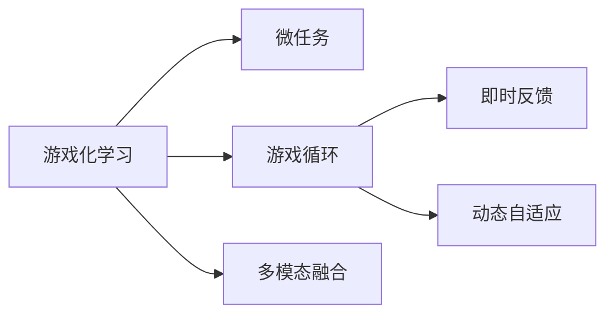

                 

# 游戏化学习：寓教于乐，激发参与热情

## 1. 背景介绍

### 1.1 问题由来
在信息爆炸的互联网时代，知识的获取和传播变得前所未有的便捷，但教育形式依然受限于传统的课堂教学，难以激发学生的主动学习热情。随着人工智能和计算机技术的深入应用，游戏化学习（Gamified Learning）成为一种新颖的教育模式，通过将游戏元素和教学内容有机结合，不仅丰富了学习体验，还显著提升了学习效果。

游戏化学习源自游戏心理学和行为科学的理论基础，通过设计任务、奖励、竞赛等机制，引导学习者自主探索和解决问题，从而达到主动学习的目标。游戏化学习的方法在教育领域得到了广泛应用，如Khan Academy、Coursera等在线教育平台，都采用了游戏化设计来提升学生的学习兴趣和参与度。

### 1.2 问题核心关键点
游戏化学习的核心在于如何利用游戏元素和技术，设计高效的教学内容和方法，激发学生的参与热情。核心关键点包括：
- **任务设计**：通过设定任务和目标，引导学习者有目的性地进行探索和学习。
- **奖励机制**：通过即时反馈和激励，增强学习者的积极性和成就感。
- **互动和社交**：通过团队合作和社交互动，营造积极的学习氛围和归属感。
- **进度跟踪与反馈**：实时跟踪学习进度，及时提供个性化反馈，帮助学习者调整学习策略。
- **多模态融合**：结合图像、声音、视频等多模态内容，丰富学习体验。
- **自适应学习**：根据学习者的反馈和表现，动态调整学习内容和难度。

## 2. 核心概念与联系

### 2.1 核心概念概述

为更好地理解游戏化学习，本节将介绍几个密切相关的核心概念：

- **游戏化学习（Gamified Learning）**：指通过引入游戏元素（如任务、挑战、奖励、社交等），提升学习动机和参与度的教学方法。
- **微任务（Microtask）**：指设计细粒度的任务，让学习者能够在短时间内完成并得到即时反馈，增强学习者的积极性和成就感。
- **游戏循环（Game Loop）**：指游戏化学习中的核心循环结构，包括任务设定、执行、反馈、奖励、进度的周期性循环。
- **即时反馈（Immediate Feedback）**：指在任务完成后的即时反馈，帮助学习者快速调整学习策略，避免挫败感。
- **动态自适应（Dynamic Adaptation）**：指根据学习者的表现和反馈，动态调整学习内容和难度，提升学习效率。
- **多模态融合（Multimodality）**：指结合文本、图像、声音、视频等多种模态的内容，丰富学习体验。

这些核心概念之间的逻辑关系可以通过以下Mermaid流程图来展示：



这个流程图展示了大语言模型的核心概念及其之间的关系：

1. 游戏化学习通过微任务设计，引导学习者进行细粒度的学习。
2. 通过游戏循环，不断重复任务设定、执行、反馈、奖励等步骤，增强学习者的参与感和成就感。
3. 动态自适应根据学习者的表现，调整任务难度和内容，提升学习效率。
4. 多模态融合丰富学习体验，帮助学习者从多角度理解和掌握知识。

## 3. 核心算法原理 & 具体操作步骤
### 3.1 算法原理概述

游戏化学习的核心算法原理在于通过设计细粒度的任务和即时反馈机制，引导学习者自主学习和探索。其核心思想是通过任务设定、执行、反馈和奖励的周期性循环，持续激励学习者，增强其动机和参与度。

### 3.2 算法步骤详解

游戏化学习的算法步骤主要包括以下几个关键步骤：

**Step 1: 任务设计**
- 确定学习目标和知识点，设计细粒度的任务。任务应具有可执行性、可测量性和可重复性，便于学习者理解和完成。
- 将任务分解为多个子任务，每个子任务都应具备明确的目标和具体的执行步骤。

**Step 2: 任务执行**
- 学习者根据任务要求，自主进行探索和学习。可以通过游戏化平台（如Khan Academy、Coursera等）的在线工具，如在线模拟、虚拟实验室、互动问答等，完成各项任务。
- 设计任务执行过程中的互动和反馈机制，如即时消息、自动评估、智能提示等，帮助学习者顺利完成任务。

**Step 3: 反馈和奖励**
- 在任务完成后，根据学习者的表现提供即时反馈，指出其优点和不足，并给出改进建议。
- 根据学习者的表现给予奖励，如积分、徽章、虚拟货币等，增强其成就感和参与度。

**Step 4: 动态调整**
- 根据学习者的表现和反馈，动态调整任务难度和内容，以匹配其当前的学习水平。
- 实时跟踪学习进度，及时提供个性化反馈，帮助学习者调整学习策略。

**Step 5: 社交互动**
- 设计团队合作和社交互动机制，通过讨论组、论坛、社交网络等工具，促进学习者之间的交流和协作。
- 举办线上或线下的学习竞赛、挑战赛等活动，增强学习者的竞争意识和归属感。

### 3.3 算法优缺点

游戏化学习的优点在于：
1. 增强学习动机。通过设定任务和即时反馈机制，游戏化学习能够显著提升学习者的参与热情和动机。
2. 提高学习效果。细粒度的任务设计和即时反馈机制，使得学习者能够更高效地掌握知识。
3. 丰富学习体验。多模态融合、社交互动等元素，使得学习过程更加生动有趣。
4. 可扩展性强。游戏化学习可以应用于多种学科和领域，适应性广泛。

同时，该方法也存在一定的局限性：
1. 设计复杂度高。任务设计和奖励机制需要精心设计，难度较大。
2. 资源需求高。开发和维护游戏化平台需要大量的人力和物力投入。
3. 适用性有限。并非所有学习场景都适合游戏化设计，部分学习内容可能难以通过游戏化手段有效呈现。
4. 易产生依赖。过度依赖奖励和即时反馈，可能削弱学习者的内在动力。

尽管存在这些局限性，但就目前而言，游戏化学习仍是一种高效且受欢迎的教育模式，适用于多种学习场景。

### 3.4 算法应用领域

游戏化学习在多个领域都得到了广泛应用，包括但不限于：

- 基础教育：通过游戏化的学习平台和工具，提升小学生、中学生等基础教育阶段的学习动机和效果。
- 高等教育：在大学通识课、专业课等领域，通过设计游戏化任务和奖励机制，增强学生参与度和学习效果。
- 职业培训：在职业技能培训中，通过游戏化模拟和实战训练，提升学员的实操能力和职业素养。
- 企业内训：在公司内部培训中，通过游戏化设计和互动，提升员工的团队合作和知识掌握。
- 语言学习：在游戏化的语言学习平台，通过任务设计、互动和奖励机制，提升用户的外语学习效果。
- 学术研究：在科学、工程等领域，通过游戏化设计和实验模拟，提高研究人员的研究兴趣和效率。

## 4. 数学模型和公式 & 详细讲解 & 举例说明
### 4.1 数学模型构建

在数学模型构建方面，游戏化学习主要涉及任务设计、即时反馈和奖励机制的设计。这里以一个简单的学习游戏为例，构建数学模型：

- **任务设计**：假设学习目标是掌握基础的数学运算，设计一个"24点"游戏，要求玩家通过加减乘除，将给定的四个数字转化为24。
- **即时反馈**：玩家每完成一次尝试，立即计算其正确性，并给出得分。得分可以累加，用于后续的奖励计算。
- **奖励机制**：每完成一定数量的正确题目，玩家可以获得积分和虚拟货币，用于购买游戏道具或解锁新关卡。

### 4.2 公式推导过程

以"24点"游戏为例，可以定义以下几个关键变量：

- $T$：任务总数，即所有可能的四数字组合。
- $S_i$：第 $i$ 次尝试的正确性，$S_i \in \{0,1\}$，$1$ 表示正确，$0$ 表示错误。
- $D_i$：第 $i$ 次尝试的得分，$D_i=S_i\times C_i$，$C_i$ 为第 $i$ 次尝试的奖励系数。
- $P_i$：第 $i$ 次尝试的概率分布，即每次尝试得到正确答案的概率。
- $R$：总奖励，$R=\sum_{i=1}^N D_i$，$N$ 为总尝试次数。

根据上述变量，可以推导出每个玩家的总奖励期望值 $E$：

$$
E = \sum_{i=1}^N \mathbb{E}[D_i] = \sum_{i=1}^N \mathbb{E}[S_i] \mathbb{E}[C_i] = P \mathbb{E}[C_i]
$$

其中 $P$ 为每个玩家完成所有任务的平均正确率，$\mathbb{E}[C_i]$ 为每次尝试的平均奖励。

### 4.3 案例分析与讲解

以"24点"游戏为例，分析游戏化学习的数学模型构建和公式推导过程：

- **任务设计**：将所有可能的四数字组合作为任务集合 $T$，每个数字的随机组合作为一个独立任务。
- **即时反馈**：每次尝试后，根据玩家是否得到正确答案，立即计算得分 $D_i$，并更新总得分 $R$。
- **奖励机制**：每次正确尝试后，奖励系数 $C_i$ 可以根据正确率和难度调整，例如简单任务奖励系数高，复杂任务奖励系数低。
- **总奖励期望**：通过计算总奖励期望值 $E$，可以评估玩家的学习效果和动机，并优化奖励机制。

## 5. 项目实践：代码实例和详细解释说明
### 5.1 开发环境搭建

在进行游戏化学习项目实践前，我们需要准备好开发环境。以下是使用Python进行游戏化学习开发的典型环境配置流程：

1. 安装Python：从官网下载并安装Python，建议选择3.x版本。
2. 安装Pygame：通过pip安装，用于游戏开发中的图像、音频等处理。
3. 安装Flask：用于搭建游戏化学习的Web服务器，方便学习和测试。
4. 安装Django：用于构建游戏化学习的后端管理平台，提供用户注册、任务管理等功能。
5. 安装TensorFlow或PyTorch：用于开发人工智能相关任务，如基于模型生成的游戏任务。

完成上述步骤后，即可在Python环境中开始游戏化学习的开发。

### 5.2 源代码详细实现

这里我们以"24点"游戏为例，提供一个简单的Python代码实现。

```python
import pygame
import random

# 游戏窗口尺寸
WIDTH, HEIGHT = 480, 480

# 颜色定义
WHITE = (255, 255, 255)
BLACK = (0, 0, 0)
RED = (255, 0, 0)
GREEN = (0, 255, 0)
BLUE = (0, 0, 255)

# 初始化pygame
pygame.init()

# 创建游戏窗口
screen = pygame.display.set_mode((WIDTH, HEIGHT))
pygame.display.set_caption('24点游戏')

# 游戏循环
running = True
while running:
    # 处理事件
    for event in pygame.event.get():
        if event.type == pygame.QUIT:
            running = False

    # 填充背景色
    screen.fill(WHITE)

    # 生成随机数字
    numbers = [random.randint(1, 10) for _ in range(4)]

    # 显示数字
    font = pygame.font.SysFont(None, 50)
    for i, num in enumerate(numbers):
        text = font.render(str(num), True, BLACK)
        screen.blit(text, (20 + i * 70, 10))

    # 绘制方格
    for x in range(WIDTH):
        pygame.draw.line(screen, BLACK, (x, 0), (x, HEIGHT))
        pygame.draw.line(screen, BLACK, (0, x), (WIDTH, x))

    # 更新屏幕
    pygame.display.flip()

# 退出pygame
pygame.quit()
```

这个代码实现了一个简单的"24点"游戏，通过pygame库绘制界面，随机生成四数字，玩家需要在空白处输入运算符号进行尝试，直到得到正确的结果。代码相对简洁，但包含了游戏化学习的基本要素：任务设定、即时反馈和用户界面设计。

### 5.3 代码解读与分析

让我们再详细解读一下关键代码的实现细节：

**pygame库**：
- 用于创建和处理游戏窗口、绘制图形、处理事件等。
- 通过pygame.draw.line等方法绘制方格，增强用户体验。
- 通过pygame.font.SysFont等方法，生成数字文本，增强任务的可读性。

**游戏循环**：
- 通过while循环，不断监听pygame事件，处理用户输入和界面绘制。
- 在每次循环中，生成随机数字，并在界面上显示。
- 根据用户输入的运算符号，判断是否得到正确结果，并在界面上展示得分。

**用户交互**：
- 用户可以通过键盘输入运算符号，pygame库的key事件处理用户输入。
- 在每次尝试后，pygame库的display.flip方法更新屏幕，实时展示玩家得分和数字。

## 6. 实际应用场景
### 6.1 教育培训

游戏化学习在教育培训领域具有广泛的应用前景。通过将游戏元素引入教学内容，可以显著提升学生的学习兴趣和效果。具体应用场景包括：

- **K-12教育**：在小学、中学等基础教育阶段，通过游戏化的学习平台和工具，提升学生的学习动机和效果。
- **高等教育**：在大学通识课、专业课等领域，通过设计游戏化任务和奖励机制，增强学生的参与度和学习效果。
- **职业培训**：在公司内部培训中，通过游戏化设计和互动，提升员工的团队合作和知识掌握。

### 6.2 企业培训

企业培训领域，游戏化学习同样具有广泛的应用前景。通过设计游戏化任务和奖励机制，可以显著提升员工的学习动机和效果。具体应用场景包括：

- **新员工培训**：通过游戏化的任务和挑战，帮助新员工快速了解公司文化和业务流程。
- **职业技能培训**：在职业技能培训中，通过游戏化模拟和实战训练，提升学员的实操能力和职业素养。
- **团队建设**：通过团队合作和社交互动机制，增强员工的团队合作和沟通能力。

### 6.3 数字内容制作

在游戏化学习中，数字内容制作是一个重要的环节。通过设计高质量的游戏化内容和奖励机制，可以显著提升学习者的参与度和效果。具体应用场景包括：

- **在线教育平台**：在游戏化的在线教育平台，通过任务设计和互动奖励，提升用户的学习动机和效果。
- **电子书籍和教材**：在电子书籍和教材中，通过游戏化的元素和奖励机制，增强用户的阅读体验和学习效果。
- **数字博物馆和展览**：在游戏化的数字博物馆和展览中，通过互动和探索机制，提升用户的参观体验和学习效果。

### 6.4 未来应用展望

随着技术的不断进步和应用的深入，游戏化学习将在更多领域得到应用，为教育、培训和娱乐带来新的发展机遇。

- **虚拟现实和增强现实**：通过虚拟现实和增强现实技术，构建沉浸式的学习环境，提升学习效果和体验。
- **人工智能和自适应学习**：结合人工智能技术，设计自适应的学习路径和个性化反馈机制，提升学习效果。
- **跨领域融合**：在游戏化学习中融合多学科知识，如数学、科学、历史等，提升学习者的综合素质。
- **大规模个性化定制**：通过大数据和人工智能技术，实现个性化学习路径和任务设计，提升学习效果。

## 7. 工具和资源推荐
### 7.1 学习资源推荐

为了帮助开发者系统掌握游戏化学习的理论和实践，这里推荐一些优质的学习资源：

1. **《游戏化学习：设计与开发指南》**：详细介绍了游戏化学习的理论基础和实践方法，适合游戏开发、教育技术等领域的专业人士阅读。
2. **Coursera《游戏化学习》课程**：斯坦福大学开设的在线课程，涵盖游戏化学习的理论、实践和案例分析，适合对游戏化学习感兴趣的学习者。
3. **Khan Academy**：采用游戏化设计的在线教育平台，提供大量K-12教育资源，适合学生和家长使用。
4. **Udemy《游戏化学习设计》课程**：Udemy平台上的游戏化学习设计课程，适合游戏设计师、教育技术开发者等专业人士学习。
5. **《The Gamification Toolkit》书籍**：游戏化设计的实用工具和模板，适合游戏设计师和教育技术开发者使用。

通过对这些资源的学习实践，相信你一定能够快速掌握游戏化学习的精髓，并用于解决实际的NLP问题。

### 7.2 开发工具推荐

高效的游戏化学习开发离不开优秀的工具支持。以下是几款常用的游戏化学习开发工具：

1. **Pygame**：Python游戏开发库，提供了丰富的图像、音频和事件处理功能，适合开发简单的游戏化学习应用。
2. **Flask**：Python Web框架，用于搭建游戏化学习的Web服务器，方便学习和测试。
3. **Django**：Python Web框架，用于构建游戏化学习的后端管理平台，提供用户注册、任务管理等功能。
4. **Unity**：流行的游戏引擎，适合开发复杂的游戏化学习应用，支持多平台部署。
5. **Unreal Engine**：流行的游戏引擎，适合开发高品质的游戏化学习应用，支持虚拟现实和增强现实技术。

合理利用这些工具，可以显著提升游戏化学习开发的效率，加快创新迭代的步伐。

### 7.3 相关论文推荐

游戏化学习的研究源于学界的持续研究。以下是几篇奠基性的相关论文，推荐阅读：

1. **"Gamification: How Game Dynamics Motivate Learning, Health, Social Media, and Everyday Life"**：介绍了游戏化学习的理论基础和应用实践，适合教育技术、游戏设计等领域的专业人士阅读。
2. **"Designing Effective Educational Games"**：详细介绍了游戏化学习的教学设计方法，适合教育技术开发者和游戏设计师学习。
3. **"The Effects of Gamification on Learning and Engagement"**：研究了游戏化学习对学生参与度和学习效果的影响，适合教育技术研究者和教育管理者阅读。
4. **"Educational Games: Challenges and Opportunities for the Next Generation of Online Learning"**：探讨了游戏化学习在在线教育中的应用前景，适合在线教育平台开发者阅读。
5. **"The Game Effectiveness Model (GEM): A Framework for Evaluating the Effectiveness of Educational Games"**：提出了一套评估游戏化学习效果的方法框架，适合游戏化学习研究者和开发者阅读。

这些论文代表了大语言模型微调技术的发展脉络。通过学习这些前沿成果，可以帮助研究者把握学科前进方向，激发更多的创新灵感。

## 8. 总结：未来发展趋势与挑战
### 8.1 总结

本文对游戏化学习的核心概念、原理和操作步骤进行了全面系统的介绍。首先阐述了游戏化学习的背景和意义，明确了游戏化学习在提升学习动机和效果方面的独特价值。其次，从原理到实践，详细讲解了游戏化学习的数学模型和关键步骤，给出了游戏化学习任务开发的完整代码实例。同时，本文还广泛探讨了游戏化学习在教育、培训和数字内容制作等领域的实际应用场景，展示了游戏化学习范式的广泛适用性。

通过本文的系统梳理，可以看到，游戏化学习通过设计细粒度的任务和即时反馈机制，显著提升了学习者的动机和效果。游戏化学习的核心在于通过任务设计和奖励机制，引导学习者自主学习和探索，从而实现高效的学习效果。游戏化学习的潜力在教育、培训和数字内容制作等领域得到广泛应用，未来有望进一步拓展其应用范围，带来更多创新和突破。

### 8.2 未来发展趋势

展望未来，游戏化学习将呈现以下几个发展趋势：

1. **自适应学习**：结合人工智能和数据科学，实现自适应的学习路径和个性化反馈，提升学习效果。
2. **跨领域融合**：在游戏化学习中融合多学科知识，如数学、科学、历史等，提升学习者的综合素质。
3. **虚拟现实和增强现实**：通过虚拟现实和增强现实技术，构建沉浸式的学习环境，提升学习效果和体验。
4. **大规模个性化定制**：通过大数据和人工智能技术，实现个性化学习路径和任务设计，提升学习效果。
5. **跨平台集成**：将游戏化学习融入多种平台，如PC、移动设备、AR/VR等，实现更广泛的应用场景。
6. **社区和社交化**：通过社交网络和社区平台，增强学习者的互动和合作，营造积极的学习氛围。

以上趋势凸显了游戏化学习的广阔前景。这些方向的探索发展，必将进一步提升游戏化学习的教育效果和应用范围，为教育、培训和娱乐带来新的发展机遇。

### 8.3 面临的挑战

尽管游戏化学习已经取得了瞩目成就，但在迈向更加智能化、普适化应用的过程中，它仍面临着诸多挑战：

1. **设计复杂度高**：游戏化任务设计和奖励机制需要精心设计，难度较大。
2. **资源需求高**：开发和维护游戏化平台需要大量的人力和物力投入。
3. **适用性有限**：并非所有学习场景都适合游戏化设计，部分学习内容可能难以通过游戏化手段有效呈现。
4. **易产生依赖**：过度依赖奖励和即时反馈，可能削弱学习者的内在动力。
5. **数据隐私和安全**：在游戏化学习中，大量用户数据可能涉及隐私和安全问题，需要严格的保护措施。
6. **内容审核和监管**：在游戏化学习中，部分内容可能包含不适宜的信息，需要严格的内容审核和监管机制。

这些挑战需要游戏化学习的研究者和开发者共同努力，寻找有效的解决方案，推动游戏化学习的健康发展。

### 8.4 研究展望

面向未来，游戏化学习的研究需要从以下几个方面寻求新的突破：

1. **多学科融合**：将游戏化学习与人工智能、数据科学、心理学等多学科知识进行融合，提升学习效果和应用范围。
2. **跨平台集成**：将游戏化学习融入多种平台，如PC、移动设备、AR/VR等，实现更广泛的应用场景。
3. **自适应学习**：结合人工智能和数据科学，实现自适应的学习路径和个性化反馈，提升学习效果。
4. **社区和社交化**：通过社交网络和社区平台，增强学习者的互动和合作，营造积极的学习氛围。
5. **跨领域应用**：将游戏化学习应用于更多领域，如医疗、金融、旅游等，拓展其应用边界。
6. **数据隐私和安全**：在游戏化学习中，严格保护用户数据隐私和安全，确保系统稳定运行。

这些研究方向将引领游戏化学习技术迈向更高的台阶，为教育、培训和娱乐带来新的突破。只有勇于创新、敢于突破，才能不断拓展游戏化学习的边界，让游戏化学习更好地服务于人类的学习和工作。

## 9. 附录：常见问题与解答

**Q1：游戏化学习是否适用于所有教育场景？**

A: 游戏化学习在大多数教育场景中都有应用价值，但也存在一些局限性。例如，一些高度理论化和抽象的学科可能难以通过游戏化手段有效呈现。此外，对于低龄儿童和小学生，过度游戏化可能导致其注意力分散，影响学习效果。因此，游戏化学习需要根据具体的教育场景和学科特点进行灵活设计。

**Q2：如何设计高效的游戏化任务？**

A: 设计高效的游戏化任务需要考虑以下几点：
1. **细粒度设计**：将复杂的学习任务分解为多个细粒度的子任务，便于学习者理解和完成。
2. **明确目标**：每个任务应具备明确的目标和具体的执行步骤，确保学习者知道如何完成任务。
3. **即时反馈**：在任务完成后的即时反馈，帮助学习者快速调整学习策略，避免挫败感。
4. **任务难度调整**：根据学习者的表现和反馈，动态调整任务难度和内容，以匹配其当前的学习水平。

**Q3：如何评估游戏化学习的效果？**

A: 评估游戏化学习的效果可以从以下几个方面入手：
1. **学习动机**：通过调查问卷、心理测试等方式，评估学习者对游戏化学习的动机和兴趣。
2. **学习效果**：通过考试、测试、作业等评估工具，评估学习者的知识掌握和技能提升情况。
3. **参与度**：通过记录学习者在平台上的行为数据，评估其参与度和互动情况。
4. **长期效果**：通过追踪学习者在实际应用中的表现，评估游戏化学习的长期效果和可持续性。

**Q4：如何应对游戏化学习的挑战？**

A: 应对游戏化学习的挑战需要从以下几个方面入手：
1. **设计优化**：不断优化游戏化任务设计和奖励机制，提升其适用性和有效性。
2. **资源投入**：合理分配资源，确保游戏化学习的可持续性和可扩展性。
3. **数据保护**：严格保护用户数据隐私和安全，确保系统稳定运行。
4. **内容审核**：严格审核和监管内容，确保其适宜性和健康性。
5. **跨学科融合**：将游戏化学习与多学科知识进行融合，提升其综合应用能力。
6. **用户反馈**：积极听取用户反馈，不断优化和改进游戏化学习系统。

**Q5：如何提高游戏化学习的可扩展性？**

A: 提高游戏化学习的可扩展性可以从以下几个方面入手：
1. **模块化设计**：将游戏化学习模块化设计，便于在不同场景和平台中进行快速部署。
2. **多平台支持**：支持PC、移动设备、AR/VR等不同平台，实现更广泛的应用场景。
3. **自适应学习**：结合人工智能和数据科学，实现自适应的学习路径和个性化反馈，提升学习效果。
4. **社区和社交化**：通过社交网络和社区平台，增强学习者的互动和合作，营造积极的学习氛围。
5. **跨领域应用**：将游戏化学习应用于更多领域，如医疗、金融、旅游等，拓展其应用边界。

这些研究方向将引领游戏化学习技术迈向更高的台阶，为教育、培训和娱乐带来新的突破。只有勇于创新、敢于突破，才能不断拓展游戏化学习的边界，让游戏化学习更好地服务于人类的学习和工作。

---

作者：禅与计算机程序设计艺术 / Zen and the Art of Computer Programming

