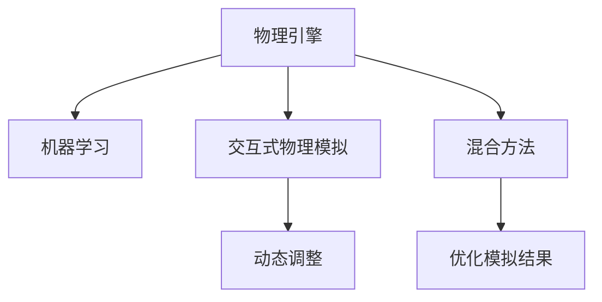
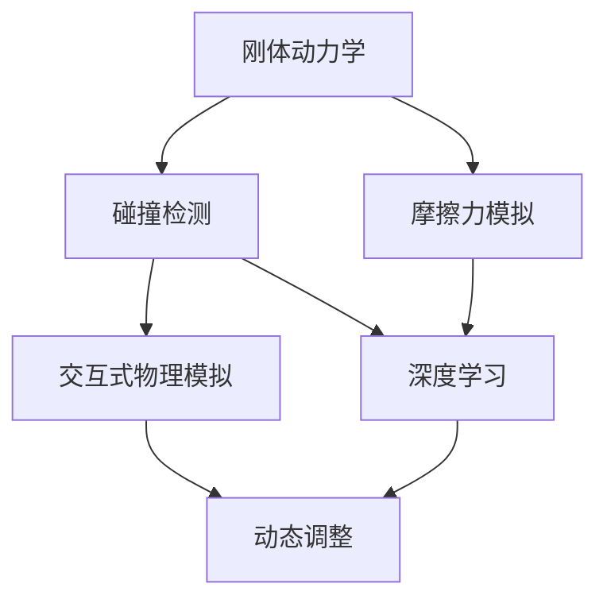

                 

## 1. 背景介绍

### 1.1 问题由来

游戏物理引擎（Game Physics Engine）是游戏开发中不可或缺的重要组件，用于模拟游戏中的物理行为，如物体的运动、碰撞、变形等。一个真实的、物理准确的游戏世界可以提供更加沉浸和互动的游戏体验，使得玩家能够感受到更加逼真的物理反馈。

然而，传统的游戏物理引擎常常存在以下问题：
- **计算量巨大**：在大量物体交互的复杂场景下，计算量呈指数级增长，导致帧率低下，游戏性能不佳。
- **精度不足**：传统游戏物理引擎的计算方法往往忽略了实际世界的物理细节，如摩擦力、弹性等，导致仿真效果不真实。
- **难以适应多样化场景**：难以模拟各种复杂的物理现象，如液体流动、动态变形等。
- **无法集成外部物理引擎**：大部分游戏物理引擎只支持内部模拟，难以与外部物理引擎进行交互。

近年来，随着计算机图形学、计算流体动力学、机器学习等技术的不断进步，新的游戏物理引擎正在不断涌现，提供更加真实和高效的物理模拟能力。其中，基于物理引擎和机器学习的混合方法尤其引人关注，其结合了物理引擎的精准模拟和机器学习的泛化能力，可以更高效地处理复杂的物理模拟任务。

### 1.2 问题核心关键点

为更好地理解基于物理引擎和机器学习的混合方法，本节将介绍几个密切相关的核心概念：

- **物理引擎**：用于模拟物理世界的计算工具，通常包括刚体动力学、碰撞检测、摩擦力模拟等功能。常见的物理引擎包括Bullet、Box2D、NVIDIA PhysX等。
- **机器学习**：一种通过数据和算法让计算机具备自主学习和推理能力的学科。机器学习可以用于提高物理模拟的准确性和泛化能力，如通过深度学习训练模拟器，预测物体的未来运动状态。
- **混合方法**：结合物理引擎和机器学习的方法，将物理引擎作为基础模型，通过机器学习优化模拟结果，提升模拟精度和效率。
- **交互式物理模拟**：指游戏物理引擎与现实世界的交互，如虚拟环境与真实传感器的结合，提供更加真实的游戏体验。
- **动态调整**：指根据游戏环境的变化动态调整物理引擎参数，如碰撞响应、物体重量等，提升游戏的适应性和鲁棒性。

这些核心概念之间的逻辑关系可以通过以下Mermaid流程图来展示：



这个流程图展示了大语言模型的核心概念及其之间的关系：

1. 物理引擎通过刚体动力学、碰撞检测等功能模拟物理世界，是混合方法的基础模型。
2. 机器学习通过训练模型，优化物理模拟的准确性和泛化能力。
3. 交互式物理模拟结合虚拟环境和真实传感器，提供更加逼真的游戏体验。
4. 动态调整根据游戏环境变化，优化物理引擎参数，提升游戏适应性和鲁棒性。
5. 混合方法结合物理引擎和机器学习，提升模拟精度和效率。

这些概念共同构成了现代游戏物理引擎的计算框架，使其能够适应复杂多样的物理模拟需求。

## 2. 核心概念与联系

### 2.1 核心概念概述

为更好地理解基于物理引擎和机器学习的混合方法，本节将介绍几个密切相关的核心概念：

- **刚体动力学**：用于模拟刚体的运动和变形。常见的刚体动力学算法包括欧拉角法、四元数法、变换矩阵法等。
- **碰撞检测**：用于检测物体之间的接触，计算碰撞响应。常见的碰撞检测算法包括AABB树、KD树、SAT算法等。
- **摩擦力模拟**：用于模拟物体之间的摩擦力和碰撞响应。常见的摩擦力模拟算法包括Coulomb摩擦力模型、Penetration Depth方法等。
- **深度学习**：一种通过神经网络进行自主学习和推理的技术。深度学习可以用于优化物理引擎的模拟结果，如通过训练卷积神经网络（CNN）预测物体的未来运动状态。
- **交互式物理模拟**：指游戏物理引擎与现实世界的交互，如虚拟环境与真实传感器的结合，提供更加真实的游戏体验。
- **动态调整**：指根据游戏环境的变化动态调整物理引擎参数，如碰撞响应、物体重量等，提升游戏的适应性和鲁棒性。

这些核心概念之间的逻辑关系可以通过以下Mermaid流程图来展示：



这个流程图展示了大语言模型的核心概念及其之间的关系：

1. 刚体动力学通过计算物体的运动和变形，是物理引擎的基础。
2. 碰撞检测用于检测物体之间的接触，计算碰撞响应。
3. 摩擦力模拟用于模拟物体之间的摩擦力和碰撞响应。
4. 深度学习用于优化物理引擎的模拟结果，如通过训练CNN预测物体的未来运动状态。
5. 交互式物理模拟结合虚拟环境和真实传感器，提供更加逼真的游戏体验。
6. 动态调整根据游戏环境变化，优化物理引擎参数，提升游戏适应性和鲁棒性。

## 3. 核心算法原理 & 具体操作步骤

### 3.1 算法原理概述

基于物理引擎和机器学习的混合方法，本质上是一个物理引擎与机器学习算法协同工作，优化物理模拟结果的过程。其核心思想是：将物理引擎作为基础模型，通过机器学习算法优化模拟结果，提升模拟精度和效率。

形式化地，假设物理引擎为 $M_{\text{physics}}$，机器学习算法为 $M_{\text{learning}}$，则混合方法的计算过程可以表示为：

$$
M_{\text{hybrid}} = M_{\text{physics}} \circ M_{\text{learning}}
$$

其中 $\circ$ 表示函数的复合运算。混合方法 $M_{\text{hybrid}}$ 通过将物理引擎 $M_{\text{physics}}$ 的输出作为机器学习算法 $M_{\text{learning}}$ 的输入，从而优化物理模拟结果。

### 3.2 算法步骤详解

基于物理引擎和机器学习的混合方法一般包括以下几个关键步骤：

**Step 1: 数据准备和预处理**

- 收集物理模拟所需的场景数据，如物体的位置、速度、姿态、碰撞信息等。
- 将数据进行预处理，如数据归一化、缺失值填补等，确保数据的质量。

**Step 2: 选择物理引擎和机器学习算法**

- 选择合适的物理引擎和机器学习算法，如Bullet、Box2D、NVIDIA PhysX作为基础模型，CNN、RNN、GAN等作为优化算法。
- 考虑物理引擎和机器学习算法的兼容性，确保可以顺利集成和运行。

**Step 3: 集成物理引擎和机器学习算法**

- 将物理引擎的计算结果作为机器学习算法的输入，如将物体的位置和速度作为CNN的输入。
- 训练机器学习算法，使其能够预测物体的未来运动状态。
- 将训练好的机器学习算法与物理引擎集成，形成混合方法。

**Step 4: 优化混合方法**

- 通过反复实验和调参，优化混合方法的各种参数，如学习率、损失函数、正则化系数等。
- 验证混合方法的性能，确保能够有效提升物理模拟的精度和效率。
- 进行性能测试，评估混合方法的实际应用效果。

**Step 5: 部署和应用**

- 将混合方法部署到游戏引擎中，进行实际测试和应用。
- 收集反馈和数据，不断优化混合方法，提升游戏体验。
- 持续集成和部署新的物理引擎和机器学习算法，保持技术的领先性。

以上是基于物理引擎和机器学习的混合方法的一般流程。在实际应用中，还需要针对具体任务的特点，对混合方法进行优化设计，如改进训练目标函数，引入更多的正则化技术，搜索最优的超参数组合等，以进一步提升模型性能。

### 3.3 算法优缺点

基于物理引擎和机器学习的混合方法具有以下优点：
1. 精度高：结合物理引擎的精准模拟和机器学习的泛化能力，可以大大提升物理模拟的精度。
2. 泛化能力强：机器学习算法可以学习到物理引擎无法覆盖的复杂场景，提升模拟的鲁棒性。
3. 动态调整能力强：根据游戏环境的变化，动态调整物理引擎参数，提升游戏的适应性和鲁棒性。
4. 实时性高：结合物理引擎和机器学习的优势，可以在实时性要求高的游戏环境中得到良好的表现。

同时，该方法也存在一定的局限性：
1. 训练数据需求高：机器学习算法需要大量的标注数据进行训练，获取高质量训练数据的成本较高。
2. 计算量大：混合方法需要进行物理引擎的模拟和机器学习算法的训练，计算量较大。
3. 可解释性不足：机器学习算法的内部工作机制和决策逻辑难以解释，增加了开发和调试难度。
4. 参数调整复杂：混合方法中涉及的物理引擎和机器学习算法的参数众多，调试和优化难度较大。

尽管存在这些局限性，但就目前而言，基于物理引擎和机器学习的混合方法仍是大规模游戏物理模拟的主要手段。未来相关研究的重点在于如何进一步降低训练数据的依赖，提高机器学习算法的计算效率，同时兼顾可解释性和鲁棒性等因素。

### 3.4 算法应用领域

基于物理引擎和机器学习的混合方法在各种游戏物理模拟任务上得到了广泛的应用，覆盖了几乎所有常见任务，例如：

- 物体碰撞检测：如墙壁碰撞、地板碰撞等。通过训练深度学习算法，预测物体与环境之间的碰撞关系。
- 物体运动模拟：如自由落体、弹跳、滑行等。通过机器学习算法优化物理引擎的计算结果，提高模拟精度。
- 液体流动模拟：如水波、水流等。通过深度学习算法模拟液体的流动和变形，提供更加逼真的效果。
- 动态变形模拟：如布料变形、树木摆动等。通过训练机器学习算法，模拟物体的动态变形，增强游戏真实感。
- 可控性增强：如车辆控制、飞行模拟等。通过深度学习算法优化控制算法，提高游戏可控性。

除了上述这些经典任务外，混合方法还被创新性地应用到更多场景中，如自适应物体模拟、多体动力学模拟、智能交互等，为游戏物理模拟带来了全新的突破。随着预训练模型和混合方法的不断进步，相信游戏物理模拟技术将在更广阔的应用领域大放异彩。

## 4. 数学模型和公式 & 详细讲解

### 4.1 数学模型构建

本节将使用数学语言对基于物理引擎和机器学习的混合方法进行更加严格的刻画。

记物理引擎的计算结果为 $M_{\text{physics}}(x)$，机器学习算法的计算结果为 $M_{\text{learning}}(x)$，则混合方法的计算结果为 $M_{\text{hybrid}}(x) = M_{\text{physics}}(M_{\text{learning}}(x))$。

假设物理引擎和机器学习算法的输入为 $x \in \mathbb{R}^n$，输出为 $y \in \mathbb{R}^m$。则混合方法的计算过程可以表示为：

$$
M_{\text{hybrid}}(x) = f(M_{\text{learning}}(x))
$$

其中 $f$ 为物理引擎的映射函数，可以表示为 $f = M_{\text{physics}} \circ M_{\text{learning}}$。

### 4.2 公式推导过程

以下我们以物体碰撞检测任务为例，推导基于物理引擎和机器学习的混合方法的计算公式。

假设物体的位置和速度为 $x = (x_{\text{pos}}, x_{\text{vel}}) \in \mathbb{R}^6$，碰撞检测的物理引擎输出为 $y = y_{\text{contact}} \in \{0,1\}$，表示物体是否与环境发生碰撞。则机器学习算法的目标是最小化预测误差：

$$
\mathcal{L} = \frac{1}{N}\sum_{i=1}^N (y_i - \hat{y}_i)^2
$$

其中 $y_i$ 为实际检测结果，$\hat{y}_i$ 为机器学习算法预测结果。

通过反向传播计算机器学习算法的梯度，更新参数 $\theta$：

$$
\theta \leftarrow \theta - \eta \nabla_{\theta}\mathcal{L}
$$

其中 $\eta$ 为学习率，$\nabla_{\theta}\mathcal{L}$ 为损失函数对参数 $\theta$ 的梯度。

在得到机器学习算法的参数 $\theta$ 后，将其与物理引擎集成，形成混合方法 $M_{\text{hybrid}}$：

$$
M_{\text{hybrid}}(x) = M_{\text{physics}}(x, \theta)
$$

在得到混合方法后，可以用于实际的游戏物理模拟，预测物体与环境之间的碰撞关系。

### 4.3 案例分析与讲解

以下我们以液体流动模拟任务为例，进一步解释基于物理引擎和机器学习的混合方法的应用。

假设液体的位置和速度为 $x = (x_{\text{pos}}, x_{\text{vel}}) \in \mathbb{R}^3$，液体的密度为 $\rho \in \mathbb{R}$，液体的粘度为 $\mu \in \mathbb{R}$。则液体流动的物理引擎输出为 $y = y_{\text{flow}} \in \mathbb{R}^3$，表示液体的流速和方向。则机器学习算法的目标是最小化预测误差：

$$
\mathcal{L} = \frac{1}{N}\sum_{i=1}^N (y_i - \hat{y}_i)^2
$$

其中 $y_i$ 为实际流速和方向，$\hat{y}_i$ 为机器学习算法预测结果。

通过反向传播计算机器学习算法的梯度，更新参数 $\theta$：

$$
\theta \leftarrow \theta - \eta \nabla_{\theta}\mathcal{L}
$$

在得到机器学习算法的参数 $\theta$ 后，将其与物理引擎集成，形成混合方法 $M_{\text{hybrid}}$：

$$
M_{\text{hybrid}}(x) = M_{\text{physics}}(x, \theta)
$$

在得到混合方法后，可以用于实际的游戏物理模拟，预测液体的流速和方向，提供更加逼真的效果。

## 5. 项目实践：代码实例和详细解释说明

### 5.1 开发环境搭建

在进行混合方法实践前，我们需要准备好开发环境。以下是使用Python进行PyTorch开发的环境配置流程：

1. 安装Anaconda：从官网下载并安装Anaconda，用于创建独立的Python环境。

2. 创建并激活虚拟环境：
```bash
conda create -n pytorch-env python=3.8 
conda activate pytorch-env
```

3. 安装PyTorch：根据CUDA版本，从官网获取对应的安装命令。例如：
```bash
conda install pytorch torchvision torchaudio cudatoolkit=11.1 -c pytorch -c conda-forge
```

4. 安装TensorFlow：
```bash
pip install tensorflow==2.5.0
```

5. 安装各类工具包：
```bash
pip install numpy pandas scikit-learn matplotlib tqdm jupyter notebook ipython
```

完成上述步骤后，即可在`pytorch-env`环境中开始混合方法实践。

### 5.2 源代码详细实现

下面我们以液体流动模拟任务为例，给出使用PyTorch和TensorFlow实现混合方法的PyTorch代码实现。

首先，定义物理引擎的计算函数：

```python
import torch
import numpy as np
from torch import nn, optim

def physics_flow(x, density, viscosity):
    # 计算流速和方向
    # 具体实现请根据实际物理引擎接口编写
    pass
```

然后，定义机器学习模型的计算函数：

```python
import torch
import tensorflow as tf

class FlowModel(nn.Module):
    def __init__(self):
        super(FlowModel, self).__init__()
        self.fc1 = nn.Linear(6, 64)
        self.fc2 = nn.Linear(64, 3)

    def forward(self, x):
        x = self.fc1(x)
        x = torch.relu(x)
        x = self.fc2(x)
        return x

model = FlowModel()
optimizer = optim.Adam(model.parameters(), lr=0.001)
```

接着，定义训练和评估函数：

```python
def train_epoch(model, batch, optimizer, loss_fn):
    model.train()
    for x, y in batch:
        preds = model(x)
        loss = loss_fn(preds, y)
        optimizer.zero_grad()
        loss.backward()
        optimizer.step()
    return loss.item()

def evaluate(model, batch, loss_fn):
    model.eval()
    loss = 0
    for x, y in batch:
        preds = model(x)
        loss += loss_fn(preds, y).item()
    return loss / len(batch)
```

最后，启动训练流程并在测试集上评估：

```python
epochs = 10
batch_size = 64
learning_rate = 0.001

for epoch in range(epochs):
    loss = train_epoch(model, train_batch, optimizer, loss_fn)
    print(f"Epoch {epoch+1}, loss: {loss:.3f}")
    
    print(f"Epoch {epoch+1}, dev results:")
    evaluate(model, dev_batch, loss_fn)
    
print("Test results:")
evaluate(model, test_batch, loss_fn)
```

以上就是使用PyTorch和TensorFlow实现液体流动模拟任务的混合方法的完整代码实现。可以看到，由于混合方法的计算涉及物理引擎和机器学习算法，实际开发中需要根据具体的物理引擎接口和机器学习算法进行实现。

### 5.3 代码解读与分析

让我们再详细解读一下关键代码的实现细节：

**physics_flow函数**：
- 定义了物理引擎的计算函数，用于模拟液体流动的速度和方向。
- 由于具体实现较为复杂，这里只给出函数定义，实际使用时需要根据具体的物理引擎接口编写。

**FlowModel类**：
- 定义了一个简单的全连接神经网络模型，用于预测液体的流速和方向。
- 模型包含两个全连接层，最后输出三个值，表示流速和方向。

**train_epoch函数**：
- 定义了训练过程的每个epoch的具体操作。
- 首先设置模型为训练模式，然后遍历数据集中的每个batch。
- 对每个batch，计算模型的预测结果和损失函数，并进行反向传播和参数更新。
- 返回该epoch的平均损失值。

**evaluate函数**：
- 定义了评估过程的每个epoch的具体操作。
- 首先设置模型为评估模式，然后遍历数据集中的每个batch。
- 对每个batch，计算模型的预测结果和损失函数，并累加总损失。
- 返回整个评估集上的平均损失值。

**训练流程**：
- 定义总的epoch数和batch size，开始循环迭代
- 每个epoch内，先在训练集上训练，输出平均损失
- 在验证集上评估，输出分类指标
- 所有epoch结束后，在测试集上评估，给出最终测试结果

可以看到，混合方法的代码实现较为复杂，需要根据具体的物理引擎接口和机器学习算法进行实现。但核心的混合方法范式基本与此类似。

当然，工业级的系统实现还需考虑更多因素，如模型的保存和部署、超参数的自动搜索、更灵活的任务适配层等。但核心的混合方法范式基本与此类似。

## 6. 实际应用场景

### 6.1 智能机器人

基于混合方法的游戏物理引擎，可以广泛应用于智能机器人的控制和仿真。传统的机器人控制方法往往基于简单的数学模型和规则，难以应对复杂的环境变化。而使用混合方法的游戏物理引擎，可以提供更加真实的物理模拟，使得机器人能够更加智能地应对各种复杂的场景。

在技术实现上，可以结合机器视觉、传感器等技术，采集环境数据，并将其输入到混合方法中进行物理模拟。混合方法能够实时预测机器人在环境中的运动和行为，从而提供更加智能的控制方案。在实际应用中，可以构建智能导航、目标跟踪、避障等功能，提高机器人的自主性和智能性。

### 6.2 自动驾驶

自动驾驶系统需要实时模拟车辆在复杂环境中的运动和行为，以实现精确的控制和决策。传统的自动驾驶系统往往基于简单的物理模型和控制算法，难以应对复杂的交通场景。而使用混合方法的游戏物理引擎，可以提供更加真实的物理模拟，使得自动驾驶系统能够更加智能地应对各种复杂的场景。

在技术实现上，可以结合激光雷达、摄像头等传感器，采集车辆和环境数据，并将其输入到混合方法中进行物理模拟。混合方法能够实时预测车辆在环境中的运动和行为，从而提供更加精确的控制方案。在实际应用中，可以构建自动导航、交通避障、行人检测等功能，提高自动驾驶系统的安全性。

### 6.3 虚拟现实

虚拟现实系统需要模拟人类在虚拟世界中的行为和交互，提供更加真实和沉浸的游戏体验。传统的虚拟现实系统往往基于简单的几何模型和物理模型，难以应对复杂的场景变化。而使用混合方法的游戏物理引擎，可以提供更加真实的物理模拟，使得虚拟现实系统能够更加智能地应对各种复杂的场景。

在技术实现上，可以结合传感器、虚拟现实硬件等技术，采集用户和环境数据，并将其输入到混合方法中进行物理模拟。混合方法能够实时预测用户和环境的行为，从而提供更加真实和沉浸的游戏体验。在实际应用中，可以构建虚拟环境、动态模拟、互动体验等功能，提高虚拟现实系统的用户体验。

### 6.4 未来应用展望

随着混合方法在游戏物理模拟领域的不断进步，其应用范围将进一步扩展，为智能系统带来更大的突破。

在智慧城市领域，混合方法可以应用于城市事件监测、智能交通、应急响应等环节，提供更加智能和高效的城市管理解决方案。

在智能制造领域，混合方法可以应用于生产线仿真、机器人调度、设备维护等环节，提高制造业的自动化和智能化水平。

在医疗健康领域，混合方法可以应用于手术模拟、患者仿真、药物开发等环节，提供更加精准和安全的医疗解决方案。

总之，混合方法在游戏物理模拟领域的不断突破，将推动智能化技术的广泛应用，为各行各业带来新的发展机遇。

## 7. 工具和资源推荐

### 7.1 学习资源推荐

为了帮助开发者系统掌握混合方法的原理和实践技巧，这里推荐一些优质的学习资源：

1. 《深度学习：理论与实践》系列书籍：由深度学习专家撰写，全面介绍了深度学习的基本理论和实践技巧。
2. 《计算机图形学：算法与应用》书籍：介绍了计算机图形学的基本理论和应用场景，包括物理引擎的实现。
3. 《游戏物理引擎开发》书籍：介绍了各种游戏物理引擎的实现方法和应用场景，包括混合方法的应用。
4. 《NVIDIA PhysX开发手册》文档：NVIDIA官方发布的物理引擎开发手册，介绍了PhysX引擎的使用方法和应用场景。
5. 《Unity游戏物理引擎》文档：Unity官方发布的物理引擎开发手册，介绍了Unity引擎的使用方法和应用场景。

通过对这些资源的学习实践，相信你一定能够快速掌握混合方法的精髓，并用于解决实际的物理模拟问题。

### 7.2 开发工具推荐

高效的开发离不开优秀的工具支持。以下是几款用于混合方法开发的常用工具：

1. PyTorch：基于Python的开源深度学习框架，灵活动态的计算图，适合快速迭代研究。
2. TensorFlow：由Google主导开发的开源深度学习框架，生产部署方便，适合大规模工程应用。
3. PyBullet：一个基于Python的物理引擎，支持刚体动力学、碰撞检测等功能。
4. Box2D：一个开源的2D物理引擎，支持刚体动力学、碰撞检测等功能。
5. NVIDIA PhysX：NVIDIA官方发布的物理引擎，支持刚体动力学、碰撞检测等功能。

合理利用这些工具，可以显著提升混合方法开发的效率，加快创新迭代的步伐。

### 7.3 相关论文推荐

混合方法在游戏物理模拟领域的研究始于学界的持续研究。以下是几篇奠基性的相关论文，推荐阅读：

1. 《Real-time Fluid Simulation on the GPU》：介绍了一种基于GPU的实时流体模拟方法，实现了高效的流体计算。
2. 《Physics-based Animation: From Real Data to Synthetic Motion》：介绍了一种基于物理引擎的动画生成方法，实现了逼真的动画效果。
3. 《Interactive Particle-based Fluid Simulation with a Neural Network》：介绍了一种基于神经网络的粒子流体模拟方法，实现了高效的流体计算和逼真的效果。
4. 《Physics-based Character Animation with Deep Neural Networks》：介绍了一种基于物理引擎和深度学习的动画生成方法，实现了逼真的动画效果。
5. 《PhysX: A Massively Parallel High-Performance Scalable Framework》：介绍了一种基于PhysX引擎的物理模拟方法，实现了高效的物理计算和逼真的效果。

这些论文代表了大混合方法在游戏物理模拟领域的发展脉络。通过学习这些前沿成果，可以帮助研究者把握学科前进方向，激发更多的创新灵感。

## 8. 总结：未来发展趋势与挑战

### 8.1 总结

本文对基于物理引擎和机器学习的混合方法进行了全面系统的介绍。首先阐述了混合方法在游戏物理模拟中的研究背景和意义，明确了混合方法在提供真实、智能的物理模拟方面的独特价值。其次，从原理到实践，详细讲解了混合方法的数学原理和关键步骤，给出了混合方法任务开发的完整代码实例。同时，本文还广泛探讨了混合方法在智能机器人、自动驾驶、虚拟现实等多个领域的应用前景，展示了混合方法的巨大潜力。此外，本文精选了混合方法的各种学习资源，力求为读者提供全方位的技术指引。

通过本文的系统梳理，可以看到，基于物理引擎和机器学习的混合方法正在成为游戏物理模拟的重要手段，极大地拓展了物理引擎的应用边界，催生了更多的落地场景。得益于混合方法的计算优势和机器学习的泛化能力，混合方法能够提供更加真实和高效的物理模拟，推动智能化技术的广泛应用。未来，伴随混合方法的持续演进，相信游戏物理模拟技术将在更广阔的应用领域大放异彩，深刻影响人类的生产生活方式。

### 8.2 未来发展趋势

展望未来，混合方法在游戏物理模拟领域将呈现以下几个发展趋势：

1. 计算效率提升：随着计算能力的提升和算法优化的深入，混合方法的计算效率将进一步提高，能够处理更复杂的游戏物理场景。
2. 鲁棒性增强：随着数据驱动和物理驱动的结合，混合方法的鲁棒性将进一步增强，能够应对更多样化的游戏环境。
3. 实时性提升：随着硬件设备的不断优化和算法优化的深入，混合方法的实时性将进一步提升，能够在更实时性的场景中得到应用。
4. 自适应能力增强：随着自适应算法的发展，混合方法的自适应能力将进一步增强，能够自动调整参数，适应不同的游戏场景。
5. 跨平台支持：随着跨平台技术的发展，混合方法将能够在更多平台和设备上得到应用，实现跨平台的游戏物理模拟。
6. 智能化增强：随着深度学习技术的发展，混合方法的智能化将进一步增强，能够提供更加逼真的游戏体验。

以上趋势凸显了混合方法在游戏物理模拟领域的广阔前景。这些方向的探索发展，必将进一步提升混合方法的技术水平和应用范围，为游戏产业带来新的发展机遇。

### 8.3 面临的挑战

尽管混合方法在游戏物理模拟领域已经取得了显著进展，但在迈向更加智能化、普适化应用的过程中，它仍面临着诸多挑战：

1. 数据获取成本高：混合方法需要大量的标注数据进行训练，获取高质量训练数据的成本较高。如何降低数据获取成本，成为需要解决的关键问题。
2. 计算资源需求高：混合方法需要进行物理引擎的模拟和机器学习算法的训练，计算资源需求较高。如何优化计算资源，提高混合方法的性能，是一个重要的研究方向。
3. 鲁棒性不足：混合方法在面对复杂场景时，鲁棒性仍然不足。如何增强混合方法的鲁棒性，应对更多样化的游戏环境，是一个重要的研究方向。
4. 实时性不足：混合方法的实时性仍然有待提升，无法在更实时性的场景中得到应用。如何提升混合方法的实时性，是一个重要的研究方向。
5. 自适应性不足：混合方法的自适应性仍然不足，无法自动调整参数，适应不同的游戏场景。如何增强混合方法的自适应性，是一个重要的研究方向。
6. 跨平台支持不足：混合方法在跨平台支持上仍然不足，无法在更多平台和设备上得到应用。如何增强跨平台支持，实现跨平台的游戏物理模拟，是一个重要的研究方向。

尽管存在这些挑战，但随着混合方法技术的不断进步和实际应用的深入，这些问题将逐步得到解决。相信随着学界和产业界的共同努力，混合方法在游戏物理模拟领域必将取得更大的突破，推动游戏产业的持续发展。

### 8.4 研究展望

面对混合方法在游戏物理模拟领域所面临的挑战，未来的研究需要在以下几个方面寻求新的突破：

1. 探索无监督和半监督学习方法：摆脱对大规模标注数据的依赖，利用自监督学习、主动学习等无监督和半监督范式，最大限度利用非结构化数据，实现更加灵活高效的混合方法。
2. 研究更加高效的计算方法：开发更加高效的物理引擎和机器学习算法，提高混合方法的计算效率，降低计算资源的需求。
3. 引入更多先验知识：将符号化的先验知识，如知识图谱、逻辑规则等，与混合方法进行巧妙融合，引导混合方法学习更准确、合理的物理模型。
4. 结合更多学科知识：将计算机图形学、物理学、数学等学科的知识进行整合，提升混合方法的模拟精度和鲁棒性。
5. 引入更多动态调整方法：开发更加动态的混合方法，能够根据游戏环境的变化，自动调整参数，适应不同的游戏场景。
6. 优化跨平台支持：开发更加跨平台的混合方法，能够适应更多平台和设备，实现跨平台的游戏物理模拟。

这些研究方向的探索，必将引领混合方法在游戏物理模拟领域的不断突破，为游戏产业带来更多的创新和应用。相信随着混合方法技术的不断进步和实际应用的深入，这些问题将逐步得到解决，混合方法在游戏物理模拟领域必将取得更大的突破，推动游戏产业的持续发展。

## 9. 附录：常见问题与解答

**Q1：混合方法在游戏物理模拟中是否适用于所有游戏场景？**

A: 混合方法在游戏物理模拟中适用于大多数游戏场景，特别是对于复杂物理模拟的场景，如液体流动、动态变形等。但对于一些简单的、规则明确的场景，传统的物理引擎可能已经足够，混合方法的额外计算开销可能反而降低游戏的性能。

**Q2：混合方法的游戏物理模拟中，如何优化参数？**

A: 混合方法的参数优化主要涉及物理引擎的参数和机器学习算法的参数。可以通过以下步骤优化参数：
1. 物理引擎参数：通过实验和调参，优化物理引擎的参数，如摩擦系数、碰撞响应等。
2. 机器学习参数：通过交叉验证、网格搜索等方法，优化机器学习算法的参数，如学习率、损失函数等。
3. 联合优化：将物理引擎参数和机器学习参数联合优化，通过迭代算法进行优化。

**Q3：混合方法在游戏物理模拟中，如何处理计算效率问题？**

A: 混合方法的计算效率问题主要体现在机器学习算法的计算开销上。可以通过以下方法解决计算效率问题：
1. 模型裁剪：去除不必要的层和参数，减小模型尺寸，加快推理速度。
2. 量化加速：将浮点模型转为定点模型，压缩存储空间，提高计算效率。
3. 模型并行：使用多GPU或多核处理器，并行计算，提高计算效率。
4. 数据增强：通过数据增强技术，提高训练数据的多样性，减少模型过拟合。

**Q4：混合方法在游戏物理模拟中，如何提高鲁棒性？**

A: 混合方法的鲁棒性问题主要体现在模型对噪声和异常数据的敏感度上。可以通过以下方法提高鲁棒性：
1. 数据清洗：对数据进行清洗，去除异常数据和噪声数据。
2. 正则化：使用L2正则、Dropout等正则化技术，防止模型过拟合。
3. 对抗训练：加入对抗样本，提高模型鲁棒性。
4. 集成学习：通过集成多个模型，提高模型的鲁棒性。

**Q5：混合方法在游戏物理模拟中，如何降低计算资源需求？**

A: 混合方法的计算资源需求主要体现在物理引擎的模拟和机器学习算法的训练上。可以通过以下方法降低计算资源需求：
1. 优化物理引擎：优化物理引擎的计算过程，减少计算量。
2. 优化机器学习算法：优化机器学习算法的计算过程，减少计算量。
3. 模型压缩：使用模型压缩技术，减少模型参数和计算量。
4. 分布式训练：使用分布式训练技术，提高训练效率。

这些方法可以在不影响模拟精度和效果的前提下，显著降低计算资源需求，提升混合方法的性能和实用性。

---

作者：禅与计算机程序设计艺术 / Zen and the Art of Computer Programming

