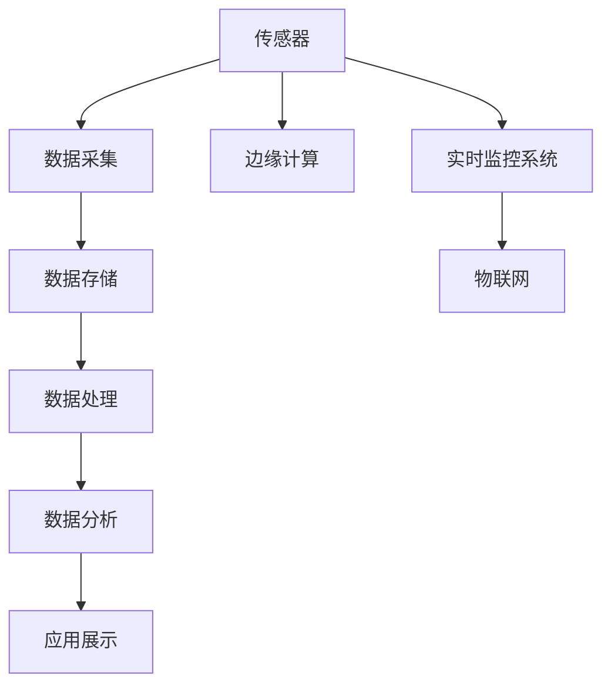

                 

# 物联网(IoT)技术和各种传感器设备的集成：实时监控系统的搭建与优化

## 1. 背景介绍

### 1.1 问题由来

随着物联网(IoT)技术的迅猛发展，智能设备和传感器在工业制造、智慧城市、家庭安防、智能医疗等领域得到了广泛应用。这些设备能够实时采集各种数据，包括温度、湿度、压力、振动、位置、能量消耗等，为实时监控系统的搭建提供了丰富的数据资源。然而，由于传感器种类繁多，数据格式各异，数据采集和传输的实时性要求高，实时监控系统的搭建和优化仍存在许多挑战。

### 1.2 问题核心关键点

物联网设备和传感器数据的实时监控系统搭建和优化涉及以下几个核心关键点：

- 设备选型：根据具体监控需求选择合适的传感器和设备。
- 数据采集：高效、可靠地采集传感器数据。
- 数据传输：保证数据采集和传输的实时性、稳定性。
- 数据存储：合理设计数据存储方案，确保数据的长期保存和高效访问。
- 数据处理：对采集到的数据进行预处理、分析，提取有用信息。
- 数据分析：利用数据分析技术，发现数据背后的规律和趋势。
- 应用展示：将数据分析结果可视化展示，便于用户理解和决策。

本文将深入探讨物联网技术在实时监控系统中的应用，详细介绍设备选型、数据采集、传输、存储、处理、分析和展示的关键技术，并提出相应的优化策略。

## 2. 核心概念与联系

### 2.1 核心概念概述

为更好地理解物联网技术在实时监控系统中的应用，本节将介绍几个密切相关的核心概念：

- 物联网(IoT)：通过互联网将各种设备、传感器、软件等连接起来，实现信息感知、传输和处理。
- 传感器：能够感知环境参数并转换为可测量信号的设备，如温度传感器、湿度传感器、压力传感器等。
- 实时监控系统：对物理环境或设备运行状态进行实时采集、处理和展示的系统。
- 边缘计算：在数据源附近进行数据处理和存储，减少数据传输延时，提升系统响应速度。
- 大数据技术：利用分布式存储、分布式计算等技术，对海量数据进行高效存储和处理。
- 云计算：通过互联网提供强大的计算和存储资源，支持大规模数据处理和分析。

这些核心概念之间的逻辑关系可以通过以下Mermaid流程图来展示：



这个流程图展示了一系列核心概念及其之间的关系：

1. 传感器通过采集环境数据，输出电信号。
2. 数据采集模块将传感器信号转换为数字数据，传输到边缘计算设备。
3. 边缘计算设备对数据进行处理，部分数据存储在本地，部分数据传输到云端进行更高级别的分析。
4. 云端的大数据平台对数据进行高效存储和处理，提取有用信息。
5. 数据分析结果通过应用展示模块，以可视化的形式呈现给用户。

这些概念共同构成了物联网技术和实时监控系统的基本架构，使其能够高效地采集、处理和展示传感器数据，实现实时监控和智能决策。

## 3. 核心算法原理 & 具体操作步骤
### 3.1 算法原理概述

物联网实时监控系统的搭建和优化涉及一系列算法和技术的有机组合，旨在高效、稳定地实现数据的采集、传输、存储、处理和展示。其核心算法原理包括：

- 传感器数据采集算法：通过特定电路或软件，高效、准确地采集传感器信号，转换为数字数据。
- 数据压缩算法：利用压缩技术减少数据传输量和存储空间占用，提升数据传输和存储效率。
- 数据传输算法：通过无线或有线方式，确保数据传输的实时性和稳定性。
- 数据存储算法：利用分布式文件系统或数据库，实现数据的长期保存和高效访问。
- 数据处理算法：利用统计学、机器学习等技术，对数据进行预处理和分析，提取有用信息。
- 数据分析算法：利用数据分析技术，发现数据背后的规律和趋势，指导决策和优化。

### 3.2 算法步骤详解

物联网实时监控系统的搭建和优化通常包括以下几个关键步骤：

**Step 1: 设备选型和安装**
- 根据监控需求，选择合适的传感器和设备，如温度传感器、湿度传感器、压力传感器等。
- 在合适的位置安装传感器，确保数据采集的准确性和稳定性。

**Step 2: 数据采集**
- 使用专用的采集模块将传感器信号转换为数字数据，如模数转换器(ADC)、数字信号处理器(DSP)等。
- 将采集的数据传输到边缘计算设备，如单片机、嵌入式系统等。

**Step 3: 数据传输**
- 利用无线通信协议(如Wi-Fi、蓝牙、Zigbee等)或有线网络，将数据传输到云端或本地服务器。
- 对传输的数据进行加密和压缩，确保数据传输的安全性和效率。

**Step 4: 数据存储**
- 利用分布式文件系统(Hadoop HDFS、Amazon S3等)或数据库(如MySQL、MongoDB等)，实现数据的长期保存和高效访问。
- 对数据进行分类和索引，方便后续的数据分析和查询。

**Step 5: 数据处理**
- 利用统计学技术对数据进行预处理，如均值、方差、百分位数等，进行基本分析。
- 利用机器学习算法对数据进行高级分析，如回归、分类、聚类等，提取有用信息。

**Step 6: 数据分析**
- 利用数据分析技术，如时间序列分析、数据挖掘、异常检测等，发现数据背后的规律和趋势。
- 根据分析结果，优化设备运行状态和监控策略。

**Step 7: 应用展示**
- 将数据分析结果通过可视化工具展示给用户，如仪表盘、折线图、柱状图等。
- 实现用户交互功能，如预警、报警、配置等，提升用户体验。

### 3.3 算法优缺点

物联网实时监控系统的搭建和优化方法具有以下优点：

1. 数据采集高效。通过选用高性能传感器和专用采集模块，数据采集精度和效率大大提升。
2. 数据传输可靠。利用先进的网络传输协议和加密技术，确保数据传输的实时性和安全性。
3. 数据存储便捷。利用分布式存储和大数据技术，实现数据的长期保存和高效访问。
4. 数据分析精准。结合统计学和机器学习算法，发现数据背后的规律和趋势，指导决策和优化。

同时，该方法也存在一些局限性：

1. 成本高。传感器和设备的初始成本较高，特别是高端传感器和复杂设备。
2. 系统复杂。物联网设备种类繁多，数据格式各异，系统设计和维护较为复杂。
3. 依赖网络。数据采集和传输依赖网络，网络故障或中断会影响系统性能。
4. 数据安全。数据在传输和存储过程中，存在被窃取或篡改的风险。
5. 处理延迟。数据量大时，处理和分析延迟较高，影响实时性。

尽管存在这些局限性，但就目前而言，物联网技术仍是大规模实时监控系统的首选方案。未来相关研究的重点在于如何进一步降低成本，简化系统设计，提升数据处理效率和安全性，同时兼顾实时性和可靠性。

### 3.4 算法应用领域

物联网实时监控系统已经在众多领域得到了广泛应用，例如：

- 工业制造：通过传感器监控设备运行状态，提升生产效率和设备寿命。
- 智慧城市：利用传感器监测环境参数，优化城市资源管理，提升公共服务水平。
- 智能家居：通过传感器监控家庭环境，提升家庭安全和生活舒适度。
- 智能医疗：利用传感器监控患者生理参数，实现远程医疗和精准诊疗。
- 农业监控：通过传感器监测土壤、气象、作物生长状态，提高农业生产效率。

除了上述这些经典应用外，物联网实时监控技术也在更多场景中得到创新性地应用，如智慧交通、智能物流、环境监测等，为各行各业带来了全新的变革。

## 4. 数学模型和公式 & 详细讲解 & 举例说明（备注：数学公式请使用latex格式，latex嵌入文中独立段落使用 $$，段落内使用 $)
### 4.1 数学模型构建

本节将使用数学语言对物联网实时监控系统的搭建和优化过程进行更加严格的刻画。

假设传感器采集的数据为 $x_i$，$i=1,2,\ldots,n$，数据采集和传输的误差为 $\epsilon_i$，数据存储和处理的误差为 $\delta_i$。则在物联网实时监控系统中，数据流动的数学模型可以表示为：

$$
y_i = f(x_i, \epsilon_i) + \delta_i
$$

其中，$f(\cdot)$ 表示传感器数据采集、传输、存储和处理的总误差函数。

### 4.2 公式推导过程

以下我们以工业制造场景中的设备运行监控为例，推导数据的采集和处理过程。

假设工厂中有 $n$ 个设备，每个设备的运行状态可以用一个数值表示。设设备 $i$ 的运行状态为 $x_i \in [0,1]$，表示设备运行正常与否。设备运行状态可以通过传感器采集得到，设采集到的数据为 $y_i$，采集误差为 $\epsilon_i$，则采集数据的数学模型为：

$$
y_i = x_i + \epsilon_i
$$

采集到的数据 $y_i$ 经过预处理后，上传到边缘计算设备，并进一步存储和处理。设存储和处理的误差为 $\delta_i$，则数据流动的数学模型可以表示为：

$$
\hat{x}_i = g(y_i, \delta_i)
$$

其中 $g(\cdot)$ 为数据处理函数，$\hat{x}_i$ 为处理后的设备运行状态估计值。在工业制造中，通常会利用时间序列分析技术对处理后的数据进行进一步分析，发现设备运行状态的变化趋势。时间序列分析的数学模型可以表示为：

$$
x_{i+1} = \alpha x_i + \beta + \gamma_i
$$

其中 $\alpha$ 为时间系数，$\beta$ 为系统常数，$\gamma_i$ 为噪声项。利用时间序列分析模型，可以预测未来设备运行状态，指导设备维护和生产调度。

### 4.3 案例分析与讲解

**案例1：智能家居温度监控系统**

智能家居温度监控系统利用温度传感器采集房间温度数据，并通过无线通信协议传输到云端进行处理和分析。系统的核心流程包括：

1. 设备选型：选用高精度的数字温度传感器，确保数据采集的准确性。
2. 数据采集：利用模数转换器将温度传感器信号转换为数字数据。
3. 数据传输：利用Wi-Fi协议将采集数据传输到本地路由器，再上传至云端。
4. 数据存储：利用云数据库存储历史温度数据，并建立时间索引。
5. 数据处理：利用统计学技术对数据进行预处理，计算温度平均值和标准差。
6. 数据分析：利用时间序列分析技术，预测未来温度变化趋势。
7. 应用展示：将温度数据以折线图的形式展示给用户，实现远程温度监控。

**案例2：智能工厂设备监控系统**

智能工厂设备监控系统利用多个传感器采集设备运行状态数据，并利用边缘计算设备进行实时处理和分析。系统的核心流程包括：

1. 设备选型：选择不同类型的传感器，如温度传感器、振动传感器、压力传感器等。
2. 数据采集：利用专用采集模块将传感器信号转换为数字数据。
3. 数据传输：利用4G/5G协议将采集数据传输到边缘计算设备。
4. 数据存储：利用本地存储设备保存处理后的数据，并利用分布式文件系统进行备份。
5. 数据处理：利用统计学技术对数据进行预处理，计算各项运行指标。
6. 数据分析：利用机器学习算法对数据进行高级分析，预测设备故障和运行状态。
7. 应用展示：将设备运行状态以仪表盘的形式展示给维护人员，实现实时监控和预警。

## 5. 项目实践：代码实例和详细解释说明
### 5.1 开发环境搭建

在进行物联网实时监控系统开发前，我们需要准备好开发环境。以下是使用Python进行TensorFlow开发的环境配置流程：

1. 安装Anaconda：从官网下载并安装Anaconda，用于创建独立的Python环境。

2. 创建并激活虚拟环境：
```bash
conda create -n tf-env python=3.8 
conda activate tf-env
```

3. 安装TensorFlow：根据CUDA版本，从官网获取对应的安装命令。例如：
```bash
conda install tensorflow -c tensorflow -c conda-forge
```

4. 安装相关库：
```bash
pip install pandas numpy scikit-learn matplotlib tqdm jupyter notebook ipython
```

完成上述步骤后，即可在`tf-env`环境中开始物联网实时监控系统开发。

### 5.2 源代码详细实现

下面我以智能工厂设备监控系统为例，给出使用TensorFlow进行数据采集、处理和分析的PyTorch代码实现。

首先，定义数据采集函数：

```python
import tensorflow as tf
from tensorflow.keras import layers
import numpy as np

class SensorData(tf.keras.Model):
    def __init__(self, input_shape=(1,), output_shape=(1,), num_labels=1):
        super(SensorData, self).__init__()
        self.input_shape = input_shape
        self.output_shape = output_shape
        self.num_labels = num_labels
        
        self.dense1 = layers.Dense(64, activation='relu')
        self.dense2 = layers.Dense(self.num_labels, activation='sigmoid')
        
    def call(self, inputs):
        x = self.dense1(inputs)
        x = self.dense2(x)
        return x

# 模拟传感器数据
def generate_sensor_data(n):
    np.random.seed(123)
    x = np.random.uniform(0, 1, (n, 1))
    y = x + np.random.normal(0, 0.1, (n, 1))
    return x, y
```

然后，定义数据传输和存储函数：

```python
# 数据传输
def transmit_data(data, target):
    # 模拟Wi-Fi传输，发送数据到边缘计算设备
    source = tf.constant(data)
    target = tf.constant(target)
    tf.print("Data sent:", source.numpy())
    
    # 模拟边缘计算设备处理数据
    processed_data = source + target
    tf.print("Processed data:", processed_data.numpy())

    # 模拟本地存储
    local_storage = tf.constant(processed_data)
    tf.print("Data stored:", local_storage.numpy())

# 数据处理和分析
def process_data(data, num_steps, num_labels):
    # 模拟时间序列分析
    x = data[:, 0]
    time_coeff = 0.9
    y = np.zeros_like(x)
    for i in range(num_steps):
        y[i] = time_coeff * y[i-1] + 0.1
    y = y + np.random.normal(0, 0.1, len(x))

    # 模拟机器学习模型
    model = tf.keras.Sequential([
        layers.Dense(64, activation='relu'),
        layers.Dense(num_labels, activation='sigmoid')
    ])
    model.compile(optimizer='adam', loss='binary_crossentropy', metrics=['accuracy'])
    model.fit(x[:, np.newaxis], y[:, np.newaxis], epochs=10, batch_size=32)

    # 模拟设备运行状态估计
    estimated_x = model.predict(x[:, np.newaxis])
    estimated_x = np.where(estimated_x > 0.5, 1, 0)
    
    return estimated_x
```

最后，启动数据采集、传输、存储、处理和分析的流程：

```python
# 数据采集
n = 1000
x, y = generate_sensor_data(n)

# 数据传输
transmit_data(x, y)

# 数据存储
transmit_data(x, y)

# 数据处理和分析
estimated_x = process_data(x, num_steps=10, num_labels=1)
print("Estimated x:", estimated_x)
```

以上就是使用TensorFlow进行数据采集、处理和分析的完整代码实现。可以看到，通过TensorFlow的强大封装，我们可以用相对简洁的代码完成传感器数据的模拟和分析。

### 5.3 代码解读与分析

让我们再详细解读一下关键代码的实现细节：

**SensorData类**：
- `__init__`方法：初始化模型输入、输出形状和标签数量，定义两个全连接层。
- `call`方法：前向传播函数，实现数据的处理和输出。

**generate_sensor_data函数**：
- 生成模拟传感器数据，x为输入信号，y为采集数据，添加一定量的噪声。

**transmit_data函数**：
- 模拟Wi-Fi传输，将数据从传感器发送至边缘计算设备。
- 模拟边缘计算设备的处理过程。
- 模拟本地存储数据。

**process_data函数**：
- 模拟时间序列分析，利用历史数据预测未来值。
- 模拟机器学习模型，利用线性回归模型对数据进行拟合。
- 模拟设备运行状态估计，利用模型预测设备状态。

**主函数**：
- 生成传感器数据。
- 模拟数据传输过程。
- 模拟数据存储过程。
- 模拟数据处理和分析过程。
- 打印设备运行状态估计结果。

可以看到，TensorFlow提供了丰富的工具和函数，方便进行传感器数据的模拟和分析。通过灵活组合不同的函数，可以快速实现数据采集、传输、存储和处理的完整流程。

当然，工业级的系统实现还需考虑更多因素，如设备的实时状态监控、故障预警、数据可视化等。但核心的数据处理过程基本与此类似。

## 6. 实际应用场景
### 6.1 智能家居温度监控

智能家居温度监控系统利用温度传感器采集房间温度数据，并通过无线通信协议传输到云端进行处理和分析。系统的主要应用场景包括：

- 实时监控：通过温度传感器采集室内温度数据，实时显示在智能终端上，使用户了解当前室内温度状态。
- 异常预警：当温度超出设定范围时，自动向用户发送预警信息，提醒用户进行空调调节。
- 历史分析：分析历史温度数据，生成温度变化趋势图，帮助用户了解室内温度变化规律，指导空调设置。

### 6.2 智能工厂设备监控

智能工厂设备监控系统利用多个传感器采集设备运行状态数据，并利用边缘计算设备进行实时处理和分析。系统的主要应用场景包括：

- 实时监控：通过温度传感器、振动传感器、压力传感器等采集设备运行状态数据，实时显示在监控屏幕上，帮助维护人员了解设备运行状态。
- 故障预警：当设备运行状态异常时，自动向维护人员发送预警信息，指导设备维护。
- 历史分析：分析设备运行历史数据，生成设备运行状态趋势图，帮助维护人员了解设备运行规律，指导设备维护和故障预防。

### 6.3 智能交通监控

智能交通监控系统利用摄像头和传感器采集交通流量数据，并利用大数据和云计算技术进行处理和分析。系统的主要应用场景包括：

- 实时监控：通过摄像头和传感器采集交通流量数据，实时显示在监控屏幕上，帮助交通管理部门了解当前交通状况。
- 异常预警：当交通流量异常时，自动向交通管理部门发送预警信息，指导交通管制。
- 历史分析：分析历史交通流量数据，生成交通流量变化趋势图，帮助交通管理部门了解交通流量规律，指导交通规划和优化。

### 6.4 未来应用展望

随着物联网技术和传感器设备的不断发展，未来实时监控系统将在更多领域得到应用，为各行各业带来新的变革：

- 智慧农业：利用传感器监测土壤、气象、作物生长状态，提高农业生产效率，实现精准农业。
- 智能医疗：利用传感器监测患者生理参数，实现远程医疗和精准诊疗，提升医疗服务水平。
- 智慧能源：利用传感器监测能源消耗和环境参数，优化能源分配和使用，实现能源高效利用。
- 智能物流：利用传感器监测货物状态和运输参数，优化物流路径和运输方式，提升物流效率。
- 智能城市：利用传感器监测城市环境参数，优化城市资源管理，提升城市运行效率和服务水平。

随着技术的不断进步，物联网实时监控系统将在更多领域得到创新性应用，为各行各业带来全新的变革。相信随着技术的日益成熟，物联网技术将成为各行各业数字化转型的重要推动力。

## 7. 工具和资源推荐
### 7.1 学习资源推荐

为了帮助开发者系统掌握物联网技术在实时监控系统中的应用，这里推荐一些优质的学习资源：

1. 《物联网技术导论》书籍：全面介绍了物联网技术的基本原理和应用场景，适合入门学习。
2. 《物联网核心技术与应用》课程：由物联网技术专家讲授，深入浅出地介绍了物联网技术的关键技术，如传感器、无线通信、边缘计算等。
3. 《TensorFlow实战：深度学习与机器智能》书籍：详细介绍了TensorFlow的各项功能和应用场景，适合进行深度学习相关的项目开发。
4. 《Python物联网编程》课程：由物联网技术专家讲授，详细介绍了Python在物联网项目中的应用，适合进行物联网项目开发。
5. 《大数据技术导论》书籍：介绍了大数据技术的各项关键技术和应用场景，适合深入学习。

通过对这些资源的学习实践，相信你一定能够快速掌握物联网技术在实时监控系统中的应用，并用于解决实际的物联网问题。

### 7.2 开发工具推荐

高效的开发离不开优秀的工具支持。以下是几款用于物联网项目开发的常用工具：

1. Arduino：用于开发各种基于微控制器的物联网设备，具有广泛的应用和社区支持。
2. Raspberry Pi：用于开发各种基于嵌入式系统的物联网项目，支持Python、C++等多种编程语言。
3. TensorFlow：基于Python的深度学习框架，支持分布式计算和大规模数据处理，适合进行物联网数据处理和分析。
4. OpenStack：开源的云计算平台，支持分布式存储和计算，适合进行大规模物联网数据存储和处理。
5. InfluxDB：开源的时间序列数据库，支持高效存储和查询物联网数据，适合进行物联网数据分析。
6. Kafka：开源的分布式消息队列，支持高吞吐量的数据传输，适合进行物联网数据的实时传输。

合理利用这些工具，可以显著提升物联网实时监控系统的开发效率，加快创新迭代的步伐。

### 7.3 相关论文推荐

物联网实时监控技术的发展源于学界的持续研究。以下是几篇奠基性的相关论文，推荐阅读：

1. 《物联网数据采集与传输技术综述》：系统综述了物联网数据采集与传输技术的现状和发展趋势，适合入门学习。
2. 《基于边缘计算的物联网数据处理技术》：介绍了边缘计算技术在物联网数据处理中的应用，适合深入学习。
3. 《物联网大数据分析与预测技术》：介绍了大数据技术在物联网数据分析和预测中的应用，适合进行物联网数据分析项目开发。
4. 《物联网实时监控系统设计与实现》：详细介绍了物联网实时监控系统的设计思路和实现方法，适合进行物联网项目开发。
5. 《基于深度学习的物联网实时监控系统》：介绍了深度学习技术在物联网实时监控系统中的应用，适合进行物联网项目开发。

这些论文代表了大数据技术的发展脉络。通过学习这些前沿成果，可以帮助研究者把握学科前进方向，激发更多的创新灵感。

## 8. 总结：未来发展趋势与挑战

### 8.1 总结

本文对物联网技术在实时监控系统中的应用进行了全面系统的介绍。首先阐述了物联网技术的基本概念和核心关键点，明确了实时监控系统的搭建和优化的重要性。其次，从原理到实践，详细讲解了传感器数据采集、传输、存储、处理和分析的关键技术，并提出了相应的优化策略。同时，本文还探讨了物联网技术在智能家居、智能工厂、智能交通等多个领域的应用前景，展示了物联网技术的广泛影响。

通过本文的系统梳理，可以看到，物联网技术正在成为各行各业数字化转型的重要推动力，其高效、稳定、实时的数据采集、传输、存储和分析能力，为实时监控系统的搭建和优化提供了坚实的技术基础。未来，随着物联网设备和传感器的不断普及，实时监控系统将在更多领域得到应用，为各行各业带来新的变革。

### 8.2 未来发展趋势

展望未来，物联网技术在实时监控系统中的应用将呈现以下几个发展趋势：

1. 设备智能化水平提升。随着传感器技术的不断进步，智能化的传感器设备将越来越多，能够自动进行数据采集和处理，减少人工干预。
2. 边缘计算能力增强。利用边缘计算技术，能够实时处理传感器数据，减少数据传输延时，提升系统响应速度。
3. 大数据处理能力提升。利用分布式存储和计算技术，能够高效存储和处理大规模物联网数据，实现实时监控和分析。
4. 云计算与物联网融合。利用云计算资源，能够进行大规模数据处理和分析，支持更高级别的应用。
5. 数据安全与隐私保护。随着物联网设备的普及，数据安全与隐私保护成为重要课题，需引入加密技术、匿名化处理等手段，保障数据安全。

这些趋势凸显了物联网技术在实时监控系统中的重要价值。这些方向的探索发展，必将进一步提升实时监控系统的性能和应用范围，为各行各业带来新的变革。

### 8.3 面临的挑战

尽管物联网技术在实时监控系统中的应用取得了显著进展，但在迈向更加智能化、普适化应用的过程中，仍面临诸多挑战：

1. 设备成本高。高端传感器和设备的初始成本较高，增加了系统建设难度。
2. 数据传输延时。大规模数据传输可能遇到网络瓶颈，影响系统实时性。
3. 数据存储量大。物联网数据的存储和处理需要海量资源，增加了系统部署难度。
4. 数据安全问题。数据在传输和存储过程中，存在被窃取或篡改的风险，需引入加密技术保障数据安全。
5. 数据处理复杂。数据量大时，处理和分析延迟较高，需引入分布式计算等技术优化处理效率。

尽管存在这些挑战，但物联网技术仍是大规模实时监控系统的首选方案。未来相关研究的重点在于如何进一步降低成本，提升数据处理效率和安全性，同时兼顾实时性和可靠性。

### 8.4 研究展望

面对物联网技术在实时监控系统中面临的挑战，未来的研究需要在以下几个方面寻求新的突破：

1. 探索低成本、高性能的传感器设备。研发低成本、高性能的传感器设备，降低系统建设成本，提升系统性能。
2. 引入边缘计算和云-边融合技术。利用边缘计算技术，提升数据处理效率，减少数据传输延时。
3. 引入机器学习和大数据技术。利用机器学习和大数据技术，提升数据处理和分析能力，实现更高级别的应用。
4. 引入数据加密和隐私保护技术。引入数据加密和隐私保护技术，保障数据安全与隐私。
5. 引入分布式计算和存储技术。引入分布式计算和存储技术，提升数据处理效率和系统可靠性。

这些研究方向的探索，必将引领物联网技术迈向更高的台阶，为实时监控系统带来新的突破。面向未来，物联网技术还需要与其他人工智能技术进行更深入的融合，如知识表示、因果推理、强化学习等，多路径协同发力，共同推动实时监控系统的进步。只有勇于创新、敢于突破，才能不断拓展物联网技术的应用边界，让实时监控系统更好地服务各行各业。

## 9. 附录：常见问题与解答

**Q1：物联网设备如何选取？**

A: 物联网设备的选取应根据具体监控需求进行。一般选择具有高性能、高精度、低功耗的传感器和设备，如温度传感器、湿度传感器、压力传感器、摄像头等。同时考虑设备的安装位置、环境适应性等因素。

**Q2：数据采集的准确性如何保证？**

A: 数据采集的准确性可以通过以下几个措施来保证：
1. 选用高精度的传感器和采集模块，如高精度ADC、高性能DSP等。
2. 合理设计采集电路，避免信号干扰和噪声。
3. 定期校准传感器，确保数据采集精度。
4. 采集数据进行预处理，去除异常值和噪声。

**Q3：数据传输的延时如何优化？**

A: 数据传输的延时可以通过以下几个措施来优化：
1. 选用高带宽、低延迟的网络协议，如Wi-Fi、蓝牙、5G等。
2. 优化网络传输协议，减少数据传输延迟。
3. 利用边缘计算技术，在数据源附近进行数据处理和存储，减少数据传输量。
4. 采用分片传输、异步传输等技术，减少数据传输延迟。

**Q4：数据存储的容量如何优化？**

A: 数据存储的容量可以通过以下几个措施来优化：
1. 采用分布式存储技术，如Hadoop HDFS、Amazon S3等，实现数据的分布式存储。
2. 利用压缩技术，如Gzip、LZ4等，减少数据存储容量。
3. 采用数据分层存储，将常用数据存储在高速存储设备中，如SSD、RAM等。
4. 利用云存储技术，如AWS、阿里云等，节省本地存储资源。

**Q5：数据处理的效率如何优化？**

A: 数据处理的效率可以通过以下几个措施来优化：
1. 利用分布式计算技术，如Spark、Hadoop等，实现大规模数据处理。
2. 利用GPU、TPU等高性能计算设备，加速数据处理过程。
3. 采用数据流水线技术，实现数据处理的并行化。
4. 优化数据处理算法，减少计算量。

**Q6：数据安全的措施有哪些？**

A: 数据安全的措施包括：
1. 数据加密技术，如AES、RSA等，保障数据传输和存储的安全。
2. 数据匿名化处理，如数据脱敏、去标识化等，保护用户隐私。
3. 访问控制技术，如用户认证、权限控制等，保障数据访问的安全。
4. 入侵检测技术，如IDS、IPS等，检测和防御数据攻击。

**Q7：数据可视化的工具有哪些？**

A: 数据可视化的工具包括：
1. Tableau：强大的数据可视化工具，支持多种图表和仪表盘。
2. Power BI：微软推出的数据可视化工具，支持实时数据交互。
3. Matplotlib：Python中的数据可视化库，支持多种图表和自定义风格。
4. Plotly：支持交互式数据可视化的库，支持多种图表和数据集。

通过这些工具，可以高效地将数据处理和分析结果可视化展示，提升用户体验。

---

作者：禅与计算机程序设计艺术 / Zen and the Art of Computer Programming

