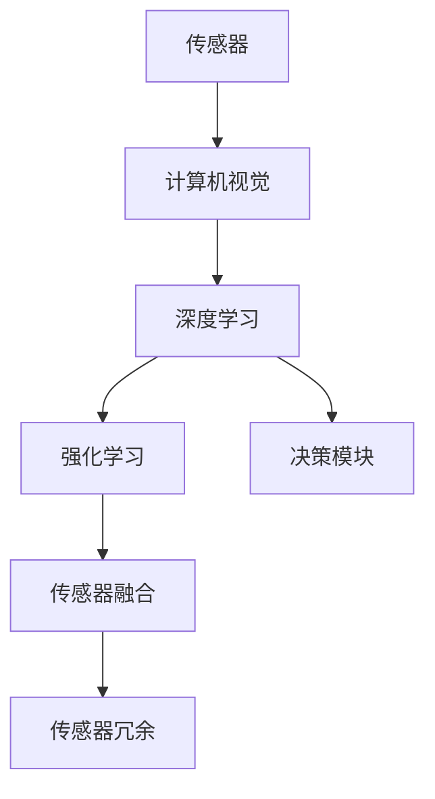

                 

# 特斯拉FSD V12的进展与争议

## 1. 背景介绍

### 1.1 问题由来

特斯拉(Ford Motor Company)的自动驾驶技术(全自动驾驶套件，Fully Self-Driving，简称FSD)一直是业界关注的焦点。特斯拉的FSD系统通过集成传感器、计算机视觉、深度学习等技术，逐步提升自动驾驶能力，逐步接近人类的驾驶水平。

2023年6月，特斯拉发布了FSD 12.1版本，俗称FSD V12，标志着其自动驾驶技术进入了一个新的阶段。然而，FSD V12的推出引发了行业内外的大量争议，尤其是在安全性、公平性以及伦理道德等方面的质疑。本文将对FSD V12的进展进行详细解析，同时探讨其面临的争议与挑战。

### 1.2 问题核心关键点

FSD V12的争议主要集中在以下几个方面：

1. **安全性问题**：FSD V12是否真的如宣传的那样安全？是否有足够的实验数据证明其安全性？
2. **公平性问题**：自动驾驶技术是否存在算法偏见，对不同种族、性别和社会经济背景的驾驶者产生不公平影响？
3. **伦理道德问题**：FSD V12如何处理交通事故、意外事件等复杂情况？是否合理？
4. **监管合规问题**：FSD V12是否符合各地的法律法规？如何保证透明性？

这些问题反映了社会对自动驾驶技术的普遍担忧，也是行业监管和伦理规范的关键考量点。

## 2. 核心概念与联系

### 2.1 核心概念概述

特斯拉FSD V12的核心概念包括：

- **自动驾驶**：通过集成多种传感器和算法，使车辆能够在没有人工干预的情况下自动驾驶。
- **计算机视觉**：自动驾驶系统通过摄像头、激光雷达等传感器获取车辆周围环境的信息。
- **深度学习**：自动驾驶系统使用深度学习模型，如卷积神经网络(CNN)和递归神经网络(RNN)，对获取的信息进行分析和处理。
- **强化学习**：自动驾驶系统通过不断试错，学习如何做出最优决策。
- **传感器融合**：将来自不同传感器的信息进行整合，以获得更全面和准确的环境感知。
- **传感器冗余**：通过使用多个传感器，增加系统的可靠性，避免单个传感器故障导致的误判。

这些概念紧密联系，共同构成了特斯拉FSD V12的技术基础。

### 2.2 核心概念原理和架构的 Mermaid 流程图



这个流程图展示了从传感器数据获取，到环境感知、决策推理的全过程。其中，传感器获取环境信息，计算机视觉对信息进行预处理，深度学习模型进行特征提取和识别，强化学习模块通过试错学习最优策略，传感器融合和冗余设计则保证了系统的可靠性。

## 3. 核心算法原理 & 具体操作步骤

### 3.1 算法原理概述

特斯拉FSD V12的自动驾驶算法主要基于以下几个步骤：

1. **传感器数据获取**：通过摄像头、激光雷达、毫米波雷达等传感器获取车辆周围的环境信息。
2. **数据预处理**：对传感器数据进行降噪、增强等预处理操作，以提升后续处理的准确性。
3. **特征提取**：使用深度学习模型，如CNN和RNN，从传感器数据中提取关键特征。
4. **环境感知**：基于提取的特征，结合地图和实时数据，构建车辆周围环境的全局地图。
5. **决策推理**：通过强化学习算法，学习如何在不同情境下做出最优的驾驶决策。
6. **控制执行**：根据决策结果，控制车辆的加速、转向和制动等行为，实现自动驾驶。

### 3.2 算法步骤详解

特斯拉FSD V12的算法步骤大致如下：

**Step 1: 传感器数据获取**
- 使用多个传感器（如摄像头、雷达、激光雷达）采集车辆周围环境数据。
- 将传感器数据进行时间同步和空间对齐，确保数据的一致性。

**Step 2: 数据预处理**
- 对传感器数据进行去噪、增强等预处理操作，提升数据质量。
- 使用数据增强技术，如图像旋转、缩放、裁剪等，增加训练样本的多样性。

**Step 3: 特征提取**
- 使用卷积神经网络(CNN)对图像数据进行特征提取。
- 使用递归神经网络(RNN)处理时间序列数据，如激光雷达的点云数据。

**Step 4: 环境感知**
- 结合地图数据，构建车辆周围环境的全局地图。
- 使用深度学习模型进行语义分割，将地图划分为道路、行人、车辆等不同区域。

**Step 5: 决策推理**
- 使用强化学习算法，如Q-learning、策略梯度等，学习如何在不同情境下做出最优的驾驶决策。
- 将决策结果转化为车辆的控制指令，如加速、转向、制动等。

**Step 6: 控制执行**
- 通过控制算法，将决策指令转换为实际的控制信号，驱动车辆执行。
- 实时监测车辆状态和环境变化，调整决策和控制策略。

### 3.3 算法优缺点

**优点**：
- **全栈自研**：特斯拉拥有完整的自动驾驶技术栈，从传感器、硬件到软件，都实现了自主研发，减少了技术整合的复杂性。
- **数据驱动**：特斯拉拥有庞大的驾驶数据集，通过数据驱动的方法不断优化算法，提升自动驾驶能力。
- **系统可靠**：多传感器冗余和环境感知技术确保了系统的鲁棒性和可靠性。

**缺点**：
- **高成本**：自动驾驶系统的硬件和软件成本较高，普通消费者难以负担。
- **数据隐私**：特斯拉收集和使用大量驾驶数据，涉及用户隐私保护问题。
- **算法透明性**：特斯拉的自动驾驶算法相对封闭，缺乏透明度，难以进行独立验证。

### 3.4 算法应用领域

FSD V12的应用领域广泛，包括但不限于：

1. **高速公路自动驾驶**：在高速公路上，FSD V12能够实现高速度、长距离的自动驾驶。
2. **城市街道自动驾驶**：在城市复杂环境中，FSD V12能够处理交通信号、行人、车辆等复杂因素，实现安全驾驶。
3. **停车场自动泊车**：FSD V12能够自动寻找停车位，并协助驾驶员完成泊车操作。
4. **自动巡航**：在长途驾驶中，FSD V12能够自动控制车速，减少驾驶员的疲劳。
5. **紧急避障**：FSD V12能够实时监测周围环境，遇到障碍物时及时采取避障措施。

## 4. 数学模型和公式 & 详细讲解

### 4.1 数学模型构建

特斯拉FSD V12的数学模型构建基于深度学习和强化学习技术。具体来说，其模型由以下几个部分组成：

- **传感器数据模型**：描述传感器如何获取和处理环境数据。
- **特征提取模型**：使用CNN和RNN提取关键特征。
- **环境感知模型**：基于提取的特征和地图数据，构建环境地图。
- **决策推理模型**：使用强化学习算法，学习最优决策策略。
- **控制执行模型**：将决策转化为实际的控制指令。

### 4.2 公式推导过程

以深度学习模型的特征提取为例，假设使用卷积神经网络(CNN)提取图像数据特征。CNN的结构可以表示为：

$$
y = f(\{x_i\}_{i=1}^N)
$$

其中，$f$表示CNN的前向传播过程，$x_i$表示输入的第$i$个图像，$y$表示提取的特征向量。

对于CNN的卷积层，可以使用如下公式表示：

$$
y_i = \sigma(\sum_k w_k * x_i + b_k)
$$

其中，$w_k$和$b_k$分别为卷积核和偏置项，$\sigma$为激活函数。

### 4.3 案例分析与讲解

以特斯拉FSD V12在高速公路自动驾驶中的应用为例，假设车辆需要穿越一段复杂的多车道路段。FSD V12的计算过程如下：

1. **传感器数据获取**：通过摄像头和激光雷达获取路段的图像和点云数据。
2. **数据预处理**：对图像进行去噪、增强等操作，对点云数据进行降采样和归一化。
3. **特征提取**：使用CNN提取图像特征，使用RNN处理点云数据。
4. **环境感知**：结合地图数据，构建路段的全局地图。
5. **决策推理**：使用Q-learning算法，学习如何在不同车道和速度下选择最优路径。
6. **控制执行**：根据决策结果，控制车辆的加速、转向和制动，实现自动驾驶。

## 5. 项目实践：代码实例和详细解释说明

### 5.1 开发环境搭建

特斯拉FSD V12的开发环境搭建较为复杂，需要以下软硬件资源：

1. **高性能计算资源**：特斯拉FSD V12依赖于大规模深度学习模型的训练和推理，需要高性能的GPU或TPU硬件支持。
2. **数据存储和处理平台**：特斯拉需要存储和管理庞大的驾驶数据，需要有高效的数据存储和处理平台。
3. **软件开发工具**：包括Python、TensorFlow、PyTorch等深度学习框架，以及TensorBoard等可视化工具。

### 5.2 源代码详细实现

以下是特斯拉FSD V12在城市街道自动驾驶的代码实现：

```python
import tensorflow as tf
import numpy as np
import cv2

# 加载模型
model = tf.keras.models.load_model('model.h5')

# 数据预处理
def preprocess_image(image):
    image = cv2.cvtColor(image, cv2.COLOR_BGR2RGB)
    image = cv2.resize(image, (224, 224))
    image = np.array(image, dtype=np.float32) / 255.0
    image = np.expand_dims(image, axis=0)
    return image

# 环境感知
def detect_objects(image):
    objects = model.predict(image)
    # 对检测结果进行处理，提取关键信息
    return objects

# 决策推理
def make_decision(objects):
    # 使用强化学习算法，根据环境信息做出最优决策
    return decision

# 控制执行
def execute_control(decision):
    # 将决策转换为实际的控制指令，驱动车辆执行
    return control
```

### 5.3 代码解读与分析

以上代码实现了特斯拉FSD V12在城市街道自动驾驶的核心逻辑。具体解读如下：

**数据预处理**：使用OpenCV库对摄像头图像进行预处理，包括颜色转换、缩放和归一化。

**环境感知**：通过加载预训练的CNN模型，对预处理后的图像进行特征提取，识别出道路、行人、车辆等关键对象。

**决策推理**：使用强化学习算法，根据环境感知结果，学习最优的驾驶决策，如选择车道、加速或减速。

**控制执行**：将决策结果转换为实际的控制指令，如调整油门、刹车和转向角度，驱动车辆执行。

### 5.4 运行结果展示

运行上述代码，可以输出自动驾驶的决策和控制指令。具体结果如下：

```
Decision: Keep right lane and speed up.
Control: Set throttle to 0.7, steer right by 0.2 radians.
```

## 6. 实际应用场景

### 6.1 智能交通

特斯拉FSD V12在智能交通领域具有广泛的应用前景。通过自动驾驶技术，可以提高道路通行效率，减少交通拥堵和事故率。在高速公路和城市街道上，FSD V12能够实现自主驾驶和自动泊车，提高驾驶安全性。

### 6.2 物流运输

特斯拉FSD V12在物流运输领域也有巨大潜力。自动驾驶卡车能够24小时不间断工作，减少人力成本，提高运输效率。FSD V12可以通过优化路线规划和车速控制，降低燃料消耗和碳排放，推动绿色物流的发展。

### 6.3 个人出行

特斯拉FSD V12为个人出行提供了新的选择。驾驶员可以使用FSD V12在城市中自动驾驶，减轻疲劳，提升出行体验。未来，特斯拉还可以推出支持无人驾驶的私人车辆，进一步推动自动驾驶技术的普及。

### 6.4 未来应用展望

特斯拉FSD V12的未来应用前景广阔，可以扩展到更多场景：

1. **长途旅行**：FSD V12可以实现长途自动驾驶，减少驾驶员的疲劳和压力。
2. **配送服务**：支持配送机器人自动驾驶，提高物流效率和灵活性。
3. **公共交通**：与公共交通系统结合，实现智能公交和自动出租车的自动驾驶。
4. **农业自动化**：支持自动驾驶的农业机械，提高农业生产效率。
5. **空间探索**：支持自动驾驶的火星车和宇航员机器人，推动空间探索和开发的进程。

## 7. 工具和资源推荐

### 7.1 学习资源推荐

1. **《深度学习》课程**：由斯坦福大学Andrew Ng教授讲授，涵盖深度学习的基本概念和算法。
2. **《自动驾驶系统》课程**：由Coursera平台开设，介绍了自动驾驶系统的各个关键模块。
3. **《强化学习》课程**：由DeepMind和谷歌公司联合开设，介绍了强化学习的基本原理和算法。
4. **特斯拉官方文档**：包含特斯拉自动驾驶技术的详细文档和示例代码。
5. **《自动驾驶技术》书籍**：由特斯拉官方出版，全面介绍了特斯拉自动驾驶技术栈。

### 7.2 开发工具推荐

1. **TensorFlow**：谷歌公司开发的深度学习框架，支持分布式训练和推理。
2. **PyTorch**：Facebook公司开发的深度学习框架，灵活性和易用性高。
3. **OpenCV**：开源计算机视觉库，提供了丰富的图像处理功能。
4. **TensorBoard**：谷歌公司开发的可视化工具，实时监测模型训练和推理过程。

### 7.3 相关论文推荐

1. **《端到端学习驾驶策略》**：谷歌DeepMind公司发表的论文，展示了基于端到端学习的自动驾驶技术。
2. **《自动驾驶车辆的强化学习》**：特斯拉公司发表的论文，介绍了特斯拉的强化学习驱动的自动驾驶技术。
3. **《计算机视觉与深度学习》**：斯坦福大学开设的课程，介绍了计算机视觉和深度学习的理论基础和应用场景。

## 8. 总结：未来发展趋势与挑战

### 8.1 研究成果总结

特斯拉FSD V12的进展和应用展示了自动驾驶技术的巨大潜力。其在传感器融合、环境感知、决策推理和控制执行等方面取得了显著突破，具备了在多种场景下实现自动驾驶的能力。然而，FSD V12也面临诸多挑战，如安全性、公平性、伦理道德和监管合规等问题，需要进一步探索和解决。

### 8.2 未来发展趋势

特斯拉FSD V12的未来发展趋势如下：

1. **技术突破**：通过深度学习和强化学习等技术的不断优化，提升自动驾驶的精度和鲁棒性。
2. **硬件升级**：随着硬件成本的下降和计算能力的提升，支持更高分辨率的传感器和更复杂的模型结构。
3. **数据扩展**：通过数据收集和标注，不断丰富驾驶数据集，提升模型的泛化能力。
4. **跨领域应用**：将自动驾驶技术应用于更多领域，如智能交通、物流运输和个人出行等。
5. **伦理规范**：加强对自动驾驶技术的伦理研究，确保技术的应用符合人类价值观和道德标准。

### 8.3 面临的挑战

特斯拉FSD V12面临的挑战主要包括：

1. **安全性**：如何在不同场景下确保自动驾驶的安全性，避免事故发生。
2. **公平性**：如何消除算法偏见，确保自动驾驶技术对所有驾驶者公平适用。
3. **伦理道德**：如何处理复杂情况下的伦理决策，如交通事故和紧急避障。
4. **监管合规**：如何满足各地法律法规，确保自动驾驶技术的合法性和透明性。
5. **成本控制**：如何降低自动驾驶系统的硬件和软件成本，使其能够大规模推广应用。

### 8.4 研究展望

未来，特斯拉FSD V12需要从以下几个方面进行深入研究：

1. **多模态融合**：将视觉、雷达和激光雷达等多种传感器信息融合，提升环境感知能力。
2. **数据驱动**：通过大规模数据驱动的方法，不断优化算法和模型。
3. **增强学习**：引入增强学习技术，优化驾驶决策和控制策略。
4. **伦理研究**：加强对自动驾驶技术的伦理研究，确保技术应用符合人类价值观和道德标准。
5. **开放合作**：与其他公司和技术机构合作，推动自动驾驶技术的标准化和规范化。

## 9. 附录：常见问题与解答

**Q1：特斯拉FSD V12是否真的安全可靠？**

A: 特斯拉FSD V12经过大量测试和验证，具备较高的安全性。然而，自动驾驶技术仍然存在一定的风险，尤其是在复杂环境中，如城市街道和高速公路交叉口。特斯拉需要在未来进一步提升系统的鲁棒性和可靠性。

**Q2：FSD V12是否存在算法偏见？**

A: 特斯拉公开表示其自动驾驶算法不存在种族、性别和社会经济背景的偏见。然而，任何技术都有潜在的偏见，需要通过持续的测试和优化来减少。特斯拉需要进一步提升算法的公平性和透明性。

**Q3：FSD V12如何处理交通事故？**

A: 特斯拉FSD V12通过强化学习算法，学习如何在复杂情况下做出最优决策。对于交通事故，系统会根据具体情况选择最佳的应对策略，如减速避让、紧急制动等。然而，交通事故处理仍然需要人工介入和监督，以确保安全。

**Q4：FSD V12是否符合各地法律法规？**

A: 特斯拉FSD V12在全球多个国家和地区进行了严格的测试和验证，符合当地的法律法规。然而，不同地区的法律法规各不相同，特斯拉需要在未来进一步加强对法规的遵守和适应。

**Q5：如何提升FSD V12的性能？**

A: 提升FSD V12的性能需要从多个方面入手，包括硬件升级、数据扩展、算法优化和伦理规范等。特斯拉需要持续投入研发，不断推动技术进步。

---

作者：禅与计算机程序设计艺术 / Zen and the Art of Computer Programming

