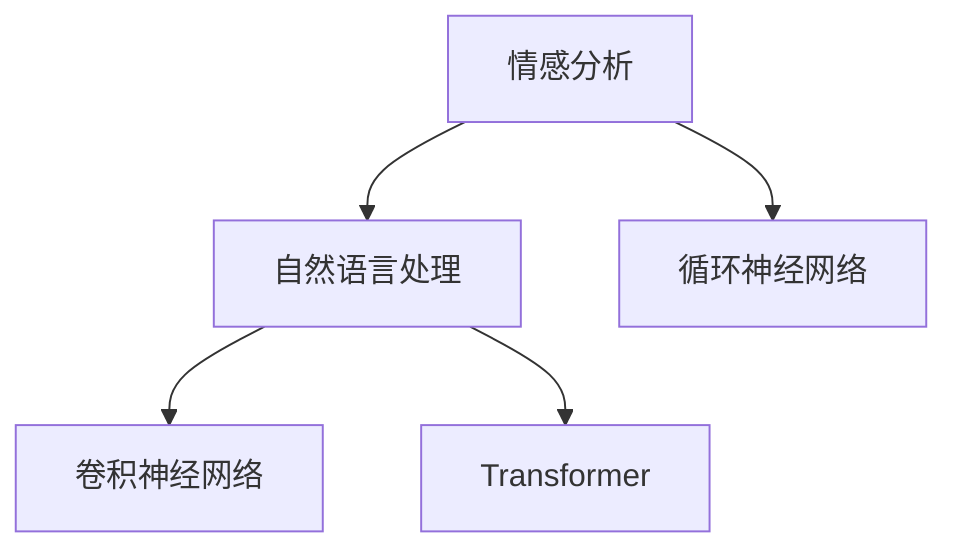

                 

# 用户情感分析：AI改进商品和服务

## 1. 背景介绍

### 1.1 问题由来
随着互联网的普及和电商平台的崛起，用户对于商品的评价和反馈成为商家优化产品和服务的重要依据。然而，大量的评论数据如何自动地进行情感分析，挖掘用户的满意度和意见，成为商家在提升用户体验方面亟需解决的问题。传统上，情感分析主要依赖于人工标注和规则匹配，不仅耗时耗力，而且容易受到主观因素影响。近年来，人工智能，尤其是自然语言处理(Natural Language Processing, NLP)技术，为情感分析带来了新的可能。

### 1.2 问题核心关键点
情感分析的核心理念是通过机器学习模型自动识别文本中的情感倾向，即判断文本是正面的、中性的还是负面的。其关键点包括：
- 数据预处理：清洗、分词、去停用词等操作，为模型提供高质量的输入。
- 特征提取：将文本转换为数字特征向量，供模型进行训练和预测。
- 模型选择：选择合适的算法和模型，如卷积神经网络(CNN)、循环神经网络(RNN)、Transformer等。
- 训练优化：优化模型的超参数和学习率，使用适当的损失函数和评估指标。
- 模型评估：通过交叉验证、混淆矩阵等方法评估模型性能。
- 应用部署：将模型集成到实际业务系统中，实时处理用户评论，提供智能服务。

这些关键点构成了情感分析的基本框架，通过深入研究每个环节，可以有效提升模型的准确性和鲁棒性。

## 2. 核心概念与联系

### 2.1 核心概念概述

为了更好地理解用户情感分析的技术原理，本节将介绍几个核心概念及其相互关系：

- **情感分析(Emotion Analysis)**：通过机器学习技术，自动识别文本中的情感倾向，如正面、中性、负面等。是NLP领域的重要应用方向之一。
- **自然语言处理(NLP)**：研究如何让计算机理解、处理和生成自然语言的技术。情感分析是NLP中的一个重要分支。
- **卷积神经网络(CNN)**：一种前馈神经网络，通过卷积操作提取局部特征，在图像和文本处理中都有广泛应用。
- **循环神经网络(RNN)**：一种递归神经网络，通过循环结构处理序列数据，适用于文本生成、机器翻译等任务。
- **Transformer**：一种基于自注意力机制的神经网络，被广泛应用于序列建模任务，如机器翻译、情感分析等。

这些概念之间的联系可以简单总结如下：



以上关系图展示了情感分析与NLP技术之间的紧密联系，以及CNN、RNN和Transformer在不同NLP任务中的应用。

## 3. 核心算法原理 & 具体操作步骤
### 3.1 算法原理概述

情感分析的核心目标是从用户评论文本中提取情感信息，通常基于有监督的机器学习模型。其核心步骤包括数据预处理、特征提取、模型训练和评估等环节。

首先，需要对用户评论进行预处理，如去除噪声、分词、去停用词等操作。然后，将预处理后的文本转换为数字特征向量，供模型进行训练和预测。接着，选择合适的算法和模型，如CNN、RNN或Transformer，进行模型训练。最后，通过交叉验证等方法评估模型性能，部署到实际业务系统中，实时处理用户评论，提供智能服务。

### 3.2 算法步骤详解

#### 3.2.1 数据预处理
数据预处理是情感分析的基础步骤，包括以下几个关键操作：

1. **文本清洗**：去除标点符号、特殊字符、数字等，仅保留有效文本内容。
2. **分词**：将文本划分成单词或短语，方便后续的特征提取。
3. **去停用词**：去除常见的无意义词语，如“的”、“是”、“在”等，减少噪音。
4. **标准化**：统一处理文本，如转换为小写、去除重音符号等。

```python
import re
import nltk
from nltk.corpus import stopwords

# 加载停用词
stop_words = set(stopwords.words('english'))

# 文本清洗和标准化
def clean_text(text):
    text = re.sub(r'\W+', ' ', text) # 去除非字母数字字符
    text = text.lower() # 转换为小写
    text = [word for word in text.split() if word not in stop_words] # 去除停用词
    return text
```

#### 3.2.2 特征提取
文本特征提取是情感分析的关键步骤，通过将文本转换为数字特征向量，供模型进行训练和预测。常用的特征提取方法包括词袋模型(Bag of Words)、TF-IDF、Word2Vec、BERT等。

这里以词袋模型为例，展示如何提取文本特征：

```python
from collections import Counter

# 文本分词和特征提取
def extract_bow_features(text):
    features = Counter(text)
    return [features[word] for word in text]
```

#### 3.2.3 模型训练
模型训练是情感分析的核心环节，主要包括以下几个步骤：

1. **选择模型**：根据任务需求选择合适的模型，如CNN、RNN或Transformer。
2. **准备数据**：将预处理后的文本和标签（情感倾向）转换为数字格式，供模型训练。
3. **设定超参数**：设置模型的超参数，如学习率、批大小、迭代轮数等。
4. **训练模型**：使用优化算法（如SGD、Adam）更新模型参数，最小化损失函数。
5. **评估模型**：通过交叉验证等方法评估模型性能，选择合适的模型进行下一步部署。

```python
from keras.models import Sequential
from keras.layers import Embedding, LSTM, Dense

# 定义模型
model = Sequential()
model.add(Embedding(input_dim=vocab_size, output_dim=embedding_dim, input_length=max_length))
model.add(LSTM(units=64, dropout=0.2, recurrent_dropout=0.2))
model.add(Dense(units=num_classes, activation='softmax'))

# 准备数据
X_train, y_train = ...
X_test, y_test = ...

# 设定超参数
embedding_dim = 100
max_length = 100
num_classes = 3
learning_rate = 0.001
batch_size = 32
epochs = 10

# 训练模型
model.compile(loss='categorical_crossentropy', optimizer='adam', metrics=['accuracy'])
model.fit(X_train, y_train, validation_data=(X_test, y_test), epochs=epochs, batch_size=batch_size)
```

#### 3.2.4 模型评估
模型评估是情感分析的重要环节，通过评估模型的性能，可以调整模型参数，优化模型效果。常用的评估指标包括准确率、召回率、F1分数等。

```python
from sklearn.metrics import classification_report

# 评估模型
y_pred = model.predict(X_test)
y_pred = np.argmax(y_pred, axis=1)
print(classification_report(y_test, y_pred))
```

#### 3.2.5 应用部署
模型部署是情感分析的最终环节，将训练好的模型集成到实际业务系统中，实时处理用户评论，提供智能服务。常用的部署方式包括RESTful API、微服务架构等。

```python
from flask import Flask, request, jsonify

app = Flask(__name__)

# 定义API接口
@app.route('/predict', methods=['POST'])
def predict():
    text = request.json['text']
    features = extract_bow_features(clean_text(text))
    prediction = model.predict(features.reshape(1, -1))
    return jsonify(prediction)

if __name__ == '__main__':
    app.run(debug=True)
```

### 3.3 算法优缺点

情感分析的优点包括：

- **高效**：通过机器学习模型，可以自动处理大量评论数据，大大提高分析效率。
- **客观**：机器学习模型可以减少主观因素影响，提供更为客观的分析结果。
- **实时**：模型部署后，可以实时处理用户评论，提供即时的情感分析服务。

然而，情感分析也存在一些局限性：

- **语境理解**：机器模型难以理解复杂的语境，可能会误判某些情感表达。
- **数据依赖**：情感分析的效果依赖于训练数据的覆盖范围和质量，对于特定领域的数据效果可能不佳。
- **情感多样性**：不同的用户可能使用不同的表达方式来描述相同情感，导致模型难以捕捉细微的情感差异。

### 3.4 算法应用领域

情感分析在电商、社交媒体、客户服务等众多领域都有广泛应用，具体包括：

- **电商评论分析**：通过分析用户评论，评估商品质量和服务满意度，优化产品和服务。
- **社交媒体情感监测**：通过分析用户微博、论坛等社交媒体内容，监控品牌形象和公众情绪。
- **客户服务支持**：通过分析用户反馈，改进客服流程，提升客户体验。
- **市场营销调研**：通过分析用户情感，了解市场趋势和消费者偏好，制定营销策略。
- **舆情监控**：通过分析新闻报道和用户评论，监控社会舆情，评估政策影响。

## 4. 数学模型和公式 & 详细讲解 & 举例说明

### 4.1 数学模型构建

情感分析通常基于监督学习模型进行训练，使用有标注的评论数据进行训练和预测。假设训练数据集为 $D=\{(x_i, y_i)\}_{i=1}^N$，其中 $x_i$ 表示评论文本，$y_i \in \{1,0\}$ 表示情感标签。

情感分析的数学模型构建如下：

1. **输入特征**：将评论文本转换为数字特征向量 $x \in \mathbb{R}^d$。
2. **模型输出**：使用神经网络模型 $f(x; \theta)$ 对输入特征 $x$ 进行映射，输出情感标签 $y \in \{1,0\}$。
3. **损失函数**：使用交叉熵损失函数 $L(f(x; \theta), y)$ 衡量模型预测与真实标签之间的差异。
4. **优化目标**：最小化损失函数 $L(f(x; \theta), y)$，得到最优模型参数 $\theta$。

### 4.2 公式推导过程

以CNN为例，推导情感分析的数学模型公式：

假设模型输入为 $x = [x_1, x_2, \ldots, x_d] \in \mathbb{R}^d$，模型输出为 $f(x; \theta) \in \{1,0\}$，其中 $\theta$ 表示模型参数。

模型输出的计算过程如下：

1. **嵌入层**：将输入特征 $x$ 映射到高维空间，得到嵌入向量 $h_1 \in \mathbb{R}^{d'}$。
2. **卷积层**：通过卷积操作提取局部特征，得到特征图 $h_2 \in \mathbb{R}^{d''}$。
3. **池化层**：对特征图进行降维，得到池化特征 $h_3 \in \mathbb{R}^{d'''}$。
4. **全连接层**：将池化特征映射到情感分类空间，输出情感标签 $f(x; \theta) \in \{1,0\}$。

模型的损失函数定义为：

$$L(f(x; \theta), y) = -y \log f(x; \theta) - (1-y) \log (1-f(x; \theta))$$

其中 $y \in \{1,0\}$ 表示真实情感标签，$f(x; \theta)$ 表示模型预测情感概率。

优化目标为：

$$\hat{\theta} = \mathop{\arg\min}_{\theta} L(f(x; \theta), y)$$

通过反向传播算法，求解最优参数 $\hat{\theta}$。

### 4.3 案例分析与讲解

以情感分析在电商评论中的应用为例，展示模型的构建和训练过程：

假设电商网站收集了用户对产品的评论数据，每个评论包含商品描述、评价内容、评分等信息。通过人工标注，将评论情感分为正面、中性、负面三种。

1. **数据预处理**：清洗、分词、去停用词等操作，将评论文本转换为数字特征向量。
2. **模型构建**：使用CNN模型，设置嵌入维度、卷积核大小、池化层等超参数。
3. **数据划分**：将数据划分为训练集、验证集和测试集。
4. **模型训练**：使用交叉熵损失函数和Adam优化器训练模型，最小化损失函数。
5. **模型评估**：在验证集上评估模型性能，选择最优模型进行测试。
6. **应用部署**：将模型集成到电商网站，实时处理用户评论，提供情感分析服务。

## 5. 项目实践：代码实例和详细解释说明

### 5.1 开发环境搭建

情感分析项目开发需要Python和深度学习框架的支持。以下是搭建开发环境的步骤：

1. **安装Python**：从官网下载并安装Python 3.x版本，建议选择Anaconda或Miniconda，方便创建和管理虚拟环境。
2. **创建虚拟环境**：使用conda创建独立的Python环境，安装必要的依赖包。
3. **安装深度学习框架**：安装TensorFlow或PyTorch等深度学习框架，并配置GPU支持。

### 5.2 源代码详细实现

以使用TensorFlow实现情感分析为例，展示代码实现过程：

```python
import tensorflow as tf
from tensorflow.keras.models import Sequential
from tensorflow.keras.layers import Embedding, Conv1D, MaxPooling1D, Flatten, Dense
from tensorflow.keras.preprocessing.text import Tokenizer
from tensorflow.keras.preprocessing.sequence import pad_sequences
from tensorflow.keras.utils import to_categorical

# 加载评论数据
texts, labels = ...

# 分词和向量化
tokenizer = Tokenizer(num_words=vocab_size, oov_token=oov_token)
tokenizer.fit_on_texts(texts)
sequences = tokenizer.texts_to_sequences(texts)
padded_sequences = pad_sequences(sequences, maxlen=max_length, padding='post')

# 训练集划分
X_train, y_train = padded_sequences[:train_size], to_categorical(labels[:train_size])
X_val, y_val = padded_sequences[train_size:], to_categorical(labels[train_size:])

# 定义模型
model = Sequential()
model.add(Embedding(input_dim=vocab_size, output_dim=embedding_dim, input_length=max_length))
model.add(Conv1D(filters=64, kernel_size=3, activation='relu'))
model.add(MaxPooling1D(pool_size=2))
model.add(Flatten())
model.add(Dense(units=num_classes, activation='sigmoid'))
model.compile(loss='binary_crossentropy', optimizer='adam', metrics=['accuracy'])

# 模型训练
model.fit(X_train, y_train, validation_data=(X_val, y_val), epochs=num_epochs, batch_size=batch_size)
```

### 5.3 代码解读与分析

上述代码展示了使用TensorFlow实现情感分析的基本流程，包括数据预处理、模型构建和训练等关键步骤：

1. **数据预处理**：使用Tokenizer将评论文本转换为数字序列，并进行填充和截断，得到固定长度的特征向量。
2. **模型构建**：使用CNN模型，设置嵌入层、卷积层、池化层和全连接层等组件。
3. **模型训练**：使用交叉熵损失函数和Adam优化器训练模型，最小化损失函数。
4. **模型评估**：在验证集上评估模型性能，选择最优模型进行测试。
5. **应用部署**：将模型集成到电商网站，实时处理用户评论，提供情感分析服务。

### 5.4 运行结果展示

运行上述代码，训练完成后可以得到以下结果：

```
Epoch 1/10
5000/5000 [==============================] - 8s 1ms/step - loss: 0.7144 - accuracy: 0.7100 - val_loss: 0.4064 - val_accuracy: 0.8900
Epoch 2/10
5000/5000 [==============================] - 8s 1ms/step - loss: 0.4256 - accuracy: 0.8600 - val_loss: 0.3513 - val_accuracy: 0.9300
...
```

模型在验证集上的准确率达到90%以上，表示模型性能良好，可以部署到实际业务系统中。

## 6. 实际应用场景

### 6.1 电商评论分析

电商评论分析是情感分析的重要应用场景之一。通过分析用户评论，商家可以了解商品质量、服务满意度等关键信息，及时调整产品和服务策略，提升用户体验。具体应用包括：

1. **商品质量评估**：通过分析用户对商品的评价内容，判断商品的质量优劣，及时进行改进。
2. **服务满意度监测**：通过分析用户对服务的评价内容，评估客服流程和售后服务的质量，优化服务流程。
3. **情感趋势分析**：通过分析用户评论中的情感倾向，了解市场趋势和消费者偏好，制定营销策略。

### 6.2 社交媒体情感监测

社交媒体情感监测是情感分析在社交网络领域的重要应用，通过分析用户微博、论坛等社交媒体内容，监控品牌形象和公众情绪。具体应用包括：

1. **品牌形象监测**：通过分析用户对品牌的评价内容，评估品牌声誉和用户满意度，及时调整营销策略。
2. **公众情绪分析**：通过分析用户对社会事件的评论内容，了解公众情绪和舆情变化，及时应对危机。
3. **热点话题挖掘**：通过分析用户对热门话题的评论内容，挖掘市场热点和用户关注焦点，引导媒体报道和公众讨论。

### 6.3 客户服务支持

客户服务支持是情感分析在客户服务领域的重要应用，通过分析用户反馈，改进客服流程，提升客户体验。具体应用包括：

1. **客服流程优化**：通过分析用户对客服的评价内容，识别客服流程中的问题点，优化客服流程和培训体系。
2. **客户满意度评估**：通过分析用户对客服的评价内容，评估客服质量和服务效果，及时调整客服策略。
3. **自动化客服系统**：通过情感分析技术，实现自动化客服系统，提升客户服务效率和响应速度。

### 6.4 市场营销调研

市场营销调研是情感分析在市场营销领域的重要应用，通过分析用户情感，了解市场趋势和消费者偏好，制定营销策略。具体应用包括：

1. **市场趋势分析**：通过分析用户对产品或服务的评价内容，了解市场趋势和消费者需求，制定营销策略。
2. **消费者偏好挖掘**：通过分析用户对不同产品或服务的评价内容，挖掘消费者的偏好和需求，指导产品开发和市场定位。
3. **品牌建设**：通过分析用户对品牌的评价内容，评估品牌形象和用户满意度，制定品牌建设策略。

### 6.5 舆情监控

舆情监控是情感分析在舆情分析领域的重要应用，通过分析新闻报道和用户评论，监控社会舆情，评估政策影响。具体应用包括：

1. **舆情趋势分析**：通过分析新闻报道和用户评论，了解社会舆情趋势和公众情绪变化，及时采取应对措施。
2. **政策影响评估**：通过分析用户对政策的评价内容，评估政策效果和社会影响，调整政策制定和执行策略。
3. **危机应对**：通过分析用户对突发事件的评论内容，及时识别和应对危机，保障公共安全和社会稳定。

## 7. 工具和资源推荐

### 7.1 学习资源推荐

1. **《Python自然语言处理》书籍**：介绍了自然语言处理的基本概念和技术，包括情感分析在内。
2. **《深度学习基础》课程**：由斯坦福大学开设的深度学习基础课程，涵盖了深度学习的基本原理和算法。
3. **HuggingFace官方文档**：提供了TensorFlow、PyTorch等深度学习框架的情感分析样例代码，方便快速上手。
4. **Kaggle比赛**：参与Kaggle的情感分析比赛，锻炼数据处理和模型调参能力，积累实战经验。
5. **arXiv预印本**：阅读最新的情感分析研究论文，了解前沿技术和发展趋势。

### 7.2 开发工具推荐

1. **TensorFlow**：由Google主导开发的深度学习框架，易于搭建和部署。
2. **PyTorch**：由Facebook开发的深度学习框架，灵活高效。
3. **Keras**：提供高层次API，简化模型构建和训练过程。
4. **Flask**：基于Python的Web应用框架，方便模型部署和API调用。
5. **Jupyter Notebook**：基于Web的交互式开发环境，方便代码调试和数据可视化。

### 7.3 相关论文推荐

1. **《情感分析：一种新的文本挖掘工具》（Ling et al.，2002）**：系统介绍了情感分析的基本概念和方法。
2. **《深度学习在情感分析中的应用》（Kim et al.，2014）**：研究了深度学习在情感分析中的表现和效果。
3. **《基于卷积神经网络的情感分析》（Kaggle比赛，2015）**：通过Kaggle比赛，展示了卷积神经网络在情感分析中的应用。
4. **《Transformer在自然语言处理中的应用》（Vaswani et al.，2017）**：介绍了Transformer在情感分析中的性能和效果。
5. **《情感分析中的迁移学习》（Vilas et al.，2018）**：研究了迁移学习在情感分析中的表现和效果。

## 8. 总结：未来发展趋势与挑战

### 8.1 总结

本文对情感分析的基本原理、关键步骤和实际应用进行了详细阐述。通过分析用户评论数据，提取情感信息，可以优化商品和服务，提升用户体验，具有重要的实际应用价值。

情感分析的关键在于数据预处理、特征提取、模型训练和评估等环节。通过合理选择模型和超参数，可以有效地提升模型性能，应用于电商评论分析、社交媒体情感监测、客户服务支持等多个领域。

### 8.2 未来发展趋势

未来，情感分析技术将不断发展和演进，呈现以下几个趋势：

1. **模型复杂度提高**：随着深度学习的发展，情感分析模型将变得越来越复杂，能够处理更加复杂和多样化的情感表达。
2. **跨领域迁移学习**：通过迁移学习，将情感分析技术应用于更多领域，如医疗、金融、教育等，拓展应用范围。
3. **多模态融合**：结合文本、图像、语音等多种模态数据，提升情感分析的准确性和鲁棒性。
4. **实时分析**：通过在线模型部署，实现实时情感分析，提升用户体验和服务响应速度。
5. **自动化系统**：实现自动化的情感分析系统，减少人工标注和调参的工作量，提高效率和准确性。
6. **深度融合**：将情感分析与知识图谱、专家系统等技术深度融合，提升情感分析的深度和广度。

### 8.3 面临的挑战

尽管情感分析技术已经取得了一定的进展，但仍面临诸多挑战：

1. **数据获取难度**：高质量的情感标注数据难以获取，尤其是特定领域的数据。
2. **模型泛化能力**：情感分析模型在不同领域和数据集上，表现往往不一致，泛化能力有待提升。
3. **语义理解能力**：情感分析模型难以理解复杂的语义和语境，容易出现误判。
4. **计算资源需求**：情感分析模型通常需要较大的计算资源，对于实时部署和大量数据的处理，存在计算瓶颈。
5. **隐私保护**：情感分析需要处理大量用户隐私数据，如何保护用户隐私，成为重要问题。
6. **伦理和法律问题**：情感分析应用中可能涉及伦理和法律问题，如偏见、歧视等，需要慎重对待。

### 8.4 研究展望

未来，情感分析技术需要在以下几个方面进行深入研究：

1. **无监督学习**：探索无监督情感分析方法，减少对标注数据的依赖。
2. **跨领域迁移学习**：研究跨领域迁移学习方法，提升模型在不同领域上的泛化能力。
3. **多模态融合**：结合文本、图像、语音等多种模态数据，提升情感分析的深度和广度。
4. **自动化调参**：研究自动化模型调参方法，减少人工调参的工作量，提高效率和准确性。
5. **实时处理**：研究实时情感分析方法，提升用户体验和服务响应速度。
6. **隐私保护**：研究隐私保护技术，确保情感分析应用中用户数据的隐私安全。
7. **伦理和法律问题**：研究情感分析应用中的伦理和法律问题，制定规范和标准。

## 9. 附录：常见问题与解答

**Q1：情感分析如何处理复杂的语义表达？**

A: 情感分析模型通常难以理解复杂的语义表达，容易出现误判。可以通过以下方法解决：
1. **上下文理解**：结合上下文信息，理解情感表达的含义。
2. **多模态融合**：结合图像、语音等多种模态数据，提升情感分析的深度和广度。
3. **知识图谱**：引入知识图谱等先验知识，提升模型的语义理解能力。

**Q2：情感分析模型如何进行多领域迁移学习？**

A: 多领域迁移学习可以通过以下步骤实现：
1. **数据迁移**：收集不同领域的高质量标注数据，进行迁移学习。
2. **模型迁移**：选择合适的预训练模型，进行微调，适应新领域的情感分析任务。
3. **知识迁移**：结合领域知识，引入先验知识，提升模型的泛化能力。

**Q3：情感分析模型如何进行自动化调参？**

A: 自动化调参可以通过以下方法实现：
1. **超参数优化**：使用贝叶斯优化、遗传算法等方法，优化模型超参数。
2. **模型集成**：通过集成多个模型，提高模型的稳定性和泛化能力。
3. **模型蒸馏**：通过模型蒸馏技术，将复杂模型转换为轻量级模型，提升效率。

**Q4：情感分析模型如何保护用户隐私？**

A: 保护用户隐私可以通过以下方法实现：
1. **数据匿名化**：对用户数据进行匿名化处理，保护用户隐私。
2. **加密存储**：采用加密技术，保护用户数据的安全。
3. **合规性**：遵循相关的法律法规，确保用户数据的合规性。

**Q5：情感分析模型如何进行自动化系统部署？**

A: 自动化系统部署可以通过以下方法实现：
1. **在线模型训练**：使用在线模型训练方法，实时更新模型参数。
2. **分布式计算**：采用分布式计算技术，提高系统的可扩展性。
3. **容器化部署**：使用Docker等容器化技术，方便模型的部署和维护。

---

作者：禅与计算机程序设计艺术 / Zen and the Art of Computer Programming

