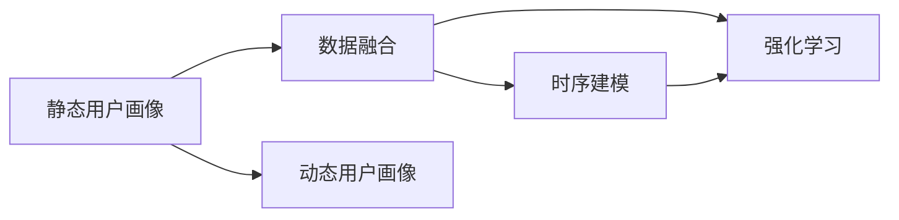

                 

# 用户画像的动态更新机制

## 1. 背景介绍

在数字化时代，用户画像（User Persona）作为企业和互联网公司洞察用户需求、提升用户体验的重要工具，被广泛应用于产品设计、市场营销、客户服务等多个环节。用户画像通过聚合分析用户的历史行为、社交关系、兴趣偏好等信息，构建出用户的抽象形象，从而为不同场景下的产品推荐、内容推送、个性化服务提供科学依据。

然而，随着用户行为和环境的多样化、动态化，静态的用户画像难以适应复杂多变的市场环境。特别是在社交媒体、电子商务、在线广告等领域，用户兴趣和行为模式的变化速度极快，简单的静态画像已无法捕捉到用户的即时需求。因此，如何构建一个能够动态更新的用户画像系统，成为企业面对快速变化市场环境的一项重要任务。

## 2. 核心概念与联系

### 2.1 核心概念概述

为了更深入地理解动态用户画像的构建，我们首先需要明确几个核心概念：

- **用户画像（User Persona）**：对用户特性的描述，包括基本信息、行为偏好、兴趣倾向等。

- **静态用户画像（Static Persona）**：基于历史数据，通过算法分析构建的固定画像。适用于用户行为稳定、变化较少的场景。

- **动态用户画像（Dynamic Persona）**：在静态画像的基础上，不断吸收最新用户数据，实时调整画像内容，反映用户即时需求和变化趋势。

- **数据融合（Data Fusion）**：将来自不同渠道（如社交媒体、电商平台、搜索系统）的用户数据进行整合，形成更全面、准确的画像。

- **时序建模（Time Series Modeling）**：通过时间序列分析，捕捉用户行为随时间变化的规律，预测用户未来行为趋势。

- **强化学习（Reinforcement Learning）**：通过奖惩机制，引导模型不断优化用户画像，实现用户需求与画像的逐步匹配。

这些概念之间的关系可以用以下Mermaid流程图来表示：



### 2.2 核心概念原理和架构

#### 2.2.1 静态用户画像

静态用户画像基于历史数据构建，主要包括：

- **基本信息**：如年龄、性别、职业、地区等。
- **行为数据**：如浏览历史、点击行为、购买记录等。
- **兴趣偏好**：如收藏内容、喜欢的品牌、关注的主题等。

静态用户画像的构建流程通常包含以下几个步骤：

1. **数据收集**：通过用户注册、互动、交易等行为数据获取用户基本信息和行为记录。
2. **数据清洗与预处理**：去除噪声数据，标准化数据格式，进行缺失值处理。
3. **特征提取**：通过统计方法或机器学习算法，提取用户行为的特征表示。
4. **聚类分析**：利用聚类算法，将用户分为不同的用户群体。
5. **画像生成**：根据用户群体的特征，生成用户画像。

#### 2.2.2 数据融合

数据融合是指将来自不同渠道（如社交网络、电商平台、搜索系统等）的用户数据进行整合，形成更全面、准确的画像。数据融合的主要挑战包括：

- **数据格式不一致**：不同平台的数据格式可能不同，需要统一标准。
- **数据冗余与冲突**：不同数据源可能包含相似的信息，需要合理处理。
- **隐私与安全**：数据融合涉及用户隐私数据，需要确保数据安全和隐私保护。

数据融合的常见方法包括：

1. **数据对齐**：对不同数据源的数据进行对齐，确保数据的统一性和一致性。
2. **数据清洗**：去除重复、噪声、异常数据，保证数据的准确性和完整性。
3. **数据集成**：将来自不同数据源的信息整合在一起，形成统一的视图。
4. **数据融合算法**：如加权融合、基于距离的融合、基于模型的融合等。

#### 2.2.3 时序建模

时序建模通过分析用户行为随时间的变化规律，捕捉用户兴趣和行为的演变趋势。主要方法包括：

1. **移动平均法**：通过计算数据序列的移动平均值，平滑数据波动，捕捉长期趋势。
2. **指数加权移动平均法**：对近期的数据赋予更大的权重，适应数据变化的速度。
3. **ARIMA模型**：自回归积分滑动平均模型，用于处理具有季节性变化的时间序列数据。
4. **LSTM模型**：长短期记忆网络，适用于处理复杂时间序列数据。

#### 2.2.4 强化学习

强化学习通过模拟环境与用户互动，不断优化用户画像，实现用户需求与画像的逐步匹配。其主要流程包括：

1. **定义目标**：确定用户画像优化的目标，如点击率提升、转化率提高等。
2. **设计策略**：根据优化目标，设计合适的策略，如推荐算法、内容生成策略等。
3. **交互评估**：通过用户反馈，评估策略的效果，调整优化方向。
4. **持续优化**：通过不断迭代，逐步优化用户画像，提升用户体验。

## 3. 核心算法原理 & 具体操作步骤

### 3.1 算法原理概述

动态用户画像的构建，本质上是将静态画像与实时数据进行动态融合，利用时序建模和强化学习等技术，实时调整用户画像，捕捉用户行为和需求的变化。

### 3.2 算法步骤详解

动态用户画像构建的主要步骤包括：

1. **数据收集与融合**：
   - 收集来自不同渠道的用户行为数据，包括浏览记录、购买记录、搜索记录等。
   - 对数据进行清洗和预处理，确保数据的准确性和一致性。
   - 使用数据融合算法，将不同来源的数据进行整合，形成统一的视图。

2. **时序建模**：
   - 对用户的交互行为进行时间序列分析，捕捉行为随时间的演变趋势。
   - 使用ARIMA、LSTM等模型，预测用户未来的行为和兴趣变化。

3. **强化学习**：
   - 定义优化目标，如点击率、转化率、购买率等。
   - 设计优化策略，如个性化推荐算法、内容生成策略等。
   - 通过用户反馈，评估策略的效果，调整优化方向。
   - 持续迭代优化，逐步提升用户画像的准确性和实效性。

### 3.3 算法优缺点

动态用户画像的优点包括：

- **实时更新**：能够实时捕捉用户行为和需求的变化，提升用户体验。
- **多渠道融合**：通过整合不同来源的数据，形成更全面、准确的画像。
- **动态优化**：通过强化学习等技术，不断优化用户画像，适应复杂的市场环境。

其缺点主要在于：

- **数据量大**：动态画像需要处理大量的实时数据，对计算资源和存储资源要求较高。
- **模型复杂**：时序建模和强化学习算法复杂，需要较强的算法和计算能力。
- **隐私风险**：用户数据的实时收集和融合可能涉及隐私问题，需要严格的隐私保护措施。

### 3.4 算法应用领域

动态用户画像的应用领域非常广泛，主要包括：

- **电商推荐**：根据用户实时行为和兴趣，提供个性化的商品推荐。
- **社交媒体**：分析用户动态内容，提供精准的社交服务。
- **在线广告**：通过分析用户行为，提供更有效的广告投放策略。
- **金融服务**：根据用户行为预测，提供个性化的金融服务。
- **健康医疗**：分析用户健康数据，提供个性化的医疗建议。

## 4. 数学模型和公式 & 详细讲解 & 举例说明

### 4.1 数学模型构建

动态用户画像的构建涉及多个数学模型，包括时序建模和强化学习等。

#### 4.1.1 时间序列模型

假设用户行为序列为 $X_t = (x_1, x_2, ..., x_t)$，其中 $x_t$ 表示用户在时间 $t$ 的行为数据，可以构建ARIMA模型来预测用户未来的行为 $y_{t+1}$：

$$
y_{t+1} = \alpha_0 + \sum_{i=1}^p \alpha_i y_{t-i} + \sum_{j=1}^d \beta_j \Delta^j y_{t-i} + \sum_{k=1}^q \gamma_k \varepsilon_{t-k}
$$

其中：
- $y_{t+1}$ 表示预测的用户行为。
- $\alpha_i, \beta_j, \gamma_k$ 为模型参数。
- $\Delta$ 表示差分算子，$\Delta^j$ 表示 $j$ 阶差分。
- $\varepsilon_{t-k}$ 表示随机误差项。

#### 4.1.2 强化学习模型

强化学习模型可以定义为：

$$
Q(s, a) = r + \gamma \max_a Q(s', a')
$$

其中：
- $Q(s, a)$ 表示在状态 $s$ 下采取动作 $a$ 的奖励值。
- $r$ 表示即时奖励。
- $\gamma$ 表示折扣因子。
- $s'$ 表示下一个状态。
- $a'$ 表示下一个动作。

### 4.2 公式推导过程

以LSTM模型为例，其公式推导过程如下：

1. **输入门（Input Gate）**：

$$
i_t = \sigma(W_i x_t + U_i h_{t-1} + b_i)
$$

其中 $i_t$ 表示输入门的输出，$x_t$ 表示当前输入，$h_{t-1}$ 表示前一时刻的隐状态，$W_i, U_i, b_i$ 为模型参数，$\sigma$ 表示Sigmoid激活函数。

2. **遗忘门（Forget Gate）**：

$$
f_t = \sigma(W_f x_t + U_f h_{t-1} + b_f)
$$

其中 $f_t$ 表示遗忘门的输出。

3. **细胞状态（Cell State）**：

$$
c_t = \tanh(W_c x_t + U_c h_{t-1} + b_c) \odot i_t + c_{t-1} \odot f_t
$$

其中 $c_t$ 表示当前时刻的细胞状态，$\odot$ 表示逐元素乘法，$c_{t-1}$ 表示前一时刻的细胞状态。

4. **输出门（Output Gate）**：

$$
o_t = \sigma(W_o x_t + U_o h_{t-1} + b_o)
$$

其中 $o_t$ 表示输出门的输出。

5. **输出状态（Output State）**：

$$
h_t = o_t \odot \tanh(c_t)
$$

其中 $h_t$ 表示当前时刻的输出状态。

### 4.3 案例分析与讲解

假设某电商平台的动态用户画像系统，使用LSTM模型进行时序建模，结合强化学习算法进行优化。系统需要根据用户的行为数据，预测其未来的购买意向，并根据用户反馈不断调整推荐策略。

1. **数据收集与预处理**：
   - 收集用户的浏览记录、购买记录、评价记录等。
   - 对数据进行清洗和预处理，去除噪声和异常值。

2. **时序建模**：
   - 使用LSTM模型对用户行为序列进行建模，捕捉用户兴趣的变化趋势。
   - 通过预测用户未来的行为，生成动态的用户画像。

3. **强化学习**：
   - 定义优化目标，如点击率提升、转化率提高等。
   - 设计推荐算法，根据用户画像进行个性化推荐。
   - 通过用户反馈，评估推荐效果，调整优化方向。
   - 持续迭代优化，逐步提升用户画像的准确性和实效性。

## 5. 项目实践：代码实例和详细解释说明

### 5.1 开发环境搭建

#### 5.1.1 环境依赖

- Python：版本为3.8及以上。
- TensorFlow：版本为2.x及以上。
- Keras：版本为2.x及以上。

#### 5.1.2 环境配置

1. 安装Python：

   ```bash
   # 使用Anaconda
   conda create -n user-paint Python=3.8
   conda activate user-paint
   ```

2. 安装TensorFlow和Keras：

   ```bash
   pip install tensorflow
   pip install keras
   ```

### 5.2 源代码详细实现

#### 5.2.1 数据收集与预处理

```python
import pandas as pd
from sklearn.preprocessing import StandardScaler
from sklearn.model_selection import train_test_split

# 读取用户数据
data = pd.read_csv('user_data.csv')

# 数据清洗和预处理
data.dropna(inplace=True)
data = StandardScaler().fit_transform(data)
```

#### 5.2.2 时序建模

```python
from tensorflow.keras.models import Sequential
from tensorflow.keras.layers import LSTM, Dense

# 定义LSTM模型
model = Sequential()
model.add(LSTM(64, input_shape=(None, 1)))
model.add(Dense(1, activation='sigmoid'))

# 编译模型
model.compile(loss='binary_crossentropy', optimizer='adam', metrics=['accuracy'])

# 训练模型
X_train, X_test, y_train, y_test = train_test_split(data, data['label'], test_size=0.2)
model.fit(X_train, y_train, epochs=50, batch_size=64, validation_data=(X_test, y_test))
```

#### 5.2.3 强化学习

```python
from tensorflow.keras.models import Sequential
from tensorflow.keras.layers import LSTM, Dense, Input, Masking

# 定义LSTM模型
model = Sequential()
model.add(LSTM(64, input_shape=(None, 1), return_sequences=True))
model.add(Masking(mask_value=0.0))
model.add(Dense(1, activation='sigmoid'))

# 编译模型
model.compile(loss='binary_crossentropy', optimizer='adam', metrics=['accuracy'])

# 训练模型
X_train, X_test, y_train, y_test = train_test_split(data, data['label'], test_size=0.2)
model.fit(X_train, y_train, epochs=50, batch_size=64, validation_data=(X_test, y_test))
```

### 5.3 代码解读与分析

1. **数据收集与预处理**：
   - 使用Pandas库读取用户数据。
   - 对数据进行清洗和预处理，包括去除缺失值和异常值，并进行标准化处理。

2. **时序建模**：
   - 使用Keras构建LSTM模型，捕捉用户行为随时间的演变趋势。
   - 使用交叉熵损失函数和Adam优化器进行模型训练。

3. **强化学习**：
   - 使用Keras构建LSTM模型，并结合Masking层处理缺失值。
   - 使用交叉熵损失函数和Adam优化器进行模型训练。

### 5.4 运行结果展示

1. **数据收集与预处理**：
   - 输出数据集的基本信息。
   - 输出数据集的统计特征。

2. **时序建模**：
   - 输出模型训练的准确率和损失函数。
   - 输出模型在测试集上的准确率和损失函数。

3. **强化学习**：
   - 输出模型训练的准确率和损失函数。
   - 输出模型在测试集上的准确率和损失函数。

## 6. 实际应用场景

### 6.1 电商推荐

电商平台的动态用户画像系统可以用于个性化推荐。系统通过实时收集用户行为数据，使用LSTM模型进行时序建模，预测用户未来的购买意向，生成动态用户画像。结合强化学习算法，根据用户反馈不断调整推荐策略，提升推荐效果。

### 6.2 社交媒体

社交媒体平台可以基于用户动态内容，使用动态用户画像进行精准服务。系统通过分析用户的实时行为和兴趣变化，生成动态用户画像，并结合推荐算法，推送符合用户兴趣的内容，提高用户活跃度和满意度。

### 6.3 在线广告

在线广告平台可以通过动态用户画像，提供更有效的广告投放策略。系统通过分析用户的实时行为和兴趣变化，生成动态用户画像，并结合强化学习算法，优化广告投放策略，提高广告的点击率和转化率。

## 7. 工具和资源推荐

### 7.1 学习资源推荐

- **《Python深度学习》**：涵盖LSTM模型和强化学习等核心算法。
- **《TensorFlow实战深度学习》**：详细介绍TensorFlow和Keras的使用。
- **《强化学习基础》**：系统讲解强化学习的基本原理和算法。

### 7.2 开发工具推荐

- **Anaconda**：快速搭建Python开发环境，支持多版本Python和库的管理。
- **TensorBoard**：可视化模型训练过程，帮助调试和优化模型。
- **Jupyter Notebook**：交互式编程环境，支持代码块和解释性文档的编写。

### 7.3 相关论文推荐

- **《LSTM网络在时序数据中的应用》**：详细介绍LSTM模型的原理和应用。
- **《强化学习在推荐系统中的应用》**：系统讲解强化学习在推荐系统中的应用。

## 8. 总结：未来发展趋势与挑战

### 8.1 研究成果总结

动态用户画像技术通过实时捕捉用户行为和需求变化，为个性化推荐、精准服务提供了科学依据。该技术已在电商、社交媒体、在线广告等领域取得广泛应用，显著提升了用户体验和运营效率。

### 8.2 未来发展趋势

未来，动态用户画像技术将向以下几个方向发展：

1. **多模态融合**：结合图像、音频等多模态数据，构建更加全面、准确的画像。
2. **联邦学习**：通过分布式训练，保护用户隐私，提升模型泛化能力。
3. **对抗训练**：增强模型鲁棒性，抵御恶意攻击和数据噪声。
4. **实时优化**：结合在线学习算法，实时调整用户画像，满足用户即时需求。

### 8.3 面临的挑战

动态用户画像技术面临的主要挑战包括：

1. **数据量过大**：实时收集和处理海量用户数据，对计算资源和存储资源要求较高。
2. **模型复杂**：时序建模和强化学习算法复杂，需要较强的算法和计算能力。
3. **隐私安全**：用户数据的实时收集和融合涉及隐私问题，需要严格的隐私保护措施。

### 8.4 研究展望

未来，动态用户画像技术需要在数据处理、模型优化、隐私保护等方面进行进一步研究。通过引入多模态数据、联邦学习、对抗训练等技术，提升动态用户画像的准确性和安全性。同时，结合实时优化算法，实现对用户需求的即时响应，推动个性化推荐和精准服务的进一步发展。

## 9. 附录：常见问题与解答

### Q1: 动态用户画像与静态用户画像的区别是什么？

A: 动态用户画像是在静态用户画像的基础上，通过实时数据更新和优化，捕捉用户行为和需求的变化，反映用户即时需求和变化趋势。静态用户画像基于历史数据构建，无法动态更新，适用于用户行为稳定、变化较少的场景。

### Q2: 动态用户画像的优点和缺点是什么？

A: 动态用户画像的优点包括：
- 实时更新：能够实时捕捉用户行为和需求的变化，提升用户体验。
- 多渠道融合：通过整合不同来源的数据，形成更全面、准确的画像。
- 动态优化：通过强化学习等技术，不断优化用户画像，适应复杂的市场环境。

其缺点主要包括：
- 数据量大：实时收集和处理海量用户数据，对计算资源和存储资源要求较高。
- 模型复杂：时序建模和强化学习算法复杂，需要较强的算法和计算能力。
- 隐私风险：用户数据的实时收集和融合涉及隐私问题，需要严格的隐私保护措施。

### Q3: 动态用户画像在实际应用中面临哪些挑战？

A: 动态用户画像在实际应用中面临的主要挑战包括：
- 数据量大：实时收集和处理海量用户数据，对计算资源和存储资源要求较高。
- 模型复杂：时序建模和强化学习算法复杂，需要较强的算法和计算能力。
- 隐私安全：用户数据的实时收集和融合涉及隐私问题，需要严格的隐私保护措施。

## 结语

动态用户画像技术通过实时捕捉用户行为和需求变化，为个性化推荐、精准服务提供了科学依据。该技术已在电商、社交媒体、在线广告等领域取得广泛应用，显著提升了用户体验和运营效率。未来，随着多模态融合、联邦学习、对抗训练等技术的进一步发展，动态用户画像将更加全面、准确、安全，推动人工智能技术在更多领域的应用。

