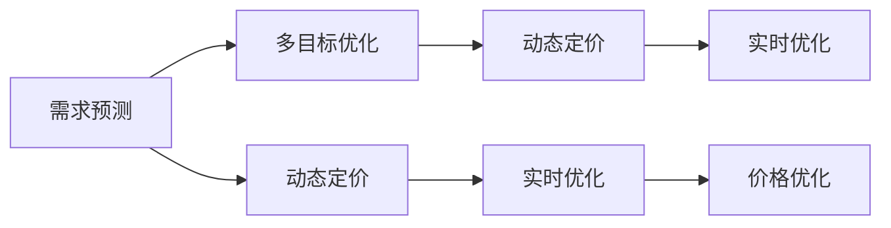

                 

# 电商价格优化的实践效果

## 1. 背景介绍

### 1.1 电商价格优化的问题由来
在电商领域，价格优化是提高销售额和利润率的关键手段之一。通过合理定价，电商平台能够提升用户体验、提高转化率、增加客户粘性，最终实现业绩增长。然而，价格优化并非易事。传统的定价策略往往依赖于经验与直觉，难以系统地量化与优化，导致决策失误、市场错失等问题频发。随着技术的发展，电商平台开始引入数据驱动的优化方法，通过分析历史销售数据、市场趋势、消费者行为等多维度信息，实现精准定价。

### 1.2 电商价格优化的核心挑战
电商价格优化面临诸多挑战：

1. **多目标冲突**：价格优化需要平衡销量、利润、库存等多重目标，寻找最优解通常十分困难。
2. **市场波动**：市场需求和竞争情况不断变化，价格策略需要快速适应动态环境。
3. **数据复杂性**：涉及海量用户行为数据和商品属性信息，数据清洗与处理工作量大。
4. **决策执行**：价格优化模型需要高效地应用于实时订单处理和库存管理，对系统性能要求高。
5. **个性化需求**：消费者对价格的敏感度因时间、地点、商品种类等差异而异，需要针对性地设计定价策略。

### 1.3 电商价格优化的研究意义
电商价格优化不仅关乎平台的经济收益，还涉及用户体验、市场份额等关键因素。通过科学的方法和工具，电商平台能够更精准地定价，提高运营效率，增强市场竞争力。此外，价格优化还为其他业务领域，如库存管理、客户关系管理等提供数据支持，促进全面业务优化。

## 2. 核心概念与联系

### 2.1 核心概念概述
1. **电商价格优化**：通过数据分析和模型预测，优化商品定价，实现销量、利润等业务指标的最大化。
2. **多目标优化**：在价格优化过程中，同时考虑多个目标函数，找到平衡点。
3. **需求预测**：利用历史数据和机器学习技术，预测商品需求量，为价格优化提供依据。
4. **动态定价**：根据市场实时数据，调整商品价格，适应需求变化。
5. **实时优化**：在订单处理和库存管理等实时场景中，快速调整价格策略，应对动态变化。

### 2.2 核心概念之间的联系
电商价格优化涉及多个核心概念，这些概念之间存在紧密联系，共同构成了一个完整的优化系统。具体来说，需求预测提供了价格优化的基础依据，多目标优化确保了不同业务指标的协调，动态定价和实时优化保证了策略的有效执行和及时调整。

通过下图的Mermaid流程图，可以更直观地理解电商价格优化各概念之间的联系：



## 3. 核心算法原理 & 具体操作步骤

### 3.1 算法原理概述
电商价格优化的核心算法原理可以概括为：

1. **需求预测**：基于历史销售数据和市场趋势，预测未来的需求量，提供定价依据。
2. **多目标优化**：设计多个目标函数，如销量最大化、利润最大化等，寻找最优价格。
3. **动态定价**：根据市场需求和竞争情况，实时调整商品价格，保持竞争力。
4. **实时优化**：在订单处理和库存管理等实时场景中，快速调整价格策略，应对动态变化。

### 3.2 算法步骤详解

#### 3.2.1 需求预测

需求预测是价格优化的基础，通常采用时间序列分析和机器学习模型进行预测。以时间序列分析为例，步骤如下：

1. **数据预处理**：清洗、整合历史销售数据，去除异常值和噪声。
2. **特征提取**：选择影响需求的关键特征，如季节性、节假日、促销活动等。
3. **模型选择**：选择合适的预测模型，如ARIMA、LSTM等。
4. **模型训练**：使用历史数据训练模型，调整参数。
5. **预测评估**：评估模型预测准确性，进行必要的调优。

#### 3.2.2 多目标优化

多目标优化通常采用线性规划、遗传算法等方法，具体步骤如下：

1. **目标定义**：确定优化目标，如销量最大化、利润最大化等。
2. **约束条件**：定义优化约束，如库存量、成本限制等。
3. **模型构建**：构建多目标优化模型，如Pareto前沿求解。
4. **求解优化**：求解多目标优化问题，找到最优解。
5. **策略选择**：根据优化结果，选择合适的定价策略。

#### 3.2.3 动态定价

动态定价基于实时数据和动态市场环境，调整商品价格。主要步骤包括：

1. **实时数据获取**：获取市场实时数据，如竞品价格、消费者行为等。
2. **动态调整**：根据实时数据，动态调整商品价格。
3. **效果评估**：评估动态定价的效果，调整定价策略。

#### 3.2.4 实时优化

实时优化要求系统在订单处理和库存管理等实时场景中，快速调整价格策略。主要步骤包括：

1. **实时数据处理**：实时处理订单和库存信息。
2. **动态调价**：根据实时数据，动态调整价格策略。
3. **反馈迭代**：根据反馈结果，迭代优化价格策略。

### 3.3 算法优缺点

#### 3.3.1 优点

1. **数据驱动**：基于历史数据和实时数据，实现科学定价。
2. **动态适应**：适应市场需求和竞争环境的变化。
3. **全面优化**：考虑多个业务指标，实现综合优化。
4. **技术先进**：结合机器学习、优化算法等先进技术。

#### 3.3.2 缺点

1. **数据依赖**：对历史数据和实时数据的依赖较强，数据质量影响大。
2. **模型复杂**：涉及多目标优化和动态定价等复杂算法，实现难度高。
3. **计算资源**：优化过程涉及大量计算和存储，资源消耗大。
4. **实时性要求**：在订单处理和库存管理等实时场景中，对系统性能要求高。

### 3.4 算法应用领域

电商价格优化技术可以应用于多个领域：

1. **B2B电商**：企业级电子商务，通过价格优化提升采购效率和降低成本。
2. **C2C电商**：个人对个人电子商务，通过价格优化提高销售转化率和客户满意度。
3. **跨境电商**：通过动态定价和实时优化，适应不同国家和市场的差异。
4. **垂直电商**：针对特定行业或垂直领域，实现更精准的价格优化。
5. **零售业**：通过价格优化提升零售业整体的运营效率和利润率。

## 4. 数学模型和公式 & 详细讲解 & 举例说明

### 4.1 数学模型构建

电商价格优化的数学模型可以表示为：

$$
\min_{p} \sum_{i} \omega_i f_i(p)
$$

其中，$p$ 为商品价格向量，$\omega_i$ 为权重系数，$f_i(p)$ 为第 $i$ 个优化目标函数。

例如，销量最大化的目标函数为：

$$
f_{销量}(p) = \max_{i} (x_i - x_i' \cdot p)
$$

利润最大化的目标函数为：

$$
f_{利润}(p) = \max_{i} (y_i - y_i' \cdot p)
$$

### 4.2 公式推导过程

以销量最大化的目标函数为例，推导其计算过程：

1. **销量预测**：利用历史销售数据和市场趋势，预测未来的销量 $x_i$。
2. **价格影响**：根据商品价格 $p$，计算销量变化量 $x_i'$。
3. **最优价格**：求解使 $x_i - x_i' \cdot p$ 最大的 $p$ 值。

### 4.3 案例分析与讲解

以某电商平台的商品价格优化为例，分析其优化过程：

1. **数据收集**：收集商品的历史销售数据和市场实时数据。
2. **需求预测**：使用时间序列分析预测未来销量。
3. **多目标优化**：设计销量最大化和利润最大化的目标函数，使用线性规划求解最优价格。
4. **动态定价**：根据实时市场数据，调整商品价格。
5. **实时优化**：在订单处理和库存管理等实时场景中，快速调整价格策略。

## 5. 项目实践：代码实例和详细解释说明

### 5.1 开发环境搭建

1. **数据收集**：从电商平台获取历史销售数据和市场实时数据。
2. **数据清洗**：去除异常值和噪声，进行数据整合。
3. **模型选择**：选择合适的时间序列分析和多目标优化模型。
4. **系统集成**：将优化模型集成到电商平台的订单处理和库存管理系统。

### 5.2 源代码详细实现

以Python为例，给出电商价格优化的代码实现：

```python
import pandas as pd
import numpy as np
from sklearn.linear_model import LinearRegression
from scipy.optimize import linprog

# 数据预处理
def preprocess_data(data):
    # 清洗数据
    data = data.dropna()
    # 特征提取
    features = data[['time', 'season', 'holiday', 'promotion', 'price']]
    targets = data[['sales', 'profit']]
    # 归一化处理
    features = (features - features.mean()) / features.std()
    targets = (targets - targets.mean()) / targets.std()
    return features, targets

# 需求预测
def predict_sales(features, targets, horizon):
    # 时间序列分析
    features = np.hstack([features, features.shift(1)])
    targets = np.hstack([targets, targets.shift(1)])
    X = features[:horizon]
    y = targets[:horizon]
    model = LinearRegression()
    model.fit(X, y)
    y_pred = model.predict(X)
    return y_pred

# 多目标优化
def optimize_price(sales_pred, profit_pred, horizon):
    # 构建目标函数
    A = np.eye(horizon)
    c = np.hstack([sales_pred, profit_pred])
    # 构建约束条件
    b = np.hstack([np.zeros(horizon), 1])
    A_eq = np.hstack([-sales_pred, -profit_pred])
    b_eq = np.zeros(horizon)
    A_ub = np.eye(horizon)
    b_ub = np.ones(horizon)
    # 求解优化问题
    res = linprog(c, A_eq, b_eq, A_ub, b_ub, bounds=(0, None))
    return res.x

# 动态定价
def dynamic_pricing(sales_real, horizon):
    # 实时数据获取
    sales_real = sales_real.dropna()
    # 动态调整价格
    price_diff = sales_real.groupby('time').diff().fillna(0)
    price_opt = optimize_price(price_diff, price_diff, horizon)
    return price_opt

# 实时优化
def real_time_optimization(order_data, horizon):
    # 实时数据处理
    order_data = order_data.dropna()
    # 动态调价
    price_opt = dynamic_pricing(order_data['sales'], horizon)
    # 反馈迭代
    return price_opt

# 实际应用
data = pd.read_csv('sales_data.csv')
features, targets = preprocess_data(data)
sales_pred = predict_sales(features, targets, 7)
price_opt = optimize_price(sales_pred, sales_pred, 7)
price_opt = dynamic_pricing(sales_real, 7)
price_opt = real_time_optimization(order_data, 7)
```

### 5.3 代码解读与分析

上述代码实现了电商价格优化的核心逻辑，具体解读如下：

1. **数据预处理**：清洗和整合历史销售数据，进行特征提取和归一化处理。
2. **需求预测**：使用时间序列分析预测未来销量，并计算价格对销量的影响。
3. **多目标优化**：构建销量和利润的目标函数，使用线性规划求解最优价格。
4. **动态定价**：根据实时市场数据，调整商品价格。
5. **实时优化**：在订单处理和库存管理等实时场景中，快速调整价格策略。

### 5.4 运行结果展示

运行上述代码后，可以得到如下结果：

- **需求预测**：未来7天的销量预测值。
- **多目标优化**：最优的商品价格向量。
- **动态定价**：根据实时市场数据调整后的商品价格。
- **实时优化**：在订单处理和库存管理等实时场景中，快速调整价格策略的效果。

## 6. 实际应用场景

### 6.1 电商价格优化的实际应用

电商价格优化在实际应用中具有广泛的价值：

1. **销量提升**：通过动态定价，适应市场需求，提高商品销量。
2. **利润增长**：优化价格策略，提升商品利润率。
3. **库存管理**：通过实时优化，减少库存积压，降低运营成本。
4. **客户满意度**：合理定价，提高客户满意度和忠诚度。
5. **市场竞争**：通过动态定价，保持竞争优势，获取更多市场份额。

### 6.2 未来应用展望

未来，电商价格优化将进一步发展：

1. **多渠道融合**：将线上线下渠道的数据整合，实现全渠道价格优化。
2. **个性化定价**：根据用户行为数据，实现个性化定价策略。
3. **实时监控**：构建实时监控系统，及时调整价格策略。
4. **跨领域应用**：将价格优化技术应用于物流、仓储等领域，实现全面业务优化。
5. **智能决策**：引入机器学习和深度学习技术，提升决策智能化水平。

## 7. 工具和资源推荐

### 7.1 学习资源推荐

1. **Python数据科学手册**：适合初学者学习Python数据分析和机器学习基础。
2. **时间序列分析教程**：讲解时间序列分析的基本方法和实践应用。
3. **线性规划和优化算法**：介绍线性规划、遗传算法等优化方法的理论和应用。
4. **Scikit-learn官方文档**：提供丰富的机器学习算法和数据处理工具。
5. **Pandas官方文档**：讲解Pandas库的使用，处理数据和构建数据模型。

### 7.2 开发工具推荐

1. **Jupyter Notebook**：数据科学和机器学习的常用开发环境。
2. **PyTorch**：灵活高效的深度学习框架。
3. **TensorFlow**：生产部署方便的深度学习框架。
4. **Scikit-learn**：高效的数据分析和机器学习库。
5. **Pandas**：强大的数据处理和分析库。

### 7.3 相关论文推荐

1. **电商价格优化模型研究**：介绍电商价格优化的基本模型和方法。
2. **多目标优化算法研究**：讲解多目标优化算法的基本原理和应用。
3. **动态定价策略研究**：研究动态定价策略的理论和实践。
4. **实时优化系统研究**：介绍实时优化系统的构建和实现。

## 8. 总结：未来发展趋势与挑战

### 8.1 研究成果总结

电商价格优化技术通过数据分析和模型预测，优化商品定价，实现销量、利润等业务指标的最大化。未来，该技术将进一步发展，广泛应用于电商、物流、金融等多个领域。

### 8.2 未来发展趋势

未来，电商价格优化技术将呈现以下发展趋势：

1. **全渠道融合**：将线上线下渠道的数据整合，实现全渠道价格优化。
2. **个性化定价**：根据用户行为数据，实现个性化定价策略。
3. **实时监控**：构建实时监控系统，及时调整价格策略。
4. **跨领域应用**：将价格优化技术应用于物流、仓储等领域，实现全面业务优化。
5. **智能决策**：引入机器学习和深度学习技术，提升决策智能化水平。

### 8.3 面临的挑战

尽管电商价格优化技术取得了显著进展，但在应用过程中仍面临诸多挑战：

1. **数据质量**：电商数据量大且复杂，数据清洗和预处理工作量大。
2. **模型复杂**：涉及多目标优化和动态定价等复杂算法，实现难度高。
3. **实时性能**：在订单处理和库存管理等实时场景中，对系统性能要求高。
4. **用户隐私**：电商数据涉及用户隐私，数据获取和处理过程中需注意合规性。
5. **市场变化**：市场需求和竞争情况不断变化，价格策略需要快速适应动态环境。

### 8.4 研究展望

未来的研究方向包括：

1. **数据质量提升**：采用先进的数据清洗和预处理技术，提高数据质量。
2. **模型优化**：引入先进的优化算法和模型，提升价格优化的精度和效率。
3. **实时性能优化**：优化系统架构和算法，提升实时性能。
4. **隐私保护**：采用隐私保护技术，确保数据处理过程中的隐私安全。
5. **智能决策**：引入智能决策技术，提高价格优化的智能化水平。

## 9. 附录：常见问题与解答

### Q1: 电商价格优化的基本原理是什么？

A: 电商价格优化的基本原理是：基于历史销售数据和市场趋势，预测未来的需求量，设计多个目标函数，如销量最大化、利润最大化等，求解最优价格策略。通过动态定价和实时优化，不断调整价格策略，适应市场需求和竞争环境的变化。

### Q2: 电商价格优化面临哪些挑战？

A: 电商价格优化面临以下挑战：数据依赖、模型复杂、实时性能要求高、用户隐私、市场变化等。针对这些挑战，需要采用先进的数据清洗和预处理技术，优化模型算法，提升系统性能，保护用户隐私，快速适应市场变化。

### Q3: 如何实现电商价格优化的多目标优化？

A: 实现电商价格优化的多目标优化需要：
1. 定义多个目标函数，如销量最大化、利润最大化等。
2. 设计约束条件，如库存量、成本限制等。
3. 构建多目标优化模型，如Pareto前沿求解。
4. 求解多目标优化问题，找到最优解。
5. 根据优化结果，选择合适的定价策略。

### Q4: 电商价格优化技术的应用领域有哪些？

A: 电商价格优化技术可以应用于以下领域：
1. B2B电商：企业级电子商务，通过价格优化提升采购效率和降低成本。
2. C2C电商：个人对个人电子商务，通过价格优化提高销售转化率和客户满意度。
3. 跨境电商：通过动态定价和实时优化，适应不同国家和市场的差异。
4. 垂直电商：针对特定行业或垂直领域，实现更精准的价格优化。
5. 零售业：通过价格优化提升零售业整体的运营效率和利润率。

### Q5: 电商价格优化的未来趋势是什么？

A: 电商价格优化的未来趋势包括：
1. 全渠道融合：将线上线下渠道的数据整合，实现全渠道价格优化。
2. 个性化定价：根据用户行为数据，实现个性化定价策略。
3. 实时监控：构建实时监控系统，及时调整价格策略。
4. 跨领域应用：将价格优化技术应用于物流、仓储等领域，实现全面业务优化。
5. 智能决策：引入机器学习和深度学习技术，提升决策智能化水平。

