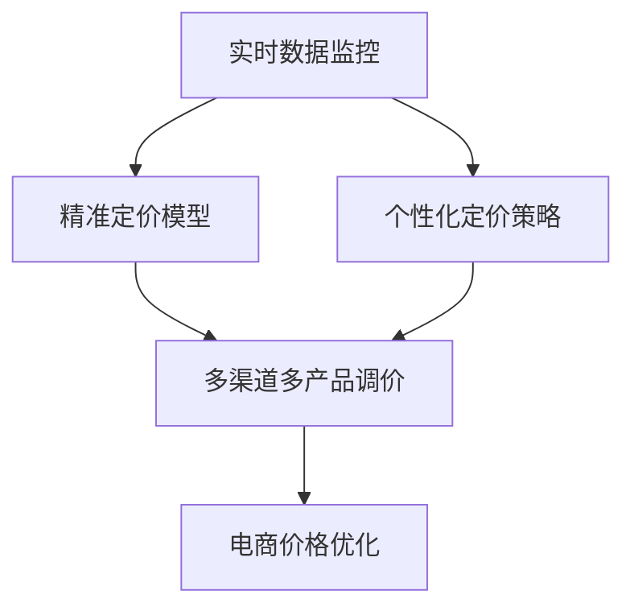

                 

# 电商价格策略的技术优化

## 1. 背景介绍

随着电子商务市场的快速发展，价格策略在提升销售额、优化客户体验和提高运营效率方面发挥着越来越重要的作用。然而，传统的价格策略往往依赖于人工经验，缺乏系统性的数据驱动分析，容易错过最佳调价时机，且难以实现个性化定价。与此同时，数据科学技术的进步为电商价格优化提供了新的机遇，尤其是机器学习和深度学习技术的突破，使大电商企业能够构建更复杂、精准的价格优化模型，实现实时动态调价，提高电商平台的竞争力。

### 1.1 问题由来

电商平台的运营过程中，价格策略是一个极为关键的因素，它直接影响着销售额、市场份额和客户忠诚度。传统上，电商价格策略主要依赖于人工经验，基于历史销售数据、竞争情况和市场反馈等来手动调整价格。但这种方式存在诸多问题：

- **缺乏系统性数据驱动分析**：传统方法主要依赖历史数据和经验，缺乏对实时数据和环境变化的动态响应能力。
- **决策周期长、反应慢**：价格调整需要经过人工审核和测试，决策周期较长，无法实时响应市场变化。
- **缺乏个性化定价**：难以根据不同客户群体的特征和需求，实现差异化定价策略。
- **错过最佳调价时机**：由于无法实时监控市场动态，可能会错过价格调整的最佳时机，影响业务效果。

### 1.2 问题核心关键点

为了克服传统价格策略的缺陷，电商企业开始探索利用机器学习和大数据技术进行价格优化。其主要核心关键点包括：

- **实时动态调价**：利用实时数据，实现快速反应，及时调整价格，以应对市场变化。
- **个性化定价**：根据客户的历史行为和特征，实现差异化定价，提升客户满意度和忠诚度。
- **精准定价模型**：通过构建精准的预测模型，预测价格调整对销售量的影响，以优化价格策略。
- **多渠道和多产品调价**：实现跨多个渠道和多个产品的统一调价策略，提高整体调价效果。

### 1.3 问题研究意义

电商价格策略的技术优化，对电商企业具有重要意义：

- **提升销售和利润**：通过精准定价，提升销售额和利润率。
- **改善客户体验**：个性化定价策略能提高客户满意度和忠诚度，促进重复购买。
- **优化运营效率**：自动化调价过程减少人工干预，提高运营效率，降低运营成本。
- **数据驱动决策**：利用大数据和机器学习技术，提升决策科学性和准确性。

## 2. 核心概念与联系

### 2.1 核心概念概述

为更好地理解电商价格策略的技术优化方法，本节将介绍几个密切相关的核心概念：

- **电商价格优化**：利用机器学习和数据科学技术，构建预测模型，实现动态调价和个性化定价，提升电商平台的整体运营效果。
- **实时数据监控**：通过数据管道和实时数据处理技术，从不同渠道获取实时数据，为价格优化提供实时支持。
- **个性化定价策略**：根据客户特征和历史行为，实现差异化定价，提高客户满意度和转化率。
- **精准定价模型**：利用历史销售数据和市场环境变量，构建预测模型，精准预测价格调整对销售量的影响，指导调价策略。
- **多渠道多产品调价**：实现跨多个渠道和产品的统一调价策略，提高整体调价效果。

这些核心概念之间的逻辑关系可以通过以下Mermaid流程图来展示：



这个流程图展示了大电商价格策略的关键环节：

1. 实时数据监控获取实时数据。
2. 构建个性化定价策略，根据客户特征和历史行为定价。
3. 精准定价模型预测价格调整对销售量的影响。
4. 多渠道多产品调价，实现统一调价策略。
5. 电商价格优化，实现整体效果提升。

## 3. 核心算法原理 & 具体操作步骤
### 3.1 算法原理概述

电商价格策略的技术优化，本质上是一个利用数据科学和机器学习技术构建精准预测模型，进行动态调价和个性化定价的过程。其核心思想是：

1. **收集实时数据**：从电商平台的各个渠道（如网站、App、社交媒体等）收集实时数据，包括客户浏览行为、购买历史、市场价格变化等。
2. **构建预测模型**：利用历史销售数据、市场环境变量和实时数据，构建多个预测模型，预测价格调整对销售量的影响。
3. **优化调价策略**：根据预测模型的输出，实时调整价格，以优化销售效果。
4. **实现个性化定价**：根据客户特征和历史行为，实现差异化定价策略，提升客户满意度和转化率。
5. **多渠道多产品调价**：实现跨多个渠道和产品的统一调价策略，提高整体调价效果。

### 3.2 算法步骤详解

基于机器学习的电商价格策略优化，一般包括以下几个关键步骤：

**Step 1: 数据收集与处理**

- 收集电商平台的各类实时数据和历史销售数据，如客户浏览记录、购买历史、市场价格等。
- 清洗和预处理数据，包括去除缺失值、异常值、重复值等。
- 提取有用的特征，如时间特征、地理位置、用户属性等。

**Step 2: 构建预测模型**

- 根据业务需求，选择适合的机器学习模型，如线性回归、决策树、随机森林、深度神经网络等。
- 利用历史销售数据和市场环境变量，训练预测模型，预测价格调整对销售量的影响。
- 进行模型评估和调优，选择最优模型。

**Step 3: 实时数据监控与动态调价**

- 部署预测模型到生产环境，进行实时数据监控。
- 根据实时数据和预测模型输出，动态调整商品价格。
- 监测价格调整的效果，不断优化模型和调价策略。

**Step 4: 个性化定价策略实现**

- 分析客户的历史行为和特征，构建客户画像。
- 根据客户画像和实时数据，实现差异化定价策略。
- 动态调整价格，提升客户满意度和转化率。

**Step 5: 多渠道多产品调价**

- 构建统一的调价策略，实现跨多个渠道和产品的价格同步调整。
- 定期监测调价效果，优化调价策略。

以上是电商价格策略优化的完整流程。在实际应用中，还需要针对具体业务需求，对各个环节进行优化设计和调整。

### 3.3 算法优缺点

电商价格策略优化方法具有以下优点：

1. **数据驱动决策**：利用实时数据和历史数据，提高决策的科学性和准确性。
2. **实时动态调价**：快速响应市场变化，及时调整价格，提高销售效果。
3. **个性化定价**：根据客户特征和历史行为，实现差异化定价，提升客户满意度和转化率。
4. **多渠道多产品调价**：实现统一的调价策略，提高整体调价效果。

同时，该方法也存在一些局限性：

1. **数据质量和获取成本**：依赖高质量的实时数据，数据获取和处理成本较高。
2. **模型复杂度**：构建精准预测模型需要复杂的算法和大量的数据，模型维护和更新成本高。
3. **个性化定价难度**：客户特征复杂多样，难以构建全面准确的客户画像。
4. **模型解释性**：机器学习模型的决策过程缺乏解释性，难以理解模型输出。
5. **市场环境复杂性**：市场环境变量众多，难以全面考虑，影响模型预测准确性。

尽管存在这些局限性，但就目前而言，利用机器学习进行电商价格优化的技术方法，仍是大电商企业提升竞争力的重要手段。未来相关研究的重点在于如何进一步降低数据获取成本，提高模型复杂度和个性化定价策略的灵活性，同时兼顾模型的可解释性和市场环境变量的准确性。

### 3.4 算法应用领域

电商价格策略优化方法已经在电商平台的多个应用场景中得到了广泛应用，例如：

- **商品定价优化**：通过构建精准预测模型，实现实时动态调价，优化商品价格策略。
- **促销活动设计**：利用个性化定价策略，设计促销活动，提升活动效果。
- **库存管理**：根据销售预测和库存水平，优化库存管理，减少库存积压和缺货风险。
- **客户忠诚计划**：基于客户行为数据，构建忠诚计划，提升客户留存率和重复购买率。
- **市场竞争应对**：监测竞争对手价格变化，及时调整价格，保持市场竞争力。

除了上述这些经典应用外，电商价格策略优化还广泛应用于新商品定价、跨品类调价、全球化市场定价等创新场景中，为电商平台的运营效率和用户体验带来了显著提升。

## 4. 数学模型和公式 & 详细讲解 & 举例说明

### 4.1 数学模型构建

本节将使用数学语言对电商价格策略优化的数学模型进行更加严格的刻画。

假设电商平台的实时数据为 $D_t=\{x_t, y_t\}$，其中 $x_t$ 为实时数据，如市场价格、用户行为等，$y_t$ 为实时目标，如销售额、点击率等。

定义价格优化模型为 $M(D_t; \theta)$，其中 $\theta$ 为模型参数。价格优化的目标是最大化目标函数 $\mathcal{L}(D_t, M)$，即：

$$
\mathcal{L}(D_t, M) = \sum_{t=1}^T \left( y_t - M(x_t; \theta) \right)^2
$$

其中 $T$ 为时间步数。模型的预测结果 $M(x_t; \theta)$ 应尽量逼近实际目标 $y_t$。

### 4.2 公式推导过程

以下我们以线性回归模型为例，推导其预测函数和梯度下降算法的计算公式。

假设 $x_t$ 为输入特征，$y_t$ 为输出目标，构建线性回归模型：

$$
M(x_t; \theta) = \theta_0 + \theta_1 x_{t,1} + \theta_2 x_{t,2} + \cdots + \theta_p x_{t,p}
$$

其中 $\theta = (\theta_0, \theta_1, \theta_2, \cdots, \theta_p)^T$ 为模型参数。目标函数 $\mathcal{L}(D_t, M)$ 定义为：

$$
\mathcal{L}(D_t, M) = \frac{1}{2} \sum_{t=1}^T (y_t - M(x_t; \theta))^2
$$

目标函数对参数 $\theta$ 的梯度为：

$$
\nabla_{\theta} \mathcal{L}(D_t, M) = \sum_{t=1}^T (y_t - M(x_t; \theta)) (\nabla_{\theta} M(x_t; \theta))^T
$$

其中 $\nabla_{\theta} M(x_t; \theta)$ 为模型输出对参数 $\theta$ 的导数。

根据梯度下降算法，模型参数的更新公式为：

$$
\theta \leftarrow \theta - \eta \nabla_{\theta} \mathcal{L}(D_t, M)
$$

其中 $\eta$ 为学习率，控制参数更新的步长。

在得到模型参数的梯度后，即可带入参数更新公式，完成模型的迭代优化。重复上述过程直至收敛，最终得到最优模型参数 $\theta^*$。

### 4.3 案例分析与讲解

假设电商平台的促销活动数据为 $D_t=\{x_t, y_t\}$，其中 $x_t$ 为促销活动参数，$y_t$ 为销售额。构建线性回归模型 $M(x_t; \theta) = \theta_0 + \theta_1 x_{t,1} + \theta_2 x_{t,2}$，其中 $x_{t,1}$ 为促销力度，$x_{t,2}$ 为促销时间。

定义目标函数 $\mathcal{L}(D_t, M) = \frac{1}{2} \sum_{t=1}^T (y_t - M(x_t; \theta))^2$，其中 $T$ 为促销活动时间步数。

使用梯度下降算法优化模型参数 $\theta$，令 $\eta=0.01$，计算梯度：

$$
\nabla_{\theta} \mathcal{L}(D_t, M) = \sum_{t=1}^T (y_t - M(x_t; \theta)) (\nabla_{\theta} M(x_t; \theta))^T
$$

其中 $\nabla_{\theta} M(x_t; \theta) = (1, x_{t,1}, x_{t,2})^T$。

更新参数 $\theta$：

$$
\theta \leftarrow \theta - 0.01 \sum_{t=1}^T (y_t - M(x_t; \theta)) (1, x_{t,1}, x_{t,2})^T
$$

通过不断迭代更新参数，直至收敛，得到最优参数 $\theta^*$，应用于促销活动的实时定价和效果评估。

## 5. 项目实践：代码实例和详细解释说明

### 5.1 开发环境搭建

在进行电商价格优化实践前，我们需要准备好开发环境。以下是使用Python进行Scikit-Learn开发的环境配置流程：

1. 安装Anaconda：从官网下载并安装Anaconda，用于创建独立的Python环境。

2. 创建并激活虚拟环境：
```bash
conda create -n sklearn-env python=3.8 
conda activate sklearn-env
```

3. 安装Scikit-Learn：
```bash
conda install scikit-learn
```

4. 安装Pandas、NumPy、Matplotlib等常用工具包：
```bash
pip install pandas numpy matplotlib scikit-learn
```

完成上述步骤后，即可在`sklearn-env`环境中开始电商价格优化实践。

### 5.2 源代码详细实现

下面我们以电商平台的商品定价优化为例，给出使用Scikit-Learn进行线性回归模型构建的PyTorch代码实现。

首先，定义数据处理函数：

```python
import pandas as pd
from sklearn.model_selection import train_test_split
from sklearn.linear_model import LinearRegression

def load_data(filename):
    data = pd.read_csv(filename)
    X = data[['promotion_strength', 'promotion_duration']]
    y = data['sales']
    return X, y

def split_data(X, y, test_size=0.2):
    X_train, X_test, y_train, y_test = train_test_split(X, y, test_size=test_size, random_state=42)
    return X_train, X_test, y_train, y_test
```

然后，定义模型训练和评估函数：

```python
def train_model(X_train, y_train, test_size=0.2):
    model = LinearRegression()
    model.fit(X_train, y_train)
    X_test, y_test, X_train, y_train = split_data(X_train, y_train, test_size=test_size)
    y_pred = model.predict(X_test)
    print('R-squared:', model.score(X_train, y_train))
    print('MSE:', np.mean((y_test - y_pred) ** 2))
    return model

def evaluate_model(model, X_test, y_test):
    y_pred = model.predict(X_test)
    print('MSE:', np.mean((y_test - y_pred) ** 2))
```

最后，启动模型训练和评估流程：

```python
X, y = load_data('promotion_data.csv')
train_model(X, y)
evaluate_model(model, X_test, y_test)
```

以上就是使用Scikit-Learn进行电商平台商品定价优化模型构建的完整代码实现。可以看到，Scikit-Learn提供了简单易用的机器学习模型封装，使得电商价格优化的开发过程更加高效。

### 5.3 代码解读与分析

让我们再详细解读一下关键代码的实现细节：

**load_data函数**：
- 定义数据加载函数，从CSV文件中加载数据，并提取输入特征和输出目标。

**split_data函数**：
- 定义数据分割函数，将数据集划分为训练集和测试集。

**train_model函数**：
- 定义模型训练函数，使用线性回归模型拟合训练数据，并输出模型评估指标。
- 通过交叉验证，确保模型在不同数据集上的泛化性能。

**evaluate_model函数**：
- 定义模型评估函数，使用测试集评估模型性能，输出平均误差。

**训练流程**：
- 调用train_model函数，对训练集进行模型训练，并输出评估指标。
- 调用evaluate_model函数，对测试集进行模型评估，输出误差指标。

可以看到，Scikit-Learn提供了简单易用的API，使得电商价格优化模型的构建和评估变得简便高效。开发者可以将更多精力放在数据处理和业务逻辑上，而不必过多关注底层实现细节。

当然，工业级的系统实现还需考虑更多因素，如模型的保存和部署、超参数的自动搜索、更灵活的任务适配层等。但核心的电商价格优化模型构建范式基本与此类似。

## 6. 实际应用场景

### 6.1 智能定价策略

智能定价策略是电商价格优化的主要应用场景之一。通过构建精准的预测模型，实时动态调整商品价格，以优化销售效果。具体而言，可以利用客户行为数据、市场环境变量等，构建预测模型，实时监控价格调整对销售额的影响，动态调整价格。

例如，针对某电商平台的某商品，可以收集历史销售数据、市场价格变化、竞争对手情况等，构建线性回归模型，预测价格调整对销售额的影响。通过实时监控模型输出，动态调整商品价格，以最大化销售额。

### 6.2 个性化推荐

个性化推荐也是电商价格优化的重要应用场景。通过构建个性化定价策略，针对不同客户群体的特征和需求，实现差异化定价，提升客户满意度和转化率。具体而言，可以分析客户的历史行为和特征，构建客户画像，根据客户画像和实时数据，实现个性化定价策略。

例如，针对某电商平台的用户群体，可以收集用户的历史购买记录、浏览行为、地理位置等信息，构建客户画像。通过实时监控客户行为数据，动态调整价格，以提高客户满意度和转化率。

### 6.3 库存管理优化

库存管理优化是电商价格优化的另一个重要应用场景。通过构建精准的预测模型，优化库存水平，减少库存积压和缺货风险。具体而言，可以利用历史销售数据和市场环境变量，构建预测模型，实时监控库存水平，动态调整订单和配送策略。

例如，针对某电商平台的库存管理，可以收集历史销售数据、市场价格变化、促销活动情况等，构建预测模型，预测未来的销售量和库存水平。通过实时监控模型输出，动态调整订单和配送策略，以优化库存管理，减少库存积压和缺货风险。

### 6.4 未来应用展望

随着电商价格优化技术的不断发展，未来在更多领域将有广泛应用。

- **跨品类调价**：针对不同品类的商品，构建统一的调价策略，提高整体调价效果。
- **全球化市场定价**：针对全球化市场的不同区域，构建个性化的定价策略，提升全球市场竞争力。
- **实时价格监控**：实时监控市场价格变化，动态调整商品价格，保持市场竞争力。
- **多渠道多产品调价**：实现跨多个渠道和产品的统一调价策略，提高整体调价效果。

相信随着电商价格优化技术的不断进步，电商平台的运营效率和客户体验将进一步提升，大电商企业的竞争力也将不断增强。

## 7. 工具和资源推荐
### 7.1 学习资源推荐

为了帮助开发者系统掌握电商价格优化的理论基础和实践技巧，这里推荐一些优质的学习资源：

1. **机器学习课程**：包括斯坦福大学的CS229、Coursera的Machine Learning、Udacity的Intro to Machine Learning with PyTorch等，系统介绍机器学习的基本概念和常用算法。

2. **深度学习课程**：包括Udacity的Deep Learning、DeepLearning.AI的Deep Learning Specialization等，深入探讨深度学习在电商价格优化中的应用。

3. **电商定价优化书籍**：如《E-commerce Price Optimization with Python》，详细介绍电商价格优化的数据科学方法和实战经验。

4. **Scikit-Learn官方文档**：提供详细的API文档和代码示例，帮助开发者快速上手使用Scikit-Learn进行电商价格优化。

5. **相关论文**：如《A Survey of E-commerce Price Optimization: A Review》，总结了电商价格优化的最新研究成果和应用实践。

通过对这些资源的学习实践，相信你一定能够快速掌握电商价格优化的精髓，并用于解决实际的电商问题。

### 7.2 开发工具推荐

高效的开发离不开优秀的工具支持。以下是几款用于电商价格优化开发的常用工具：

1. **Python**：作为电商价格优化的主要编程语言，Python拥有丰富的第三方库和社区支持，适合快速迭代研究。

2. **Scikit-Learn**：提供了简单易用的机器学习模型封装，适合电商价格优化的模型构建和评估。

3. **TensorFlow**：由Google主导开发的开源深度学习框架，适合大规模工程应用和模型优化。

4. **PyTorch**：基于Python的开源深度学习框架，灵活动态的计算图，适合快速迭代研究。

5. **H2O.ai**：提供快速高效的大数据机器学习平台，适合电商价格优化的数据处理和模型训练。

合理利用这些工具，可以显著提升电商价格优化的开发效率，加快创新迭代的步伐。

### 7.3 相关论文推荐

电商价格优化技术的发展源于学界的持续研究。以下是几篇奠基性的相关论文，推荐阅读：

1. **《Machine Learning for E-commerce》**：涵盖了电商领域的基本机器学习技术和应用实践，帮助读者快速上手电商价格优化。

2. **《Price Optimization in Dynamic Markets》**：介绍了电商价格优化的动态市场模型构建方法和应用效果。

3. **《A Comparative Study of E-commerce Price Optimization Methods》**：比较了电商价格优化中的多种方法，分析了不同方法的优势和劣势。

4. **《Online E-commerce Price Optimization》**：介绍了在线电商价格优化的最新研究进展和应用实践。

5. **《Real-time E-commerce Pricing Optimization》**：介绍了实时电商价格优化的技术框架和实现细节。

这些论文代表了大电商价格优化技术的发展脉络。通过学习这些前沿成果，可以帮助研究者把握学科前进方向，激发更多的创新灵感。

## 8. 总结：未来发展趋势与挑战

### 8.1 总结

本文对电商价格策略的技术优化方法进行了全面系统的介绍。首先阐述了电商价格策略的研究背景和意义，明确了价格优化在提升销售额、优化客户体验和提高运营效率方面的重要价值。其次，从原理到实践，详细讲解了电商价格优化的数学模型和关键步骤，给出了电商价格优化的完整代码实例。同时，本文还广泛探讨了价格优化方法在智能定价、个性化推荐、库存管理等电商应用场景中的应用前景，展示了价格优化技术的广泛潜力。

通过本文的系统梳理，可以看到，电商价格优化技术已经在大电商企业中得到广泛应用，显著提升了平台运营效率和客户体验。未来，伴随机器学习和数据科学技术的不断进步，价格优化技术将更加精准、实时和智能化，成为电商企业竞争力的重要手段。

### 8.2 未来发展趋势

展望未来，电商价格优化技术将呈现以下几个发展趋势：

1. **实时动态调价**：利用实时数据和预测模型，实现快速响应市场变化，动态调整价格。
2. **个性化定价策略**：根据客户特征和历史行为，实现差异化定价，提升客户满意度和转化率。
3. **多渠道多产品调价**：实现跨多个渠道和产品的统一调价策略，提高整体调价效果。
4. **多模态数据融合**：融合客户行为数据、市场环境变量、商品属性等多模态数据，构建更加全面精准的预测模型。
5. **知识图谱与推荐系统结合**：将知识图谱、推荐系统等技术融合到价格优化中，提升模型预测能力和应用效果。

以上趋势凸显了电商价格优化技术的广阔前景。这些方向的探索发展，必将进一步提升电商平台的运营效率和客户体验，为电商企业的竞争力和市场份额提供新的动力。

### 8.3 面临的挑战

尽管电商价格优化技术已经取得了显著成果，但在实现更高精度、实时性和个性化定价的过程中，仍面临诸多挑战：

1. **数据质量和获取成本**：依赖高质量的实时数据，数据获取和处理成本较高。
2. **模型复杂度**：构建精准预测模型需要复杂的算法和大量的数据，模型维护和更新成本高。
3. **个性化定价难度**：客户特征复杂多样，难以构建全面准确的客户画像。
4. **模型解释性**：机器学习模型的决策过程缺乏解释性，难以理解模型输出。
5. **市场环境复杂性**：市场环境变量众多，难以全面考虑，影响模型预测准确性。

尽管存在这些挑战，但电商价格优化技术仍在不断进步，通过模型优化、算法改进、数据增强等手段，有望逐步克服这些难题。未来研究需要进一步探索更加高效的模型构建方法和数据处理技术，提升电商价格优化的实时性和精准性，以应对市场环境的不断变化。

### 8.4 研究展望

面对电商价格优化所面临的挑战，未来的研究需要在以下几个方面寻求新的突破：

1. **多模态数据融合**：融合客户行为数据、市场环境变量、商品属性等多模态数据，构建更加全面精准的预测模型。
2. **知识图谱与推荐系统结合**：将知识图谱、推荐系统等技术融合到价格优化中，提升模型预测能力和应用效果。
3. **实时动态调价**：利用实时数据和预测模型，实现快速响应市场变化，动态调整价格。
4. **个性化定价策略**：根据客户特征和历史行为，实现差异化定价，提升客户满意度和转化率。
5. **模型优化与调参**：优化模型结构和参数配置，提高模型性能和可解释性，减少模型更新成本。

这些研究方向将引领电商价格优化技术迈向更高的台阶，为电商平台的运营效率和客户体验提供新的突破。相信随着研究者的不懈探索和实践，电商价格优化技术将不断成熟，推动电商企业向智能化、个性化、实时化方向迈进。

## 9. 附录：常见问题与解答

**Q1：电商价格优化是否适用于所有商品类别？**

A: 电商价格优化方法适用于大多数商品类别，但针对某些特殊商品，如生鲜、高价值商品等，需要特别考虑。生鲜商品价格受季节和市场供需影响较大，需结合季节性因素和市场供需变化进行调价；高价值商品价格波动较小，需考虑库存成本和市场反应等因素。

**Q2：电商价格优化中的学习率如何设定？**

A: 电商价格优化中的学习率需要根据具体问题进行调整，一般来说，可以从0.01开始逐步减小，直到模型收敛。过高或过低的学习率都会影响模型训练效果，建议通过交叉验证确定最佳学习率。

**Q3：电商价格优化中如何处理异常值和缺失值？**

A: 电商价格优化中的异常值和缺失值处理，一般采用以下方法：

- **异常值处理**：通过统计方法（如均值、中位数）进行异常值检测，并根据实际情况进行处理，如删除异常值、替换为均值等。
- **缺失值处理**：通过插值法、均值填补等方法处理缺失值，确保数据完整性。

**Q4：电商价格优化中的模型解释性如何提高？**

A: 电商价格优化中的模型解释性，可以通过以下方法提高：

- **特征重要性分析**：利用特征重要性分析方法（如SHAP值、LIME等），理解模型对不同特征的依赖程度。
- **模型可视化**：通过模型可视化工具（如TensorBoard、SHAP等），展示模型决策过程和特征影响，提高模型可解释性。

**Q5：电商价格优化中的数据预处理如何进行？**

A: 电商价格优化中的数据预处理，一般包括以下步骤：

- **数据清洗**：去除缺失值、异常值、重复值等，确保数据质量。
- **特征工程**：提取有用的特征，如时间特征、地理位置、用户属性等。
- **数据增强**：通过数据增强技术（如回译、近义替换等）扩充训练集，提高模型泛化能力。

通过上述预处理步骤，可以提升电商价格优化模型的准确性和鲁棒性。

---

作者：禅与计算机程序设计艺术 / Zen and the Art of Computer Programming

