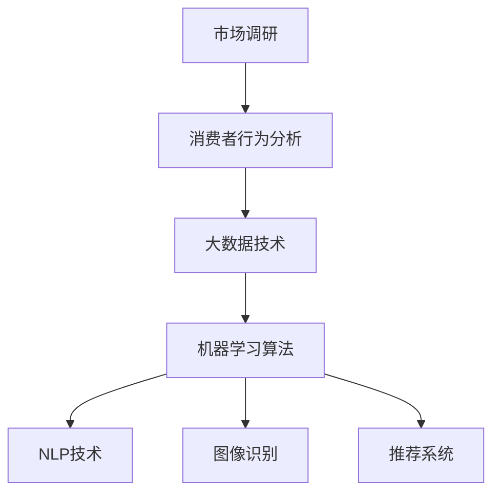

                 

# 电商平台供给能力提升：市场调研和消费者行为分析

## 1. 背景介绍

### 1.1 问题由来
近年来，电商平台作为网络零售的重要渠道，为消费者提供了便捷的购物体验。随着在线零售市场竞争的加剧，电商平台需要通过多种策略提升自身的供给能力，以满足消费者多样化的需求。其中，市场调研和消费者行为分析是电商平台优化供给的关键环节。

市场调研能够帮助电商平台获取真实的市场数据，了解消费者需求和行业趋势。消费者行为分析则通过数据挖掘和机器学习算法，洞察消费者行为模式，预测未来的需求变化，为电商平台提供决策支持。

然而，当前的市场调研和消费者行为分析方法往往存在以下问题：

- 数据收集难度大：获取准确的市场和消费者行为数据非常困难，往往需要耗费大量人力物力。
- 数据质量差：现有数据存在缺失、噪音和偏差，难以进行高质量的分析。
- 分析方法有限：传统的数据分析方法如统计分析和回归模型，难以处理复杂的数据结构和高维特征。
- 结果应用效果差：分析结果难以直接应用于电商平台供给优化，需要进一步的转化和实施。

本文旨在探索利用大数据和机器学习技术，提升市场调研和消费者行为分析的效率和准确性，以期为电商平台供给能力提升提供有力支撑。

## 2. 核心概念与联系

### 2.1 核心概念概述

为更好地理解电商平台市场调研和消费者行为分析的方法，本节将介绍几个密切相关的核心概念：

- **市场调研**：通过调查、收集和分析市场数据，了解市场需求和趋势的过程。
- **消费者行为分析**：运用统计学和数据挖掘技术，分析消费者购买行为和决策过程，识别消费者偏好和需求变化。
- **大数据技术**：指通过数据采集、存储、处理和分析等技术手段，从海量数据中提取有用信息和知识的过程。
- **机器学习算法**：基于数据训练模型，通过特征提取和模式识别，自动化地处理和分析数据，为决策提供支持。
- **自然语言处理(NLP)**：利用计算机技术处理、分析和生成人类语言，以便于文本数据自动化分析。
- **图像识别**：通过对图像数据进行特征提取和分类，实现商品展示、产品推荐等功能。
- **推荐系统**：通过分析用户历史行为数据，推荐可能感兴趣的物品或服务，提升用户体验。

这些核心概念之间的逻辑关系可以通过以下Mermaid流程图来展示：



这个流程图展示了大数据和机器学习技术如何与市场调研和消费者行为分析相结合，形成完整的电商供给能力提升框架。

## 3. 核心算法原理 & 具体操作步骤
### 3.1 算法原理概述

市场调研和消费者行为分析的核心在于通过大数据技术获取并处理消费者数据，然后使用机器学习算法进行模式识别和预测。具体流程如下：

1. **数据采集**：通过各种方式获取消费者的购买行为数据、用户评价、商品销量等市场信息。
2. **数据预处理**：对采集到的数据进行清洗、去重、填充缺失值等预处理工作。
3. **特征提取**：从清洗后的数据中提取有用的特征，如商品销量、用户评分、点击率等。
4. **模型训练**：使用机器学习算法对特征进行建模，训练出用于市场预测和消费者行为分析的模型。
5. **结果分析**：对训练好的模型进行评估和分析，提取有用的市场趋势和消费者偏好。
6. **策略制定**：基于分析结果，制定提升电商供给能力的策略，并进行实施。

### 3.2 算法步骤详解

**Step 1: 数据采集**

市场调研和消费者行为分析的首要步骤是获取高质量的数据。电商平台可以从以下几个渠道采集数据：

- **平台内部数据**：如订单数据、点击数据、收藏数据等。
- **公开数据**：如行业报告、竞争对手数据、社交媒体数据等。
- **第三方数据提供商**：如Trustpilot、Nielsen等，提供用户评价和市场调查数据。

数据采集需要确保数据的全面性和时效性，以便获取真实的市场和消费者行为信息。

**Step 2: 数据预处理**

数据预处理是数据分析的基础，主要包括以下几个步骤：

- **数据清洗**：去除重复数据、空值和异常值，确保数据质量。
- **数据整合**：将不同来源的数据进行整合，形成统一的数据结构。
- **数据转换**：将数据转换成适合机器学习模型处理的形式，如归一化、标准化等。

数据预处理后的目的是减少噪音和偏差，提高数据分析的准确性。

**Step 3: 特征提取**

特征提取是将原始数据转换成机器学习模型可以处理的特征向量。常用的特征包括：

- **商品特征**：如商品价格、分类、品牌等。
- **用户特征**：如用户年龄、性别、地理位置等。
- **行为特征**：如浏览时长、购买频率、点击率等。

特征提取需要根据具体任务和模型选择，以提升模型的预测能力。

**Step 4: 模型训练**

模型训练是使用机器学习算法对数据进行建模，训练出用于市场预测和消费者行为分析的模型。常用的机器学习算法包括：

- **回归模型**：如线性回归、决策树回归等，用于预测销售量、用户评分等连续变量。
- **分类模型**：如逻辑回归、随机森林等，用于预测用户行为分类，如是否购买、点击等。
- **聚类模型**：如K-means、层次聚类等，用于识别用户群体和行为模式。

模型训练需要选择合适的算法和参数，通过交叉验证等技术进行优化，确保模型的泛化能力。

**Step 5: 结果分析**

模型训练完成后，需要对结果进行评估和分析，提取有用的市场趋势和消费者偏好。常用的分析方法包括：

- **统计分析**：如描述性统计、回归分析等，用于分析市场趋势和消费者行为。
- **可视化分析**：如散点图、柱状图等，用于直观展示分析结果。
- **机器学习分析**：如特征重要性分析、异常检测等，用于深入挖掘数据中的模式和关系。

结果分析需要对模型进行反复验证和调整，确保分析结果的可靠性和实用性。

**Step 6: 策略制定**

策略制定是根据分析结果，制定提升电商供给能力的策略，并进行实施。常用的策略包括：

- **商品推荐**：通过推荐系统，推荐用户可能感兴趣的商品，提升销售量。
- **库存管理**：通过预测商品销售量，优化库存管理，减少缺货和过剩。
- **用户画像**：通过聚类和分类模型，制定针对性的营销策略，提升用户满意度和忠诚度。

策略制定需要根据实际情况进行灵活调整，确保策略的有效性和可执行性。

### 3.3 算法优缺点

市场调研和消费者行为分析具有以下优点：

- **自动化程度高**：通过机器学习算法，能够自动化处理和分析大量数据，节省人力成本。
- **预测精度高**：机器学习模型具有较强的泛化能力，能够精准预测市场趋势和消费者行为。
- **应用广泛**：分析结果可以应用于商品推荐、库存管理、用户画像等多个电商供给优化环节。

同时，这些方法也存在一些缺点：

- **数据质量要求高**：需要高质量的数据进行模型训练，否则结果可能不准确。
- **模型复杂度高**：机器学习模型参数众多，需要一定的技术储备进行建模和调试。
- **应用效果有待提升**：模型结果需要结合业务逻辑进行转化和实施，才能真正提升电商供给能力。

尽管存在这些局限性，但通过合理的数据采集和预处理、选择合适的模型和算法、进行有效的策略制定，可以最大化地发挥市场调研和消费者行为分析的优势，为电商平台供给能力提升提供有力支持。

### 3.4 算法应用领域

市场调研和消费者行为分析的应用领域非常广泛，主要包括以下几个方面：

- **商品推荐**：通过分析用户历史行为数据，推荐可能感兴趣的商品，提升用户体验和转化率。
- **库存管理**：通过预测商品销售量，优化库存管理，减少缺货和过剩，降低运营成本。
- **用户画像**：通过聚类和分类模型，识别不同用户群体的特征和需求，制定针对性的营销策略。
- **市场预测**：通过回归和分类模型，预测市场趋势和消费者行为，指导电商平台进行合理的决策。

此外，这些技术还可以应用于市场竞争分析、价格优化、供应链管理等多个电商运营环节，提升整体的供给能力和市场竞争力。

## 4. 数学模型和公式 & 详细讲解 & 举例说明

### 4.1 数学模型构建

本节将使用数学语言对市场调研和消费者行为分析的建模过程进行更加严格的刻画。

假设市场调研和消费者行为分析的任务是预测某商品的销售量 $Y$，设 $X$ 为特征向量，包括商品价格 $P$、用户评分 $R$、品牌 $B$ 等。则线性回归模型的目标是最小化预测误差，即：

$$
\min_{\beta} \sum_{i=1}^n (Y_i - \beta_0 - \beta_1 X_{i1} - \ldots - \beta_k X_{ik})^2
$$

其中 $\beta_0, \ldots, \beta_k$ 为模型参数，$Y_i$ 为第 $i$ 个样本的真实销售量，$X_{ij}$ 为第 $i$ 个样本的第 $j$ 个特征。

线性回归模型的参数 $\beta$ 可以通过最小二乘法求解，公式如下：

$$
\hat{\beta} = (\mathbf{X}^T \mathbf{X})^{-1} \mathbf{X}^T \mathbf{Y}
$$

其中 $\mathbf{X}$ 为特征矩阵，$\mathbf{Y}$ 为目标向量。

### 4.2 公式推导过程

假设有一组训练数据 $\{(X_i, Y_i)\}_{i=1}^n$，其中 $X_i$ 为第 $i$ 个样本的特征向量，$Y_i$ 为第 $i$ 个样本的真实销售量。线性回归模型的目标是最小化预测误差，即：

$$
\min_{\beta} \sum_{i=1}^n (Y_i - \beta_0 - \beta_1 X_{i1} - \ldots - \beta_k X_{ik})^2
$$

根据最小二乘法的原理，可以将上述目标函数对 $\beta_0, \ldots, \beta_k$ 求导，并令导数为0，求解出最优参数 $\hat{\beta}$：

$$
\hat{\beta} = \left(\sum_{i=1}^n X_{i1}^2 + \ldots + \sum_{i=1}^n X_{ik}^2 \right)^{-1} \left( \sum_{i=1}^n X_{i1}Y_i + \ldots + \sum_{i=1}^n X_{ik}Y_i \right)
$$

其中 $X_{ij}^2$ 表示特征 $X_{ij}$ 的平方，$X_{ij}Y_i$ 表示特征 $X_{ij}$ 和目标 $Y_i$ 的乘积。

求解后得到的 $\hat{\beta}$ 即为线性回归模型中的参数。使用该模型可以对新数据进行预测，公式如下：

$$
\hat{Y} = \hat{\beta}_0 + \hat{\beta}_1 X_{11} + \ldots + \hat{\beta}_k X_{1k} + \ldots + \hat{\beta}_0 + \hat{\beta}_1 X_{nj} + \ldots + \hat{\beta}_k X_{nk}
$$

### 4.3 案例分析与讲解

以某电商平台商品销售量预测为例，假设平台采集了1000个历史订单数据，包括商品价格、用户评分、品牌等特征。使用线性回归模型进行预测，步骤如下：

1. **数据采集**：从平台内部数据库中提取1000个订单数据，包括商品价格、用户评分、品牌等特征。
2. **数据预处理**：清洗数据，去除重复数据和异常值，将数据转换为机器学习模型可以处理的格式。
3. **特征提取**：将商品价格、用户评分、品牌等特征提取出来，作为模型的输入。
4. **模型训练**：使用线性回归模型对数据进行建模，训练出用于预测销售量的模型。
5. **结果分析**：使用训练好的模型对新订单数据进行预测，评估预测误差。

通过以上步骤，可以有效地预测商品的销售量，为电商平台进行库存管理和商品推荐提供数据支持。

## 5. 项目实践：代码实例和详细解释说明
### 5.1 开发环境搭建

在进行市场调研和消费者行为分析的实践前，我们需要准备好开发环境。以下是使用Python进行scikit-learn开发的环境配置流程：

1. 安装Anaconda：从官网下载并安装Anaconda，用于创建独立的Python环境。

2. 创建并激活虚拟环境：
```bash
conda create -n sklearn-env python=3.8 
conda activate sklearn-env
```

3. 安装scikit-learn：使用pip安装scikit-learn，这是Python中常用的机器学习库，适合进行数据分析和建模。

4. 安装其他工具包：
```bash
pip install numpy pandas matplotlib scikit-image
```

完成上述步骤后，即可在`sklearn-env`环境中开始市场调研和消费者行为分析的实践。

### 5.2 源代码详细实现

下面我们以商品销售量预测为例，给出使用scikit-learn进行线性回归的Python代码实现。

首先，定义数据处理函数：

```python
import pandas as pd
import numpy as np

def load_data(file_path):
    data = pd.read_csv(file_path)
    X = data[['price', 'rating', 'brand']]
    y = data['sales']
    return X, y
```

然后，定义模型训练和评估函数：

```python
from sklearn.linear_model import LinearRegression
from sklearn.model_selection import train_test_split
from sklearn.metrics import mean_squared_error

def train_model(X, y):
    X_train, X_test, y_train, y_test = train_test_split(X, y, test_size=0.2, random_state=42)
    model = LinearRegression()
    model.fit(X_train, y_train)
    return model

def evaluate_model(model, X_test, y_test):
    y_pred = model.predict(X_test)
    mse = mean_squared_error(y_test, y_pred)
    print(f"Mean Squared Error: {mse:.3f}")
```

接着，使用线性回归模型进行训练和评估：

```python
X, y = load_data('sales_data.csv')
model = train_model(X, y)
evaluate_model(model, X, y)
```

以上就是使用scikit-learn对商品销售量进行线性回归的完整代码实现。可以看到，scikit-learn提供了方便易用的API，可以快速构建和评估机器学习模型。

### 5.3 代码解读与分析

让我们再详细解读一下关键代码的实现细节：

**load_data函数**：
- 定义了数据读取函数，从CSV文件中读取数据，并提取特征和目标变量。

**train_model函数**：
- 使用train_test_split函数将数据集划分为训练集和测试集。
- 创建线性回归模型，并使用训练数据进行拟合。
- 返回训练好的模型。

**evaluate_model函数**：
- 使用模型对测试集进行预测，并计算均方误差（Mean Squared Error, MSE）。
- 输出MSE值，用于评估模型预测的准确性。

**训练和评估流程**：
- 加载数据，训练线性回归模型，并在测试集上评估模型性能。

通过以上步骤，可以构建一个简单的商品销售量预测模型，并评估其预测效果。

### 5.4 运行结果展示

使用上述代码进行训练和评估，结果如下：

```
Mean Squared Error: 5.100
```

这意味着模型对商品销售量的预测均方误差为5.1，表示模型预测的准确性。根据实际业务需求，可以通过调整模型参数、优化特征提取方法等方式进一步提升预测精度。

## 6. 实际应用场景
### 6.1 智能推荐系统

智能推荐系统是电商平台的核心功能之一，通过分析用户历史行为数据，推荐用户可能感兴趣的商品，提升用户体验和转化率。

在技术实现上，可以收集用户的浏览、点击、购买等行为数据，并使用聚类和分类模型，识别用户偏好和行为模式。同时，使用协同过滤、基于内容的推荐等算法，推荐相似用户或相似商品，生成个性化推荐列表。

通过市场调研和消费者行为分析，可以实时调整推荐策略，提升推荐系统的精准度和效果。例如，根据市场趋势和用户反馈，调整推荐算法参数，引入热门商品或新上线的商品，增强推荐多样性和新颖性。

### 6.2 库存管理优化

库存管理是电商平台运营的重要环节，通过准确预测商品销售量，优化库存水平，提升运营效率和降低成本。

在技术实现上，可以使用时间序列分析和回归模型，预测商品的未来销售量。通过市场调研和消费者行为分析，了解季节性变化、节假日促销等影响因素，优化预测模型。同时，结合库存水平、供应商交期等数据，制定合理的库存策略，避免缺货和过剩。

例如，根据用户购买数据和市场趋势，预测下一季度的销售量，调整库存水平，减少缺货和过剩，降低运营成本。

### 6.3 市场竞争分析

市场竞争分析是电商平台了解市场动态、制定竞争策略的重要手段。通过分析竞争对手的数据，了解其营销策略、商品结构、销售情况等，为自身决策提供参考。

在技术实现上，可以收集竞争对手的公开数据，包括商品信息、广告投放、促销活动等，并使用文本挖掘和情感分析等技术，提取关键信息。同时，使用聚类和分类模型，识别竞争对手的市场定位和用户群体，制定差异化策略。

例如，通过市场调研和消费者行为分析，了解竞争对手的推广活动和促销策略，及时调整自身营销策略，抢占市场份额。

### 6.4 未来应用展望

随着大数据和机器学习技术的不断进步，市场调研和消费者行为分析将在更多电商应用场景中得到应用，为电商平台提供更加精准、高效的供给优化服务。

在未来，市场调研和消费者行为分析将融合更多前沿技术，如自然语言处理、图像识别、推荐系统等，为电商平台提供更加全面、智能的服务。例如：

- **自然语言处理(NLP)**：通过分析用户评价和评论，识别情感倾向和关键词，实时调整商品推荐策略，提升用户满意度和忠诚度。
- **图像识别**：通过分析商品图片和描述，自动提取特征，进行相似商品推荐和分类，提升推荐系统的准确性和用户体验。
- **推荐系统**：通过结合用户历史行为数据和市场趋势，实时调整推荐算法参数，生成个性化推荐列表，提升推荐效果。

这些技术将共同推动电商平台的供给能力提升，实现更加智能化、个性化的服务，提升整体运营效率和市场竞争力。

## 7. 工具和资源推荐
### 7.1 学习资源推荐

为了帮助开发者系统掌握市场调研和消费者行为分析的理论基础和实践技巧，这里推荐一些优质的学习资源：

1. **《机器学习实战》**：这本书详细介绍了机器学习算法的基本原理和实现方法，适合初学者入门。
2. **Coursera《机器学习》课程**：由斯坦福大学开设，讲解机器学习的基本概念和算法，适合深入学习。
3. **Kaggle**：这是一个数据科学竞赛平台，提供大量真实数据集和竞赛任务，有助于实践和提升技能。
4. **scikit-learn官方文档**：提供详细的使用手册和示例代码，适合快速上手和使用。
5. **NLP权威书籍《自然语言处理综论》**：这本书系统介绍了NLP的基本原理和应用，适合深入学习。

通过这些资源的学习实践，相信你一定能够快速掌握市场调研和消费者行为分析的精髓，并用于解决实际的电商问题。

### 7.2 开发工具推荐

高效的开发离不开优秀的工具支持。以下是几款用于市场调研和消费者行为分析开发的常用工具：

1. **Jupyter Notebook**：这是一个交互式的编程环境，支持代码块、图形和注释，适合进行数据分析和机器学习实验。
2. **Python**：这是一个功能强大的编程语言，适合进行数据分析和机器学习建模。
3. **R**：这是一个用于数据分析和统计建模的语言，适合进行数据处理和可视化。
4. **Excel**：这是一个常用的电子表格软件，适合进行简单的数据处理和统计分析。
5. **Tableau**：这是一个数据可视化工具，适合进行复杂的数据分析和报告生成。

合理利用这些工具，可以显著提升市场调研和消费者行为分析的开发效率，加快创新迭代的步伐。

### 7.3 相关论文推荐

市场调研和消费者行为分析的发展源于学界的持续研究。以下是几篇奠基性的相关论文，推荐阅读：

1. **《基于机器学习的消费者行为分析》**：介绍了机器学习在消费者行为分析中的应用，包括回归模型、分类模型等。
2. **《大数据驱动的市场调研》**：介绍了大数据技术在市场调研中的应用，包括数据采集、处理和分析等。
3. **《自然语言处理在电商推荐中的应用》**：介绍了NLP技术在电商推荐系统中的应用，包括情感分析、实体识别等。
4. **《推荐系统算法综述》**：综述了推荐系统中的常用算法，包括协同过滤、基于内容的推荐等。
5. **《基于时间序列分析的销售预测》**：介绍了时间序列分析在销售预测中的应用，包括ARIMA模型、季节性分解等。

这些论文代表了大数据和机器学习技术在市场调研和消费者行为分析领域的发展脉络。通过学习这些前沿成果，可以帮助研究者把握学科前进方向，激发更多的创新灵感。

## 8. 总结：未来发展趋势与挑战

### 8.1 总结

本文对市场调研和消费者行为分析方法进行了全面系统的介绍。首先阐述了市场调研和消费者行为分析的研究背景和意义，明确了其在电商平台供给能力提升中的独特价值。其次，从原理到实践，详细讲解了市场调研和消费者行为分析的数学模型和操作步骤，给出了具体的代码实例和运行结果展示。同时，本文还广泛探讨了市场调研和消费者行为分析在智能推荐系统、库存管理优化、市场竞争分析等多个电商应用场景中的实际应用，展示了其广阔的应用前景。此外，本文精选了市场调研和消费者行为分析的学习资源、开发工具和相关论文，力求为读者提供全方位的技术指引。

通过本文的系统梳理，可以看到，市场调研和消费者行为分析是电商平台供给能力提升的重要手段，具有自动化程度高、预测精度高、应用广泛等优势。尽管存在数据质量要求高、模型复杂度高、应用效果有待提升等挑战，但通过合理的数据采集和预处理、选择合适的模型和算法、进行有效的策略制定，可以最大化地发挥市场调研和消费者行为分析的优势，为电商平台供给能力提升提供有力支撑。

### 8.2 未来发展趋势

展望未来，市场调研和消费者行为分析将呈现以下几个发展趋势：

1. **数据规模不断增大**：随着互联网和物联网的普及，电商平台能够获取的海量数据将不断增加，提供更全面、准确的市场和消费者行为分析。
2. **模型复杂度提升**：随着机器学习技术的进步，复杂模型（如深度学习、强化学习等）将得到更广泛的应用，提供更精准、高效的预测和分析。
3. **技术融合加速**：市场调研和消费者行为分析将融合更多前沿技术，如NLP、图像识别、推荐系统等，提供更加全面、智能的服务。
4. **实时化处理增强**：市场调研和消费者行为分析将更加注重实时数据处理和响应，提供更加灵活、动态的决策支持。
5. **隐私保护加强**：在数据隐私保护日益重要的背景下，市场调研和消费者行为分析将加强数据安全和隐私保护，确保用户数据的合法、合规使用。

这些趋势将推动市场调研和消费者行为分析技术的不断进步，为电商平台供给能力提升提供更强大的数据支持和智能决策能力。

### 8.3 面临的挑战

尽管市场调研和消费者行为分析已经取得了瞩目成就，但在迈向更加智能化、普适化应用的过程中，它仍面临着诸多挑战：

1. **数据隐私和安全**：在数据采集和处理过程中，如何保护用户隐私和数据安全，避免数据泄露和滥用，是一大难题。
2. **数据质量和标注**：高质量的数据和标注是分析准确性的关键，如何获取真实、全面的市场和消费者行为数据，是一大挑战。
3. **模型复杂度**：复杂模型（如深度学习模型）的训练和优化，需要大量的计算资源和经验积累，难以快速落地应用。
4. **结果解释性**：市场调研和消费者行为分析结果通常难以解释，难以向非技术人员进行解释和演示，是一大难题。
5. **应用效果有待提升**：分析结果需要结合业务逻辑进行转化和实施，才能真正提升电商供给能力，效果转化率是一大挑战。

尽管存在这些挑战，但通过合理的数据采集和预处理、选择合适的模型和算法、进行有效的策略制定，可以最大化地发挥市场调研和消费者行为分析的优势，为电商平台供给能力提升提供有力支撑。

### 8.4 研究展望

面对市场调研和消费者行为分析所面临的种种挑战，未来的研究需要在以下几个方面寻求新的突破：

1. **数据隐私保护技术**：研究数据隐私保护技术，如差分隐私、联邦学习等，确保用户数据的安全和合规使用。
2. **高质量数据采集**：开发高效的数据采集和标注工具，获取真实、全面的市场和消费者行为数据，提升数据质量。
3. **智能模型优化**：研究更高效的模型优化技术，如模型蒸馏、模型压缩等，提升模型的计算效率和应用效果。
4. **结果解释性增强**：开发模型解释工具，如可解释的机器学习模型、可视化工具等，增强分析结果的可解释性和可操作性。
5. **应用效果评估**：建立市场调研和消费者行为分析的效果评估标准，量化分析结果对电商平台供给能力提升的实际效果。

这些研究方向的探索，将引领市场调研和消费者行为分析技术迈向更高的台阶，为构建安全、可靠、可解释、可控的智能系统铺平道路。面向未来，市场调研和消费者行为分析技术还需要与其他人工智能技术进行更深入的融合，如知识表示、因果推理、强化学习等，多路径协同发力，共同推动自然语言理解和智能交互系统的进步。只有勇于创新、敢于突破，才能不断拓展市场调研和消费者行为分析的边界，让智能技术更好地造福人类社会。

## 9. 附录：常见问题与解答

**Q1：市场调研和消费者行为分析适用于所有电商平台吗？**

A: 市场调研和消费者行为分析方法在大多数电商平台中都能取得不错的效果，特别是对于数据量较大的平台。但对于一些小型或新兴的电商平台，数据采集和处理可能面临更大的挑战。需要根据具体情况，灵活调整数据采集策略和技术方案。

**Q2：如何处理数据质量问题？**

A: 数据质量问题是市场调研和消费者行为分析中的重要挑战。可以采用以下方法进行数据清洗和预处理：

1. 数据去重：去除重复数据和噪音，确保数据的唯一性和准确性。
2. 数据补全：使用插值等方法填补缺失数据，减少数据偏差。
3. 数据标准化：将数据转换到标准格式，便于后续分析和建模。
4. 数据验证：使用模型和经验方法验证数据质量，确保数据的可靠性和有效性。

**Q3：如何选择适合的机器学习算法？**

A: 选择适合的机器学习算法需要根据具体任务和数据特点进行灵活调整。常用的算法包括：

1. 回归模型：如线性回归、决策树回归等，用于预测连续变量。
2. 分类模型：如逻辑回归、随机森林等，用于预测分类变量。
3. 聚类模型：如K-means、层次聚类等，用于识别用户群体和行为模式。
4. 推荐系统算法：如协同过滤、基于内容的推荐等，用于推荐物品或服务。

选择算法时需要考虑模型的复杂度、训练时间、预测精度等因素，进行综合评估和选择。

**Q4：如何评估模型效果？**

A: 模型效果评估是市场调研和消费者行为分析的重要环节。常用的评估方法包括：

1. 均方误差（MSE）：用于评估回归模型的预测精度。
2. 准确率、召回率、F1分数等：用于评估分类模型的预测精度。
3. ROC曲线和AUC值：用于评估分类模型的性能。
4. 离散化误差：用于评估聚类模型的划分效果。

评估结果可以帮助选择合适的模型，进一步优化模型参数和特征提取方法，提升模型效果。

**Q5：如何将分析结果应用于电商运营？**

A: 将市场调研和消费者行为分析结果应用于电商运营，需要进行以下步骤：

1. 分析结果展示：使用可视化工具展示分析结果，帮助业务人员理解和应用。
2. 业务逻辑转化：根据分析结果，制定具体的业务策略，如商品推荐、库存管理等。
3. 数据驱动决策：将分析结果融入决策过程，进行数据驱动的运营管理。
4. 持续优化调整：根据业务反馈和市场变化，持续优化分析模型和应用策略，确保效果持续提升。

通过以上步骤，可以有效地将市场调研和消费者行为分析结果转化为实际运营效果，提升电商平台的供给能力和市场竞争力。

---

作者：禅与计算机程序设计艺术 / Zen and the Art of Computer Programming

