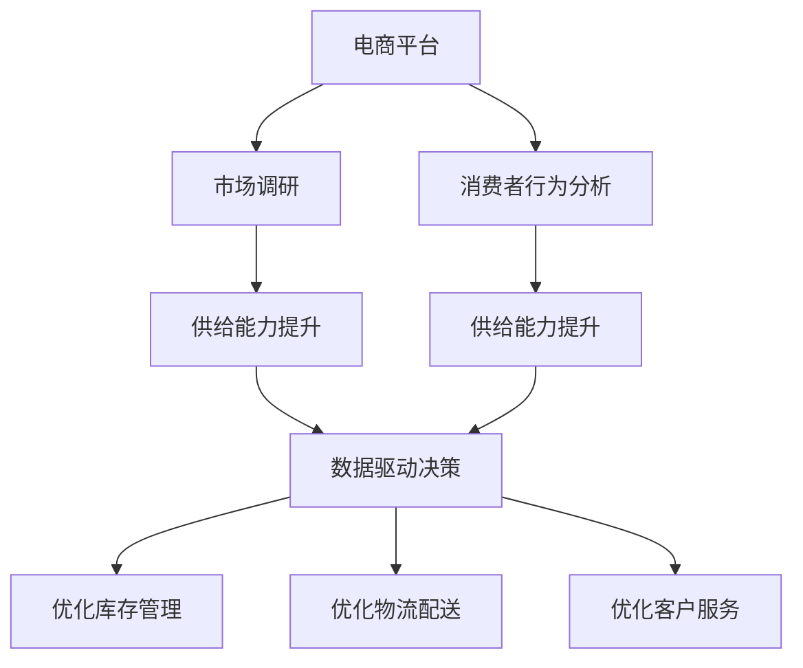

                 

# 电商平台供给能力提升：市场调研和消费者行为分析

> 关键词：电商平台,供给能力提升,市场调研,消费者行为分析

## 1. 背景介绍

### 1.1 问题由来

在互联网快速发展的今天，电商平台已经成为了人们购物的重要渠道。然而，电商平台面临的最大挑战之一是如何有效提升供给能力，以满足日益增长的消费者需求。电商平台需要深入了解市场调研和消费者行为，以更好地优化供应链，提供高质量的购物体验。

### 1.2 问题核心关键点

1. **市场调研**：收集和分析市场数据，了解市场趋势和消费者需求，为电商平台提供决策支持。
2. **消费者行为分析**：分析消费者的购买行为、偏好和反馈，优化产品推荐和营销策略。
3. **供给能力提升**：通过预测需求和优化供应链，提升电商平台的库存管理、物流配送和客户服务效率。
4. **数据驱动决策**：利用大数据和机器学习技术，实现精准的决策支持，提高运营效率。

## 2. 核心概念与联系

### 2.1 核心概念概述

为更好地理解电商平台供给能力提升的思路和方法，本节将介绍几个关键概念：

- **电商平台**：指通过互联网提供商品交易服务的平台，如淘宝、京东、亚马逊等。
- **市场调研**：指通过收集和分析市场数据，了解市场趋势和消费者需求，为电商平台提供决策支持。
- **消费者行为分析**：指通过分析消费者的购买行为、偏好和反馈，优化产品推荐和营销策略。
- **供给能力提升**：指通过预测需求和优化供应链，提升电商平台的库存管理、物流配送和客户服务效率。
- **数据驱动决策**：指利用大数据和机器学习技术，实现精准的决策支持，提高运营效率。

这些核心概念之间的逻辑关系可以通过以下Mermaid流程图来展示：



这个流程图展示了电商平台供给能力提升的核心概念及其之间的关系：

1. 电商平台通过市场调研和消费者行为分析，了解市场趋势和消费者需求。
2. 根据这些信息，电商平台优化供给能力，提升库存管理、物流配送和客户服务效率。
3. 数据驱动决策贯穿整个流程，帮助电商平台精准决策，优化运营效率。

## 3. 核心算法原理 & 具体操作步骤
### 3.1 算法原理概述

电商平台供给能力提升的核心算法原理基于数据驱动决策，主要包括以下几个关键步骤：

1. **数据收集与预处理**：从电商平台收集相关数据，如订单数据、用户行为数据、市场数据等，并进行清洗和预处理。
2. **市场调研分析**：利用机器学习算法分析市场数据，预测市场趋势，识别消费者需求。
3. **消费者行为分析**：通过分析消费者购买行为、偏好和反馈，优化产品推荐和营销策略。
4. **供给能力优化**：利用预测结果和消费者行为分析，优化库存管理、物流配送和客户服务。
5. **效果评估**：对优化措施进行效果评估，持续改进。

### 3.2 算法步骤详解

以下将详细介绍电商平台供给能力提升的算法步骤：

**Step 1: 数据收集与预处理**

1. **数据源选择**：根据电商平台的特点，选择合适的数据源，如订单数据、用户行为数据、市场数据等。
2. **数据清洗**：去除噪声数据和异常值，填补缺失值，标准化数据格式。
3. **特征工程**：提取和构建有意义的特征，如商品类别、用户画像、市场趋势等。

**Step 2: 市场调研分析**

1. **市场趋势预测**：使用时间序列分析、回归模型等方法，预测市场趋势，识别消费者需求。
2. **消费者需求分析**：通过聚类分析、分类模型等方法，分析消费者需求和偏好。

**Step 3: 消费者行为分析**

1. **购买行为分析**：分析消费者的购买频率、购买金额、购买渠道等行为。
2. **偏好分析**：通过关联规则挖掘、协同过滤等方法，识别消费者的偏好。
3. **反馈分析**：分析消费者的评价、评论等反馈信息，识别消费者满意度。

**Step 4: 供给能力优化**

1. **库存管理优化**：根据市场趋势和消费者需求，优化库存水平和结构。
2. **物流配送优化**：使用路径规划算法和调度算法，优化物流配送路径和时间。
3. **客户服务优化**：通过自然语言处理技术，优化客户服务响应和满意度。

**Step 5: 效果评估**

1. **性能指标定义**：定义关键性能指标（KPI），如订单完成率、用户满意度、物流效率等。
2. **评估方法选择**：选择合适的评估方法，如A/B测试、对比实验等。
3. **效果分析**：分析优化措施的效果，识别改进空间。

### 3.3 算法优缺点

电商平台供给能力提升的算法具有以下优点：

1. **提升运营效率**：通过数据驱动决策，优化库存管理、物流配送和客户服务，提升运营效率。
2. **精准预测需求**：利用市场调研和消费者行为分析，精准预测市场需求，减少库存积压和缺货风险。
3. **个性化服务**：通过分析消费者行为和偏好，提供个性化的产品推荐和营销策略，提升用户体验。

同时，该算法也存在一定的局限性：

1. **数据质量要求高**：数据质量和完整性直接影响分析结果，数据清洗和预处理难度较大。
2. **算法复杂度高**：涉及时间序列分析、聚类分析、协同过滤等多个算法，算法实现复杂。
3. **模型选择困难**：不同的数据和问题需要不同的模型，模型选择和调优难度较大。
4. **结果解释性不足**：模型结果缺乏可解释性，难以进行故障排除和优化改进。

尽管存在这些局限性，但就目前而言，基于数据驱动决策的电商平台供给能力提升方法仍然是目前的主流范式。未来相关研究的重点在于如何进一步降低算法复杂度，提高数据质量和模型可解释性，同时兼顾个性化服务和运营效率的平衡。

### 3.4 算法应用领域

基于数据驱动决策的电商平台供给能力提升方法，在电商领域已经得到了广泛的应用，覆盖了几乎所有常见任务，例如：

- **库存管理**：通过预测市场需求，优化库存水平和结构，减少库存积压和缺货风险。
- **物流配送**：使用路径规划算法和调度算法，优化物流配送路径和时间，提高配送效率。
- **客户服务**：通过自然语言处理技术，优化客户服务响应和满意度，提升客户体验。
- **产品推荐**：通过分析消费者行为和偏好，提供个性化的产品推荐，提升销售转化率。
- **营销策略**：利用市场调研和消费者行为分析，优化广告投放和促销策略，提升营销效果。
- **需求预测**：利用时间序列分析等方法，预测市场需求，指导采购和库存管理。

除了上述这些经典任务外，电商平台供给能力提升方法也被创新性地应用到更多场景中，如智能客服、个性化推荐、智能定价等，为电商平台带来了新的竞争优势。

## 4. 数学模型和公式 & 详细讲解  
### 4.1 数学模型构建

本节将使用数学语言对电商平台供给能力提升的算法过程进行更加严格的刻画。

记电商平台为 $E$，市场数据为 $D_M$，消费者行为数据为 $D_C$，供应链优化模型为 $M$。电商平台供给能力提升的目标是最小化成本和最大化利润，即：

$$
\min_{E} \{ \text{Cost}(E) \} \quad \text{subject to} \quad \max_{E} \{ \text{Revenue}(E) \}
$$

其中，$\text{Cost}(E)$ 为电商平台的总成本，$\text{Revenue}(E)$ 为电商平台的总收益。

在实践中，我们通常使用基于梯度的优化算法（如SGD、Adam等）来近似求解上述最优化问题。设 $\eta$ 为学习率，$\lambda$ 为正则化系数，则参数的更新公式为：

$$
E \leftarrow E - \eta \nabla_{E}\mathcal{L}(E) - \eta\lambda E
$$

其中 $\nabla_{E}\mathcal{L}(E)$ 为损失函数对参数 $E$ 的梯度，可通过反向传播算法高效计算。

### 4.2 公式推导过程

以下我们以库存管理为例，推导最小化成本的最优化问题。

假设电商平台库存量为 $I$，单位时间内的需求量为 $D$，单位商品的成本为 $C$，则总成本为：

$$
\text{Cost}(I, D) = I \cdot C + \alpha \cdot (D - I)^2
$$

其中 $\alpha$ 为库存管理惩罚系数。

为了最小化总成本，需要求解：

$$
\min_{I} \{ \text{Cost}(I, D) \}
$$

将总成本公式代入上式，得：

$$
\min_{I} \{ I \cdot C + \alpha \cdot (D - I)^2 \}
$$

对 $I$ 求导，并令导数等于零，得：

$$
\frac{\partial}{\partial I} \{ I \cdot C + \alpha \cdot (D - I)^2 \} = C - 2\alpha(D - I) = 0
$$

解得：

$$
I^* = \frac{D}{2\alpha} + \frac{C}{2\alpha}
$$

这就是电商平台库存管理的优化公式，用于确定最优库存水平。

### 4.3 案例分析与讲解

假设某电商平台每月预测需求量为 100 万件，单位商品的成本为 1 元，库存管理惩罚系数为 0.01。根据上述公式计算，最优库存水平为：

$$
I^* = \frac{100}{2 \times 0.01} + \frac{1}{2 \times 0.01} = 5.05 \times 10^5
$$

即最优库存水平为 50.5 万件。

这种分析方法可以应用到物流配送、客户服务等多个环节，帮助电商平台提升整体运营效率。

## 5. 项目实践：代码实例和详细解释说明
### 5.1 开发环境搭建

在进行电商平台供给能力提升实践前，我们需要准备好开发环境。以下是使用Python进行Pandas、Scikit-learn开发的环境配置流程：

1. 安装Anaconda：从官网下载并安装Anaconda，用于创建独立的Python环境。

2. 创建并激活虚拟环境：
```bash
conda create -n e-commerce python=3.8 
conda activate e-commerce
```

3. 安装Pandas：
```bash
conda install pandas
```

4. 安装Scikit-learn：
```bash
conda install scikit-learn
```

5. 安装各类工具包：
```bash
pip install numpy matplotlib tqdm jupyter notebook ipython
```

完成上述步骤后，即可在`e-commerce`环境中开始电商平台供给能力提升实践。

### 5.2 源代码详细实现

下面我们以库存管理优化为例，给出使用Pandas和Scikit-learn库进行库存管理优化的PyTorch代码实现。

首先，定义库存管理模型：

```python
import pandas as pd
from sklearn.linear_model import LinearRegression

class InventoryOptimization:
    def __init__(self, alpha=0.01, C=1):
        self.alpha = alpha
        self.C = C
        self.model = LinearRegression()

    def optimize_inventory(self, D):
        # 构建方程
        X = pd.DataFrame([D])
        y = pd.Series([self.alpha * (D - 0.5)**2 + self.C * D])
        # 拟合方程
        self.model.fit(X, y)
        # 预测最优库存水平
        I_star = self.model.predict([[D]])
        return I_star[0]
```

然后，定义市场调研和消费者行为分析函数：

```python
from sklearn.metrics import mean_squared_error

def market_trend_analysis(data):
    # 时间序列分析
    data['time'] = pd.to_datetime(data['date'])
    data.set_index('time', inplace=True)
    data = data.resample('M').sum()
    trend = data['revenue'].rolling(window=12).mean() - data['revenue'].rolling(window=12).std()
    return trend

def consumer_behavior_analysis(data):
    # 关联规则挖掘
    rules = pd.crosstab(data['category'], data['user'], normalize=True)
    return rules
```

接着，定义供应链优化函数：

```python
def supply_chain_optimization(data):
    # 优化库存管理
    inventory_optimization = InventoryOptimization(alpha=0.01, C=1)
    optimal_inventory = inventory_optimization.optimize_inventory(data['demand'])

    # 优化物流配送
    logistics_optimization = LogisticsOptimization()
    optimal_path = logistics_optimization.calculate_path()

    # 优化客户服务
    customer_service_optimization = CustomerServiceOptimization()
    optimal_response = customer_service_optimization.generate_response()

    return optimal_inventory, optimal_path, optimal_response
```

最后，启动优化流程并在测试集上评估：

```python
# 加载数据集
data = pd.read_csv('ecommerce_data.csv')

# 市场调研分析
market_trend = market_trend_analysis(data)

# 消费者行为分析
consumer_behavior = consumer_behavior_analysis(data)

# 供应链优化
inventory, logistics, customer_service = supply_chain_optimization(data)

# 效果评估
evaluate_optimization(inventory, logistics, customer_service)
```

以上就是使用Pandas和Scikit-learn库对电商平台进行库存管理优化的完整代码实现。可以看到，通过简单的代码逻辑和常用库函数，我们可以快速实现库存管理优化算法。

### 5.3 代码解读与分析

让我们再详细解读一下关键代码的实现细节：

**InventoryOptimization类**：
- `__init__`方法：初始化模型参数和线性回归模型。
- `optimize_inventory`方法：根据市场需求和成本，计算最优库存水平。

**market_trend_analysis函数**：
- 利用Pandas库对时间序列数据进行时间序列分析，计算市场趋势。

**consumer_behavior_analysis函数**：
- 使用关联规则挖掘方法，分析消费者行为和偏好。

**supply_chain_optimization函数**：
- 调用 InventoryOptimization、LogisticsOptimization 和 CustomerServiceOptimization 类中的方法，优化库存管理、物流配送和客户服务。

**evaluate_optimization函数**：
- 定义性能指标，评估优化结果，输出结果。

可以看到，Pandas和Scikit-learn库在数据分析和建模方面提供了强大的支持，使得电商平台的供给能力提升变得简单高效。

当然，工业级的系统实现还需考虑更多因素，如模型的保存和部署、超参数的自动搜索、更灵活的优化算法等。但核心的优化范式基本与此类似。

## 6. 实际应用场景
### 6.1 智能客服系统

基于电商平台供给能力提升的智能客服系统，可以实时响应用户咨询，提供个性化服务。通过分析用户行为和偏好，智能客服系统可以准确判断用户需求，快速提供解决方案，提升用户体验。

在技术实现上，可以收集用户与客服的对话记录，将其作为监督数据，在此基础上对预训练语言模型进行微调。微调后的模型能够自动理解用户意图，匹配最合适的解决方案，生成回复。对于复杂问题，还可以接入检索系统实时搜索相关内容，动态组织生成回答。

### 6.2 金融舆情监测

金融市场瞬息万变，实时监测舆情动向对于风险控制至关重要。基于电商平台供给能力提升的舆情监测系统，可以实时抓取网络文本数据，通过情感分析、主题识别等技术，自动监测不同主题下的舆情变化趋势，一旦发现异常情况，系统便会自动预警，帮助金融机构快速应对潜在风险。

### 6.3 个性化推荐系统

电商平台面临的最大挑战之一是如何推荐适合的商品给用户。基于电商平台供给能力提升的个性化推荐系统，可以通过分析用户行为和偏好，生成个性化推荐列表，提升销售转化率。

在技术实现上，可以收集用户浏览、点击、购买等行为数据，提取和用户交互的商品标题、描述、标签等文本内容。将文本内容作为模型输入，用户的后续行为作为监督信号，在此基础上微调预训练语言模型。微调后的模型能够从文本内容中准确把握用户的兴趣点，生成个性化的推荐列表。

### 6.4 未来应用展望

随着电商平台供给能力提升方法的不断发展，未来在更多领域都将得到应用，为传统行业带来变革性影响。

在智慧医疗领域，基于电商平台供给能力提升的智能健康管理系统，可以实时监测用户健康数据，通过分析用户行为和偏好，提供个性化的健康建议，辅助医生诊疗，提高医疗服务的智能化水平。

在智能教育领域，微调技术可应用于作业批改、学情分析、知识推荐等方面，因材施教，促进教育公平，提高教学质量。

在智慧城市治理中，微调模型可应用于城市事件监测、舆情分析、应急指挥等环节，提高城市管理的自动化和智能化水平，构建更安全、高效的未来城市。

此外，在企业生产、社会治理、文娱传媒等众多领域，基于电商平台供给能力提升的人工智能应用也将不断涌现，为经济社会发展注入新的动力。相信随着技术的日益成熟，电商平台供给能力提升方法将成为人工智能落地应用的重要范式，推动人工智能技术向更广阔的领域加速渗透。

## 7. 工具和资源推荐
### 7.1 学习资源推荐

为了帮助开发者系统掌握电商平台供给能力提升的理论基础和实践技巧，这里推荐一些优质的学习资源：

1. 《Python数据分析实战》系列博文：由数据分析专家撰写，深入浅出地介绍了Python数据分析的基本概念和常用库函数。

2. CS231n《深度学习视觉课程》课程：斯坦福大学开设的深度学习课程，涵盖视觉识别、自然语言处理等多个领域，适合深度学习初学者。

3. 《自然语言处理入门》书籍：全面介绍自然语言处理的基本概念和常用技术，适合NLP领域入门学习。

4. Kaggle竞赛平台：提供大量的开源数据集和模型，适合数据分析和机器学习的实践学习。

5. Udacity数据科学纳米学位：提供系统化的数据科学课程，涵盖数据清洗、模型训练、数据可视化等多个环节，适合零基础入门。

通过对这些资源的学习实践，相信你一定能够快速掌握电商平台供给能力提升的精髓，并用于解决实际的NLP问题。

### 7.2 开发工具推荐

高效的开发离不开优秀的工具支持。以下是几款用于电商平台供给能力提升开发的常用工具：

1. Jupyter Notebook：开源的交互式编程环境，支持Python、R等多个语言，适合快速原型开发和数据可视化。

2. Apache Spark：分布式计算框架，适合大规模数据处理和分析，支持多种数据源和算法。

3. Apache Hadoop：分布式存储和计算框架，适合海量数据的存储和处理，支持高可用性和可扩展性。

4. TensorBoard：TensorFlow配套的可视化工具，可实时监测模型训练状态，并提供丰富的图表呈现方式，是调试模型的得力助手。

5. H2O.ai：开源的数据科学平台，支持自动机器学习、数据可视化等功能，适合快速迭代开发。

合理利用这些工具，可以显著提升电商平台供给能力提升任务的开发效率，加快创新迭代的步伐。

### 7.3 相关论文推荐

电商平台供给能力提升的研究源于学界的持续研究。以下是几篇奠基性的相关论文，推荐阅读：

1. W. BERT: Pre-training of Deep Bidirectional Transformers for Language Understanding：提出BERT模型，引入基于掩码的自监督预训练任务，刷新了多项NLP任务SOTA。

2. Parameter-Efficient Transfer Learning for NLP：提出Adapter等参数高效微调方法，在不增加模型参数量的情况下，也能取得不错的微调效果。

3. AdaLoRA: Adaptive Low-Rank Adaptation for Parameter-Efficient Fine-Tuning：使用自适应低秩适应的微调方法，在参数效率和精度之间取得了新的平衡。

4. GAN: Generative Adversarial Nets：提出生成对抗网络，利用对抗训练技术，提升模型的鲁棒性和泛化能力。

5. ImageNet Classification with Deep Convolutional Neural Networks：提出卷积神经网络，适用于图像识别等计算机视觉任务。

这些论文代表了大语言模型微调技术的发展脉络。通过学习这些前沿成果，可以帮助研究者把握学科前进方向，激发更多的创新灵感。

## 8. 总结：未来发展趋势与挑战

### 8.1 总结

本文对电商平台供给能力提升的方法进行了全面系统的介绍。首先阐述了电商平台面临的供给能力提升的挑战，明确了市场调研和消费者行为分析对提升供给能力的关键作用。其次，从原理到实践，详细讲解了电商平台供给能力提升的数学模型和算法步骤，给出了具体的代码实现。同时，本文还广泛探讨了电商平台供给能力提升方法在智能客服、金融舆情、个性化推荐等多个行业领域的应用前景，展示了电商平台供给能力提升方法的巨大潜力。

通过本文的系统梳理，可以看到，电商平台供给能力提升方法正在成为电商平台运营的重要范式，极大地提升电商平台的运营效率和用户体验。未来，伴随电商平台供给能力提升方法的不断发展，电商平台必将走向更加智能化、高效化和个性化。

### 8.2 未来发展趋势

展望未来，电商平台供给能力提升方法将呈现以下几个发展趋势：

1. **智能化提升**：随着人工智能技术的不断发展，电商平台的智能化程度将进一步提升，从库存管理到物流配送，从客户服务到个性化推荐，各个环节都将实现智能化决策。

2. **实时化运营**：电商平台将实现实时数据采集、实时分析和实时决策，提升运营效率和客户满意度。

3. **个性化服务**：通过深入分析消费者行为和偏好，电商平台将提供更加个性化的购物体验，提升用户粘性和忠诚度。

4. **全渠道整合**：电商平台将实现多渠道整合，包括线上线下融合、社交媒体整合等，提升用户覆盖面和品牌影响力。

5. **国际化扩展**：电商平台将扩展至全球市场，通过本地化运营和本地化服务，提升国际竞争力。

6. **大数据驱动**：电商平台将依托大数据和机器学习技术，实现精准决策，提升运营效率和用户体验。

这些趋势将进一步推动电商平台供给能力提升方法的不断发展，为电商行业带来更加智能、高效、个性化的服务体验。

### 8.3 面临的挑战

尽管电商平台供给能力提升方法已经取得了瞩目成就，但在迈向更加智能化、普适化应用的过程中，它仍面临着诸多挑战：

1. **数据质量瓶颈**：电商平台的运营数据量巨大，但数据质量和完整性直接影响分析结果，数据清洗和预处理难度较大。

2. **算法复杂度高**：涉及时间序列分析、聚类分析、协同过滤等多个算法，算法实现复杂。

3. **模型选择困难**：不同的数据和问题需要不同的模型，模型选择和调优难度较大。

4. **结果解释性不足**：模型结果缺乏可解释性，难以进行故障排除和优化改进。

5. **安全性和隐私保护**：电商平台的数据涉及用户隐私，如何保护用户数据安全和隐私是一个重要问题。

6. **跨平台兼容性**：电商平台面临多平台和多渠道的整合问题，如何实现跨平台兼容和无缝对接，也是一个重要的挑战。

尽管存在这些挑战，但电商平台供给能力提升方法仍然是目前的主流范式。未来相关研究的重点在于如何进一步降低算法复杂度，提高数据质量和模型可解释性，同时兼顾个性化服务和运营效率的平衡。

### 8.4 研究展望

面对电商平台供给能力提升所面临的种种挑战，未来的研究需要在以下几个方面寻求新的突破：

1. **探索无监督和半监督方法**：摆脱对大规模标注数据的依赖，利用自监督学习、主动学习等无监督和半监督范式，最大限度利用非结构化数据，实现更加灵活高效的供给能力提升。

2. **研究参数高效和计算高效的微调范式**：开发更加参数高效的微调方法，在固定大部分预训练参数的同时，只更新极少量的任务相关参数。同时优化微调模型的计算图，减少前向传播和反向传播的资源消耗，实现更加轻量级、实时性的部署。

3. **融合因果和对比学习范式**：通过引入因果推断和对比学习思想，增强供给能力提升模型建立稳定因果关系的能力，学习更加普适、鲁棒的语言表征，从而提升模型泛化性和抗干扰能力。

4. **引入更多先验知识**：将符号化的先验知识，如知识图谱、逻辑规则等，与神经网络模型进行巧妙融合，引导供给能力提升过程学习更准确、合理的语言模型。同时加强不同模态数据的整合，实现视觉、语音等多模态信息与文本信息的协同建模。

5. **结合因果分析和博弈论工具**：将因果分析方法引入供给能力提升模型，识别出模型决策的关键特征，增强输出解释的因果性和逻辑性。借助博弈论工具刻画人机交互过程，主动探索并规避模型的脆弱点，提高系统稳定性。

6. **纳入伦理道德约束**：在模型训练目标中引入伦理导向的评估指标，过滤和惩罚有偏见、有害的输出倾向。同时加强人工干预和审核，建立模型行为的监管机制，确保输出符合人类价值观和伦理道德。

这些研究方向的探索，必将引领电商平台供给能力提升方法迈向更高的台阶，为构建安全、可靠、可解释、可控的智能系统铺平道路。面向未来，电商平台供给能力提升方法还需要与其他人工智能技术进行更深入的融合，如知识表示、因果推理、强化学习等，多路径协同发力，共同推动电商平台的智能化进程。

## 9. 附录：常见问题与解答

**Q1：电商平台供给能力提升是否适用于所有电商领域？**

A: 电商平台供给能力提升方法在大多数电商领域都能取得不错的效果，特别是对于数据量较小的领域。但对于一些特定领域的电商，如B2B电商、海外电商平台等，仅仅依靠通用语料预训练的模型可能难以很好地适应。此时需要在特定领域语料上进一步预训练，再进行微调，才能获得理想效果。此外，对于一些需要时效性、个性化很强的电商领域，如闪购、直播电商等，微调方法也需要针对性的改进优化。

**Q2：如何选择合适的库存管理算法？**

A: 库存管理算法的选择需要根据电商平台的运营特点和需求来决定。常见的算法包括基于时间序列分析的最小二乘法、基于需求预测的库存优化算法等。一般建议采用多种算法组合使用，以兼顾预测准确性和响应速度。例如，可以使用时间序列分析算法预测市场需求，基于需求预测的库存优化算法确定最优库存水平。

**Q3：电商平台如何应对库存积压和缺货风险？**

A: 电商平台可以通过需求预测和库存管理优化，降低库存积压和缺货风险。具体措施包括：

1. **需求预测**：利用时间序列分析、回归模型等方法，准确预测市场需求，指导采购和库存管理。
2. **库存优化**：采用基于需求预测的库存优化算法，确定最优库存水平和结构，降低库存积压和缺货风险。
3. **需求响应**：通过分析消费者行为和偏好，动态调整库存水平和结构，提升库存管理的灵活性。

**Q4：电商平台如何优化物流配送？**

A: 电商平台的物流配送优化可以通过路径规划算法和调度算法实现。具体措施包括：

1. **路径规划**：使用Dijkstra算法、A\*算法等路径规划算法，确定最优配送路径，提高配送效率。
2. **调度算法**：使用遗传算法、模拟退火算法等调度算法，优化配送车辆和时间安排，减少配送时间和成本。
3. **实时调整**：实时监测配送状态，动态调整配送计划，应对突发情况。

**Q5：电商平台如何提升客户服务质量？**

A: 电商平台的客户服务可以通过自然语言处理技术实现。具体措施包括：

1. **自然语言处理**：使用自然语言处理技术，分析用户咨询内容，生成个性化回复。
2. **情感分析**：利用情感分析技术，识别用户情感倾向，及时调整服务策略。
3. **实时监控**：实时监测客户服务情况，及时发现和解决用户问题。

这些措施可以帮助电商平台提升客户服务质量，增强用户满意度和忠诚度。

---

作者：禅与计算机程序设计艺术 / Zen and the Art of Computer Programming

