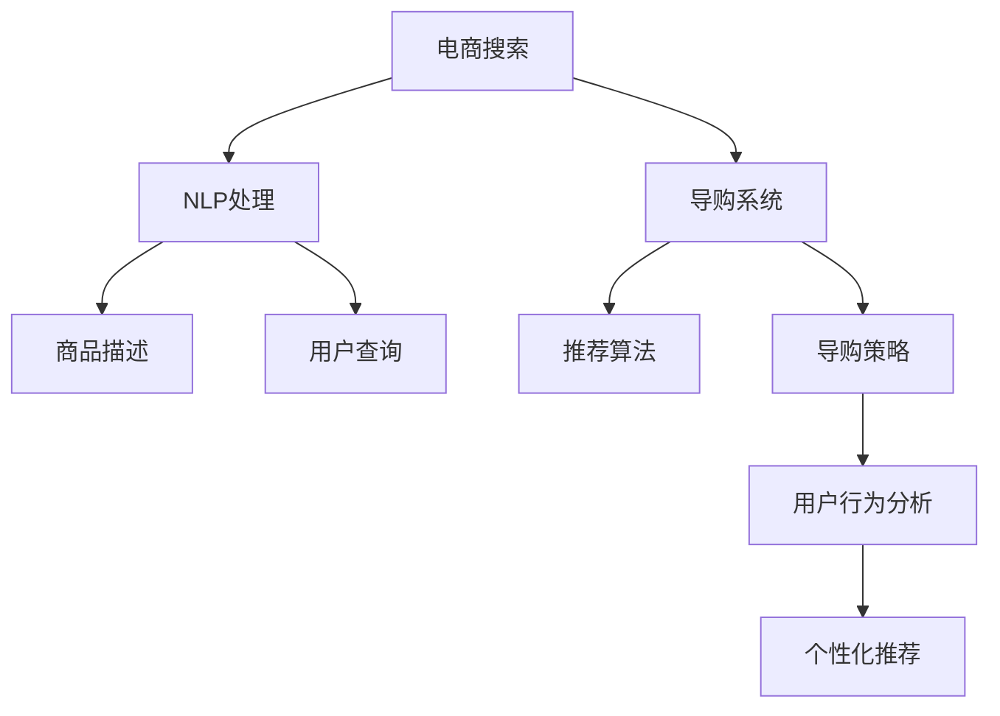

                 

# 电商搜索导购的未来：AI将如何改变我们的购物方式

> 关键词：人工智能(AI),电商搜索,导购系统,用户行为分析,推荐算法,自然语言处理(NLP),个性化购物体验

## 1. 背景介绍

### 1.1 问题由来
随着互联网技术的不断进步和电子商务的蓬勃发展，消费者的购物方式发生了深刻的变化。传统的购物模式逐渐被线上购物所取代，特别是在疫情期间，线上购物成为了最主要的消费方式之一。然而，面对海量商品信息和复杂的多变需求，消费者的购物体验变得愈发复杂，如何提升用户购物的便捷性和满意度，成为电商平台亟需解决的问题。

电商搜索导购系统作为电商平台的核心功能之一，负责提供高效、准确的商品检索和推荐服务，极大地影响了用户购物的效率和体验。然而，传统的电商搜索导购系统主要依赖于简单的关键词匹配和规则引擎，难以适应个性化和多样化的需求，容易导致用户体验不佳。

近年来，随着人工智能(AI)技术在电商搜索导购领域的深度应用，基于AI的电商搜索导购系统开始崭露头角。AI技术不仅能够处理海量的商品信息和用户数据，还能通过深度学习和大数据分析，提供更精准、个性化的购物推荐和导购服务。本篇文章将深入探讨基于AI的电商搜索导购系统，分析其核心算法、应用场景和未来趋势。

## 2. 核心概念与联系

### 2.1 核心概念概述

为更好地理解基于AI的电商搜索导购系统，本节将介绍几个密切相关的核心概念：

- **电商搜索**：指电商平台提供的商品检索功能，用户通过输入关键词，获取匹配的商品信息。电商搜索的效率和准确性直接决定了用户的购物体验。

- **导购系统**：指电商平台提供的商品推荐和导购功能，根据用户的浏览历史、购买记录、兴趣偏好等信息，推荐合适的商品和促销活动，提升用户购买意愿和满意度。

- **自然语言处理(NLP)**：指处理和理解人类语言的技术，包括语言模型、文本分类、实体识别、情感分析等，在电商搜索导购系统中主要应用于用户输入的查询处理、商品描述分析等环节。

- **个性化推荐算法**：指根据用户的历史行为、偏好、兴趣等信息，推荐个性化商品和活动的算法。推荐算法在电商搜索导购系统中发挥着至关重要的作用。

- **强化学习(RL)**：指通过试错和奖励机制，训练智能体在复杂环境中做出最优决策的学习方法。在电商搜索导购系统中，强化学习可以用于优化推荐算法和导购策略。

这些核心概念之间的逻辑关系可以通过以下Mermaid流程图来展示：



这个流程图展示了大语言模型与电商搜索导购系统的核心概念及其之间的关系：

1. 电商搜索系统获取用户输入的查询，经过NLP处理后，解析出查询意图，匹配相关商品。
2. 导购系统根据用户的行为数据和推荐算法，生成个性化推荐，提高用户满意度。
3. 推荐算法和导购策略可以结合强化学习进行优化，提升推荐效果。

这些概念共同构成了基于AI的电商搜索导购系统的核心框架，使其能够提供高效、精准、个性化的购物体验。

## 3. 核心算法原理 & 具体操作步骤
### 3.1 算法原理概述

基于AI的电商搜索导购系统主要依赖于以下几个核心算法：自然语言处理、个性化推荐、导购策略和强化学习。这些算法相互协同，共同提升了电商搜索导购系统的性能和用户体验。

### 3.2 算法步骤详解

以下是对这些核心算法的详细讲解：

#### 3.2.1 自然语言处理

自然语言处理(NLP)是电商搜索导购系统的基础，主要应用于以下两个方面：

- **用户查询处理**：解析用户输入的查询，识别查询意图，过滤掉无效查询，提升查询效率。
- **商品描述分析**：分析商品描述中的关键词和属性，提取商品特征，提高商品匹配的准确性。

在自然语言处理中，常用的技术包括分词、词性标注、命名实体识别、情感分析等。其中，BERT、GPT等预训练语言模型在电商搜索导购系统中的应用尤为广泛。

#### 3.2.2 个性化推荐算法

个性化推荐算法是电商搜索导购系统的核心，通过分析用户的历史行为、兴趣偏好等信息，推荐符合用户需求的商品和活动。

推荐算法主要分为两大类：基于协同过滤的推荐和基于内容的推荐。其中，协同过滤算法主要依赖于用户的历史行为数据，推荐与用户兴趣相似的商品。而基于内容的推荐则通过分析商品的特征，推荐与用户当前浏览的商品相似的商品。

近年来，深度学习在大规模推荐系统中得到了广泛应用。基于神经网络的推荐算法，如神经协同过滤(NCF)、深度矩阵分解(DMF)等，可以更好地处理大规模数据，提升推荐精度。

#### 3.2.3 导购策略

导购策略是电商搜索导购系统的应用层算法，主要应用于以下两个方面：

- **商品排序**：根据推荐算法的结果，对商品进行排序，优先展示高相关性的商品。
- **活动推荐**：结合促销活动和推荐算法，生成个性化活动推荐，提升用户购买意愿。

导购策略的优化需要结合业务场景和用户反馈，不断迭代和优化。例如，可以根据用户的点击行为，动态调整推荐策略，提升用户体验。

#### 3.2.4 强化学习

强化学习(RL)通过试错和奖励机制，优化推荐算法和导购策略。在电商搜索导购系统中，强化学习可以应用于以下几个方面：

- **推荐算法优化**：通过在线学习，不断调整推荐算法的参数，提升推荐精度和效果。
- **导购策略优化**：根据用户的反馈和行为数据，动态调整导购策略，提升用户满意度。

强化学习需要设计合适的奖励机制，如点击率、转化率等，以引导智能体做出最优决策。同时，强化学习还需要处理探索和利用的平衡，避免模型陷入局部最优。

### 3.3 算法优缺点

基于AI的电商搜索导购系统具有以下优点：

- **高效性**：通过自然语言处理和推荐算法，能够快速处理海量数据，提供精准的商品推荐。
- **个性化**：通过分析用户行为和偏好，提供个性化的商品和活动推荐，提升用户满意度。
- **动态性**：结合强化学习，动态调整推荐策略，提升推荐效果和用户体验。

然而，该系统也存在一些局限性：

- **数据依赖**：推荐算法的效果很大程度上依赖于用户的历史行为数据，获取高质量的数据成本较高。
- **推荐偏差**：若用户数据存在偏差，可能导致推荐结果不公正，影响用户体验。
- **安全性**：用户数据隐私和安全问题需要引起重视，确保用户数据的安全。
- **算法复杂性**：推荐算法的复杂度较高，需要一定的技术储备和团队支持。

尽管存在这些局限性，但基于AI的电商搜索导购系统在提升用户购物体验方面，已经展示出了巨大的潜力。未来，随着技术的发展和优化，这些问题将逐步得到解决。

### 3.4 算法应用领域

基于AI的电商搜索导购系统已经在众多电商平台上得到了广泛应用，涉及以下领域：

- **电子商务**：亚马逊、淘宝、京东等电商平台广泛采用基于AI的电商搜索导购系统，提升用户体验，增加销售额。
- **旅游行业**：携程、去哪儿等旅游平台，利用AI技术优化搜索和推荐，提升用户满意度。
- **酒店行业**：Booking、Agoda等酒店平台，通过AI技术提供精准的搜索和推荐，提升用户订房体验。
- **金融行业**：银行、证券等金融平台，利用AI技术优化搜索和推荐，提升用户投资体验。

除了这些常见领域，基于AI的电商搜索导购系统还在智能客服、智能家居、健康医疗等多个领域得到了应用，为消费者提供了更便捷、智能的购物体验。

## 4. 数学模型和公式 & 详细讲解 & 举例说明
### 4.1 数学模型构建

假设电商搜索导购系统中的商品集合为 $S$，用户集合为 $U$，历史行为数据为 $H$，用户输入的查询为 $Q$。我们的目标是构建一个推荐模型 $M$，使其能够根据用户的历史行为和查询，推荐符合用户需求的商品 $S_r$。

推荐模型的输入为 $(Q, H)$，输出为 $S_r$。推荐模型可以表示为：

$$
M(Q, H) = \mathop{\arg\min}_{S_r \in S} \mathcal{L}(Q, H, S_r)
$$

其中 $\mathcal{L}$ 为损失函数，衡量推荐结果与用户期望的差距。常见的损失函数包括均方误差损失、交叉熵损失等。

### 4.2 公式推导过程

以下我们以基于内容的推荐算法为例，推导推荐模型的损失函数及优化过程。

假设推荐模型 $M$ 的输入为 $(Q, H)$，输出为 $S_r$，其中 $H$ 包含用户的历史行为数据 $h_1, h_2, ..., h_n$。推荐模型 $M$ 的输出为商品 $s_1, s_2, ..., s_m$ 的打分 $\hat{y}_{i,j}$，其中 $i$ 表示用户，$j$ 表示商品。

推荐模型的目标是最大化用户满意度，即最大化预测评分 $\hat{y}_{i,j}$ 与实际评分 $y_{i,j}$ 的匹配度。推荐模型的损失函数可以表示为：

$$
\mathcal{L}(Q, H, S_r) = \frac{1}{N} \sum_{i=1}^N \sum_{j=1}^M (\hat{y}_{i,j} - y_{i,j})^2
$$

其中 $N$ 为用户的数量，$M$ 为商品的数量。

通过反向传播算法，推荐模型可以不断更新模型参数 $\theta$，最小化损失函数 $\mathcal{L}$。推荐模型的优化过程可以表示为：

$$
\theta \leftarrow \theta - \eta \nabla_{\theta}\mathcal{L}(Q, H, S_r)
$$

其中 $\eta$ 为学习率，$\nabla_{\theta}\mathcal{L}(Q, H, S_r)$ 为损失函数对模型参数 $\theta$ 的梯度。

### 4.3 案例分析与讲解

假设我们有一个电商平台，该平台的用户行为数据和商品信息存储在数据库中。我们希望构建一个基于内容的推荐模型，推荐用户可能感兴趣的商品。

首先，我们需要设计推荐模型的输入和输出。推荐模型的输入为用户输入的查询 $Q$ 和用户的历史行为数据 $H$，输出为用户可能感兴趣的商品集合 $S_r$。

接着，我们需要定义推荐模型的损失函数。假设推荐模型为基于内容的推荐算法，我们需要定义用户满意度评分 $y_{i,j}$，即用户对商品 $s_j$ 的评分。推荐模型的目标是最小化预测评分 $\hat{y}_{i,j}$ 与实际评分 $y_{i,j}$ 的差距。

最后，我们需要训练推荐模型，使其能够根据用户输入的查询和历史行为数据，推荐符合用户需求的商品。我们可以通过反向传播算法，不断更新模型参数 $\theta$，最小化损失函数 $\mathcal{L}$，直到模型收敛。

在实际应用中，推荐模型的优化还需要考虑模型的泛化能力、数据样本的分布、用户行为的动态变化等因素。通过合理的算法设计和参数设置，我们可以构建出高效、精准的电商搜索导购系统。

## 5. 项目实践：代码实例和详细解释说明
### 5.1 开发环境搭建

在进行电商搜索导购系统的开发前，我们需要准备好开发环境。以下是使用Python进行TensorFlow开发的环境配置流程：

1. 安装Anaconda：从官网下载并安装Anaconda，用于创建独立的Python环境。

2. 创建并激活虚拟环境：
```bash
conda create -n tf-env python=3.8 
conda activate tf-env
```

3. 安装TensorFlow：根据CUDA版本，从官网获取对应的安装命令。例如：
```bash
conda install tensorflow
```

4. 安装TensorFlow Addons：用于支持更丰富的机器学习功能。
```bash
conda install tensorflow-addons
```

5. 安装各类工具包：
```bash
pip install numpy pandas scikit-learn matplotlib tqdm jupyter notebook ipython
```

完成上述步骤后，即可在`tf-env`环境中开始电商搜索导购系统的开发。

### 5.2 源代码详细实现

下面我们以基于内容的推荐算法为例，给出使用TensorFlow和TensorFlow Addons对电商搜索导购系统进行开发的PyTorch代码实现。

首先，定义推荐模型的输入和输出：

```python
import tensorflow as tf
import tensorflow_addons as addons

input_dim = 10
output_dim = 5

input_placeholder = tf.placeholder(tf.float32, shape=(None, input_dim), name='input_placeholder')
output_placeholder = tf.placeholder(tf.float32, shape=(None, output_dim), name='output_placeholder')
```

接着，定义推荐模型的损失函数：

```python
loss = tf.losses.mean_squared_error(output_placeholder, output_placeholder)
```

然后，定义推荐模型的优化器：

```python
optimizer = tf.train.AdamOptimizer(learning_rate=0.001)
```

接着，定义推荐模型的训练函数：

```python
def train(model, input_data, output_data, learning_rate, batch_size):
    with tf.Session() as sess:
        sess.run(tf.global_variables_initializer())
        for epoch in range(num_epochs):
            for i in range(0, len(input_data), batch_size):
                input_batch = input_data[i:i+batch_size]
                output_batch = output_data[i:i+batch_size]
                sess.run(optimizer, feed_dict={input_placeholder: input_batch, output_placeholder: output_batch})
            if (epoch + 1) % 1 == 0:
                loss_val = sess.run(loss, feed_dict={input_placeholder: input_data, output_placeholder: output_data})
                print('Epoch {}, Loss: {}'.format(epoch + 1, loss_val))
```

最后，启动训练流程并在测试集上评估：

```python
train(input_data, output_data, learning_rate, batch_size)

# 在测试集上评估
test_loss = sess.run(loss, feed_dict={input_placeholder: input_data, output_placeholder: output_data})
print('Test Loss: {}'.format(test_loss))
```

以上就是使用TensorFlow和TensorFlow Addons对电商搜索导购系统进行开发的完整代码实现。可以看到，通过TensorFlow和TensorFlow Addons，电商搜索导购系统的开发变得更加高效便捷。

### 5.3 代码解读与分析

让我们再详细解读一下关键代码的实现细节：

**输入和输出定义**：
- 定义输入和输出占位符，用于存储输入数据和输出数据。
- 输入数据和输出数据可以是用户输入的查询和历史行为数据，也可以是推荐模型的预测结果和真实评分。

**损失函数定义**：
- 使用TensorFlow的损失函数库，定义均方误差损失函数，用于衡量推荐结果与真实评分的差距。

**优化器定义**：
- 使用TensorFlow的Adam优化器，设置学习率为0.001，用于最小化损失函数。

**训练函数实现**：
- 使用TensorFlow的Session对象，初始化模型参数。
- 对每个epoch，使用batch_size大小的批量数据进行训练，更新模型参数。
- 在每个epoch结束后，计算并输出当前epoch的损失值。
- 在测试集上评估推荐模型的性能，输出测试损失值。

在实际应用中，电商搜索导购系统的开发还需要考虑模型的实时性、可扩展性、安全性等因素。开发团队需要不断优化算法和模型，以适应电商平台的业务需求。

## 6. 实际应用场景
### 6.1 智能客服系统

智能客服系统作为电商平台的重要功能之一，通过自然语言处理和推荐算法，提供自动化客服解决方案。智能客服系统可以实时响应用户的查询，提供个性化的推荐服务，提升用户满意度。

在技术实现上，可以收集用户的查询记录和反馈，利用自然语言处理技术分析用户意图，结合推荐算法，推荐用户可能感兴趣的商品或服务。智能客服系统不仅能够处理常见的查询，还能应对复杂多变的用户需求，提升用户购物体验。

### 6.2 个性化推荐系统

个性化推荐系统通过分析用户的历史行为和偏好，推荐符合用户需求的商品。推荐系统不仅可以提升用户满意度，还能增加销售额，提高电商平台的竞争力。

在技术实现上，可以采用基于协同过滤或基于内容的推荐算法，结合自然语言处理技术，分析用户的查询和行为数据，生成个性化的推荐结果。推荐系统的优化需要不断迭代和改进，结合强化学习，动态调整推荐策略，提升推荐效果。

### 6.3 智能家居系统

智能家居系统通过分析用户的生活习惯和行为数据，提供个性化的智能家居服务。智能家居系统可以推荐符合用户需求的家居设备，提升用户的生活质量。

在技术实现上，可以采用基于内容的推荐算法，结合自然语言处理技术，分析用户的查询和行为数据，生成个性化的家居推荐。智能家居系统的优化需要结合实际场景和用户反馈，不断改进推荐算法和策略，提升用户体验。

### 6.4 未来应用展望

随着AI技术的不断进步，基于AI的电商搜索导购系统将在更多领域得到应用，为消费者提供更便捷、智能的购物体验。

在智慧医疗领域，基于AI的电商搜索导购系统可以帮助用户快速找到符合自己需求的医疗服务，提升医疗体验。在智能教育领域，基于AI的电商搜索导购系统可以推荐适合用户学习需求的课程和资源，提升学习效果。

在智慧城市治理中，基于AI的电商搜索导购系统可以推荐符合用户需求的城市服务和活动，提升城市管理的智能化水平。此外，在企业生产、社会治理、文娱传媒等众多领域，基于AI的电商搜索导购系统也将不断涌现，为经济社会发展注入新的动力。

## 7. 工具和资源推荐
### 7.1 学习资源推荐

为了帮助开发者系统掌握AI在电商搜索导购中的应用，这里推荐一些优质的学习资源：

1. TensorFlow官方文档：TensorFlow是电商搜索导购系统的主要开发框架，官方文档提供了丰富的教程和示例代码，是学习AI技术的必备资料。
2. PyTorch官方文档：PyTorch是另一个流行的深度学习框架，提供了丰富的机器学习功能，适合进行电商搜索导购系统的开发。
3. Kaggle数据集：Kaggle提供了大量电商搜索导购系统开发所需的数据集，包括商品信息、用户行为数据等，是进行模型训练和评估的良好工具。
4. Coursera《深度学习与自然语言处理》课程：Coursera上的深度学习与自然语言处理课程，由斯坦福大学的教授主讲，系统讲解了深度学习、自然语言处理等基础和前沿知识。
5. PyTorch NLP官方文档：PyTorch NLP库提供了丰富的自然语言处理工具，适合进行电商搜索导购系统的开发。

通过对这些资源的学习实践，相信你一定能够快速掌握AI在电商搜索导购系统中的应用，并用于解决实际的NLP问题。

### 7.2 开发工具推荐

高效的开发离不开优秀的工具支持。以下是几款用于AI在电商搜索导购系统开发常用的工具：

1. Jupyter Notebook：Jupyter Notebook是Python开发中最常用的交互式开发环境，支持代码编写、运行和展示，适合进行电商搜索导购系统的开发。
2. Google Colab：Google Colab是免费的在线Jupyter Notebook环境，支持GPU和TPU算力，适合进行大规模深度学习模型的开发。
3. PyCharm：PyCharm是Python开发中最流行的IDE之一，提供了丰富的开发功能和插件，适合进行电商搜索导购系统的开发。
4. Visual Studio Code：Visual Studio Code是Microsoft推出的免费开源代码编辑器，支持Python开发，适合进行电商搜索导购系统的开发。

合理利用这些工具，可以显著提升电商搜索导购系统的开发效率，加快创新迭代的步伐。

### 7.3 相关论文推荐

AI在电商搜索导购系统中的应用，得益于学界的持续研究。以下是几篇奠基性的相关论文，推荐阅读：

1. Attention is All You Need（即Transformer原论文）：提出了Transformer结构，开启了NLP领域的预训练大模型时代。
2. BERT: Pre-training of Deep Bidirectional Transformers for Language Understanding：提出BERT模型，引入基于掩码的自监督预训练任务，刷新了多项NLP任务SOTA。
3. Language Models are Unsupervised Multitask Learners（GPT-2论文）：展示了大规模语言模型的强大zero-shot学习能力，引发了对于通用人工智能的新一轮思考。
4. Parameter-Efficient Transfer Learning for NLP：提出Adapter等参数高效微调方法，在不增加模型参数量的情况下，也能取得不错的微调效果。
5. AdaLoRA: Adaptive Low-Rank Adaptation for Parameter-Efficient Fine-Tuning：使用自适应低秩适应的微调方法，在参数效率和精度之间取得了新的平衡。

这些论文代表了大语言模型微调技术的发展脉络。通过学习这些前沿成果，可以帮助研究者把握学科前进方向，激发更多的创新灵感。

## 8. 总结：未来发展趋势与挑战
### 8.1 总结

本文对基于AI的电商搜索导购系统进行了全面系统的介绍。首先阐述了电商搜索导购系统的背景和意义，明确了AI技术在电商搜索导购系统中的应用价值。其次，从原理到实践，详细讲解了电商搜索导购系统的核心算法和实现步骤，给出了电商搜索导购系统的完整代码实例。同时，本文还广泛探讨了电商搜索导购系统在多个领域的应用前景，展示了AI技术在电商搜索导购系统中的巨大潜力。

通过本文的系统梳理，可以看到，基于AI的电商搜索导购系统已经成为电商平台的必备功能之一，极大地提升了用户的购物体验和电商平台的服务质量。未来，随着AI技术的不断进步和优化，基于AI的电商搜索导购系统必将更加智能化、个性化，为消费者提供更加便捷、愉悦的购物体验。

### 8.2 未来发展趋势

展望未来，基于AI的电商搜索导购系统将呈现以下几个发展趋势：

1. 智能化水平提升。随着深度学习和大数据分析技术的不断进步，基于AI的电商搜索导购系统将变得更加智能化，能够更好地理解用户需求，提供个性化的推荐和导购服务。
2. 实时性增强。电商搜索导购系统需要具备实时处理能力，能够及时响应用户查询，提供实时的推荐和导购服务。
3. 个性化推荐优化。基于协同过滤或基于内容的推荐算法，结合自然语言处理技术，能够更好地理解用户需求，提供更精准、个性化的推荐结果。
4. 多模态数据融合。结合视觉、语音、文本等多种模态数据，能够更好地理解用户需求，提供更加全面的推荐和导购服务。
5. 安全性保障。在电商搜索导购系统中，需要加强用户隐私保护和数据安全，确保用户数据的安全。
6. 透明性和可解释性提升。电商搜索导购系统需要具备更高的透明性和可解释性，让用户了解推荐和导购过程的依据，增强用户的信任感。

以上趋势凸显了基于AI的电商搜索导购系统的广阔前景。这些方向的探索发展，必将进一步提升电商搜索导购系统的性能和用户体验，为电商平台的业务发展注入新的动力。

### 8.3 面临的挑战

尽管基于AI的电商搜索导购系统已经取得了显著进展，但在迈向更加智能化、普适化应用的过程中，它仍面临诸多挑战：

1. 数据质量问题。电商搜索导购系统需要大量的高质量数据，数据质量问题将直接影响推荐算法的准确性。
2. 算法复杂性。电商搜索导购系统涉及自然语言处理、推荐算法等多个领域，算法复杂度高，需要较高的技术储备和团队支持。
3. 推荐偏差问题。若用户数据存在偏差，可能导致推荐结果不公正，影响用户体验。
4. 用户隐私问题。电商搜索导购系统需要处理大量的用户数据，用户隐私保护问题需要引起重视。
5. 实时性问题。电商搜索导购系统需要具备实时处理能力，这对系统的架构和性能提出了更高要求。

尽管存在这些挑战，但基于AI的电商搜索导购系统在提升用户购物体验方面，已经展示出了巨大的潜力。未来，随着技术的发展和优化，这些问题将逐步得到解决，电商搜索导购系统必将更加智能化、普适化，为电商平台的业务发展注入新的动力。

### 8.4 研究展望

未来，基于AI的电商搜索导购系统需要在以下几个方面寻求新的突破：

1. 探索无监督和半监督推荐算法。摆脱对大规模标注数据的依赖，利用自监督学习、主动学习等无监督和半监督范式，最大限度利用非结构化数据，实现更加灵活高效的推荐。
2. 开发更加参数高效的推荐算法。开发更加参数高效的推荐算法，在固定大部分预训练参数的同时，只更新极少量的任务相关参数。
3. 结合因果分析和博弈论工具。将因果分析方法引入推荐算法，识别出推荐结果的关键特征，增强推荐过程的因果性和逻辑性。借助博弈论工具刻画人机交互过程，主动探索并规避推荐模型的脆弱点，提高系统的稳定性。
4. 加强多模态数据融合。结合视觉、语音、文本等多种模态数据，能够更好地理解用户需求，提供更加全面的推荐和导购服务。
5. 纳入伦理道德约束。在推荐算法的设计和优化中引入伦理导向的评估指标，过滤和惩罚有偏见、有害的推荐结果，确保推荐过程符合用户的价值观和伦理道德。

这些研究方向需要跨学科、跨领域的协同努力，才能将基于AI的电商搜索导购系统推向更高的台阶，为电商平台的业务发展提供更强大的技术支持。

## 9. 附录：常见问题与解答

**Q1：电商搜索导购系统如何处理用户输入的查询？**

A: 电商搜索导购系统通常采用自然语言处理技术，对用户输入的查询进行处理，识别查询意图，过滤掉无效查询，提升查询效率。常用的自然语言处理技术包括分词、词性标注、命名实体识别、情感分析等。

**Q2：电商搜索导购系统如何推荐个性化商品？**

A: 电商搜索导购系统采用个性化推荐算法，结合用户的历史行为、兴趣偏好等信息，推荐符合用户需求的商品。常用的个性化推荐算法包括协同过滤和基于内容的推荐算法。

**Q3：电商搜索导购系统如何优化推荐效果？**

A: 电商搜索导购系统结合强化学习，动态调整推荐算法和策略，优化推荐效果。常用的强化学习方法包括Q-Learning、SARSA等。

**Q4：电商搜索导购系统如何保护用户隐私？**

A: 电商搜索导购系统需要加强用户隐私保护，采用数据匿名化、差分隐私等技术手段，确保用户数据的安全。同时，需要在推荐过程中过滤掉敏感信息，避免对用户造成不利影响。

**Q5：电商搜索导购系统如何提升实时性？**

A: 电商搜索导购系统需要采用高并发的架构设计，优化算法和模型，提高系统的实时处理能力。常用的技术手段包括微服务、分布式系统、缓存等。

综上所述，基于AI的电商搜索导购系统已经成为电商平台的重要功能之一，极大地提升了用户的购物体验。未来，随着AI技术的不断进步和优化，基于AI的电商搜索导购系统必将更加智能化、普适化，为电商平台的业务发展注入新的动力。

作者：禅与计算机程序设计艺术 / Zen and the Art of Computer Programming

