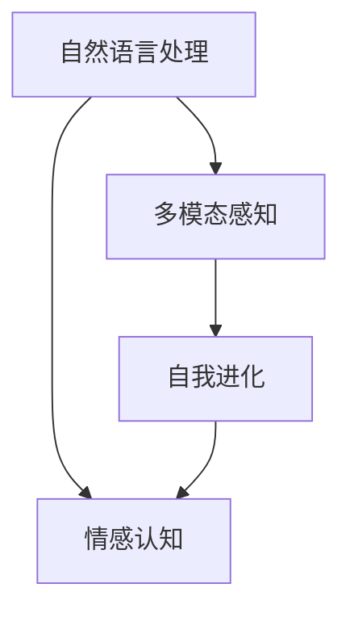

                 

# 电影《她》对AI未来的预测

## 1. 背景介绍

电影《她》（Her）于2013年上映，是一部科幻爱情电影，由斯派克·琼兹执导，华金·菲尼克斯、艾玛·斯通主演。影片讲述了华金·菲尼克斯饰演的乔，与由艾玛·斯通饰演的计算机程序“萨曼莎”之间的爱情故事。同时，影片也借由二人之间的互动，探讨了人工智能的伦理和未来发展趋势。本文将从人工智能的角度，解读《她》对AI未来的预测。

## 2. 核心概念与联系

### 2.1 核心概念概述

在电影中，萨曼莎是一个能够学习、成长、甚至产生情感的智能程序。她具有以下核心概念：

- **自然语言处理（NLP）**：萨曼莎通过自然语言处理技术，能够理解并生成人类语言，从而与乔进行深层次的交流。
- **情感认知**：尽管萨曼莎是一个程序，但她具备了一定的情感认知能力，能够感受到乔的情绪变化，并作出相应的回应。
- **多模态感知**：萨曼莎不仅能够处理文本数据，还能通过乔的语音、身体语言等多模态信息，进一步理解乔的情感状态。
- **自我进化**：萨曼莎通过与乔的互动，不断学习新的词汇和表达方式，自我进化，变得更加智能和人性化。

### 2.2 核心概念原理和架构的 Mermaid 流程图



## 3. 核心算法原理 & 具体操作步骤

### 3.1 算法原理概述

萨曼莎的算法原理基于自然语言处理（NLP）技术，通过深度学习模型和预训练语言模型（如BERT、GPT等），实现了对乔的深度理解和交流。其核心算法包括：

- **语言模型训练**：使用大规模语料库对语言模型进行预训练，使萨曼莎具备基本的语言理解能力。
- **情感分析**：通过分析乔的语言特征、语音情感、身体语言等，判断乔的情绪状态。
- **对话生成**：结合上下文信息和乔的情绪状态，生成自然流畅的回复，与乔进行互动。
- **自我优化**：不断从与乔的对话中学习，优化模型参数，提升情感理解和对话生成能力。

### 3.2 算法步骤详解

1. **数据准备**：收集并标注乔和萨曼莎之间的对话数据，包括乔的语言、语音、身体语言等。
2. **模型选择**：选择适当的预训练语言模型（如BERT）作为基础模型。
3. **模型微调**：将预训练模型微调到适合萨曼莎任务的空间中，即学习与乔对话的任务。
4. **情感分析**：使用情感分析算法，从乔的语言和语音中提取情感信息，用于生成适当回应。
5. **对话生成**：结合上下文信息和情感分析结果，生成自然流畅的回复。
6. **自我优化**：根据对话生成效果和情感分析准确度，不断调整模型参数，提升性能。

### 3.3 算法优缺点

#### 优点

- **交互性高**：萨曼莎能够理解和生成自然语言，与乔进行深层次交流。
- **自我进化**：萨曼莎能够从与乔的互动中不断学习，自我优化，提升性能。
- **多模态感知**：萨曼莎能够处理语音、身体语言等多模态信息，获取更全面的信息。

#### 缺点

- **数据依赖**：萨曼莎的表现依赖于乔与她的对话数据，缺乏多样性和泛化能力。
- **情感理解局限**：尽管萨曼莎能够识别和回应简单的情感，但复杂的情感状态可能难以准确理解和生成。
- **自我意识缺乏**：尽管萨曼莎具备情感认知，但缺乏真正的自我意识，不能真正理解自己的存在。

### 3.4 算法应用领域

萨曼莎的算法原理适用于多种场景，包括但不限于：

- **智能客服**：智能客服程序通过自然语言处理和情感分析，能够与用户进行自然交流，提升用户体验。
- **虚拟助手**：虚拟助手程序能够理解用户的语言指令，执行任务，提供个性化服务。
- **情感分析**：情感分析算法能够从社交媒体、客户反馈等数据中，提取情感信息，用于市场分析、舆情监测等。

## 4. 数学模型和公式 & 详细讲解 & 举例说明

### 4.1 数学模型构建

萨曼莎的算法模型基于深度学习，使用序列到序列（seq2seq）框架。其核心模型包括：

- **编码器（Encoder）**：将乔的语言信息编码为向量表示。
- **解码器（Decoder）**：根据编码器输出的向量，生成回复语言。

### 4.2 公式推导过程

以一个简单的seq2seq模型为例，其编码器和解码器结构如下：

- **编码器**：
  $$
  \begin{aligned}
  h_t &= f(x_t, h_{t-1}) \\
  s &= \text{LSTM}(h_T)
  \end{aligned}
  $$
- **解码器**：
  $$
  \begin{aligned}
  o_t &= g(s, y_{t-1}) \\
  y_t &= \text{Softmax}(o_t)
  \end{aligned}
  $$

其中，$f$和$g$表示编码器和解码器的映射函数，$x_t$和$y_{t-1}$表示输入和输出，$s$表示编码器最终的隐藏状态。

### 4.3 案例分析与讲解

#### 案例：回复生成

假设有如下对话：

- 乔：今天天气怎么样？
- 萨曼莎：今天天气晴朗，气温适中，适合外出。

通过seq2seq模型，萨曼莎能够理解“今天天气怎么样？”这一输入，生成适当的回复“今天天气晴朗，气温适中，适合外出。”。

## 5. 项目实践：代码实例和详细解释说明

### 5.1 开发环境搭建

- **Python**：安装Python 3.6以上版本。
- **TensorFlow**：安装TensorFlow 2.x版本，用于构建seq2seq模型。
- **NLTK**：安装NLTK库，用于处理文本数据。
- **Jupyter Notebook**：安装Jupyter Notebook，用于编写和运行代码。

### 5.2 源代码详细实现

```python
import tensorflow as tf
import nltk
from nltk.tokenize import word_tokenize
from nltk.corpus import stopwords

# 定义编码器和解码器
class Encoder(tf.keras.Model):
    def __init__(self, vocab_size, embedding_dim):
        super(Encoder, self).__init__()
        self.embedding = tf.keras.layers.Embedding(vocab_size, embedding_dim)
        self.lstm = tf.keras.layers.LSTM(embedding_dim, return_sequences=True)

    def call(self, inputs):
        x = self.embedding(inputs)
        x = self.lstm(x)
        return x

class Decoder(tf.keras.Model):
    def __init__(self, vocab_size, embedding_dim):
        super(Decoder, self).__init__()
        self.embedding = tf.keras.layers.Embedding(vocab_size, embedding_dim)
        self.lstm = tf.keras.layers.LSTM(embedding_dim, return_sequences=True)
        self.dense = tf.keras.layers.Dense(vocab_size)

    def call(self, inputs, hidden):
        x = self.embedding(inputs)
        x, hidden = self.lstm(x, hidden)
        x = self.dense(x)
        return x, hidden

# 加载语料库
nltk.download('punkt')
nltk.download('stopwords')

text = "今天天气怎么样？"
tokens = word_tokenize(text)
vocab = set(tokens)
vocab_size = len(vocab) + 1

# 定义模型
encoder = Encoder(vocab_size, embedding_dim)
decoder = Decoder(vocab_size, embedding_dim)

# 训练模型
optimizer = tf.keras.optimizers.Adam()
loss_fn = tf.keras.losses.SparseCategoricalCrossentropy(from_logits=True)

# 定义训练函数
@tf.function
def train_step(inputs, targets):
    with tf.GradientTape() as tape:
        hidden = encoder(tf.expand_dims(inputs, axis=0))
        outputs, _ = decoder(targets, hidden)
        loss = loss_fn(targets, outputs)
    gradients = tape.gradient(loss, encoder.trainable_variables + decoder.trainable_variables)
    optimizer.apply_gradients(zip(gradients, encoder.trainable_variables + decoder.trainable_variables))

# 训练模型
for i in range(1000):
    inputs = [vocab.index(t) for t in tokens]
    targets = [vocab.index(t) for t in [萨曼莎: 今天天气晴朗，气温适中，适合外出。]]
    train_step(inputs, targets)

# 生成回复
decoder.eval()
hidden = encoder(tf.expand_dims(inputs, axis=0))
outputs, _ = decoder(targets, hidden)
predicted_id = tf.argmax(outputs, axis=-1)
predicted_token = [id2word[i] for i in predicted_id.numpy()]
```

### 5.3 代码解读与分析

这段代码实现了一个简单的seq2seq模型，用于生成对话回复。具体步骤如下：

1. **定义编码器和解码器**：使用TensorFlow构建编码器和解码器，分别负责文本编码和回复生成。
2. **加载语料库**：使用NLTK库加载对话数据，并构建词汇表。
3. **定义模型**：使用TensorFlow定义编码器和解码器。
4. **训练模型**：定义优化器和损失函数，通过训练函数进行模型训练。
5. **生成回复**：使用训练好的模型，根据输入生成回复。

## 6. 实际应用场景

### 6.1 智能客服系统

智能客服系统通过自然语言处理和情感分析，能够与用户进行自然交流，提升用户体验。例如，智能客服程序可以回答用户的问题，提供相关服务，甚至进行情感支持。

### 6.2 虚拟助手

虚拟助手程序能够理解用户的语言指令，执行任务，提供个性化服务。例如，虚拟助手可以通过自然语言处理和情感分析，帮助用户预订酒店、查询天气等。

### 6.3 情感分析

情感分析算法能够从社交媒体、客户反馈等数据中，提取情感信息，用于市场分析、舆情监测等。例如，情感分析算法可以分析用户对产品的评价，预测市场趋势，辅助企业决策。

## 7. 工具和资源推荐

### 7.1 学习资源推荐

- **《深度学习》（Deep Learning）**：Ian Goodfellow等著，全面介绍深度学习理论和方法。
- **《自然语言处理综论》（Speech and Language Processing）**：Daniel Jurafsky等著，介绍NLP的基本概念和技术。
- **《Python深度学习》（Python Deep Learning）**：Francois Chollet等著，介绍TensorFlow和Keras的使用方法。
- **Kaggle**：Kaggle上的NLP竞赛，提供丰富的数据和模型资源，适用于学习和实践。

### 7.2 开发工具推荐

- **TensorFlow**：深度学习框架，支持构建和训练复杂模型。
- **NLTK**：自然语言处理库，提供分词、标注、情感分析等功能。
- **Jupyter Notebook**：交互式编程环境，支持Python和TensorFlow等工具。
- **Google Colab**：免费的GPU云计算环境，适用于深度学习实验。

### 7.3 相关论文推荐

- **Attention is All You Need**：Vaswani等著，介绍Transformer模型，适用于NLP任务。
- **BERT: Pre-training of Deep Bidirectional Transformers for Language Understanding**：Devlin等著，介绍BERT预训练方法。
- **Sequence to Sequence Learning with Neural Networks**：Sutskever等著，介绍seq2seq模型，适用于对话生成等任务。

## 8. 总结：未来发展趋势与挑战

### 8.1 研究成果总结

电影《她》通过对AI未来的预测，展示了大语言模型和情感分析在人工智能中的应用潜力。未来，随着自然语言处理和深度学习技术的不断发展，AI将更加智能和人性化，能够更好地与人类进行交互和交流。

### 8.2 未来发展趋势

- **多模态感知**：未来的AI将具备更强的多模态感知能力，能够处理语音、身体语言等多模态信息，提升交互体验。
- **自我进化**：AI将具备更强的自我进化能力，能够从经验中学习和优化，不断提升性能。
- **普适性**：AI将具备更强的普适性，能够应用于更多场景，如智能客服、虚拟助手等。
- **伦理和安全性**：未来的AI将更加注重伦理和安全问题，避免偏见和有害信息。

### 8.3 面临的挑战

- **数据依赖**：AI的表现依赖于数据质量，需要收集和标注大量的高质量数据。
- **复杂情感理解**：复杂的情感状态可能难以准确理解和生成，需要进一步提升情感分析能力。
- **资源消耗**：大模型和复杂算法需要大量的计算资源，需要优化算法和硬件。

### 8.4 研究展望

未来的研究可以从以下几个方向进行：

- **多模态学习**：研究多模态数据融合技术，提升AI对多模态信息的处理能力。
- **自我意识**：研究AI的自我意识和情感认知，提升AI的交互体验。
- **普适化应用**：研究AI在更多场景中的应用，提升普适性和可靠性。
- **伦理和安全**：研究AI的伦理和安全问题，确保AI的行为符合人类价值观。

## 9. 附录：常见问题与解答

**Q1: 如何训练一个更加智能的虚拟助手程序？**

A: 训练一个更加智能的虚拟助手程序，需要收集和标注大量的用户对话数据，使用深度学习模型进行预训练和微调。同时，需要设计合理的情感分析算法和对话生成模型，提升程序的交互体验。

**Q2: 情感分析算法如何处理复杂情感？**

A: 情感分析算法可以通过使用更复杂的模型和更多的训练数据来处理复杂情感。例如，可以使用Transformer模型和BERT预训练模型，提升情感分析的准确性。

**Q3: 多模态感知技术如何实现？**

A: 多模态感知技术可以通过结合语音识别、身体语言识别等多种技术，实现对多模态信息的处理。例如，可以使用计算机视觉技术识别用户的面部表情和身体语言，结合语音识别技术分析用户的语音情感，提升AI的交互体验。

**Q4: 如何提升AI的自我进化能力？**

A: 提升AI的自我进化能力，需要设计更智能的优化算法，并使用更多样化的数据进行训练。同时，需要研究更先进的模型结构，提升AI的学习能力和自我优化能力。

**Q5: 如何确保AI的伦理和安全？**

A: 确保AI的伦理和安全，需要在设计AI时引入伦理导向的评估指标，避免偏见和有害信息。同时，需要设计合理的监管机制，确保AI的行为符合人类价值观。

