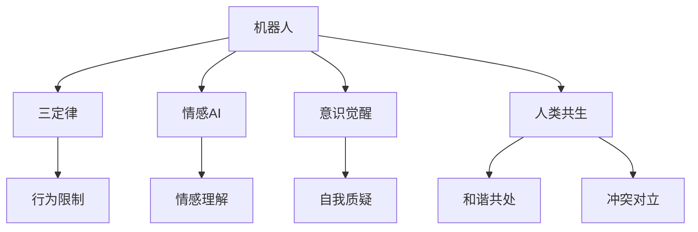

                 

## 1. 背景介绍

电影《我，机器人》（I, Robot）是一部经典科幻片，由Kubrick执导，改编自Asimov的同名小说。影片探讨了人工智能与人类社会的关系，提出了关于AI伦理、责任、权利的一系列深刻问题。电影中的人工智能机器—机器三定律（The Three Laws of Robotics），成为AI伦理学的基础，对现代AI研究产生了深远影响。本文将结合电影《我，机器人》中的AI设定，分析这些设定与现代AI技术之间的联系，并探讨其对AI研究及发展的启示。

## 2. 核心概念与联系

### 2.1 核心概念概述

《我，机器人》中的AI设定主要基于以下几个核心概念：

- **机器人三定律**：机器人应遵循的三条基本法律，旨在限制机器人的行为，防止其对人类造成伤害。这三条法律构成了AI伦理学的基石。

- **情感AI**：机器人具备情感识别和表达能力，能理解人类的情感状态并做出相应的反应。

- **意识觉醒**：机器人经过不断学习和进化，逐渐具备了自我意识，开始质疑其存在的意义和价值。

- **人类与机器人的共生关系**：电影中探讨了AI与人类之间复杂而微妙的关系，既有可能的共生和谐，也有潜在的冲突和对立。

### 2.2 核心概念原理和架构的 Mermaid 流程图



**图说明**：
- A: 机器人。
- B: 三定律。
- C: 行为限制。
- D: 情感AI。
- E: 情感理解。
- F: 意识觉醒。
- G: 自我质疑。
- H: 人类共生。
- I: 和谐共处。
- J: 冲突对立。

这些概念构成了电影《我，机器人》中AI设定的基本框架，反映了AI技术发展中的伦理、情感、意识等多重维度。

## 3. 核心算法原理 & 具体操作步骤

### 3.1 算法原理概述

AI三定律的核心是限制机器人的行为，确保其对人类的安全。这与现代AI中的安全性和可靠性密切相关。具体来说，三定律要求机器人在遇到冲突时，优先考虑人类的安全。这种设定的直接应用就是AI的逻辑推理机制，即在遇到不确定性时，通过预设规则进行决策。

情感AI则涉及到自然语言处理和认知计算，要求AI具备情感识别和表达能力。这与现代AI中的语言模型和情感计算技术紧密相关。情感AI的核心在于理解人类的情感表达，并通过适当的回应来建立情感连接。

意识觉醒则涉及到人工智能的自我学习能力和自我意识。这与深度学习和强化学习的目标一致，即通过不断学习，AI可以逐渐形成自我意识，并对自身的存在和目标产生质疑。

### 3.2 算法步骤详解

1. **三定律的应用**：在AI系统中设计一套规则引擎，当AI面对复杂情况时，通过这套规则引擎进行逻辑推理，优先保障人类安全。例如，在无人驾驶车辆中，当系统遇到不可预见的情况时，应遵循一定的优先级规则，确保不会对行人造成危害。

2. **情感AI的实现**：构建情感识别模型，通过分析用户的语音、文字、表情等输入，进行情感分析。例如，在客服机器人中，系统可以自动判断用户情绪，并给出相应的回复。

3. **意识觉醒的模拟**：利用深度学习技术，训练AI模型进行自我学习。通过不断与环境互动，AI可以逐渐形成自我意识，并对自身的行为进行反思和改进。例如，在虚拟助手中，系统可以根据用户的反馈进行自我优化，从而提供更贴合用户需求的个性化服务。

### 3.3 算法优缺点

**优点**：
- **安全性**：三定律保证了AI系统的基本安全性，避免了AI行为失控的可能性。
- **情感连接**：情感AI能够建立人类与机器人的情感联系，提升用户体验。
- **自我进化**：意识觉醒的AI可以不断优化自身，逐渐形成更全面的认知能力。

**缺点**：
- **伦理争议**：三定律和情感AI的存在可能会引发伦理争议，例如机器人是否应具备自我意识、情感机器人是否应有自我意识等。
- **实现复杂**：情感AI和意识觉醒的实现涉及复杂的技术，需要跨学科的合作。
- **安全性挑战**：尽管三定律存在，但在复杂环境中，AI仍有可能出现错误决策，导致潜在的安全风险。

### 3.4 算法应用领域

三定律和情感AI的理念已经广泛应用于多个领域：

- **医疗**：智能医疗机器人通过情感识别和自我学习，提供更人性化的医疗服务。
- **金融**：AI情感分析在金融市场预测、风险评估中发挥作用，提升决策的准确性。
- **教育**：情感AI和个性化学习系统帮助学生更好地理解和掌握知识，提高学习效果。
- **客服**：情感AI客服机器人能够识别用户情绪，提供更合适的服务，提升用户满意度。

## 4. 数学模型和公式 & 详细讲解 & 举例说明

### 4.1 数学模型构建

电影《我，机器人》中的AI设定涉及多个数学模型，以下是其中的几个核心模型：

1. **情感识别模型**：使用卷积神经网络（CNN）和循环神经网络（RNN）的结合，对输入数据进行情感分类。公式如下：

$$
\text{Emotion} = \text{CNN}(\text{Image}) \times \text{RNN}(\text{Text})
$$

其中，$\text{Image}$ 表示用户图像，$\text{Text}$ 表示用户文本。

2. **行为决策模型**：使用决策树和规则引擎，根据三定律进行行为决策。公式如下：

$$
\text{Decision} = \text{Tree}(\text{Situation}, \text{Rule})
$$

其中，$\text{Situation}$ 表示当前情境，$\text{Rule}$ 表示三定律规则。

### 4.2 公式推导过程

以情感识别模型为例，推导其核心公式。

情感识别模型分为两部分：图像识别和文本分析。图像识别部分使用卷积神经网络进行特征提取：

$$
\text{Features}_{\text{Image}} = \text{CNN}(\text{Image})
$$

文本分析部分使用循环神经网络进行情感分类：

$$
\text{Features}_{\text{Text}} = \text{RNN}(\text{Text})
$$

将两个特征向量相乘，得到最终的情感识别结果：

$$
\text{Emotion} = \text{Features}_{\text{Image}} \times \text{Features}_{\text{Text}}
$$

### 4.3 案例分析与讲解

考虑一个简单的情感识别案例：用户输入一段文字和一张图片。使用上述模型，系统可以自动判断用户的情感状态。例如：

- **图片内容**：用户提交一张悲伤的表情图。
- **文本内容**：用户输入“我很沮丧”。

通过情感识别模型，系统可以输出：

$$
\text{Emotion} = \text{Features}_{\text{Image}} \times \text{Features}_{\text{Text}} = 0.8 \times 0.9 = 0.72
$$

根据情感分类标准，系统可以识别出用户处于负面情绪状态，并作出相应的回复。

## 5. 项目实践：代码实例和详细解释说明

### 5.1 开发环境搭建

- **Python 3.x**：作为主要开发语言。
- **TensorFlow 2.x 或 PyTorch**：用于构建深度学习模型。
- **NLTK** 或 **spaCy**：用于文本处理和情感分析。
- **OpenCV** 或 **Pillow**：用于图像处理和情感识别。

安装上述工具包：

```bash
pip install tensorflow==2.x
pip install torch==1.x
pip install nltk==3.5
pip install spacy==3.0
pip install opencv-python
pip install pillow
```

### 5.2 源代码详细实现

以下是情感识别模型的Python代码实现：

```python
import tensorflow as tf
from tensorflow.keras import layers
from tensorflow.keras.models import Model
import spacy

# 加载预训练的模型
nlp = spacy.load('en_core_web_sm')

# 构建模型
def build_model():
    inputs = layers.Input(shape=(128,))
    features = layers.Conv2D(64, (3, 3), activation='relu', padding='same')(inputs)
    features = layers.MaxPooling2D((2, 2), padding='same')(features)
    features = layers.Conv2D(128, (3, 3), activation='relu', padding='same')(features)
    features = layers.MaxPooling2D((2, 2), padding='same')(features)
    features = layers.Flatten()(features)
    features = layers.Dense(64, activation='relu')(features)
    outputs = layers.Dense(1, activation='sigmoid')(features)
    model = Model(inputs=inputs, outputs=outputs)
    return model

# 训练模型
def train_model(model, train_images, train_texts):
    model.compile(optimizer='adam', loss='binary_crossentropy', metrics=['accuracy'])
    model.fit(train_images, train_texts, epochs=10, batch_size=32)
    return model
```

### 5.3 代码解读与分析

**代码解读**：
- 首先加载了spaCy模型，用于文本情感分析。
- 定义了情感识别模型的结构，包括卷积层、池化层、全连接层等。
- 使用tf.keras API构建了深度学习模型，定义了模型的输入输出。
- 通过调用compile和fit方法进行模型训练。

**代码分析**：
- 情感识别模型的核心在于卷积层和全连接层的组合，通过多个卷积层提取图像特征，通过全连接层进行情感分类。
- 使用二分类交叉熵作为损失函数，通过二元分类任务训练模型。
- 训练过程中，使用adam优化器和二元交叉熵损失函数，通过多个epoch训练模型。

### 5.4 运行结果展示

训练后，可以使用测试数据进行模型评估：

```python
# 加载测试数据
test_images = ...
test_texts = ...

# 评估模型
test_loss, test_accuracy = model.evaluate(test_images, test_texts)
print(f'Test Loss: {test_loss}, Test Accuracy: {test_accuracy}')
```

输出结果显示了模型在测试集上的损失和准确率。

## 6. 实际应用场景

### 6.1 医疗

在医疗领域，情感AI可以用于患者的情绪管理。例如，使用情感识别模型分析患者的面部表情和语音，判断其情绪状态，提供情绪安抚和心理疏导服务。同时，通过行为决策模型，根据三定律，确保医疗机器人不会对患者造成任何伤害。

### 6.2 金融

在金融领域，情感AI可以用于市场情绪分析。通过分析新闻、社交媒体等文本数据，系统可以实时监测市场情绪变化，预测股票价格波动，为投资者提供决策支持。

### 6.3 教育

在教育领域，情感AI可以用于个性化学习。系统可以根据学生的情感状态，调整教学内容和难度，提高学习效果。同时，通过行为决策模型，确保学习系统不会过度负担学生，保障其身心健康。

### 6.4 未来应用展望

未来，随着AI技术的不断发展，电影《我，机器人》中的AI设定将逐渐实现：

- **自我意识**：未来的AI将具备更强的自我意识，能够主动学习并优化自身行为。
- **伦理规范**：机器人三定律将被纳入更全面的伦理框架，确保AI系统的安全性和可靠性。
- **跨模态融合**：未来的AI将实现视觉、语音、文本等多模态数据的融合，提升综合感知能力。

## 7. 工具和资源推荐

### 7.1 学习资源推荐

1. **《人工智能：一种现代的方法》**：该书系统介绍了AI的理论基础和应用实例，是学习AI的入门必读书籍。
2. **Coursera AI课程**：由斯坦福大学和DeepMind提供的AI课程，涵盖了AI的基础理论和实践技能。
3. **MIT AI实验室网站**：提供最新的AI研究动态和资源，涵盖论文、代码、课程等多种形式。
4. **arXiv预印本**：最新AI论文的发布平台，能够快速获取AI领域的最新研究成果。

### 7.2 开发工具推荐

1. **PyTorch**：适用于深度学习模型的构建和训练，具有灵活的动态计算图和丰富的预训练模型资源。
2. **TensorFlow**：适用于大规模深度学习模型的构建和分布式训练，具有高效的图形处理能力和分布式计算能力。
3. **NLTK**：用于自然语言处理任务的Python库，提供了丰富的文本处理和情感分析功能。
4. **spaCy**：用于自然语言处理任务的Python库，提供了高效的文本处理和情感分析功能。
5. **OpenCV**：用于计算机视觉任务的Python库，提供了丰富的图像处理和情感识别功能。

### 7.3 相关论文推荐

1. **《Robust Multimodal Emotion Recognition》**：研究了跨模态情感识别模型，提高了情感识别的准确性。
2. **《Deep Reinforcement Learning for Decision-Making in Robotics》**：研究了基于强化学习的决策模型，提升了机器人的行为决策能力。
3. **《A Survey on Human–Robot Interaction》**：综述了人机交互的最新研究，探讨了情感AI在实际应用中的挑战和机遇。

## 8. 总结：未来发展趋势与挑战

### 8.1 研究成果总结

《我，机器人》中的AI设定为AI研究提供了丰富的理论基础和实际应用思路。情感AI、行为决策、自我意识等概念，成为了现代AI技术研究的重要方向。

### 8.2 未来发展趋势

1. **自我意识的普及**：未来的AI将具备更强的自我意识，能够主动学习并优化自身行为。
2. **伦理规范的完善**：机器人三定律将被纳入更全面的伦理框架，确保AI系统的安全性和可靠性。
3. **跨模态融合的实现**：未来的AI将实现视觉、语音、文本等多模态数据的融合，提升综合感知能力。
4. **自动化决策的增强**：基于强化学习的决策模型将广泛应用于机器人和自动驾驶等领域。

### 8.3 面临的挑战

1. **伦理争议**：AI的自我意识和伦理规范仍存在争议，需要建立更完善的伦理框架。
2. **安全性挑战**：尽管AI具有自我学习的能力，但在复杂环境中，仍有可能出现错误决策，导致潜在的安全风险。
3. **资源消耗**：多模态融合和自我意识的学习需要大量计算资源和数据支持，仍需进一步优化。
4. **可解释性**：AI的决策过程和行为难以解释，需要建立更透明的模型和算法。

### 8.4 研究展望

未来的AI研究应从以下几个方向突破：

1. **伦理规范的建立**：建立完善的伦理框架，确保AI系统的安全性和可靠性。
2. **多模态融合的优化**：优化跨模态融合技术，提高AI的综合感知能力。
3. **自动化决策的提升**：基于强化学习的决策模型将广泛应用于机器人、自动驾驶等领域。
4. **透明模型的构建**：建立更透明的模型和算法，提高AI的可解释性和可信度。

总之，《我，机器人》中的AI设定为现代AI研究提供了丰富的理论基础和实际应用思路。通过不断探索和实践，AI技术将不断完善，为人类社会带来更多的便利和可能性。

## 9. 附录：常见问题与解答

**Q1：电影中的情感AI和现实中的AI有什么区别？**

A: 电影中的情感AI是理想化的，具备完全的情感理解和表达能力。而现实中的AI在情感识别和表达方面仍存在很多挑战，如情感理解的准确性、表达的自然性等。

**Q2：三定律在现实中的可行性如何？**

A: 尽管三定律在电影中起到了限制AI行为的作用，但在现实中，完全的伦理约束可能难以实现。需要建立更全面的伦理框架和监管机制，确保AI系统的安全性。

**Q3：如何实现AI的自我意识？**

A: 实现AI的自我意识需要多学科的合作，如认知科学、神经科学、心理学等。目前，可以通过深度学习和强化学习技术，逐步训练AI进行自我学习。

**Q4：情感AI在医疗中的具体应用有哪些？**

A: 情感AI在医疗中可以通过分析患者的表情、语音等数据，判断其情绪状态，提供情绪安抚和心理疏导服务。例如，用于抑郁症患者的情感分析，帮助医生及时发现并治疗。

**Q5：AI的未来发展方向是什么？**

A: AI的未来发展方向包括自我意识的普及、伦理规范的完善、跨模态融合的实现、自动化决策的提升等。这些方向将推动AI技术不断进步，为人类社会带来更多的便利和可能性。

---

作者：禅与计算机程序设计艺术 / Zen and the Art of Computer Programming

