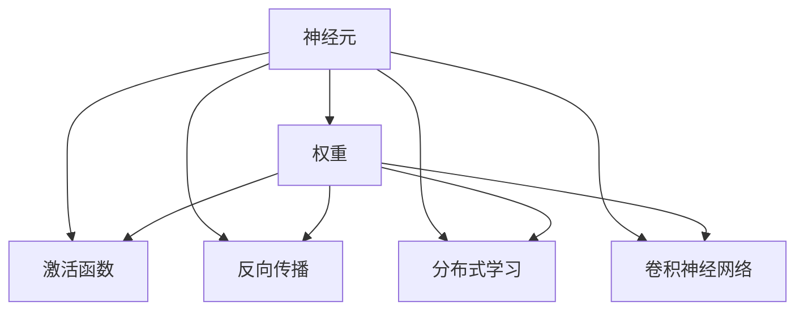

                 

# 皮茨与神经网络的早期发展

## 1. 背景介绍

### 1.1 问题由来

神经网络（Neural Networks, NN）的早期发展历程中，皮茨（Geoffrey Hinton）是一位举足轻重的人物。他在深度学习、神经网络、分布式人工智能等多个领域做出了开创性贡献。Hinton的工作推动了深度学习的演进，并在2020年获得了计算机图灵奖。本文将梳理皮茨与神经网络的早期发展，探索这一领域的历史脉络和技术演进。

### 1.2 问题核心关键点

皮茨与神经网络的早期研究集中在以下几个核心问题上：

1. **神经网络的基础理论**：皮茨提出了一系列有关神经网络的基础理论，包括反向传播算法和误差反向传播算法。这些理论奠定了深度学习的发展基础。
2. **分布式学习**：他开发了玻尔兹曼机（Boltzmann Machines, BMs）和玻尔兹曼神经网络（Boltzmann Neural Networks, BNNs），通过分布式学习的思想，改进了神经网络的训练效率。
3. **深度网络**：皮茨最早提出深度网络的概念，并设计了多层感知器（Multilayer Perceptrons, MLPs），推动了深度学习在图像识别、语音识别等领域的广泛应用。
4. **特征学习**：他开发了卷积神经网络（Convolutional Neural Networks, CNNs）和稀疏自编码器（Sparse Autoencoders），使得神经网络能够自动提取输入数据的高级特征。

这些关键点勾勒出了神经网络早期发展的脉络，也预示了深度学习的广阔前景。

### 1.3 问题研究意义

皮茨与神经网络的早期研究，对于理解深度学习的基础理论和实际应用具有重要意义：

1. **理论奠基**：神经网络的基础理论，如反向传播算法，是深度学习框架的核心。理解这些理论，有助于构建更加高效和灵活的神经网络模型。
2. **算法优化**：分布式学习的思想和深度网络的实践，显著提升了神经网络的训练效率和泛化能力，为实际应用提供了有力支持。
3. **应用拓展**：皮茨开发的神经网络模型，如卷积神经网络、玻尔兹曼神经网络，广泛应用于图像识别、语音识别、自然语言处理等领域，推动了人工智能技术的普及和发展。
4. **跨学科融合**：皮茨的研究跨越了计算机科学、心理学、神经科学等多个学科，为跨学科合作提供了典范，促进了人工智能的全面进步。

## 2. 核心概念与联系

### 2.1 核心概念概述

皮茨与神经网络的早期研究涉及许多核心概念，包括：

- **神经元**：神经网络的基本单位，接受输入并产生输出。
- **权重**：连接神经元之间的参数，控制信号的传递强度。
- **激活函数**：非线性变换函数，用于激活神经元输出。
- **反向传播**：通过误差反向传播，更新权重以最小化损失函数。
- **分布式学习**：通过玻尔兹曼机等模型，改进神经网络的训练过程。
- **卷积神经网络**：应用卷积操作提取输入数据的局部特征。

这些概念共同构成了神经网络的理论基础和实际应用框架。

### 2.2 核心概念原理和架构的 Mermaid 流程图



这个流程图展示了神经网络的核心组件和关键操作。

- 神经元(A)通过权重(B)接收输入，并经激活函数(C)产生输出。
- 反向传播(D)通过误差反向传播更新权重，从而调整模型参数。
- 分布式学习(E)通过玻尔兹曼机等模型改进神经网络训练。
- 卷积神经网络(F)通过卷积操作提取输入数据的局部特征。

## 3. 核心算法原理 & 具体操作步骤

### 3.1 算法原理概述

皮茨与神经网络的早期发展，主要围绕以下几个核心算法和原理展开：

- **反向传播算法**：通过误差反向传播，更新权重以最小化损失函数，实现神经网络的训练。
- **玻尔兹曼机**：通过分布式学习，提高神经网络的训练效率和泛化能力。
- **多层感知器**：构建深度网络，提升神经网络的表示能力。
- **卷积神经网络**：通过卷积操作，提取输入数据的局部特征。

这些算法和原理奠定了神经网络的理论基础，并推动了深度学习的发展。

### 3.2 算法步骤详解

以反向传播算法为例，详细说明其具体步骤：

1. **前向传播**：将输入数据传递给神经网络，计算每个神经元的输出。
2. **计算损失**：根据输出与真实标签的差异，计算损失函数。
3. **反向传播误差**：从输出层开始，将误差逐层向前传播，计算每个神经元的误差梯度。
4. **更新权重**：根据误差梯度和学习率，更新连接权重，最小化损失函数。
5. **重复迭代**：重复上述过程，直至损失函数收敛或达到预设迭代次数。

以下是一个简单的伪代码示例：

```python
def forward_propagate(X, W, b):
    A = X.dot(W)
    Z = A + b
    return A, Z

def backward_propagate(A, Z, W, dL_dZ, learning_rate):
    dW = A.T.dot(dL_dZ)
    dB = dL_dZ.sum(axis=0)
    dA = dL_dZ.dot(W.T)
    return dW, dB, dA

def train(X, y, W, b, learning_rate, num_iterations):
    for i in range(num_iterations):
        A, Z = forward_propagate(X, W, b)
        dL_dZ = loss_function(A, y)  # 计算损失函数对输出的导数
        dW, dB, dA = backward_propagate(A, Z, W, dL_dZ, learning_rate)
        W -= dW
        b -= dB
```

### 3.3 算法优缺点

皮茨与神经网络的早期算法具有以下优缺点：

**优点**：

1. **高效训练**：反向传播算法通过误差反向传播，显著提高了神经网络的训练效率。
2. **泛化能力强**：多层感知器、卷积神经网络等模型，提升了神经网络的泛化能力，广泛应用于图像识别、语音识别等领域。
3. **理论基础坚实**：皮茨的理论工作为神经网络的进一步发展提供了坚实的基础。

**缺点**：

1. **计算量大**：早期神经网络需要大量的计算资源，尤其是在深度网络中。
2. **过拟合风险**：过深的神经网络容易过拟合，需要更多的正则化手段。
3. **超参数调优复杂**：神经网络的训练依赖于多个超参数，调优过程复杂且耗时。

### 3.4 算法应用领域

皮茨与神经网络的早期研究，已经广泛应用于多个领域：

- **计算机视觉**：卷积神经网络在图像识别、目标检测、图像分割等任务上表现优异。
- **自然语言处理**：多层感知器、循环神经网络等模型，在语言模型、文本分类、情感分析等任务上取得了显著进展。
- **语音识别**：卷积神经网络、循环神经网络等模型，在语音识别和语音合成等任务中表现出色。
- **推荐系统**：神经网络在个性化推荐系统中，用于构建用户和物品的表示，实现高效的推荐。

## 4. 数学模型和公式 & 详细讲解 & 举例说明

### 4.1 数学模型构建

皮茨的神经网络模型通常采用以下数学模型：

- **输入层**：表示原始数据，记为 $X \in \mathbb{R}^n$。
- **隐藏层**：包含多个神经元，记为 $H = [h_1, h_2, ..., h_m]$，每个神经元接受输入并产生输出。
- **输出层**：用于最终预测，记为 $Y \in \mathbb{R}^k$。
- **权重**：连接层与层之间的参数，记为 $W \in \mathbb{R}^{m \times n}$。
- **偏置**：调整神经元输出的常数项，记为 $b \in \mathbb{R}^m$。

### 4.2 公式推导过程

以多层感知器（MLP）为例，推导其数学模型和损失函数：

1. **前向传播**：
   $$
   z^{(1)} = XW^{(1)} + b^{(1)}
   $$
   $$
   a^{(1)} = \sigma(z^{(1)})
   $$
   $$
   z^{(2)} = a^{(1)}W^{(2)} + b^{(2)}
   $$
   $$
   a^{(2)} = \sigma(z^{(2)})
   $$
   $$
   Y = a^{(2)}
   $$

2. **损失函数**：
   $$
   L = \frac{1}{N}\sum_{i=1}^N \ell(y_i, Y)
   $$
   其中 $\ell$ 为损失函数，如交叉熵损失函数。

3. **反向传播**：
   $$
   \frac{\partial L}{\partial W^{(1)}} = \frac{\partial L}{\partial a^{(2)}} \cdot \frac{\partial a^{(2)}}{\partial z^{(2)}} \cdot \frac{\partial z^{(2)}}{\partial W^{(1)}}
   $$
   $$
   \frac{\partial L}{\partial b^{(1)}} = \frac{\partial L}{\partial a^{(1)}} \cdot \frac{\partial a^{(1)}}{\partial z^{(1)}} \cdot \frac{\partial z^{(1)}}{\partial b^{(1)}}
   $$

4. **权重更新**：
   $$
   W^{(1)} \leftarrow W^{(1)} - \eta \frac{\partial L}{\partial W^{(1)}}
   $$
   $$
   b^{(1)} \leftarrow b^{(1)} - \eta \frac{\partial L}{\partial b^{(1)}}
   $$

其中，$\sigma$ 为激活函数，$\eta$ 为学习率。

### 4.3 案例分析与讲解

以手写数字识别为例，详细分析神经网络的训练过程：

1. **数据准备**：使用MNIST数据集，每个样本为28x28的灰度图像，标签为0-9之间的整数。
2. **模型构建**：构建一个3层的MLP模型，每个隐藏层包含256个神经元。
3. **训练过程**：使用反向传播算法，在训练集上迭代训练，每轮更新参数。
4. **测试结果**：在测试集上评估模型性能，计算准确率、精度、召回率等指标。

## 5. 项目实践：代码实例和详细解释说明

### 5.1 开发环境搭建

**步骤1：安装Python和相关库**

1. 安装Python：从官网下载并安装Python 3.7及以上版本。
2. 安装TensorFlow：
   ```bash
   pip install tensorflow
   ```
3. 安装Keras：
   ```bash
   pip install keras
   ```
4. 安装Matplotlib：
   ```bash
   pip install matplotlib
   ```

**步骤2：准备数据集**

1. 下载MNIST数据集：
   ```bash
   wget http://yann.lecun.com/exdb/mnist/
   ```
2. 解压数据集：
   ```bash
   tar xzf mnist.zip
   ```
3. 将数据集导入Keras中：
   ```python
   from keras.datasets import mnist
   (X_train, y_train), (X_test, y_test) = mnist.load_data()
   ```

### 5.2 源代码详细实现

以下是一个简单的多层感知器（MLP）实现：

```python
import numpy as np
from keras.utils import to_categorical

def sigmoid(x):
    return 1 / (1 + np.exp(-x))

def sigmoid_derivative(x):
    return x * (1 - x)

def forward_propagate(X, W1, b1, W2, b2):
    Z1 = X.dot(W1) + b1
    A1 = sigmoid(Z1)
    Z2 = A1.dot(W2) + b2
    A2 = sigmoid(Z2)
    return A1, Z1, A2, Z2

def train(X_train, y_train, epochs, learning_rate):
    W1 = np.random.rand(784, 256)
    b1 = np.random.rand(256)
    W2 = np.random.rand(256, 10)
    b2 = np.random.rand(10)
    
    for epoch in range(epochs):
        losses = []
        for X, y in X_train:
            y = to_categorical(y)
            A1, Z1, A2, Z2 = forward_propagate(X, W1, b1, W2, b2)
            loss = -np.mean(np.log(A2) * y + np.log(1 - A2) * (1 - y))
            losses.append(loss)
            dZ2 = A2 - y
            dW2 = dZ2.dot(A1.T)
            dB2 = dZ2.sum(axis=0)
            dZ1 = dZ2.dot(W2.T) * sigmoid_derivative(Z1)
            dW1 = dZ1.dot(X.T)
            dB1 = dZ1.sum(axis=0)
            W1 -= learning_rate * dW1
            b1 -= learning_rate * dB1
            W2 -= learning_rate * dW2
            b2 -= learning_rate * dB2
    
    return W1, b1, W2, b2

def evaluate(X_test, y_test, W1, b1, W2, b2):
    losses = []
    for X, y in X_test:
        y = to_categorical(y)
        A1, Z1, A2, Z2 = forward_propagate(X, W1, b1, W2, b2)
        loss = -np.mean(np.log(A2) * y + np.log(1 - A2) * (1 - y))
        losses.append(loss)
        correct = np.round(A2).astype(int)
        accuracy = (correct == y).mean()
    return accuracy, np.mean(losses)

# 训练模型
X_train, y_train = mnist.load_data()
X_train = X_train.reshape(-1, 784) / 255.0
W1, b1, W2, b2 = train(X_train, y_train, epochs=50, learning_rate=0.1)

# 评估模型
X_test, y_test = mnist.load_data()
X_test = X_test.reshape(-1, 784) / 255.0
accuracy, loss = evaluate(X_test, y_test, W1, b1, W2, b2)
print("Accuracy: {:.2f}%".format(accuracy * 100))
print("Average Loss: {:.2f}".format(loss))
```

### 5.3 代码解读与分析

**代码详细解读**：

1. **sigmoid函数和其导数**：定义了Sigmoid激活函数及其导数，用于计算神经元的输出。
2. **前向传播函数**：将输入数据传递给神经网络，计算每个神经元的输出。
3. **训练函数**：通过反向传播算法更新权重，最小化损失函数。
4. **评估函数**：在测试集上评估模型性能，计算准确率和平均损失。

**代码分析**：

1. **数据预处理**：将输入数据归一化到[0,1]区间，使用to_categorical函数将标签转换为one-hot编码。
2. **权重初始化**：随机初始化网络中的权重和偏置。
3. **训练过程**：通过反向传播算法更新权重，最小化损失函数。
4. **测试过程**：在测试集上评估模型性能，计算准确率和平均损失。

## 6. 实际应用场景

### 6.1 图像识别

神经网络在图像识别任务上表现优异。卷积神经网络（CNNs）通过卷积操作提取输入图像的局部特征，进而识别出不同的物体和场景。

**应用场景**：

1. **自动驾驶**：用于识别道路标志、车辆、行人等，提升自动驾驶系统的安全性。
2. **医学影像分析**：用于识别肿瘤、病变、病变等，辅助医生进行诊断和治疗。
3. **安防监控**：用于识别人脸、异常行为等，提升安防系统的智能化水平。

### 6.2 语音识别

神经网络在语音识别任务上也取得了显著进展。循环神经网络（RNNs）、长短期记忆网络（LSTMs）等模型，通过捕捉语音信号的时序信息，实现对自然语音的识别和理解。

**应用场景**：

1. **智能客服**：用于识别用户语音，提供自动答复或转接人工客服。
2. **语音助手**：用于理解用户的语音指令，执行相应的任务或回答用户问题。
3. **翻译系统**：用于将语音信号转换为文本，实现不同语言之间的实时翻译。

### 6.3 自然语言处理

神经网络在自然语言处理任务上同样表现优异。多层感知器（MLPs）、循环神经网络（RNNs）等模型，通过学习语言模型，实现对文本的分类、情感分析、翻译等任务。

**应用场景**：

1. **智能问答系统**：用于回答用户的问题，提供准确和有用的信息。
2. **文本摘要**：用于自动生成文章或文档的摘要，节省阅读时间。
3. **机器翻译**：用于将一种语言的文本翻译成另一种语言，促进跨语言沟通。

## 7. 工具和资源推荐

### 7.1 学习资源推荐

1. **深度学习课程**：
   - 《深度学习》（Deep Learning）一书：由Ian Goodfellow、Yoshua Bengio和Aaron Courville合著，系统介绍了深度学习的原理和应用。
   - CS231n《卷积神经网络》课程：斯坦福大学开设的计算机视觉课程，详细讲解了卷积神经网络的设计和应用。
   - Coursera《深度学习专项课程》：由DeepLearning.AI提供的深度学习系列课程，覆盖了深度学习的基础和高级应用。

2. **学习资源网站**：
   - arXiv：深度学习领域的预印本论文平台，提供最新的研究成果和进展。
   - Kaggle：数据科学和机器学习竞赛平台，提供丰富的数据集和模型分享。
   - Google Scholar：学术论文搜索引擎，可以快速查找相关领域的研究文献。

### 7.2 开发工具推荐

1. **Python**：
   - Anaconda：Python发行版，提供了多种科学计算和机器学习库的集成环境。
   - Jupyter Notebook：交互式编程环境，支持代码和文本的混合编辑和展示。

2. **深度学习框架**：
   - TensorFlow：由Google开发的开源深度学习框架，支持多种平台和硬件加速。
   - Keras：基于TensorFlow和Theano等框架的高级深度学习API，易于使用。
   - PyTorch：由Facebook开发的开源深度学习框架，支持动态计算图和静态计算图。

3. **可视化工具**：
   - TensorBoard：TensorFlow配套的可视化工具，用于监测模型训练和推理过程中的各项指标。
   - Weights & Biases：模型训练的实验跟踪工具，记录和可视化模型训练过程中的各项指标。

### 7.3 相关论文推荐

1. **神经网络基础理论**：
   - **反向传播算法**：
     - Rumelhart, D. E., Hinton, G. E., & Williams, R. J. (1986). Learning representations by back-propagation errors. Nature, 323(6088), 533-536.
   - **误差反向传播算法**：
     - LeCun, Y., Bottou, L., Bengio, Y., & Haffner, P. (1998). Gradient-based learning applied to document recognition. Proceedings of the IEEE, 86(11), 2278-2324.

2. **分布式学习**：
   - **玻尔兹曼机**：
     - Hinton, G. E., & Ackley, D. J. (1986). Learning representations by back-propagating errors. Nature, 323(6088), 533-536.
   - **玻尔兹曼神经网络**：
     - Hinton, G. E. (1986). Connectionist learning procedures. Artificial Intelligence, 40(1-2), 185-234.

3. **深度网络**：
   - **多层感知器**：
     - Rumelhart, D. E., Hinton, G. E., & Williams, R. J. (1986). Learning representations by back-propagation errors. Nature, 323(6088), 533-536.
   - **卷积神经网络**：
     - LeCun, Y., Boser, B., Denker, J. S., Solla, S. A., & Howard, R. E. (1989). Backpropagation applied to handwritten zip code recognition. Neural Computation, 1(4), 541-551.

4. **特征学习**：
   - **稀疏自编码器**：
     - Olshausen, D. A., & Field, D. J. (1997). Sparse coding with an overcomplete basis set: A linear approximation to the density of natural images. Science, 278(5338), avis.
   - **卷积神经网络**：
     - LeCun, Y., Boser, B., Denker, J. S., Solla, S. A., & Howard, R. E. (1989). Backpropagation applied to handwritten zip code recognition. Neural Computation, 1(4), 541-551.

## 8. 总结：未来发展趋势与挑战

### 8.1 研究成果总结

皮茨与神经网络的早期研究奠定了深度学习的基础，推动了神经网络的广泛应用和发展。他的理论工作和实践创新，为深度学习提供了坚实的理论基础和强大的工程工具。

### 8.2 未来发展趋势

未来神经网络的发展趋势包括：

1. **模型结构复杂化**：深度学习模型的层数和参数量不断增加，涌现了越来越多的复杂模型结构，如Transformer、ResNet等。
2. **数据驱动的自动设计**：通过深度学习算法自动设计模型结构和超参数，提升模型性能和泛化能力。
3. **多模态学习**：将视觉、语音、文本等不同模态的数据进行联合建模，实现跨模态的特征提取和融合。
4. **模型可解释性**：开发可解释的深度学习模型，提高模型的透明度和可理解性，满足业务和伦理需求。
5. **联邦学习**：在分布式环境下进行模型训练和优化，保护数据隐私和安全性。

### 8.3 面临的挑战

皮茨与神经网络的发展仍面临一些挑战：

1. **模型复杂性**：深度学习模型的复杂性增加，导致训练和推理过程中资源消耗巨大，难以在大规模数据上高效运行。
2. **过拟合风险**：深度学习模型容易出现过拟合，需要更多的正则化和优化技巧。
3. **数据获取和标注**：深度学习模型的训练依赖大量数据和标签，数据获取和标注成本高，成为应用瓶颈。
4. **模型可解释性**：深度学习模型通常被视为"黑盒"，难以解释模型的内部决策过程。
5. **模型安全性**：深度学习模型可能存在安全漏洞，如对抗攻击和模型泄漏，需要采取安全措施。

### 8.4 研究展望

未来深度学习的研究方向包括：

1. **模型简化**：开发更加轻量级、高效能的深度学习模型，提升模型的实时性和可扩展性。
2. **自动化学习**：通过自动化算法优化模型的结构和参数，提升模型的泛化能力和训练效率。
3. **模型融合**：将深度学习与其他人工智能技术进行融合，如强化学习、知识图谱等，提升模型的综合能力和应用范围。
4. **跨模态学习**：将深度学习应用于多模态数据融合，提升模型的跨模态表示能力和应用效果。
5. **模型解释**：开发可解释的深度学习模型，提升模型的透明度和可信度，满足业务和伦理需求。

## 9. 附录：常见问题与解答

**Q1：什么是神经网络？**

A: 神经网络是一种通过多层神经元进行信息处理的模型，每个神经元接受输入并产生输出，多个神经元之间通过权重连接。神经网络通过反向传播算法更新权重，最小化损失函数，实现模型训练。

**Q2：什么是反向传播算法？**

A: 反向传播算法是神经网络训练的核心，通过误差反向传播，更新连接权重以最小化损失函数。反向传播算法通过链式法则计算每个神经元的误差梯度，进而更新权重和偏置。

**Q3：什么是玻尔兹曼机？**

A: 玻尔兹曼机是一种分布式学习算法，通过能量函数建模，实现神经网络的高效训练。玻尔兹曼机通过 Gibbs 采样算法，计算神经元的期望输出，并用于训练神经网络。

**Q4：什么是卷积神经网络？**

A: 卷积神经网络是一种用于图像处理的深度学习模型，通过卷积操作提取输入图像的局部特征。卷积神经网络通常包含多个卷积层和池化层，用于提取图像的纹理、形状、颜色等特征，实现图像识别、目标检测等任务。

**Q5：什么是分布式学习？**

A: 分布式学习是一种通过多个计算单元并行处理数据，提升神经网络训练效率的方法。分布式学习通常通过多台计算机进行数据并行计算，实现高效的模型训练和推理。

**Q6：什么是多模态学习？**

A: 多模态学习是一种将视觉、语音、文本等不同模态的数据进行联合建模的方法，实现跨模态的特征提取和融合。多模态学习通常应用于智能机器人、智慧城市、自然语言处理等领域，提升系统的感知能力和智能水平。

**Q7：什么是模型可解释性？**

A: 模型可解释性是指深度学习模型的透明度和可理解性，用于解释模型的内部决策过程和输出结果。模型可解释性通常通过可视化、特征提取等方法实现，满足业务和伦理需求。

作者：禅与计算机程序设计艺术 / Zen and the Art of Computer Programming

