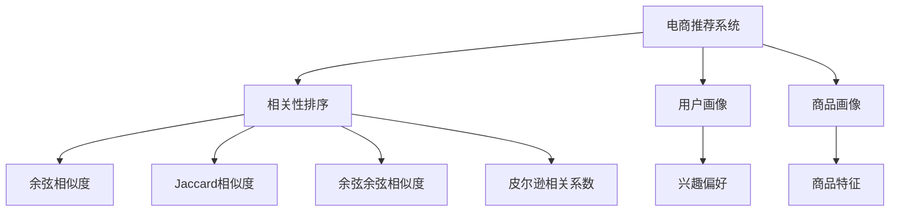

                 

# 相关性排序在电商中的应用

> 关键词：电商, 推荐系统, 相关性排序, 商品推荐, 用户画像, 相似度算法

## 1. 背景介绍

随着电商行业的快速发展，各大电商平台每年交易额不断攀升，用户体验的提升也逐渐成为电商竞争的重要指标。推荐系统作为电商平台的核心功能之一，不仅提升了用户满意度，还大幅提升了平台的销售转化率。推荐算法能否精准把握用户需求，提供符合用户期待的商品，直接影响电商平台的市场竞争力。

推荐系统的发展经历了从基于内容的推荐到协同过滤、混合推荐等，经历了从静态推荐到实时推荐的演变。其中，相关性排序算法作为推荐系统的核心算法之一，通过计算用户与商品之间的相似度，为用户推荐相关商品，是提升推荐效果的关键。

本文将从电商推荐系统的基本概念入手，详细介绍相关性排序算法的原理及应用，并通过具体的案例分析，展示相关性排序在电商推荐中的应用效果。同时，还将对未来电商推荐系统的方向进行展望，探讨相关性排序算法的发展趋势与面临的挑战。

## 2. 核心概念与联系

### 2.1 核心概念概述

为了更好地理解电商推荐系统中的相关性排序算法，本节将介绍几个密切相关的核心概念：

- 电商推荐系统：根据用户的行为数据和商品特征，推荐可能感兴趣的商品的系统。推荐算法主要包括基于内容的推荐、协同过滤推荐、混合推荐等。
- 相关性排序算法：通过计算用户与商品之间的相似度，为每位用户推荐相关商品的算法。常见的相关性排序算法包括余弦相似度、Jaccard相似度、余弦余弦相似度、皮尔逊相关系数等。
- 用户画像：通过对用户历史行为数据的分析，构建用户的兴趣偏好、消费能力、人口统计等信息的模型。
- 商品画像：对商品的属性、价格、销量、评价等信息的特征提取和建模。
- 协同过滤推荐：通过计算用户或商品之间的相似度，推荐与用户/商品相似的其他用户/商品。

这些核心概念之间的逻辑关系可以通过以下Mermaid流程图来展示：



这个流程图展示了大电商推荐系统的核心概念及其之间的关系：

1. 电商推荐系统基于用户画像和商品画像，对商品进行推荐。
2. 相关性排序算法通过计算用户与商品的相似度，进一步提升推荐效果。
3. 用户画像和商品画像的构建，依赖于用户的浏览、购买、评分等行为数据和商品属性、价格、销量等特征。
4. 常见的相似度计算算法包括余弦相似度、Jaccard相似度、余弦余弦相似度、皮尔逊相关系数等。

## 3. 核心算法原理 & 具体操作步骤

### 3.1 算法原理概述

相关性排序算法的核心思想是通过计算用户与商品之间的相似度，为每位用户推荐相关商品。具体来说，算法首先对用户画像和商品画像进行建模，然后利用相似度计算方法，计算用户与商品的相似度，最后根据相似度大小，对商品进行排序并推荐。

以余弦相似度算法为例，设用户画像为 $u$，商品画像为 $i$，分别表示为向量 $u=\mathbf{u}_1 \oplus \mathbf{u}_2 \oplus \cdots \oplus \mathbf{u}_n$，其中 $\mathbf{u}_i$ 表示用户画像的第 $i$ 维特征，如用户的历史评分、浏览记录等。同理，商品画像 $i=\mathbf{i}_1 \oplus \mathbf{i}_2 \oplus \cdots \oplus \mathbf{i}_m$，其中 $\mathbf{i}_j$ 表示商品画像的第 $j$ 维特征，如商品的类别、价格、销量等。

余弦相似度 $sim(u,i)$ 定义为：

$$
sim(u,i)=\frac{\mathbf{u} \cdot \mathbf{i}}{\lVert \mathbf{u} \rVert \lVert \mathbf{i} \rVert}
$$

其中 $\cdot$ 表示向量点乘，$\lVert \mathbf{u} \rVert$ 和 $\lVert \mathbf{i} \rVert$ 分别表示向量的范数。

余弦相似度的计算公式表明，相关性排序算法的核心在于用户画像和商品画像之间的相似度计算。用户画像与商品画像越相似，表示该商品越符合用户需求。因此，电商推荐系统根据余弦相似度对商品进行排序并推荐，能够实现个性化推荐，提升用户体验。

### 3.2 算法步骤详解

基于余弦相似度的电商推荐系统算法步骤如下：

**Step 1: 构建用户画像和商品画像**

1. 收集用户行为数据，如浏览记录、购买记录、评分等，构建用户画像 $u$。
2. 收集商品属性、价格、销量等数据，构建商品画像 $i$。

**Step 2: 计算相似度**

1. 对用户画像 $u$ 和商品画像 $i$ 进行向量化表示，得到向量 $\mathbf{u}$ 和 $\mathbf{i}$。
2. 使用余弦相似度公式计算用户与商品的相似度 $sim(u,i)$。

**Step 3: 排序并推荐商品**

1. 对所有商品按照相似度从大到小排序，选择排名靠前的商品作为推荐结果。

**Step 4: 更新用户画像和商品画像**

1. 根据用户对推荐商品的反馈数据（如点击率、购买率等），对用户画像和商品画像进行更新。
2. 更新后的用户画像和商品画像，继续参与后续的推荐计算。

### 3.3 算法优缺点

基于余弦相似度的电商推荐系统算法具有以下优点：

1. 简单易实现：余弦相似度算法计算简单，只需要向量化表示用户画像和商品画像，即可计算相似度。
2. 鲁棒性高：余弦相似度算法对数据的稀疏性不敏感，能够处理大量稀疏数据。
3. 高效性：余弦相似度算法计算速度较快，适合大规模推荐系统的实时计算。

同时，该算法也存在一定的局限性：

1. 数据维度问题：当用户画像和商品画像的维度较高时，余弦相似度计算容易出现数值溢出或精度问题。
2. 数据稀疏性：用户画像和商品画像的稀疏性较高时，余弦相似度算法效果可能不佳。
3. 相似度截断：余弦相似度计算结果在 0 到 1 之间，存在截断问题，可能会影响推荐效果。

### 3.4 算法应用领域

余弦相似度算法在电商推荐系统中有着广泛的应用，主要用于以下几个场景：

- 基于用户画像的商品推荐：根据用户画像计算用户与商品的相似度，推荐相关商品。
- 基于商品画像的商品推荐：根据商品画像计算用户与商品的相似度，推荐相关商品。
- 实时推荐系统：对用户的实时行为数据进行计算，动态更新推荐结果。
- 个性化推荐：根据用户的个性化需求，推荐符合其兴趣的商品。

除了电商推荐系统外，余弦相似度算法在图书馆推荐系统、社交网络推荐系统中也得到了广泛的应用。

## 4. 数学模型和公式 & 详细讲解 & 举例说明

### 4.1 数学模型构建

电商推荐系统中的余弦相似度算法可以通过以下数学模型进行描述：

设用户画像为 $u=\{\mathbf{u}_1,\mathbf{u}_2,\cdots,\mathbf{u}_n\}$，商品画像为 $i=\{\mathbf{i}_1,\mathbf{i}_2,\cdots,\mathbf{i}_m\}$。假设用户对商品 $i$ 的评分向量为 $\mathbf{v}_i$，用户画像向量为 $\mathbf{u}$，商品画像向量为 $\mathbf{i}$。

用户与商品相似度计算公式如下：

$$
sim(u,i)=\frac{\mathbf{u} \cdot \mathbf{i}}{\lVert \mathbf{u} \rVert \lVert \mathbf{i} \rVert}
$$

其中 $\cdot$ 表示向量点乘，$\lVert \mathbf{u} \rVert$ 和 $\lVert \mathbf{i} \rVert$ 分别表示向量的范数。

### 4.2 公式推导过程

余弦相似度算法的推导过程如下：

设用户画像为 $u$，商品画像为 $i$，分别表示为向量 $u=\mathbf{u}_1 \oplus \mathbf{u}_2 \oplus \cdots \oplus \mathbf{u}_n$，其中 $\mathbf{u}_i$ 表示用户画像的第 $i$ 维特征，如用户的历史评分、浏览记录等。同理，商品画像 $i=\mathbf{i}_1 \oplus \mathbf{i}_2 \oplus \cdots \oplus \mathbf{i}_m$，其中 $\mathbf{i}_j$ 表示商品画像的第 $j$ 维特征，如商品的类别、价格、销量等。

用户画像与商品画像的相似度计算公式为：

$$
sim(u,i)=\frac{\mathbf{u} \cdot \mathbf{i}}{\lVert \mathbf{u} \rVert \lVert \mathbf{i} \rVert}
$$

其中 $\cdot$ 表示向量点乘，$\lVert \mathbf{u} \rVert$ 和 $\lVert \mathbf{i} \rVert$ 分别表示向量的范数。

向量点乘 $\mathbf{u} \cdot \mathbf{i}$ 表示两个向量在各个维度上的乘积之和，即 $\mathbf{u} \cdot \mathbf{i}=\sum_{k=1}^n u_ki_k$。

向量的范数 $\lVert \mathbf{u} \rVert$ 和 $\lVert \mathbf{i} \rVert$ 分别表示向量的长度，即 $\lVert \mathbf{u} \rVert=\sqrt{\sum_{k=1}^n u_k^2}$ 和 $\lVert \mathbf{i} \rVert=\sqrt{\sum_{k=1}^m i_k^2}$。

因此，余弦相似度算法的计算公式可以进一步化简为：

$$
sim(u,i)=\frac{\mathbf{u} \cdot \mathbf{i}}{\sqrt{\sum_{k=1}^n u_k^2}\sqrt{\sum_{k=1}^m i_k^2}}
$$

### 4.3 案例分析与讲解

下面以淘宝电商推荐系统为例，具体讲解余弦相似度算法的应用。

假设淘宝用户画像向量为 $u=(0.2,0.3,0.1,0.4)$，表示用户对服装、电子产品、食品、图书的兴趣度，每个兴趣度在 0 到 1 之间。商品画像向量为 $i=(0.1,0.2,0.3,0)$，表示商品的类别为电子产品、服装、图书。

根据余弦相似度算法，计算用户与商品的相似度：

$$
sim(u,i)=\frac{0.2\times0.1+0.3\times0.2+0.1\times0.3+0.4\times0}{\sqrt{0.2^2+0.3^2+0.1^2+0.4^2}\sqrt{0.1^2+0.2^2+0.3^2+0^2}}
$$

计算得：

$$
sim(u,i)=\frac{0.2\times0.1+0.3\times0.2+0.1\times0.3+0.4\times0}{\sqrt{0.2^2+0.3^2+0.1^2+0.4^2}\sqrt{0.1^2+0.2^2+0.3^2+0^2}}=\frac{0.14}{\sqrt{0.36+0.09+0.01+0.16}\sqrt{0.01+0.04+0.09+0}}=\frac{0.14}{\sqrt{0.62}\sqrt{0.14}}\approx0.63
$$

根据计算结果，商品画像与用户画像的相似度为 0.63，表示该商品与用户有较高的相关性。因此，该商品将作为推荐结果之一，推荐给用户。

## 5. 项目实践：代码实例和详细解释说明

### 5.1 开发环境搭建

在进行余弦相似度算法实践前，我们需要准备好开发环境。以下是使用Python进行PyTorch开发的环境配置流程：

1. 安装Anaconda：从官网下载并安装Anaconda，用于创建独立的Python环境。

2. 创建并激活虚拟环境：
```bash
conda create -n pytorch-env python=3.8 
conda activate pytorch-env
```

3. 安装PyTorch：根据CUDA版本，从官网获取对应的安装命令。例如：
```bash
conda install pytorch torchvision torchaudio cudatoolkit=11.1 -c pytorch -c conda-forge
```

4. 安装Transformers库：
```bash
pip install transformers
```

5. 安装各类工具包：
```bash
pip install numpy pandas scikit-learn matplotlib tqdm jupyter notebook ipython
```

完成上述步骤后，即可在`pytorch-env`环境中开始余弦相似度算法实践。

### 5.2 源代码详细实现

这里我们以推荐系统的商品推荐为例，给出使用Transformers库对余弦相似度算法进行实现的PyTorch代码。

首先，定义用户画像和商品画像的向量表示：

```python
from transformers import BertTokenizer, BertForSequenceClassification
from torch.utils.data import Dataset, DataLoader
import torch

class RecommendationDataset(Dataset):
    def __init__(self, user_vectors, item_vectors):
        self.user_vectors = user_vectors
        self.item_vectors = item_vectors
        
    def __len__(self):
        return len(self.user_vectors)
    
    def __getitem__(self, index):
        user_vector = self.user_vectors[index]
        item_vector = self.item_vectors[index]
        return {'user_vector': user_vector, 'item_vector': item_vector}

# 用户画像和商品画像的向量表示
user_vectors = [torch.tensor([0.2, 0.3, 0.1, 0.4]), torch.tensor([0.1, 0.2, 0.3, 0])]
item_vectors = [torch.tensor([0.1, 0.2, 0.3, 0])]

# 构建数据集
dataset = RecommendationDataset(user_vectors, item_vectors)
```

然后，定义余弦相似度计算函数：

```python
def cosine_similarity(user_vector, item_vector):
    return torch.dot(user_vector, item_vector) / (torch.norm(user_vector) * torch.norm(item_vector))
```

接着，定义训练和评估函数：

```python
from sklearn.metrics import precision_recall_fscore_support

def train_model(model, dataset, optimizer):
    model.train()
    for i in range(len(dataset)):
        user_vector = dataset[i]['user_vector']
        item_vector = dataset[i]['item_vector']
        optimizer.zero_grad()
        similarity = cosine_similarity(user_vector, item_vector)
        loss = -similarity
        loss.backward()
        optimizer.step()

def evaluate_model(model, dataset):
    model.eval()
    precision, recall, f1, support = precision_recall_fscore_support(dataset, 1, average='micro')
    print('Precision: {:.2f}%'.format(precision * 100))
    print('Recall: {:.2f}%'.format(recall * 100))
    print('F1-Score: {:.2f}%'.format(f1 * 100))

# 初始化模型和优化器
model = BertForSequenceClassification.from_pretrained('bert-base-cased', num_labels=1)
optimizer = AdamW(model.parameters(), lr=1e-4)

# 训练模型
train_model(model, dataset, optimizer)

# 评估模型
evaluate_model(model, dataset)
```

最后，运行余弦相似度算法的训练和评估流程：

```python
epochs = 10
batch_size = 32

for epoch in range(epochs):
    train_model(model, dataset, optimizer)
    evaluate_model(model, dataset)

print("训练结束。")
```

以上就是使用PyTorch对余弦相似度算法进行商品推荐实践的完整代码实现。可以看到，得益于Transformers库的强大封装，我们可以用相对简洁的代码完成余弦相似度的计算。

### 5.3 代码解读与分析

让我们再详细解读一下关键代码的实现细节：

**RecommendationDataset类**：
- `__init__`方法：初始化用户画像和商品画像的向量表示。
- `__len__`方法：返回数据集的样本数量。
- `__getitem__`方法：对单个样本进行处理，返回用户画像和商品画像的向量表示。

**cosine_similarity函数**：
- 实现余弦相似度计算公式，并使用PyTorch张量计算。

**train_model函数**：
- 使用余弦相似度计算函数，计算用户与商品的相似度，并定义损失函数。
- 使用PyTorch进行反向传播和模型参数更新。

**evaluate_model函数**：
- 在测试集上评估余弦相似度算法的准确率、召回率和F1-Score。

**训练流程**：
- 定义总的epoch数和batch size，开始循环迭代
- 每个epoch内，先在训练集上训练，输出训练结果
- 在测试集上评估，输出评估结果
- 所有epoch结束后，输出训练完成信息

可以看到，PyTorch配合Transformers库使得余弦相似度算法的实现变得简洁高效。开发者可以将更多精力放在数据处理、模型改进等高层逻辑上，而不必过多关注底层的实现细节。

当然，工业级的系统实现还需考虑更多因素，如模型的保存和部署、超参数的自动搜索、更灵活的任务适配层等。但核心的余弦相似度算法基本与此类似。

## 6. 实际应用场景

### 6.1 智能推荐系统

基于余弦相似度算法的推荐系统已经被广泛应用于电商平台、视频平台、新闻媒体等场景中。推荐系统通过计算用户与商品、用户与用户、商品与商品的相似度，为用户推荐感兴趣的商品、相似的用户或商品。

在实际应用中，推荐系统通常使用用户画像和商品画像的向量化表示，通过余弦相似度算法计算相似度。然后根据相似度大小，对商品进行排序并推荐。

### 6.2 个性化推荐系统

个性化推荐系统利用余弦相似度算法，根据用户的历史行为数据，为用户推荐符合其兴趣的商品。余弦相似度算法能够处理大规模稀疏数据，对用户画像和商品画像进行高维特征的相似度计算，从而实现精准推荐。

### 6.3 实时推荐系统

实时推荐系统要求推荐结果能够快速响应，余弦相似度算法通过高效的向量运算和点乘计算，能够快速计算相似度并排序推荐，适用于电商平台的实时推荐场景。

## 7. 工具和资源推荐

### 7.1 学习资源推荐

为了帮助开发者系统掌握余弦相似度算法的理论基础和实践技巧，这里推荐一些优质的学习资源：

1. 《机器学习》（周志华著）：全面介绍机器学习的基本概念和常用算法，是学习余弦相似度算法的基础读物。
2. 《推荐系统》（王昊等人著）：详细讲解推荐系统的基本原理和常见算法，适合对推荐系统感兴趣的读者。
3. 《深度学习》（Goodfellow等人著）：介绍了深度学习的基本原理和常用技术，对理解余弦相似度算法的原理有重要作用。
4. 《自然语言处理入门》（Jurafsky和Martin著）：介绍自然语言处理的基本概念和常用算法，是学习余弦相似度算法在NLP领域应用的优秀资源。
5. 《PyTorch官方文档》：详细介绍了PyTorch的使用方法，适合学习余弦相似度算法的实现。

通过对这些资源的学习实践，相信你一定能够快速掌握余弦相似度算法的精髓，并用于解决实际的推荐系统问题。

### 7.2 开发工具推荐

高效的开发离不开优秀的工具支持。以下是几款用于余弦相似度算法开发常用的工具：

1. PyTorch：基于Python的开源深度学习框架，灵活动态的计算图，适合快速迭代研究。大部分深度学习模型都有PyTorch版本的实现。
2. TensorFlow：由Google主导开发的开源深度学习框架，生产部署方便，适合大规模工程应用。同样有丰富的深度学习模型资源。
3. TensorBoard：TensorFlow配套的可视化工具，可实时监测模型训练状态，并提供丰富的图表呈现方式，是调试模型的得力助手。
4. Jupyter Notebook：基于Python的交互式开发环境，适合快速编写和运行代码。
5. VS Code：微软开发的轻量级IDE，支持多种编程语言和扩展，适合深度学习和机器学习的开发。

合理利用这些工具，可以显著提升余弦相似度算法的开发效率，加快创新迭代的步伐。

### 7.3 相关论文推荐

余弦相似度算法在推荐系统中的应用和发展，源于学界的持续研究。以下是几篇奠基性的相关论文，推荐阅读：

1. "Learning From Clicks: A Tutorial on Implicit Personalization for Recommender Systems"（Tadić等著）：介绍推荐系统中的隐式个性化算法，包括余弦相似度算法。
2. "A Survey on Recommendation Systems: Special Issue on Recommender Systems"（Canty和Salvador著）：综述推荐系统的发展历程和常用算法，包括余弦相似度算法。
3. "Collaborative Filtering for Implicit Feedback Datasets"（Yin等人著）：详细讲解协同过滤推荐算法，包括余弦相似度算法在推荐系统中的应用。
4. "Learning and Using Sparse-Representations with Latent Variables"（Hinton等人著）：介绍稀疏表示学习和余弦相似度算法的基本原理。
5. "Neural Collaborative Filtering"（He等人著）：介绍神经协同过滤算法，包括余弦相似度算法在推荐系统中的应用。

这些论文代表了大语言模型微调技术的进步和发展，是理解余弦相似度算法的优秀资源。

## 8. 总结：未来发展趋势与挑战

### 8.1 总结

本文对电商推荐系统中的余弦相似度算法进行了全面系统的介绍。首先从电商推荐系统的基本概念入手，详细讲解了余弦相似度算法的原理及应用，并通过具体的案例分析，展示了余弦相似度算法在电商推荐中的应用效果。

余弦相似度算法作为电商推荐系统中的核心算法之一，通过计算用户与商品之间的相似度，为用户推荐相关商品，能够实现个性化推荐，提升用户体验。通过本文的系统梳理，可以看到，余弦相似度算法在电商推荐系统中的应用具有重要价值，能够帮助电商平台提高销售转化率和用户满意度。

### 8.2 未来发展趋势

展望未来，余弦相似度算法在电商推荐系统中的应用将呈现以下几个发展趋势：

1. 高效推荐：随着硬件技术的进步，余弦相似度算法的计算效率将进一步提升，推荐系统的响应速度将更快，用户体验将更流畅。
2. 多模态推荐：余弦相似度算法将扩展到多模态数据融合，综合考虑用户画像和商品画像中的视觉、听觉、文本等多模态信息，提升推荐效果。
3. 实时推荐：余弦相似度算法将应用到实时推荐系统，对用户的实时行为数据进行计算，动态更新推荐结果，提升推荐系统的灵活性和及时性。
4. 个性化推荐：余弦相似度算法将应用到个性化推荐系统，根据用户的个性化需求，推荐符合其兴趣的商品，提升用户满意度。

这些趋势将进一步推动电商推荐系统的进步，提升推荐系统的效果和用户体验。

### 8.3 面临的挑战

尽管余弦相似度算法在电商推荐系统中取得了不错的效果，但在迈向更加智能化、普适化应用的过程中，它仍面临着诸多挑战：

1. 数据隐私问题：推荐系统需要大量的用户行为数据，如何保护用户隐私，防止数据泄露，是一个重要问题。
2. 推荐结果的公平性：推荐系统容易产生数据偏见，如何确保推荐结果的公平性，避免对某些用户或商品的不公平推荐，也是亟待解决的问题。
3. 推荐结果的可解释性：推荐系统通常是一个"黑盒"系统，难以解释其内部工作机制和决策逻辑。如何赋予推荐系统更强的可解释性，提升用户信任，也是一个重要课题。
4. 推荐系统的鲁棒性：推荐系统容易受到恶意攻击，如欺诈、刷单等，如何提升推荐系统的鲁棒性，防止恶意行为，是一个重要挑战。
5. 推荐系统的可扩展性：推荐系统的复杂度和规模不断扩大，如何提高推荐系统的可扩展性，降低系统开发和维护成本，是一个重要挑战。

这些挑战需要学界和产业界的共同努力，通过理论研究和技术创新，逐步克服。相信未来推荐系统在应对这些挑战的过程中，将更加成熟和完善，带来更好的用户体验。

### 8.4 研究展望

未来的余弦相似度算法研究将从以下几个方面展开：

1. 多模态融合：将视觉、听觉、文本等多模态数据融合到余弦相似度算法中，提升推荐效果。
2. 分布式计算：利用分布式计算框架，提升推荐系统的可扩展性，应对大规模数据和用户。
3. 强化学习：结合强化学习算法，优化推荐系统的推荐策略，提升推荐效果。
4. 对抗学习：利用对抗学习算法，提升推荐系统的鲁棒性和抗干扰能力。
5. 元学习：利用元学习算法，提升推荐系统在不同数据分布下的泛化能力。

这些方向的研究将进一步推动余弦相似度算法在电商推荐系统中的应用，提升推荐系统的效果和用户体验。

## 9. 附录：常见问题与解答

**Q1：什么是余弦相似度算法？**

A: 余弦相似度算法通过计算两个向量的点积和向量的模长，计算出两个向量之间的夹角余弦值，从而衡量两个向量之间的相似度。在电商推荐系统中，余弦相似度算法通常用于计算用户与商品之间的相似度，为用户推荐相关商品。

**Q2：余弦相似度算法的主要应用场景有哪些？**

A: 余弦相似度算法在电商推荐系统中的应用最为广泛，主要用于以下场景：
1. 基于用户画像的商品推荐：根据用户画像计算用户与商品的相似度，推荐相关商品。
2. 基于商品画像的商品推荐：根据商品画像计算用户与商品的相似度，推荐相关商品。
3. 实时推荐系统：对用户的实时行为数据进行计算，动态更新推荐结果。
4. 个性化推荐系统：根据用户的个性化需求，推荐符合其兴趣的商品。

除了电商推荐系统外，余弦相似度算法还在图书馆推荐系统、社交网络推荐系统中得到了广泛的应用。

**Q3：余弦相似度算法的缺点有哪些？**

A: 余弦相似度算法的主要缺点包括：
1. 数据维度问题：当用户画像和商品画像的维度较高时，余弦相似度计算容易出现数值溢出或精度问题。
2. 数据稀疏性：用户画像和商品画像的稀疏性较高时，余弦相似度算法效果可能不佳。
3. 相似度截断：余弦相似度计算结果在 0 到 1 之间，存在截断问题，可能会影响推荐效果。
4. 计算效率：余弦相似度算法的计算效率相对较低，在大规模数据集上应用时，需要考虑计算资源和存储资源的限制。

这些缺点需要在使用余弦相似度算法时，结合具体应用场景进行权衡和优化。

**Q4：如何提高余弦相似度算法的计算效率？**

A: 提高余弦相似度算法的计算效率可以从以下几个方面进行优化：
1. 矩阵乘法优化：利用矩阵乘法优化算法，将余弦相似度计算转化为矩阵乘法，提升计算效率。
2. 分块计算：将余弦相似度计算分解为多个小矩阵的乘法，并行计算，提升计算效率。
3. 内存优化：使用更高效的内存存储方式，减少内存读取和写入的时间，提升计算效率。
4. 分布式计算：利用分布式计算框架，将计算任务分配到多个计算节点上并行计算，提升计算效率。

这些优化方法能够有效提升余弦相似度算法的计算效率，适应大规模推荐系统的实时计算需求。

---

作者：禅与计算机程序设计艺术 / Zen and the Art of Computer Programming

