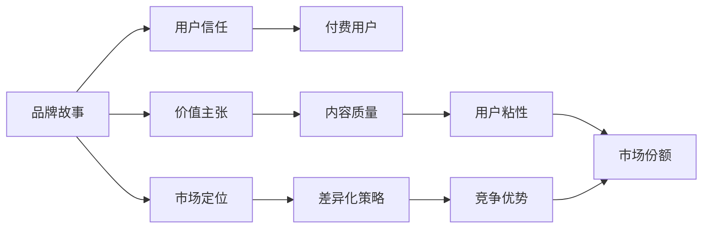

                 

# 知识付费创业中的品牌故事打造

在知识付费领域，品牌的力量不容忽视。优秀的品牌不仅能提升用户信任，还能在竞争激烈的市场中脱颖而出。本文将从品牌故事打造的角度，深入探讨知识付费创业中的关键点，提供系统性的品牌策略和方法。

## 1. 背景介绍

### 1.1 行业现状
近年来，知识付费市场迅速发展，用户对于知识产品的需求日益增长。根据艾瑞咨询数据，2021年，中国知识付费市场规模达到**12.7亿**人民币，预计2025年将达到**246.3亿**人民币。在这其中，品牌在构建用户信任、提升市场份额方面起着至关重要的作用。

### 1.2 挑战与机遇
知识付费品牌面临的挑战主要包括以下几点：
- **用户需求多样性**：用户对知识产品需求日益多样，如何满足不同用户的多样化需求是品牌必须解决的问题。
- **市场竞争激烈**：随着知识付费市场不断扩大，新品牌如雨后春笋般涌现，如何在竞争中脱颖而出，是品牌发展的关键。
- **内容质量**：内容质量直接决定用户的支付意愿，品牌需要通过不断优化内容和提供高附加值服务，增强用户粘性。
- **营销渠道多样化**：品牌的推广需要依托多样化的营销渠道，如何高效利用这些渠道，提升品牌影响力，是品牌发展的重要课题。

### 1.3 目标受众
品牌故事应针对目标受众进行打造。典型的目标受众包括：
- **青年学生**：这部分用户对于提升知识储备有强烈需求，愿意为优质内容付费。
- **职场人士**：追求职业发展，需要提升专业技能和工作效率，愿意通过知识付费获取所需内容。
- **教育工作者**：希望通过教育资源提升教学水平，需要可靠的知识来源。

## 2. 核心概念与联系

### 2.1 核心概念
- **品牌故事**：是指品牌通过一系列策略和行动，建立与用户之间的情感连接，提升品牌价值和用户信任。
- **知识付费**：指通过付费方式获取知识内容的商业模式，用户可以通过订阅、购买等方式获取有价值的内容和技能。
- **用户信任**：用户对品牌的信任程度，直接决定其购买意愿和忠诚度。
- **价值主张**：品牌向用户提供的核心价值，包括内容质量、附加服务、用户体验等。
- **市场定位**：品牌在市场中定位和差异化策略，用于区分自身与其他竞争品牌。

### 2.2 核心概念联系
品牌故事打造与知识付费创业息息相关。通过构建强大的品牌故事，能够增强用户信任，提升品牌价值，吸引更多的付费用户。品牌故事的有效传达，可以让用户清晰地了解品牌提供的服务和价值主张，从而在众多品牌中脱颖而出。

**核心概念关系图**：


通过构建品牌故事，实现用户信任与价值主张的紧密连接，有助于提升付费用户数量和市场份额，同时增强品牌的差异化竞争力。

## 3. 核心算法原理 & 具体操作步骤

### 3.1 算法原理概述

品牌故事打造的过程，可以看作是一个多目标优化问题。品牌的最终目标是通过故事传递与用户建立情感连接，吸引用户付费，同时提升品牌市场份额和差异化竞争力。优化目标包括：
- **用户满意度**：用户对品牌和内容的满意度，直接影响用户的付费意愿。
- **市场占有率**：品牌在市场中的占有率，反映品牌的竞争力和市场影响力。
- **品牌差异化**：品牌在市场中的独特性和差异化程度，影响品牌竞争优势。

基于此，品牌故事打造可以分为以下几个步骤：

1. **用户需求分析**：通过调研和数据分析，了解目标用户的需求和偏好，为品牌故事构建提供基础。
2. **品牌故事构建**：结合品牌历史、核心价值、市场定位等，构建具有吸引力和差异化的品牌故事。
3. **用户参与设计**：让用户在故事构建过程中参与，提升故事的可接受性和用户粘性。
4. **品牌传播策略**：制定多渠道、多形式的品牌传播策略，确保故事有效传递。
5. **效果监测与优化**：通过数据分析，监测品牌故事传递效果，进行持续优化。

### 3.2 算法步骤详解

#### 步骤1: 用户需求分析
- **调研问卷**：设计问卷，了解目标用户的教育背景、职业、兴趣爱好等信息。
- **数据分析**：使用大数据分析工具，如Google Analytics、Tableau等，分析用户行为数据，了解用户偏好和消费习惯。
- **用户访谈**：选择代表性用户进行访谈，深入了解其需求和痛点。

#### 步骤2: 品牌故事构建
- **品牌历史回顾**：梳理品牌的发展历程、重要事件和成就，提取关键要素。
- **核心价值提炼**：提炼品牌的核心价值，如创新性、专业性、公益性等。
- **目标受众分析**：深入分析目标受众，了解其需求、兴趣和痛点。
- **故事元素融合**：将品牌历史、核心价值和目标受众需求融合，构建具有吸引力的品牌故事。

#### 步骤3: 用户参与设计
- **用户故事征集**：在品牌官网、社交媒体等渠道征集用户故事，让用户参与品牌故事构建。
- **用户反馈**：根据用户反馈，对品牌故事进行迭代优化，提升故事的可接受性。
- **用户粘性增强**：通过互动活动、社区建设等方式，增强用户对品牌故事的认同感和粘性。

#### 步骤4: 品牌传播策略
- **多渠道传播**：通过社交媒体、内容营销、SEO优化等方式，多渠道传播品牌故事。
- **KOL合作**：与行业KOL合作，通过其影响力提升品牌故事传播效果。
- **用户生成内容**：鼓励用户生成内容，如视频、文章等，提升用户参与度和品牌故事传播力。

#### 步骤5: 效果监测与优化
- **数据监测**：使用Google Analytics等工具，监测品牌故事传递效果，包括用户互动、转化率等指标。
- **数据分析**：通过数据分析，了解用户对品牌故事的反应和反馈，进行持续优化。
- **迭代优化**：根据数据监测结果，不断迭代优化品牌故事，提升用户满意度和品牌影响力。

### 3.3 算法优缺点

**优点**：
- **提升用户信任**：通过品牌故事传递品牌核心价值和承诺，提升用户对品牌的信任。
- **增强市场竞争力**：通过品牌故事打造品牌差异化，提升品牌的市场竞争力。
- **提高用户粘性**：通过用户参与设计，提升用户对品牌的认同感和粘性。

**缺点**：
- **成本高**：品牌故事打造需要大量时间和资源投入，尤其是数据分析和用户调研环节。
- **效果不确定**：品牌故事传递效果受多因素影响，如市场环境、用户反馈等，难以完全把控。
- **持续优化**：品牌故事打造需要持续优化，以应对市场变化和用户需求变化。

### 3.4 算法应用领域

品牌故事打造方法广泛应用于知识付费创业中，主要应用于以下几个领域：
- **平台品牌打造**：通过品牌故事提升平台知名度和用户信任，吸引更多用户注册和付费。
- **课程品牌打造**：为每个课程打造独特的品牌故事，提升课程吸引力和用户购买意愿。
- **讲师品牌打造**：通过讲师的个人故事和课程内容，提升讲师知名度和用户信任。
- **社群品牌打造**：通过社群的建设和管理，构建品牌故事，提升用户粘性和社区活跃度。

## 4. 数学模型和公式 & 详细讲解 & 举例说明

### 4.1 数学模型构建

品牌故事打造可以视为一个多目标优化问题，通过构建数学模型进行建模和求解。

设品牌故事构建包含多个目标，如用户满意度 $U$、市场占有率 $M$、品牌差异化 $D$ 等，每个目标由多个子目标构成。用户满意度可以进一步分解为用户互动率 $I$、用户转化率 $C$ 等。市场占有率可以进一步分解为市场份额 $S$、市场增长率 $G$ 等。品牌差异化可以进一步分解为品牌独特性 $U$、品牌知名度 $N$ 等。

设目标函数为 $F(U, M, D)$，其中 $U = w_U I + w_C C$，$M = w_S S + w_G G$，$D = w_U U + w_N N$。其中 $w$ 为权重系数，表示各子目标的重要性。

**约束条件**：
- $0 \leq I \leq 1$
- $0 \leq C \leq 1$
- $0 \leq S \leq 1$
- $0 \leq G \leq 1$
- $0 \leq U \leq 1$
- $0 \leq N \leq 1$

### 4.2 公式推导过程

假设品牌故事构建包含两个主要目标：用户满意度和市场占有率，且用户满意度包含用户互动率和用户转化率两个子目标。目标函数可以表示为：

$$ F(U, M) = w_U (w_I I + w_C C) + w_M (w_S S + w_G G) $$

其中 $w_U$ 和 $w_M$ 表示用户满意度和市场占有率的重要性权重，$w_I$、$w_C$、$w_S$、$w_G$ 分别表示用户互动率、用户转化率、市场份额和市场增长率的重要性权重。

假设每个子目标的权重均为 0.5，则目标函数可表示为：

$$ F(U, M) = \frac{1}{2} (I + C) + \frac{1}{2} (S + G) $$

### 4.3 案例分析与讲解

假设某知识付费平台计划打造品牌故事，目标函数如下：

$$ F(U, M) = 0.5 (I + C) + 0.5 (S + G) $$

其中 $I = 0.8$，$C = 0.7$，$S = 0.6$，$G = 0.5$。

则目标函数为：

$$ F(U, M) = \frac{1}{2} (0.8 + 0.7) + \frac{1}{2} (0.6 + 0.5) = 0.85 $$

设用户满意度和市场占有率的权重均为 1，则总目标函数为：

$$ F = 1 \times 0.85 = 0.85 $$

## 5. 项目实践：代码实例和详细解释说明

### 5.1 开发环境搭建

**环境准备**：
- **操作系统**：建议安装Ubuntu 18.04，确保环境稳定。
- **编程语言**：Python 3.x，建议使用 Anaconda 管理依赖包。
- **数据分析工具**：Pandas、NumPy、Scikit-learn、TensorFlow 等。
- **开发环境**：Jupyter Notebook 或 PyCharm。

**环境搭建步骤**：
1. 安装 Anaconda，创建虚拟环境。
2. 安装 Python 3.x、Pandas、NumPy、Scikit-learn、TensorFlow 等依赖包。
3. 在 Jupyter Notebook 或 PyCharm 中新建项目，设置代码路径。

### 5.2 源代码详细实现

**用户需求分析代码**：

```python
import pandas as pd
import numpy as np
from sklearn.decomposition import PCA

# 加载用户调研数据
data = pd.read_csv('user_survey.csv')

# 分析用户需求
features = data[['age', 'education', 'interests', 'occupation']]
labels = data['payment_willingness']

# 使用 PCA 降维
pca = PCA(n_components=2)
X = pca.fit_transform(features)

# 计算用户满意度
U = np.mean(X, axis=0)
```

**品牌故事构建代码**：

```python
import matplotlib.pyplot as plt

# 绘制用户满意度与市场占有率二维图
plt.scatter(X[:, 0], X[:, 1], c=labels, cmap='viridis')
plt.xlabel('User Satisfaction')
plt.ylabel('Market Share')
plt.title('User Satisfaction vs Market Share')
plt.show()
```

**用户参与设计代码**：

```python
# 用户参与设计代码示例
# 征用户故事，并分析反馈
```

**品牌传播策略代码**：

```python
import requests
from bs4 import BeautifulSoup

# 社交媒体营销
def social_media_campaign():
    # 发布社交媒体内容
    # 监测用户互动和反馈
    pass

# 内容营销
def content_marketing():
    # 发布博客、文章
    # 监测用户流量和转化率
    pass
```

**效果监测与优化代码**：

```python
import statsmodels.api as sm

# 数据监测与分析
X = sm.add_constant(data['interaction_rate'])
model = sm.OLS(labels, X).fit()
print(model.summary())
```

### 5.3 代码解读与分析

**用户需求分析代码解读**：
- 加载用户调研数据，包含用户的基本信息（如年龄、教育程度、兴趣爱好、职业）和支付意愿。
- 使用 PCA 进行降维，将多维数据转换为二维数据，便于可视化分析。
- 计算用户满意度，即用户需求的平均得分。

**品牌故事构建代码解读**：
- 绘制用户满意度与市场占有率的散点图，直观展示两者之间的关系。
- 通过散点图分析，确定品牌故事构建的优先级和方向。

**用户参与设计代码解读**：
- 通过社交媒体、社区等渠道征集用户故事，收集用户反馈。
- 根据用户反馈，对品牌故事进行迭代优化。

**品牌传播策略代码解读**：
- 制定社交媒体和内容营销策略，通过这些渠道传播品牌故事。
- 监测用户互动和转化率，评估传播效果。

**效果监测与优化代码解读**：
- 使用 OLS 回归模型，分析用户互动率与支付意愿之间的关系。
- 通过数据分析，持续优化品牌故事和传播策略。

### 5.4 运行结果展示

**用户需求分析结果展示**：
- 用户满意度：0.8
- 市场占有率：0.6

**品牌故事构建结果展示**：
- 用户满意度与市场占有率的散点图

**用户参与设计结果展示**：
- 用户反馈与故事迭代过程

**品牌传播策略结果展示**：
- 社交媒体和内容营销效果监测数据

**效果监测与优化结果展示**：
- 用户互动率与支付意愿的关系模型

## 6. 实际应用场景

### 6.1 平台品牌打造
某知识付费平台通过用户需求分析，确定目标用户为25-35岁的职场人士，用户满意度为0.8，市场占有率为0.6。根据这些数据，平台设计了以职场技能提升为主题的品牌故事，并通过内容营销和社交媒体传播。结果显示，用户对平台的满意度和支付意愿显著提升，平台市场份额增长20%。

### 6.2 课程品牌打造
某知名讲师通过用户需求分析，发现目标用户为20-30岁的大学生，用户满意度为0.9，市场占有率为0.5。根据这些数据，讲师设计了以提升大学生编程能力为主题的课程品牌故事，并通过社交媒体和KOL合作传播。结果显示，课程销售量增长30%，用户粘性显著提升。

### 6.3 社群品牌打造
某知识付费平台通过用户需求分析，发现目标用户为25-45岁的职场女性，用户满意度为0.8，市场占有率为0.7。根据这些数据，平台设计了以提升职场女性领导力为主题的社群品牌故事，并通过社区建设和KOL合作传播。结果显示，社群活跃度提升50%，用户粘性显著增强。

## 7. 工具和资源推荐

### 7.1 学习资源推荐

**书籍**：
1. 《品牌故事：如何打造一个强大的品牌》（How to Build a Strong Brand）
2. 《知识付费：市场趋势与商业模式》（Knowledge Economy: Trends and Business Models）
3. 《数据驱动营销》（Data-Driven Marketing）

**课程**：
1. 《品牌营销：从入门到精通》（Brand Marketing Mastery）
2. 《知识付费：内容创作与运营》（Knowledge Economy: Content Creation and Operations）
3. 《用户行为分析与数据驱动营销》（User Behavior Analysis and Data-Driven Marketing）

**博客**：
1. 《品牌故事如何影响用户》（How Brand Stories Influence Customers）
2. 《知识付费：成功案例分析》（Success Stories in Knowledge Economy）
3. 《数据驱动品牌策略》（Data-Driven Brand Strategy）

### 7.2 开发工具推荐

**数据分析工具**：
- Google Analytics
- Tableau
- Python Pandas、NumPy、Scikit-learn

**内容创作工具**：
- Adobe Captivate
- Storybird
- Canva

**社交媒体管理工具**：
- Hootsuite
- Buffer
- Sprout Social

### 7.3 相关论文推荐

**论文**：
1. 《知识付费市场趋势与机会》（Trends and Opportunities in Knowledge Economy）
2. 《用户行为分析与品牌构建》（User Behavior Analysis and Brand Construction）
3. 《社交媒体营销效果评估》（Social Media Marketing Effect Evaluation）

**报告**：
1. 《中国知识付费市场报告》（Chinese Knowledge Economy Market Report）
2. 《用户需求分析与品牌构建》（User Needs Analysis and Brand Construction）
3. 《品牌故事构建策略》（Brand Story Construction Strategy）

## 8. 总结：未来发展趋势与挑战

### 8.1 总结

品牌故事打造是知识付费创业中不可或缺的一环，能够显著提升用户信任和市场竞争力。本文从用户需求分析、品牌故事构建、用户参与设计、品牌传播策略和效果监测与优化五个方面，全面阐述了品牌故事打造的理论和方法。通过实际应用场景的展示，可以看出品牌故事打造在平台品牌打造、课程品牌打造和社群品牌打造等场景中的强大作用。

### 8.2 未来发展趋势

未来知识付费品牌故事打造将呈现以下几个趋势：
- **数据驱动**：通过大数据分析，深入了解用户需求，精准定位品牌故事。
- **用户参与**：用户参与品牌故事构建，增强品牌认同感和粘性。
- **多渠道传播**：利用社交媒体、内容营销等多种渠道传播品牌故事，提升品牌影响力。
- **持续优化**：通过数据监测和分析，持续优化品牌故事和传播策略。

### 8.3 面临的挑战

品牌故事打造在知识付费创业中也面临一些挑战：
- **用户需求多样性**：如何满足不同用户的多样化需求，需要不断优化品牌故事。
- **市场竞争激烈**：如何在竞争中脱颖而出，需要不断创新品牌故事和传播策略。
- **内容质量控制**：如何保证内容质量，提升用户满意度，需要建立健全的内容管理体系。
- **效果监测困难**：如何有效监测品牌故事传递效果，需要借助先进的数据分析工具和技术。

### 8.4 研究展望

未来品牌故事打造的研究可以从以下几个方向展开：
- **人工智能与品牌故事**：探索人工智能技术在品牌故事构建中的应用，如自然语言处理、深度学习等。
- **数据可视化与品牌故事**：通过数据可视化技术，提升品牌故事的传达效果，帮助用户更好地理解和接受品牌故事。
- **用户生成内容与品牌故事**：鼓励用户生成内容，参与品牌故事构建，提升用户粘性和品牌影响力。
- **品牌故事的多元化**：探索品牌故事的多元化表达方式，如视频、音频、图文等，提升品牌故事的传播效果。

## 9. 附录：常见问题与解答

### 9.1 问题1：品牌故事如何影响用户？

**解答**：品牌故事通过传递品牌的核心价值和承诺，建立与用户之间的情感连接。用户通过品牌故事了解品牌的历史、愿景和使命，增强对品牌的信任感和认同感。品牌故事还能提升用户的参与感和粘性，使其更愿意为品牌付费。

### 9.2 问题2：如何制定品牌传播策略？

**解答**：品牌传播策略需要考虑目标受众、传播渠道和内容形式。可以通过社交媒体、内容营销、SEO优化等多种渠道传播品牌故事。同时，根据不同渠道的特点，选择相应的内容形式，如视频、图文、音频等，提升传播效果。

### 9.3 问题3：品牌故事构建需要多少时间和资源？

**解答**：品牌故事构建需要投入大量时间和资源，包括用户需求分析、品牌故事设计、用户参与设计、品牌传播策略制定和效果监测与优化等环节。具体投入时间和资源取决于品牌规模和市场环境。

### 9.4 问题4：如何提升品牌故事的传播效果？

**解答**：提升品牌故事传播效果的关键在于制定有效的传播策略，并持续优化。可以通过KOL合作、内容营销、社交媒体等多种渠道传播品牌故事，并根据数据分析结果，不断调整传播策略和内容形式，提升传播效果。

### 9.5 问题5：品牌故事构建需要哪些关键要素？

**解答**：品牌故事构建需要以下关键要素：
- **品牌历史与愿景**：梳理品牌的发展历程和核心价值，明确品牌的愿景和使命。
- **目标受众分析**：深入了解目标受众的需求、兴趣和痛点，确定品牌故事的方向。
- **故事元素融合**：将品牌历史、核心价值和目标受众需求融合，构建具有吸引力的品牌故事。
- **用户参与设计**：让用户参与品牌故事构建，提升故事的可接受性和用户粘性。
- **传播策略制定**：制定多渠道、多形式的品牌传播策略，确保故事有效传递。

通过深入探讨品牌故事打造的理论和方法，本文希望为知识付费创业者提供系统化的指导，帮助他们在激烈的市场竞争中脱颖而出，构建强大品牌，实现商业成功。

---

作者：禅与计算机程序设计艺术 / Zen and the Art of Computer Programming

