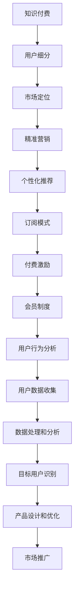

                 

# 知识付费创业的用户细分策略

> 关键词：知识付费、用户细分、市场定位、精准营销、个性化推荐、订阅模式、付费激励、会员制度

## 1. 背景介绍

在知识付费逐渐普及的今天，越来越多的创业者和机构投身于知识付费领域，希望能够通过优质的内容获取回报。然而，随着市场竞争的加剧，如何精准定位目标用户，并实施有效的用户细分策略，成为了创业成功的关键。本文将从用户细分策略的角度出发，探讨知识付费创业中的用户定位和市场操作技巧，帮助创业者更好地把握用户需求，提升产品竞争力。

## 2. 核心概念与联系

### 2.1 核心概念概述

为了深入理解知识付费创业的用户细分策略，需要首先明确几个核心概念：

- **知识付费**：指通过付费的方式获取知识和信息，通常是线上内容如文章、视频、音频、直播等。
- **用户细分**：根据用户的行为特征、需求、偏好等将用户划分为不同群体的过程，以便进行针对性的市场推广和产品设计。
- **市场定位**：确定产品在市场中的位置，明确目标用户群体和差异化的竞争优势。
- **精准营销**：通过精准分析用户数据，针对特定用户群体进行有针对性的营销活动。
- **个性化推荐**：根据用户的历史行为和偏好，提供个性化的内容推荐。
- **订阅模式**：用户定期支付固定费用，获取持续访问权限的商业模式。
- **付费激励**：通过提供优惠、奖励等方式激励用户付费。
- **会员制度**：提供会员身份和特权，增强用户粘性和忠诚度。

这些概念紧密相关，构成知识付费创业用户细分的理论基础。

### 2.2 核心概念原理和架构的 Mermaid 流程图



## 3. 核心算法原理 & 具体操作步骤

### 3.1 算法原理概述

用户细分策略的核心理念是通过对用户行为和偏好的深入分析，将用户划分为不同的群体，然后针对每个群体设计特定的市场策略和产品功能，以提高用户满意度和忠诚度，最终实现商业目标。这一过程依赖于大量用户数据和机器学习算法。

#### 3.2 算法步骤详解

用户细分策略的实现过程可以分为以下几个步骤：

1. **用户行为数据收集**：通过网站、App等渠道收集用户访问、使用、购买等行为数据。数据类型包括点击、浏览、购买、评价等。

2. **数据预处理和特征提取**：对收集到的原始数据进行清洗、去重、归一化等预处理操作。然后，利用机器学习算法提取用户行为特征，如访问频率、浏览时长、购买记录等。

3. **聚类分析**：使用聚类算法（如K-Means、层次聚类等）对用户进行划分，形成不同的用户群体。

4. **细分群体特征描述**：根据聚类结果，对每个群体进行特征描述，如年龄、性别、兴趣偏好、购买频率等。

5. **产品设计和优化**：根据细分群体的特征，设计符合不同用户需求的产品功能和推荐策略。

6. **精准营销和个性化推荐**：通过数据分析，制定精准的市场推广策略，对不同群体进行有针对性的广告投放和内容推荐。

7. **效果评估和优化**：定期评估用户细分策略的效果，根据反馈进行策略优化和调整。

### 3.3 算法优缺点

#### 3.3.1 优点

- **提高用户满意度和忠诚度**：通过个性化内容和精准营销，提高用户对平台的满意度和忠诚度。
- **优化资源配置**：根据用户需求优化产品设计和广告投放，提高营销效率。
- **提升营收**：精准的营销策略和个性化推荐可以显著提高用户转化率和续订率，增加营收。

#### 3.3.2 缺点

- **数据隐私和安全问题**：用户数据隐私和安全问题需高度重视，否则可能导致用户流失和法律风险。
- **算法复杂度较高**：用户行为数据复杂，需要高性能算法处理和分析。
- **数据质量和覆盖面**：数据质量和覆盖面直接影响用户细分效果，需要持续优化数据收集和处理流程。

### 3.4 算法应用领域

用户细分策略在知识付费领域有广泛应用，具体包括：

- **内容推荐**：根据用户行为和偏好，推荐符合其兴趣的内容。
- **广告投放**：针对不同用户群体投放精准广告，提高广告转化率。
- **用户流失预警**：通过分析用户行为数据，预警潜在流失用户，及时采取措施挽留。
- **产品优化**：根据用户反馈和行为数据，优化产品功能和用户体验。
- **市场分析**：分析用户细分数据，发现市场机会和趋势。

## 4. 数学模型和公式 & 详细讲解 & 举例说明

### 4.1 数学模型构建

用户细分的数学模型通常基于聚类算法。假设用户数据集为 $D=\{(x_i, y_i)\}_{i=1}^N$，其中 $x_i$ 为第 $i$ 个用户的行为数据，$y_i$ 为标签（如是否流失、购买等），目标是将 $D$ 中的用户分为 $K$ 个簇。

**K-Means算法**的数学模型为：
$$
\min_{C,K} \sum_{i=1}^N \min_{k=1,\cdots,K} ||x_i - c_k||^2
$$

其中，$c_k$ 为簇中心，$C=\{c_k\}_{k=1}^K$ 为所有簇中心的集合。

### 4.2 公式推导过程

**K-Means算法**的迭代过程如下：
1. 随机初始化 $K$ 个簇中心 $c_k$。
2. 对每个样本 $x_i$，计算其到各个簇中心的距离，将其分配到距离最近的簇 $k$。
3. 重新计算每个簇的簇中心 $c_k$。
4. 重复步骤2和3，直到簇中心不再变化或达到预设轮数。

### 4.3 案例分析与讲解

假设某知识付费平台收集到了用户访问记录、购买行为等数据。使用K-Means算法对用户进行聚类，结果将用户分为三个群体：活跃用户群体、潜在流失用户群体和忠诚用户群体。

- **活跃用户群体**：经常访问但购买频率低，可以推荐更多优惠或专属内容，鼓励其转化为付费用户。
- **潜在流失用户群体**：访问频率下降，但未流失，可以发送提醒和建议，增强其粘性。
- **忠诚用户群体**：购买频率高，可以提供专属增值服务和特权，提升其满意度和忠诚度。

## 5. 项目实践：代码实例和详细解释说明

### 5.1 开发环境搭建

用户细分策略的实现需要一定的技术基础，主要使用Python和相关数据处理库。

1. 安装Python和相关库：
```bash
pip install numpy pandas scikit-learn scipy matplotlib seaborn
```

2. 准备数据集：
```bash
mkdir datasets
wget https://example.com/data.csv -P datasets/
```

3. 创建虚拟环境：
```bash
python -m venv env
source env/bin/activate
```

### 5.2 源代码详细实现

```python
import pandas as pd
import numpy as np
from sklearn.cluster import KMeans
import matplotlib.pyplot as plt

# 加载数据
data = pd.read_csv('datasets/data.csv')

# 数据预处理
# 假设数据包括访问次数、购买次数、用户活跃天数等
X = data[['access_times', 'purchase_times', 'active_days']]

# 初始化KMeans算法，聚类数为3
kmeans = KMeans(n_clusters=3, random_state=0)

# 训练模型
kmeans.fit(X)

# 可视化聚类结果
plt.scatter(X['access_times'], X['purchase_times'], c=kmeans.labels_)
plt.xlabel('Access Times')
plt.ylabel('Purchase Times')
plt.show()

# 输出聚类结果
labels = kmeans.labels_
```

### 5.3 代码解读与分析

**数据预处理**：
- 加载数据集，并假设数据集包括访问次数、购买次数、用户活跃天数等。
- 使用Pandas库进行数据清洗和预处理。

**KMeans算法**：
- 初始化KMeans算法，设置聚类数为3。
- 训练模型，得到聚类结果。
- 可视化聚类结果，并输出聚类标签。

## 6. 实际应用场景

### 6.1 内容推荐

知识付费平台可以根据用户细分结果，推荐符合其兴趣的内容。例如，针对活跃用户群体推荐更多热门课程，针对潜在流失用户群体推荐相关课程和优惠，针对忠诚用户群体推荐深度课程和专属服务。

### 6.2 广告投放

平台可以针对不同用户群体投放精准广告，提高广告转化率。例如，对活跃用户群体投放新课程广告，对潜在流失用户群体投放续订提示广告，对忠诚用户群体投放专属福利广告。

### 6.3 用户流失预警

通过分析用户行为数据，平台可以预警潜在流失用户，及时采取措施挽留。例如，对访问频率下降但未流失的用户发送提醒和建议，提高其粘性。

### 6.4 产品优化

平台可以根据用户细分数据，优化产品功能和用户体验。例如，根据活跃用户群体反馈，优化课程推荐算法，提升用户体验。

### 6.5 市场分析

平台可以分析用户细分数据，发现市场机会和趋势。例如，分析不同用户群体的购买行为和偏好，发现市场需求和改进空间。

## 7. 工具和资源推荐

### 7.1 学习资源推荐

- **《机器学习实战》**：适合初学者的机器学习入门书籍，涵盖聚类算法等基础概念。
- **Kaggle**：机器学习竞赛平台，提供大量数据集和代码示例，适合实战练习。
- **Coursera**：在线学习平台，提供多个关于聚类算法的课程，包括K-Means、层次聚类等。

### 7.2 开发工具推荐

- **PyTorch**：高性能深度学习框架，适合复杂算法实现。
- **TensorFlow**：谷歌开源的深度学习框架，生产部署方便。
- **Scikit-learn**：Python机器学习库，提供多种聚类算法实现。
- **Jupyter Notebook**：交互式编程环境，适合数据处理和算法调试。

### 7.3 相关论文推荐

- **“K-Means: A Theory of Probabilistic Information Retrieval for Intra-site Navigation”**：G. C. Dranach和A. K. Jain的研究，介绍了K-Means算法的基本原理和应用。
- **“K-means++: The advantages of careful seeding”**：D. Arthur和S. Vassilvitskis的研究，介绍了K-Means++算法在数据点分布不均情况下的优势。
- **“Scalable K-means using mini-batches”**：S. R. Keerthi和K. K. Bhattacharya的研究，介绍了小批量K-Means算法的实现和优化。

## 8. 总结：未来发展趋势与挑战

### 8.1 研究成果总结

用户细分策略在知识付费领域具有重要意义，通过精准定位用户需求，提升用户满意度和忠诚度，从而提高平台的用户转化率和营收。K-Means算法作为常用的聚类算法，在用户细分中发挥了重要作用。

### 8.2 未来发展趋势

1. **算法优化**：未来可能会开发更多高效的聚类算法，如DBSCAN、谱聚类等，提升用户细分效果。
2. **多维度数据融合**：结合更多维度的用户数据，如社交网络、地理位置等，提升细分准确性。
3. **个性化推荐**：基于用户细分结果，进一步优化个性化推荐算法，提升用户体验。
4. **实时反馈和优化**：通过实时数据分析，持续优化用户细分策略和产品设计。

### 8.3 面临的挑战

1. **数据隐私和安全**：用户数据隐私和安全问题需高度重视，防止数据泄露和滥用。
2. **算法复杂度**：用户行为数据复杂，需要高性能算法处理和分析。
3. **数据质量和覆盖面**：数据质量和覆盖面直接影响用户细分效果，需要持续优化数据收集和处理流程。

### 8.4 研究展望

未来，用户细分策略将继续在知识付费领域发挥重要作用，进一步提升用户体验和平台竞争力。结合更多先进技术，如深度学习、自然语言处理等，提升用户分细策略的准确性和应用范围。

## 9. 附录：常见问题与解答

**Q1: 如何评估用户细分策略的效果？**

A: 评估用户细分策略的效果通常通过以下几个指标：
- **用户留存率**：评估细分策略对用户留存的提升效果。
- **用户转化率**：评估细分策略对用户转化的影响。
- **用户满意度**：通过问卷调查等形式评估用户对平台内容的满意度和忠诚度。

**Q2: 如何优化用户细分策略？**

A: 优化用户细分策略需要不断迭代和改进，主要包括以下几个方面：
- **数据收集**：持续优化数据收集流程，提高数据质量和覆盖面。
- **算法优化**：引入更多高效聚类算法和机器学习模型，提升用户细分效果。
- **用户反馈**：重视用户反馈，及时调整和优化细分策略。

**Q3: 如何确保用户数据的安全和隐私？**

A: 确保用户数据安全和隐私需要采取以下措施：
- **数据加密**：对用户数据进行加密存储和传输。
- **访问控制**：设置严格的访问控制策略，防止未经授权的访问。
- **隐私政策**：制定详细的隐私政策，告知用户数据使用情况，并征得用户同意。

**Q4: 如何优化用户细分的计算效率？**

A: 优化用户细分的计算效率需要以下措施：
- **数据压缩**：对数据进行压缩存储，减少计算资源消耗。
- **算法优化**：优化算法实现，减少计算时间和内存占用。
- **分布式计算**：采用分布式计算技术，提升处理大数据的效率。

通过不断优化和改进，用户细分策略将更好地服务于知识付费平台的运营和发展。相信未来，用户细分技术将进一步发展和完善，为知识付费创业带来更多的商业机会和创新思路。

---

作者：禅与计算机程序设计艺术 / Zen and the Art of Computer Programming

