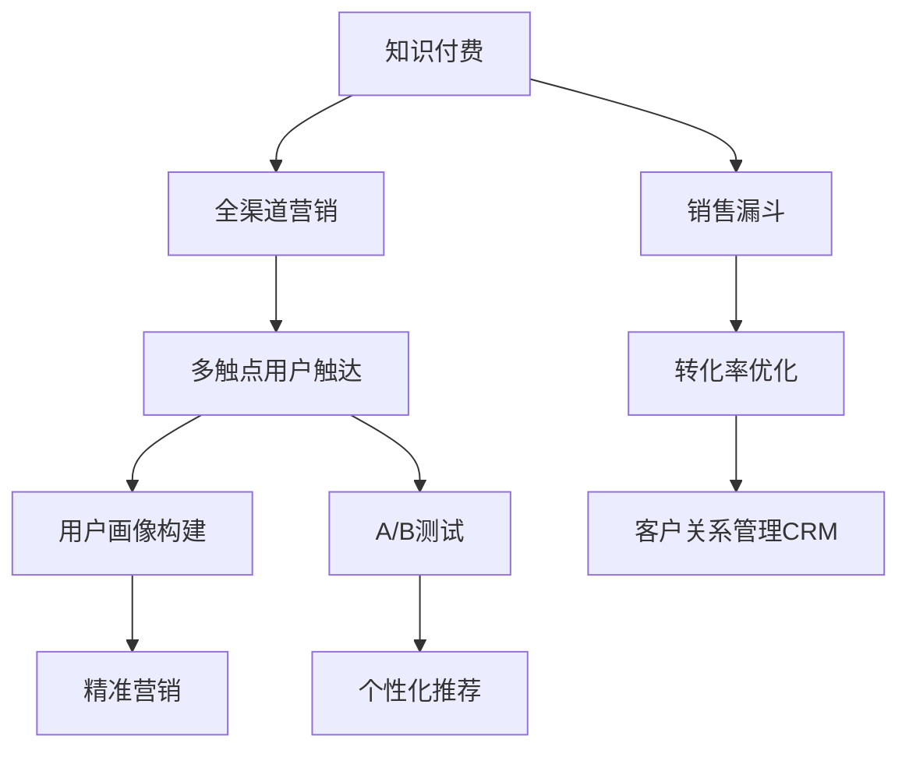

                 

## 1. 背景介绍

知识付费作为近年来兴起的一个新兴行业，依托于移动互联网和数字化技术的迅猛发展，迅速成为用户获取知识、提升能力的重要渠道。随着内容产品市场竞争的日益激烈，企业如何通过精准的营销与销售策略实现知识付费的全渠道覆盖，最大化其商业价值，成为当前行业亟需解决的关键问题。本文将从全渠道营销与销售的角度出发，探讨知识付费产业的现状、主要挑战和解决策略，帮助企业更好地布局和推广其知识付费产品。

## 2. 核心概念与联系

### 2.1 核心概念概述

为理解知识付费全渠道营销与销售的实现方式，本节将介绍几个核心概念：

- **知识付费**：通过在线付费订阅、按需付费、单次购买等方式为用户提供有价值的知识内容。知识付费的核心在于将优质内容进行商业化，形成用户与内容创作者之间的价值交换。
- **全渠道营销**：通过多种渠道（如网站、APP、社交媒体、邮件等）进行用户触达，多触点构建品牌形象，最大化营销效果。全渠道营销要求企业在不同渠道上保持品牌一致性，实现客户的多渠道覆盖和全生命周期管理。
- **销售漏斗**：用户从认知到最终购买的知识付费产品，需要经过多个转化阶段。销售漏斗模型帮助企业理解不同阶段用户的转化行为和需求，从而制定针对性的销售策略。
- **用户画像**：基于用户行为、属性、兴趣等信息，构建全面的用户画像。用户画像是制定精准营销策略、个性化推荐的基础。
- **A/B测试**：通过对比不同的营销策略，找到效果最优的方案。A/B测试可以帮助企业优化营销活动，提升转化率和用户体验。

### 2.2 核心概念原理和架构的 Mermaid 流程图



这个流程图展示了知识付费全渠道营销与销售的核心架构：

1. **知识付费**作为起点，是整个链条的基础。
2. **全渠道营销**通过多触点用户触达，提升用户认知和兴趣。
3. **用户画像构建**与**A/B测试**结合，实现精准营销和个性化推荐。
4. **销售漏斗**模型用于分析用户的转化行为，优化转化率。
5. **客户关系管理CRM**系统帮助企业维护和提升客户忠诚度。

通过以上各环节的协同作用，企业可以更有效地实现知识付费的全渠道营销与销售。

## 3. 核心算法原理 & 具体操作步骤

### 3.1 算法原理概述

知识付费全渠道营销与销售的实现，本质上是一个多维度的数据驱动决策过程。其核心算法原理包括：

- **用户行为分析**：通过数据分析技术，理解用户的访问、浏览、购买行为，识别潜在用户。
- **预测建模**：利用机器学习算法，预测用户未来行为，如是否会购买，推荐哪些内容。
- **多渠道优化**：通过A/B测试和算法优化，确定最佳的营销策略和渠道组合。
- **个性化推荐**：根据用户画像，推荐用户感兴趣的内容，提升用户体验和满意度。

### 3.2 算法步骤详解

1. **数据采集与清洗**：从各个渠道收集用户数据，包括点击、浏览、购买等行为数据，并进行清洗和处理。

2. **用户画像构建**：利用机器学习算法对用户数据进行聚类和分析，构建全面的用户画像。

3. **预测建模**：利用回归、分类、聚类等机器学习算法，预测用户未来行为。

4. **A/B测试**：在各个渠道上设计不同的营销策略，通过A/B测试确定最优方案。

5. **多渠道优化**：根据A/B测试结果，优化各渠道的营销策略和资源分配，提升整体效果。

6. **个性化推荐**：基于用户画像，利用协同过滤、内容推荐算法，为不同用户提供个性化内容推荐。

### 3.3 算法优缺点

全渠道营销与销售算法的优点包括：

- **全面覆盖**：通过多触点营销，提升用户认知和兴趣，最大化品牌曝光。
- **精准推荐**：根据用户画像和行为数据，实现个性化推荐，提升用户粘性和转化率。
- **动态优化**：通过A/B测试和算法优化，不断调整策略，最大化营销效果。

其缺点包括：

- **数据复杂性**：多渠道的数据收集与整合复杂，需要高水平的IT支持。
- **模型复杂度**：算法模型的构建与优化难度大，需要丰富的数据科学知识和经验。
- **隐私风险**：用户数据的收集与分析涉及隐私保护问题，需遵循相关法律法规。

### 3.4 算法应用领域

知识付费全渠道营销与销售的算法可以应用于以下多个领域：

- **在线教育**：通过全渠道推广，提升课程报名率和续购率。
- **专业培训**：在技术、管理等专业领域，提供高质量的知识付费内容。
- **职业技能**：提供编程、设计、营销等实用技能的知识付费课程。
- **健康生活**：在健康、养生、运动等领域，提供专业的知识和咨询服务。
- **个人成长**：在自我提升、时间管理、心理调适等方面，提供实用的知识和技巧。

## 4. 数学模型和公式 & 详细讲解 & 举例说明

### 4.1 数学模型构建

我们以用户行为预测为例，构建数学模型。假设用户行为数据为 $D=\{(x_i,y_i)\}_{i=1}^N$，其中 $x_i$ 为特征向量，$y_i$ 为行为标签（如是否购买）。我们需要找到一个最优的预测模型 $f(x;\theta)$，使得预测值 $y_i'$ 与真实值 $y_i$ 的误差最小。

### 4.2 公式推导过程

以线性回归模型为例，预测函数为 $y_i' = \theta_0 + \sum_{j=1}^n \theta_j x_{ij}$，其中 $\theta_0,\theta_j$ 为模型参数。最小二乘法的优化目标为：

$$
\min_{\theta} \sum_{i=1}^N (y_i - y_i')^2
$$

通过求解该优化问题，得到模型参数 $\theta$。在实践中，通常采用梯度下降算法进行迭代优化。

### 4.3 案例分析与讲解

以某在线教育平台为例，分析用户购买行为的预测模型。该平台收集了用户浏览、点击、购买等行为数据，构建了用户画像。通过线性回归模型，预测用户未来是否会购买课程。具体步骤如下：

1. **数据准备**：从平台后台提取用户行为数据，包括浏览时间、点击次数、购买记录等。
2. **特征工程**：根据业务需求，构建特征向量 $x_i$，如浏览时间、课程评分、用户评分等。
3. **模型训练**：利用线性回归模型对用户数据进行拟合，得到预测函数 $f(x;\theta)$。
4. **模型评估**：在验证集上评估模型性能，如均方误差（MSE）、平均绝对误差（MAE）等指标。
5. **模型优化**：根据评估结果，调整模型参数，优化模型预测效果。

通过上述步骤，平台能够准确预测用户是否会购买课程，从而制定更加精准的营销策略。

## 5. 项目实践：代码实例和详细解释说明

### 5.1 开发环境搭建

项目开发需要以下环境：

1. **编程语言**：Python，配合Pandas、NumPy、Scikit-learn等数据处理库。
2. **机器学习框架**：Scikit-learn，提供简单易用的机器学习模型实现。
3. **可视化工具**：Matplotlib、Seaborn等，用于数据可视化。

**Python环境搭建**：

```bash
# 安装Python
sudo apt-get update
sudo apt-get install python3
# 安装必要的Python包
pip install pandas numpy matplotlib seaborn scikit-learn
```

### 5.2 源代码详细实现

以下是一个简单的用户购买行为预测的代码实现：

```python
import pandas as pd
from sklearn.linear_model import LinearRegression

# 数据准备
data = pd.read_csv('user_behavior.csv')
X = data[['浏览时间', '课程评分', '用户评分']]
y = data['是否购买']

# 特征工程
X = X.fillna(0)

# 模型训练
model = LinearRegression()
model.fit(X, y)

# 模型评估
test_data = pd.read_csv('test_user_behavior.csv')
X_test = test_data[['浏览时间', '课程评分', '用户评分']]
y_pred = model.predict(X_test)
```

### 5.3 代码解读与分析

代码中，首先使用Pandas加载数据，并进行数据预处理。然后，使用Scikit-learn中的LinearRegression模型进行训练和预测。预测模型通过均方误差（MSE）评估，结果可用于后续的个性化推荐和精准营销。

### 5.4 运行结果展示

```python
import matplotlib.pyplot as plt

# 可视化结果
plt.scatter(test_data['浏览时间'], y_test, label='实际值')
plt.scatter(test_data['浏览时间'], y_pred, label='预测值')
plt.legend()
plt.show()
```

运行结果展示了预测值与实际值之间的对比，通过散点图直观展示模型预测效果。

## 6. 实际应用场景

### 6.1 智能客服系统

知识付费平台可以部署智能客服系统，提供7x24小时在线服务，解答用户疑问。智能客服系统基于机器学习和自然语言处理技术，可以理解用户意图，自动生成常见问题和答案，提升用户满意度。

### 6.2 个性化推荐

知识付费平台可以利用预测模型和推荐算法，为每个用户推荐最适合的内容。基于用户行为数据和个性化模型，平台可以实时调整推荐策略，提升用户粘性和满意度。

### 6.3 营销推广

知识付费平台可以通过社交媒体、邮件、短信等多种渠道进行推广，利用多渠道触达提高用户认知和兴趣。通过A/B测试和算法优化，平台可以找到最优的营销策略，最大化推广效果。

### 6.4 未来应用展望

随着大数据、人工智能技术的不断进步，知识付费全渠道营销与销售将迎来更多创新。未来，以下技术值得关注：

- **AI聊天机器人**：利用自然语言处理技术，实现与用户的实时互动和问题解答。
- **区块链技术**：保障知识付费内容版权和交易安全，提升用户信任度。
- **全息AR技术**：通过增强现实技术，提供沉浸式的学习体验。
- **NLP技术**：提升用户与内容之间的交互质量，优化推荐效果。

## 7. 工具和资源推荐

### 7.1 学习资源推荐

1. **《Python数据科学手册》**：全面介绍了Python在数据科学中的应用，包括Pandas、NumPy、Scikit-learn等库的使用。
2. **《机器学习实战》**：提供机器学习算法的具体实现，适合初学者入门。
3. **《深度学习》**：由深度学习权威Ian Goodfellow撰写，介绍了深度学习的理论基础和应用实践。
4. **Coursera在线课程**：提供多门与数据科学、机器学习相关的课程，涵盖数据处理、模型训练、算法优化等。

### 7.2 开发工具推荐

1. **PyCharm**：流行的Python IDE，提供丰富的开发工具和插件支持。
2. **Jupyter Notebook**：用于编写和分享数据分析、机器学习等代码的在线编辑器。
3. **Kaggle**：提供海量数据集和竞赛平台，助力数据科学项目实践。

### 7.3 相关论文推荐

1. **《深度学习》**：Ian Goodfellow等著，介绍了深度学习的基础理论、算法和应用。
2. **《全渠道营销》**：Tom Byrne等著，探讨了全渠道营销的理论基础和实践案例。
3. **《知识付费》**：Huang Wei等著，介绍了知识付费产业的现状、挑战和未来发展方向。

## 8. 总结：未来发展趋势与挑战

### 8.1 研究成果总结

本文从全渠道营销与销售的角度，探讨了知识付费产业的现状、主要挑战和解决策略。通过数据驱动的用户行为分析、预测建模和个性化推荐，企业可以实现精准营销和销售。未来，随着技术的不断进步，知识付费将迎来更多创新，包括AI聊天机器人、区块链技术、全息AR等。

### 8.2 未来发展趋势

知识付费全渠道营销与销售的趋势包括：

- **技术融合**：人工智能、大数据、区块链等技术将不断融合，提升知识付费的智能化和安全性。
- **个性化推荐**：通过深度学习算法，实现更加精准和个性化的内容推荐。
- **全渠道触达**：利用社交媒体、邮件、短信等多渠道触达用户，提升用户认知和兴趣。
- **营销自动化**：通过智能客服、智能推荐等技术，自动化用户服务和管理。

### 8.3 面临的挑战

知识付费全渠道营销与销售面临以下挑战：

- **数据隐私**：用户数据的收集和分析涉及隐私保护问题，需遵循相关法律法规。
- **数据质量**：数据质量差或数据缺失，将影响模型的预测效果和决策质量。
- **模型复杂度**：算法模型的构建与优化难度大，需要丰富的数据科学知识和经验。
- **资源消耗**：大规模数据处理和模型训练需要高算力支持，需投入大量硬件资源。

### 8.4 研究展望

未来的研究方向包括：

- **隐私保护**：如何保护用户隐私，同时实现数据的高效利用。
- **算法优化**：优化机器学习算法，提升预测精度和效率。
- **多模态融合**：结合语音、图像等多种模态数据，提升用户交互体验。
- **实时处理**：通过分布式计算和流式处理技术，实现实时推荐和营销。

## 9. 附录：常见问题与解答

**Q1：知识付费平台如何构建用户画像？**

A: 知识付费平台可以通过收集用户行为数据，包括浏览、点击、购买、评价等，构建全面的用户画像。具体步骤如下：

1. 收集用户行为数据，构建特征向量。
2. 使用聚类算法对用户进行分类，识别不同用户群体的特征。
3. 使用关联规则算法挖掘用户行为之间的关联关系。
4. 利用主成分分析（PCA）等降维技术，优化用户画像的表示。

**Q2：如何进行多渠道的A/B测试？**

A: 多渠道A/B测试需要以下步骤：

1. 设计测试方案，确定测试的目标和指标。
2. 在各个渠道上部署测试版本，收集用户反馈。
3. 分析测试数据，对比不同版本的效果。
4. 根据测试结果，优化各渠道的营销策略。

**Q3：如何优化销售漏斗模型？**

A: 销售漏斗模型的优化包括：

1. 收集用户行为数据，构建销售漏斗模型。
2. 使用机器学习算法，识别用户流失的关键节点。
3. 通过A/B测试，优化各个节点的用户体验。
4. 优化推荐系统，提高用户转化率。

**Q4：如何实现全渠道的用户触达和营销？**

A: 实现全渠道的用户触达和营销，需要：

1. 收集各渠道的用户行为数据，构建统一的用户画像。
2. 使用机器学习算法，预测用户行为和兴趣。
3. 通过A/B测试，确定最佳的营销策略。
4. 在不同渠道上实施精准营销，提升用户认知和兴趣。

---

作者：禅与计算机程序设计艺术 / Zen and the Art of Computer Programming

