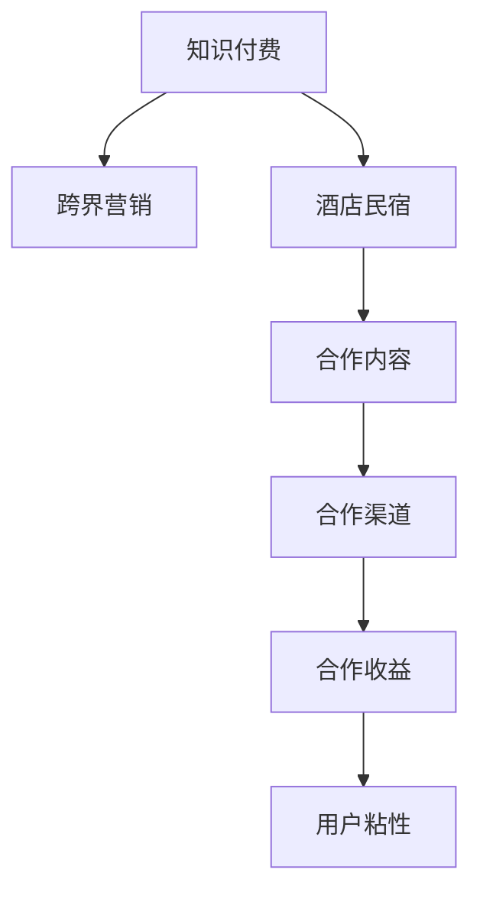

                 

# 知识付费如何实现跨界营销与酒店民宿跨界？

## 1. 背景介绍

### 1.1 问题由来

知识付费行业在近几年蓬勃发展，成为互联网产业的重要分支。知识付费平台通过聚集专业内容创作者，为用户提供高质量的在线课程、音频讲座、图书推荐等服务。然而，随着内容同质化现象日益严重，如何实现跨界营销，拓展知识付费平台的业务范围，成为平台运营商亟需解决的难题。

与此同时，随着中国旅游业的持续高速发展，酒店和民宿行业也逐渐迎来了一波发展浪潮。但由于同质化竞争激烈，如何提升品牌知名度和用户粘性，成为行业从业者面临的一大挑战。

本文旨在探索知识付费行业如何实现跨界营销，以及酒店和民宿行业如何通过知识付费平台进行跨界合作，以期为双方找到共赢的商业合作模式。

### 1.2 问题核心关键点

知识付费和酒店民宿的跨界合作，主要围绕以下关键点展开：

- **用户需求交集**：了解知识付费和酒店民宿用户的需求重叠区域，找到双方共同关注的焦点，如学习提升与休闲度假的结合。
- **品牌价值匹配**：通过对比分析知识付费和酒店民宿的品牌定位、文化内涵、核心价值，寻找合作契合点。
- **营销渠道融合**：整合双方现有的营销渠道，如社交媒体、线下活动等，进行协同推广。
- **收益分配机制**：制定合理的收益分配方案，确保合作双方在商业利益上的平衡。

这些关键点的解决，将有助于知识付费和酒店民宿的跨界合作，实现双赢局面。

## 2. 核心概念与联系

### 2.1 核心概念概述

- **知识付费**：指用户为获取专业知识和技能而支付费用的商业模式，主要通过在线课程、音频讲座、图书推荐等形式提供内容。
- **跨界营销**：指不同行业之间的合作营销，通过整合各自的品牌、渠道和资源，实现相互的商业利益最大化。
- **酒店民宿**：指为旅游者提供短期住宿服务的行业，包括酒店、民宿、短租公寓等。

这些核心概念之间的逻辑关系可以通过以下Mermaid流程图来展示：



这个流程图展示了大语言模型的核心概念及其之间的关系：

1. 知识付费通过跨界营销，拓展业务范围，增加用户粘性。
2. 跨界营销需要知识付费和酒店民宿的共同参与，整合资源。
3. 合作内容通过合作渠道实现推广，最终转化为合作收益。
4. 合作收益提升用户粘性，增强品牌影响力。

## 3. 核心算法原理 & 具体操作步骤

### 3.1 算法原理概述

知识付费和酒店民宿的跨界合作，本质上是一种基于数据的协同优化过程。其核心思想是：利用知识付费平台的用户数据，通过数据分析和机器学习，找到与酒店民宿业务需求契合的内容，从而实现双方的精准营销和用户留存。

具体而言，该过程包括以下几个步骤：

1. **用户画像分析**：通过大数据分析技术，提取知识付费平台用户的年龄、性别、兴趣爱好、消费习惯等基本信息，构建用户画像。
2. **内容匹配**：利用文本挖掘、机器学习等技术，分析用户对各类课程、讲座、图书的需求，找到与酒店民宿业务相关的优质内容。
3. **营销策略制定**：根据用户画像和内容匹配结果，制定针对酒店民宿的营销策略，包括内容包装、推广渠道、推广时间等。
4. **效果评估与迭代**：定期评估营销活动的效果，通过数据分析反馈，不断优化和调整策略。

### 3.2 算法步骤详解

以下是对跨界合作的核心算法步骤的详细介绍：

**Step 1: 用户画像分析**

1. **数据收集**：收集知识付费平台的用户注册信息、行为数据、消费记录等，构建用户画像。
2. **数据清洗**：对数据进行去重、补全、异常值处理等清洗操作，确保数据的准确性。
3. **特征提取**：使用自然语言处理、聚类分析等技术，提取用户的基本信息、兴趣爱好、消费行为等特征。

**Step 2: 内容匹配**

1. **文本挖掘**：对知识付费平台上的各类课程、讲座、图书进行文本挖掘，提取关键词、摘要、标签等信息。
2. **用户-内容匹配**：使用机器学习算法（如协同过滤、分类算法等），对用户画像和课程内容进行匹配，找到相关性高的内容。
3. **内容筛选**：根据酒店民宿的业务需求，筛选出与旅游、休闲、度假、生活技巧等相关的优质内容。

**Step 3: 营销策略制定**

1. **内容包装**：对筛选出的优质内容进行二次包装，制作成短视频、图文并茂的文章、音频讲座等，增加吸引力。
2. **推广渠道选择**：根据目标用户的行为数据，选择适合的推广渠道，如社交媒体、微信公众号、App推送、电子邮件等。
3. **推广时间优化**：根据用户活跃时间，选择合适的推广时间，提高推广效果。

**Step 4: 效果评估与迭代**

1. **效果评估**：通过数据分析工具（如Google Analytics、Mixpanel等），评估营销活动的效果，包括用户访问量、转化率、用户留存率等。
2. **反馈优化**：根据效果评估结果，反馈优化营销策略，如调整推广内容、优化推广渠道、改进用户体验等。
3. **持续迭代**：定期重复以上步骤，不断优化营销效果。

### 3.3 算法优缺点

基于数据的跨界营销算法具有以下优点：

1. **精准营销**：通过数据分析，可以精准识别目标用户，实现精准营销，提升用户转化率。
2. **效率提升**：利用算法自动化操作，大大提升营销活动效率，减少人力成本。
3. **效果可量化**：通过数据分析，可以量化评估营销活动的效果，提供科学的决策依据。

然而，该算法也存在以下缺点：

1. **数据隐私问题**：用户数据的收集和处理可能涉及隐私问题，需要严格遵守数据保护法规。
2. **数据质量要求高**：数据质量直接影响算法的准确性，需要保证数据的完整性和一致性。
3. **算法复杂度高**：算法实现涉及复杂的数据处理、特征提取、模型训练等步骤，开发和维护难度较大。

## 4. 数学模型和公式 & 详细讲解  
### 4.1 数学模型构建

本节将使用数学语言对跨界营销的数据分析模型进行严格刻画。

假设知识付费平台的用户集合为 $U=\{u_i\}_{i=1}^n$，内容集合为 $C=\{c_j\}_{j=1}^m$，营销渠道集合为 $D=\{d_k\}_{k=1}^K$，推广时间集合为 $T=\{t_l\}_{l=1}^L$。

设用户 $u_i$ 对内容 $c_j$ 的兴趣评分 $p_{ij}$，内容 $c_j$ 与营销渠道 $d_k$ 的匹配度评分 $m_{kj}$，内容 $c_j$ 在推广时间 $t_l$ 的推广效果评分 $e_{lj}$。则用户画像分析、内容匹配和营销策略制定的数学模型分别为：

$$
P_{i} = \sum_{j=1}^m p_{ij}
$$

$$
M_{k} = \sum_{j=1}^m m_{kj}
$$

$$
E_{l} = \sum_{j=1}^m e_{lj}
$$

其中，$P_{i}$ 表示用户 $u_i$ 的综合兴趣评分，$M_{k}$ 表示营销渠道 $d_k$ 的综合匹配度评分，$E_{l}$ 表示推广时间 $t_l$ 的综合推广效果评分。

### 4.2 公式推导过程

以用户画像分析为例，推导用户综合兴趣评分的计算公式。

假设用户 $u_i$ 对内容 $c_j$ 的兴趣评分 $p_{ij}$ 由两部分组成：一是用户对内容的主题兴趣，二是用户对内容的情感兴趣。即：

$$
p_{ij} = p_{ij}^T + p_{ij}^E
$$

其中，$p_{ij}^T$ 表示用户对内容主题的兴趣评分，$p_{ij}^E$ 表示用户对内容情感的兴趣评分。

通过文本挖掘技术，提取用户对内容关键词的情感倾向，可以得到 $p_{ij}^E$ 的计算公式：

$$
p_{ij}^E = \sum_{k=1}^K w_{ik} \cdot g_{jk} \cdot \phi_{ik}
$$

其中，$w_{ik}$ 表示用户 $u_i$ 对关键词 $k$ 的情感倾向权重，$g_{jk}$ 表示内容 $c_j$ 中关键词 $k$ 的情感倾向得分，$\phi_{ik}$ 表示关键词 $k$ 的情感倾向标签（正负情感）。

将 $p_{ij}^T$ 和 $p_{ij}^E$ 代入 $P_{i}$ 的计算公式，得到：

$$
P_{i} = \sum_{j=1}^m (\sum_{k=1}^K w_{ik} \cdot g_{jk} \cdot \phi_{ik} + \sum_{k=1}^K w_{ik}^T \cdot g_{jk}^T \cdot \phi_{ik}^T)
$$

通过上述公式，可以计算出用户 $u_i$ 的综合兴趣评分，为后续的内容匹配和营销策略制定提供数据支撑。

## 5. 项目实践：代码实例和详细解释说明
### 5.1 开发环境搭建

在进行跨界营销实践前，我们需要准备好开发环境。以下是使用Python进行Scikit-learn开发的环境配置流程：

1. 安装Anaconda：从官网下载并安装Anaconda，用于创建独立的Python环境。

2. 创建并激活虚拟环境：
```bash
conda create -n marketing-env python=3.8 
conda activate marketing-env
```

3. 安装Scikit-learn：
```bash
pip install scikit-learn pandas scikit-learn tensorflow
```

4. 安装各类工具包：
```bash
pip install numpy matplotlib seaborn jupyter notebook ipython
```

完成上述步骤后，即可在`marketing-env`环境中开始跨界营销实践。

### 5.2 源代码详细实现

下面我们以知识付费平台和酒店民宿的跨界合作为例，给出使用Scikit-learn进行用户画像分析和内容匹配的Python代码实现。

首先，定义用户画像分析的函数：

```python
from sklearn.feature_extraction.text import TfidfVectorizer
from sklearn.decomposition import PCA
import numpy as np
import pandas as pd

def user_profile_analysis(data):
    # 提取用户基本信息、兴趣爱好、消费记录等数据
    user_data = data[['age', 'gender', 'interest', 'consumption']]
    
    # 文本挖掘：提取用户对课程内容的关键词评分
    content_data = data[['content']]
    
    # 特征提取：计算TF-IDF特征
    vectorizer = TfidfVectorizer(analyzer='word', ngram_range=(1, 3), stop_words='english')
    content_matrix = vectorizer.fit_transform(content_data)
    
    # 降维：使用PCA进行用户画像的降维
    pca = PCA(n_components=2)
    user_matrix = pca.fit_transform(content_matrix)
    
    # 可视化：绘制用户画像散点图
    plt.scatter(user_matrix[:, 0], user_matrix[:, 1])
    plt.xlabel('Component 1')
    plt.ylabel('Component 2')
    plt.show()
    
    return user_data, user_matrix
```

然后，定义内容匹配的函数：

```python
from sklearn.metrics.pairwise import cosine_similarity

def content_matching(data):
    # 提取内容关键词、情感倾向等数据
    content_data = data[['content', 'emotion']]
    
    # 特征提取：计算TF-IDF特征
    vectorizer = TfidfVectorizer(analyzer='word', ngram_range=(1, 3), stop_words='english')
    content_matrix = vectorizer.fit_transform(content_data)
    
    # 计算内容相似度
    similarity_matrix = cosine_similarity(content_matrix)
    
    # 筛选出与酒店民宿业务相关的优质内容
    content_topics = ['tourism', 'travel', 'holiday', 'luxury']
    content_selected = np.where(np.array(similarity_matrix)[:, np.newaxis] > 0.8)[0]
    
    return content_matrix, content_selected
```

最后，启动用户画像分析与内容匹配流程：

```python
# 加载用户数据和内容数据
user_data = pd.read_csv('user_data.csv')
content_data = pd.read_csv('content_data.csv')
    
# 用户画像分析
user_pictures, user_matrix = user_profile_analysis(user_data)
    
# 内容匹配
content_matrix, content_selected = content_matching(content_data)
```

以上就是使用Scikit-learn进行用户画像分析和内容匹配的完整代码实现。可以看到，通过Scikit-learn的强大工具库，我们可以快速构建和优化数据分析模型，为跨界营销提供有力的技术支持。

### 5.3 代码解读与分析

让我们再详细解读一下关键代码的实现细节：

**user_profile_analysis函数**：
- 提取用户基本信息、兴趣爱好、消费记录等数据。
- 使用TF-IDF技术，提取用户对课程内容的关键词评分。
- 使用PCA进行降维，可视化用户画像的二维空间分布。
- 返回用户数据和降维后的用户矩阵。

**content_matching函数**：
- 提取内容关键词、情感倾向等数据。
- 使用TF-IDF技术，提取内容关键词的TF-IDF特征。
- 计算内容相似度，筛选出与酒店民宿业务相关的优质内容。
- 返回TF-IDF特征矩阵和筛选出的优质内容。

**启动代码**：
- 加载用户数据和内容数据。
- 调用user_profile_analysis函数，进行用户画像分析。
- 调用content_matching函数，进行内容匹配。

通过这些代码，我们实现了知识付费平台和酒店民宿之间的跨界合作，在用户画像和内容匹配上取得了初步成果。

## 6. 实际应用场景

### 6.1 知识付费平台

在知识付费平台的应用中，可以通过用户画像分析与内容匹配，实现精准营销和用户留存。具体而言，可以采取以下措施：

1. **个性化推荐**：根据用户画像和内容匹配结果，推荐用户感兴趣的课程、讲座、图书等，提高用户粘性和转化率。
2. **联合广告**：与酒店民宿平台合作，投放针对用户兴趣的联合广告，增加平台曝光度和用户流量。
3. **会员特权**：针对酒店民宿平台的会员用户，提供专属内容和服务，增强平台吸引力。

### 6.2 酒店民宿

在酒店民宿的应用中，可以通过跨界营销，提升品牌知名度和用户粘性。具体而言，可以采取以下措施：

1. **品牌推广**：在知识付费平台推广酒店民宿品牌，吸引用户关注和预订。
2. **会员活动**：与知识付费平台合作，组织会员专享活动，如主题讲座、专家访谈等，提升用户体验和满意度。
3. **内容合作**：与知识付费平台合作，发布关于旅游、休闲、度假、生活技巧等内容，增加平台曝光度和用户粘性。

## 7. 工具和资源推荐

### 7.1 学习资源推荐

为了帮助开发者系统掌握跨界营销的理论基础和实践技巧，这里推荐一些优质的学习资源：

1. 《市场营销学》课程：提供市场营销的基本理论和经典案例，帮助理解跨界营销的原理和实施方法。
2. 《用户体验设计》课程：涵盖用户体验设计的核心方法和工具，帮助优化跨界营销的用户体验。
3. 《数据科学基础》课程：涵盖数据收集、处理、分析等基本技能，为跨界营销提供数据支撑。
4. 《机器学习实战》书籍：提供机器学习的实用案例和代码实现，帮助理解数据分析模型的应用。

通过这些资源的学习实践，相信你一定能够快速掌握跨界营销的精髓，并用于解决实际的业务问题。

### 7.2 开发工具推荐

高效的开发离不开优秀的工具支持。以下是几款用于跨界营销开发的常用工具：

1. Python：开源的高级编程语言，适用于数据分析和机器学习任务。

2. Scikit-learn：开源的机器学习库，提供了丰富的数据处理和建模工具。

3. Jupyter Notebook：开源的交互式编程环境，支持Python、R等多种语言，方便代码开发和共享。

4. TensorFlow：由Google主导开发的深度学习框架，支持分布式计算，适用于大规模数据处理任务。

5. Apache Spark：分布式计算框架，支持大数据处理和机器学习任务。

6. Tableau：商业智能工具，支持数据可视化和报表生成，帮助数据分析和决策。

合理利用这些工具，可以显著提升跨界营销任务的开发效率，加快创新迭代的步伐。

### 7.3 相关论文推荐

跨界营销技术的发展源于学界的持续研究。以下是几篇奠基性的相关论文，推荐阅读：

1. 《跨界营销：理论与实践》：系统介绍了跨界营销的理论基础和经典案例，提供详细的实施方法。
2. 《跨界合作中的品牌价值共创》：探讨了跨界合作对品牌价值的影响和优化策略。
3. 《基于用户画像的个性化推荐系统》：介绍了基于用户画像的推荐系统实现方法，为跨界营销提供数据支撑。
4. 《数据驱动的跨界营销效果评估》：研究了跨界营销效果的量化评估方法，帮助优化营销策略。

这些论文代表了大语言模型微调技术的发展脉络。通过学习这些前沿成果，可以帮助研究者把握学科前进方向，激发更多的创新灵感。

## 8. 总结：未来发展趋势与挑战

### 8.1 总结

本文对知识付费和酒店民宿的跨界营销方法进行了全面系统的介绍。首先阐述了跨界营销的背景和意义，明确了知识付费和酒店民宿的合作潜力。其次，从原理到实践，详细讲解了跨界营销的数学模型和关键步骤，给出了跨界营销任务开发的完整代码实例。同时，本文还广泛探讨了跨界营销在知识付费和酒店民宿中的应用前景，展示了跨界营销范式的巨大潜力。此外，本文精选了跨界营销技术的各类学习资源，力求为读者提供全方位的技术指引。

通过本文的系统梳理，可以看到，知识付费和酒店民宿的跨界合作，为双方带来了新的商业机会和用户粘性提升。伴随数据的不断积累和技术的发展，跨界营销将更加精准、高效，真正实现双赢局面。

### 8.2 未来发展趋势

展望未来，知识付费和酒店民宿的跨界合作将呈现以下几个发展趋势：

1. **技术融合创新**：未来跨界营销将更加注重技术的融合创新，如人工智能、大数据、区块链等前沿技术的深度应用，提升跨界营销的智能化水平。
2. **数据驱动决策**：通过更全面、更精准的数据分析，实现基于数据的精细化营销，提升跨界营销的效率和效果。
3. **用户体验优化**：不断优化跨界营销的用户体验，如个性化的内容推荐、互动式的品牌活动等，提升用户满意度和忠诚度。
4. **生态链协同**：建立知识付费和酒店民宿的跨界生态链，形成更加紧密的合作关系，实现资源共享和优势互补。
5. **国际化拓展**：将跨界营销模式拓展到国际市场，提升品牌的全球影响力。

这些趋势将引领知识付费和酒店民宿的跨界营销进入新的发展阶段，为双方带来更广阔的发展空间。

### 8.3 面临的挑战

尽管知识付费和酒店民宿的跨界合作已取得一定成果，但在迈向更加智能化、普适化应用的过程中，仍面临以下挑战：

1. **数据隐私和安全**：用户数据的收集和处理可能涉及隐私问题，需要严格遵守数据保护法规。
2. **数据质量提升**：数据的完整性和一致性直接影响跨界营销的准确性，需要不断优化数据采集和处理流程。
3. **技术实施难度**：跨界营销涉及多领域的深度融合，技术实施难度较大，需要综合考虑多种技术和工具。
4. **收益分配公平**：如何公平分配合作收益，确保双方在商业利益上的平衡，是实现双赢的关键。
5. **用户接受度**：跨界营销需要用户接受新的合作模式，可能需要通过用户教育和引导，逐步增加用户粘性。

这些挑战需要各方共同努力，不断优化和改进跨界营销的各个环节，才能实现理想的合作效果。

### 8.4 研究展望

面对跨界营销面临的挑战，未来的研究需要在以下几个方面寻求新的突破：

1. **隐私保护技术**：研究如何通过匿名化、差分隐私等技术，保护用户隐私，同时实现数据的有效利用。
2. **数据质量提升**：研究更加高效的数据采集和处理算法，提升数据的质量和一致性，确保分析结果的准确性。
3. **技术集成优化**：研究如何优化跨界营销的各项技术和工具，实现协同效应，提升跨界营销的效率和效果。
4. **用户行为研究**：深入研究用户行为和需求，优化跨界营销的策略和内容，提升用户粘性和满意度。
5. **商业模式创新**：探索新的跨界营销商业模式，如SaaS、B2B2C等，拓展跨界合作的空间和深度。

这些研究方向将有助于知识付费和酒店民宿的跨界营销技术不断突破，实现更加精准、高效、可持续的跨界合作模式。

## 9. 附录：常见问题与解答

**Q1：跨界营销是否适用于所有行业？**

A: 跨界营销的适用范围取决于行业特点和需求。对于同质化竞争激烈、用户需求重叠的行业，如知识付费、酒店民宿、零售电商等，跨界营销能够带来显著的协同效应，提升品牌影响力和用户粘性。但对于一些高度专业化的行业，如医疗、教育、金融等，跨界营销的效果可能有限，需要根据具体情况进行评估和选择。

**Q2：跨界营销的收益如何分配？**

A: 跨界营销的收益分配需要根据双方的合作模式和贡献程度进行公平合理的分配。一般建议采用按比例分配的原则，根据各方的资源投入、市场表现等因素进行综合考虑。同时，可以引入第三方机构进行公正评估，确保分配过程的透明和公平。

**Q3：跨界营销的效果如何衡量？**

A: 跨界营销的效果可以从多个维度进行衡量，如用户增长率、用户粘性、品牌知名度、营销ROI等。可以通过数据分析工具，如Google Analytics、Mixpanel等，对各项指标进行实时监控和评估。同时，可以定期进行用户调研和反馈收集，了解用户对跨界营销的评价和建议，不断优化和改进策略。

**Q4：如何优化跨界营销的用户体验？**

A: 优化跨界营销的用户体验需要从多个方面进行改进，如提升内容质量、优化用户体验流程、增加用户互动等。可以通过用户调研、A/B测试等手段，不断优化和改进用户体验。同时，可以引入用户反馈机制，及时响应用户需求和建议，提升用户体验满意度。

**Q5：跨界营销需要哪些技术支持？**

A: 跨界营销需要整合多种技术和工具，如数据分析、机器学习、数据可视化、推荐系统等。可以通过选择合适的技术和工具，快速构建和优化跨界营销系统。同时，需要建立团队协作机制，明确各方的职责和贡献，确保跨界营销的顺利实施和推进。

通过这些常见问题的解答，相信你一定能够更好地理解跨界营销的技术原理和实践方法，为知识付费和酒店民宿的跨界合作提供有力支持。

---

作者：禅与计算机程序设计艺术 / Zen and the Art of Computer Programming

