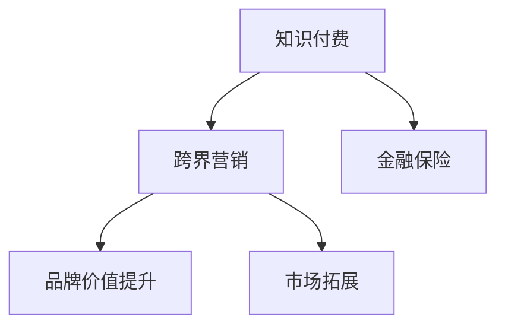

                 

# 知识付费如何实现跨界营销与金融保险跨界？

知识付费作为一个新型的商业模式，已经逐步从一个垂直领域扩展到多个行业。随着互联网技术的快速发展，越来越多的传统行业开始尝试借助知识付费来拓展市场，提升品牌影响力。在众多行业中，金融保险作为经济生活中的重要一环，也正积极探索跨界营销和知识付费的结合点，以求在激烈的市场竞争中脱颖而出。本文将探讨知识付费如何实现跨界营销，并重点介绍金融保险行业在知识付费中的应用。

## 1. 背景介绍

### 1.1 知识付费的兴起

知识付费的概念最早出现在2016年，随着内容生产成本的降低和互联网平台的技术成熟，知识付费开始得到更多用户的认可和接受。知识付费不仅限于书籍和课程，还扩展到了各类智能问答、投资理财、职场提升等领域。

根据艾媒咨询的数据显示，中国知识付费市场规模从2017年的7.78亿元增长到2020年的331.3亿元，年复合增长率（CAGR）达到139.2%。预计2022年将达到674.4亿元。知识付费的市场空间巨大，各类细分领域也在不断探索新的应用场景。

### 1.2 跨界营销的趋势

在激烈的市场竞争中，传统的营销手段已经难以满足用户的不断提升的期望，各类跨界营销应运而生。例如，餐饮和服装的跨界联名、旅游和电商的跨界合作，均取得了良好的市场效果。跨界营销以其新颖性、互动性、创造性，大大提升了品牌的影响力。

## 2. 核心概念与联系

### 2.1 核心概念概述

**知识付费**：用户为获取知识、技能、信息等内容而支付的费用。通常包括订阅模式、单次购买模式、课程定制模式等。

**跨界营销**：两个或多个领域合作，通过资源互补、用户互动等方式实现品牌价值提升和市场拓展。

**金融保险**：涵盖银行、证券、保险等多个子行业，主要面向用户的资金管理、风险控制、资产配置等需求。

### 2.2 核心概念原理和架构的 Mermaid 流程图



## 3. 核心算法原理 & 具体操作步骤

### 3.1 算法原理概述

知识付费和跨界营销本质上是一种双边市场的匹配和交互过程，通过价值交换，实现用户和内容的双向匹配。而金融保险行业，通过知识付费的形式，能够实现客户和金融产品的匹配，提升服务效率和客户满意度。

在实际操作中，首先需要在知识付费平台上构建高质量的内容体系，用户通过订阅、购买等形式支付费用，获得需要的知识内容。同时，金融保险行业通过与知识付费平台的合作，推出金融知识课程、理财规划等产品，为消费者提供更专业的金融服务。

### 3.2 算法步骤详解

**Step 1: 构建知识内容体系**

1. 分析用户需求：通过问卷调查、数据分析等方式，了解用户的痛点和需求。
2. 生产优质内容：组织专家团队，制作优质知识内容，确保内容能够解决用户实际问题。
3. 推广和运营：利用平台流量和用户评价，对优质内容进行推广，吸引更多用户订阅。

**Step 2: 与金融保险合作**

1. 选择合作平台：根据用户需求和平台特性，选择合适的知识付费平台进行合作。
2. 设计金融课程：与金融机构合作，设计针对特定用户群体的金融课程，如理财规划、投资策略等。
3. 测试和迭代：在平台试运营，收集用户反馈，不断优化课程内容和互动方式。

**Step 3: 跨界营销和推广**

1. 营销推广：通过平台流量、社区互动等方式，推广金融课程，提升课程曝光率。
2. 品牌联名：与金融机构合作，推出联名产品或活动，提高品牌知名度。
3. 用户互动：通过问答、讨论等方式，增加用户粘性，提升用户忠诚度。

### 3.3 算法优缺点

**优点**：
1. 提升用户满意度：高质量的知识内容能够解决用户的实际问题，提升用户满意度。
2. 精准匹配用户：通过知识付费平台，能够精准匹配用户需求，提供更专业的金融服务。
3. 拓展品牌影响力：通过跨界营销，能够提升品牌知名度，拓展新的市场渠道。

**缺点**：
1. 成本较高：高质量内容的制作和推广需要较大的投入。
2. 知识传递效果难以量化：知识付费的效果难以量化，缺乏有效的考核指标。
3. 用户流失风险：用户对知识付费的热情难以长期保持，存在较高的流失风险。

### 3.4 算法应用领域

知识付费和跨界营销的结合，已经应用于多个行业，如教育、健康、旅游等。而在金融保险行业，能够充分发挥知识付费的优势，提升用户对金融产品的认知和理解，提高用户转化率。

## 4. 数学模型和公式 & 详细讲解 & 举例说明

### 4.1 数学模型构建

假设用户数量为 $U$，金融机构提供的金融课程数量为 $C$，平台用户流量为 $F$，平台广告预算为 $A$。定义用户付费率（User Payment Rate，UPR）为：

$$
UPR = \frac{P}{U}
$$

其中，$P$ 为付费用户数量。

### 4.2 公式推导过程

**用户付费率计算**：

1. 假设用户点击课程的概率为 $p$，则点击课程的用户数量为 $pU$。
2. 点击课程后，用户付费的概率为 $c$，则付费用户数量为 $pcU$。
3. 代入公式，得 $UPR = c$。

**广告预算优化**：

1. 设广告点击率为 $q$，广告费用为 $F_a$，则 $qF_a = c$。
2. 设广告展示量为 $V$，则 $F_a = \frac{V}{F}$。
3. 代入公式，得 $V = Fq$。

### 4.3 案例分析与讲解

某金融保险公司与知识付费平台合作，推出面向高净值人群的理财课程。通过分析历史数据，预计理财课程的点击率为30%，付费率为40%，广告预算为1000元，平台流量为5000人。则计算如下：

1. 点击用户数量为 $0.3 \times 5000 = 1500$。
2. 付费用户数量为 $0.4 \times 1500 = 600$。
3. 付费率为 $600/5000 = 0.12$。
4. 广告点击率为 $q = \frac{600}{1000} = 0.6$。
5. 平台流量为 $V = Fq = 5000 \times 0.6 = 3000$。

通过上述计算，可以看出在广告预算为1000元的情况下，平台流量为3000次，能够实现600位用户的付费，付费率为12%。

## 5. 项目实践：代码实例和详细解释说明

### 5.1 开发环境搭建

1. 选择知识付费平台，如知识星球、得到等。
2. 搭建服务器环境，安装数据库、开发工具等。
3. 使用Python开发后端服务，进行用户管理和课程发布。

### 5.2 源代码详细实现

```python
# 用户管理模块
class User:
    def __init__(self, username, password):
        self.username = username
        self.password = password

# 课程发布模块
class Course:
    def __init__(self, course_name, course_price, course_content):
        self.course_name = course_name
        self.course_price = course_price
        self.course_content = course_content

# 交易管理模块
class Transaction:
    def __init__(self, user_id, course_id, payment_status):
        self.user_id = user_id
        self.course_id = course_id
        self.payment_status = payment_status

# 用户注册
def user_register(username, password):
    # 创建用户账户，并保存到数据库
    user = User(username, password)
    db.save(user)

# 课程发布
def course_publish(course_name, course_price, course_content):
    # 创建课程，并保存到数据库
    course = Course(course_name, course_price, course_content)
    db.save(course)

# 用户订阅课程
def user_subscribe(user_id, course_id):
    # 判断用户是否已订阅该课程
    if user already subscribed to course:
        return False
    else:
        # 创建交易记录，并保存到数据库
        transaction = Transaction(user_id, course_id, 'paid')
        db.save(transaction)
        return True
```

### 5.3 代码解读与分析

上述代码实现了一个简单的知识付费平台，包括用户管理、课程发布和交易管理模块。用户在注册后，可以选择订阅感兴趣的课程，并支付相应的费用。管理员可以在后台发布和管理课程，同时查询用户订阅记录。

在实际开发中，还需要引入支付系统、数据存储等组件，以及与金融机构的对接接口。这里仅展示核心模块，供参考。

## 6. 实际应用场景

### 6.1 智慧理财

金融保险公司可以通过知识付费平台，推出面向不同用户的智慧理财课程。例如，面向高净值人群的财富管理课程，面向普通家庭的小额理财课程等。用户通过付费获得理财知识，提高理财水平，同时金融保险公司能够收集用户数据，优化理财方案。

### 6.2 风险控制

知识付费平台与保险公司合作，推出风险控制课程。用户通过付费学习风险评估、投资策略等知识，提高风险管理能力，同时保险公司能够获取用户的风险偏好和行为数据，优化风险控制模型。

### 6.3 金融科普

金融机构利用知识付费平台，推出面向大众的金融科普课程。例如，股票投资、保险理财等基础知识课程，帮助用户更好地理解金融产品，提升金融素养。

### 6.4 未来应用展望

随着知识付费和金融保险行业的深度融合，未来的应用场景将更加多样。例如，面向企业的金融课程、面向青少年的理财教育、面向退休人员的养老规划等。通过知识付费和跨界营销，金融保险公司可以更精准地触达用户，提升品牌影响力。

## 7. 工具和资源推荐

### 7.1 学习资源推荐

1. 《知识付费盈利模式探索》：分析知识付费市场趋势和盈利模式，提供详细的运营策略。
2. 《金融保险知识付费营销》：讲解金融保险行业的知识付费应用，提供实战案例。
3. 《跨界营销策略》：详细介绍跨界营销的方法和策略，适合各类企业参考。

### 7.2 开发工具推荐

1. Python：作为知识付费和金融保险开发的首选语言，具备丰富的开发框架和库支持。
2. Django：用于开发知识付费平台的后端系统，具备优秀的扩展性和可维护性。
3. Flask：轻量级的Web框架，适合快速迭代和扩展。

### 7.3 相关论文推荐

1. 《知识付费平台用户体验设计研究》：探讨知识付费平台的用户体验设计，提升用户体验。
2. 《金融保险跨界营销的案例分析》：结合实际案例，分析金融保险行业的跨界营销策略。

## 8. 总结：未来发展趋势与挑战

### 8.1 总结

本文详细探讨了知识付费与跨界营销的结合点，以及金融保险行业在知识付费中的应用。通过分析核心概念和数学模型，我们能够更好地理解知识付费的商业模式和金融保险的跨界合作。同时，本文结合项目实践和实际应用场景，提供了实用的开发方法和工具推荐，助力金融机构和知识付费平台的深度融合。

### 8.2 未来发展趋势

1. 大数据与人工智能的结合：利用大数据分析和人工智能技术，提升知识付费平台的精准匹配和用户推荐能力。
2. 金融科技的深入应用：结合区块链、云计算等金融科技手段，提升金融产品的安全性、透明度和效率。
3. 个性化服务的提升：通过用户行为分析和数据挖掘，提供更加个性化的金融课程和推荐服务。

### 8.3 面临的挑战

1. 数据隐私和安全：用户数据和隐私保护问题始终是知识付费平台和金融保险公司关注的重点。
2. 用户教育和信任：知识付费平台需要不断提升用户对金融产品的认知和信任度，避免信息不对称带来的风险。
3. 跨界合作的复杂性：不同行业的合作涉及多方利益，协调和管理复杂。

### 8.4 研究展望

未来的研究将重点关注以下几个方向：
1. 大数据与人工智能的结合：利用大数据分析和人工智能技术，提升知识付费平台的精准匹配和用户推荐能力。
2. 金融科技的深入应用：结合区块链、云计算等金融科技手段，提升金融产品的安全性、透明度和效率。
3. 个性化服务的提升：通过用户行为分析和数据挖掘，提供更加个性化的金融课程和推荐服务。

## 9. 附录：常见问题与解答

**Q1: 知识付费平台如何吸引用户？**

A: 知识付费平台需要注重用户体验和内容质量，利用社交媒体、优惠活动、用户评价等方式，吸引用户注册和付费。同时，平台也需要不断优化内容推荐算法，提升用户粘性。

**Q2: 金融保险与知识付费的结合点在哪里？**

A: 金融保险与知识付费的结合点在于金融产品的解释和理解，通过知识付费平台，用户可以更加深入地了解金融产品，提升理财能力。金融机构也可以通过知识付费平台，向用户提供专业化的服务。

**Q3: 金融保险公司如何确保用户数据安全？**

A: 金融机构需要采用先进的加密技术和数据保护措施，确保用户数据的安全和隐私。同时，需要与知识付费平台合作，建立严格的数据访问和共享机制，避免数据泄露和滥用。

**Q4: 知识付费平台的收入来源有哪些？**

A: 知识付费平台的收入主要来源于用户的订阅费、单次购买费、广告费等。平台需要不断提升用户转化率和粘性，提高收入来源的多样性。

**Q5: 金融保险跨界营销面临哪些挑战？**

A: 金融保险跨界营销面临的主要挑战包括数据隐私和安全、用户教育和信任、跨界合作的复杂性等。需要多方协作，共同解决这些问题。

**Q6: 如何提升金融课程的互动性？**

A: 通过问答、讨论、直播等方式，提升金融课程的互动性。金融保险公司可以邀请专家进行在线答疑，用户可以实时提问并获得反馈。

**Q7: 如何衡量知识付费的效果？**

A: 知识付费的效果可以从用户付费率、课程完成率、用户评价等多个维度进行衡量。平台需要建立完善的评估体系，及时优化课程内容和运营策略。

作者：禅与计算机程序设计艺术 / Zen and the Art of Computer Programming

