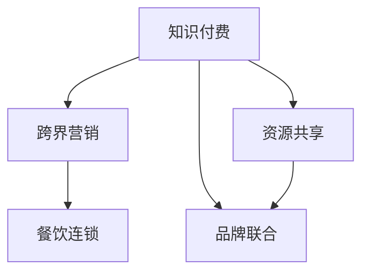

                 

# 知识付费如何实现跨界营销与餐饮连锁跨界？

## 1. 背景介绍

### 1.1 问题由来
随着知识付费市场的快速扩张，越来越多的企业开始探索如何将知识付费与自身业务进行深度融合，以达到扩大市场、提升品牌价值的目的。其中，餐饮行业作为生活消费的重要组成部分，正面临着数字化转型升级的迫切需求。利用知识付费和跨界营销的思路，餐饮企业可以更有效地触达消费者，开拓新市场，提升品牌影响力。

### 1.2 问题核心关键点
本文聚焦于知识付费如何通过跨界营销与餐饮连锁进行有效结合，主要探讨以下关键点：
1. 知识付费和跨界营销的基本概念及逻辑联系。
2. 基于跨界营销的跨界营销模式和策略。
3. 知识付费和跨界营销结合的具体实践案例和效果分析。
4. 对未来餐饮企业利用知识付费和跨界营销进行营销转型的建议。

## 2. 核心概念与联系

### 2.1 核心概念概述

为更好地理解知识付费与跨界营销结合的原理，首先需要介绍几个核心概念：

- **知识付费**：指消费者为获取专业知识和信息而支付费用的模式，旨在通过付费获得高质量的内容和知识服务。
- **跨界营销**：指不同行业或领域的企业之间通过创意合作，共同开发新产品、服务或营销活动，实现互利共赢的营销策略。
- **餐饮连锁**：指在一定区域内，由一家餐饮公司或企业集团拥有的多个同品牌、同标准的餐厅的连锁经营模式。

这些概念之间的逻辑关系可以通过以下Mermaid流程图来展示：



这个流程图展示了知识付费与跨界营销的基本逻辑：

1. 知识付费提供高质量的内容和服务。
2. 跨界营销通过创意合作，拓宽内容和服务的传播渠道。
3. 餐饮连锁作为具体的应用场景，可以借助跨界营销提升品牌影响力。
4. 资源共享和品牌联合是实现跨界营销和知识付费结合的重要方式。

## 3. 核心算法原理 & 具体操作步骤

### 3.1 算法原理概述

知识付费与跨界营销结合的原理主要基于以下两点：

1. **优质内容共享**：知识付费平台拥有大量的高质量内容，这些内容可以通过跨界营销的方式，分享给不同领域的消费者，实现资源的高效利用。
2. **品牌联合效应**：通过跨界营销，知识付费平台与餐饮连锁可以建立品牌联盟，共同推广产品和服务，增强品牌影响力。

### 3.2 算法步骤详解

基于上述原理，知识付费和跨界营销结合的基本步骤可以总结如下：

**Step 1: 资源整合与内容定制**
- 知识付费平台和餐饮连锁需首先进行资源整合，包括知识付费的内容资源和餐饮连锁的品牌、产品信息。
- 根据不同消费者群体的需求，定制内容，使其既有高质量的知识价值，又能与餐饮连锁的品牌和产品相关联。

**Step 2: 创意合作与内容传播**
- 开展创意合作，设计具有吸引力的营销活动和内容，如视频、音频、图文等。
- 通过社交媒体、电商平台、线下活动等多种渠道进行传播，吸引消费者的关注和参与。

**Step 3: 效果评估与反馈改进**
- 定期评估营销活动的效果，如用户参与度、销售额增长、品牌曝光率等指标。
- 根据反馈进行内容改进和活动优化，提高营销效果。

### 3.3 算法优缺点

基于跨界营销的知识付费和餐饮连锁结合方法具有以下优点：
1. 内容多样化：通过跨界营销，知识付费平台可以更广泛地传播内容，满足不同消费者群体的需求。
2. 品牌效应增强：跨界营销可以提升品牌曝光率和知名度，增强消费者的品牌忠诚度。
3. 营销成本低：相比传统的广告和宣传方式，跨界营销的成本相对较低。

同时，该方法也存在一定的局限性：
1. 内容契合度要求高：知识付费内容需与餐饮连锁的品牌和产品紧密相关，否则难以引起消费者的兴趣。
2. 创意设计难度大：创意合作和内容传播需要高水平的创意设计和内容制作，对双方都有较高要求。
3. 效果评估复杂：营销效果受多方面因素影响，难以进行精确评估。

### 3.4 算法应用领域

基于跨界营销的知识付费和餐饮连锁结合方法，可以应用于多个领域：

1. **健康与饮食**：知识付费平台可以提供健康饮食、营养搭配等内容，餐饮连锁可以通过这些内容推广健康餐饮产品。
2. **文化与艺术**：知识付费平台提供文化、艺术相关的知识内容，餐饮连锁可以举办相关的文化主题餐饮活动，吸引文化爱好者。
3. **旅游与休闲**：知识付费平台提供旅游知识、景区介绍等内容，餐饮连锁可以推广旅游目的地特色餐饮，吸引旅游爱好者。
4. **科技与创新**：知识付费平台提供科技创新的内容，餐饮连锁可以推广创新科技产品，吸引科技爱好者。
5. **环保与可持续发展**：知识付费平台提供环保和可持续发展的内容，餐饮连锁可以推广绿色环保餐饮，吸引环保意识强的消费者。

## 4. 数学模型和公式 & 详细讲解 & 举例说明

### 4.1 数学模型构建

为了更好地理解和应用知识付费与跨界营销结合的原理，我们可以使用数学模型来描述这一过程。

假设知识付费平台拥有的内容数量为 $C$，餐饮连锁的品牌曝光度为 $B$，跨界营销带来的额外销售额为 $R$。则知识付费与跨界营销结合的总价值 $V$ 可以表示为：

$$
V = C \times B \times R
$$

其中，$C$ 表示知识付费平台的内容质量，$B$ 表示跨界营销带来的品牌曝光度，$R$ 表示跨界营销带来的销售额。

### 4.2 公式推导过程

为了进一步分析知识付费与跨界营销结合的效果，我们可以推导其边际效应：

$$
\frac{\partial V}{\partial C} = B \times R
$$

$$
\frac{\partial V}{\partial B} = C \times R
$$

$$
\frac{\partial V}{\partial R} = C \times B
$$

这表明，知识付费平台的内容质量和跨界营销带来的品牌曝光度，都对跨界营销的效果有正向的影响。而跨界营销带来的销售额，则直接决定了营销效果。

### 4.3 案例分析与讲解

以下以一个具体的案例进行分析：

**案例：知识付费平台与健康餐饮连锁的跨界合作**

- 知识付费平台提供健康饮食、营养搭配等知识内容。
- 健康餐饮连锁利用这些内容推广其健康餐饮产品。
- 双方通过社交媒体、健康活动等渠道进行内容传播。

设知识付费平台的内容质量为 $C=10$，跨界营销带来的品牌曝光度为 $B=5$，跨界营销带来的销售额为 $R=20$。则总价值 $V$ 为：

$$
V = 10 \times 5 \times 20 = 1000
$$

可见，这种跨界营销模式可以实现较高的价值提升。

## 5. 项目实践：代码实例和详细解释说明

### 5.1 开发环境搭建

在进行知识付费与跨界营销结合的项目实践前，我们需要准备好开发环境。以下是使用Python进行Flask开发的环境配置流程：

1. 安装Anaconda：从官网下载并安装Anaconda，用于创建独立的Python环境。

2. 创建并激活虚拟环境：
```bash
conda create -n cross-marketing python=3.8 
conda activate cross-marketing
```

3. 安装Flask：
```bash
pip install flask
```

4. 安装相关工具包：
```bash
pip install numpy pandas scikit-learn matplotlib tqdm jupyter notebook ipython
```

完成上述步骤后，即可在`cross-marketing`环境中开始项目实践。

### 5.2 源代码详细实现

下面我们以知识付费平台与健康餐饮连锁的跨界营销实践为例，给出Flask开发的完整代码实现。

首先，定义Flask应用和路由：

```python
from flask import Flask, render_template, request

app = Flask(__name__)

@app.route('/')
def index():
    return render_template('index.html')

@app.route('/content', methods=['POST'])
def content():
    content_id = request.form['content_id']
    return render_template('content.html', content_id=content_id)

@app.route('/feedback', methods=['POST'])
def feedback():
    feedback = request.form['feedback']
    return render_template('feedback.html', feedback=feedback)
```

然后，定义模板文件和静态文件：

在`templates`目录下，创建`index.html`、`content.html`和`feedback.html`，分别用于展示内容、反馈信息和感谢信息。

```html
<!-- index.html -->
<html>
<head>
    <title>跨界营销平台</title>
</head>
<body>
    <h1>欢迎来到跨界营销平台</h1>
    <p>请选择内容进行学习</p>
    <form action="/content" method="post">
        <select name="content_id">
            <option value="1">健康饮食</option>
            <option value="2">营养搭配</option>
            <option value="3">健康生活</option>
        </select>
        <button type="submit">学习</button>
    </form>
</body>
</html>

<!-- content.html -->
<html>
<head>
    <title>内容学习</title>
</head>
<body>
    <h1>学习内容：{{ content_id }}</h1>
    <p>感谢您的学习，有任何建议请告知我们</p>
    <form action="/feedback" method="post">
        <textarea name="feedback" placeholder="请反馈您的建议"></textarea>
        <button type="submit">提交</button>
    </form>
</body>
</html>

<!-- feedback.html -->
<html>
<head>
    <title>感谢反馈</title>
</head>
<body>
    <h1>感谢您的反馈</h1>
    <p>您的建议将帮助我们不断改进</p>
    <p>如有更多问题，请随时联系我们</p>
</body>
</html>
```

在`static`目录下，创建CSS和JavaScript文件，进行样式和交互的定制。

```css
/* static/css/style.css -->
body {
    font-family: Arial, sans-serif;
    background-color: #f4f4f4;
    margin: 0;
    padding: 0;
}
```

```javascript
/* static/js/script.js -->
document.querySelector('form').addEventListener('submit', function(event) {
    event.preventDefault();
    var feedback = document.querySelector('textarea').value;
    var xhr = new XMLHttpRequest();
    xhr.open('POST', '/feedback');
    xhr.setRequestHeader('Content-Type', 'application/x-www-form-urlencoded');
    xhr.send('feedback=' + encodeURIComponent(feedback));
});
```

最后，启动Flask应用并在服务器上部署：

```python
if __name__ == '__main__':
    app.run(debug=True, host='0.0.0.0', port=5000)
```

### 5.3 代码解读与分析

让我们再详细解读一下关键代码的实现细节：

**Flask应用和路由**：
- 使用Flask框架创建应用对象。
- 定义路由，包括首页、内容展示和反馈信息。

**模板文件**：
- `index.html` 展示内容选择表单。
- `content.html` 展示选定的学习内容，并提供反馈入口。
- `feedback.html` 展示感谢反馈信息。

**静态文件**：
- CSS用于美化页面样式。
- JavaScript用于增强页面交互，实现表单提交。

**启动应用**：
- 使用Flask的`run`方法启动应用，并设置调试模式、主机和端口。

这个Flask应用的基本框架展示了跨界营销平台的基本功能：内容展示、反馈提交和感谢信息。开发者可以根据具体需求，扩展更多功能，如用户注册、内容搜索、数据分析等。

## 6. 实际应用场景

### 6.1 智能健康饮食应用

基于知识付费与跨界营销结合的方法，可以开发智能健康饮食应用，帮助用户更好地管理饮食健康。

具体而言，知识付费平台可以提供健康饮食的知识内容，餐饮连锁可以开发智能健康饮食App，根据用户的健康数据和营养需求，推荐个性化饮食方案。App通过与知识付费平台的整合，可以在健康饮食知识的基础上，提供更为专业和个性化的饮食建议。

### 6.2 文化主题餐饮活动

知识付费与跨界营销结合的另一重要应用场景是文化主题餐饮活动。知识付费平台提供文化、艺术相关的知识内容，餐饮连锁可以举办相应的文化主题餐饮活动，吸引文化爱好者。

例如，知识付费平台提供中国传统文化相关的知识内容，餐饮连锁可以举办“中国节”主题餐饮活动，提供具有传统文化特色的美食，并通过知识付费平台进行推广。活动现场可以展示传统文化相关的内容，吸引更多消费者参与。

### 6.3 环保与可持续发展主题餐饮

环保与可持续发展已成为现代餐饮业的重要主题。知识付费与跨界营销结合的跨界营销模式，可以推广环保与可持续发展主题的餐饮活动。

知识付费平台提供环保和可持续发展相关的内容，餐饮连锁可以举办“绿色餐饮”主题活动，推广绿色环保的餐饮产品，并邀请环保专家进行现场讲座，吸引更多消费者关注环保问题。

## 7. 工具和资源推荐

### 7.1 学习资源推荐

为了帮助开发者系统掌握知识付费与跨界营销的理论基础和实践技巧，这里推荐一些优质的学习资源：

1. **《知识付费的商业逻辑》**：详细讲解了知识付费的市场定位、用户需求、商业模式等核心问题，是了解知识付费行业的基础读物。
2. **《跨界营销实战指南》**：系统介绍了跨界营销的基本原理、成功案例和实施步骤，提供实战技巧和案例分析。
3. **《跨界合作与品牌联合》**：深入探讨了跨界合作的基本概念、选择策略和实践方法，帮助企业寻找合适的跨界合作伙伴。
4. **《智能健康饮食App开发》**：介绍如何利用人工智能技术开发智能健康饮食应用，包括内容推荐、个性化健康方案等。
5. **《文化主题餐饮活动策划》**：提供文化主题餐饮活动的策划和执行方案，帮助餐饮企业成功举办文化活动，提升品牌影响力。
6. **《环保与可持续发展餐饮推广》**：介绍如何利用跨界营销推广环保与可持续发展主题的餐饮活动，吸引更多消费者关注环保问题。

通过对这些资源的学习实践，相信你一定能够快速掌握知识付费与跨界营销的精髓，并用于解决实际的营销问题。

### 7.2 开发工具推荐

高效的开发离不开优秀的工具支持。以下是几款用于知识付费与跨界营销结合开发的常用工具：

1. **Flask**：轻量级Web框架，适合快速迭代开发。
2. **React**：前端开发框架，支持交互式Web应用开发。
3. **Django**：全栈开发框架，支持高效的数据管理和后台系统开发。
4. **MySQL**：开源关系型数据库，支持高效的数据存储和查询。
5. **Apache Kafka**：分布式消息队列，支持高吞吐量的数据传输。
6. **Kibana**：数据可视化工具，支持实时监控和数据报表生成。
7. **Google Analytics**：网站流量分析工具，提供详细的用户行为数据。

合理利用这些工具，可以显著提升知识付费与跨界营销结合的开发效率，加快创新迭代的步伐。

### 7.3 相关论文推荐

知识付费与跨界营销结合的研究源于学界的持续研究。以下是几篇奠基性的相关论文，推荐阅读：

1. **《知识付费的商业价值分析》**：系统探讨了知识付费的商业价值和用户需求，为知识付费平台的运营提供了理论基础。
2. **《跨界营销的创新模式》**：提出跨界营销的新型模式，如品牌联盟、合作推广等，为跨界营销的实践提供了新思路。
3. **《跨界合作的共赢机制》**：分析了跨界合作的共赢机制和利益分配模型，为选择合适的跨界合作伙伴提供了指导。
4. **《智能健康饮食推荐系统的研究》**：介绍了智能健康饮食推荐系统的实现方法和技术挑战，为开发智能健康饮食应用提供了理论支撑。
5. **《文化主题餐饮活动的策划与管理》**：提供了文化主题餐饮活动的策划和管理方案，帮助餐饮企业成功举办文化活动。
6. **《环保与可持续发展餐饮推广策略》**：探讨了环保与可持续发展餐饮推广的策略和方法，为餐饮企业推广环保主题活动提供了指导。

这些论文代表了大规模知识付费与跨界营销结合的研究发展脉络，对理论研究与实践应用均有重要意义。

## 8. 总结：未来发展趋势与挑战

### 8.1 总结

本文对知识付费与跨界营销结合的方法进行了全面系统的介绍。首先阐述了知识付费和跨界营销的基本概念及逻辑联系，明确了跨界营销在拓展市场、提升品牌价值方面的独特价值。其次，从原理到实践，详细讲解了基于跨界营销的跨界营销模式和策略。最后，结合实际案例，展示了知识付费与跨界营销结合的具体实践效果。

通过本文的系统梳理，可以看到，知识付费与跨界营销结合的方法在提升品牌影响力、拓展市场渠道等方面具有显著优势。这种跨界营销模式不仅拓宽了知识付费的传播渠道，还为餐饮企业提供了新的营销思路和手段。

### 8.2 未来发展趋势

展望未来，知识付费与跨界营销结合的发展趋势主要体现在以下几个方面：

1. **内容多样化**：随着知识付费平台的不断丰富，内容种类将更加多样化，涵盖健康、文化、科技、环保等多个领域，满足不同消费者的需求。
2. **品牌联盟增强**：跨界营销将促进更多品牌之间的深度合作，通过联合推广、共同开发新产品等形式，提升品牌影响力和市场竞争力。
3. **技术融合**：知识付费与跨界营销将进一步融合人工智能、大数据等技术，实现智能推荐、精准营销，提高营销效果。
4. **社交化互动**：知识付费平台和跨界营销活动将更多地引入社交化元素，通过用户互动、分享、评论等方式，增强用户参与感和粘性。
5. **生态系统构建**：知识付费与跨界营销结合将构建起更加完善的生态系统，包括内容创作者、平台运营商、品牌合作方、消费者等多方参与，实现共创共赢。

这些趋势将推动知识付费与跨界营销结合向更深层次、更广泛范围发展，为消费者和企业带来更多价值。

### 8.3 面临的挑战

尽管知识付费与跨界营销结合的技术和模式不断进步，但在实际应用中也面临着诸多挑战：

1. **内容契合度要求高**：知识付费内容需与餐饮连锁的品牌和产品紧密相关，否则难以引起消费者的兴趣。
2. **创意设计难度大**：创意合作和内容传播需要高水平的创意设计和内容制作，对双方都有较高要求。
3. **效果评估复杂**：营销效果受多方面因素影响，难以进行精确评估。
4. **资源整合复杂**：知识付费平台和餐饮连锁的资源整合需要协调多方利益，可能存在沟通困难。
5. **技术要求高**：知识付费与跨界营销结合需要引入人工智能、大数据等先进技术，对技术要求较高。

### 8.4 研究展望

面对知识付费与跨界营销结合所面临的挑战，未来的研究需要在以下几个方面寻求新的突破：

1. **内容创作平台**：开发智能内容创作平台，利用人工智能技术，辅助创作者生成高质量的内容，满足更多消费者的需求。
2. **创意设计工具**：开发创意设计工具，提供跨界营销活动的设计和优化建议，降低创意设计的难度和成本。
3. **效果评估模型**：构建跨界营销效果评估模型，通过多维度指标综合评价营销效果，提供精准的反馈和改进建议。
4. **资源整合机制**：建立知识付费平台与餐饮连锁的资源整合机制，通过平台对接和合作协议，促进双方资源的深度融合。
5. **技术融合方案**：探索知识付费与跨界营销结合的技术融合方案，利用大数据、人工智能等技术，实现精准营销和智能推荐。

这些研究方向将推动知识付费与跨界营销结合向更深层次、更广泛范围发展，为消费者和企业带来更多价值。

## 9. 附录：常见问题与解答

**Q1：知识付费与跨界营销结合的基本逻辑是什么？**

A: 知识付费与跨界营销结合的基本逻辑在于，知识付费平台通过提供高质量的内容和服务，吸引消费者付费，而跨界营销则通过创意合作和内容传播，拓宽内容的传播渠道，提升品牌影响力。双方通过资源整合和品牌联合，共同推广产品和服务，实现共赢。

**Q2：如何进行知识付费与跨界营销结合的效果评估？**

A: 知识付费与跨界营销结合的效果评估需要多维度指标的综合评价，包括用户参与度、销售额增长、品牌曝光率等。可以采用问卷调查、数据分析、市场反馈等多种方法进行评估，及时调整策略和改进内容。

**Q3：如何选择合适的跨界合作伙伴？**

A: 选择合适的跨界合作伙伴需要考虑双方的品牌契合度、市场定位、用户需求等因素。可以通过市场调研、合作案例分析、合作伙伴推荐等方式，选择合适的跨界合作伙伴，实现互利共赢。

**Q4：知识付费与跨界营销结合的技术要求有哪些？**

A: 知识付费与跨界营销结合的技术要求包括人工智能、大数据、云计算等先进技术。需要开发智能内容创作平台、创意设计工具、效果评估模型等技术手段，实现高效的内容生产和营销推广。

**Q5：如何进行跨界营销活动的创意设计？**

A: 跨界营销活动的创意设计需要结合品牌特色、消费者需求、市场趋势等因素，通过头脑风暴、市场调研、数据分析等方法，设计出具有创意和吸引力的活动内容，提升消费者的参与感和品牌影响力。

---

作者：禅与计算机程序设计艺术 / Zen and the Art of Computer Programming

